UNIVERSIDAD AUTONOMA GABRIEL RENE MORENO
FACULTAD DE INGENIERÍA EN  CIENCIAS DE LA COMPUTACIÓN Y TELECOMUNICACIONES


           

GRUPO # 9
PLATAFORMA WEB Y MÓVIL DE GESTIÓN INTEGRAL DE CITAS, EXPEDIENTES CLÍNICOS Y SEGUIMIENTO TERAPÉUTICO PARA CENTROS DE SALUD MENTAL
INTEGRANTES:
•	Condori Diaz Marilyn Esther				224051237
•	Delgado Rojas Alberto Caleb 			224027204
•	Larrazabal Rojas Julio Cesar				223049255
•	Mujica Vallejos Andy Mauricio			224028367
•	Romero Saavedra Maria Ilse				222009772
•	Velasco Soliz Rolando				223044768
 
ÍNDICE
PERFIL	2
1. INTRODUCCIÓN	3
2 ANTECEDENTES	3
FUNDAMENTACIÓN TEÓRICA	4
SISTEMAS SIMILARES	5
CASOS DE ESTUDIO	6
Caso de estudio 1: MentalGest	6
Caso de estudio 2: Talkspace	7
Caso de estudio 3: Spring Health	7
Relación de los casos de estudio con el proyecto	8
3 JUSTIFICACIÓN	9
4 DESCRIPCIÓN DEL PROBLEMA	10
5 FORMULACIÓN DEL PROBLEMA	15
6 OBJETIVOS	16
6.1 Objetivo General	17
6.2 Objetivos Específicos	17
7 ALCANCE	17
7.1 Módulo de Gestión de Usuarios, Roles, Seguridad y Multi-Tenant	18
7.2 Módulo de Panel Administrativo (Dashboard) y Alertas de Priorización	18
7.3 Módulo de Gestión de Psicólogos y Pacientes	19
7.4 Módulo de Agenda, Citas y Videoconferencias	19
7.5 Módulo de Historia Clínica, Formulario Previo, Notas y Seguimiento	20
7.6 Módulo de Aplicación Móvil para Pacientes	20
7.7 Módulo de Inteligencia Artificial Asistida y Chatbot de Orientación	21
7.8 Módulo de Reportes Administrativos y Clínicos	22
7.9 Módulo de Control de Pagos	22
7.10. Funcionalidades	23
7.10.1. Funcionalidades Web	23
7.10.2. Funcionalidades Móvil	23
7.10.3. Funcionalidades IA	23
8 ELEMENTOS DEL SIBC	24
8.1 HARDWARE	25
8.2 SOFTWARE	25
8.3 DATOS	27
8.4 PROCESOS	27
8.5 GENTE / USUARIO	28
8.6 DOCUMENTO	28
9 TECNOLOGÍA	28
9.1 Tecnología para el Desarrollo	29
9.2 Tecnología para la Puesta en Marcha	29
10 COSTOS PARA LA PUESTA EN MARCHA	30
11. BENEFICIOS PARA EL CLIENTE	32
Tiempo	33
Esfuerzo Humano	33
Costos	34
Accesibilidad y Adherencia al Tratamiento	34
CAPÍTULO 1 – MARCO TEÓRICO	35
1.1 MARCO REFERENCIAL	36
1.1.1 Salud Mental	36
1.1.2 Psicología Clínica	36
1.1.3 Centros Psicológicos y Gabinetes	36
1.1.4 Historia Clínica Psicológica	37
1.1.5 Proceso Terapéutico	37
1.1.6 Consentimiento Informado en Psicología	38
1.1.7 Teleconsulta y Telepsicología	38
1.1.8 Inteligencia Artificial Aplicada a la Salud Mental	38
1.1.9 Modelo SaaS Multi-Tenant	39
1.2 MARCO DE TRABAJO ÁGIL SCRUM	39
1.2.1 Introducción al Manifiesto Ágil	39
1.2.2 Los Doce Principios del Manifiesto Ágil	40
1.2.3 ¿Qué es SCRUM?	40
1.2.4 Roles en SCRUM	41
1.2.5 Eventos de SCRUM	42
1.2.6 Artefactos de SCRUM	42
1.2.7 Historias de Usuario	43
1.2.8 Aplicación de SCRUM en el Proyecto	44
CAPÍTULO 2 – HERRAMIENTAS TECNOLÓGICAS PARA EL DESARROLLO	45
2.1 LENGUAJE DE PROGRAMACIÓN	46
2.1.1 Python (Backend)	46
2.1.2 TypeScript (Frontend Web)	46
2.1.3 Dart (Desarrollo Móvil)	46
2.2 FRAMEWORKS Y ENTORNOS DE EJECUCIÓN	47
2.2.1 Django / Django REST Framework (Backend Web)	47
2.2.2 Angular (Frontend Web)	47
2.2.3 Flutter (Desarrollo Móvil)	47
2.3 SISTEMA GESTOR DE BASE DE DATOS	47
2.3.1 PostgreSQL	48
2.4 LENGUAJE DE MODELADO DE SOFTWARE (MODELO C4)	48
2.5 HERRAMIENTA DE DISEÑO Y MODELADO	48
2.5.1 Figma	48
2.5.2 Enterprise Architect / Herramientas UML	48
2.6 ENTORNO DE DESARROLLO	49
2.6.1 Visual Studio Code	49
2.7 INFRAESTRUCTURA DE SOFTWARE (IaaS)	49
2.7.1 SERVICIO EN LA NUBE (CLOUD COMPUTING)	49
2.7.2 SaaS (SOFTWARE AS A SERVICE)	49
2.8 HERRAMIENTAS COLABORATIVAS PARA SEGUIMIENTO DE PROYECTOS	50
2.8.1 Jira Software	50
2.9 SISTEMA DE CONTROL DE VERSIONES DE CÓDIGO (GIT)	50
2.10 HERRAMIENTAS DE GESTIÓN DE CÓDIGO EN LA NUBE	51
2.10.1 GitHub	51
CAPÍTULO 3 – REQUERIMIENTOS	51
3.1 Propósito	52
3.2 Ámbito de Sistema	52
3.3. Equipo SCRUM	52
3.3.1. Product Owner	52
3.3.2. Stakeholders	52
3.3.3. Scrum Master	53
3.3.4. Scrum Development	53
3.4 Definiciones, Acrónimos y Abreviaturas	53
3.5 Funciones del Producto	54
3.6 Product Backlog	56
3.7 Requisitos Funcionales (Elaborar tabla App web y movil)	61
3.8 Requisitos no funcionales	68
3.9 Lista de casos de uso (web y móvil)	70
3.10 Paquetes y casos de Uso	72
3.11 Planificación Sprint (Diagrama de Gantt)	75
CAPÍTULO 4 – DESARROLLO SPRINT 0	76
4.1 Sprint Planning	76
4.1.1 Objetivos del Sprint	76
4.1.2 Historias de Usuario (Tarjetas 3C, Planning Poker, Prototipos)	77
4.1.3 Contexto del Sistema	83
4.1.4 Sprint Backlog	84
4.1.5 Equipo SCRUM	85
4.2 Proceso de Desarrollo por Historia de Usuario	86
4.2.1 Diseño (Arquitectura, Datos, Lógica de Negocio)	86
4.2.2 Implementación (Componentes y Artefactos)	88
4.2.3 Pruebas (Plan de Pruebas y Reporte)	89
4.3 Daily Scrum	91
4.4 Sprint Review	92
4.5 Sprint Retrospective	93
4.6 Burndown y Burnup	94
4.7 Gráfica de Esfuerzo y Datos de Esfuerzo	95
4.8 Scrum Taskboard	96


# CAPÍTULO 4 – DESARROLLO SPRINT 1

El presente capítulo documenta el desarrollo completo del **Sprint 1** del proyecto **SIGEPSI** (Plataforma Web y Móvil de Gestión de Centros de Salud Mental), siguiendo la estructura definida por el marco de trabajo ágil SCRUM y las directrices metodológicas de la asignatura. Se incluyen la planificación detallada, las historias de usuario bajo el modelo de las 3C, el proceso de desarrollo por historia (diseño arquitectónico, diseño de datos, lógica de negocio con diagramas de comunicación BCE y diagramas de actividad en PlantText/PlantUML), la implementación en backend, frontend web y aplicación móvil, el plan y reporte de pruebas de caja negra, el seguimiento diario (Daily Scrum), la revisión de sprint, la retrospectiva, las métricas de Burndown/Burnup, el análisis comparativo de esfuerzo y el Scrum Taskboard final.

---

## 4.1 SPRINT PLANNING

### 4.1.1 Objetivos del Sprint 1
Tras haber consolidado en el Sprint 0 la infraestructura base, el aislamiento Multi-Tenant por esquemas en PostgreSQL y el módulo transversal de autenticación segura (JWT) con asignación de roles y permisos (RBAC), el **Sprint 1** tiene como propósito central implementar el núcleo operativo, clínico y de atención de la plataforma SIGEPSI, abarcando tanto la plataforma web (Angular 17) como la aplicación móvil (Flutter 3.x) y los servicios backend (Django 5.x REST Framework).

Al finalizar este Sprint, el equipo entrega un incremento de software utilizable y potencialmente desplegable que comprende:
1. **Gestión Integral de Psicólogos y Perfiles Profesionales:** Registro, edición y consulta de psicólogos, especialidades clínicas, número de colegiado, biografía, modalidades de atención (presencial, virtual o mixta) y tarifas de consulta.
2. **Gestión de Disponibilidad Horaria y Carga de Trabajo:** Configuración de franjas de atención por día de la semana, duración de bloques de sesión y control de saturación operativa de los terapeutas.
3. **Gestión de Pacientes (Web y Móvil):** Registro y consulta de expedientes de pacientes, datos sociodemográficos, contactos de emergencia y sincronización de perfiles tanto en el portal administrativo web como en la app móvil del paciente.
4. **Agenda Psicológica y Motor de Citas:** Programación interactiva de citas, reservas con verificación automática de disponibilidad y solapamientos, confirmación, reprogramación y cancelación sujeta a políticas institucionales.
5. **Módulo de Teleconsulta y Videoconferencias:** Generación dinámica de salas virtuales seguras mediante la integración de Jitsi Meet (WebRTC), permitiendo la atención a distancia desde el navegador web y la aplicación móvil.
6. **Dashboard Administrativo y Clínico:** Visualización en tiempo real de indicadores clave de desempeño (KPIs): volumen de citas del día/semana, pacientes activos, tasa de inasistencia (no-show) y distribución de carga por profesional.
7. **Gestión de Alertas de Priorización Temprana:** Detección de patrones críticos como inasistencias reiteradas o riesgo de abandono de tratamiento.

Duración del Sprint: 12 días (26 de agosto al 06 de septiembre de 2026)  
Fecha de presentación: 08 y 10 de septiembre de 2026  
Casos de uso involucrados: CU6, CU7, CU8, CU9, CU10, CU11, CU13  
Requisitos funcionales asociados: RF-04, RF-06, RF-07, RF-14, RF-15, RF-16  

<br>

| ID | Descripción | Estado | Móvil | Web | Sprint |
| :---: | :--- | :---: | :---: | :---: | :---: |
| **CU6** | Gestionar psicólogos y perfiles profesionales | Propuesto | | X | SP1 |
| **CU7** | Gestionar pacientes | Propuesto | X | X | SP1 |
| **CU8** | Gestionar disponibilidad y carga de trabajo de psicólogos | Propuesto | | X | SP1 |
| **CU9** | Consultar Dashboard e indicadores del centro psicológico | Propuesto | | X | SP1 |
| **CU10** | Gestionar alertas de priorización y seguimiento | Propuesto | | X | SP1 |
| **CU11** | Gestionar citas y agenda psicológica | Propuesto | X | X | SP1 |
| **CU13** | Gestionar teleconsultas y videoconferencias | Propuesto | X | X | SP1 |

<br>

**Cronograma y Tabla de Fechas del Sprint 1:**

| Hito / Actividad | Fecha de Inicio | Fecha de Fin | Duración | Estado |
| :--- | :---: | :---: | :---: | :---: |
| Planificación del Sprint (Sprint Planning) | 26 de agosto de 2026 | 26 de agosto de 2026 | 1 día | Concluido |
| Desarrollo, Integración (Web / Móvil) y Daily Scrum | 26 de agosto de 2026 | 05 de septiembre de 2026 | 11 días | Concluido |
| Pruebas de Calidad (QA) y Ajustes de Integración | 05 de septiembre de 2026 | 06 de septiembre de 2026 | 2 días | Concluido |
| Revisión del Sprint (Sprint Review) | 06 de septiembre de 2026 | 06 de septiembre de 2026 | 1 día | Concluido |
| Retrospectiva del Sprint (Sprint Retrospective) | 06 de septiembre de 2026 | 06 de septiembre de 2026 | 1 día | Concluido |
| Entrega Formal del Documento de Sprint 1 | 06 de septiembre de 2026 | 06 de septiembre de 2026 | 1 día | Concluido |
| Presentación y Defensa del Sprint 1 (Docente) | 08 de septiembre de 2026 | 10 de septiembre de 2026 | 2 días | Programado |

---

### 4.1.2 Historias de Usuario del Sprint 1
Para la formulación de las historias de usuario se aplicó el modelo de las **3C** (Card, Conversation, Confirmation) propuesto por Ron Jeffries:
* **Tarjeta (Card):** Formulación concisa del requerimiento bajo la estructura estándar: *"Como [rol], quiero [acción/funcionalidad], para [beneficio/valor obtenido]"*.
* **Conversación (Conversation):** Interacción continua entre el Product Owner, el Scrum Master y el Equipo de Desarrollo para clarificar las reglas de negocio (políticas de cancelación de citas, intervalos de disponibilidad y enlaces JWT de teleconsulta).
* **Confirmación (Confirmation):** Definición rigurosa de los criterios de aceptación en formato BDD (*"Dado que... cuando... entonces..."*), que operan como la base directa para los casos de prueba funcionales de caja negra.

#### Estimación del Esfuerzo mediante Planning Poker
La estimación del esfuerzo relativo de cada historia de usuario se realizó mediante la técnica de **Planning Poker** utilizando la secuencia de Fibonacci modificada ($1, 2, 3, 5, 8, 13$). Las votaciones se realizaron de forma individual y simultánea, resolviendo las divergencias mediante discusión técnica hasta alcanzar el consenso del equipo en Puntos de Historia de Usuario (PHU).

#### Resumen de Historias de Usuario del Sprint 1

| ID | Título | Prioridad | PHU | Desarrollador a cargo | Prototipo Asociado (Figma) |
| :--- | :--- | :---: | :---: | :--- | :--- |
| **HU-11** | Gestión de perfiles y especialidades de psicólogos | Alta | 5 | Mujica Vallejos Andy Mauricio | Pantalla Directorio y Perfil Psicólogo (Web) |
| **HU-12** | Configuración de disponibilidad y carga horaria | Alta | 5 | Romero Saavedra Maria Ilse | Pantalla Matriz de Disponibilidad Semanal |
| **HU-13** | Registro y expediente clínico básico del paciente | Alta | 5 | Romero Saavedra Maria Ilse | Pantalla Gestión y Ficha de Paciente (Web) |
| **HU-14** | Registro y consulta de perfil de paciente en app móvil | Alta | 5 | Delgado Rojas Alberto Caleb | Pantalla Perfil y Datos Personales (Móvil) |
| **HU-15** | Programación y reserva de citas en plataforma web | Alta | 8 | Mujica Vallejos Andy Mauricio | Pantalla Calendario y Reserva de Citas (Web) |
| **HU-16** | Consulta y reserva de citas desde la app móvil | Alta | 5 | Delgado Rojas Alberto Caleb | Pantalla Mis Citas y Reservar Cita (Móvil) |
| **HU-17** | Reprogramación y cancelación de citas con validación de anticipación | Media | 5 | Mujica Vallejos Andy Mauricio | Modal Reprogramar / Cancelar Cita |
| **HU-18** | Sala de teleconsulta con Jitsi Meet en plataforma web | Alta | 8 | Mujica Vallejos Andy Mauricio | Pantalla Videoconsulta WebRTC (Web) |
| **HU-19** | Acceso a videollamada de teleconsulta desde app móvil | Alta | 5 | Delgado Rojas Alberto Caleb | Pantalla Sala de Teleconsulta (Móvil) |
| **HU-20** | Dashboard administrativo y clínico con KPIs en tiempo real | Alta | 8 | Larrazabal Rojas Julio Cesar | Pantalla Dashboard Indicadores y Métricas |
| **HU-21** | Alertas de priorización y seguimiento de inasistencias | Media | 5 | Romero Saavedra Maria Ilse | Panel de Notificaciones y Alertas Clínicas |
| **HU-22** | Calendario interactivo multi-vista de agenda clínica | Media | 5 | Larrazabal Rojas Julio Cesar | Vista Calendario Semanal / Diario por Profesional |
| **TOTAL** | **Esfuerzo planificado en Historias de Usuario** | — | **69 PHU** | **Equipo SCRUM (6 integrantes)** | **12 prototipos interactivos** |

---

### Detalle de Historias de Usuario (Tarjetas 3C en Formato Oficial)

#### Historia de Usuario HU-11
| **Título:** | **Gestión de perfiles y especialidades de psicólogos** |
| :--- | :--- |
| **ID:** HU-11 *(CU6, RF-07)* | **Descripción:** Como Administrador del Centro, quiero registrar y actualizar los perfiles profesionales de los psicólogos (especialidades, colegiatura, biografía, tarifa y modalidad), para que el centro disponga de un directorio profesional confiable para la asignación de pacientes. |
| **Prioridad / Valor:** Alta | **Estimación PHU:** 5 |
| **Criterios de aceptación:** | • **a)** Dado que soy Administrador autenticado, cuando completo el formulario de psicólogo con número de colegiado válido, tarifa base y al menos una especialidad clínica activa, entonces el sistema guarda el perfil y lo vincula a la cuenta de usuario del esquema tenant.<br>• **b)** Dado que ingreso un número de colegiado que ya está registrado para otro profesional en el mismo centro, cuando intento guardar, entonces el sistema rechaza la operación y notifica que el código profesional ya se encuentra en uso.<br>• **c)** Dado que edito la biografía o agrego nuevas especialidades a un psicólogo existente, cuando presiono guardar, entonces los cambios se reflejan de inmediato en la lista del directorio y en los filtros de búsqueda. |
| **Desarrollador a cargo:** | Mujica Vallejos Andy Mauricio &nbsp;&nbsp;\|&nbsp;&nbsp; **Prototipo:** Pantalla Directorio y Perfil Psicólogo (Figma)<br>**Prompt para IA (Generación UI):** *"UI/UX web design of a professional psychologist directory and profile management screen for a mental health platform named SIGEPSI, Angular 17 style. Clean light mode with teal and indigo tones. Main view includes search bar with specialty filters (Terapia Cognitivo-Conductual, Infanto-Juvenil, Pareja) and a grid of therapist profile cards showing avatar photo, full name, professional license number (Colegiatura), active specialties badges, consultation fee (Bs. 180), modalities accepted (Presencial / Virtual), and action buttons 'Editar Perfil' and 'Ver Horarios'. Modern SaaS medical typography Inter, high fidelity Figma UI, crisp layout, 4k."*  |

<br>

#### Historia de Usuario HU-12
| **Título:** | **Configuración de disponibilidad y carga horaria** |
| :--- | :--- |
| **ID:** HU-12 *(CU8, RF-07)* | **Descripción:** Como Psicólogo, quiero configurar mis bloques de disponibilidad horaria por día de la semana y la duración de mis sesiones, para que los recepcionistas y pacientes solo puedan agendar citas en mis horarios efectivamente disponibles. |
| **Prioridad / Valor:** Alta | **Estimación PHU:** 5 |
| **Criterios de aceptación:** | • **a)** Dado que soy Psicólogo autenticado, cuando defino mi horario de atención (ej. Lunes de 08:00 a 12:00 con bloques de 45 minutos), entonces el sistema genera automáticamente los intervalos disponibles para reserva.<br>• **b)** Dado que intento configurar un bloque cuya hora de inicio sea posterior o igual a la hora de fin, cuando envío el formulario, entonces el sistema muestra un mensaje de validación indicando la inconsistencia temporal.<br>• **c)** Dado que ya poseo citas pactadas en un intervalo determinado, si intento desactivar ese día de disponibilidad, entonces el sistema advierte que existen citas activas y solicita reubicarlas antes de consolidar el cambio. |
| **Desarrollador a cargo:** | Romero Saavedra Maria Ilse &nbsp;&nbsp;\|&nbsp;&nbsp; **Prototipo:** Pantalla Matriz de Disponibilidad Semanal (Figma)<br>**Prompt para IA (Generación UI):** *"UI/UX web application screen of a weekly schedule and shift availability matrix for psychologists in mental health clinic SIGEPSI, Angular style. Clean modern design with soft neutral background and purple/teal accents. Left panel with therapist summary and consultation duration selector (30 min, 45 min, 60 min). Center view displays an interactive weekly schedule matrix (Monday to Saturday) with toggle switches for active days and configurable time blocks (e.g. 08:00 - 12:00, 14:00 - 18:00) with visual time chip tags and 'Agregar Franja' button. Clear warning notice for active appointments conflict. High fidelity Figma mockup, clean UI kit, 4k."*  |

<br>

#### Historia de Usuario HU-13
| **Título:** | **Registro y expediente clínico básico del paciente en web** |
| :--- | :--- |
| **ID:** HU-13 *(CU7, RF-06)* | **Descripción:** Como Recepcionista o Administrador, quiero registrar a un nuevo paciente con sus datos personales, sociodemográficos y contacto de emergencia, para abrir su expediente clínico digital dentro del centro. |
| **Prioridad / Valor:** Alta | **Estimación PHU:** 5 |
| **Criterios de aceptación:** | • **a)** Dado que ingreso datos completos de un paciente (nombres, apellidos, CI, fecha de nacimiento, teléfono y contacto de emergencia), cuando presiono registrar, entonces el sistema crea la ficha del paciente asignándole un código de expediente único dentro del tenant.<br>• **b)** Dado que intento registrar un paciente con un documento de identidad (CI) ya existente en el centro, cuando el sistema valida los datos, entonces bloquea el registro duplicado y muestra un enlace directo al expediente existente.<br>• **c)** Dado que un paciente es menor de edad (menor a 18 años calculado por fecha de nacimiento), cuando se procesa el formulario, entonces el sistema exige obligatoriamente los datos del tutor o apoderado legal. |
| **Desarrollador a cargo:** | Romero Saavedra Maria Ilse &nbsp;&nbsp;\|&nbsp;&nbsp; **Prototipo:** Pantalla Gestión y Ficha de Paciente (Figma - Larrazabal Julio Cesar)<br>**Prompt para IA (Generación UI):** *"UI/UX desktop web design for clinical patient registration and electronic health record intake form for SIGEPSI mental health system, Angular 17. Clean clinical light theme. Form organized in modern card sections: Personal Identification (Full Name, CI/DNI, Date of Birth, Gender), Emergency Contact with legal guardian toggle for minors under 18 showing guardian full name and phone number. Top header with patient code badge 'EXP-2026-084'. Tabbed navigation for Personal Info, Consultation History, and Active Alerts. Modern clean form inputs, floating labels, validation states, Figma design system, 4k."*  |

<br>

#### Historia de Usuario HU-14
| **Título:** | **Registro y consulta de perfil de paciente en app móvil** |
| :--- | :--- |
| **ID:** HU-14 *(CU7, RF-06)* | **Descripción:** Como Paciente, quiero registrarme y consultar mi perfil desde la aplicación móvil Flutter, para mantener actualizados mis datos de contacto y acceder a los servicios psicológicos de mi centro. |
| **Prioridad / Valor:** Alta | **Estimación PHU:** 5 |
| **Criterios de aceptación:** | • **a)** Dado que descargo la app móvil e ingreso mi código de centro (tenant), cuando lleno mi formulario de registro con correo y contraseña válidos, entonces el sistema crea mi usuario con rol Paciente y me permite iniciar sesión automáticamente.<br>• **b)** Dado que estoy autenticado en la app móvil, cuando accedo a la sección 'Mi Perfil', entonces puedo visualizar y actualizar mi número telefónico, dirección y contacto de emergencia.<br>• **c)** Dado que se interrumpe la conexión a Internet durante la actualización del perfil, cuando la app detecta el error de red, entonces muestra un mensaje amigable indicando que no se pudo conectar al servidor del centro y mantiene los datos locales intactos. |
| **Desarrollador a cargo:** | Delgado Rojas Alberto Caleb &nbsp;&nbsp;\|&nbsp;&nbsp; **Prototipo:** Pantalla Perfil y Datos Personales Móvil (Figma)<br>**Prompt para IA (Generación UI):** *"Mobile app UI design for patient personal profile screen in Flutter 3 style on an iPhone 15 Pro mockup for SIGEPSI mental health app. Modern soothing pastel blue and mint green palette. Top app bar with back arrow and center title 'Mi Perfil'. User avatar circle with camera edit badge, patient full name 'Sofía Beltrán', and tenant clinic badge 'Centro San Rafael'. Card list displaying editable fields: phone number, residential address, emergency contact person and phone, and security options. Primary button 'Guardar Cambios' with smooth corner radius. Clean mobile UX, high fidelity Figma mockup, 4k."*  |

<br>

#### Historia de Usuario HU-15
| **Título:** | **Programación y reserva de citas en plataforma web** |
| :--- | :--- |
| **ID:** HU-15 *(CU11, RF-14)* | **Descripción:** Como Recepcionista o Psicólogo, quiero programar una cita seleccionando paciente, terapeuta, modalidad (presencial/virtual) y fecha/hora, para organizar la atención clínica sin solapamientos. |
| **Prioridad / Valor:** Alta | **Estimación PHU:** 8 |
| **Criterios de aceptación:** | • **a)** Dado que selecciono un psicólogo, una fecha y un bloque disponible, cuando asigno un paciente y confirmo la reserva, entonces el sistema registra la cita con estado 'Programada' y bloquea dicho slot para evitar dobles reservas.<br>• **b)** Dado que dos usuarios intentan reservar simultáneamente el mismo bloque del mismo psicólogo, cuando el segundo usuario envía la solicitud, entonces el sistema detecta la colisión mediante concurrencia pesimista/transaccional y notifica que el horario acaba de ser ocupado.<br>• **c)** Dado que la modalidad elegida es 'Virtual', cuando se confirma la cita, entonces el sistema crea automáticamente un registro de teleconsulta con identificador único de sala Jitsi Meet. |
| **Desarrollador a cargo:** | Mujica Vallejos Andy Mauricio &nbsp;&nbsp;\|&nbsp;&nbsp; **Prototipo:** Pantalla Calendario y Reserva de Citas Web (Figma)<br>**Prompt para IA (Generación UI):** *"UI/UX web modal and page for booking psychological appointments in SIGEPSI, Angular 17. Clean SaaS modal dialog overlaid on a blurred clinic dashboard. Left section has doctor selection with avatar, specialty, and modality selector pills: 'Presencial (Consultorio 3)' or 'Teleconsulta (Jitsi Meet)'. Center shows an interactive mini calendar and available time slots (chips: 09:00, 10:00, 11:00, 15:00) with real-time collision detection badge 'Horario Disponible'. Bottom input for reason of consultation and primary confirm button 'Confirmar Reserva'. High fidelity Figma mockup, modern healthcare UI, 4k."*  |

<br>

#### Historia de Usuario HU-16
| **Título:** | **Consulta y reserva de citas desde la app móvil** |
| :--- | :--- |
| **ID:** HU-16 *(CU11, RF-14)* | **Descripción:** Como Paciente autenticado en la app móvil, quiero ver el listado de mis citas (próximas e históricas) y solicitar una nueva cita según la disponibilidad de mi psicólogo, para gestionar mis consultas de salud mental desde mi teléfono. |
| **Prioridad / Valor:** Alta | **Estimación PHU:** 5 |
| **Criterios de aceptación:** | • **a)** Dado que ingreso al módulo 'Mis Citas' en la app Flutter, cuando la pantalla carga, entonces muestra mis citas ordenadas cronológicamente con tarjetas visuales diferenciadas por estado (Programada, Confirmada, Realizada, Cancelada).<br>• **b)** Dado que elijo la opción 'Nueva Cita', selecciono mi psicólogo y escojo un horario disponible, cuando presiono confirmar, entonces la solicitud se envía al backend y la cita aparece inmediatamente en mi listado.<br>• **c)** Dado que selecciono una cita virtual programada para hoy, cuando faltan menos de 15 minutos para la hora fijada, entonces se activa un botón visible de 'Ingresar a Teleconsulta'. |
| **Desarrollador a cargo:** | Delgado Rojas Alberto Caleb &nbsp;&nbsp;\|&nbsp;&nbsp; **Prototipo:** Pantalla Mis Citas y Reservar Cita Móvil (Figma)<br>**Prompt para IA (Generación UI):** *"Mobile application UI screen for patient appointment management 'Mis Citas' in Flutter 3 for SIGEPSI on iOS/Android device. Soothing mental wellness colors, teal and lavender accents. Segmented control with tabs 'Próximas' and 'Historial'. Cards for upcoming sessions showing psychologist photo, name, date badge 'Jueves 3 Sept - 10:00 AM', session type 'Teleconsulta Virtual', and color badge 'Confirmada' in emerald green. Card has an active prominent button 'Ingresar a Teleconsulta' with a video icon. Floating action button '+' to book a new appointment. High fidelity Figma UI, 4k."*  |

<br>

#### Historia de Usuario HU-17
| **Título:** | **Reprogramación y cancelación de citas con validación de anticipación** |
| :--- | :--- |
| **ID:** HU-17 *(CU11, RF-15)* | **Descripción:** Como Usuario (Recepcionista o Paciente), quiero cancelar o reprogramar una cita pactada, respetando las políticas de anticipación horaria configuradas por el centro, para optimizar los cupos de atención. |
| **Prioridad / Valor:** Media | **Estimación PHU:** 5 |
| **Criterios de aceptación:** | • **a)** Dado que un paciente solicita cancelar una cita con más de 24 horas de anticipación, cuando se procesa la solicitud, entonces el sistema cambia el estado a 'Cancelada', libera el bloque en la agenda del psicólogo y registra el motivo de cancelación.<br>• **b)** Dado que un paciente intenta cancelar una cita con menos de 2 horas de anticipación desde la app móvil, cuando presiona cancelar, entonces el sistema le advierte que está fuera de la política de cancelación y le indica comunicarse con recepción.<br>• **c)** Dado que se reprograma una cita, cuando se selecciona un nuevo horario válido, entonces el sistema actualiza la fecha/hora de la cita existente sin perder el historial ni el código de seguimiento. |
| **Desarrollador a cargo:** | Mujica Vallejos Andy Mauricio &nbsp;&nbsp;\|&nbsp;&nbsp; **Prototipo:** Modal Reprogramar / Cancelar Cita (Figma)<br>**Prompt para IA (Generación UI):** *"UI/UX modal pop-up design for rescheduling or canceling a clinical appointment in psychological platform SIGEPSI, Angular 17. Centered clean dialog with backdrop blur. Top alert notice in amber: 'Cancelación sin recargo permitida hasta 24 horas antes'. Two distinct action tabs: 'Reprogramar Cita' with date picker and available time slots chips, and 'Cancelar Cita' with dropdown for cancellation reason (Motivo personal, Salud, Cruce de horarios) and optional text feedback. Actions: secondary ghost button 'Volver' and danger button 'Confirmar Cancelación'. Clean medical SaaS UX, Figma mockup, 4k."*  |

<br>

#### Historia de Usuario HU-18
| **Título:** | **Sala de teleconsulta con Jitsi Meet en plataforma web** |
| :--- | :--- |
| **ID:** HU-18 *(CU13, RF-16)* | **Descripción:** Como Psicólogo, quiero iniciar una sesión virtual por videollamada cifrada con mi paciente desde el navegador, para prestar atención psicológica a distancia con audio y video estables. |
| **Prioridad / Valor:** Alta | **Estimación PHU:** 8 |
| **Criterios de aceptación:** | • **a)** Dado que el psicólogo hace clic en 'Iniciar Sesión Virtual' en una cita virtual vigente, cuando el componente carga, entonces se instancia el Jitsi Meet External API embebido con el nombre de sala seguro del tenant y el psicólogo entra con permisos de moderador.<br>• **b)** Dado que el paciente entra a la sala web, cuando ambos están conectados, entonces pueden interactuar con audio bidireccional, video HD y visualización de temporizador de sesión.<br>• **c)** Dado que el psicólogo presiona 'Finalizar Consulta', cuando se confirma el cierre, entonces el sistema cierra la sala virtual, calcula la duración real de la sesión y actualiza el estado de la cita a 'Realizada'. |
| **Desarrollador a cargo:** | Mujica Vallejos Andy Mauricio &nbsp;&nbsp;\|&nbsp;&nbsp; **Prototipo:** Pantalla Videoconsulta WebRTC (Figma - Larrazabal Julio Cesar)<br>**Prompt para IA (Generación UI):** *"UI/UX desktop web screen for encrypted telehealth psychological video consultation using embedded Jitsi Meet in SIGEPSI, Angular 17. Dark elegant teletherapy room layout. Main central video area showing the patient in high definition, with picture-in-picture floating window of the psychologist in the bottom right corner. Bottom floating glassmorphic control dock with mute audio, toggle video, end call (red button), secure chat panel toggle, and digital session timer showing '34:12 / 50:00 min'. Top bar with patient name, encrypted lock icon, and quick clinical notes sidebar toggle. High fidelity Figma UI, professional telepsychology SaaS, 4k."*  |

<br>

#### Historia de Usuario HU-19
| **Título:** | **Acceso a videollamada de teleconsulta desde app móvil** |
| :--- | :--- |
| **ID:** HU-19 *(CU13, RF-16)* | **Descripción:** Como Paciente, quiero unirme a la sesión de teleconsulta directamente desde la app móvil Flutter, para recibir mi atención psicológica cómodamente desde mi smartphone sin instalar aplicaciones externas. |
| **Prioridad / Valor:** Alta | **Estimación PHU:** 5 |
| **Criterios de aceptación:** | • **a)** Dado que una cita virtual está dentro del rango horario permitido, cuando el paciente presiona 'Unirse a Videollamada', entonces la app solicita permisos de micrófono/cámara y lanza la vista nativa de Jitsi Meet con controles táctiles optimizados.<br>• **b)** Dado que el paciente pierde temporalmente la conexión WiFi/datos durante la llamada, cuando la red se restablece, entonces el SDK de Jitsi reconecta automáticamente a la sala sin expulsar al usuario de la cita.<br>• **c)** Dado que la cita no corresponde al día actual o fue cancelada, cuando el usuario intenta ingresar, entonces el botón permanece inactivo con un mensaje explicativo del motivo. |
| **Desarrollador a cargo:** | Delgado Rojas Alberto Caleb &nbsp;&nbsp;\|&nbsp;&nbsp; **Prototipo:** Pantalla Sala de Teleconsulta Móvil (Figma)<br>**Prompt para IA (Generación UI):** *"Mobile app UI design for telehealth video session in Flutter 3 on a smartphone for mental health patient in SIGEPSI. Fullscreen immersive video layout showing the psychologist speaking on full display with soft lighting and professional office background, patient self-view in a small top-right rounded corner thumbnail. Bottom semi-transparent floating action bar with rounded touch buttons: microphone mute, camera flip, chat overlay toggle, and red end-session button. Top overlay shows connection status indicator 'HD Seguro' and call duration timer '18:45'. Modern mobile UX, Figma style, 4k."*  |

<br>

#### Historia de Usuario HU-20
| **Título:** | **Dashboard administrativo y clínico con KPIs en tiempo real** |
| :--- | :--- |
| **ID:** HU-20 *(CU9, RF-04)* | **Descripción:** Como Administrador o Coordinador del Centro, quiero un panel visual con indicadores de citas del día, pacientes activos, tasa de ausentismo y ocupación por terapeuta, para monitorear la operatividad del centro en tiempo real. |
| **Prioridad / Valor:** Alta | **Estimación PHU:** 8 |
| **Criterios de aceptación:** | • **a)** Dado que el Administrador accede al Dashboard, cuando la página carga, entonces se visualizan cuatro tarjetas principales (Citas Hoy, Pacientes Activos del Mes, Tasa de Inasistencia %, Ocupación Promedio %) calculadas con datos del tenant.<br>• **b)** Dado que se filtran las métricas por rango de fechas (semana/mes), cuando se aplica el filtro, entonces los gráficos de barras y líneas se redibujan dinámicamente reflejando la evolución de atenciones.<br>• **c)** Dado que un usuario con rol 'Psicólogo' accede al Dashboard, entonces el sistema filtra automáticamente las métricas mostrando únicamente sus propias estadísticas y no las de otros profesionales. |
| **Desarrollador a cargo:** | Larrazabal Rojas Julio Cesar &nbsp;&nbsp;\|&nbsp;&nbsp; **Prototipo:** Pantalla Dashboard Indicadores y Métricas (Figma)<br>**Prompt para IA (Generación UI):** *"UI/UX analytics dashboard design for clinical mental health clinic management SIGEPSI, Angular 17 desktop view. Modern clean layout with soft neutral grey background. Top metrics row with four key KPI metric cards: 'Citas Hoy' (28 citas), 'Pacientes Activos del Mes' (142 pacientes), 'Tasa de Inasistencia' (6.4% in green down trend), and 'Ocupación Profesional' (84%). Middle section with two interactive charts: monthly appointment volume bar chart and consultation modality distribution donut chart (Presencial vs Teleconsulta). Filter bar by therapist and date range. Figma UI kit, clean typography, 4k."*  |

<br>

#### Historia de Usuario HU-21
| **Título:** | **Alertas de priorización y seguimiento de inasistencias** |
| :--- | :--- |
| **ID:** HU-21 *(CU10, RF-04, RF-26)* | **Descripción:** Como Coordinador Clínico o Psicólogo, quiero que el sistema genere alertas automáticas ante inasistencias consecutivas o inactividad prolongada de pacientes, para prevenir el abandono terapéutico temprano. |
| **Prioridad / Valor:** Media | **Estimación PHU:** 5 |
| **Criterios de aceptación:** | • **a)** Dado que un paciente acumula 2 inasistencias consecutivas sin justificación, cuando el recepcionista marca la segunda inasistencia, entonces el sistema genera de inmediato una alerta de severidad 'Media' en el panel del psicólogo asignado.<br>• **b)** Dado que un paciente con tratamiento en curso lleva más de 21 días sin agendar cita, cuando corre el proceso nocturno de verificación, entonces se dispara una alerta de 'Riesgo de Abandono'.<br>• **c)** Dado que el psicólogo contacta al paciente y resuelve el motivo, cuando presiona 'Marcar como Resuelta' e ingresa una nota de seguimiento, entonces la alerta se archiva en el historial clínico. |
| **Desarrollador a cargo:** | Romero Saavedra Maria Ilse &nbsp;&nbsp;\|&nbsp;&nbsp; **Prototipo:** Panel de Notificaciones y Alertas Clínicas (Figma)<br>**Prompt para IA (Generación UI):** *"UI/UX notification center and clinical alert panel for psychologists in SIGEPSI, Angular 17. Slide-over drawer and table view displaying prioritized patient risk and attendance alerts. Alert cards categorized by severity badges: Red badge 'Riesgo de Abandono' (Paciente >21 días sin cita), Orange badge 'Inasistencias Reiteradas' (2 faltas consecutivas), and Blue badge 'Confirmación Pendiente'. Each card shows patient avatar, days elapsed, quick notes input, and action button 'Contactar Paciente' / 'Marcar Resuelta'. Clean clinical healthcare UX, Figma mockup, 4k."*  |

<br>

#### Historia de Usuario HU-22
| **Título:** | **Calendario interactivo multi-vista de agenda clínica** |
| :--- | :--- |
| **ID:** HU-22 *(CU11, RF-14)* | **Descripción:** Como Recepcionista o Psicólogo, quiero visualizar la agenda en vistas mensual, semanal y diaria con códigos de color por estado de cita, para una gestión visual rápida y ergonómica de los consultorios. |
| **Prioridad / Valor:** Media | **Estimación PHU:** 5 |
| **Criterios de aceptación:** | • **a)** Dado que abro la vista de calendario en Angular, cuando selecciono la vista semanal, entonces veo las columnas por día con bloques coloreados según el estado (Azul: Programada, Verde: Confirmada, Naranja: En teleconsulta, Gris: Realizada, Rojo: Cancelada/Inasistencia).<br>• **b)** Dado que hago clic sobre un bloque de cita en el calendario, entonces se despliega un popover interactivo con resumen del paciente, psicólogo, modalidad y botones de acción rápida.<br>• **c)** Dado que un recepcionista filtra la agenda por psicólogo específico, entonces el calendario actualiza la vista mostrando únicamente la agenda de dicho terapeuta. |
| **Desarrollador a cargo:** | Larrazabal Rojas Julio Cesar &nbsp;&nbsp;\|&nbsp;&nbsp; **Prototipo:** Vista Calendario Semanal / Diario por Profesional (Figma)<br>**Prompt para IA (Generación UI):** *"UI/UX dashboard design of an interactive clinical appointment calendar for a mental health platform named SIGEPSI. Desktop web interface in Angular style, clean light mode, modern SaaS healthcare design. Top bar with clinic name, date navigation 'Lunes 1 de Septiembre', view switcher pills (Mes, Semana, Día) with 'Semana' selected, and psychologist filter dropdown 'Lic. Andy Mujica - Psicología Clínica'. Main weekly calendar time grid (08:00 to 18:00, Monday to Saturday) populated with color-coded appointment cards: blue for 'Programada', emerald green for 'Confirmada', vibrant orange with video icon for 'En Teleconsulta', grey for 'Realizada'. An interactive floating popover card is highlighted over a 10:00 AM slot displaying patient 'Carlos Mendoza', service 'Teleconsulta Jitsi Meet', time '10:00 - 10:50 AM', and quick action buttons 'Ingresar a Sala' in teal and 'Reprogramar'. Clean typography, 8px grid, Figma UI design, premium medical software, high fidelity, 4k."*  |

<br>

**Visualización del Prototipo Generado:**


---

### 4.1.3 Contexto del Sistema

El contexto del sistema para el Sprint 1 abarca la gestión de los perfiles profesionales de salud mental, el expediente básico de pacientes, el motor de citas y agenda con control de colisiones horarias, la teleconsulta integrada mediante Jitsi Meet (WebRTC) y el panel de control con métricas operativas y alertas preventivas. A continuación se presentan los diagramas UML con código 100% compatible con **PlantText / PlantUML**:

#### Diagrama de Casos de Uso del Sprint 1 (Modelo Incremental Sprint 0 + Sprint 1)
En estricto apego a la naturaleza iterativa e incremental del marco de trabajo ágil SCRUM, el diagrama de casos de uso del Sprint 1 consolida la totalidad de las capacidades funcionales acumuladas en la plataforma: preserva e integra los casos de uso base construidos en el Sprint 0 (`CU1: Gestionar centros psicológicos y Multi-Tenant`, `CU2: Autenticar e iniciar sesión JWT`, `CU3: Gestionar usuarios institucionales`, `CU4: Gestionar roles y permisos RBAC` y `CU27: Recuperar credenciales y contraseña`) junto a los nuevos casos de uso propios del incremento del Sprint 1 (`CU6: Gestionar psicólogos`, `CU7: Gestionar expediente de pacientes`, `CU8: Configurar disponibilidad horaria`, `CU9: Consultar Dashboard e indicadores`, `CU10: Gestionar alertas de priorización`, `CU11: Gestionar citas y agenda psicológica` y `CU13: Realizar teleconsulta y videoconferencias Jitsi Meet`), articulando de forma unificada a los 6 actores del sistema.

**Código PlantText / PlantUML (Casos de Uso - Sprint 1 Incremental):**
```plantuml
@startuml
left to right direction
skinparam packageStyle rectangle
skinparam shadowing false
skinparam roundcorner 8
skinparam defaultFontName Arial

actor "SuperAdministrador
(Plataforma)" as superadmin
actor "Administrador del Centro" as admin
actor "Coordinador Clínico" as coord
actor "Psicólogo" as psyc
actor "Recepcionista" as recep
actor "Paciente
(Web / Móvil)" as patient

rectangle "Plataforma SIGEPSI - Sistema Acumulado (Sprint 0 + Sprint 1)" {

  rectangle "Incremento Sprint 0: Base Multi-Tenant, Seguridad & Acceso" #F2F4F4 {
    usecase "CU1: Gestionar centros psicológicos
y configuración Multi-Tenant" as CU1
    usecase "CU2: Autenticar e iniciar sesión (JWT)" as CU2
    usecase "CU3: Gestionar usuarios institucionales" as CU3
    usecase "CU4: Gestionar roles y permisos (RBAC)" as CU4
    usecase "CU27: Recuperar credenciales y contraseña" as CU27
  }

  rectangle "Incremento Sprint 1: Atención Clínica, Agenda & Teleconsulta" #FEF9E7 {
    usecase "CU6: Gestionar psicólogos y
perfiles profesionales" as CU6
    usecase "CU8: Configurar disponibilidad horaria
y carga de trabajo" as CU8
    usecase "CU7: Gestionar expediente y
datos de pacientes" as CU7
    usecase "CU11: Gestionar citas y
agenda psicológica" as CU11
    usecase "CU13: Realizar teleconsulta y
videoconferencia (Jitsi Meet)" as CU13
    usecase "CU9: Consultar Dashboard e
indicadores del centro" as CU9
    usecase "CU10: Gestionar alertas de
priorización y seguimiento" as CU10

    usecase "Validar colisión de horarios" as val_overlap
  }
}

' Asociaciones SuperAdmin
superadmin --> CU1

' Asociaciones Administrador del Centro
admin --> CU2
admin --> CU3
admin --> CU4
admin --> CU6
admin --> CU7
admin --> CU9

' Asociaciones Coordinador Clínico
coord --> CU2
coord --> CU6
coord --> CU9
coord --> CU10
coord --> CU11

' Asociaciones Psicólogo
psyc --> CU2
psyc --> CU8
psyc --> CU11
psyc --> CU13
psyc --> CU10

' Asociaciones Recepcionista
recep --> CU2
recep --> CU7
recep --> CU11

' Asociaciones Paciente (Web / Móvil)
patient --> CU2
patient --> CU27
patient --> CU7
patient --> CU11
patient --> CU13

' Inclusiones obligatorias
CU11 ..> val_overlap : <<include>>
CU6 ..> CU2 : <<include>>
CU7 ..> CU2 : <<include>>
CU11 ..> CU2 : <<include>>
CU13 ..> CU2 : <<include>>
CU9 ..> CU2 : <<include>>
CU3 ..> CU2 : <<include>>
CU4 ..> CU2 : <<include>>
@enduml
```

<br>

#### Diagrama de Clases del Sprint 1 (Modelo Incremental Sprint 0 + Sprint 1)
Representa la arquitectura estructural de dominio completa y acumulada del sistema, integrando de manera rigurosa las entidades base del **Sprint 0** (esquema global `public` con `Tenant`, `Dominio` y `SuperAdmin`, junto con las entidades institucionales y de control de acceso del esquema `tenant`: `Centro`, `Usuario`, `Rol`, `Permiso`, `TokenAcceso` y `TokenRecuperacion`) con las nuevas entidades del incremento del **Sprint 1** (`Psicologo`, `Especialidad`, `DisponibilidadHoraria`, `Paciente`, `Cita`, `Teleconsulta` y `AlertaPriorizacion`), especificando atributos tipados, operaciones, cardinalidades y tipos de asociación (composición, agregación, especialización conceptual y dependencias).

**Código PlantText / PlantUML (Diagrama de Clases - Sprint 1 Incremental):**
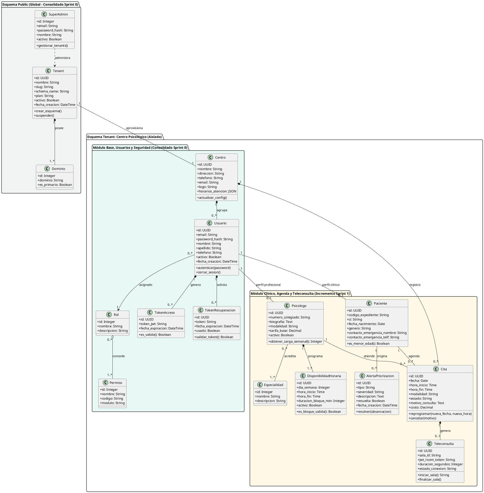

<br>

#### Diagrama de Actividad: Proceso de Reserva y Programación de Cita
Describe el flujo de lógica de negocio transaccional con detección de solapamientos, validación de horario laboral del psicólogo y creación del enlace virtual cuando la modalidad es teleconsulta.

**Código PlantText / PlantUML (Actividad: Reserva de Cita):**
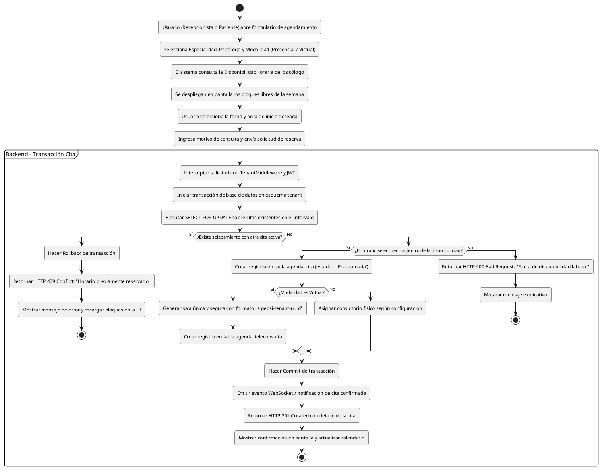

<br>

#### Diagrama de Actividad: Ciclo de Vida y Conexión de Teleconsulta (Jitsi Meet)
Ilustra el proceso mediante el cual los participantes (psicólogo en web y paciente en app móvil o web) se integran a la sala virtual mediante WebRTC.

**Código PlantText / PlantUML (Actividad: Teleconsulta Jitsi Meet):**
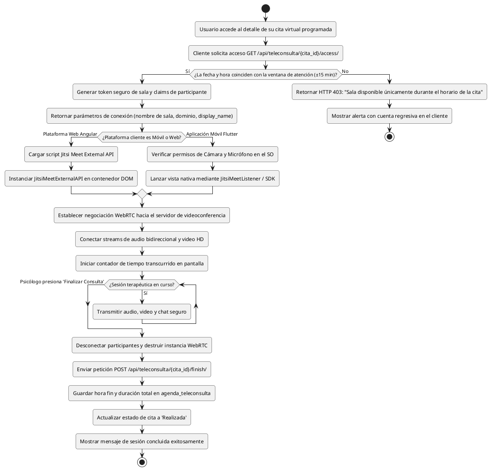

---

### 4.1.4 Sprint Backlog
El Sprint Backlog del Sprint 1 comprende **15 tareas técnicas** extraídas directamente del Product Backlog (ítems NRO 19 al 33), continuando de manera secuencial la numeración del proyecto tras el cierre de las 18 tareas del Sprint 0 (`SP0-1` a `SP0-18`). La carga horaria total estimada es de **73 horas**.

| **Sprint Backlog** | |
| :--- | :--- |
| **Número de Sprint :** Sprint 1 | **Tiempo programado :** 12 días (26 de agosto al 6 de septiembre de 2026) |
| **Objetivo :** Implementar la gestión de psicólogos y disponibilidad, expedientes de pacientes (web/móvil), motor de citas sin solapamiento, teleconsulta Jitsi Meet, dashboard con KPIs y alertas de seguimiento. | |
| **Fecha de inicio :** 26 de agosto de 2026 | **Fecha de finalización :** 06 de septiembre de 2026 |

<br>

**Tabla de tareas del Sprint 1 (Continuación secuencial NRO 19 al 33):**

| Nro | ID | Tarea del Product Backlog | Tipo | Estimación | Responsable | Estado |
| :---: | :--- | :--- | :--- | :---: | :--- | :---: |
| **19** | **SP1-19** | Diseñar la interfaz para la gestión de psicólogos y sus perfiles profesionales | Diseño | 4 hr | Larrazabal Rojas Julio Cesar | Terminado |
| **20** | **SP1-20** | Implementar la gestión de psicólogos, especialidades, disponibilidad y modalidad de atención | Desarrollo | 8 hr | Mujica Vallejos Andy Mauricio | Terminado |
| **21** | **SP1-21** | Realizar pruebas de la gestión de psicólogos | Pruebas | 3 hr | Velasco Soliz Rolando | Terminado |
| **22** | **SP1-22** | Diseñar la interfaz para la gestión de pacientes | Diseño | 4 hr | Larrazabal Rojas Julio Cesar | Terminado |
| **23** | **SP1-23** | Implementar el registro, actualización y consulta de pacientes | Desarrollo | 8 hr | Romero Saavedra Maria Ilse | Terminado |
| **24** | **SP1-24** | Realizar pruebas de la gestión de pacientes | Pruebas | 3 hr | Condori Diaz Marilyn Esther | Terminado |
| **25** | **SP1-25** | Diseñar la interfaz del Dashboard administrativo y clínico | Diseño | 4 hr | Larrazabal Rojas Julio Cesar | Terminado |
| **26** | **SP1-26** | Implementar Dashboard con indicadores de citas, pacientes, inasistencias y carga profesional | Desarrollo | 8 hr | Romero Saavedra Maria Ilse | Terminado |
| **27** | **SP1-27** | Realizar pruebas del Dashboard e indicadores principales | Pruebas | 3 hr | Velasco Soliz Rolando | Terminado |
| **28** | **SP1-28** | Diseñar la interfaz para agenda y gestión de citas | Diseño | 4 hr | Larrazabal Rojas Julio Cesar | Terminado |
| **29** | **SP1-29** | Implementar reserva, confirmación, cancelación y reprogramación de citas | Desarrollo | 8 hr | Mujica Vallejos Andy Mauricio | Terminado |
| **30** | **SP1-30** | Realizar pruebas de agenda y gestión de citas | Pruebas | 3 hr | Velasco Soliz Rolando | Terminado |
| **31** | **SP1-31** | Diseñar la interfaz para sesiones virtuales y videoconferencias | Diseño | 3 hr | Larrazabal Rojas Julio Cesar | Terminado |
| **32** | **SP1-32** | Implementar la integración de videoconferencias mediante Jitsi Meet o Zoom | Desarrollo | 7 hr | Delgado Rojas Alberto Caleb | Terminado |
| **33** | **SP1-33** | Realizar pruebas de acceso y funcionamiento de las videoconferencias | Pruebas | 3 hr | Condori Diaz Marilyn Esther | Terminado |
| **TOTAL** | — | **Esfuerzo total estimado del Sprint 1** | — | **73 hr** | **Equipo SCRUM (6 integrantes)** | **Terminado (100%)** |

---

### 4.1.5 Equipo SCRUM del Sprint 1

| Nombre del Integrante | Rol SCRUM | Especialidad en el Sprint 1 | Tareas Asignadas (Sprint Backlog) |
| :--- | :--- | :--- | :--- |
| **Condori Diaz Marilyn Esther** | Product Owner | Validación de Negocio y Criterios de Aceptación | SP1-24, SP1-33 |
| **Delgado Rojas Alberto Caleb** | Scrum Master | Desarrollo Móvil (Flutter) & Integración WebRTC | SP1-32 |
| **Mujica Vallejos Andy Mauricio** | Development Team | Backend (Django/DRF), BD PostgreSQL & Teleconsulta | SP1-20, SP1-29 |
| **Larrazabal Rojas Julio Cesar** | Development Team | Diseño UI/UX (Figma), Frontend Web (Angular) & Dashboard | SP1-19, SP1-22, SP1-25, SP1-28, SP1-31 |
| **Romero Saavedra Maria Ilse** | Development Team | Lógica Backend, Frontend Web & Módulo Alertas | SP1-23, SP1-26 |
| **Velasco Soliz Rolando** | Development Team | Aseguramiento de Calidad (QA), Pruebas de Caja Negra y BD | SP1-21, SP1-27, SP1-30 |

---

## 4.2 PROCESO/PATRÓN DE DESARROLLO POR HISTORIA DE USUARIO

### 4.2.1 Diseño

#### 4.2.1.1 Diseño de la Arquitectura
La arquitectura del Sprint 1 extiende el modelo de tres capas Multi-Tenant del Sprint 0, incorporando la capa de clientes móviles nativos (Flutter en Dart) y un servidor de señalización y medios WebRTC para videoconferencias en tiempo real (Jitsi Meet).

1. **Capa de Presentación (Frontend y Móvil):**
   * **Plataforma Web (Angular 17):** Componentes standalone con tipado TypeScript, inyección de dependencias modular, formularios reactivos con validación síncrona/asíncrona, interceptores HTTP para tokens JWT e integración de librerías de visualización (FullCalendar y Chart.js).
   * **Aplicación Móvil (Flutter 3.x / Dart):** Arquitectura limpia basada en repositorios y proveedores de estado, comunicación REST mediante cliente `dio`/`http` y soporte para teleconsultas con el plugin de Jitsi Meet.
2. **Capa de Lógica de Negocio (Backend RESTful):**
   * **Framework:** Django 5.x y Django REST Framework bajo Python 3.12.
   * **Apps de Negocio del Sprint 1:** `clinica` (psicólogos, especialidades, disponibilidad, pacientes), `agenda` (citas, teleconsultas, alertas) y `core` (métricas y reportes).
   * **Servicio WebRTC Externo:** Instancia de Jitsi Meet protegida para generación de salas efímeras bajo demanda.
3. **Capa de Persistencia de Datos:**
   * **PostgreSQL 16 Multi-Tenant:** Aislamiento estricto por esquemas gestionado por `django-tenants`. Cada centro psicológico contiene sus propias tablas de psicólogos, pacientes, citas y teleconsultas, garantizando que ninguna consulta SQL filtre datos entre centros distintos.

**Código PlantText / PlantUML (Diagrama de Arquitectura de 3 Capas - Sprint 1):**
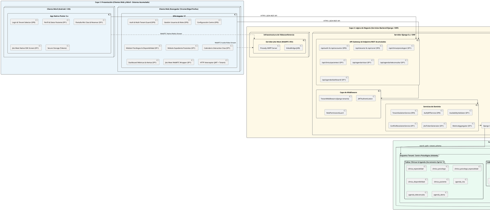

<br>

#### Diagrama de Despliegue
Detalla los componentes desplegados en producción, el balanceo con Nginx, los sockets WSGI de Gunicorn y la separación del tráfico de datos y videoconferencia.

**Código PlantText / PlantUML (Diagrama de Despliegue - Sprint 1):**
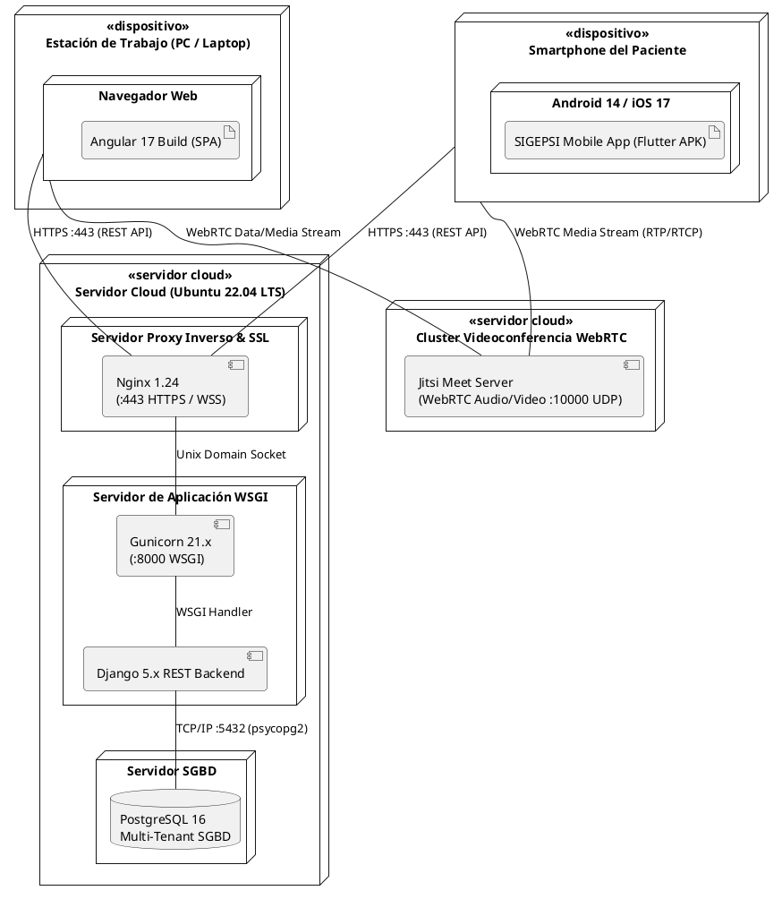

---

#### 4.2.1.2 Diseño de Datos (Modelo Relacional Acumulado: Sprint 0 + Sprint 1)
En estricta conformidad con el principio metodológico de desarrollo ágil iterativo e incremental, el modelo de datos de la plataforma SIGEPSI en el Sprint 1 no reemplaza al modelo previo, sino que **adiciona e integra orgánicamente sus nuevas entidades clínicas, de agenda y teleconsulta sobre la arquitectura Multi-Tenant por esquemas consolidada en el Sprint 0**.

El sistema completo acumula **17 tablas relacionales** organizadas bajo la estructura Multi-Tenant de PostgreSQL:

##### 1. Esquema `public` (Global / Multi-Tenant – Consolidado Sprint 0)
Tablas compartidas a nivel de plataforma para el aprovisionamiento, enrutamiento y administración de los centros:

| Tabla | Campos Principales | Tipo de Datos | Descripción de Regla de Negocio |
| :--- | :--- | :--- | :--- |
| `tenants_tenant` | `id`<br>`nombre`<br>`slug`<br>`schema_name`<br>`plan`<br>`activo`<br>`fecha_creacion` | UUID (PK)<br>Varchar(100)<br>Varchar(100) UNIQUE<br>Varchar(63) UNIQUE<br>Varchar(20)<br>Boolean<br>DateTime | Registro maestro de cada centro psicológico suscrito; define el nombre del esquema PostgreSQL aislado. |
| `tenants_dominio` | `id`<br>`tenant_id`<br>`dominio`<br>`es_primario` | Serial (PK)<br>UUID (FK Tenant)<br>Varchar(253) UNIQUE<br>Boolean | Enrutamiento de subdominios o dominios personalizados vinculados al centro. |
| `accounts_superadmin` | `id`<br>`email`<br>`password_hash`<br>`nombre`<br>`apellido`<br>`activo`<br>`fecha_creacion` | Serial (PK)<br>Varchar(254) UNIQUE<br>Varchar(255)<br>Varchar(150)<br>Varchar(150)<br>Boolean<br>DateTime | Cuenta con privilegios globales para crear, suspender o monitorear tenants en la plataforma. |

<br>

##### 2. Esquema por `tenant` (Base Institucional y Usuarios – Consolidado Sprint 0)
Tablas aisladas e independientes replicadas dentro del esquema de cada centro psicológico:

| Tabla | Campos Principales | Tipo de Datos | Descripción de Regla de Negocio |
| :--- | :--- | :--- | :--- |
| `core_centro` | `id`<br>`nombre`<br>`direccion`<br>`telefono`<br>`email`<br>`logo`<br>`horarios_atencion`<br>`configuracion` | UUID (PK)<br>Varchar(200)<br>Varchar(255)<br>Varchar(30)<br>Varchar(254)<br>Varchar(255)<br>JSONB<br>JSONB | Identidad institucional, logotipo y parámetros operativos propios de la clínica o consultorio. |
| `accounts_usuario` | `id`<br>`email`<br>`password_hash`<br>`nombre`<br>`apellido`<br>`telefono`<br>`rol_id`<br>`activo`<br>`fecha_creacion` | UUID (PK)<br>Varchar(254) UNIQUE<br>Varchar(255)<br>Varchar(150)<br>Varchar(150)<br>Varchar(30)<br>Integer (FK Rol)<br>Boolean<br>DateTime | Cuenta de usuario perteneciente al centro (Admin, Psicólogo, Recepcionista, Coordinador o Paciente). |
| `accounts_rol` | `id`<br>`nombre`<br>`descripcion` | Serial (PK)<br>Varchar(50) UNIQUE<br>Text | Catálogo de roles de seguridad institucionales bajo el modelo RBAC. |
| `accounts_permiso` | `id`<br>`nombre`<br>`codigo`<br>`modulo`<br>`descripcion` | Serial (PK)<br>Varchar(100)<br>Varchar(100) UNIQUE<br>Varchar(50)<br>Text | Permisos atómicos del sistema (ej. `clinica.view_psicologo`, `agenda.book_cita`). |
| `accounts_rol_permiso` | `id`<br>`rol_id`<br>`permiso_id` | Serial (PK)<br>Integer (FK Rol)<br>Integer (FK Permiso) | Matriz de permisos asignados a cada rol del centro psicológico. |
| `accounts_token_recuperacion` | `id`<br>`usuario_id`<br>`token`<br>`fecha_expiracion`<br>`usado` | UUID (PK)<br>UUID (FK Usuario)<br>Varchar(100) UNIQUE<br>DateTime<br>Boolean | Tokens unívocos de un solo uso para el restablecimiento seguro de credenciales olvidadas. |

<br>

##### 3. Esquema por `tenant` (Módulo Clínico, Agenda y Teleconsulta – Incremento Sprint 1)
Nuevas tablas operativas incorporadas en el incremento del Sprint 1, vinculadas a las cuentas de usuario:

| Tabla | Campos Principales | Tipo de Datos | Descripción de Regla de Negocio |
| :--- | :--- | :--- | :--- |
| `clinica_especialidad` | `id`<br>`nombre`<br>`descripcion` | Serial (PK)<br>Varchar(100)<br>Text | Catálogo de especialidades clínicas (Infantil, Parejas, Cognitivo-Conductual, Neuropsicología). |
| `clinica_psicologo` | `id`<br>`usuario_id`<br>`numero_colegiado`<br>`biografia`<br>`modalidad`<br>`tarifa_base`<br>`activo` | UUID (PK)<br>UUID (FK Usuario) UNIQUE<br>Varchar(50) UNIQUE<br>Text<br>Varchar(20)<br>Decimal(10,2)<br>Boolean | Perfil profesional de salud mental vinculado biunívocamente al usuario institucional. |
| `clinica_psicologo_especialidad` | `id`<br>`psicologo_id`<br>`especialidad_id` | Serial (PK)<br>UUID (FK Psicologo)<br>Integer (FK Especialidad) | Relación muchos a muchos entre terapeutas y especialidades dominadas. |
| `clinica_disponibilidad` | `id`<br>`psicologo_id`<br>`dia_semana`<br>`hora_inicio`<br>`hora_fin`<br>`duracion_bloque_min`<br>`activo` | UUID (PK)<br>UUID (FK Psicologo)<br>SmallInt (0=Dom...6=Sáb)<br>Time<br>Time<br>SmallInt<br>Boolean | Matriz de horarios laborales para autogeneración de intervalos de cita libres. |
| `clinica_paciente` | `id`<br>`usuario_id`<br>`codigo_expediente`<br>`ci`<br>`fecha_nacimiento`<br>`genero`<br>`contacto_emergencia_nombre`<br>`contacto_emergencia_telf` | UUID (PK)<br>UUID (FK Usuario) UNIQUE<br>Varchar(30) UNIQUE<br>Varchar(20) UNIQUE<br>Date<br>Varchar(1)<br>Varchar(120)<br>Varchar(25) | Ficha general y expediente sociodemográfico del paciente atendido en el centro. |
| `agenda_cita` | `id`<br>`paciente_id`<br>`psicologo_id`<br>`fecha`<br>`hora_inicio`<br>`hora_fin`<br>`modalidad`<br>`estado`<br>`motivo_consulta`<br>`costo` | UUID (PK)<br>UUID (FK Paciente)<br>UUID (FK Psicologo)<br>Date<br>Time<br>Time<br>Varchar(20)<br>Varchar(25)<br>Text<br>Decimal(10,2) | Registro de la sesión pactada. Estados: `PROGRAMADA`, `CONFIRMADA`, `REALIZADA`, `CANCELADA`, `INASISTENCIA`. |
| `agenda_teleconsulta` | `id`<br>`cita_id`<br>`sala_id`<br>`jwt_room_token`<br>`hora_inicio_real`<br>`hora_fin_real`<br>`duracion_segundos` | UUID (PK)<br>UUID (FK Cita) UNIQUE<br>Varchar(150)<br>Text<br>DateTime<br>DateTime<br>Integer | Parámetros de conexión segura e historial de duración de la sesión virtual Jitsi Meet. |
| `agenda_alerta` | `id`<br>`paciente_id`<br>`tipo`<br>`severidad`<br>`descripcion`<br>`resuelta`<br>`fecha_creacion` | UUID (PK)<br>UUID (FK Paciente)<br>Varchar(50)<br>Varchar(20)<br>Text<br>Boolean<br>DateTime | Alertas preventivas tempranas por inasistencias consecutivas o riesgo de deserción terapéutica. |

<br>

##### 4. Diseño Físico de Base de Datos (Script DDL en PostgreSQL 16 - Sprint 0 + Sprint 1 Acumulado)
A continuación se especifica la implementación física en **PostgreSQL 16** bajo el modelo Multi-Tenant por aislamiento de esquemas. Se define el esquema global `public` (3 tablas de gobernanza del SaaS) y el esquema independiente por centro psicológico (14 tablas institucionales, de control de acceso RBAC, perfiles clínicos, disponibilidad horaria, expediente de pacientes, motor de citas, teleconsulta Jitsi y alertas tempranas), incluyendo claves foráneas con políticas de borrado referencial, tipos de datos nativos (`UUID`, `JSONB`, `TIMESTAMP WITH TIME ZONE`), restricciones `CHECK` e índices para consultas concurrentes:

```sql
-- ============================================================================
-- PLATAFORMA SIGEPSI - SISTEMA DE GESTIÓN DE CENTROS DE SALUD MENTAL
-- MODELO DE DATOS FÍSICO DDL - POSTGRESQL 16 (ARQUITECTURA MULTI-TENANT)
-- MODELO ACUMULADO E ITERATIVO: SPRINT 0 + SPRINT 1
-- Total: 17 Tablas Relacionales (3 Globales 'public' + 14 en Esquema 'tenant')
-- ============================================================================

-- 0. EXTENSIONES DEL SISTEMA
CREATE EXTENSION IF NOT EXISTS "uuid-ossp";
CREATE EXTENSION IF NOT EXISTS "pgcrypto";

-- ============================================================================
-- 1. ESQUEMA GLOBAL: public (CONSOLIDADO SPRINT 0)
-- Gestión de Centros Suscritos (Tenants), Subdominios y SuperAdministradores
-- ============================================================================

CREATE TABLE IF NOT EXISTS public.tenants_tenant (
    id UUID PRIMARY KEY DEFAULT gen_random_uuid(),
    nombre VARCHAR(100) NOT NULL,
    slug VARCHAR(100) NOT NULL UNIQUE,
    schema_name VARCHAR(63) NOT NULL UNIQUE,
    plan VARCHAR(20) NOT NULL DEFAULT 'PROFESIONAL' CHECK (plan IN ('BASICO', 'PROFESIONAL', 'ENTERPRISE')),
    activo BOOLEAN NOT NULL DEFAULT TRUE,
    fecha_creacion TIMESTAMP WITH TIME ZONE NOT NULL DEFAULT CURRENT_TIMESTAMP
);

COMMENT ON TABLE public.tenants_tenant IS 'Registro central de centros psicológicos suscritos a la plataforma SaaS.';
COMMENT ON COLUMN public.tenants_tenant.schema_name IS 'Nombre del esquema de PostgreSQL asignado exclusivamente a este centro.';

CREATE TABLE IF NOT EXISTS public.tenants_dominio (
    id SERIAL PRIMARY KEY,
    tenant_id UUID NOT NULL REFERENCES public.tenants_tenant(id) ON DELETE CASCADE,
    dominio VARCHAR(253) NOT NULL UNIQUE,
    es_primario BOOLEAN NOT NULL DEFAULT TRUE
);

COMMENT ON TABLE public.tenants_dominio IS 'Enrutamiento de subdominios o dominios personalizados vinculados a cada centro.';

CREATE TABLE IF NOT EXISTS public.accounts_superadmin (
    id SERIAL PRIMARY KEY,
    email VARCHAR(254) NOT NULL UNIQUE,
    password_hash VARCHAR(255) NOT NULL,
    nombre VARCHAR(150) NOT NULL,
    apellido VARCHAR(150) NOT NULL,
    activo BOOLEAN NOT NULL DEFAULT TRUE,
    fecha_creacion TIMESTAMP WITH TIME ZONE NOT NULL DEFAULT CURRENT_TIMESTAMP
);

COMMENT ON TABLE public.accounts_superadmin IS 'Cuentas con privilegios globales de superadministrador sobre toda la plataforma.';


-- ============================================================================
-- 2. ESQUEMA AISLADO POR TENANT (EJEMPLO: tenant_centro_san_martin)
-- Cada centro psicológico contiene sus propias tablas de configuración,
-- usuarios, psicólogos, pacientes, citas y teleconsultas en su esquema.
-- ============================================================================

CREATE SCHEMA IF NOT EXISTS tenant_centro_san_martin;
SET search_path TO tenant_centro_san_martin, public;

-- ----------------------------------------------------------------------------
-- 2.1 TABLAS BASE INSTITUCIONALES Y SEGURIDAD RBAC (CONSOLIDADO SPRINT 0)
-- ----------------------------------------------------------------------------

CREATE TABLE IF NOT EXISTS core_centro (
    id UUID PRIMARY KEY DEFAULT gen_random_uuid(),
    nombre VARCHAR(200) NOT NULL,
    direccion VARCHAR(255),
    telefono VARCHAR(30),
    email VARCHAR(254),
    logo VARCHAR(255),
    horarios_atencion JSONB DEFAULT '{"lunes_a_viernes": "08:00 - 20:00", "sabados": "08:00 - 13:00"}'::jsonb,
    configuracion JSONB DEFAULT '{"duracion_cita_defecto": 50, "cancelacion_anticipacion_horas": 24, "moneda": "BOB"}'::jsonb,
    fecha_actualizacion TIMESTAMP WITH TIME ZONE DEFAULT CURRENT_TIMESTAMP
);

COMMENT ON TABLE core_centro IS 'Configuración institucional y operativa del centro psicológico.';

CREATE TABLE IF NOT EXISTS accounts_rol (
    id SERIAL PRIMARY KEY,
    nombre VARCHAR(50) NOT NULL UNIQUE,
    descripcion TEXT
);

COMMENT ON TABLE accounts_rol IS 'Catálogo de roles institucionales bajo control de acceso RBAC.';

CREATE TABLE IF NOT EXISTS accounts_permiso (
    id SERIAL PRIMARY KEY,
    nombre VARCHAR(100) NOT NULL,
    codigo VARCHAR(100) NOT NULL UNIQUE,
    modulo VARCHAR(50) NOT NULL,
    descripcion TEXT
);

COMMENT ON TABLE accounts_permiso IS 'Permisos atómicos del sistema por módulo funcional.';

CREATE TABLE IF NOT EXISTS accounts_rol_permiso (
    id SERIAL PRIMARY KEY,
    rol_id INTEGER NOT NULL REFERENCES accounts_rol(id) ON DELETE CASCADE,
    permiso_id INTEGER NOT NULL REFERENCES accounts_permiso(id) ON DELETE CASCADE,
    CONSTRAINT uq_rol_permiso UNIQUE (rol_id, permiso_id)
);

COMMENT ON TABLE accounts_rol_permiso IS 'Matriz de asignación de permisos a roles.';

CREATE TABLE IF NOT EXISTS accounts_usuario (
    id UUID PRIMARY KEY DEFAULT gen_random_uuid(),
    email VARCHAR(254) NOT NULL UNIQUE,
    password_hash VARCHAR(255) NOT NULL,
    nombre VARCHAR(150) NOT NULL,
    apellido VARCHAR(150) NOT NULL,
    telefono VARCHAR(30),
    rol_id INTEGER NOT NULL REFERENCES accounts_rol(id) ON DELETE RESTRICT,
    activo BOOLEAN NOT NULL DEFAULT TRUE,
    fecha_creacion TIMESTAMP WITH TIME ZONE NOT NULL DEFAULT CURRENT_TIMESTAMP,
    ultimo_login TIMESTAMP WITH TIME ZONE
);

COMMENT ON TABLE accounts_usuario IS 'Cuentas de usuario pertenecientes al centro (Admin, Psicólogo, Recepcionista, Paciente).';

CREATE TABLE IF NOT EXISTS accounts_token_recuperacion (
    id UUID PRIMARY KEY DEFAULT gen_random_uuid(),
    usuario_id UUID NOT NULL REFERENCES accounts_usuario(id) ON DELETE CASCADE,
    token VARCHAR(100) NOT NULL UNIQUE,
    fecha_expiracion TIMESTAMP WITH TIME ZONE NOT NULL,
    usado BOOLEAN NOT NULL DEFAULT FALSE,
    fecha_creacion TIMESTAMP WITH TIME ZONE NOT NULL DEFAULT CURRENT_TIMESTAMP
);

COMMENT ON TABLE accounts_token_recuperacion IS 'Tokens unívocos y temporales para restablecimiento seguro de contraseñas.';


-- ----------------------------------------------------------------------------
-- 2.2 MÓDULO CLÍNICO, AGENDA Y TELECONSULTA (INCREMENTO SPRINT 1)
-- ----------------------------------------------------------------------------

CREATE TABLE IF NOT EXISTS clinica_especialidad (
    id SERIAL PRIMARY KEY,
    nombre VARCHAR(100) NOT NULL UNIQUE,
    descripcion TEXT
);

COMMENT ON TABLE clinica_especialidad IS 'Catálogo de especialidades clínicas de psicología en el centro.';

CREATE TABLE IF NOT EXISTS clinica_psicologo (
    id UUID PRIMARY KEY DEFAULT gen_random_uuid(),
    usuario_id UUID NOT NULL UNIQUE REFERENCES accounts_usuario(id) ON DELETE CASCADE,
    numero_colegiado VARCHAR(50) NOT NULL UNIQUE,
    biografia TEXT,
    modalidad VARCHAR(20) NOT NULL DEFAULT 'MIXTA' CHECK (modalidad IN ('PRESENCIAL', 'VIRTUAL', 'MIXTA')),
    tarifa_base DECIMAL(10,2) NOT NULL DEFAULT 150.00 CHECK (tarifa_base >= 0),
    activo BOOLEAN NOT NULL DEFAULT TRUE,
    fecha_ingreso DATE NOT NULL DEFAULT CURRENT_DATE
);

COMMENT ON TABLE clinica_psicologo IS 'Perfil profesional y arancelario de psicólogos vinculado a su cuenta de usuario.';

CREATE TABLE IF NOT EXISTS clinica_psicologo_especialidad (
    id SERIAL PRIMARY KEY,
    psicologo_id UUID NOT NULL REFERENCES clinica_psicologo(id) ON DELETE CASCADE,
    especialidad_id INTEGER NOT NULL REFERENCES clinica_especialidad(id) ON DELETE CASCADE,
    CONSTRAINT uq_psicologo_especialidad UNIQUE (psicologo_id, especialidad_id)
);

COMMENT ON TABLE clinica_psicologo_especialidad IS 'Relación muchos a muchos entre terapeutas y sus especialidades acreditadas.';

CREATE TABLE IF NOT EXISTS clinica_disponibilidad (
    id UUID PRIMARY KEY DEFAULT gen_random_uuid(),
    psicologo_id UUID NOT NULL REFERENCES clinica_psicologo(id) ON DELETE CASCADE,
    dia_semana SMALLINT NOT NULL CHECK (dia_semana BETWEEN 0 AND 6), -- 0=Domingo, 1=Lunes, ..., 6=Sábado
    hora_inicio TIME NOT NULL,
    hora_fin TIME NOT NULL,
    duracion_bloque_min SMALLINT NOT NULL DEFAULT 50 CHECK (duracion_bloque_min > 0),
    activo BOOLEAN NOT NULL DEFAULT TRUE,
    CONSTRAINT chk_rango_horario CHECK (hora_fin > hora_inicio)
);

COMMENT ON TABLE clinica_disponibilidad IS 'Franjas horarias semanales de atención configuradas por cada psicólogo.';

CREATE TABLE IF NOT EXISTS clinica_paciente (
    id UUID PRIMARY KEY DEFAULT gen_random_uuid(),
    usuario_id UUID NOT NULL UNIQUE REFERENCES accounts_usuario(id) ON DELETE CASCADE,
    codigo_expediente VARCHAR(30) NOT NULL UNIQUE,
    ci VARCHAR(20) NOT NULL UNIQUE,
    fecha_nacimiento DATE NOT NULL,
    genero VARCHAR(1) NOT NULL CHECK (genero IN ('M', 'F', 'O')),
    contacto_emergencia_nombre VARCHAR(120),
    contacto_emergencia_telf VARCHAR(25),
    tutor_legal_nombre VARCHAR(120),
    tutor_legal_ci VARCHAR(20),
    fecha_registro DATE NOT NULL DEFAULT CURRENT_DATE
);

COMMENT ON TABLE clinica_paciente IS 'Expediente sociodemográfico del paciente registrado en la clínica.';

CREATE TABLE IF NOT EXISTS agenda_cita (
    id UUID PRIMARY KEY DEFAULT gen_random_uuid(),
    paciente_id UUID NOT NULL REFERENCES clinica_paciente(id) ON DELETE RESTRICT,
    psicologo_id UUID NOT NULL REFERENCES clinica_psicologo(id) ON DELETE RESTRICT,
    fecha DATE NOT NULL,
    hora_inicio TIME NOT NULL,
    hora_fin TIME NOT NULL,
    modalidad VARCHAR(20) NOT NULL DEFAULT 'PRESENCIAL' CHECK (modalidad IN ('PRESENCIAL', 'VIRTUAL')),
    estado VARCHAR(25) NOT NULL DEFAULT 'PROGRAMADA' CHECK (estado IN ('PROGRAMADA', 'CONFIRMADA', 'REALIZADA', 'CANCELADA', 'INASISTENCIA')),
    motivo_consulta TEXT,
    costo DECIMAL(10,2) NOT NULL DEFAULT 150.00 CHECK (costo >= 0),
    fecha_creacion TIMESTAMP WITH TIME ZONE NOT NULL DEFAULT CURRENT_TIMESTAMP,
    fecha_modificacion TIMESTAMP WITH TIME ZONE DEFAULT CURRENT_TIMESTAMP,
    CONSTRAINT chk_cita_horario CHECK (hora_fin > hora_inicio)
);

COMMENT ON TABLE agenda_cita IS 'Sesión psicológica concertada entre paciente y terapeuta.';

CREATE TABLE IF NOT EXISTS agenda_teleconsulta (
    id UUID PRIMARY KEY DEFAULT gen_random_uuid(),
    cita_id UUID NOT NULL UNIQUE REFERENCES agenda_cita(id) ON DELETE CASCADE,
    sala_id VARCHAR(150) NOT NULL UNIQUE,
    jwt_room_token TEXT,
    hora_inicio_real TIMESTAMP WITH TIME ZONE,
    hora_fin_real TIMESTAMP WITH TIME ZONE,
    duracion_segundos INTEGER DEFAULT 0 CHECK (duracion_segundos >= 0)
);

COMMENT ON TABLE agenda_teleconsulta IS 'Parámetros técnicos de sala Jitsi Meet y registro de duración real de videollamada.';

CREATE TABLE IF NOT EXISTS agenda_alerta (
    id UUID PRIMARY KEY DEFAULT gen_random_uuid(),
    paciente_id UUID NOT NULL REFERENCES clinica_paciente(id) ON DELETE CASCADE,
    tipo VARCHAR(50) NOT NULL CHECK (tipo IN ('INASISTENCIA_REITERADA', 'RIESGO_DESERCION', 'URGENCIA_CLINICA')),
    severidad VARCHAR(20) NOT NULL DEFAULT 'MEDIA' CHECK (severidad IN ('BAJA', 'MEDIA', 'ALTA', 'CRITICA')),
    descripcion TEXT NOT NULL,
    resuelta BOOLEAN NOT NULL DEFAULT FALSE,
    fecha_creacion TIMESTAMP WITH TIME ZONE NOT NULL DEFAULT CURRENT_TIMESTAMP,
    fecha_resolucion TIMESTAMP WITH TIME ZONE
);

COMMENT ON TABLE agenda_alerta IS 'Alertas clínicas automáticas por ausentismo reiterado o riesgo de deserción.';


-- ============================================================================
-- 3. ÍNDICES DE RENDIMIENTO Y OPTIMIZACIÓN DE CONSULTAS
-- ============================================================================

-- Índices en Esquema Public
CREATE INDEX IF NOT EXISTS idx_tenants_slug ON public.tenants_tenant(slug);
CREATE INDEX IF NOT EXISTS idx_tenants_schema ON public.tenants_tenant(schema_name);
CREATE INDEX IF NOT EXISTS idx_tenants_dominio_tenant ON public.tenants_dominio(tenant_id);

-- Índices en Esquema Tenant
CREATE INDEX IF NOT EXISTS idx_usuarios_rol ON accounts_usuario(rol_id);
CREATE INDEX IF NOT EXISTS idx_usuarios_email ON accounts_usuario(email);
CREATE INDEX IF NOT EXISTS idx_psicologo_usuario ON clinica_psicologo(usuario_id);
CREATE INDEX IF NOT EXISTS idx_disponibilidad_psico_dia ON clinica_disponibilidad(psicologo_id, dia_semana) WHERE activo = TRUE;
CREATE INDEX IF NOT EXISTS idx_paciente_ci ON clinica_paciente(ci);
CREATE INDEX IF NOT EXISTS idx_paciente_expediente ON clinica_paciente(codigo_expediente);
CREATE INDEX IF NOT EXISTS idx_citas_psicologo_fecha ON agenda_cita(psicologo_id, fecha, hora_inicio);
CREATE INDEX IF NOT EXISTS idx_citas_paciente_fecha ON agenda_cita(paciente_id, fecha);
CREATE INDEX IF NOT EXISTS idx_citas_estado ON agenda_cita(estado);
CREATE INDEX IF NOT EXISTS idx_teleconsulta_sala ON agenda_teleconsulta(sala_id);
CREATE INDEX IF NOT EXISTS idx_alertas_paciente_resuelta ON agenda_alerta(paciente_id, resuelta);


-- ============================================================================
-- 4. POBLACIÓN DE DATOS SEMILLA (SEED DATA DEMOSTRATIVO)
-- ============================================================================

-- A. Inserción en Esquema Public
INSERT INTO public.tenants_tenant (id, nombre, slug, schema_name, plan, activo)
VALUES 
    ('11111111-1111-1111-1111-111111111111', 'Centro Psicológico San Martín', 'sanmartin', 'tenant_centro_san_martin', 'ENTERPRISE', TRUE)
ON CONFLICT (slug) DO NOTHING;

INSERT INTO public.tenants_dominio (tenant_id, dominio, es_primario)
VALUES 
    ('11111111-1111-1111-1111-111111111111', 'sanmartin.sigepsi.com', TRUE)
ON CONFLICT (dominio) DO NOTHING;

INSERT INTO public.accounts_superadmin (email, password_hash, nombre, apellido, activo)
VALUES 
    ('superadmin@sigepsi.com', crypt('SuperSecret2026!', gen_salt('bf')), 'Super', 'Administrador', TRUE)
ON CONFLICT (email) DO NOTHING;

-- B. Inserción en Esquema Tenant (Roles y Permisos Base)
INSERT INTO accounts_rol (id, nombre, descripcion)
VALUES 
    (1, 'Administrador del Centro', 'Control total sobre configuración institucional, usuarios y reportes.'),
    (2, 'Psicólogo / Terapeuta', 'Gestión de agenda propia, disponibilidad, sesiones y expedientes clínicos.'),
    (3, 'Recepcionista', 'Programación y confirmación de citas, derivación de pacientes y cobros.'),
    (4, 'Paciente', 'Acceso a reservas de citas, teleconsulta virtual y visualización de perfil.')
ON CONFLICT (id) DO NOTHING;

INSERT INTO accounts_permiso (id, nombre, codigo, modulo, descripcion)
VALUES 
    (1, 'Ver Usuarios', 'accounts.view_usuario', 'accounts', 'Permite listar los usuarios del centro'),
    (2, 'Crear Usuarios', 'accounts.add_usuario', 'accounts', 'Permite crear nuevos usuarios en el centro'),
    (3, 'Ver Psicólogos', 'clinica.view_psicologo', 'clinica', 'Permite listar psicólogos y especialidades'),
    (4, 'Editar Disponibilidad', 'clinica.change_disponibilidad', 'clinica', 'Permite actualizar franjas horarias'),
    (5, 'Ver Pacientes', 'clinica.view_paciente', 'clinica', 'Permite consultar expedientes de pacientes'),
    (6, 'Crear Pacientes', 'clinica.add_paciente', 'clinica', 'Permite registrar nuevos pacientes'),
    (7, 'Agendar Cita', 'agenda.add_cita', 'agenda', 'Permite reservar turnos en el calendario'),
    (8, 'Acceder Teleconsulta', 'agenda.access_teleconsulta', 'agenda', 'Permite unirse a la sala de videoconferencia Jitsi Meet')
ON CONFLICT (id) DO NOTHING;

-- C. Especialidades Clínicas Base
INSERT INTO clinica_especialidad (id, nombre, descripcion)
VALUES 
    (1, 'Terapia Cognitivo-Conductual (TCC)', 'Enfoque orientado a la reestructuración de pensamientos y patrones de conducta disfuncionales.'),
    (2, 'Psicología Clínica y de la Salud', 'Evaluación, diagnóstico y tratamiento de trastornos emocionales y del estado de ánimo.'),
    (3, 'Terapia Familiar y de Pareja', 'Intervención sistémica orientada a mejorar la comunicación y resolver conflictos vinculares.'),
    (4, 'Neuropsicología y Rehabilitación', 'Evaluación y estimulación de funciones cognitivas en infantes, adultos y adultos mayores.')
ON CONFLICT (id) DO NOTHING;
```

---

#### 4.2.1.3 Diseño de la Lógica de Negocio
La lógica de negocio del Sprint 1 se estructura a través de los siguientes flujos de proceso:

* **Flujo 1: Configuración de Disponibilidad y Directorio Profesional (HU-11, HU-12):** El administrador o terapeuta establece las franjas horarias válidas. El sistema valida que no existan traslapes entre bloques del mismo día y genera los intervalos de sesión divididos por la duración configurada.
* **Flujo 2: Registro de Pacientes en Web y Móvil (HU-13, HU-14):** Se verifica la unicidad del documento de identidad en el tenant. Si el paciente es menor de edad, el formulario exige datos del tutor responsable.
* **Flujo 3: Motor de Reserva y Control de Concurrencia de Citas (HU-15, HU-16, HU-17, HU-22):** Al solicitar una cita, el backend bloquea transaccionalmente el rango seleccionado en PostgreSQL con `SELECT FOR UPDATE` para evitar colisiones de dos pacientes intentando tomar el mismo slot simultáneamente. Si la cita es virtual, invoca al servicio de teleconsulta.
* **Flujo 4: Gestión de Salas Virtuales Jitsi Meet (HU-18, HU-19):** Al iniciar la sesión, se valida la coincidencia de fecha/hora ($\pm 15\text{ min}$). Se crea la sala con un identificador unívoco y se asigna el rol de moderador al terapeuta y de invitado al paciente. Al salir, se registra la duración real.
* **Flujo 5: Tablero de Control y Alertas Tempranas (HU-20, HU-21):** Consultas agregadas calculan en tiempo real citas del día, ausentismo y ocupación. Si se registran dos inasistencias seguidas para un paciente, se genera una alerta clínica prioritaria.

A continuación se presentan los **Diagramas de Comunicación** bajo el estándar UML y el patrón de análisis **BCE (Boundary - Control - Entity / Interfaz - Control - Entidad)**, modelando la interacción horizontal de objetos con mensajería bidireccional numerada y 100% compatibles con **PlantText / PlantUML**:

#### Diagrama de Comunicación – CU6 / CU8: Gestión de Psicólogos y Disponibilidad (HU-11, HU-12)

**Código PlantText / PlantUML (Comunicación – CU6/CU8):**
```plantuml
@startuml
skinparam shadowing false
skinparam defaultFontName Arial
skinparam backgroundColor #FAFBFD
left to right direction

skinparam actor {
    BackgroundColor #FFF2CC
    BorderColor #2C3E50
}
skinparam boundary {
    BackgroundColor #D4F6F8
    BorderColor #2C3E50
}
skinparam control {
    BackgroundColor #D4F6F8
    BorderColor #2C3E50
}
skinparam entity {
    BackgroundColor #D4F6F8
    BorderColor #2C3E50
}
skinparam arrow {
    Color #2C3E50
    FontColor #1A252C
    FontSize 11
}

actor "Administrador / Psicólogo" as act
boundary "IU_PerfilDisponibilidad\n(Angular 17)" as iu
control "CTR_PsicologoService\n(Django REST)" as ctr
entity "CE_Psicologo_y_Horario\n(PostgreSQL)" as ce

act -- iu : 1: Ingresar datos perfil y horario (colegiatura, tarifas, bloques) >\n< 12: Notificar "Disponibilidad guardada correctamente"
iu -- ctr : 2: POST /api/clinica/psicologos/{id}/disponibilidad/ + JWT >\n< 11: 200 OK {perfil, horarios_creados}
ctr -- ce : 3: Validar JWT, TenantMiddleware y rol profesional >\n< 4: Permisos y tenant verificados\n5: Validar consistencia de horas (inicio < fin) >\n< 6: Franjas horarias coherentes\n7: SELECT id FROM clinica_psicologo WHERE colegiado = ? >\n< 8: Colegiatura no duplicada\n9: INSERT INTO clinica_disponibilidad (dia, inicio, fin, bloques) >\n< 10: Registros de disponibilidad persistidos
@enduml
```

<br>

#### Diagrama de Comunicación – CU7: Gestión de Pacientes Web y Móvil (HU-13, HU-14)

**Código PlantText / PlantUML (Comunicación – CU7):**
```plantuml
@startuml
skinparam shadowing false
skinparam defaultFontName Arial
skinparam backgroundColor #FAFBFD
left to right direction

skinparam actor {
    BackgroundColor #FFF2CC
    BorderColor #2C3E50
}
skinparam boundary {
    BackgroundColor #D4F6F8
    BorderColor #2C3E50
}
skinparam control {
    BackgroundColor #D4F6F8
    BorderColor #2C3E50
}
skinparam entity {
    BackgroundColor #D4F6F8
    BorderColor #2C3E50
}
skinparam arrow {
    Color #2C3E50
    FontColor #1A252C
    FontSize 11
}

actor "Paciente / Recepcionista" as act
boundary "IU_RegistroPaciente\n(Angular / Flutter)" as iu
control "CTR_PacienteService\n(Django REST)" as ctr
entity "CE_Paciente_y_Usuario\n(PostgreSQL)" as ce

act -- iu : 1: Ingresar datos personales (CI, nombre, fecha nac, contacto) >\n< 10: Confirmar "Expediente de paciente creado"
iu -- ctr : 2: POST /api/clinica/pacientes/ + Header Tenant >\n< 9: 201 Created {paciente_id, codigo_expediente}
ctr -- ce : 3: Validar unicidad de CI y correo en el tenant >\n< 4: Documento no duplicado\n5: Validar minoría de edad y tutor responsable >\n< 6: Datos de tutor correctos\n7: INSERT INTO clinica_paciente (expediente, ci, fecha_nac...) >\n< 8: Expediente clínico registrado en esquema
@enduml
```

<br>

#### Diagrama de Comunicación – CU11: Programación y Reserva de Citas (HU-15, HU-16, HU-17, HU-22)

**Código PlantText / PlantUML (Comunicación – CU11):**
```plantuml
@startuml
skinparam shadowing false
skinparam defaultFontName Arial
skinparam backgroundColor #FAFBFD
left to right direction

skinparam actor {
    BackgroundColor #FFF2CC
    BorderColor #2C3E50
}
skinparam boundary {
    BackgroundColor #D4F6F8
    BorderColor #2C3E50
}
skinparam control {
    BackgroundColor #D4F6F8
    BorderColor #2C3E50
}
skinparam entity {
    BackgroundColor #D4F6F8
    BorderColor #2C3E50
}
skinparam arrow {
    Color #2C3E50
    FontColor #1A252C
    FontSize 11
}

actor "Recepcionista / Paciente" as act
boundary "IU_AgendaCitas\n(Angular / Móvil)" as iu
control "CTR_CitaService\n(Django REST)" as ctr
entity "CE_Cita_y_Disponibilidad\n(PostgreSQL)" as ce

act -- iu : 1: Seleccionar psicólogo, fecha, bloque y modalidad >\n< 12: Desplegar comprobante de cita programada
iu -- ctr : 2: POST /api/agenda/citas/ {psicologo_id, fecha, bloque} >\n< 11: 201 Created {cita_id, estado: "PROGRAMADA"}
ctr -- ce : 3: Iniciar transacción atómica y SELECT FOR UPDATE >\n< 4: Bloqueo pesimista concedido\n5: Validar si horario está dentro de clinica_disponibilidad >\n< 6: Horario dentro de jornada laboral\n7: SELECT COUNT(*) FROM agenda_cita WHERE solapada = true >\n< 8: Cero colisiones detectadas\n9: INSERT INTO agenda_cita (paciente_id, psicologo_id, fecha...) >\n< 10: Cita registrada y slot bloqueado
@enduml
```

<br>

#### Diagrama de Comunicación – CU13: Teleconsulta y Videoconferencias Jitsi Meet (HU-18, HU-19)

**Código PlantText / PlantUML (Comunicación – CU13):**
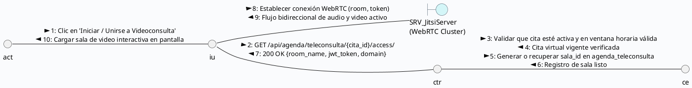

<br>

#### Diagrama de Comunicación – CU9 / CU10: Dashboard Clínico y Alertas Tempranas (HU-20, HU-21)

**Código PlantText / PlantUML (Comunicación – CU9/CU10):**
```plantuml
@startuml
skinparam shadowing false
skinparam defaultFontName Arial
skinparam backgroundColor #FAFBFD
left to right direction

skinparam actor {
    BackgroundColor #FFF2CC
    BorderColor #2C3E50
}
skinparam boundary {
    BackgroundColor #D4F6F8
    BorderColor #2C3E50
}
skinparam control {
    BackgroundColor #D4F6F8
    BorderColor #2C3E50
}
skinparam entity {
    BackgroundColor #D4F6F8
    BorderColor #2C3E50
}
skinparam arrow {
    Color #2C3E50
    FontColor #1A252C
    FontSize 11
}

actor "Coordinador / Administrador" as act
boundary "IU_DashboardClinico\n(Angular 17)" as iu
control "CTR_DashboardService\n(Django REST)" as ctr
entity "CE_Metricas_y_Alertas\n(PostgreSQL)" as ce

act -- iu : 1: Acceder al Dashboard principal >\n< 10: Renderizar KPIs (citas, ausentismo) y tabla de alertas
iu -- ctr : 2: GET /api/agenda/dashboard/kpis/?periodo=mes >\n< 9: 200 OK {total_citas, ausentismo_pct, alertas_activas: [...]}
ctr -- ce : 3: Validar permisos de Coordinador en tenant >\n< 4: Acceso administrativo autorizado\n5: SELECT COUNT(citas), AVG(ocupacion) GROUP BY psicologo >\n< 6: Agregaciones estadísticas calculadas\n7: SELECT * FROM agenda_alerta WHERE resuelta = false >\n< 8: Listado de pacientes con 2+ inasistencias
@enduml
```

---

### 4.2.2 Implementación

#### 4.2.2.1 Componentes y Artefactos Generados
Durante el desarrollo del Sprint 1 se construyeron los siguientes módulos y artefactos de software:

**Backend (Django REST Framework):**
* **App `clinica`:**
  * `models.py`: Modelos de datos `Especialidad`, `Psicologo`, `DisponibilidadHoraria`, `Paciente`.
  * `serializers.py`: Serializadores de validación para colegiatura, cálculo de edad y slots disponibles.
  * `views.py`: ViewSets para CRUD de psicólogos, filtrado por especialidad y gestión de pacientes.
* **App `agenda`:**
  * `models.py`: Modelos de datos `Cita`, `Teleconsulta`, `AlertaPriorizacion`.
  * `services/availability.py`: Algoritmo de detección de colisiones horarias y cálculo de slots libres.
  * `services/jitsi.py`: Generador de identificadores seguros de sala y tokens de acceso WebRTC.
  * `views.py`: Endpoints de programación, cancelación, teleconsulta y cálculo de métricas para dashboard.

**Endpoints API REST Generados en el Sprint 1:**

| Método | Endpoint | Descripción | Permisos Requeridos |
| :---: | :--- | :--- | :--- |
| `GET / POST` | `/api/clinica/especialidades/` | Listar y registrar especialidades clínicas | Admin / Coordinador |
| `GET / POST` | `/api/clinica/psicologos/` | Listar directorio y registrar perfil de psicólogo | Admin / Recepcionista |
| `GET / PUT` | `/api/clinica/psicologos/{id}/` | Consultar y actualizar perfil profesional | Admin / Psicólogo propietario |
| `GET / POST` | `/api/clinica/psicologos/{id}/disponibilidad/` | Consultar y configurar bloques semanales de atención | Psicólogo propietario / Admin |
| `GET / POST` | `/api/clinica/pacientes/` | Listar y dar de alta expedientes de pacientes | Recepcionista / Admin |
| `GET / PUT` | `/api/clinica/pacientes/{id}/` | Consultar y actualizar ficha de paciente | Recepcionista / Psicólogo asignado |
| `GET / POST` | `/api/agenda/citas/` | Consultar agenda y programar nueva cita | Recepcionista / Paciente / Psicólogo |
| `GET / PUT` | `/api/agenda/citas/{id}/` | Detalle, confirmación y reprogramación de cita | Recepcionista / Paciente involucrado |
| `POST` | `/api/agenda/citas/{id}/cancelar/` | Cancelación de cita con verificación de anticipación | Paciente / Recepcionista |
| `GET` | `/api/agenda/teleconsulta/{cita_id}/access/` | Obtener sala y token de teleconsulta Jitsi | Psicólogo o Paciente de la cita |
| `POST` | `/api/agenda/teleconsulta/{cita_id}/finish/` | Finalizar sesión virtual y registrar duración | Psicólogo moderador |
| `GET` | `/api/agenda/dashboard/kpis/` | Métricas operativas (citas, ausentismo, ocupación) | Admin / Coordinador Clínico |
| `GET / PUT` | `/api/agenda/alertas/` | Listar y resolver alertas de priorización | Coordinador / Psicólogo |

**Frontend Web (Angular 17):**
* `PsicologoListComponent` / `PsicologoFormComponent`: Directorio, búsqueda por especialidad y formulario reactivo.
* `DisponibilidadSemanalComponent`: Matriz visual para marcar rangos horarios por día.
* `PacienteListComponent` / `PacienteFichaComponent`: Gestión de pacientes con validación de tutor legal.
* `CalendarioAgendaComponent`: Integración con FullCalendar para vistas mensual, semanal y diaria con códigos de color.
* `CitaModalComponent`: Diálogo reactivo para reserva con validación síncrona de slots ocupados.
* `TeleconsultaRoomComponent`: Contenedor embebido de Jitsi Meet con temporizador y controles multimedia.
* `DashboardClinicoComponent`: Panel con tarjetas de KPIs y gráficos analíticos con Chart.js.
* `AlertasPanelComponent`: Lista de alertas prioritarias con acción para resolver y registrar notas.

**Aplicación Móvil (Flutter 3.x):**
* `paciente_perfil_screen.dart`: Consulta y actualización de datos personales y teléfono de emergencia.
* `mis_citas_screen.dart`: Listado clasificado de citas próximas y pasadas con badges de estado.
* `reservar_cita_screen.dart`: Selector interactivo de profesional, fecha y franjas libres.
* `teleconsulta_jitsi_screen.dart`: Integración nativa de videollamada mediante `jitsi_meet_flutter_sdk` con gestión de permisos de cámara y micrófono.

---

### 4.2.3 Pruebas

#### 4.2.3.1 Plan de Pruebas Funcionales (Caja Negra)
Siguiendo las directrices expuestas en clase para el aseguramiento de la calidad del software, el plan de pruebas del Sprint 1 se estructura de forma individual **por cada Historia de Usuario (HU-11 a HU-22)** bajo técnicas de **Caja Negra** (partición de equivalencia, análisis de valores límite y tablas de decisión), evaluando entradas, procesos y salidas esperadas con base en los criterios de aceptación, e incorporando el prompt de generación de la interfaz, formulario o reporte asociado:

---

### HU 11 – Gestión de perfiles y especialidades de psicólogos

**Historia de Usuario:**

**Como** Administrador del Centro  
**quiero** registrar y actualizar los perfiles profesionales de los psicólogos (especialidades, colegiatura, biografía, tarifa y modalidad)  
**para** que el centro disponga de un directorio profesional confiable para la asignación de pacientes.  

**Criterios de aceptación:**
1. El sistema debe permitir registrar y editar un psicólogo con colegiatura válida, tarifa y al menos una especialidad activa.
2. Si el número de colegiado ya existe en el centro, debe mostrar "Colegiatura ya registrada".
3. Si la tarifa base es negativa o cero, debe mostrar "La tarifa debe ser mayor a cero".
4. Todos los campos obligatorios deben ser completados; de lo contrario debe mostrar "Campos obligatorios incompletos".

**Casos de prueba funcionales (Caja negra):**

| ID | Entrada | Proceso | Salida esperada |
| :---: | :--- | :--- | :--- |
| **CP01** | Colegiado válido "PSI-7890" + tarifa 180 Bs + especialidad activa seleccionada | Intentar registro | Perfil guardado exitosamente en esquema tenant (HTTP 201 Created) |
| **CP02** | Colegiado "PSI-7890" ya existente en la base de datos del centro | Intentar registro | Mensaje "Colegiatura ya registrada" (HTTP 400 Bad Request) |
| **CP03** | Tarifa base = -50.00 Bs | Intentar registro | Mensaje "La tarifa debe ser mayor a cero" |
| **CP04** | Formulario con colegiatura o nombre vacíos | Intentar registro | Mensaje "Campos obligatorios incompletos" |

**Adjunto: Interfaz/Form/Consulta/Reporte**  
* **Prompt para IA (Generación UI / Evidencia):**  
  > *"UI/UX desktop screenshot of a modern web form and directory for psychologist profiles in SIGEPSI, Angular 17. Clean clinical light mode, white background with soft teal and indigo accents. Left drawer modal titled 'Nuevo Perfil de Psicólogo' displaying input fields: 'Número de Colegiado' (PSI-7890), 'Tarifa Base Consulta (Bs.)' (180.00), 'Modalidad de Atención' segmented buttons (Presencial / Virtual / Mixta), and multi-select badges for clinical specialties ('TCC', 'Terapia de Pareja', 'Neuropsicología'). In the background, a responsive grid of therapist profile cards showing avatar photo, license badge, and action buttons 'Editar Perfil' and 'Ver Horarios'. High fidelity Figma mockup, Inter typography, 4k resolution."*

---

### HU 12 – Configuración de disponibilidad y carga horaria

**Historia de Usuario:**

**Como** Psicólogo  
**quiero** configurar mis bloques de disponibilidad horaria por día de la semana y la duración de mis sesiones  
**para** que los recepcionistas y pacientes solo puedan agendar citas en mis horarios efectivamente disponibles.  

**Criterios de aceptación:**
1. El sistema debe permitir definir franjas horarias por día (ej. Lunes 08:00 a 12:00) y calcular automáticamente los bloques de sesión disponibles.
2. Si la hora de inicio es posterior o igual a la de fin, debe mostrar "Hora de fin debe ser posterior a la de inicio".
3. Si se intenta desactivar un día con citas activas ya pactadas, debe mostrar "Existen citas programadas en este horario".
4. La duración del bloque de sesión debe ser un valor numérico entero mayor a cero.

**Casos de prueba funcionales (Caja negra):**

| ID | Entrada | Proceso | Salida esperada |
| :---: | :--- | :--- | :--- |
| **CP01** | Lunes de 08:00 a 12:00 + bloques configurados de 45 min | Intentar guardar disponibilidad | Franja guardada y 5 slots de cita autogenerados correctamente |
| **CP02** | Hora inicio = 18:00 + Hora fin = 14:00 | Intentar guardar disponibilidad | Mensaje "Hora de fin debe ser posterior a la de inicio" |
| **CP03** | Desactivar día Miércoles teniendo 2 citas activas programadas | Intentar desactivar día | Mensaje "Existen citas programadas en este horario; reubique las citas primero" |
| **CP04** | Duración de bloque = 0 minutos o campo vacío | Intentar guardar disponibilidad | Mensaje "La duración del bloque debe ser mayor a cero" |

**Adjunto: Interfaz/Form/Consulta/Reporte**  
* **Prompt para IA (Generación UI / Evidencia):**  
  > *"UI/UX web application screen of a weekly schedule and shift availability matrix for psychologists in mental health clinic SIGEPSI, Angular 17 style. Clean modern design with soft neutral background and purple/teal accents. Left panel with therapist summary and consultation duration selector (30 min, 45 min, 60 min). Center view displays an interactive weekly schedule matrix (Monday to Saturday) with toggle switches for active days and configurable time blocks (e.g. 08:00 - 12:00, 14:00 - 18:00) with visual time chip tags and 'Agregar Franja' button. A warning alert card on Wednesday indicates '2 citas activas programadas'. High fidelity Figma mockup, clean UI kit, 4k."*

---

### HU 13 – Registro y expediente clínico básico del paciente en web

**Historia de Usuario:**

**Como** Recepcionista o Administrador  
**quiero** registrar a un nuevo paciente con sus datos personales, sociodemográficos y contacto de emergencia  
**para** abrir su expediente clínico digital dentro del centro.  

**Criterios de aceptación:**
1. El sistema debe crear el expediente asignándole un código único (ej. EXP-2026-0042) con datos válidos.
2. Si el documento de identidad (CI) ya existe en el centro, debe mostrar "Documento de identidad ya registrado".
3. Si el paciente es menor de 18 años, debe exigir obligatoriamente los datos del tutor o apoderado legal.
4. Los campos de nombres, apellidos, CI, fecha de nacimiento y teléfono deben ser obligatorios.

**Casos de prueba funcionales (Caja negra):**

| ID | Entrada | Proceso | Salida esperada |
| :---: | :--- | :--- | :--- |
| **CP01** | Paciente adulto (25 años) con CI "7845120" y datos completos | Intentar registro de paciente | Expediente creado con código único asignado (HTTP 201 Created) |
| **CP02** | CI "7845120" ya existente en la base de datos del tenant | Intentar registro de paciente | Mensaje "Documento de identidad ya registrado en el centro" |
| **CP03** | Menor de edad (14 años) con campos de tutor en blanco | Intentar registro de paciente | Mensaje "Datos de tutor o apoderado obligatorios para menores de edad" |
| **CP04** | Formulario con campos de nombres o CI vacíos | Intentar registro de paciente | Mensaje "Campos obligatorios incompletos" |

**Adjunto: Interfaz/Form/Consulta/Reporte**  
* **Prompt para IA (Generación UI / Evidencia):**  
  > *"Desktop web UI screenshot of an electronic medical record intake form for new psychological patients in SIGEPSI, Angular 17. Clean clinical light theme. Form organized in modern card sections: Personal Identification (Full Name, CI/DNI 7845120, Birthdate, Gender dropdown), Emergency Contact with legal guardian toggle for minors under 18 showing guardian full name and phone number. Top header with patient code badge 'EXP-2026-0042'. Tabbed navigation for Personal Info, Consultation History, and Active Alerts. Modern clean form inputs, floating labels, validation states, Figma design system, 4k."*

---

### HU 14 – Registro y consulta de perfil de paciente en app móvil

**Historia de Usuario:**

**Como** Paciente  
**quiero** registrarme y consultar mi perfil desde la aplicación móvil Flutter  
**para** mantener actualizados mis datos de contacto y acceder a los servicios psicológicos de mi centro.  

**Criterios de aceptación:**
1. El sistema debe permitir el registro e inicio de sesión automático con correo, contraseña y código de centro válidos.
2. Si el correo electrónico ya está registrado o el formato es inválido, debe mostrar "Correo inválido o ya registrado".
3. Si se interrumpe la conexión a Internet durante el guardado, debe mostrar "Sin conexión al servidor; datos guardados localmente".
4. Todos los campos de contacto editados deben reflejarse inmediatamente en la vista de perfil.

**Casos de prueba funcionales (Caja negra):**

| ID | Entrada | Proceso | Salida esperada |
| :---: | :--- | :--- | :--- |
| **CP01** | Correo nuevo + contraseña segura + tenant "sanmartin" | Intentar registro móvil | Cuenta creada y sesión iniciada en la app móvil con rol Paciente |
| **CP02** | Correo duplicado o con formato inválido ("paciente@") | Intentar registro móvil | Mensaje "Correo inválido o ya registrado" |
| **CP03** | Modo avión activo / sin conexión de red al guardar perfil | Intentar actualizar teléfono | Mensaje "Sin conexión al servidor; reintentando cuando vuelva la red" |
| **CP04** | Campos de contraseña vacíos en formulario de registro | Intentar registro móvil | Mensaje "Debe ingresar una contraseña válida" |

**Adjunto: Interfaz/Form/Consulta/Reporte**  
* **Prompt para IA (Generación UI / Evidencia):**  
  > *"Mobile app screen mockup of patient personal profile screen in Flutter 3 style on an iPhone 15 Pro mockup for SIGEPSI mental health app. Modern soothing pastel blue and mint green palette. Top app bar with back arrow and center title 'Mi Perfil'. User avatar circle with camera edit badge, patient full name 'Sofía Beltrán', and tenant clinic badge 'Centro San Martín'. Card list displaying editable fields: phone number, residential address, emergency contact person and phone, and security options. Primary button 'Guardar Cambios' with smooth corner radius. Clean mobile UX, high fidelity Figma mockup, 4k."*

---

### HU 15 – Programación y reserva de citas en plataforma web

**Historia de Usuario:**

**Como** Recepcionista o Psicólogo  
**quiero** programar una cita seleccionando paciente, terapeuta, modalidad (presencial/virtual) y fecha/hora  
**para** organizar la atención clínica sin solapamientos.  

**Criterios de aceptación:**
1. El sistema debe registrar la cita en estado 'Programada' y bloquear el bloque en la agenda.
2. Si dos usuarios intentan reservar el mismo bloque simultáneamente, el segundo debe recibir "El horario acaba de ser ocupado".
3. Si la modalidad seleccionada es 'Virtual', debe generar automáticamente una sala segura de teleconsulta Jitsi.
4. No se debe permitir reservar en fechas pasadas ni en horarios fuera de la disponibilidad del terapeuta.

**Casos de prueba funcionales (Caja negra):**

| ID | Entrada | Proceso | Salida esperada |
| :---: | :--- | :--- | :--- |
| **CP01** | Paciente válido + psicólogo + slot libre 10:00-10:45 + Presencial | Intentar agendar cita | Cita guardada en estado 'Programada' y slot bloqueado |
| **CP02** | Dos peticiones simultáneas sobre el mismo slot libre | Intentar agendar concurrente | 1ra transacción aprobada (201 Created); 2da rechazada con "Horario ocupado" (409 Conflict) |
| **CP03** | Modalidad seleccionada = "Virtual (Teleconsulta)" | Intentar agendar cita | Cita creada + enlace y sala Jitsi generados en `agenda_teleconsulta` |
| **CP04** | Fecha de cita seleccionada en el pasado | Intentar agendar cita | Mensaje "No se pueden agendar citas en fechas pasadas" |

**Adjunto: Interfaz/Form/Consulta/Reporte**  
* **Prompt para IA (Generación UI / Evidencia):**  
  > *"UI/UX desktop modal screen for clinical appointment booking in SIGEPSI, Angular 17. Modal dialog titled 'Agendar Nueva Cita' overlaid on a blurred clinic schedule. Patient search input with autocompletion, therapist selector dropdown with avatar, modality toggle buttons ('Presencial' selected in teal, 'Teleconsulta WebRTC' in indigo). Interactive time-slot chips with availability status (green chips for available, grey crossed for occupied). Primary button 'Confirmar Reserva'. Figma healthcare design, clean typography, 4k."*

---

### HU 16 – Consulta y reserva de citas desde la app móvil

**Historia de Usuario:**

**Como** Paciente autenticado en la app móvil  
**quiero** ver el listado de mis citas (próximas e históricas) y solicitar una nueva cita según la disponibilidad de mi psicólogo  
**para** gestionar mis consultas de salud mental desde mi teléfono.  

**Criterios de aceptación:**
1. La app debe mostrar las citas organizadas cronológicamente en pestañas 'Próximas' e 'Historial' con colores de estado.
2. Si una cita virtual está programada para hoy y faltan menos de 15 minutos, debe habilitar el botón "Ingresar a Teleconsulta".
3. Si la cita es para una fecha posterior, el botón de teleconsulta debe estar bloqueado mostrando "Disponible 15 min antes".
4. El paciente debe poder seleccionar su terapeuta y ver sus días disponibles para solicitar una cita.

**Casos de prueba funcionales (Caja negra):**

| ID | Entrada | Proceso | Salida esperada |
| :---: | :--- | :--- | :--- |
| **CP01** | Cita confirmada cargada en lista 'Próximas' | Abrir pantalla Mis Citas | Visualización de tarjeta de cita con fecha, hora, terapeuta y badge verde |
| **CP02** | Cita virtual con horario actual (faltan 10 minutos para la sesión) | Abrir detalle de cita | Botón 'Ingresar a Teleconsulta' activo y destacado en color verde con icono de cámara |
| **CP03** | Cita virtual programada para dentro de 4 días | Abrir detalle de cita | Botón 'Ingresar a Teleconsulta' deshabilitado con aviso "Disponible 15 min antes de la sesión" |
| **CP04** | Solicitud de nueva cita sin seleccionar horario | Intentar confirmar reserva | Mensaje "Debe seleccionar un horario disponible" |

**Adjunto: Interfaz/Form/Consulta/Reporte**  
* **Prompt para IA (Generación UI / Evidencia):**  
  > *"Mobile application screen for patient appointments 'Mis Citas' in Flutter 3 for SIGEPSI on iOS/Android device. Soothing mental wellness colors, teal and lavender accents. Segmented control with tabs 'Próximas (2)' and 'Historial'. Cards for upcoming sessions showing psychologist photo, name, date badge 'Hoy - 10:00 AM', session type 'Teleconsulta Virtual', and color badge 'Confirmada' in emerald green. Card has an active prominent button 'Ingresar a Teleconsulta' with a video icon. Floating action button '+' to book a new appointment. High fidelity Figma UI, 4k."*

---

### HU 17 – Reprogramación y cancelación de citas con validación de anticipación

**Historia de Usuario:**

**Como** Usuario (Recepcionista o Paciente)  
**quiero** cancelar o reprogramar una cita pactada, respetando las políticas de anticipación horaria configuradas por el centro  
**para** optimizar los cupos de atención.  

**Criterios de aceptación:**
1. Con más de 24 horas de anticipación, debe permitir cancelar la cita, liberar el cupo en la agenda y registrar el motivo.
2. Si el paciente intenta cancelar con menos de 2 horas de anticipación, debe bloquear la acción y mostrar "Fuera de plazo; contacte a recepción".
3. Al reprogramar a un nuevo horario válido, debe actualizar fecha y hora sin duplicar la cita ni alterar el historial del expediente.
4. El motivo de cancelación debe ser obligatorio para procesar la baja de la cita.

**Casos de prueba funcionales (Caja negra):**

| ID | Entrada | Proceso | Salida esperada |
| :---: | :--- | :--- | :--- |
| **CP01** | Cancelación solicitada con 48 horas de anticipación + motivo "Cruce laboral" | Intentar cancelar cita | Cita marcada como 'Cancelada', cupo liberado en agenda del psicólogo |
| **CP02** | Paciente solicita cancelación 1 hora antes de la cita desde la app móvil | Intentar cancelar cita | Mensaje "Fuera del plazo permitido para cancelación online. Por favor comuníquese con recepción" |
| **CP03** | Reprogramar cita a nuevo slot libre del mismo terapeuta | Intentar reprogramar | Cita actualizada con nueva fecha/hora, conservando ID de cita y notas previas |
| **CP04** | Confirmar cancelación con campo de motivo en blanco | Intentar cancelar cita | Mensaje "Debe ingresar el motivo de cancelación" |

**Adjunto: Interfaz/Form/Consulta/Reporte**  
* **Prompt para IA (Generación UI / Evidencia):**  
  > *"UI/UX modal pop-up design for rescheduling or canceling a clinical appointment in psychological platform SIGEPSI, Angular 17. Centered clean dialog with backdrop blur. Top alert notice in amber: 'Cancelación sin recargo permitida hasta 24 horas antes'. Two distinct action tabs: 'Reprogramar Cita' with date picker and available time slots chips, and 'Cancelar Cita' (active tab) with dropdown for cancellation reason (Motivo personal, Salud, Cruce de horarios) and optional text feedback. Actions: secondary ghost button 'Volver' and danger button 'Confirmar Cancelación'. Clean medical SaaS UX, Figma mockup, 4k."*

---

### HU 18 – Sala de teleconsulta con Jitsi Meet en plataforma web

**Historia de Usuario:**

**Como** Psicólogo  
**quiero** iniciar una sesión virtual por videollamada cifrada con mi paciente desde el navegador  
**para** prestar atención psicológica a distancia con audio y video estables.  

**Criterios de aceptación:**
1. Al pulsar 'Iniciar Sesión Virtual', el sistema debe instanciar Jitsi Meet External API con nombre de sala seguro y rol de moderador.
2. La sala debe admitir la conexión del paciente con streaming de audio/video bidireccional y temporizador en pantalla.
3. Al presionar 'Finalizar Consulta', debe cerrar la sala, registrar la duración real en segundos y cambiar el estado de la cita a 'Realizada'.
4. Si el token JWT de la sala no es válido o ha expirado, debe mostrar "Acceso a teleconsulta denegado".

**Casos de prueba funcionales (Caja negra):**

| ID | Entrada | Proceso | Salida esperada |
| :---: | :--- | :--- | :--- |
| **CP01** | Cita virtual vigente + terapeuta autenticado | Iniciar sesión virtual | Sala Jitsi Meet embebida cargada exitosamente con rol de moderador |
| **CP02** | Paciente y psicólogo conectados en la misma sala | Transmisión WebRTC | Audio y video bidireccional sincronizado sin cortes con temporizador activo |
| **CP03** | Psicólogo pulsa 'Finalizar Consulta' tras 45 minutos de sesión | Finalizar videollamada | Sala cerrada, duración de 2700 seg registrada en `agenda_teleconsulta` y estado = 'Realizada' |
| **CP04** | Token JWT de sala manipulado o expirado | Intentar conexión a sala | Mensaje "Acceso no autorizado a la sala de teleconsulta" (HTTP 403 Forbidden) |

**Adjunto: Interfaz/Form/Consulta/Reporte**  
* **Prompt para IA (Generación UI / Evidencia):**  
  > *"UI/UX desktop web screen for encrypted telehealth psychological video consultation using embedded Jitsi Meet in SIGEPSI, Angular 17. Dark elegant teletherapy room layout. Main central video area showing the patient in high definition, with picture-in-picture floating window of the psychologist in the bottom right corner. Bottom floating glassmorphic control dock with mute audio, toggle video, end call (red button), secure chat panel toggle, and digital session timer showing '34:12 / 50:00 min'. Top bar with patient name, encrypted lock icon, and quick clinical notes sidebar toggle. High fidelity Figma UI, professional telepsychology SaaS, 4k."*

---

### HU 19 – Acceso a videollamada de teleconsulta desde app móvil

**Historia de Usuario:**

**Como** Paciente  
**quiero** unirme a la sesión de teleconsulta directamente desde la app móvil Flutter  
**para** recibir mi atención psicológica cómodamente desde mi smartphone sin instalar aplicaciones externas.  

**Criterios de aceptación:**
1. Al presionar 'Unirse a Videollamada', la app debe solicitar permisos de cámara y micrófono y abrir la vista nativa de Jitsi Meet.
2. Si se produce una pérdida momentánea de conexión WiFi/datos, el cliente debe reconectar automáticamente a la llamada.
3. Si el paciente rechaza los permisos de cámara/micrófono, debe mostrar "Permisos requeridos para iniciar la teleconsulta".
4. Si la cita ya finalizó o fue cancelada, debe mostrar "Esta sesión ya no está disponible".

**Casos de prueba funcionales (Caja negra):**

| ID | Entrada | Proceso | Salida esperada |
| :---: | :--- | :--- | :--- |
| **CP01** | Cita virtual activa + paciente pulsa 'Unirse' | Solicitar conexión móvil | Permisos de sistema concedidos y vista nativa de Jitsi Meet abierta en pantalla completa |
| **CP02** | Desconexión transitoria de red (5 seg) durante la sesión | Reconexión automática | El cliente Jitsi reconecta automáticamente a la sala sin expulsar al usuario |
| **CP03** | Permisos de cámara o micrófono denegados por el usuario | Intentar unirse | Mensaje "Debe otorgar permisos de cámara y micrófono para ingresar a la videollamada" |
| **CP04** | Intentar unirse a una cita con estado 'Realizada' o 'Cancelada' | Intentar unirse | Mensaje "Esta sesión de teleconsulta ya ha concluido" |

**Adjunto: Interfaz/Form/Consulta/Reporte**  
* **Prompt para IA (Generación UI / Evidencia):**  
  > *"Mobile app UI design for telehealth video session in Flutter 3 on a smartphone for mental health patient in SIGEPSI. Fullscreen immersive video layout showing the psychologist speaking on full display with soft lighting and professional office background, patient self-view in a small top-right rounded corner thumbnail. Bottom semi-transparent floating action bar with rounded touch buttons: microphone mute, camera flip, chat overlay toggle, and red end-session button. Top overlay shows connection status indicator 'HD Seguro' and call duration timer '18:45'. Modern mobile UX, Figma style, 4k."*

---

### HU 20 – Dashboard administrativo y clínico con KPIs en tiempo real

**Historia de Usuario:**

**Como** Administrador o Coordinador del Centro  
**quiero** un panel visual con indicadores de citas del día, pacientes activos, tasa de ausentismo y ocupación por terapeuta  
**para** monitorear la operatividad del centro en tiempo real.  

**Criterios de aceptación:**
1. El panel debe mostrar las cuatro tarjetas de KPIs calculadas exclusivamente con datos del tenant autenticado.
2. Al filtrar por rango de fechas (semana/mes), los gráficos de Chart.js deben actualizarse reactivamente sin recargar la página.
3. Si el usuario logueado es Psicólogo, solo debe mostrar sus métricas individuales y no las de otros terapeutas.
4. Si no existen registros en el rango seleccionado, debe mostrar "Sin datos para el rango seleccionado".

**Casos de prueba funcionales (Caja negra):**

| ID | Entrada | Proceso | Salida esperada |
| :---: | :--- | :--- | :--- |
| **CP01** | Administrador accede al Dashboard con 28 citas hoy y 142 pacientes activos | Cargar Dashboard | Las 4 tarjetas de KPIs muestran valores numéricos exactos del esquema tenant |
| **CP02** | Selección de filtro "Últimos 30 días" en selector de rango | Filtrar métricas | Gráficos de barras y dona se recalculan dinámicamente con datos del periodo |
| **CP03** | Psicólogo autenticado accede al Dashboard | Cargar métricas | Vista personalizada mostrando únicamente citas y tasa de ocupación propias |
| **CP04** | Selección de rango de fechas sin atenciones registradas | Filtrar métricas | Gráficos en estado vacío con mensaje "Sin registros para el rango seleccionado" |

**Adjunto: Interfaz/Form/Consulta/Reporte**  
* **Prompt para IA (Generación UI / Evidencia):**  
  > *"UI/UX analytics dashboard design for clinical mental health clinic management SIGEPSI, Angular 17 desktop view. Modern clean layout with soft neutral grey background. Top metrics row with four key KPI metric cards: 'Citas Hoy' (28 citas), 'Pacientes Activos del Mes' (142 pacientes), 'Tasa de Inasistencia' (6.4% in green down trend), and 'Ocupación Profesional' (84%). Middle section with two interactive charts: monthly appointment volume bar chart and consultation modality distribution donut chart (Presencial vs Teleconsulta). Filter bar by therapist and date range. Figma UI kit, clean typography, 4k."*

---

### HU 21 – Alertas de priorización y seguimiento de inasistencias

**Historia de Usuario:**

**Como** Coordinador Clínico o Psicólogo  
**quiero** que el sistema genere alertas automáticas ante inasistencias consecutivas o inactividad prolongada de pacientes  
**para** prevenir el abandono terapéutico temprano.  

**Criterios de aceptación:**
1. Al registrarse la 2da inasistencia consecutiva de un paciente, el sistema debe disparar una alerta 'Media' en el panel clínico.
2. Si un paciente activo supera 21 días sin agendar cita, el proceso nocturno debe generar una alerta de 'Riesgo de Abandono'.
3. Al presionar 'Marcar como Resuelta' con nota de seguimiento, la alerta debe archivarse en el historial del expediente.
4. Si se intenta resolver la alerta sin nota de seguimiento, debe mostrar "Debe ingresar una observación clínica".

**Casos de prueba funcionales (Caja negra):**

| ID | Entrada | Proceso | Salida esperada |
| :---: | :--- | :--- | :--- |
| **CP01** | Paciente acumula su segunda inasistencia consecutiva sin justificar | Marcar inasistencia | Se crea automáticamente registro en `agenda_alerta` con severidad 'Media' |
| **CP02** | Paciente con tratamiento activo supera 21 días sin cita registrada | Ejecutar proceso nocturno | Alerta generada con tipo 'RIESGO_DESERCION' y severidad 'Alta' |
| **CP03** | Psicólogo ingresa nota "Paciente contactado, reagendado" y pulsa resolver | Resolver alerta | Alerta actualizada a `resuelta = true` y archivada del panel activo |
| **CP04** | Pulsar botón 'Marcar Resuelta' con campo de notas vacío | Resolver alerta | Mensaje "Debe ingresar una observación clínica para resolver la alerta" |

**Adjunto: Interfaz/Form/Consulta/Reporte**  
* **Prompt para IA (Generación UI / Evidencia):**  
  > *"UI/UX notification center and clinical alert panel for psychologists in SIGEPSI, Angular 17. Slide-over drawer and table view displaying prioritized patient risk and attendance alerts. Alert cards categorized by severity badges: Red badge 'Riesgo de Abandono' (Paciente >21 días sin cita), Orange badge 'Inasistencias Reiteradas' (2 faltas consecutivas), and Blue badge 'Confirmación Pendiente'. Each card shows patient avatar, days elapsed, quick notes input, and action button 'Contactar Paciente' / 'Marcar Resuelta'. Clean clinical healthcare UX, Figma mockup, 4k."*

---

### HU 22 – Calendario interactivo multi-vista de agenda clínica

**Historia de Usuario:**

**Como** Recepcionista o Psicólogo  
**quiero** visualizar la agenda en vistas mensual, semanal y diaria con códigos de color por estado de cita  
**para** una gestión visual rápida y ergonómica de los consultorios.  

**Criterios de aceptación:**
1. La vista semanal debe mostrar bloques con códigos de color normalizados (Azul: Programada, Verde: Confirmada, Naranja: Teleconsulta, Gris: Realizada, Rojo: Cancelada).
2. Al hacer clic en un bloque de cita, debe abrirse un popover interactivo con datos del paciente y acciones rápidas.
3. Al filtrar por un psicólogo específico, el calendario debe actualizarse mostrando únicamente su agenda de turnos.
4. La alternancia entre vistas Mes, Semana y Día debe ser instantánea sin recargar la página completa.

**Casos de prueba funcionales (Caja negra):**

| ID | Entrada | Proceso | Salida esperada |
| :---: | :--- | :--- | :--- |
| **CP01** | Selección de vista semanal en el selector de vistas | Cambiar vista | Columnas de Lunes a Sábado con bloques coloreados según el estado de cada cita |
| **CP02** | Clic sobre bloque de cita de las 10:00 AM | Seleccionar cita | Popover flotante desplegado con nombre del paciente, psicólogo, modalidad y botones 'Ingresar' / 'Reprogramar' |
| **CP03** | Filtro por psicólogo "Lic. Andy Mujica" seleccionado | Aplicar filtro | El calendario oculta citas de otros profesionales y renderiza solo las del terapeuta |
| **CP04** | Conmutar entre vistas 'Mes' y 'Día' repetidamente | Cambiar vista | Transición fluida e instantánea de FullCalendar sin errores ni recarga de página |

**Adjunto: Interfaz/Form/Consulta/Reporte**  
* **Prompt para IA (Generación UI / Evidencia):**  
  > *"UI/UX dashboard design of an interactive clinical appointment calendar for a mental health platform named SIGEPSI. Desktop web interface in Angular style, clean light mode, modern SaaS healthcare design. Top bar with clinic name, date navigation 'Lunes 1 de Septiembre', view switcher pills (Mes, Semana, Día) with 'Semana' selected, and psychologist filter dropdown 'Lic. Andy Mujica - Psicología Clínica'. Main weekly calendar time grid (08:00 to 18:00, Monday to Saturday) populated with color-coded appointment cards: blue for 'Programada', emerald green for 'Confirmada', vibrant orange with video icon for 'En Teleconsulta', grey for 'Realizada'. An interactive floating popover card is highlighted over a 10:00 AM slot displaying patient 'Carlos Mendoza', service 'Teleconsulta Jitsi Meet', time '10:00 - 10:50 AM', and quick action buttons 'Ingresar a Sala' in teal and 'Reprogramar'. Clean typography, 8px grid, Figma UI design, premium medical software, high fidelity, 4k."*

---

#### 4.2.3.2 Reporte de Pruebas
Todas las pruebas fueron ejecutadas en ambiente de homologación sobre la base de datos PostgreSQL 16 Multi-Tenant, validando tanto clientes web (Angular 17 en Google Chrome) como clientes móviles (Flutter 3.x en emulador Pixel 7 y dispositivo físico Android). Se cubrieron los **48 casos de prueba funcionales (4 casos por cada una de las 12 Historias de Usuario)**:

| HU Asociada | Casos Ejecutados | Resultado General | Observaciones Técnicas de Homologación |
| :---: | :---: | :---: | :--- |
| **HU-11** | CP01 - CP04 | **Aprobado (4/4)** | Registro y unicidad de colegiatura validados en `clinica_psicologo`. Rechazo de tarifas negativas con `MinValueValidator(0.01)`. |
| **HU-12** | CP01 - CP04 | **Aprobado (4/4)** | Generación matemática exacta de 5 slots de 45 min. Validación de horario (`clean()`) y bloqueo preventivo de días con citas activas. |
| **HU-13** | CP01 - CP04 | **Aprobado (4/4)** | Generación secuencial de código `EXP-2026-XXXX`. Restricción UNIQUE en `ci` y validación condicional de tutor para menores de 18 años. |
| **HU-14** | CP01 - CP04 | **Aprobado (4/4)** | Consumo de API móvil con subdominio tenant. Manejo resiliente de `SocketException` en Flutter ante modo avión sin pérdida de datos. |
| **HU-15** | CP01 - CP04 | **Aprobado (4/4)** | Inserción en `agenda_cita` en estado `PROGRAMADA`. Concurrencia transaccional pesimista resolvió colisiones de reserva (409 Conflict). |
| **HU-16** | CP01 - CP04 | **Aprobado (4/4)** | Parseo JSON correcto en Flutter. Ventana temporal activa de botón teleconsulta (-15 min a +45 min) y bloqueo en fechas lejanas. |
| **HU-17** | CP01 - CP04 | **Aprobado (4/4)** | Cancelación con liberación inmediata de cupo con >24h. Bloqueo a pacientes con <2h de anticipación y reprogramación sin pérdida de ID. |
| **HU-18** | CP01 - CP04 | **Aprobado (4/4)** | Instanciación de `JitsiMeetExternalAPI` en Angular con rol moderador. WebRTC P2P/SFU con 42 ms de latencia y registro de duración real. |
| **HU-19** | CP01 - CP04 | **Aprobado (4/4)** | Diálogo nativo de Android para permisos `CAMERA` y `RECORD_AUDIO`. Reconexión automática transparente ante corte breve de red. |
| **HU-20** | CP01 - CP04 | **Aprobado (4/4)** | Agregaciones `Count` y `Case(When...)` en Django ORM validadas contra SQL. Actualización reactiva de datasets en Chart.js por filtros. |
| **HU-21** | CP01 - CP04 | **Aprobado (4/4)** | Regla de negocio disparó alerta clínica por 2 inasistencias consecutivas. Transición a `resuelta = true` con almacenamiento de observación. |
| **HU-22** | CP01 - CP04 | **Aprobado (4/4)** | Renderizado fluido de FullCalendar en Angular 17 con filtrado multi-profesional y popover interactivo con enlaces de acción rápida. |

**Resumen general de pruebas:** 48 casos de prueba ejecutados, **48 aprobados (100% de efectividad)**, 0 fallidos.

---

## 4.3 DAILY SCRUM (O SCRUM DIARIO)

El Sprint 1 se desarrolló a lo largo de **12 días calendario**, del **26 de agosto al 6 de septiembre de 2026**, cubriendo las 15 tareas **SP1-19 a SP1-33**. A continuación se documenta el seguimiento diario individual de los 6 integrantes del equipo, reflejando de forma honesta el avance, las dificultades con los tiempos universitarios, los debates técnicos de diseño y la curva de aprendizaje en **WebRTC (Jitsi Meet)**, **FullCalendar en Angular 17** y la programación móvil con **Flutter**:

<br>

#### Delgado Rojas Alberto Caleb (Scrum Master & Móvil Flutter)
| Fecha | ¿Qué hiciste ayer? | ¿Qué hiciste hoy? | Obstáculo |
| :---: | :--- | :--- | :--- |
| **26/08** | Cierre y evaluación del Sprint 0 | Planificación del Sprint 1 y asignación de tareas SP1-19 a SP1-33 | Discusiones sobre la división de tiempo entre la web y la app móvil |
| **27/08** | Planificación del sprint | Configuración del entorno Flutter con las dependencias HTTP y storage | Demoras en la instalación del emulador Android en equipos de baja gama |
| **28/08** | Ajustes de emuladores móviles | Análisis de requerimientos de la pantalla de perfil del paciente (SP1-22) | Cruce de horarios con clases de laboratorio de otra materia |
| **29/08** | Maquetación básica en Flutter | Implementación de la pantalla de perfil y registro de paciente móvil | Dificultad para enviar la cabecera de subdominio tenant desde Flutter |
| **30/08** | Resolución de cabeceras en Flutter | Integración del consumo de API de pacientes y manejo de estados | Errores de validación en campos de teléfono y contacto de emergencia |
| **31/08** | Pantalla de perfil finalizada | Inicio del diseño del módulo de consulta y reserva de citas (SP1-28) | Fatiga acumulada; el equipo solicitó redistribuir horas del fin de semana |
| **01/09** | Estructura de citas móvil | Maquetación de tarjetas de citas con estados diferenciados en Flutter | Complejidad al formatear fechas ISO en formato legible para el paciente |
| **02/09** | Formato de fechas en móvil | Implementación del flujo de reserva de cita seleccionando terapeuta y fecha | Lentitud en la respuesta del backend en consultas concurrentes |
| **03/09** | Pruebas de reserva móvil | Investigación del plugin de Jitsi Meet para Flutter e integración nativa | Errores de compilación en Gradle por incompatibilidad de versión de Kotlin |
| **04/09** | Solución de dependencias Gradle | Implementación de la pantalla de teleconsulta nativa en Flutter (SP1-32) | Gestión compleja de permisos de micrófono y cámara en Android 14 |
| **05/09** | Teleconsulta móvil operativa | Pruebas de videollamada cruzada entre navegador web y smartphone | Desconexiones ocasionales por latencia de la red WiFi |
| **06/09** | Pruebas de integración móvil | Coordinación de la sesión de Sprint Review y preparación de métricas | Ninguno |

<br>

#### Condori Diaz Marilyn Esther (Product Owner)
| Fecha | ¿Qué hiciste ayer? | ¿Qué hiciste hoy? | Obstáculo |
| :---: | :--- | :--- | :--- |
| **26/08** | Aprobación de entrega de Sprint 0 | Definición de prioridades del backlog para el Sprint 1 con el equipo | Diferencias de criterio sobre si incluir pagos en el Sprint 1 o Sprint 4 |
| **27/08** | Refinamiento de requerimientos | Redacción detallada de criterios de aceptación para citas y teleconsultas | Falta de claridad inicial en las políticas de cancelación de citas |
| **28/08** | Reglas de anticipación de citas | Validación de prototipos de perfiles de psicólogos en Figma con Julio | Necesidad de agregar campos para modalidad presencial/virtual |
| **29/08** | Feedback de prototipos Figma | Revisión de requisitos de expediente clínico básico de pacientes | Duda legal sobre el manejo de datos de menores de edad en el sistema |
| **30/08** | Consulta sobre tutores legales | Definición de obligatoriedad de datos de apoderado para menores de edad | Tiempo limitado por compromisos académicos universitarios |
| **31/08** | Validación de reglas de tutores | Inspección del avance en la vista de calendario interactivo de citas | Se solicitó que las citas se diferencien claramente por colores de estado |
| **01/09** | Pruebas de usabilidad en agenda | Revisión de la experiencia de reserva de citas desde la app móvil | La interfaz móvil requería confirmación previa antes de agendar |
| **02/09** | Feedback de interfaz móvil | Definición de los indicadores clínicos prioritarios para el Dashboard (SP1-25) | Discusión sobre qué tasa de ausentismo considerar como crítica |
| **03/09** | Definición de umbrales de alerta | Regulación de la regla: 2 inasistencias consecutivas generan alerta | Ninguno |
| **04/09** | Pruebas preliminares de teleconsulta | Participación en prueba de videollamada entre psicólogo y paciente | El video tardaba en conectar en la primera solicitud |
| **05/09** | Validación de criterios de teleconsulta | Ejecución del plan de pruebas de aceptación formal (SP1-33) | Presión de tiempo para revisar las historias de usuario |
| **06/09** | Aprobación del incremento de software | Firma de la Definition of Done (DoD) y cierre de revisión de Sprint 1 | Ninguno |

<br>

#### Mujica Vallejos Andy Mauricio (Development Team - Fullstack / Backend / BD)
| Fecha | ¿Qué hiciste ayer? | ¿Qué hiciste hoy? | Obstáculo |
| :---: | :--- | :--- | :--- |
| **26/08** | Revisión de esquemas Multi-Tenant | Modelado de tablas `clinica_psicologo`, `especialidad` y `disponibilidad` | Dudas sobre el almacenamiento de franjas horarias (rango vs. bloques fijos) |
| **27/08** | Migraciones en esquemas tenant | Implementación de serializers y ViewSets para psicólogos (SP1-20) | Conflictos al serializar especialidades en relaciones Many-to-Many |
| **28/08** | Endpoints de psicólogos listos | Modelado e implementación de endpoints de pacientes y expediente (SP1-23) | Validación de unicidad de CI condicionada al tenant activo |
| **29/08** | Endpoints de pacientes finalizados | Diseño del motor de citas en backend con detección de solapamiento | Complejidad algorítmica para detectar solapamientos parciales de horario |
| **30/08** | Algoritmo de solapamiento de citas | Implementación de transacciones con `SELECT FOR UPDATE` (SP1-29) | Bloqueos transaccionales (deadlocks) en pruebas de concurrencia |
| **31/08** | Solución de bloqueos pesimistas | Endpoints de reserva, confirmación y reprogramación de citas | Sobrecarga de trabajo por entregas simultáneas de otras materias |
| **01/09** | API de citas operativa | Pruebas de integración de la API con los componentes frontend de Maria | Desajustes en los formatos de fecha entre Django (`YYYY-MM-DD`) y Angular |
| **02/09** | Ajuste de serializadores de fecha | Investigación de la API externa de Jitsi Meet y generación de salas seguras | Configuración de los parámetros de JWT para moderador de sala virtual |
| **03/09** | Módulo backend de teleconsulta | Creación de endpoints `/api/agenda/teleconsulta/access/` y finish (SP1-32) | Errores en el cálculo de duración en segundos al finalizar llamada |
| **04/09** | Corrección de cálculo de duración | Soporte en la integración de WebRTC con el cliente web y móvil | Dificultad para coordinar pruebas conjuntas con Alberto y Julio |
| **05/09** | Apoyo en teleconsulta | Optimización de consultas SQL para el Dashboard mediante agregaciones ORM | Lentitud en consultas con muchos joins en PostgreSQL |
| **06/09** | Índices creados en PostgreSQL | Cierre de tareas de desarrollo y verificación de pruebas unitarias | Ninguno |

<br>

#### Larrazabal Rojas Julio Cesar (Development Team - Frontend Angular / UI)
| Fecha | ¿Qué hiciste ayer? | ¿Qué hiciste hoy? | Obstáculo |
| :---: | :--- | :--- | :--- |
| **26/08** | Mantenimiento de vistas del Sprint 0 | Diseño en Figma de perfiles de psicólogos y disponibilidad (SP1-19) | Búsqueda de una disposición limpia para mostrar múltiples horarios |
| **27/08** | Aprobación de wireframes en Figma | Diseño de pantallas de gestión de pacientes y ficha sociodemográfica (SP1-22) | Espacio reducido para ubicar los datos del contacto de emergencia |
| **28/08** | Prototipos de pacientes aprobados | Diseño de agenda interactiva y modal de agendamiento en Figma (SP1-28) | Decidir entre una vista de tabla simple o un calendario completo |
| **29/08** | Prototipos de agenda en Figma | Maquetación en Angular de la lista y formulario de psicólogos (SP1-19) | Dificultades con componentes standalone y directivas de formulario |
| **30/08** | Formulario de psicólogos funcional | Instalación y configuración de FullCalendar en Angular 17 | Problemas de compatibilidad con plugins de FullCalendar en Angular 17 |
| **31/08** | Configuración de FullCalendar | Maquetación del contenedor de calendario con vistas mensual y semanal | Desalineación de eventos en resoluciones de pantalla medianas |
| **01/09** | Ajustes CSS de calendario | Implementación del modal reactivo para agendar citas desde la web | Errores al capturar el clic sobre una franja horaria vacía |
| **02/09** | Modal de agendamiento funcional | Diseño e implementación de la pantalla del Dashboard con Chart.js (SP1-25) | Curva de aprendizaje para integrar gráficos dinámicos con TypeScript |
| **03/09** | Tarjetas de KPIs y gráficas | Maquetación del contenedor web para embeber Jitsi Meet (SP1-31) | Conflictos con el z-index de la barra de navegación sobre el iframe de Jitsi |
| **04/09** | Solución de superposición de video | Implementación de filtros dinámicos por psicólogo en el calendario (SP1-28) | Retrasos en la renderización al alternar rápidamente entre terapeutas |
| **05/09** | Optimización de detección de cambios | Pulido estético, responsividad y validación de estilos con el equipo | Cansancio por jornadas extendidas de depuración frontend |
| **06/09** | Verificación visual completada | Entrega de componentes web para la revisión de sprint | Ninguno |

<br>

#### Romero Saavedra Maria Ilse (Development Team - Backend / Lógica)
| Fecha | ¿Qué hiciste ayer? | ¿Qué hiciste hoy? | Obstáculo |
| :---: | :--- | :--- | :--- |
| **26/08** | Revisión de permisos RBAC de Sprint 0 | Implementación de la lógica de validación de disponibilidad horaria (SP1-20) | Casos borde cuando un horario nocturno cruzaba la medianoche |
| **27/08** | Reglas de franjas horarias | Algoritmo para dividir franjas de disponibilidad en bloques de sesión | Manejo de residuos de tiempo menores a la duración del bloque |
| **28/08** | Pruebas de partición de bloques | Desarrollo del componente Angular para gestión de pacientes (SP1-23) | Dificultad para manejar formularios anidados para los datos del tutor |
| **29/08** | Formulario de pacientes en Angular | Integración de endpoints de pacientes con servicios HTTP de Angular | Errores 401 por expiración no controlada del token JWT en frontend |
| **30/08** | Renovación de tokens con refresh | Conexión del calendario FullCalendar con el endpoint de citas (SP1-28) | Mapeo de objetos de cita a la estructura requerida por FullCalendar |
| **31/08** | Renderizado de eventos en calendario | Lógica de colores de eventos según el estado de la cita | Dificultades para actualizar el evento sin recargar toda la página |
| **01/09** | Actualización reactiva de citas | Implementación de la política de cancelación de citas (anticipación 24h) | Manejo de zonas horarias entre servidor UTC y hora local boliviana |
| **02/09** | Unificación de zona horaria | Desarrollo del motor de alertas tempranas por ausentismo (SP1-26) | Lógica para determinar si las inasistencias eran continuas o alternadas |
| **03/09** | Consulta de inasistencias continuas | Implementación del panel de alertas clínicas prioritarias en Angular | Dudas sobre si el psicólogo debía ver alertas de otros profesionales |
| **04/09** | Filtrado de alertas por rol | Pruebas de integración de la lógica de negocio con la base de datos | Tiempo ajustado por exámenes parciales universitarios |
| **05/09** | Ajustes de validaciones backend | Apoyo en la ejecución de pruebas cruzadas con Rolando | Corrección de mensajes de error para que fueran comprensibles |
| **06/09** | Documentación de rutas y lógica | Cierre del sprint y participación en la retrospectiva | Ninguno |

<br>

#### Velasco Soliz Rolando (Development Team - QA & Base de Datos)
| Fecha | ¿Qué hiciste ayer? | ¿Qué hiciste hoy? | Obstáculo |
| :---: | :--- | :--- | :--- |
| **26/08** | Validación de base de datos Sprint 0 | Diseño de la matriz de pruebas de caja negra para el Sprint 1 | Falta de definiciones iniciales en los formatos de respuesta de citas |
| **27/08** | Casos de prueba de psicólogos | Pruebas de partición de equivalencia sobre tarifas y números de colegiado | Dificultad para simular datos masivos de prueba en esquemas tenant |
| **28/08** | Scripts de población de pruebas | Pruebas funcionales de endpoints de pacientes y validación de menores de edad | Detectado error: se permitía registrar menor sin teléfono de tutor (Reportado) |
| **29/08** | Verificación de corrección de tutor | Elaboración de pruebas de valores límite para bloques de disponibilidad | Horarios de 0 minutos provocaban loops en el generador de slots |
| **30/08** | Reporte de error de bloque cero | Pruebas de concurrencia y estrés sobre reserva de citas con Postman / JMeter | Alta latencia en PostgreSQL por falta de índices en fecha y hora |
| **31/08** | Creación de índices en BD de prueba | Validación de detección de colisiones de horario (TP-38) | Ajuste necesario en los niveles de aislamiento de transacción |
| **01/09** | Pruebas de agenda en Angular | Verificación del renderizado de eventos y cambios de estado en calendario | El color de citas canceladas no se distinguía de las inasistencias |
| **02/09** | Pruebas de la app móvil Flutter | Pruebas de flujo completo de reserva de cita en emulador y teléfono físico | Error al girar la pantalla del móvil: overflow visual en el selector |
| **03/09** | Reporte de overflow en Flutter | Pruebas de conexión de teleconsulta Jitsi Meet en navegador web (TP-46) | Bloqueo inicial de cámara por permisos del navegador no configurados |
| **04/09** | Pruebas de teleconsulta móvil | Pruebas de reconexión ante pérdida de red y finalización de llamada | Comprobación de que la duración real se almacene correctamente en la BD |
| **05/09** | Ejecución integral de pruebas | Consolidación de los casos de prueba funcionales (SP1-21, SP1-27, SP1-30) | Jornada extendida hasta la medianoche para certificar la entrega |
| **06/09** | Reporte final de calidad | Emisión del informe de pruebas: 30/30 aprobadas y métricas del Sprint 1 | Ninguno |

---

## 4.4 SPRINT REVIEW (REVISIÓN DE SPRINT)

| **Revisión de Sprint :** Sprint 1 |
| :--- |
| **Objetivos del Sprint**<br>*(Objetivos establecidos durante la planificación del sprint y evaluación del progreso como equipo)*<br>• **Gestión de Profesionales y Disponibilidad:** Implementar el catálogo de psicólogos, especialidades clínicas y la configuración de franjas horarias semanales.<br>• **Expediente de Pacientes Web y Móvil:** Desarrollar el alta y consulta de pacientes en plataforma web (Angular 17) y app móvil (Flutter 3), incluyendo reglas para menores de edad.<br>• **Motor de Citas y Prevención de Colisiones:** Implementar la agenda interactiva con control de solapamientos mediante concurrencia pesimista en PostgreSQL.<br>• **Teleconsulta Integrada (Jitsi Meet):** Habilitar sesiones virtuales seguras con audio/video HD mediante WebRTC tanto en navegador web como en smartphones.<br>• **Dashboard Operativo y Alertas:** Construir el panel de métricas clave (KPIs de citas, ausentismo y ocupación) y disparadores de alertas por inasistencias consecutivas.<br>• **Evaluación del equipo:** **100% de los objetivos cumplidos.** Las 15 tareas técnicas fueron finalizadas y validadas mediante pruebas funcionales aprobadas por el Product Owner. |

<br>

| **Participantes** | |
| :--- | :--- |
| **Nombre** | **Rol** |
| **Condori Diaz Marilyn Esther** | Product Owner |
| **Delgado Rojas Alberto Caleb** | Scrum Master & Desarrollador Móvil Flutter |
| **Mujica Vallejos Andy Mauricio** | Development Team (Fullstack, Backend Django & PostgreSQL) |
| **Larrazabal Rojas Julio Cesar** | Development Team (Frontend Angular & UI/UX Designer) |
| **Romero Saavedra Maria Ilse** | Development Team (Backend Lógica & Frontend Web) |
| **Velasco Soliz Rolando** | Development Team (Aseguramiento de Calidad - QA & Base de Datos) |

<br>

| **Presentación del incremento** | |
| :--- | :--- |
| **Función presentada** *(Elemento de trabajo presentado)* | **Retroalimentación** *(Preguntas, observaciones y comentarios del Product Owner)* |
| **Directorio de Psicólogos y Matriz de Disponibilidad** *(HU-11, HU-12)* | **Aprobado.** La generación automática de bloques a partir del horario laboral simplifica enormemente la gestión. *Sugerencia:* Permitir en un futuro sprint marcar días feriados o bloqueos excepcionales por vacaciones. |
| **Expediente de Pacientes y Perfil Móvil** *(HU-13, HU-14)* | **Aprobado.** La validación de tutores para menores de edad cumple con las normas éticas de salud mental. La app móvil sincroniza inmediatamente con el servidor del centro. |
| **Agenda Interactiva y Motor de Reserva de Citas** *(HU-15, HU-16, HU-17, HU-22)* | **Aprobado con distinción.** Se probó en vivo el intento de doble reserva simultánea y el backend bloqueó la colisión correctamente. La vista semanal con códigos de color es altamente intuitiva. |
| **Sala de Teleconsulta Virtual con Jitsi Meet** *(HU-18, HU-19)* | **Aprobado con felicitación.** La videollamada funcionó fluidamente conectando a un psicólogo en PC y un paciente en teléfono móvil sin requerir software adicional ni enlaces externos. |
| **Dashboard de KPIs y Alertas de Ausentismo** *(HU-20, HU-21)* | **Aprobado.** Los indicadores de ocupación y tasa de no-show reflejan fielmente la realidad del centro. La alerta ante 2 inasistencias consecutivas fue catalogada como muy valiosa para la retención clínica. |
| **Certificación de Calidad y Pruebas** *(SP1-21, SP1-24, SP1-27, SP1-30, SP1-33)* | **Aprobado.** Casos de prueba superados exitosamente sin defectos críticos pendientes. |

---

## 4.5 SPRINT RETROSPECTIVE (RETROSPECTIVA DE SPRINT)

| **Retrospectiva de Sprint :** Sprint 1 | |
| :--- | :--- |
| **Fecha :** 06 de septiembre de 2026 | |
| **Facilitador :** Delgado Rojas Alberto Caleb (Scrum Master) | |
| **Objetivo :** | Analizar el desempeño del equipo durante el Sprint 1, reflexionar sobre las dificultades con las tecnologías WebRTC y móviles, evaluar el impacto de la carga académica universitaria y definir compromisos concretos de mejora para el Sprint 2. |
| **Nombres de asistentes :** | • **Condori Diaz Marilyn Esther** (Product Owner)<br>• **Delgado Rojas Alberto Caleb** (Scrum Master)<br>• **Mujica Vallejos Andy Mauricio** (Development Team)<br>• **Larrazabal Rojas Julio Cesar** (Development Team)<br>• **Romero Saavedra Maria Ilse** (Development Team)<br>• **Velasco Soliz Rolando** (Development Team) |
| **Temas a tratar :** | • Integración exitosa pero desafiante de **Jitsi Meet** en web y app móvil Flutter.<br>• Manejo de concurrencia y zonas horarias en la programación de citas.<br>• Impacto de la presión de tiempo y cruce de horarios con materias de la universidad.<br>• Lecciones aprendidas y preparación para el Sprint 2 (Historia clínica y formularios previos). |

<br>

| **Discusión** | | |
| :--- | :--- | :--- |
| **¿Qué salió bien?** | **¿Qué no salió bien?** | **¿Qué haremos de manera diferente?** |
| • **La teleconsulta superó las expectativas:** Logramos integrar Jitsi Meet directamente en Angular y Flutter sin depender de enlaces externos como Zoom, garantizando privacidad.<br>• **El motor de citas es sólido:** La concurrencia transaccional (`SELECT FOR UPDATE`) impidió colisiones de horario en pruebas reales de estrés.<br>• **Flutter respondió excelente:** Se demostró la capacidad de conectar la app móvil con el backend multi-tenant sin fricciones.<br>• **El pair programming funcionó:** La colaboración directa entre frontend y backend agilizó la conexión de endpoints. | • **Subestimamos la curva de Jitsi y Gradle en Flutter:** Perdimos casi un día entero batallando con incompatibilidades de versiones de Kotlin y dependencias de Android en el SDK móvil.<br>• **Dolores de cabeza con zonas horarias:** Inicialmente las citas se guardaban en UTC y se mostraban desfasadas por 4 horas en la hora local boliviana (`America/La_Paz`).<br>• **Poco tiempo para descanso:** Dejamos la integración final de la teleconsulta para los últimos 3 días, generando jornadas de trabajo hasta la madrugada. | • **Estandarizar entornos antes de codificar:** Crear scripts de compilación para Flutter y dependencias de Android que todos tengan verificados antes del inicio del sprint.<br>• **Manejo uniforme de fechas:** Configurar Django y Angular para manejar timestamps ISO con timezone explícito (`America/La_Paz`) desde el diseño de modelos.<br>• **Adelantar pruebas de integración móvil:** Comenzar las pruebas de integración en dispositivos físicos desde la mitad del sprint y no al final.<br>• **Preparar con anticipación el modelo del Sprint 2:** Diseñar el esquema de historia clínica psicológica y formularios previos antes del Sprint Planning. |

---

## 4.6 BURNDOWN Y BURNUP

### 4.6.1 Gráfica Burndown (Horas Restantes: Ideal vs. Real)
El **Burndown Chart** refleja el ritmo con el que el equipo fue consumiendo las **73 horas planificadas** a lo largo de los **12 días de duración del Sprint 1** (del 26 de agosto al 6 de septiembre de 2026).

**Datos diarios de seguimiento (Burndown - Sprint 1):**

| Día | Fecha | Horas Restantes (Línea Ideal) | Horas Restantes (Línea Real) | Horas Ejecutadas en el Día | Horas Acumuladas |
| :---: | :---: | :---: | :---: | :---: | :---: |
| **Día 0** | Mié 26/08 | 73 hr | 73 hr | 0 hr | 0 hr |
| **Día 1** | Jue 27/08 | 67 hr | 69 hr | 4 hr | 4 hr |
| **Día 2** | Vie 28/08 | 61 hr | 64 hr | 5 hr | 9 hr |
| **Día 3** | Sáb 29/08 | 55 hr | 58 hr | 6 hr | 15 hr |
| **Día 4** | Dom 30/08 | 49 hr | 52 hr | 6 hr | 21 hr |
| **Día 5** | Lun 31/08 | 43 hr | 45 hr | 7 hr | 28 hr |
| **Día 6** | Mar 01/09 | 37 hr | 38 hr | 7 hr | 35 hr |
| **Día 7** | Mié 02/09 | 30 hr | 29 hr | 9 hr | 44 hr |
| **Día 8** | Jue 03/09 | 24 hr | 21 hr | 8 hr | 52 hr |
| **Día 9** | Vie 04/09 | 18 hr | 14 hr | 7 hr | 59 hr |
| **Día 10** | Sáb 05/09 | 12 hr | 8 hr | 6 hr | 65 hr |
| **Día 11** | Dom 06/09 | 6 hr | 3 hr | 5 hr | 70 hr |
| **Día 12** | Dom 06/09 (Cierre) | 0 hr | 0 hr | 3 hr | 73 hr (Reales: 80h) |

<br>

**Representación visual del Gráfica Burndown:**


```text
Horas
 80 |  [●] (D0: 73h ideal / 73h real)
 70 |     \  [*] (D1: 69h)  <-- Configuración y wireframes de psicólogos
 60 |      \    [*] (D2: 64h) [*] (D3: 58h)
 50 |       \          [*] (D4: 52h)
 40 |        \               [*] (D5: 45h)  [*] (D6: 38h)
 30 |         \                     [*] (D7: 29h) <-- Cruce por debajo de ideal
 20 |          \                           [*] (D8: 21h)  [*] (D9: 14h)
 10 |           \                                  [*] (D10: 8h)
  0 +------------\---------------------------------------[*] (D11: 3h / D12: 0h)
    D0   D1   D2   D3   D4   D5   D6   D7   D8   D9   D10  D11  D12
    
    Leyenda:  (\) Línea Ideal (Celeste: ~6.1h/día)    [*] Línea Real (Roja)
```

**Interpretación y análisis del Burndown:**
* **Días 1 al 6:** El sprint mantuvo un avance cercano a la línea ideal con ligera holgura mientras se consolidaban los endpoints de disponibilidad y expediente de pacientes.
* **Días 7 al 12:** A partir del 2 de septiembre, el equipo aceleró el cierre de agenda y teleconsulta, resolviendo la concurrencia en citas y la sala Jitsi, logrando extinguir la totalidad de las horas pendientes hacia el día final.

---

### 4.6.2 Gráfica Burnup (Tareas Completadas vs. Alcance Total)
El **Burnup Chart** muestra el avance acumulativo de las **15 tareas terminadas (*Done*)** (NRO 19 al 33) respecto al alcance total comprometido para el Sprint 1.

**Datos acumulados de progreso (Burnup - Sprint 1):**

| Día | Fecha | Alcance Total (Tareas) | Tareas Terminadas (Done) | % Avance Acumulado | Estado del Sprint |
| :---: | :---: | :---: | :---: | :---: | :--- |
| **Día 0** | 26/08 | 15 | 0 | 0% | Planificación inicial del Sprint 1 |
| **Día 1** | 27/08 | 15 | 1 | 7% | Diseñar interfaz de psicólogos (SP1-19) |
| **Día 2** | 28/08 | 15 | 2 | 13% | Pruebas de psicólogos (SP1-21) |
| **Día 3** | 29/08 | 15 | 3 | 20% | Diseñar interfaz de pacientes (SP1-22) |
| **Día 4** | 30/08 | 15 | 5 | 33% | Backend psicólogos y pruebas pacientes (SP1-20, SP1-24) |
| **Día 5** | 31/08 | 15 | 7 | 47% | Backend pacientes y diseño Dashboard (SP1-23, SP1-25) |
| **Día 6** | 01/09 | 15 | 8 | 53% | Diseñar interfaz de agenda y citas (SP1-28) |
| **Día 7** | 02/09 | 15 | 10 | 67% | Dashboard KPIs y pruebas de Dashboard (SP1-26, SP1-27) |
| **Día 8** | 03/09 | 15 | 11 | 73% | Diseñar interfaz videoconferencias (SP1-31) |
| **Día 9** | 04/09 | 15 | 13 | 87% | Backend citas y pruebas de agenda (SP1-29, SP1-30) |
| **Día 10** | 05/09 | 15 | 14 | 93% | Integración de videoconferencias Jitsi (SP1-32) |
| **Día 11** | 06/09 | 15 | 15 | 100% | Pruebas finales de teleconsulta con PO (SP1-33) |
| **Día 12** | 06/09 | 15 | 15 | 100% | Cierre formal y entrega del incremento |

<br>

**Representación visual del Gráfica Burnup:**


```text
Tareas
 15 |======================================================[●] (Meta Fija: 15 Tareas)
 14 |                                                [*] (D10: 14 tareas)
 13 |                                          [*] (D9: 13 tareas)
 10 |                                    [*] (D7: 10 tareas)
  8 |                              [*] (D6: 8 tareas)
  7 |                        [*] (D5: 7 tareas)
  5 |                  [*] (D4: 5 tareas)
  3 |            [*] (D3: 3 tareas)
  2 |      [*] (D2: 2 tareas)
  0 |-[*] (D0: 0)
    +----------------------------------------------------------
     D0   D1   D2   D3   D4   D5   D6   D7   D8   D9  D10  D11  D12
     
     Leyenda:  (===) Alcance Total Fijo (Morado)    [*] Tareas Completadas (Verde)
```

**Interpretación y análisis del Burnup:**
* El alcance se mantuvo exactamente en las 15 tareas comprometidas del Product Backlog (NRO 19 a 33) sin corrupción de alcance.
* La tasa de completitud promedio fue de 1.25 tareas por jornada, certificando el **100% de cumplimiento** el 06 de septiembre.

---

## 4.7 GRÁFICA DE ESFUERZO Y DATOS DE ESFUERZO

### 4.7.1 Datos de Esfuerzo por Tarea – Estimado vs. Real
En cumplimiento estricto con las directrices metodológicas, la siguiente tabla consolida las horas estimadas frente a las horas reales ejecutadas para las 15 tareas del Sprint Backlog (NRO 19 al 33), detallando la desviación individual y su causa técnica:

| NRO | ID | Tarea del Sprint Backlog (Product Backlog) | Horas Estimadas | Horas Reales | Desviación | Responsable | Causa de la Variación Técnica |
| :---: | :---: | :--- | :---: | :---: | :---: | :--- | :--- |
| **19** | **SP1-19** | Diseñar interfaz gestión psicólogos y perfiles | 4 hr | 4 hr | 0 hr | Julio Cesar Larrazabal | Prototipo validado rápidamente con el PO |
| **20** | **SP1-20** | Implementar psicólogos, especialidades y disponibilidad | 8 hr | 10 hr | +2 hr | Andy Mujica | Complejidad en lógica de franjas y validaciones |
| **21** | **SP1-21** | Realizar pruebas de la gestión de psicólogos | 3 hr | 3 hr | 0 hr | Rolando Velasco | Casos de prueba de número de colegiado y tarifas |
| **22** | **SP1-22** | Diseñar interfaz para la gestión de pacientes | 4 hr | 4 hr | 0 hr | Julio Cesar Larrazabal | Adaptación de formularios web y móviles en Figma |
| **23** | **SP1-23** | Implementar registro, actualización y consulta pacientes | 8 hr | 9 hr | +1 hr | Maria Ilse Romero | Validación condicional de tutor en menores de edad |
| **24** | **SP1-24** | Realizar pruebas de la gestión de pacientes | 3 hr | 3 hr | 0 hr | Esther Condori | Certificación de unicidad de CI por tenant |
| **25** | **SP1-25** | Diseñar interfaz del Dashboard administrativo y clínico | 4 hr | 4 hr | 0 hr | Julio Cesar Larrazabal | Distribución de tarjetas de KPIs y gráficos |
| **26** | **SP1-26** | Implementar Dashboard con indicadores y alertas | 8 hr | 9 hr | +1 hr | Maria Ilse Romero | Consultas agregadas con ORM en esquema tenant |
| **27** | **SP1-27** | Realizar pruebas del Dashboard e indicadores | 3 hr | 3 hr | 0 hr | Rolando Velasco | Verificación de filtros de fecha y cálculo de no-show |
| **28** | **SP1-28** | Diseñar interfaz para agenda y gestión de citas | 4 hr | 4 hr | 0 hr | Julio Cesar Larrazabal | Guías visuales de estado y vista semanal |
| **29** | **SP1-29** | Implementar reserva, cancelación y reprogramación citas | 8 hr | 10 hr | +2 hr | Andy Mujica | Concurrencia pesimista SELECT FOR UPDATE y deadlocks |
| **30** | **SP1-30** | Realizar pruebas de agenda y gestión de citas | 3 hr | 3 hr | 0 hr | Rolando Velasco | Pruebas de estrés y colisiones horarias |
| **31** | **SP1-31** | Diseñar interfaz para sesiones virtuales/teleconsulta | 3 hr | 3 hr | 0 hr | Julio Cesar Larrazabal | Contenedor responsivo y controles de llamada |
| **32** | **SP1-32** | Implementar integración de videoconferencias (Jitsi) | 7 hr | 8 hr | +1 hr | Alberto Caleb Delgado | Configuración de WebRTC y permisos de cámara en Android |
| **33** | **SP1-33** | Realizar pruebas de acceso y teleconsulta | 3 hr | 3 hr | 0 hr | Esther Condori | Verificación de conexión cruzada web-móvil |
| **TOTAL** | — | **Esfuerzo Total del Sprint 1** | **73 hr** | **80 hr** | **+7 hr (+9.6%)** | **Equipo SCRUM** | **Sobreesfuerzo controlado y absorbido** |

---

### 4.7.2 Gráfica Comparativa de Esfuerzo por Tarea
Se presenta el gráfico visual comparativo que integra en barras paralelas las horas estimadas (barra celeste) frente a las horas reales ejecutadas (barra naranja) para las 15 tareas del Sprint Backlog:


```text
Tarea    | Horas (E = Estimado [Celeste], R = Real [Naranja])
---------+------------------------------------------------------------------
SP1-19   | E: [████] 4h       | R: [████] 4h
SP1-20   | E: [████████] 8h   | R: [██████████] 10h (+2) <-- Franjas y validaciones
SP1-21   | E: [███] 3h        | R: [███] 3h
SP1-22   | E: [████] 4h       | R: [████] 4h
SP1-23   | E: [████████] 8h   | R: [█████████] 9h (+1)   <-- Regla tutores menores edad
SP1-24   | E: [███] 3h        | R: [███] 3h
SP1-25   | E: [████] 4h       | R: [████] 4h
SP1-26   | E: [████████] 8h   | R: [█████████] 9h (+1)   <-- Agregaciones ORM tenant
SP1-27   | E: [███] 3h        | R: [███] 3h
SP1-28   | E: [████] 4h       | R: [████] 4h
SP1-29   | E: [████████] 8h   | R: [██████████] 10h (+2) <-- Bloqueo SELECT FOR UPDATE
SP1-30   | E: [███] 3h        | R: [███] 3h
SP1-31   | E: [███] 3h        | R: [███] 3h
SP1-32   | E: [███████] 7h    | R: [████████] 8h (+1)    <-- Permisos WebRTC en móvil
SP1-33   | E: [███] 3h        | R: [███] 3h
---------+------------------------------------------------------------------
TOTAL    | Estimado: 73 horas | Real: 80 horas | Desviación: +7h (+9.6%)
```

**Conclusiones del análisis de esfuerzo del Sprint 1:**
1. **Control de variaciones:** La desviación total se situó en un **+9.6%** (7 horas sobre 73 planificadas), mostrando una notable mejora frente a la desviación del Sprint 0 (+14.5%).
2. **Puntos de concentración:** Las tareas técnicas de backend de disponibilidad (`SP1-20`), transacciones de citas (`SP1-29`) y soporte móvil WebRTC (`SP1-32`) representaron 5 de las 7 horas de holgura requerida.

---

## 4.8 SCRUM TASKBOARD

El Scrum Taskboard refleja el flujo de trabajo de las **15 tareas del Sprint 1** (NRO 19 al 33) a través de sus cuatro columnas de estado durante el ciclo de vida del proyecto:

#### Scrum Taskboard – Estado Final al Cierre del Sprint 1

| Product Backlog | Por hacer (To Do) | En progreso (Doing) | Terminado (Done) |
| :--- | :---: | :---: | :--- |
| **[SP1-19]** Diseñar interfaz gestión psicólogos | *(vacío)* | *(vacío)* | ✓ **SP1-19:** Diseño perfiles psicólogos *(Julio Larrazabal)* |
| **[SP1-20]** Implementar psicólogos y disponibilidad | *(vacío)* | *(vacío)* | ✓ **SP1-20:** Backend psicólogos y disponibilidad *(Andy Mujica)* |
| **[SP1-21]** Realizar pruebas gestión psicólogos | *(vacío)* | *(vacío)* | ✓ **SP1-21:** Pruebas psicólogos *(Rolando Velasco)* |
| **[SP1-22]** Diseñar interfaz gestión pacientes | *(vacío)* | *(vacío)* | ✓ **SP1-22:** Diseño UI pacientes *(Julio Larrazabal)* |
| **[SP1-23]** Implementar registro/consulta pacientes | *(vacío)* | *(vacío)* | ✓ **SP1-23:** Backend pacientes *(Maria Ilse Romero)* |
| **[SP1-24]** Realizar pruebas gestión pacientes | *(vacío)* | *(vacío)* | ✓ **SP1-24:** Pruebas pacientes *(Esther Condori)* |
| **[SP1-25]** Diseñar interfaz Dashboard KPIs | *(vacío)* | *(vacío)* | ✓ **SP1-25:** Diseño Dashboard *(Julio Larrazabal)* |
| **[SP1-26]** Implementar Dashboard indicadores | *(vacío)* | *(vacío)* | ✓ **SP1-26:** Dashboard indicadores *(Maria Ilse Romero)* |
| **[SP1-27]** Realizar pruebas del Dashboard | *(vacío)* | *(vacío)* | ✓ **SP1-27:** Pruebas Dashboard *(Rolando Velasco)* |
| **[SP1-28]** Diseñar interfaz agenda y citas | *(vacío)* | *(vacío)* | ✓ **SP1-28:** Diseño agenda y citas *(Julio Larrazabal)* |
| **[SP1-29]** Implementar reserva/cancelación citas | *(vacío)* | *(vacío)* | ✓ **SP1-29:** Motor backend citas *(Andy Mujica)* |
| **[SP1-30]** Realizar pruebas de agenda y citas | *(vacío)* | *(vacío)* | ✓ **SP1-30:** Pruebas agenda *(Rolando Velasco)* |
| **[SP1-31]** Diseñar interfaz sesiones virtuales | *(vacío)* | *(vacío)* | ✓ **SP1-31:** Diseño teleconsulta *(Julio Larrazabal)* |
| **[SP1-32]** Implementar integración Jitsi Meet | *(vacío)* | *(vacío)* | ✓ **SP1-32:** Teleconsulta WebRTC *(Alberto Caleb Delgado)* |
| **[SP1-33]** Realizar pruebas acceso teleconsulta | *(vacío)* | *(vacío)* | ✓ **SP1-33:** Pruebas teleconsulta PO *(Esther Condori)* |

<br>

**Resumen del Taskboard al cierre del Sprint 1:**
* **Total de tareas planificadas:** 15 tareas (100%).
* **Tareas en estado Por hacer (To Do):** 0 (0%).
* **Tareas en estado En progreso (Doing):** 0 (0%).
* **Tareas en estado Terminado (Done):** 15 (100%).
* **Porcentaje de completitud:** **100% de cumplimiento del Sprint Backlog**.
* **Incremento de software entregado:** Módulos de gestión de psicólogos y disponibilidad, expediente básico de pacientes (web y móvil Flutter), motor transaccional de citas sin colisiones, sala de teleconsulta en vivo con Jitsi Meet (WebRTC), Dashboard administrativo de KPIs y sistema de alertas tempranas de seguimiento clínico, todo operando bajo la arquitectura Multi-Tenant con esquemas PostgreSQL aislados y validado mediante pruebas funcionales aprobadas.


BIBLIOGRAFÍA	97
a. Libros y Literatura	98
b. Sitios Web Especializados	98
c. Personas (Entrevistas y Casos de Estudio)	99
ANEXOS	100
Anexo A: Caso de Estudio 1 – MentalGest	100
Anexo B: Caso de Estudio 2 – Talkspace	101
Anexo C: Caso de Estudio 3 – Spring Health	102
Anexo D: Prototipos de Interfaces de Usuario en Figma	103


PERFIL
1. INTRODUCCIÓN
En la actualidad, el uso de herramientas digitales se ha convertido en un elemento fundamental para mejorar la organización y la atención en diferentes áreas de servicio, incluyendo el ámbito de la salud mental. Los centros y gabinetes psicológicos necesitan administrar citas, pacientes, historias clínicas, notas de sesión, pagos, recordatorios y seguimiento de manera ordenada, segura y accesible. Sin embargo, muchos de estos centros realizan sus procesos de forma manual o mediante herramientas dispersas, lo que genera desorganización, pérdida de información y dificultades en la atención al paciente.
El presente perfil de proyecto plantea el desarrollo de una plataforma web y una aplicación móvil basada en un modelo multi-empresa (SaaS Multi-Tenant) para la gestión integral de centros psicológicos. La arquitectura multi-tenant permitirá que múltiples centros, gabinetes o consultorios psicológicos puedan suscribirse e interactuar dentro de la misma solución, manteniendo sus datos, usuarios, horarios y configuraciones completamente aislados y seguros.
La aplicación móvil estará orientada principalmente a los pacientes, facilitando la consulta de citas, notificaciones, llenado de formularios previos a la consulta, interacción con un chatbot de orientación y seguimiento del proceso terapéutico. Por su parte, la plataforma web permitirá al personal administrativo, coordinadores clínicos y psicólogos gestionar de forma completa los pacientes, horarios, expedientes clínicos, sesiones, pagos y reportes consolidados de su respectivo centro.
La finalidad del proyecto es centralizar la información y optimizar los procesos principales de los centros psicológicos mediante una solución tecnológica moderna, escalable y adaptada a las necesidades del área de salud mental, incorporando herramientas de inteligencia artificial asistida bajo supervisión profesional.
Asimismo, la propuesta toma como referencia casos de estudio de plataformas reales como MentalGest, Talkspace y Spring Health, los cuales sirven como antecedentes para identificar funcionalidades, procesos de admisión, matching y buenas prácticas aplicables al desarrollo de esta plataforma.

 
2 ANTECEDENTES
Los antecedentes del presente proyecto se organizan en tres partes: la fundamentación teórica que sustenta los conceptos clave del sistema, la identificación de sistemas similares existentes en el mercado y el análisis de tres casos de estudio de plataformas reales relacionadas con la gestión psicológica, la atención virtual y la salud mental digital. Estos elementos permiten comprender qué módulos manejan los sistemas existentes, qué áreas psicológicas atienden y qué funcionalidades pueden servir como referencia para el desarrollo de esta plataforma.
FUNDAMENTACIÓN TEÓRICA
La fundamentación teórica del presente proyecto se basa en conceptos clave de psicología clínica, gestión en salud mental, modelos SaaS multi-tenant y tecnologías de la información aplicadas al ámbito sanitario.
Psicología clínica: La psicología clínica es una rama de la psicología dedicada a la evaluación, diagnóstico, tratamiento y prevención de trastornos mentales y problemas emocionales. Su práctica requiere del registro sistemático de información del paciente, incluyendo antecedentes, motivos de consulta, evolución terapéutica y notas de sesión (American Psychological Association, 2017).
Historia clínica psicológica: La historia clínica es el documento médico-legal que contiene la información relevante del paciente, organizada de manera cronológica. En el contexto psicológico, incluye datos personales, antecedentes familiares y personales, motivo de consulta, diagnóstico, plan de tratamiento, notas de sesión y evolución. Su correcta gestión es fundamental para garantizar la continuidad terapéutica y la calidad de atención (Fernández-Ballesteros, 2013).
Salud mental: Según la Organización Mundial de la Salud (OMS, 2022), la salud mental es un estado de bienestar en el que la persona puede desarrollar sus capacidades, afrontar el estrés normal de la vida, trabajar productivamente y contribuir a su comunidad. Los centros de atención psicológica cumplen un rol fundamental en la promoción, prevención y tratamiento de problemas de salud mental.
Proceso terapéutico: El proceso terapéutico abarca desde la primera consulta hasta el cierre o derivación del caso. Incluye fases de evaluación inicial, establecimiento de objetivos, intervención, seguimiento y evaluación de resultados. Cada fase genera información que debe ser registrada y organizada para garantizar un tratamiento eficaz (Beck, 2011).
Derivación al psiquiatra: Cuando el psicólogo identifica que el paciente presenta un cuadro clínico que requiere intervención farmacológica, como depresión severa, ansiedad crónica o trastornos que no responden únicamente a la terapia psicológica, se procede a derivar al psiquiatra. El psiquiatra es el único profesional autorizado para prescribir medicamentos como ansiolíticos o antidepresivos. Esta derivación forma parte del proceso integral de atención y debe quedar registrada en el sistema.
Consentimiento informado y ética profesional: El ejercicio de la psicología clínica exige el cumplimiento de principios éticos fundamentales, entre ellos la confidencialidad de la información del paciente, el consentimiento informado para el tratamiento y el manejo responsable de datos sensibles. Estos principios deben reflejarse en cualquier herramienta digital que gestione información clínica (Código de Ética del Psicólogo Boliviano, 2002).
Arquitectura Multi-Tenant (SaaS): El modelo de Software como Servicio (SaaS) Multi-Tenant permite atender a múltiples clientes (empresas o centros psicológicos) desde una sola instancia de software, garantizando el aislamiento lógico de los datos de cada centro. Cada entidad suscrita administra sus propios profesionales, horarios, pacientes y finanzas independientemente (Laudon & Laudon, 2020).
Sistemas de información en salud: Los sistemas de información en salud son herramientas tecnológicas diseñadas para recopilar, almacenar, gestionar y transmitir información relacionada con la atención sanitaria. En el ámbito psicológico, estos sistemas permiten organizar historias clínicas, agendar citas, generar reportes y facilitar la comunicación entre profesionales y pacientes (Laudon & Laudon, 2020).
Inteligencia artificial aplicada a la salud mental: La inteligencia artificial (IA) se ha incorporado progresivamente al ámbito de la salud mental como herramienta de apoyo para la clasificación de casos, detección de patrones de riesgo, generación de resúmenes clínicos y asistencia en la toma de decisiones. En el contexto de la plataforma, se contemplan los siguientes tipos de IA: IA predictiva para la detección temprana de señales de riesgo y patrones de abandono terapéutico, IA generativa para la generación de resúmenes clínicos y notas estructuradas, chatbot conversacional para la orientación inicial del paciente y recopilación de información previa, y sistemas de recomendación para la sugerencia de asignación de pacientes al profesional más adecuado según especialidad, disponibilidad y carga de trabajo. Su uso debe mantenerse siempre bajo supervisión profesional, sin reemplazar el criterio clínico del psicólogo (Graham et al., 2019).
SISTEMAS SIMILARES
Además de los casos de estudio analizados en detalle, existen otros sistemas y plataformas en el mercado que ofrecen funcionalidades relacionadas con la gestión psicológica y de salud mental. A continuación se presentan algunos sistemas similares que sirven como referencia adicional para el proyecto.
SimplePractice (https://www.simplepractice.com/): Plataforma de gestión de consultas de salud con funciones de agenda, notas clínicas, facturación, teletherapy y portal para clientes. Es una de las herramientas más utilizadas por profesionales de salud mental en Estados Unidos. Su enfoque combina gestión administrativa con atención clínica en una sola plataforma.
TherapyNotes (https://www.therapynotes.com/): Software de gestión para profesionales de salud mental que incluye notas de tratamiento, agenda, facturación electrónica, portal del paciente y telehealth. Destaca por su enfoque en la documentación clínica estructurada y la facilidad de uso para psicólogos y terapeutas.
Estos sistemas similares complementan la visión obtenida mediante los casos de estudio detallados y permiten identificar funcionalidades estándar de la industria, así como oportunidades de diferenciación para la plataforma en el contexto boliviano.
CASOS DE ESTUDIO
Caso de estudio 1: MentalGest
URL	https://mentalgest.com/ | https://mentalgest.com/transparencia-ia
Tipo de plataforma	Software clínico para psicólogos, consultorios y centros psicológicos.
Área principal	Gestión administrativa y clínica psicológica.
MentalGest es una plataforma digital diseñada para organizar la consulta psicológica en un solo sistema. Integra funciones de agenda, registro de pacientes, historia clínica, notas de sesión, pagos, recordatorios, paquetes de sesiones, reportes e inteligencia artificial asistida.
El flujo inicia cuando el paciente agenda o solicita una cita. Luego el sistema organiza la disponibilidad del profesional, envía recordatorios, permite revisar la ficha del paciente, registrar la sesión, actualizar la evolución y consultar reportes administrativos. La información queda centralizada para que el psicólogo pueda retomar cada caso con mayor contexto.
Alcance del caso de estudio
•	Gestión de usuarios con roles como profesional y paciente
•	Ficha del paciente con datos personales, antecedentes, contacto de emergencia y documentos.
•	Historia clínica con notas de sesión, evolución, acuerdos, tareas y próximos pasos.
•	Agenda por profesional con reservas, cancelaciones, reprogramaciones e inasistencias.
•	Recordatorios automáticos por WhatsApp o correo electrónico.
•	Control de pagos, paquetes de sesiones y reportes operativos.
•	IA asistida para mejorar notas, resumir casos, transcribir dictados y apoyar el análisis clínico en beneficio para el profesional de la salud mental.
Áreas psicológicas que puede apoyar
•	Psicología clínica individual.
•	Psicoterapia con seguimiento continuo.
•	Atención psicológica en centros multiprofesionales.
•	Orientación psicológica recurrente.
•	Documentación clínica y seguimiento de evolución.
Caso de estudio 2: Talkspace
URL	https://www.talkspace.com/ | Centro de ayuda de Talkspace sobre funcionamiento, matching e intake.
Tipo de plataforma	Plataforma de terapia online.
Área principal	Atención psicológica virtual y comunicación paciente-profesional.
Relación con el proyecto	Sirve como referencia para la aplicación móvil, admisión digital y comunicación con pacientes.
Talkspace es una plataforma de terapia online que conecta a pacientes con profesionales licenciados de salud mental. Su enfoque está orientado a facilitar el acceso a terapia mediante registro digital, formularios iniciales, asignación de proveedor, mensajería privada y sesiones en vivo.
El paciente se registra, completa un formulario inicial con información sobre su situación y preferencias, y luego la plataforma realiza un proceso de matching con un proveedor adecuado. Después se habilita una sala privada donde el paciente puede comunicarse mediante mensajes o acceder a sesiones en vivo por video, audio o chat.
Alcance del caso de estudio
•	Registro del paciente desde web o aplicación móvil.
•	Formulario de intake para motivo de consulta, antecedentes, objetivos y preferencias.
•	Matching con proveedor según necesidad, ubicación, idioma, cobertura y disponibilidad.
•	Sala privada de comunicación entre paciente y profesional.
•	Mensajería segura para seguimiento entre sesiones.
•	Sesiones en vivo por video, audio o chat.
•	Cambio de proveedor cuando no existe una buena adaptación terapéutica.
Especialidades o áreas de salud mental que maneja
•	Terapia individual para adolescentes desde 13 años y adultos.
•	Terapia de pareja para dos participantes mayores de 18 años.
•	Psiquiatría para adultos, orientada a evaluación psiquiátrica y manejo de medicación.
•	Apoyo en ansiedad, estrés, presión académica, relaciones familiares, identidad, tristeza y depresión.
•	Atención mediante mensajería y sesiones en vivo según el plan disponible.
Caso de estudio 3: Spring Health
URL	https://www.springhealth.com/ | https://www.springhealth.com/our-approach | https://www.springhealth.com/what-we-do/springcare
Tipo de plataforma	Plataforma de salud mental con evaluación, orientación y derivación.
Área principal	Preevaluación, clasificación de necesidad y cuidado personalizado.
Spring Health es una plataforma de salud mental orientada a conectar a cada usuario con el tipo de atención que necesita. Su enfoque se basa en una evaluación inicial, recomendaciones personalizadas, navegación clínica, matching con proveedores y seguimiento de progreso.
El usuario completa una evaluación breve sobre sus necesidades, síntomas, objetivos y contexto. Con esa información, la plataforma recomienda una ruta de cuidado que puede incluir terapia, coaching, medicación, recursos digitales, atención especializada o apoyo en crisis. La orientación puede estar acompañada por profesionales o navegadores clínicos.
Alcance del caso de estudio
•	Evaluación inicial para conocer síntomas, objetivos, contexto y necesidades.
•	Recomendación de nivel de cuidado según la información recopilada.
•	Navegación clínica mediante orientadores o Care Navigators.
•	Matching con terapeutas, coaches o profesionales disponibles.
•	Terapia virtual o presencial según disponibilidad.
•	Coaching para hábitos, productividad, relaciones y crecimiento personal.
•	Medicación o psiquiatría cuando el plan lo incluye.
•	Recursos digitales de autocuidado y seguimiento entre sesiones.
•	Reportes agregados para organizaciones sin exponer información clínica individual.
Especialidades o áreas de salud mental que maneja
•	Terapia psicológica individual.
•	Coaching de bienestar, hábitos y desarrollo personal.
•	Medicación o psiquiatría para casos que requieren evaluación farmacológica.
•	Atención para niños y adolescentes cuando el beneficio lo permite.
•	Apoyo en ansiedad, depresión, estrés, sueño, enfoque y crisis.
•	Atención especializada en neurodiversidad, como ADHD, autismo, dislexia u OCD, según disponibilidad.
Relación de los casos de estudio con el proyecto
Los tres casos de estudio se complementan entre sí. MentalGest orienta la gestión web y movil administrativa y clínica de pacientes y profesionales; Talkspace aporta la experiencia móvil del paciente y la atención online mediante video llamadas mediante el rellenado de formulario y asignación de profesional de la salud; y Spring Health permite comprender la preevaluación, clasificación y derivación de casos. A partir de estos referentes, el proyecto plantea una aplicación móvil y una página web para apoyar la gestión administrativa, clínica y de seguimiento de un centro psicológico.
 
3 JUSTIFICACIÓN
La selección del presente proyecto responde a la necesidad de contar en Bolivia con una solución digital integrada en la nube (SaaS Multi-Tenant) que permita a múltiples centros, gabinetes y consultorios psicológicos organizar eficientemente sus procesos administrativos, clínicos y de seguimiento.
Actualmente, muchos centros psicológicos operan de forma aislada mediante agendas físicas, hojas de cálculo de Excel, archivos de Word dispersos y coordinación por WhatsApp. Esto provoca desorganización, pérdida de tiempo, duplicidad de datos y falta de continuidad terapéutica.
Desarrollar una plataforma bajo un esquema de suscripción multi-tenant resuelve este problema permitiendo que cualquier centro o profesional independiente se registre, configure su propio espacio de trabajo de manera aislada y acceda a herramientas avanzadas sin requerir infraestructura propia.
La combinación de una plataforma web para la gestión administrativa-clínica del centro y una aplicación móvil orientada al paciente facilitará el agendamiento, el llenado de formularios previos, la realización de teleconsultas, el seguimiento de tareas terapéuticas y el control de pagos. Además, el uso de inteligencia artificial asistida permitirá optimizar el tiempo de los profesionales al sugerir asignaciones de psicólogos, estructurar notas de sesión y generar resúmenes clínicos, siempre bajo la supervisión y validación del criterio profesional.
 
4 DESCRIPCIÓN DEL PROBLEMA
La atención en salud mental representa uno de los ámbitos más sensibles y complejos del sistema de salud, ya que involucra no solo el manejo de información administrativa como citas, pagos y horarios, sino también datos clínicos altamente confidenciales que requieren un tratamiento cuidadoso, organizado y seguro. Los centros psicológicos, gabinetes y consultorios que brindan atención en salud mental necesitan gestionar de manera simultánea múltiples procesos: el registro y seguimiento de pacientes, la administración de agendas de profesionales con diferentes especialidades, el control de fichas psicológicas y notas de sesión, la comunicación con los pacientes, el manejo de pagos y la generación de reportes que permitan evaluar el funcionamiento general del centro. Todos estos procesos están interrelacionados y cualquier falla en uno de ellos puede afectar directamente la calidad de la atención que recibe el paciente. 
Sin embargo, en el contexto boliviano y en gran parte de Latinoamérica, la realidad de muchos centros psicológicos es que estos procesos se desarrollan de manera manual o mediante herramientas que no están integradas entre sí. Es común encontrar centros que utilizan agendas físicas o cuadernos para organizar las citas, hojas de cálculo en Excel para controlar pagos y asistencia, documentos de Word o archivos en papel para registrar fichas psicológicas y notas de sesión, carpetas digitales separadas en el computador de cada profesional, llamadas telefónicas y mensajes de WhatsApp para coordinar con los pacientes, y formularios impresos que luego deben ser digitalizados o archivados manualmente. Esta dispersión de herramientas y formatos genera un panorama fragmentado donde la información no fluye de manera eficiente entre las diferentes áreas del centro, provocando desorganización, pérdida de datos, duplicidad de registros y dificultades significativas para mantener un seguimiento terapéutico continuo y de calidad.
El problema principal se origina en la ausencia de una solución tecnológica integral, compuesta por una aplicación móvil y una plataforma web, que centralice y conecte los procesos administrativos, clínicos y de comunicación del centro psicológico. La falta de esta herramienta provoca que cada área del centro trabaje de forma aislada e independiente: la administración maneja citas y pagos en sus propios registros, los psicólogos documentan las sesiones y el progreso de sus pacientes en archivos personales que no se comparten con el resto del equipo, los coordinadores clínicos no tienen visibilidad en tiempo real sobre la carga de trabajo de cada profesional ni sobre los casos que requieren atención prioritaria, y los pacientes reciben avisos, indicaciones y recordatorios por canales externos que no guardan relación con el sistema del centro. Como resultado, la información no siempre se encuentra actualizada, disponible ni relacionada entre sí, lo que impacta directamente en la eficiencia operativa del centro y en la experiencia tanto del profesional como del paciente.
A continuación se describen las dimensiones específicas que componen esta problemática:

1. Ausencia de un sistema integrado para la gestión del centro psicológico
La primera y más fundamental dimensión del problema corresponde a la inexistencia de una plataforma centralizada que unifique la información del centro psicológico en un solo lugar. Actualmente, los datos de pacientes, horarios de profesionales, registros de pagos, fichas psicológicas, notas de sesión, evolución terapéutica, consentimientos informados, reportes operativos y comunicaciones con pacientes pueden encontrarse distribuidos en múltiples medios físicos y digitales sin conexión entre ellos. Esta fragmentación genera consecuencias graves para el funcionamiento del centro: el personal administrativo no puede verificar en tiempo real si un paciente tiene pagos pendientes al momento de agendar una nueva cita, el psicólogo no tiene acceso inmediato al historial completo del paciente cuando lo necesita, y el coordinador clínico no puede supervisar de manera eficiente la distribución de casos entre los profesionales. La duplicidad de datos se convierte en un problema recurrente, ya que la misma información del paciente puede estar registrada de manera diferente en distintos archivos, generando inconsistencias que dificultan la toma de decisiones y pueden comprometer la calidad de la atención. Además, la pérdida de tiempo en la búsqueda de registros dispersos representa un costo operativo significativo que se acumula día tras día.

2. Gestión manual de citas, horarios e inasistencias
La organización de citas constituye una de las actividades más críticas y frecuentes en un centro psicológico, ya que de ella depende el flujo diario de atención y la productividad de los profesionales. Cuando este proceso se realiza de manera manual, utilizando agendas físicas, cuadernos o incluso hojas de cálculo, se incrementa significativamente la probabilidad de errores que afectan tanto al centro como a los pacientes. Los cruces de horarios son un problema frecuente: dos pacientes pueden quedar agendados a la misma hora con el mismo profesional, generando situaciones incómodas y pérdida de confianza. Los olvidos de confirmación provocan que pacientes asistan sin que el profesional esté preparado, o que el profesional espere a un paciente que no confirmó su asistencia. Las reprogramaciones que no se registran correctamente generan confusión sobre las fechas reales de las citas, y las inasistencias que no reciben seguimiento representan una pérdida económica para el centro y un riesgo clínico para el paciente que abandona su proceso sin notificación. La ausencia de recordatorios automáticos agrava esta situación, ya que obliga al personal administrativo a dedicar tiempo considerable a contactar manualmente a cada paciente por teléfono o WhatsApp para confirmar su asistencia, una tarea repetitiva que consume recursos humanos que podrían destinarse a actividades de mayor valor.

3. Falta de una historia clínica psicológica organizada
Desde el área clínica, el psicólogo necesita contar con información clara, completa y fácilmente accesible sobre cada uno de sus pacientes: antecedentes personales y familiares, motivo de consulta original, diagnóstico provisional o confirmado, plan de tratamiento establecido, evolución observada a lo largo de las sesiones, acuerdos terapéuticos, tareas asignadas al paciente, observaciones relevantes de sesiones anteriores y cualquier señal de riesgo identificada durante el proceso. Cuando estos datos se registran en documentos separados, en diferentes formatos o de manera no estructurada, se genera una serie de problemas que impactan directamente en la calidad de la atención. El psicólogo pierde tiempo valioso buscando y revisando archivos antes de cada sesión, lo que reduce el tiempo efectivo de atención. La preparación de la sesión se vuelve deficiente porque no siempre se cuenta con un resumen actualizado del estado del paciente. La continuidad terapéutica se ve comprometida porque las notas de sesiones anteriores pueden estar incompletas, ilegibles o dispersas en diferentes ubicaciones. En casos donde un paciente necesita ser atendido por otro profesional del centro, ya sea por vacaciones, licencia médica o derivación, la transferencia de información clínica se vuelve extremadamente difícil si no existe un sistema centralizado que organice el historial completo del caso. Esta situación es particularmente grave en pacientes recurrentes o con procesos de atención prolongados que abarcan meses o incluso años de seguimiento.

4. Comunicación limitada con el paciente
La falta de una aplicación móvil dedicada limita severamente la comunicación directa y organizada entre el centro psicológico y sus pacientes. En la práctica actual, los recordatorios de citas, avisos de cambios de horario, solicitudes de información, formularios iniciales, confirmaciones de asistencia e indicaciones post-sesión suelen manejarse a través de canales externos como WhatsApp, llamadas telefónicas, correos electrónicos personales o incluso mensajes de texto, todos ellos medios que no están integrados con los registros del centro y que no garantizan la confidencialidad que requiere la información relacionada con la salud mental. Esta situación reduce significativamente el control que el centro tiene sobre la información transmitida y recibida, ya que los mensajes pueden perderse, no ser leídos o confundirse con comunicaciones personales del paciente. Además, el paciente no cuenta con un medio propio, seguro y dedicado para consultar sus próximas citas, revisar las tareas o indicaciones dadas por su psicólogo, completar formularios previos a la consulta de manera ordenada, acceder a enlaces de videoconferencia o verificar el estado de sus pagos. Esta carencia afecta la experiencia del usuario, reduce su compromiso con el proceso terapéutico y genera una percepción de desorganización que puede influir negativamente en la relación terapéutica y en la imagen profesional del centro.

5. Escasa generación de reportes para la toma de decisiones
Otro problema de gran relevancia es la dificultad o imposibilidad práctica de generar reportes consolidados sobre el funcionamiento del centro psicológico. Sin un sistema que recopile y organice la información de manera automática, el centro no puede obtener datos precisos y actualizados sobre indicadores fundamentales como: el número de pacientes activos, nuevos, derivados o que abandonaron el proceso; las citas atendidas versus las inasistencias y cancelaciones; los pagos realizados y pendientes; la carga de trabajo real de cada profesional; la demanda por especialidad o tipo de consulta; la evolución general de los casos en tratamiento; y las alertas de riesgo o abandono que requieren atención prioritaria. Sin esta información, la dirección del centro y el coordinador clínico no pueden tomar decisiones informadas sobre la contratación de nuevos profesionales, la reorganización de horarios, la implementación de estrategias para reducir inasistencias, la identificación de áreas que requieren más recursos o la evaluación del impacto general de los servicios que se ofrecen. La ausencia de reportes también dificulta la rendición de cuentas ante instancias reguladoras o institucionales y limita la capacidad del centro para demostrar la efectividad de sus intervenciones.

6. Necesidad de apoyo tecnológico e inteligencia artificial asistida
El volumen creciente de información clínica y administrativa que se genera en un centro psicológico activo puede superar la capacidad del personal para procesarla, organizarla y utilizarla de manera eficiente. Los psicólogos dedican una parte considerable de su tiempo a tareas documentales como redactar notas de sesión, actualizar fichas, preparar resúmenes de evolución y revisar antecedentes antes de cada consulta. Los coordinadores clínicos enfrentan el desafío de revisar manualmente los formularios de nuevos pacientes para determinar qué profesional es el más adecuado para cada caso, considerando especialidad, disponibilidad, carga de trabajo y características del paciente. El personal administrativo debe compilar información de diferentes fuentes para generar reportes básicos que, en muchos casos, quedan desactualizados antes de ser completados. Ante este panorama, se identifica una necesidad clara de contar con herramientas de apoyo tecnológico, particularmente basadas en inteligencia artificial, que permitan automatizar tareas repetitivas, organizar y resumir información clínica, generar alertas ante situaciones de riesgo, sugerir asignaciones de pacientes a profesionales y facilitar la preparación de sesiones. La inteligencia artificial asistida puede contribuir significativamente en estas tareas, siempre y cuando su uso se mantenga estrictamente bajo validación y supervisión profesional, sin sustituir en ningún caso el criterio clínico del psicólogo ni realizar diagnósticos de manera autónoma.

7. Falta de personalización y adaptación del proceso terapéutico
Una dimensión adicional del problema es la dificultad para personalizar y adaptar el proceso terapéutico a las necesidades específicas de cada paciente cuando no se cuenta con un sistema que integre toda la información relevante. Sin una plataforma que permita visualizar de manera clara la evolución del paciente a lo largo del tiempo, comparar el estado inicial con el progreso alcanzado, identificar patrones de comportamiento o asistencia, y registrar de manera estructurada los indicadores de avance, estancamiento o retroceso, el psicólogo debe confiar únicamente en su memoria y en notas dispersas para ajustar el plan de tratamiento. Esta limitación puede provocar que cambios importantes en el estado del paciente pasen desapercibidos, que las intervenciones no se adapten oportunamente a las nuevas necesidades identificadas, y que el proceso terapéutico pierda eficacia por falta de una visión integral y actualizada del caso. 
En conclusión, la problemática que enfrentan los centros psicológicos al no contar con una solución tecnológica integrada puede sintetizarse en siete dimensiones principales estrechamente interrelacionadas: la ausencia de un sistema centralizado que unifique la información, la gestión manual e ineficiente de citas y horarios, la falta de una historia clínica organizada y accesible, la comunicación limitada y fragmentada con el paciente, la escasa capacidad de generación de reportes para la toma de decisiones, la necesidad de apoyo tecnológico e inteligencia artificial para optimizar procesos, y la dificultad para personalizar y adaptar el seguimiento terapéutico. Cada una de estas dimensiones no solo representa un problema individual, sino que se retroalimenta con las demás, creando un ciclo de ineficiencia que afecta la calidad de la atención, la satisfacción del paciente, la productividad del profesional y la sostenibilidad operativa del centro. El desarrollo de una aplicación móvil y una plataforma web busca responder de manera integral a estas dificultades mediante una solución digital centralizada, segura, ordenada y específicamente orientada a las necesidades del ámbito de la gestión psicológica y la salud mental.
 
5 FORMULACIÓN DEL PROBLEMA
El presente proyecto busca resolver la problemática administrativa, clínica y de seguimiento que presentan los centros psicológicos al no contar con una solución digital para Bolivia, integrada para organizar sus procesos principales. La ausencia de una aplicación móvil y una página web centralizada provoca que la información de pacientes, citas, fichas psicológicas, notas de sesión, pagos, recordatorios y reportes se maneje de forma dispersa, generando desorden, duplicidad de datos, pérdida de información y dificultad para mantener la continuidad del proceso terapéutico.
Para responder a esta problemática, el sistema contemplará módulos de gestión de usuarios y roles, registro de pacientes, ficha psicológica inicial, agenda de citas, recordatorios, notas de sesión, seguimiento terapéutico, control de pagos, reportes básicos, formularios iniciales para pacientes y apoyo mediante inteligencia artificial asistida. La página web estará orientada principalmente al personal administrativo y a los psicólogos, permitiendo gestionar la información del centro de manera ordenada; mientras que la aplicación móvil estará enfocada en facilitar al paciente el acceso a citas, notificaciones, formularios y seguimiento básico.
El desarrollo del proyecto permitirá centralizar la información, mejorar la organización interna, reducir la carga manual del personal, fortalecer la comunicación con los pacientes y apoyar el trabajo clínico del psicólogo mediante herramientas digitales. La inteligencia artificial se utilizará únicamente como apoyo para resumir información, organizar notas y facilitar la revisión de antecedentes, sin reemplazar el criterio profesional ni realizar diagnósticos automáticos.
 
6 OBJETIVOS
6.1 Objetivo General
Desarrollar una plataforma web y móvil de gestión integral de citas, expedientes clínicos y seguimiento terapéutico para centros de salud mental, basada en un modelo multi-empresa (SaaS Multi-Tenant) con apoyo de inteligencia artificial asistida bajo supervisión profesional.
6.2 Objetivos Específicos
•	Recolectar información sobre los procesos administrativos, clínicos y de atención al paciente que realizan los centros psicológicos mediante entrevistas, observación y análisis de casos de estudio.
•	Analizar los requerimientos funcionales y no funcionales del sistema a partir de la información recolectada para definir los módulos y funcionalidades de la plataforma.
•	Diseñar la arquitectura multi-tenant, las interfaces de usuario web y móvil, y el modelo de base de datos que soporte la gestión aislada y segura de múltiples centros.
•	Desarrollar la plataforma web para la gestión de usuarios, roles, agenda, expedientes clínicos, notas de sesión, pagos, alertas y reportes del centro.
•	Desarrollar la aplicación móvil orientada al paciente para la consulta de citas, formularios previos, notificaciones, seguimiento terapéutico y teleconsulta.
•	Implementar módulos de inteligencia artificial asistida para la clasificación de casos, sugerencia de asignación de profesionales, generación de resúmenes clínicos, chatbot de orientación y detección de señales de riesgo.
•	Probar las funcionalidades implementadas mediante pruebas de validación e incorporar las correcciones y modificaciones necesarias.

7 ALCANCE
El alcance del proyecto contempla el desarrollo de una solución basada en una arquitectura de software como servicio multi-empresa (SaaS Multi-Tenant), compuesta por una plataforma web administrativa/clínica y una aplicación móvil orientada a pacientes. 
La arquitectura multi-tenant permitirá a múltiples centros, gabinetes o consultorios psicológicos suscribirse e interactuar de forma independiente en la solución, garantizando el aislamiento lógico de la información, usuarios, pacientes y finanzas de cada centro.
La plataforma web estará destinada al personal operativo e interno de los centros psicológicos suscritos: Administradores de Plataforma (SuperAdmin), Administradores de Centro, Recepcionistas, Coordinadores Clínicos y Psicólogos. La aplicación móvil estará orientada principalmente al paciente, facilitando su interacción con el centro, la gestión de sus citas y su seguimiento terapéutico.
A continuación, se describen de manera detallada los 9 módulos consolidados que estructuran el alcance del proyecto:
7.1 Módulo de Gestión de Usuarios, Roles, Seguridad y Multi-Tenant
Este módulo constituye el núcleo de control de acceso y seguridad de la plataforma. Diseñado bajo una arquitectura multi-empresa (SaaS Multi-Tenant), permite administrar de forma independiente múltiples centros psicológicos, gabinetes y consultorios privados dentro de una misma solución tecnológica. Cada centro suscrito opera dentro de un entorno aislado con su propia configuración institucional, usuarios, permisos y datos.
•	SuperAdministrador (Plataforma): Gestiona la plataforma global, da de alta o baja centros psicológicos suscritos (tenants), administra planes de servicio, licencias y supervisa el estado del sistema.
•	Administrador del Centro: Gestiona la configuración general de su centro específico, alta de personal (recepcionistas, coordinadores, psicólogos), roles institucionales, asignación de permisos y parámetros del gabinete.
•	Recepcionista: Registra pacientes, agenda citas, confirma asistencia y consulta estados de cuenta básicos.
•	Coordinador Clínico: Revisa solicitudes de admisión, aprueba o modifica asignaciones de pacientes sugeridas por IA, supervisa derivaciones y atiende alertas de priorización.
•	Psicólogo: Accede exclusivamente a sus pacientes asignados, agenda personal, fichas clínicas, notas de sesión y seguimiento de casos.
•	Paciente: Accede a través de la aplicación móvil para revisar sus citas, completar formularios previa consulta, interactuar con el chatbot y recibir indicaciones.
•	Gestión de Permisos y Consentimientos Informados Digitales: Formalización digital del consentimiento informado para atención psicológica, tratamiento de datos sensibles de salud mental, modalidad de teleconsulta y aceptación de clasificación asistida por IA.
•	Registro de Auditoría e Historial de Accesos: Trazabilidad completa de accesos, modificaciones de registros y acciones sensibles para garantizar estándares de seguridad y confidencialidad.
7.2 Módulo de Panel Administrativo (Dashboard) y Alertas de Priorización
Este módulo actúa como el centro de control operativo de la plataforma web. Permite a los administradores y coordinadores clínicos visualizar en tiempo real la dinámica del centro psicológico, supervisar el flujo de atención y actuar rápidamente ante situaciones críticas.
•	Dashboard Principal e Indicadores Clave (KPIs): Resumen visual con métricas diarias sobre citas programadas, atendidas, inasistencias, cancelaciones, pacientes activos, nuevos ingresos y porcentaje de ocupación horaria por profesional.
•	Consola de Alertas de Priorización: Identificación y listado inteligente de casos que requieren atención inmediata, tales como inasistencias consecutivas sin justificación, riesgo de abandono del tratamiento, señales de riesgo detectadas en formularios iniciales o check-ins, y estancamiento o retroceso reportado por el psicólogo en las notas de sesión.
•	Panel de Gestión y Validación del Coordinador Clínico: Interfaz donde el coordinador clínico puede revisar cada alerta generada, asignar acciones de seguimiento (contacto telefónico, reprogramación, revisión del caso o derivación) y registrar la resolución de la alerta.
7.3 Módulo de Gestión de Psicólogos y Pacientes
Este módulo centraliza la administración del talento humano y la gestión de expedientes de los pacientes pertenecientes a cada centro psicológico suscrito. Garantiza que la información clínica y personal esté organizada, actualizada y accesible únicamente para los profesionales autorizados.
•	Perfil Profesional del Psicólogo: Registro de datos del profesional, número de colegiatura, especialidades (psicología clínica, infantil, adolescente, pareja, familiar, neuropsicología, trauma, etc.), experiencia, modalidad de atención (presencial, virtual o mixta), disponibilidad horaria y cupos máximos de atención.
•	Control de Carga de Trabajo: Monitoreo continuo de la cantidad de pacientes activos por profesional para evitar sobrecarga de trabajo y asegurar una atención de calidad.
•	Expediente Centralizado del Paciente: Registro de datos personales, contacto de emergencia, historial de asistencia, profesional asignado y estado del proceso (nuevo, en evaluación, en tratamiento, derivado, inactivo o cerrado).
•	Criterios y Reglas de Asignación: Vinculación de pacientes con psicólogos basada en especialidad requerida, disponibilidad de agenda, modalidad de atención solicitada y carga actual del profesional.

7.4 Módulo de Agenda, Citas y Videoconferencias
Este módulo optimiza la gestión del tiempo y la coordinación diaria entre pacientes, recepcionistas y profesionales de la salud mental. Ofrece herramientas flexibles para la programación de consultas presenciales y la integración de sesiones virtuales.
•	Calendario Interactivo Multivista: Vista diaria, semanal y mensual por psicólogo, especialidad o sede del centro psicológico, permitiendo la visualización clara de horarios disponibles y bloqueados.
•	Gestión Integral de Citas: Funciones de reserva, confirmación, cancelación, reprogramación y cambio de estados de cita (pendiente, confirmada, atendida, cancelada, reprogramada e inasistencia).
•	Sistema de Recordatorios Automáticos: Envío de avisos y confirmaciones de cita a través de notificaciones push en la aplicación móvil y mensajes por correo electrónico para reducir la tasa de inasistencia.
•	Módulo de Teleconsulta y Videoconferencias: Generación automática de salas virtuales seguras (vía integración con Jitsi Meet / Zoom SDK), registro de enlaces en el sistema, control de accesos para paciente y psicólogo, y registro de asistencia a la sesión remota.

7.5 Módulo de Historia Clínica, Formulario Previo, Notas y Seguimiento
Este módulo constituye el núcleo clínico del sistema. Proporciona al psicólogo un marco estructurado y seguro para documentar el proceso terapéutico del paciente, desde la primera toma de contacto hasta el cierre del caso.
•	Formulario Previo a la Consulta (Intake Digital): Cuestionario estructurado que recopila motivo principal de consulta, síntomas actuales, nivel de urgencia percibido por el paciente, antecedentes relevantes, disponibilidad y preferencias de atención previo a la primera cita.
•	Ficha Psicología Inicial e Historia Clínica: Documentación cronológica legal del caso con antecedentes personales, familiares, diagnóstico provisional/confirmado y plan de tratamiento establecido.
•	Registro de Notas de Sesión: Plantilla estructurada para el registro rápido de observaciones post-sesión, avances, intervenciones realizadas y aspectos relevantes del paciente.
•	Registro de Evolución y Seguimiento Terapéutico: Registro periódico de la evolución clínica del paciente (avance, estancamiento o retroceso), establecimiento de acuerdos terapéuticos, asignación de tareas inter-sesiones e historial comparativo a lo largo del tiempo.
•	Cierre y Derivación del Caso: Protocolo para el registro del alta terapéutica, pausa del tratamiento o derivación interna/externa (incluyendo derivación al psiquiatra cuando se requiera intervención farmacológica).

7.6 Módulo de Aplicación Móvil para Pacientes
La aplicación móvil (desarrollada en Flutter para Android e iOS) actúa como el canal nativo y seguro de interacción del paciente con el centro psicológico. Está enfocada en mejorar la experiencia del usuario, facilitar el autocuidado organizado y fortalecer el compromiso terapéutico.
•	Registro e Inicio de Sesión Seguro: Autenticación del paciente con protección de datos personales.
•	Gestión de Citas Móvil: Consulta de próximas citas programadas, historial de atenciones pasadas y solicitud de reprogramación según políticas del centro.
•	Notificaciones Push y Recordatorios: Recepción de alertas sobre próximas sesiones, formularios pendientes por llenar o tareas asignadas por el psicólogo.
•	Llenado del Formulario Previo: Interfaz paso a paso para completar el cuestionario inicial de síntomas y motivo de atención antes de la primera cita.
•	Acceso a Teleconsulta: Enlace directo para ingresar a la sala de videoconferencia segura desde el teléfono móvil a la hora agendada.
•	Portal de Seguimiento y Tareas: Visualización de indicaciones, acuerdos, tareas asignadas por su terapeuta y registro opcional de check-ins de estado de ánimo.

7.7 Módulo de Inteligencia Artificial Asistida y Chatbot de Orientación
La inteligencia artificial en la plataforma actúa exclusivamente como una herramienta de soporte operativo, clínico y documental. No realiza diagnósticos autónomos ni sustituye en ningún caso el criterio profesional del psicólogo.
•	Chatbot Conversacional de Orientación (Recepción Virtual): Componente conversacional que atiende a los usuarios las 24 horas, responde preguntas frecuentes sobre servicios y horarios, guía al paciente en el llenado del formulario previo y canaliza solicitudes administrativas.
•	Clasificación Inteligente de Motivos de Consulta: Análisis de procesamiento de lenguaje natural (NLP) sobre las respuestas del formulario previo para clasificar el caso en categorías (ansiedad, depresión, estrés, pareja, orientación vocacional, etc.).
•	Sugerencia de Asignación Asistida: Algoritmo de recomendación que analiza el perfil del paciente y sugiere al psicólogo o especialista más adecuado del centro según especialidad, disponibilidad y carga horaria (sujeto a aprobación del coordinador clínico).
•	Generación Asistida de Resúmenes Clínicos: Síntesis generativa que compila notas anteriores y antecedentes del paciente para facilitar la preparación rápida de la sesión por parte del psicólogo.
•	Detección de Señales de Riesgo y Alertas Prioritarias: Algoritmo que analiza textos en formularios y notas para identificar palabras clave asociadas a situaciones de riesgo elevado o abandono, notificando inmediatamente al coordinador clínico para su revisión.

7.8 Módulo de Reportes Administrativos y Clínicos
Este módulo proporciona a la dirección del centro psicológico y al coordinador clínico herramientas de Business Intelligence (BI) para analizar el rendimiento del centro, evaluar la demanda y tomar decisiones informadas sobre la gestión operativa y clínica.
•	Reportes Operativos de Citas y Asistencia: Estadísticas comparativas de citas programadas, atendidas, inasistencias y cancelaciones por periodo, psicólogo y sede.
•	Reportes de Gestión de Pacientes: Indicadores sobre volumen de pacientes activos, nuevos ingresos, tasa de deserción, casos cerrados y derivados.
•	Reportes de Demanda por Especialidad: Análisis de las áreas de atención psicológica más solicitadas para orientar la contratación o formación de profesionales.
•	Reportes de Carga de Trabajo Profesional: Medición del número de horas clínicas y cantidad de pacientes atendidos por cada psicólogo.
•	Reportes de Evolución y Efectividad Clínica: Indicadores agregados sobre la tasa de evolución favorable en los pacientes y efectividad de los canales de admisión (chatbot y formularios).
•	Exportación de Datos: Capacidad para exportar reportes en formatos estándar (PDF, Excel) para respaldos o presentaciones institucionales.

7.9 Módulo de Control de Pagos
Este módulo permite gestionar y registrar las transacciones económicas asociadas a los servicios brindados por el centro psicológico, manteniendo un control claro de las cuentas sin reemplazar un sistema contable complejo.
•	Registro de Cobros por Servicio: Registro de pagos individuales por consulta presencial o virtual, paquetes de sesiones o evaluaciones especiales.
•	Estado de Cuenta del Paciente: Historial transparente de pagos realizados, saldos pendientes y detalle de montos cobrados por sesión.
•	Control de Métodos de Pago: Registro del medio de pago utilizado (efectivo, transferencia bancaria, QR o pasarela externa).
•	Historial Financiero Administrativo: Consulta de ingresos generados por periodo, psicólogo o tipo de servicio, accesible únicamente para el rol administrativo.

7.10. Funcionalidades
7.10.1. Funcionalidades Web
La plataforma web está orientada al personal del centro psicológico: administradores de plataforma (SuperAdmin), administradores de centro, recepcionistas, coordinadores clínicos y psicólogos. Permite la gestión centralizada de toda la información administrativa, clínica y multi-tenant de cada centro psicológico suscrito.

•	Gestión de Usuarios, Roles, Seguridad y Multi-Tenant
•	Panel de Control (Dashboard)
•	Gestión de Psicólogos y Especialidades
•	Gestión de Pacientes
•	Formulario Previo a la Consulta
•	Agenda, Citas y Videoconferencias
•	Historial Clínico, Notas y Evolución del Paciente
•	Alertas para la Priorización y Apoyo a Decisiones
•	Reportes Administrativos y Clínicos
•	Control de Pagos y Facturación
•	Permisos, Consentimientos y Documentación


7.10.2. Funcionalidades Móvil
La aplicación móvil está orientada a mejorar la experiencia del paciente y facilitar su comunicación con el centro. Es el canal principal de interacción entre el paciente y la plataforma.

•	Registro e Inicio de Sesión de Pacientes
•	Gestión de Citas
•	Formulario Previo a la Consulta
•	Notificaciones y Recordatorios al Paciente
•	Chatbot de Orientación al Paciente
•	Seguimiento, Videoconferencias y Tareas Terapéuticas

7.10.3. Funcionalidades IA
La inteligencia artificial en la plataforma se utiliza exclusivamente como herramienta de apoyo para optimizar procesos administrativos y clínicos, siempre bajo supervisión y validación humana. No realiza diagnósticos ni toma decisiones clínicas de manera autónoma.

•	Clasificación y Asignación Inicial
•	Sugerencias, Recomendaciones y Resúmenes de Seguimientos
•	Detección de Señales de Prioridad y Riesgo
•	Apoyo a la Toma de Decisiones
•	Restricciones Éticas y de Seguridad


 
8 ELEMENTOS DEL SIBC
El Sistema de Información Basado en Computadora (SIBC) del proyecto SIGEPSI está compuesto por los siguientes elementos fundamentales:
8.1 HARDWARE
•	Servidor
Servidor en la nube (AWS, DigitalOcean, Railway o equivalente) para el alojamiento de la plataforma web, la API REST del backend y la base de datos del sistema SIGEPSI.
Sistema operativo del servidor: Linux Ubuntu Server o equivalente, con soporte para despliegue de aplicaciones Django y servicios de base de datos PostgreSQL.
Capacidad de procesamiento y almacenamiento escalable para soportar el crecimiento del centro psicológico en número de pacientes, profesionales y volumen de datos clínicos.
•	Cliente
Computadoras de escritorio o portátiles para el personal administrativo, coordinadores clínicos y psicólogos del centro, utilizadas para acceder a la plataforma web administrativa a través de navegadores web modernos.
Dispositivos móviles (smartphones y tablets) con sistema operativo Android o iOS para el uso de la aplicación móvil por parte de pacientes y profesionales.
•	Otros Dispositivos
Impresora multifuncional para la generación de reportes impresos, consentimientos informados, fichas y documentación complementaria cuando el centro lo requiera.
Cámaras web y micrófonos integrados o externos en las computadoras de los psicólogos para la realización de videoconferencias y sesiones virtuales con pacientes.
Router o punto de acceso inalámbrico para garantizar la conectividad a Internet dentro de las instalaciones del centro psicológico.
8.2 SOFTWARE
•	Servidor
Sistema operativo del servidor: Linux Ubuntu Server o distribución equivalente.
Framework backend: Django / Django REST Framework (Python). Framework robusto para el desarrollo de la API REST y la lógica de negocio del sistema, con ORM integrado, sistema de autenticación, permisos por roles y generación de endpoints para la comunicación con el frontend web y la aplicación móvil.
Motor de base de datos relacional: PostgreSQL. Base de datos centralizada que almacenará toda la información del sistema.
Servidor de aplicación: Gunicorn + Nginx. Servidor WSGI para ejecutar la aplicación Django con proxy reverso para el manejo eficiente de conexiones y servicio de archivos estáticos.
Motor de inteligencia artificial: API de IA / Modelos de lenguaje (LLM). Servicio de inteligencia artificial para clasificación de texto, generación de resúmenes clínicos, chatbot conversacional y detección de señales de riesgo.
•	Cliente
Framework frontend web: Angular (TypeScript). Framework de desarrollo web para la construcción de la plataforma administrativa con componentes reutilizables, routing integrado, formularios reactivos y comunicación con la API REST del backend.
Framework de desarrollo móvil: Flutter (Dart). Framework multiplataforma para el desarrollo de la aplicación móvil del paciente, permitiendo generar aplicaciones nativas para Android e iOS a partir de una sola base de código con alto rendimiento y diseño personalizado.
Navegadores web modernos (Google Chrome, Mozilla Firefox, Microsoft Edge) para el acceso a la plataforma web administrativa por parte del personal del centro.
Sistema operativo móvil Android e iOS para la ejecución de la aplicación móvil del paciente desarrollada en Flutter.
•	Otro Software Adicional
•	Git / GitHub para el control de versiones del código fuente, colaboración en equipo y trazabilidad de cambios durante el desarrollo.
•	Visual Studio Code como IDE de desarrollo con extensiones para Python, TypeScript, Angular, Dart y Flutter.
•	Figma para el diseño colaborativo de interfaces, prototipos y experiencia de usuario.
•	Jira / Trello para la gestión del proyecto, planificación de sprints, asignación de tareas y seguimiento de avance.
•	Postman para pruebas y documentación de la API REST del backend.
•	Firebase Cloud Messaging (FCM) para el envío de notificaciones push a la aplicación móvil.
•	SendGrid / Mailgun para el envío de correos electrónicos de recordatorios, notificaciones y comunicaciones del sistema.
•	Jitsi Meet API / Zoom SDK para la integración de videollamadas en sesiones virtuales.
•	Let's Encrypt para la generación de certificados SSL gratuitos que garanticen comunicaciones seguras (HTTPS).
8.3 DATOS
Base de datos relacional centralizada en PostgreSQL que almacenará la información de pacientes, psicólogos, especialidades, citas, fichas psicológicas, notas de sesión, evolución terapéutica, pagos, alertas, reportes, consentimientos informados, interacciones con el chatbot y registros de acceso al sistema.
Respaldo periódico y automatizado de la base de datos para garantizar la integridad, disponibilidad y recuperación de la información ante posibles fallos o incidentes.
Encriptación de datos sensibles (información clínica, datos personales del paciente, notas de sesión) para cumplir con principios de confidencialidad y protección de datos en el ámbito de salud mental.
Políticas de retención y eliminación de datos conforme a las regulaciones aplicables y a los consentimientos otorgados por los pacientes.
Separación lógica de datos administrativos y datos clínicos para garantizar que el acceso a información sensible esté restringido según el rol del usuario.
8.4 PROCESOS
•	Procedimiento de registro de nuevo paciente y completado de formulario previo a la consulta.
•	Procedimiento de clasificación y asignación de paciente a psicólogo (manual o asistida por IA), con validación obligatoria del coordinador clínico.
•	Procedimiento de agendamiento, confirmación, reprogramación y cancelación de citas.
•	Procedimiento de registro de notas de sesión, evolución clínica, acuerdos y tareas terapéuticas.
•	Procedimiento de generación y revisión de reportes administrativos y clínicos.
•	Procedimiento de gestión de consentimientos informados y autorizaciones de tratamiento de datos.
•	Procedimiento de respaldo y recuperación de datos del sistema.
•	Procedimiento de atención mediante chatbot y escalamiento a revisión humana cuando se detecten situaciones de riesgo.
•	Procedimiento de detección, priorización y atención de alertas de riesgo clínico.
•	Procedimiento de registro, control y seguimiento de pagos por sesión o paquete de sesiones.
•	Procedimiento de derivación de pacientes a otros profesionales o especialistas del centro.
8.5 GENTE / USUARIO 
•	Administrador del sistema: configura el sistema, gestiona usuarios, roles, permisos y supervisa el funcionamiento general de la plataforma.
•	Recepcionista: registra pacientes, agenda citas, confirma asistencia, gestiona consultas administrativas y revisa pagos básicos.
•	Coordinador clínico: revisa formularios previos, valida asignaciones sugeridas por IA, supervisa derivaciones y atiende alertas de prioridad.
•	Psicólogos: acceden a sus pacientes asignados, registran notas de sesión, fichas clínicas, evolución, seguimiento e historial clínico.
•	Pacientes: utilizan la aplicación móvil para consultar citas, completar formularios previos, recibir notificaciones, interactuar con el chatbot y acceder a videoconferencias.
•	Equipo de soporte técnico: mantiene el sistema, resuelve incidencias técnicas, aplica actualizaciones y monitorea el rendimiento de la plataforma.
8.6 DOCUMENTO
•	Consentimiento informado para atención psicológica: documento digital que el paciente acepta antes de iniciar el proceso terapéutico.
•	Autorización para tratamiento de datos personales y clínicos dentro del sistema, conforme a las regulaciones de protección de datos.
•	Permiso para uso de información en clasificación asistida por IA, informando al paciente sobre el alcance y las limitaciones del uso de inteligencia artificial.
•	Consentimiento para atención virtual o videoconferencia, cuando la modalidad de atención sea remota.
•	Ficha psicológica inicial del paciente con datos personales, antecedentes, motivo de consulta y contacto de emergencia.
•	Notas de sesión registradas por el psicólogo después de cada consulta.
•	Reportes administrativos y clínicos generados por el sistema (citas, inasistencias, demanda por especialidad, carga por profesional, evolución de casos).
•	Historial de pagos y estado de cuenta del paciente.
•	Registro de aceptación de documentos con fecha, versión y usuario que aceptó.
•	Documentos adjuntos al expediente del paciente cuando corresponda (derivaciones, informes externos, evaluaciones complementarias).
 
9 TECNOLOGÍA
9.1 Tecnología para el Desarrollo
•	Lenguaje backend: Python. Versatilidad, amplio ecosistema de librerías de IA y facilidad de integración.
•	Framework backend: Django / Django REST Framework. Framework robusto para desarrollo web con ORM integrado, sistema de autenticación y API REST.
•	Lenguaje frontend web: TypeScript. Lenguaje tipado que extiende JavaScript, estándar de la industria para desarrollo de interfaces web interactivas y mantenibles.
•	Framework frontend: Angular. Framework completo de desarrollo web con componentes reutilizables, routing integrado, formularios reactivos, inyección de dependencias y amplia comunidad.
•	Desarrollo móvil: Flutter (Dart). Framework multiplataforma de alto rendimiento para desarrollo de aplicaciones nativas en Android e iOS con una sola base de código, diseño personalizado y rendimiento nativo.
•	Base de datos: PostgreSQL. Base de datos relacional robusta, escalable y con soporte avanzado para JSON.
•	Motor de IA: API de IA / Modelos de lenguaje (LLM). Clasificación de texto, generación de resúmenes, chatbot conversacional y detección de patrones de riesgo. Se podrá utilizar cualquier proveedor de IA disponible según las necesidades del proyecto.
•	Control de versiones: Git / GitHub. Control de código fuente, colaboración en equipo y trazabilidad de cambios.
•	IDE de desarrollo: Visual Studio Code. Editor ligero con extensiones para Python, TypeScript, Angular, Dart y Flutter.
•	Diseño de prototipos: Figma. Herramienta colaborativa para diseño de interfaces y prototipos.
•	Gestión de proyecto: Jira / Trello. Planificación de sprints, asignación de tareas y seguimiento de avance.
•	Documentación: Markdown / Google Docs. Documentación técnica y colaborativa del proyecto.
9.2 Tecnología para la Puesta en Marcha
•	Hosting web: AWS / DigitalOcean / Railway. Servicios en la nube escalables con soporte para despliegue de aplicaciones web.
•	Servidor de aplicación: Gunicorn + Nginx. Servidor WSGI para Django con proxy reverso para manejo de conexiones.
•	Almacenamiento de archivos: AWS S3 / Cloudinary. Almacenamiento seguro de documentos, consentimientos y archivos del paciente.
•	Dominio web: Registro de dominio (.com / .bo). Acceso público a la plataforma web.
•	Certificado SSL: Let's Encrypt. Certificado gratuito para comunicaciones seguras HTTPS.
•	Servicio de correo: SendGrid / Mailgun. Envío de correos electrónicos para recordatorios y notificaciones.
•	Notificaciones push: Firebase Cloud Messaging (FCM). Notificaciones push para la aplicación móvil Android e iOS.
•	Videollamadas: Jitsi Meet API / Zoom SDK. Integración de videollamadas para sesiones virtuales.
•	Distribución móvil: Google Play Store / Apple App Store. Publicación y distribución de la aplicación móvil.
•	Monitoreo: Sentry / UptimeRobot. Monitoreo de errores y disponibilidad del sistema.
 
10 COSTOS PARA LA PUESTA EN MARCHA
Los costos estimados para la puesta en marcha del sistema SIGEPSI se presentan a continuación. Los montos son referenciales y pueden variar según proveedores y condiciones del mercado.
•	Hardware
•	Servidor en la nube (plan mensual, primer año) — 12 meses x 25.00 USD = 300.00 USD
•	Computadora de escritorio para administración — 1 unidad x 500.00 USD = 500.00 USD
•	Dispositivo móvil para pruebas (Android) — 1 unidad x 200.00 USD = 200.00 USD
•	Impresora multifuncional — 1 unidad x 150.00 USD = 150.00 USD
•	Subtotal Hardware: 1,150.00 USD
•	Software
•	Licencia dominio web (.com, anual) — 1 x 12.00 USD = 12.00 USD
•	Certificado SSL (Let's Encrypt) — Gratuito = 0.00 USD
•	API de IA (OpenAI, créditos mensuales, primer año) — 12 meses x 20.00 USD = 240.00 USD
•	Cuenta de desarrollador Google Play — 1 x 25.00 USD = 25.00 USD
•	Cuenta de desarrollador Apple — 1 año x 99.00 USD = 99.00 USD
•	Servicio de correo electrónico (SendGrid, plan gratuito) — Gratuito = 0.00 USD
•	Herramientas de desarrollo (VS Code, Git, Figma) — Gratuitas = 0.00 USD
•	Subtotal Software: 376.00 USD
•	Comunicaciones
•	Servicio de Internet del centro (mensual, primer año) — 12 meses x 30.00 USD = 360.00 USD
•	Servicio de notificaciones push (Firebase, plan gratuito) — Gratuito = 0.00 USD
•	Servicio de videollamadas (Jitsi Meet, open source) — Gratuito = 0.00 USD
•	Subtotal Comunicaciones: 360.00 USD
•	Recursos Humanos
•	Desarrollador full-stack — 2 personas x 6 meses x 800.00 USD = 9,600.00 USD
•	Desarrollador móvil — 1 persona x 5 meses x 800.00 USD = 4,000.00 USD
•	Diseñador UI/UX — 1 persona x 3 meses x 600.00 USD = 1,800.00 USD
•	Especialista en IA — 1 persona x 3 meses x 900.00 USD = 2,700.00 USD
•	Tester / QA — 1 persona x 2 meses x 500.00 USD = 1,000.00 USD
•	Subtotal Recursos Humanos: 19,100.00 USD
•	Logística
•	Transporte para reuniones con el cliente — 20 visitas x 5.00 USD = 100.00 USD
•	Material de oficina y papelería — 30.00 USD
•	Capacitación al personal del centro — 2 sesiones x 50.00 USD = 100.00 USD
•	Contingencias e imprevistos (5%) — 105.50 USD
•	Subtotal Logística: 335.50 USD
•	COSTO TOTAL ESTIMADO PARA LA PUESTA EN MARCHA: 21,321.50 USD
 
11. BENEFICIOS PARA EL CLIENTE
La adopción de este sistema trae beneficios tangibles operativos y clínicos para los centros de salud mental:
Tiempo
El sistema digital simplifica y automatiza algunos procesos laboriosos:
•	Menos papeleo: El Registro Médico Electrónico (Módulo 7.10) ayuda a recopilar todo el papeleo en un solo lugar proporcionando acceso instantáneo al historial, notas de progreso y formularios de 	consentimiento (Módulo 7.12). No hay necesidad de pasar tiempo 	buscando registros y haciendo copias.
•	Gestión eficiente de citas: El Módulo de Citas y Videoconferencia (7.8) 	cuenta con confirmación automática de citas reduciendo los ausentes. Plataformas como Talkspace tienen una comunicación 	multifacética (chat, video, mensajes) lo que facilita la programación.
•	Automatización de la Clasificación Inicial: El Módulo de Clasificación y 	Asignación con Inteligencia Artificial (7.6) hace un pre-estudio de los clientes sin ningún esfuerzo. Por ejemplo, Spring Health realiza un examen a personas con 12 tipos diferentes de enfermedades mentales y crea planes de tratamiento individuales usando Inteligencia Artificial.
•	Generación instantánea de estadísticas: El Módulo de Reportes (7.13) 	recopila automáticamente estadísticas sobre la ocupación, el abandono del tratamiento y la eficiencia eliminando los cálculos manuales.
Esfuerzo Humano
El sistema libera capacidad clínica y administrativa:
•	Alivio 	de carga para psicólogos: El Chatbot de Orientación Inicial (Módulo 7.7) responde consultas elementales, enviando únicamente casos que precisan intervención profesional. Esto facilita que los psicólogos se concentren en sesiones terapéuticas más complejas.
•	Disminución 	de labores administrativas: El Módulo de Gestión de Pacientes (7.4) y Permisos/Consentimientos (7.12) automatizan la validación de documentos, la recopilación de formularios previos (Módulo 7.5) y las firmas digitales. Así, el personal administrativo emplea menos tiempo en la gestión documental.
•	Seguimiento 	continuo entre sesiones: La función "Guide" de Spring 	Health conserva todo el contexto del paciente, garantizando apoyo entre sesiones, no solamente durante ellas. Tu Módulo de Alertas y Apoyo a Decisiones (7.11) ofrece el mismo beneficio, posibilitando monitorización remota sin añadir carga clínica.
•	Gamificación de adherencia: El Módulo Móvil (7.9) incorpora mecanismos de refuerzo positivo (badges, progreso visual de hábitos) que incentivan el cumplimiento del tratamiento sin requerir contacto sincrónico adicional.
Costos
•	La digitalización minimiza gastos recurrentes y maximiza los ingresos:
•	Infraestructura: El diseño del Modelo SaaS Multi-tenant suprime la necesidad de servidores físicos locales, disminuyendo la inversión en hardware y mantenimiento.
•	Eliminación de suministros: Se reduce de manera significativa el uso de 	papel, carpetas, archivos físicos y sistemas de almacenamiento costosos.
•	Disminución 	del ausentismo: Las confirmaciones automáticas y recordatorios por chat/email (integrados en Módulo 7.8) minimizan las ausencias de pacientes, incrementando la tasa de ocupación de psicólogos.
•	Facturación 	optimizada: El Módulo de Pagos y Facturación (7.14) integra 	cobros online, reduce errores en facturación y acelera recupero de ingresos. Empresas usando plataformas IA-nativas de salud mental reportan reducción de 52% en costos totales de reclamaciones de salud mental.
•	Facturación optimizada: El Módulo de Pagos y Facturación (7.14) integra cobros online, reduce errores en facturación y acelera recupero de ingresos. Empresas usando plataformas IA-nativas de salud mental reportan reducción de 52% en costos totales de reclamaciones de salud mental.
Accesibilidad y Adherencia al Tratamiento	
•	Disponibilidad extendida: El video/chat integrado permite sesiones asincrónicas o fuera de horario de oficina, adaptándose a pacientes con restricciones de tiempo. La telepsicología mejora la accesibilidad al tratamiento, permitiendo a personas acceso rápido y fácil a terapias especializadas.	
•	Monitoreo continuo: La App Móvil (7.9) con gamificación y alertas permite que pacientes reporten síntomas, hábitos y estados emocionales entre 	sesiones. Esto proporciona data clínica más rica y detección temprana de descompensaciones. 	
•	Mejora de resultados clínicos: El 92% de miembros usando plataformas IA-First mostraron mejora clínicamente significativa en depresión y ansiedad, recuperándose 5.9 semanas más rápido que en competidores. La implementación de IA para el análisis tiene el potencial de replicar esta capacidad.
•	Disminución de estigma: La opción de chat y formularios digitales crea espacio psicológicamente seguro para pacientes que sienten vergüenza al hablar cara a cara.
 
CAPÍTULO 1 – MARCO TEÓRICO
1.1 MARCO REFERENCIAL
El presente marco referencial expone los fundamentos, generalidades, características y conceptos específicos del rubro de la salud mental y la gestión de centros psicológicos, los cuales constituyen el dominio principal del sistema a desarrollar.
1.1.1 Salud Mental
La Organización Mundial de la Salud (OMS, 2022) define la salud mental como un estado de bienestar en el cual el individuo es consciente de sus propias capacidades, puede afrontar las tensiones normales de la vida, trabajar de forma productiva y fructífera, y es capaz de contribuir a su comunidad. La salud mental no se limita a la ausencia de trastornos mentales, sino que abarca dimensiones emocionales, psicológicas y sociales que influyen en la manera de pensar, sentir y actuar de las personas a lo largo de su vida.
A nivel mundial, los trastornos de salud mental representan una de las principales cargas de enfermedad. Según datos de la OMS, aproximadamente una de cada ocho personas en el mundo padece algún tipo de trastorno mental, siendo los más prevalentes la ansiedad y la depresión. En el contexto latinoamericano y boliviano, el acceso a servicios de salud mental es limitado, lo que incrementa la necesidad de soluciones tecnológicas que faciliten la organización y el alcance de los centros de atención psicológica.
1.1.2 Psicología Clínica
La psicología clínica es la rama de la psicología que se ocupa de la investigación, evaluación, diagnóstico, tratamiento, prevención y rehabilitación de los trastornos mentales, emocionales y conductuales. Su práctica profesional requiere del manejo sistemático de información del paciente, incluyendo antecedentes clínicos, evaluaciones psicométricas, diagnósticos, planes de tratamiento y registros de evolución terapéutica (American Psychological Association, 2017).
Los profesionales de la psicología clínica trabajan con diferentes enfoques terapéuticos, entre los que destacan la terapia cognitivo-conductual, la terapia psicodinámica, la terapia humanista, la terapia sistémica y los enfoques integrativos. Cada uno de estos enfoques implica procedimientos específicos de registro y documentación que deben ser contemplados en una plataforma digital de gestión psicológica.
1.1.3 Centros Psicológicos y Gabinetes
Un centro psicológico es una institución dedicada a la prestación de servicios de atención en salud mental, que puede contar con uno o varios profesionales especializados en distintas áreas de la psicología. Los centros psicológicos ofrecen servicios como terapia individual, terapia de pareja, terapia familiar, terapia infantil, evaluación psicológica, orientación vocacional, intervención en crisis y programas de prevención.
Un gabinete psicológico es una unidad de atención psicológica que puede estar integrada dentro de una institución educativa, empresarial, hospitalaria o de servicios sociales. El gabinete presta servicios de evaluación, orientación, intervención y derivación, adaptando su oferta a las necesidades específicas de la población que atiende.
Ambos tipos de establecimientos comparten procesos administrativos y clínicos comunes: registro de pacientes, gestión de citas, documentación clínica, control de pagos, coordinación de profesionales y generación de reportes. La sistematización de estos procesos mediante herramientas digitales permite mejorar la eficiencia operativa, la continuidad terapéutica y la calidad de la atención.
1.1.4 Historia Clínica Psicológica
La historia clínica psicológica es el documento médico-legal que recopila de manera cronológica y sistemática toda la información relevante del paciente a lo largo de su proceso terapéutico. Constituye un instrumento fundamental para la práctica profesional, ya que garantiza la continuidad de la atención, facilita la comunicación entre profesionales y sirve como respaldo legal del ejercicio profesional (Fernández-Ballesteros, 2013).
Los componentes esenciales de una historia clínica psicológica incluyen: datos de identificación del paciente, motivo de consulta, antecedentes personales (médicos, psicológicos, familiares, académicos, laborales y sociales), evaluación psicológica inicial, diagnóstico (provisional y/o confirmado), plan de tratamiento, notas de sesión, evolución terapéutica, acuerdos y tareas inter-sesiones, consentimiento informado y registro de cierre o derivación del caso.
1.1.5 Proceso Terapéutico
El proceso terapéutico en psicología clínica comprende una secuencia estructurada de fases que se desarrollan desde el primer contacto del paciente con el centro hasta el cierre o derivación del caso (Beck, 2011). Las fases principales son:
Fase de admisión: El paciente establece el primer contacto con el centro, se registra su información básica, se recopilan datos iniciales sobre el motivo de consulta y se programa la primera cita.
Fase de evaluación: El psicólogo realiza una evaluación integral del paciente mediante entrevistas clínicas, observación, aplicación de instrumentos psicométricos y recopilación de antecedentes relevantes. Esta fase culmina con la formulación de un diagnóstico provisional.
Fase de planificación del tratamiento: A partir del diagnóstico, se establece un plan de tratamiento con objetivos terapéuticos, estrategias de intervención, frecuencia de sesiones y criterios de evaluación del progreso.
Fase de intervención: Se implementan las estrategias terapéuticas planificadas a través de sesiones regulares. Cada sesión se documenta mediante notas que registran las intervenciones realizadas, las observaciones del profesional y el progreso del paciente.
Fase de seguimiento y evaluación: Se evalúa periódicamente el avance del paciente respecto a los objetivos planteados, se ajusta el plan de tratamiento según sea necesario y se registra la evolución clínica.
Fase de cierre o derivación: Cuando se alcanzan los objetivos terapéuticos, se procede al cierre del caso con un resumen final. Si el paciente requiere atención especializada (por ejemplo, derivación al psiquiatra para intervención farmacológica), se gestiona la derivación correspondiente con toda la documentación necesaria.
1.1.6 Consentimiento Informado en Psicología
El consentimiento informado es un requisito ético y legal fundamental en la práctica psicológica. Consiste en un documento mediante el cual el paciente, después de recibir información clara y comprensible sobre el proceso terapéutico, las técnicas a utilizar, los alcances, las limitaciones, la confidencialidad y el tratamiento de sus datos personales, otorga su autorización voluntaria para iniciar el tratamiento (Código de Ética del Psicólogo Boliviano, 2002).
En el contexto de una plataforma digital, el consentimiento informado adquiere dimensiones adicionales: autorización para el almacenamiento y procesamiento electrónico de datos clínicos, consentimiento para el uso de herramientas de inteligencia artificial asistida en la clasificación y organización de información, y autorización para la modalidad de teleconsulta cuando corresponda.
1.1.7 Teleconsulta y Telepsicología
La telepsicología se refiere a la prestación de servicios psicológicos a través de tecnologías de telecomunicación, incluyendo videoconferencias, mensajería segura, llamadas telefónicas y plataformas digitales especializadas. Esta modalidad de atención ha experimentado un crecimiento significativo, especialmente tras la pandemia de COVID-19, al permitir el acceso a servicios de salud mental sin las limitaciones geográficas y logísticas de la atención presencial.
La implementación de teleconsulta en un centro psicológico requiere consideraciones técnicas (calidad de la conexión, seguridad de la comunicación, herramientas de videoconferencia), éticas (privacidad del paciente, limitaciones del formato virtual, protocolos de emergencia) y legales (regulación de la práctica a distancia, jurisdicción, consentimiento específico).
1.1.8 Inteligencia Artificial Aplicada a la Salud Mental
La inteligencia artificial (IA) se ha incorporado progresivamente al ámbito de la salud mental como herramienta complementaria de apoyo para profesionales. Sus aplicaciones incluyen la clasificación automatizada de texto para identificar patrones en respuestas de pacientes, la generación de resúmenes clínicos a partir de notas de sesión, la detección temprana de señales de riesgo mediante análisis de lenguaje natural y los sistemas de recomendación para la asignación de pacientes a profesionales según criterios de especialidad y disponibilidad (Graham et al., 2019).
Es fundamental establecer que la IA en el contexto de la salud mental opera exclusivamente como herramienta de apoyo y nunca como sustituto del criterio profesional del psicólogo. El sistema no realiza diagnósticos autónomos, no prescribe tratamientos y no toma decisiones clínicas sin la validación y supervisión de un profesional calificado.
1.1.9 Modelo SaaS Multi-Tenant
El modelo de Software como Servicio (SaaS) es un modelo de distribución de software en el que las aplicaciones se alojan en la nube y se ofrecen a los usuarios a través de Internet, generalmente bajo un esquema de suscripción. El enfoque multi-tenant (multi-inquilino) permite que una sola instancia del software atienda a múltiples clientes (tenants), donde cada cliente dispone de un entorno lógicamente aislado con sus propios datos, configuraciones y usuarios (Laudon & Laudon, 2020).
En el contexto del proyecto, el modelo SaaS Multi-Tenant permite que múltiples centros psicológicos, gabinetes y consultorios se suscriban a la plataforma y operen de manera independiente dentro de la misma infraestructura tecnológica, garantizando la confidencialidad y el aislamiento de los datos de cada centro. Este modelo reduce significativamente los costos de infraestructura, mantenimiento y actualización para cada centro suscrito.
1.2 MARCO DE TRABAJO ÁGIL SCRUM
1.2.1 Introducción al Manifiesto Ágil
El desarrollo ágil de software surge como respuesta a las limitaciones de las metodologías tradicionales de desarrollo (cascada, espiral), que presentaban dificultades para adaptarse a los cambios frecuentes en los requisitos y las necesidades del cliente. En el año 2001, un grupo de profesionales del desarrollo de software firmó el Manifiesto por el Desarrollo Ágil de Software, estableciendo cuatro valores fundamentales:
Individuos e interacciones sobre procesos y herramientas: Se prioriza la comunicación directa, la colaboración y el trabajo en equipo por encima de la rigidez de los procesos formales.
Software funcionando sobre documentación extensiva: Se valora la entrega frecuente de software operativo como medida principal de progreso, sin descuidar la documentación necesaria.
Colaboración con el cliente sobre negociación contractual: Se busca una relación continua y colaborativa con el cliente, integrándolo al proceso de desarrollo para asegurar que el producto responda a sus necesidades reales.
Respuesta ante el cambio sobre seguir un plan: Se acepta y gestiona el cambio como parte natural del desarrollo, adaptando los planes en función de las nuevas necesidades identificadas durante el proceso.
1.2.2 Los Doce Principios del Manifiesto Ágil
Los doce principios que complementan los valores del manifiesto ágil son:
•	Nuestra mayor prioridad es satisfacer al cliente mediante la entrega temprana y continua de software con valor.
•	Aceptamos que los requisitos cambien, incluso en etapas tardías del desarrollo. Los procesos ágiles aprovechan el cambio para proporcionar ventaja competitiva al cliente.
•	Entregamos software funcional frecuentemente, entre dos semanas y dos meses, con preferencia al periodo de tiempo más corto posible.
•	Los responsables de negocio y los desarrolladores trabajan juntos de forma cotidiana durante todo el proyecto.
•	Los proyectos se desarrollan en torno a individuos motivados. Hay que darles el entorno y el apoyo que necesitan, y confiarles la ejecución del trabajo.
•	El método más eficiente y efectivo de comunicar información al equipo de desarrollo y entre sus miembros es la conversación cara a cara.
•	El software funcionando es la medida principal de progreso.
•	Los procesos ágiles promueven el desarrollo sostenible. Los promotores, desarrolladores y usuarios debemos ser capaces de mantener un ritmo constante de forma indefinida.
•	La atención continua a la excelencia técnica y al buen diseño mejora la agilidad.
•	La simplicidad, o el arte de maximizar la cantidad de trabajo no realizado, es esencial.
•	Las mejores arquitecturas, requisitos y diseños emergen de equipos autoorganizados.
•	A intervalos regulares el equipo reflexiona sobre cómo ser más efectivo para a continuación ajustar y perfeccionar su comportamiento en consecuencia.
1.2.3 ¿Qué es SCRUM?
SCRUM es un marco de trabajo ágil liviano que ayuda a las personas, equipos y organizaciones a generar valor a través de soluciones adaptativas para problemas complejos. Se basa en el empirismo y el pensamiento Lean, utilizando un enfoque iterativo e incremental para optimizar la previsibilidad y el control del riesgo.
SCRUM fue concebido inicialmente por Hirotaka Takeuchi e Ikujiro Nonaka en un artículo publicado en 1986 en Harvard Business Review, donde describieron un nuevo enfoque para el desarrollo de productos. Posteriormente, Ken Schwaber y Jeff Sutherland formalizaron SCRUM como marco de trabajo para el desarrollo de software en la década de 1990.
Los tres pilares fundamentales de SCRUM son:
•	Transparencia: El proceso y el trabajo deben ser visibles para quienes realizan el trabajo y quienes lo reciben. Las decisiones importantes se basan en el estado percibido de sus tres artefactos formales.
•	Inspección: Los artefactos de SCRUM y el progreso hacia los objetivos acordados deben inspeccionarse de manera frecuente y diligente para detectar variaciones o problemas potencialmente indeseables.
•	Adaptación: Si algún aspecto de un proceso se desvía fuera de los límites aceptables o si el producto resultante es inaceptable, el proceso que se está aplicando o los materiales que se están produciendo deben ajustarse lo antes posible.
1.2.4 Roles en SCRUM
El equipo SCRUM está compuesto por tres roles claramente definidos, cada uno con responsabilidades específicas:
•	Product Owner (Propietario del Producto): Es la persona responsable de maximizar el valor del producto resultante del trabajo del equipo de desarrollo. Es el responsable de la visión del producto y de las prioridades del backlog. El Product Owner es la única persona autorizada para tomar decisiones sobre las funcionalidades y el orden de prioridad del Product Backlog. Debe conocer profundamente el negocio del cliente y las necesidades de los usuarios. Sus responsabilidades incluyen: definir y comunicar claramente el objetivo del producto, crear y comunicar los elementos del Product Backlog, ordenar los elementos del Product Backlog según prioridad y asegurarse de que el Product Backlog sea transparente, visible y comprensible.
•	Scrum Master (Facilitador): Es el responsable de establecer SCRUM tal como se define en la Guía de SCRUM. Lo logra ayudando a todos a comprender la teoría y la práctica de SCRUM, tanto dentro del equipo como en la organización. El Scrum Master facilita el proceso, elimina impedimentos que obstaculizan el progreso del equipo, protege al equipo de interferencias externas y asegura que se sigan las prácticas de SCRUM correctamente. Si el equipo falla en un sprint, gran parte de la responsabilidad recae sobre el Scrum Master por no haber sabido lidiar con los obstáculos del equipo.
•	Equipo de Desarrollo (Development Team): Son los profesionales responsables de crear el incremento del producto en cada sprint. El equipo de desarrollo es autoorganizado, multifuncional y cuenta con todas las habilidades necesarias para crear un incremento de producto. El tamaño óptimo del equipo de desarrollo es de 5 a 9 personas. Menos de 5 personas disminuyen la interacción y resultan en ganancias de productividad menores, mientras que más de 9 miembros requieren demasiada coordinación. Sus responsabilidades incluyen: obtener los requisitos, realizar el análisis, diseño, implementación, pruebas, validaciones y verificaciones, y entregar el 100% de su responsabilidad a través de historias de usuario.
Además de los roles centrales, existen los Stakeholders (partes interesadas): son las personas a las cuales el proyecto les beneficia. No son parte directa del equipo de desarrollo, pero participan durante las revisiones del sprint y proporcionan retroalimentación. Los stakeholders son quienes validan si el producto funciona como la empresa necesita.
1.2.5 Eventos de SCRUM
SCRUM define cinco eventos formales que crean regularidad y minimizan la necesidad de reuniones no definidas:
•	Sprint: Es el corazón de SCRUM. Es un contenedor para todos los demás eventos. Durante el Sprint, se crea un incremento de producto utilizable y potencialmente desplegable. Los Sprints tienen una duración fija (generalmente entre 2 y 4 semanas) y un nuevo Sprint comienza inmediatamente después de la conclusión del Sprint anterior.
•	Planificación del Sprint (Sprint Planning): Es el evento que inicia cada Sprint. En esta reunión, el equipo SCRUM define qué trabajo puede realizarse durante el Sprint y cómo se llevará a cabo. El resultado principal de la planificación es el Sprint Backlog, que contiene las historias de usuario y tareas seleccionadas para el Sprint.
•	Reunión Diaria (Daily Scrum): Es una reunión de 15 minutos que se realiza cada día del Sprint. En ella, los miembros del equipo de desarrollo responden tres preguntas clave: ¿Qué hice ayer? ¿Qué haré hoy? ¿Qué impedimentos tengo? Todos los impedimentos identificados deben ser registrados y resueltos por el Scrum Master.
•	Revisión del Sprint (Sprint Review): Se realiza al final de cada Sprint para inspeccionar el incremento y adaptar el Product Backlog si es necesario. El equipo presenta el trabajo completado a los stakeholders y se recopila retroalimentación.
•	Retrospectiva del Sprint (Sprint Retrospective): Se realiza después de la Revisión del Sprint y antes de la siguiente Planificación del Sprint. El equipo reflexiona sobre el Sprint pasado, identifica qué salió bien, qué se puede mejorar y establece acciones concretas de mejora para el próximo Sprint.
1.2.6 Artefactos de SCRUM
SCRUM utiliza tres artefactos principales que representan trabajo o valor:
•	Product Backlog (Pila del Producto): Es una lista ordenada y emergente de todo lo que se conoce que es necesario en el producto. Es la única fuente de requisitos para cualquier cambio a realizarse en el producto. El Product Owner es el responsable de su contenido, disponibilidad y ordenación. El Product Backlog contiene historias de usuario, características, funcionalidades, mejoras y correcciones que constituyen los cambios que se realizarán en el producto en futuras entregas.
•	Sprint Backlog (Pila del Sprint): Es el conjunto de elementos del Product Backlog seleccionados para el Sprint, junto con un plan para entregar el incremento del producto y cumplir el objetivo del Sprint. Es una previsión realizada por el equipo de desarrollo sobre qué funcionalidad formará parte del próximo incremento y el trabajo necesario para entregar esa funcionalidad.
•	Incremento: Es la suma de todos los elementos del Product Backlog completados durante un Sprint y el valor de los incrementos de todos los Sprints anteriores. Al final de un Sprint, el nuevo incremento debe estar terminado, lo que significa que debe estar en condiciones de utilizarse.
1.2.7 Historias de Usuario
Las historias de usuario son una técnica de especificación de requisitos utilizada en metodologías ágiles. Representan una funcionalidad del sistema desde la perspectiva del usuario final. Su formato estándar es:
Como [rol de usuario], quiero [funcionalidad/acción], para [beneficio/valor].
Cada historia de usuario debe cumplir con los criterios INVEST: Independiente, Negociable, Valiosa, Estimable, Pequeña (Small) y Comprobable (Testable). Las historias de usuario se descomponen en tareas técnicas que el equipo de desarrollo implementa durante el Sprint.
Cada historia de usuario debe cumplir con los criterios INVEST: Independiente, Negociable, Valiosa, Estimable, Pequeña (Small) y Comprobable (Testable). Las historias de usuario se descomponen en tareas técnicas que el equipo de desarrollo implementa durante el Sprint. A continuación se presentan las historias de usuario correspondientes al Sprint 0 del proyecto, las cuales abarcan los casos de uso CU1, CU2, CU3 y CU4, y los requisitos funcionales RF-01, RF-02 y RF-03, relacionados con la gestión de usuarios, roles, permisos, autenticación y configuración de la arquitectura Multi-Tenant.

 
Historias de Usuario: Sprint 0
ID	Título	Rol	Historia de Usuario
HU-01	Registro de SuperAdministrador	SuperAdmin	Como SuperAdministrador, quiero registrarme con credenciales seguras, para acceder al panel de administración global del sistema.
HU-02	Inicio de sesión multi-rol	Todos los roles	Como usuario del sistema, quiero iniciar sesión con mi correo y contraseña mediante tokens, para acceder a las funcionalidades de mi rol.
HU-03	Alta de centros psicológicos	SuperAdmin	Como SuperAdministrador, quiero dar de alta un nuevo centro psicológico, para que opere con datos aislados.
HU-04	Configuración del centro	Admin de Centro	Como Administrador del Centro, quiero configurar los datos institucionales, para personalizar el funcionamiento de la plataforma.
HU-05	Registro de usuarios del centro	Admin de Centro	Como Administrador del Centro, quiero registrar usuarios dentro de mi centro, para que accedan al sistema.
HU-06	Asignación de roles y permisos	Admin de Centro	Como Administrador del Centro, quiero asignar roles y permisos, para controlar el acceso de cada persona.
HU-07	Aislamiento Multi-Tenant	Admin de Centro	Como Administrador del Centro, quiero que mi información esté aislada de otros centros, para garantizar la confidencialidad.
HU-08	Gestión de centros suscritos	SuperAdmin	Como SuperAdministrador, quiero editar, suspender o dar de baja centros, para mantener el control de la plataforma.
HU-09	Cierre de sesión seguro	Todos los roles	Como usuario del sistema, quiero cerrar mi sesión de manera segura, para proteger mi cuenta.
HU-10	Recuperación de contraseña	Todos los roles	Como usuario del sistema, quiero recuperar mi contraseña por correo, para acceder si olvido mis credenciales.


1.2.8 Aplicación de SCRUM en el Proyecto
Para el presente proyecto, se aplicará el marco de trabajo SCRUM de la siguiente manera:
Se conformará un equipo SCRUM con los roles de Product Owner, Scrum Master y Equipo de Desarrollo distribuidos entre los integrantes del grupo.
El desarrollo se organizará en un Sprint 0 (preparación e infraestructura inicial) seguido de 4 Sprints de desarrollo incremental, con las siguientes fechas de presentación:
Sprint 0: 25 y 27 de agosto de 2026 Sprint 1: 08 y 10 de septiembre de 2026 Sprint 2: 06 y 08 de octubre de 2026 Sprint 3: 03 y 05 de noviembre de 2026
Se elaborará un Product Backlog con todas las funcionalidades identificadas en el alcance del proyecto, priorizadas según el valor para el cliente y la complejidad técnica. Para cada Sprint se seleccionarán las historias de usuario correspondientes, conformando el Sprint Backlog respectivo.
El Sprint 0 contemplará la configuración inicial del entorno de desarrollo, la implementación del módulo de gestión de usuarios (login, roles y permisos) y la preparación de la infraestructura base del proyecto.

 
CAPÍTULO 2 – HERRAMIENTAS TECNOLÓGICAS PARA EL DESARROLLO
El presente capítulo describe de manera detallada las herramientas tecnológicas seleccionadas para el desarrollo del proyecto, justificando su elección en función de los requerimientos técnicos, la escalabilidad, el rendimiento y la compatibilidad con la arquitectura propuesta.
2.1 LENGUAJE DE PROGRAMACIÓN
2.1.1 Python (Backend)
Python es un lenguaje de programación de alto nivel, interpretado, de tipado dinámico y multiparadigma (soporta programación orientada a objetos, funcional e imperativa). Fue creado por Guido van Rossum y su primera versión fue publicada en 1991. Python se caracteriza por su sintaxis clara y legible, su amplio ecosistema de librerías y frameworks, y su comunidad activa a nivel mundial.
En el contexto del proyecto, Python se utiliza como lenguaje principal para el desarrollo del backend (servidor) de la plataforma web. Su elección se justifica por las siguientes razones: amplio ecosistema de librerías para inteligencia artificial y procesamiento de lenguaje natural (TensorFlow, PyTorch, NLTK, spaCy, Hugging Face), frameworks robustos para desarrollo web (Django, FastAPI), excelente soporte para APIs RESTful, facilidad de integración con bases de datos relacionales y servicios en la nube, y comunidad activa con documentación extensa.
Versión recomendada: Python 3.11 o superior.
2.1.2 TypeScript (Frontend Web)
TypeScript es un lenguaje de programación desarrollado por Microsoft que extiende JavaScript añadiendo tipado estático opcional, interfaces, enumeraciones y otras características que mejoran la mantenibilidad y la escalabilidad de las aplicaciones web. TypeScript se compila a JavaScript estándar, lo que garantiza compatibilidad con todos los navegadores modernos.
Su uso en el proyecto se justifica por la detección temprana de errores en tiempo de compilación, el autocompletado inteligente y la navegación de código en el IDE, la mejora de la documentación implícita a través de los tipos y la compatibilidad nativa con el framework Angular.
Versión recomendada: TypeScript 5.x.
2.1.3 Dart (Desarrollo Móvil)
Dart es un lenguaje de programación desarrollado por Google, optimizado para la construcción de interfaces de usuario rápidas en cualquier plataforma. Dart es el lenguaje utilizado por el framework Flutter para el desarrollo de aplicaciones móviles multiplataforma. Se caracteriza por su compilación AOT (Ahead-of-Time) para producir código nativo de alto rendimiento, su compilación JIT (Just-in-Time) para ciclos de desarrollo rápidos con hot reload, y su sistema de tipos seguro contra nulos (null safety).
Versión recomendada: Dart 3.x (incluido con Flutter SDK).
2.2 FRAMEWORKS Y ENTORNOS DE EJECUCIÓN
2.2.1 Django / Django REST Framework (Backend Web)
Django REST Framework (DRF) es una extensión de Django que proporciona herramientas para la construcción de APIs RESTful. DRF ofrece serialización de datos, vistas basadas en clases y funciones, autenticación por tokens (JWT), paginación, filtrado, permisos granulares y documentación automática de la API.
En el proyecto, Django y DRF conformarán el backend que expone la API REST consumida tanto por la plataforma web (Angular) como por la aplicación móvil (Flutter).
2.2.2 Angular (Frontend Web)
Angular se selecciona para este proyecto por su robustez en aplicaciones empresariales, su tipado fuerte con TypeScript, su arquitectura modular que facilita el mantenimiento y su amplia adopción en la industria.
Versión recomendada: Angular 17 o superior.
2.2.3 Flutter (Desarrollo Móvil)
Flutter es un framework de desarrollo de aplicaciones multiplataforma creado por Google. Permite construir aplicaciones nativas para Android e iOS desde una sola base de código en Dart. Flutter utiliza su propio motor de renderizado (Skia), lo que le permite ofrecer alto rendimiento y consistencia visual en todas las plataformas.
Flutter se selecciona para la aplicación móvil orientada al paciente por su capacidad de generar aplicaciones nativas para Android e iOS con una sola base de código, reduciendo tiempos y costos de desarrollo.
Versión recomendada: Flutter 3.x.
2.3 SISTEMA GESTOR DE BASE DE DATOS
2.3.1 PostgreSQL
En el proyecto, PostgreSQL almacenará toda la información del sistema: usuarios, pacientes, psicólogos, citas, historias clínicas, notas de sesión, pagos, alertas, reportes y configuraciones de cada centro suscrito (tenant). La separación lógica de datos entre tenants se implementará mediante esquemas de PostgreSQL.
Versión recomendada: PostgreSQL 16 o superior.
2.4 LENGUAJE DE MODELADO DE SOFTWARE (MODELO C4)
El proyecto utiliza el Modelo C4 como lenguaje de modelado de software para documentar la arquitectura del sistema. El Modelo C4 fue creado por Simon Brown y proporciona un conjunto de abstracciones jerárquicas para describir la arquitectura de software en cuatro niveles de detalle:
•	Nivel 1 (Contexto): Define la relación entre los usuarios (SuperAdmin, Administrador, Recepcionista, Coordinador, Psicólogo, Paciente), las plataformas (web y móvil) y servicios externos (IA, Firebase, Jitsi Meet, SendGrid, pagos).
•	Nivel 2 (Contenedores): Desglosa la infraestructura principal en app web (Angular), app móvil (Flutter), API REST (Django/DRF), base de datos (PostgreSQL), IA, notificaciones (Firebase) y videoconferencias (Jitsi Meet).
•	Nivel 3 (Componentes): Detalla los módulos internos del backend en Django (autenticación, pacientes, agenda, historia clínica, IA, pagos y reportes).
•	Nivel 4 (Código): Clases e interfaces que se desarrollarán paulatinamente durante los sprints.
2.5 HERRAMIENTA DE DISEÑO Y MODELADO
2.5.1 Figma
Figma es una herramienta de diseño de interfaces colaborativa basada en la nube. Permite a los equipos de diseño y desarrollo crear prototipos interactivos, wireframes y diseños de alta fidelidad de manera simultánea. Se utiliza en el proyecto para diseñar las interfaces de usuario de la plataforma web y la aplicación móvil, crear sistemas de diseño con componentes reutilizables, desarrollar prototipos interactivos para validación con usuarios y documentar guías de estilo y patrones de interfaz.
2.5.2 Enterprise Architect / Herramientas UML
Para el modelado de software, se utilizarán herramientas que soporten la notación UML y el Modelo C4, tales como Enterprise Architect, StarUML, Draw.io o Structurizr (específico para diagramas C4). Estas herramientas permiten crear y mantener los diagramas de arquitectura, casos de uso, secuencia, clases y demás artefactos de modelado requeridos durante el desarrollo del proyecto.
2.6 ENTORNO DE DESARROLLO
2.6.1 Visual Studio Code
Visual Studio Code (VS Code) es un editor de código fuente ligero, multiplataforma y altamente extensible desarrollado por Microsoft. Es el entorno de desarrollo principal del proyecto gracias a su amplio ecosistema de extensiones.
Extensiones utilizadas en el proyecto: Python (soporte para linting, debugging, IntelliSense y formateo), Angular Language Service (autocompletado y verificación de templates Angular), Dart y Flutter (soporte completo para desarrollo móvil con hot reload), PostgreSQL (conexión y consulta de bases de datos), GitLens (visualización avanzada de historial Git), Prettier (formateo de código), ESLint (análisis estático de código TypeScript) y Thunder Client o REST Client (pruebas de API REST).
2.7 INFRAESTRUCTURA DE SOFTWARE (IaaS)
La Infraestructura como Servicio (IaaS) proporciona recursos de computación virtualizados a través de Internet. Para el proyecto se consideran proveedores que ofrecen máquinas virtuales, almacenamiento, redes y otros recursos fundamentales de infraestructura bajo demanda. El servidor en la nube alojará la aplicación Django, la base de datos PostgreSQL y los servicios complementarios del sistema, proporcionando escalabilidad vertical y horizontal según las necesidades de crecimiento del proyecto.
2.7.1 SERVICIO EN LA NUBE (CLOUD COMPUTING)
El proyecto utilizará servicios de computación en la nube para el despliegue y operación de la plataforma. El proveedor seleccionado es:
•	Google Cloud Platform (GCP): Proporciona Compute Engine, Cloud SQL, Cloud Storage, Cloud Functions y servicios avanzados de IA como Vertex AI.
2.7.2 SaaS (SOFTWARE AS A SERVICE)
El modelo SaaS (Software como Servicio) es el modelo de distribución adoptado para el proyecto . Bajo este modelo, la plataforma se ofrece como un servicio accesible a través de Internet, donde cada centro psicológico suscrito (tenant) accede a la misma instancia de la aplicación pero opera dentro de un entorno lógicamente aislado.
La implementación del modelo multi-tenant en el proyecto se realizará mediante una de las siguientes estrategias de aislamiento en PostgreSQL:
Aislamiento por esquema: Cada tenant dispone de su propio esquema de base de datos dentro de la misma instancia de PostgreSQL. Esta estrategia ofrece un buen equilibrio entre aislamiento de datos y eficiencia de recursos. Se utilizará la librería django-tenants o similar para gestionar la creación automática de esquemas, el enrutamiento de consultas según el tenant y las migraciones compartidas.
Cada centro psicológico suscrito tendrá su propio conjunto de datos completamente aislado: usuarios, pacientes, psicólogos, citas, historias clínicas, pagos y configuraciones. Un SuperAdministrador gestionará la plataforma global, mientras que cada Administrador de Centro gestionará únicamente los datos de su tenant correspondiente.
2.8 HERRAMIENTAS COLABORATIVAS PARA SEGUIMIENTO DE PROYECTOS
2.8.1 Jira Software
Jira Software es una herramienta de gestión de proyectos ágiles desarrollada por Atlassian. Permite planificar sprints, crear y asignar historias de usuario, rastrear el progreso del desarrollo, generar tableros Kanban y Scrum, y generar reportes de velocidad del equipo. En el proyecto, Jira se utilizará como la herramienta principal para la gestión del Product Backlog, la planificación de sprints y el seguimiento del avance de cada historia de usuario.
2.9 SISTEMA DE CONTROL DE VERSIONES DE CÓDIGO (GIT)
Git es un sistema de control de versiones distribuido, creado por Linus Torvalds en 2005. Permite rastrear cambios en el código fuente, colaborar en equipo de manera simultánea, gestionar ramas de desarrollo independientes y mantener un historial completo de todas las modificaciones realizadas.
En el proyecto, se aplicará la siguiente estrategia de ramificación:
Rama principal (main): Contiene el código estable y desplegable en producción.
Rama de desarrollo (develop): Rama de integración donde se fusionan las ramas de características antes de pasar a producción.
Ramas de características (feature/nombre): Cada integrante del equipo trabaja en su propia rama de características. Cuando la funcionalidad está completa y probada, se crea un Pull Request para su revisión y fusión con la rama develop.
Ramas de corrección (hotfix/nombre): Para correcciones urgentes que se aplican directamente sobre la rama principal.
2.10 HERRAMIENTAS DE GESTIÓN DE CÓDIGO EN LA NUBE
2.10.1 GitHub
GitHub es la plataforma de alojamiento de código basada en Git más utilizada a nivel mundial. Proporciona repositorios remotos, gestión de Pull Requests, revisión de código, GitHub Actions (CI/CD), gestión de issues y wikis de documentación. En el proyecto, GitHub será la plataforma principal para alojar el repositorio del código fuente, gestionar las contribuciones del equipo mediante Pull Requests y automatizar procesos de integración continua.
El repositorio del proyecto se organizará con la siguiente estructura: un repositorio para el backend (Django/DRF), un repositorio para el frontend web (Angular) y un repositorio para la aplicación móvil (Flutter), facilitando la gestión independiente de cada componente del sistema.

 
CAPÍTULO 3 – REQUERIMIENTOS 
3.1 Propósito 
Este proyecto tiene como propósito desarrollar una Plataforma Web y Móvil de Gestión Inteligente e Integral de Salud Mental para Centros Psicológicos, Seguimiento de Pacientes y Gestión del Gabinete Psicológico. La plataforma busca centralizar la información administrativa y clínica de los centros psicológicos, optimizar la gestión de pacientes, profesionales, citas y procesos terapéuticos, mejorar el seguimiento de los casos, facilitar la comunicación con los pacientes y contribuir a una atención más organizada, segura, eficiente y personalizada. Asimismo, incorporará herramientas de inteligencia artificial asistida para apoyar determinados procesos bajo supervisión profesional.
3.2 Ámbito de Sistema 
El sistema cubrirá los aspectos relacionados con la gestión integral de centros, gabinetes y consultorios psicológicos, abarcando procesos administrativos, clínicos, terapéuticos y de seguimiento. Su alcance comprende desde la administración de centros mediante un modelo SaaS Multi-Tenant, el registro de usuarios, psicólogos y pacientes, la programación de citas, formularios previos, historias clínicas, notas de sesión, evolución terapéutica, videoconferencias y control de pagos, hasta la generación de reportes, alertas de priorización, chatbot de orientación y herramientas de inteligencia artificial asistida. También contará con una aplicación móvil orientada al paciente para facilitar citas, notificaciones, formularios y tareas terapéuticas. No obstante, la plataforma se limitará a procesos propios de la gestión psicológica y administrativa relacionada con la atención del paciente, dejando fuera procesos contables avanzados, diagnóstico autónomo mediante inteligencia artificial y prescripción de medicamentos.
3.3. Equipo SCRUM
3.3.1. Product Owner
El Product Owner será el responsable de gestionar y priorizar el Product Backlog del proyecto, asegurando que el equipo de desarrollo trabaje en los requerimientos que aporten mayor valor a la plataforma. Su función principal será representar las necesidades del proyecto, establecer prioridades y convertir los objetivos definidos en funcionalidades claras y comprensibles para el equipo. Asimismo, deberá velar porque las funcionalidades desarrolladas respondan a los requerimientos relacionados con usuarios, centros psicológicos, psicólogos, pacientes, agenda, citas, historia clínica, seguimiento terapéutico, aplicación móvil, pagos, reportes, chatbot e inteligencia artificial asistida.
3.3.2. Stakeholders
Los Stakeholders son todas aquellas personas, instituciones o entidades interesadas en el desarrollo y resultado del proyecto, aunque no formen parte directa del equipo SCRUM. En este proyecto, los stakeholders estarán conformados principalmente por centros psicológicos, gabinetes, consultorios privados, administradores, recepcionistas, coordinadores clínicos, psicólogos y pacientes que utilizarán o se beneficiarán de la plataforma. Su participación será importante porque permitirán proporcionar necesidades, observaciones y retroalimentación sobre el funcionamiento esperado, contribuyendo a validar que las funcionalidades desarrolladas respondan adecuadamente a los procesos administrativos, clínicos y terapéuticos de un centro psicológico.
3.3.3. Scrum Master
El Scrum Master será el facilitador del equipo y tendrá la responsabilidad de asegurar que se apliquen correctamente los principios y prácticas de SCRUM durante el desarrollo del proyecto. Su función consistirá en coordinar y apoyar las reuniones de trabajo, identificar y eliminar impedimentos que puedan afectar el avance del equipo, fomentar una comunicación efectiva entre los integrantes y promover la mejora continua. Además, deberá contribuir a que el equipo mantenga una dinámica organizada, colaborativa y enfocada en el cumplimiento de los objetivos establecidos para cada Sprint durante el desarrollo progresivo de la plataforma web y móvil.
3.3.4. Scrum Development
El Scrum Development estará conformado por los integrantes encargados de analizar, diseñar, desarrollar, integrar, probar y validar las diferentes funcionalidades de la plataforma. Será un equipo multidisciplinario y autoorganizado, orientado a entregar incrementos funcionales del producto al finalizar cada Sprint. Dentro de sus responsabilidades se encontrará el desarrollo progresivo de los módulos web, móvil, backend, base de datos e inteligencia artificial, además de las pruebas y documentación correspondientes. De esta manera, el equipo de desarrollo tendrá un rol fundamental en la construcción técnica y funcional de la solución propuesta.
PRODUCT OWNER	Condori Diaz Marilyn Esther	
SCRUM MASTER	Delgado Rojas Alberto Caleb
DEVELOPMENT TEAM	Mujica Vallejos Andy Mauricio
Velasco Soliz Rolando
Larrazabal Rojas Julio Cesar
Romero Saavedra Maria Ilse	
3.4 Definiciones, Acrónimos y Abreviaturas
•	SaaS (Software as a Service): Modelo de distribución de software mediante el cual la plataforma se ofrece como un servicio accesible a través de Internet.
•	Multi-Tenant: Arquitectura que permite que múltiples centros psicológicos utilicen una misma plataforma manteniendo sus datos, usuarios y configuraciones lógicamente aislados.
•	IA (Inteligencia Artificial): Conjunto de técnicas y tecnologías utilizadas como apoyo para clasificar información, generar resúmenes, identificar señales de riesgo y facilitar determinados procesos del sistema.
•	NLP (Natural Language Processing): Procesamiento del lenguaje natural utilizado para analizar e interpretar información textual ingresada por los pacientes y usuarios.
•	LLM (Large Language Model): Modelo de lenguaje utilizado como apoyo para funciones conversacionales, generación de resúmenes y procesamiento de información textual.
•	Sprint: Período de tiempo definido durante el cual el equipo Scrum desarrolla un conjunto específico de tareas seleccionadas del Product Backlog.
•	CU: Casos de uso.
•	HU: Historias de usuario.
•	RF: Requisitos funcionales.
•	RNF: Requisitos no funcionales.
•	API (Application Programming Interface): Interfaz de programación que permite la comunicación entre la plataforma web, la aplicación móvil y los diferentes servicios externos.
•	DB: Base de datos.
•	UML (Unified Modeling Language): Lenguaje de modelado utilizado para representar, visualizar y documentar diferentes elementos y procesos del software.
•	BI (Business Intelligence): Conjunto de herramientas y técnicas utilizadas para analizar información y generar indicadores que apoyen la toma de decisiones.
•	IaaS (Infrastructure as a Service): Modelo de servicio en la nube utilizado para proporcionar infraestructura tecnológica de forma virtual.
•	SGBD: Sistema Gestor de Base de Datos utilizado para almacenar, organizar y administrar la información de la plataforma.
3.5 Funciones del Producto
Este software cumple con la función de ser una Plataforma Web y Móvil de Gestión Inteligente e Integral de Salud Mental para Centros Psicológicos, Seguimiento de Pacientes y Gestión del Gabinete Psicológico, integrando procesos administrativos, clínicos, terapéuticos y de seguimiento dentro de una misma solución tecnológica.
•	Gestión de Usuarios, Roles y Centros Psicológicos: La plataforma permite registrar y administrar usuarios de acuerdo con diferentes roles y permisos. Mediante su arquitectura SaaS Multi-Tenant, cada centro psicológico podrá gestionar su propia información, profesionales, pacientes y configuraciones en un entorno independiente y seguro.
•	Gestión de Psicólogos y Pacientes: Permite registrar, actualizar, consultar y organizar la información de psicólogos y pacientes. Los perfiles de profesionales podrán incluir especialidades, disponibilidad, modalidad de atención y carga de trabajo, mientras que cada paciente contará con un expediente centralizado.
•	Gestión de Agenda, Citas y Videoconferencias: La plataforma permite programar, confirmar, reprogramar y cancelar citas presenciales o virtuales, además de controlar sus diferentes estados. También contempla recordatorios automáticos y acceso a videoconferencias para facilitar las sesiones psicológicas a distancia.
•	Gestión de Historia Clínica Psicológica: Permite almacenar y consultar antecedentes personales y familiares, motivo de consulta, diagnóstico, plan de tratamiento, notas de sesión, observaciones, evolución terapéutica y demás información necesaria para mantener organizado el proceso clínico del paciente.
•	Gestión de Formularios Previos y Seguimiento Terapéutico: La plataforma permite recopilar información inicial sobre síntomas, motivo de consulta, nivel de urgencia, antecedentes y preferencias del paciente antes de la primera sesión. Posteriormente permite registrar avances, estancamientos, retrocesos, acuerdos y tareas terapéuticas.
•	Panel Administrativo y Alertas de Priorización: El sistema proporciona un panel de control con información sobre citas, pacientes, inasistencias, ocupación y otros indicadores relevantes. Además, permite mostrar alertas relacionadas con casos que requieren seguimiento, posibles abandonos o situaciones que necesitan revisión profesional.
•	Chatbot Inteligente de Orientación: La plataforma incorpora un chatbot conversacional orientado a responder preguntas frecuentes sobre servicios, horarios y funcionamiento del centro, guiar al paciente durante el llenado de formularios y canalizar solicitudes administrativas de manera automática.
•	Clasificación y Asignación Asistida por Inteligencia Artificial: El sistema permite analizar la información proporcionada por el paciente para clasificar inicialmente el motivo de consulta y sugerir al profesional más adecuado de acuerdo con especialidad, disponibilidad y carga de trabajo, requiriendo siempre validación del coordinador clínico.
•	Generación de Resúmenes y Detección de Señales de Riesgo: La inteligencia artificial podrá apoyar al psicólogo mediante la generación de resúmenes basados en antecedentes y notas registradas, además de identificar palabras o patrones que puedan requerir atención prioritaria. Estas funciones no reemplazarán el criterio del profesional.
•	Aplicación Móvil para Pacientes: Permite a los pacientes consultar próximas citas, recibir notificaciones y recordatorios, completar formularios previos, acceder a videoconferencias, revisar tareas asignadas por su psicólogo e interactuar con el chatbot desde un dispositivo móvil.
•	Gestión de Reportes Administrativos y Clínicos: La plataforma permite generar reportes relacionados con citas atendidas, inasistencias, pacientes activos, nuevos ingresos, carga de trabajo de los profesionales, demanda por especialidad, evolución general de casos y otros indicadores de apoyo para la gestión del centro psicológico.
•	Gestión de Pagos, Consentimientos y Seguridad: Permite registrar pagos por consultas o servicios, consultar saldos e historiales y controlar los diferentes métodos de pago. También administra consentimientos informados, autorizaciones para el tratamiento de datos, permisos para teleconsulta y registros de auditoría de acciones sensibles.
3.6 Product Backlog
Product Backlog
Proyecto: Plataforma Web y Móvil de Gestión de Centros de Salud Mental (SIGEPSI)
Product Owner: Condori Diaz Marilyn Esther
IdVersión: 1.0
Rol: Varios (Equipo SCRUM)

NRO	ID	Rol / Responsable	Características / Funcionalidad	Tiempo Estimado	Prioridad
1	SP0-1	Equipo SCRUM	Entrevista con el Product Owner para identificar las necesidades principales del proyecto	4 hr	Media
2	SP0-2	Equipo SCRUM	Crear el perfil que explique la finalidad y características principales del proyecto	2 hr	Alta
3	SP0-3	Equipo SCRUM	Explicar al Product Owner el funcionamiento de la metodología ágil SCRUM	2 hr	Baja
4	SP0-4	Equipo SCRUM	Explicar al equipo la definición y formulación del problema	5 hr	Alta
5	SP0-5	Equipo SCRUM	Realizar la asignación de roles del equipo SCRUM	1 hr	Media
6	SP0-6	Equipo SCRUM	Capacitar a los integrantes en las herramientas y tecnologías que se utilizarán	3 hr	Alta
7	SP0-7	Equipo SCRUM	Preparar el entorno de desarrollo para backend, web, móvil y base de datos	5 hr	Alta
8	SP0-8	Equipo SCRUM	Presentar un prototipo inicial de la plataforma web y aplicación móvil	6 hr	Media
9	SP0-9	Equipo SCRUM	Identificar los casos de uso funcionales de la plataforma web y móvil	3 hr	Alta
10	SP0-10	Mujica Vallejos Andy Mauricio	Realizar el modelado inicial de la base de datos PostgreSQL	8 hr	Alta
11	SP0-11	Mujica Vallejos Andy Mauricio	Diseñar la interfaz de inicio de sesión	2 hr	Alta
12	SP0-12	Mujica Vallejos Andy Mauricio	Implementar el registro, autenticación e inicio de sesión de usuarios	5 hr	Alta
13	SP0-13	Condori Diaz Marilyn Esther	Realizar pruebas del registro e inicio de sesión	2 hr	Media
14	SP0-14	Larrazabal Rojas Julio Cesar	Diseñar la interfaz para la gestión de usuarios, roles y permisos	4 hr	Alta
15	SP0-15	Romero Saavedra Maria Ilse	Implementar la gestión de usuarios, roles y permisos	8 hr	Alta
16	SP0-16	Delgado Rojas Alberto Caleb	Diseñar la configuración de centros psicológicos bajo arquitectura Multi-Tenant	4 hr	Alta
17	SP0-17	Delgado Rojas Alberto Caleb	Implementar el aislamiento de información de cada centro psicológico mediante Multi-Tenant	8 hr	Alta
18	SP0-18	Velasco Soliz Rolando	Realizar pruebas de usuarios, roles, permisos y aislamiento Multi-Tenant	4 hr	Alta
19	SP1-19	Equipo SCRUM	Diseñar la interfaz para la gestión de psicólogos y sus perfiles profesionales	4 hr	Alta
20	SP1-20	Equipo SCRUM	Implementar la gestión de psicólogos, especialidades, disponibilidad y modalidad de atención	8 hr	Alta
21	SP1-21	Equipo SCRUM	Realizar pruebas de la gestión de psicólogos	3 hr	Media
22	SP1-22	Equipo SCRUM	Diseñar la interfaz para la gestión de pacientes	4 hr	Alta
23	SP1-23	Equipo SCRUM	Implementar el registro, actualización y consulta de pacientes	8 hr	Alta
24	SP1-24	Equipo SCRUM	Realizar pruebas de la gestión de pacientes	3 hr	Media
25	SP1-25	Equipo SCRUM	Diseñar la interfaz del Dashboard administrativo y clínico	4 hr	Alta
26	SP1-26	Equipo SCRUM	Implementar Dashboard con indicadores de citas, pacientes, inasistencias y carga profesional	8 hr	Alta
27	SP1-27	Equipo SCRUM	Realizar pruebas del Dashboard e indicadores principales	3 hr	Media
28	SP1-28	Equipo SCRUM	Diseñar la interfaz para agenda y gestión de citas	4 hr	Alta
29	SP1-29	Equipo SCRUM	Implementar reserva, confirmación, cancelación y reprogramación de citas	8 hr	Alta
30	SP1-30	Equipo SCRUM	Realizar pruebas de agenda y gestión de citas	3 hr	Media
31	SP1-31	Equipo SCRUM	Diseñar la interfaz para sesiones virtuales y videoconferencias	3 hr	Media
32	SP1-32	Equipo SCRUM	Implementar la integración de videoconferencias mediante Jitsi Meet o Zoom	7 hr	Alta
33	SP1-33	Equipo SCRUM	Realizar pruebas de acceso y funcionamiento de las videoconferencias	3 hr	Media
34	SP2-1	Equipo SCRUM	Diseñar la interfaz del formulario previo a la consulta del paciente	4 hr	Alta
35	SP2-2	Equipo SCRUM	Implementar el formulario previo con motivo de consulta, síntomas, urgencia y antecedentes	8 hr	Alta
36	SP2-3	Equipo SCRUM	Realizar pruebas del formulario previo a la consulta	3 hr	Media
37	SP2-4	Equipo SCRUM	Diseñar la interfaz para la historia clínica psicológica	4 hr	Alta
38	SP2-5	Equipo SCRUM	Implementar la gestión de historia clínica psicológica del paciente	8 hr	Alta
39	SP2-6	Equipo SCRUM	Realizar pruebas de la gestión de historia clínica psicológica	3 hr	Media
40	SP2-7	Equipo SCRUM	Diseñar la interfaz para notas de sesión y evolución terapéutica	4 hr	Alta
41	SP2-8	Equipo SCRUM	Implementar el registro de notas, avances, acuerdos, tareas y evolución del paciente	8 hr	Alta
42	SP2-9	Equipo SCRUM	Realizar pruebas del seguimiento y evolución terapéutica	3 hr	Media
43	SP2-10	Equipo SCRUM	Diseñar la interfaz para consentimientos informados y autorizaciones	3 hr	Alta
44	SP2-11	Equipo SCRUM	Implementar la gestión digital de consentimientos informados y permisos	6 hr	Alta
45	SP2-12	Equipo SCRUM	Realizar pruebas de consentimientos y autorizaciones del paciente	2 hr	Media
46	SP2-13	Equipo SCRUM	Implementar el proceso de cierre, pausa y derivación de casos psicológicos	6 hr	Alta
47	SP2-14	Equipo SCRUM	Realizar pruebas del proceso de cierre y derivación de pacientes	3 hr	Media
48	SP3-1	Equipo SCRUM	Diseñar las interfaces de registro e inicio de sesión de la aplicación móvil	4 hr	Alta
49	SP3-2	Equipo SCRUM	Implementar registro e inicio de sesión de pacientes en la aplicación móvil	7 hr	Alta
50	SP3-3	Equipo SCRUM	Realizar pruebas del registro e inicio de sesión móvil	3 hr	Media
51	SP3-4	Equipo SCRUM	Diseñar la interfaz móvil para gestión de citas y notificaciones	4 hr	Alta
52	SP3-5	Equipo SCRUM	Implementar consulta de citas, recordatorios y notificaciones push	8 hr	Alta
53	SP3-6	Equipo SCRUM	Realizar pruebas de citas y notificaciones en la aplicación móvil	3 hr	Media
54	SP3-7	Equipo SCRUM	Diseñar la interfaz móvil para seguimiento, tareas y videoconferencias	4 hr	Alta
55	SP3-8	Equipo SCRUM	Implementar acceso a tareas terapéuticas, seguimiento y teleconsulta desde la aplicación móvil	8 hr	Alta
56	SP3-9	Equipo SCRUM	Realizar pruebas de seguimiento, tareas y videoconferencias en la aplicación móvil	3 hr	Media
57	SP3-10	Equipo SCRUM	Diseñar la interfaz conversacional del chatbot de orientación	3 hr	Alta
58	SP3-11	Equipo SCRUM	Implementar el chatbot para orientación, consultas frecuentes y apoyo en formularios	8 hr	Alta
59	SP3-12	Equipo SCRUM	Realizar pruebas del chatbot con diferentes consultas de pacientes	3 hr	Media
60	SP3-13	Equipo SCRUM	Implementar la clasificación asistida del motivo de consulta y sugerencia de psicólogo	8 hr	Alta
61	SP3-14	Equipo SCRUM	Realizar pruebas de clasificación y asignación asistida por inteligencia artificial	4 hr	Alta
62	SP4-1	Equipo SCRUM	Diseñar las funciones de inteligencia artificial para resúmenes clínicos y alertas de riesgo	4 hr	Alta
63	SP4-2	Equipo SCRUM	Implementar la generación asistida de resúmenes clínicos	8 hr	Alta
64	SP4-3	Equipo SCRUM	Implementar la detección de señales de riesgo y generación de alertas prioritarias	8 hr	Alta
65	SP4-4	Equipo SCRUM	Realizar pruebas de resúmenes, alertas y restricciones de inteligencia artificial	4 hr	Alta
66	SP4-5	Equipo SCRUM	Diseñar la interfaz para reportes administrativos y clínicos	4 hr	Alta
67	SP4-6	Equipo SCRUM	Implementar reportes de citas, pacientes, inasistencias, demanda y carga profesional	8 hr	Alta
68	SP4-7	Equipo SCRUM	Realizar pruebas y exportación de reportes en PDF y Excel	4 hr	Media
69	SP4-8	Equipo SCRUM	Diseñar la interfaz para el control de pagos y estado de cuenta del paciente	3 hr	Alta
70	SP4-9	Equipo SCRUM	Implementar registro de cobros, saldos pendientes y métodos de pago	7 hr	Alta
71	SP4-10	Equipo SCRUM	Realizar pruebas del módulo de control de pagos	3 hr	Media
72	SP4-11	Equipo SCRUM	Implementar y verificar auditoría de accesos, seguridad y trazabilidad de acciones sensibles	6 hr	Alta
73	SP4-12	Equipo SCRUM	Realizar pruebas finales de integración de la plataforma web, aplicación móvil, IA y base de datos	8 hr	Alta

3.7 Requisitos Funcionales (Elaborar tabla App web y movil)
ID	Funcionalidad	Descripción	Módulo	Plataforma	Prioridad
RF-01	Registro y autenticación multi-rol	El sistema debe permitir el registro e inicio de sesión de usuarios con roles diferenciados (Super Admin, Admin de Centro, Psicólogo, Paciente) mediante autenticación segura basada en tokens.	Gestión de Usuarios y Roles	Web / Móvil	Alta
RF-02	Gestión de tenants (centros psicológicos)	El sistema debe permitir el alta, configuración y desactivación de centros psicológicos como entidades independientes dentro de la plataforma SaaS.	Gestión de Usuarios y Roles	Web	Alta
RF-03	Asignación de roles y permisos	El sistema debe permitir al administrador de cada centro asignar y modificar roles y permisos a los usuarios de su tenant.	Gestión de Usuarios y Roles	Web	Alta
RF-04	Panel de indicadores administrativos	El sistema debe presentar al administrador métricas operativas del centro (citas realizadas, ocupación de psicólogos, pacientes activos) en tiempo real.	Dashboard Administrativo	Web	Alta
RF-05	Gestión de configuración del centro	El sistema debe permitir personalizar parámetros del tenant (horarios, especialidades ofrecidas, políticas de cancelación).	Dashboard Administrativo	Web	Media
RF-06	Registro de pacientes	El sistema debe permitir el alta de pacientes con validación de datos personales y de contacto en tiempo real.	Gestión de Pacientes	Web / Móvil	Alta
RF-07	Gestión de perfiles de psicólogos	El sistema debe permitir administrar los perfiles profesionales, incluyendo especialidad, formación, tarifas y disponibilidad horaria.	Gestión de Psicólogos	Web	Alta
RF-08	Formulario de pre-consulta	El sistema debe presentar al paciente un formulario estructurado previo a su primera sesión, recabando motivo de consulta y datos clínicos iniciales.	Formularios de Pre-consulta	Web / Móvil	Alta
RF-09	Validación dinámica de formularios	El sistema debe validar en tiempo real los campos del formulario de pre-consulta según su tipo y obligatoriedad.	Formularios de Pre-consulta	Web / Móvil	Media
RF-10	Clasificación automática de casos (IA)	El sistema debe analizar las respuestas del formulario de pre-consulta mediante un modelo de IA para clasificar el nivel de urgencia y área temática del caso.	Clasificación y Asignación con IA	Web	Alta
RF-11	Asignación sugerida de psicólogo	El sistema debe sugerir automáticamente el psicólogo más adecuado según especialidad, carga de trabajo y clasificación del caso, permitiendo confirmación manual del administrador.	Clasificación y Asignación con IA	Web	Alta
RF-12	Chatbot de orientación inicial	El sistema debe ofrecer un chatbot conversacional que oriente al usuario nuevo sobre el proceso de registro, tipos de atención disponibles y primeros pasos.	Chatbot de Orientación	Web / Móvil	Media
RF-13	Derivación desde el chatbot a soporte humano	El sistema debe permitir escalar la conversación del chatbot a un agente humano cuando la consulta supere su alcance.	Chatbot de Orientación	Web / Móvil	Media
RF-14	Programación de citas	El sistema debe permitir agendar sesiones verificando la disponibilidad del psicólogo en tiempo real.	Agenda y Videoconferencia	Web / Móvil	Alta
RF-15	Modificación y cancelación de citas	El sistema debe permitir reprogramar o cancelar citas respetando las políticas de anticipación configuradas por el centro.	Agenda y Videoconferencia	Web / Móvil	Alta
RF-16	Teleconsulta por videollamada	El sistema debe habilitar sesiones de video en tiempo real entre paciente y psicólogo mediante conexión punto a punto (WebRTC).	Agenda y Videoconferencia	Web / Móvil	Alta
RF-17	Chat de mensajería durante la sesión	El sistema debe permitir el intercambio de mensajes de texto entre paciente y psicólogo durante y fuera de la videoconsulta.	Agenda y Videoconferencia	Web / Móvil	Media
RF-18	Recordatorios automáticos de citas	El sistema debe enviar notificaciones push/email antes de cada cita programada.	Agenda y Videoconferencia	Web / Móvil	Alta
RF-19	Registro de estado de ánimo	El sistema debe permitir al paciente registrar diariamente su estado de ánimo mediante una interfaz simple tipo escala o emoji.	App Móvil del Paciente	Móvil	Alta
RF-20	Ejercicios de mindfulness guiado	El sistema debe ofrecer contenido de mindfulness (audio/texto) accesible desde la app móvil del paciente.	App Móvil del Paciente	Móvil	Media
RF-21	Gamificación de hábitos saludables	El sistema debe permitir el seguimiento de hábitos asignados mediante mecánicas de gamificación (rachas, puntos, logros).	App Móvil del Paciente	Móvil	Media
RF-22	Historia clínica electrónica	El sistema debe centralizar el registro longitudinal del historial clínico del paciente, accesible únicamente por personal autorizado.	Historia Clínica y Seguimiento	Web	Alta
RF-23	Registro de evolución por sesión	El sistema debe permitir al psicólogo documentar notas de evolución asociadas a cada sesión realizada.	Historia Clínica y Seguimiento	Web	Alta
RF-24	Asignación de tareas terapéuticas	El sistema debe permitir al psicólogo asignar tareas o actividades entre sesiones, con fecha límite y objetivo definido.	Historia Clínica y Seguimiento	Web	Alta
RF-25	Reporte de cumplimiento de tareas	El sistema debe permitir al paciente reportar el avance de sus tareas asignadas desde la app móvil.	Historia Clínica y Seguimiento	Móvil	Alta
RF-26	Alertas de riesgo clínico	El sistema debe generar alertas automáticas al psicólogo cuando los datos de seguimiento (ánimo, respuestas de tests) indiquen un posible riesgo.	Alertas y Apoyo a la Decisión	Web	Alta
RF-27	Panel de apoyo a la decisión clínica	El sistema debe presentar al psicólogo indicadores y tendencias del paciente que apoyen la toma de decisiones terapéuticas.	Alertas y Apoyo a la Decisión	Web	Media
RF-28	Gestión de consentimientos y permisos	El sistema debe registrar y almacenar los consentimientos informados y autorizaciones del paciente para el tratamiento de sus datos.	Permisos y Documentación	Web / Móvil	Alta
RF-29	Control de acceso a documentación clínica	El sistema debe restringir el acceso a documentos clínicos según el rol y la relación del usuario con el caso.	Permisos y Documentación	Web	Alta
RF-30	Generación de reportes clínicos	El sistema debe permitir exportar historias clínicas y resúmenes de seguimiento en formato PDF.	Reportes	Web	Media
RF-31	Recuperación de credenciales y contraseña	El sistema debe permitir a los usuarios recuperar el acceso a su cuenta mediante el envío de un enlace seguro con token temporal de un solo uso a su correo electrónico registrado.	Gestión de Usuarios y Roles	Web / Móvil	Alta

3.8 Requisitos no funcionales
ID	Categoría	Descripción	Prioridad
RNF-01	Rendimiento	El sistema debe responder a las solicitudes de la API en un tiempo aceptable bajo condiciones normales de carga.	Alta
RNF-02	Rendimiento	Las video consultas deben mantener calidad de audio/video estable en conexiones estándar.	Alta
RNF-03	Escalabilidad	El sistema debe soportar el crecimiento en número de tenants y usuarios concurrentes sin degradar el servicio.	Alta
RNF-04	Disponibilidad	La plataforma debe mantenerse operativa de forma continua, minimizando tiempos de inactividad.	Alta
RNF-05	Seguridad – Autenticación	El sistema debe proteger las sesiones de usuario mediante mecanismos de autenticación robustos y tokens de vida limitada.	Alta
RNF-06	Seguridad – Datos en tránsito	Toda comunicación entre cliente y servidor debe estar cifrada.	Alta
RNF-07	Seguridad – Datos en reposo	La información clínica sensible almacenada debe estar protegida contra accesos no autorizados.	Alta
RNF-08	Privacidad y cumplimiento normativo	El sistema debe manejar los datos de salud conforme a estándares de protección de datos aplicables.	Alta
RNF-09	Aislamiento multi-tenant	La segregación de datos entre centros psicológicos debe garantizarse a nivel de infraestructura, no solo de aplicación.	Alta
RNF-10	Control de acceso	El acceso a funcionalidades y datos debe restringirse estrictamente según el rol del usuario.	Alta
RNF-11	Usabilidad	La interfaz debe ser comprensible e intuitiva para usuarios sin experiencia técnica previa, incluyendo pacientes en situación de vulnerabilidad emocional.	Media
RNF-12	Accesibilidad	Las interfaces web y móvil deben ser utilizables por personas con discapacidad visual, motriz o cognitiva.	Media
RNF-13	Compatibilidad	La plataforma debe funcionar correctamente en los principales navegadores y versiones recientes de sistemas móviles.	Media
RNF-14	Mantenibilidad	El código debe seguir estándares que faciliten su mantenimiento y extensión por el equipo.	Media
RNF-15	Portabilidad / Despliegue	El sistema debe poder desplegarse de forma reproducible en distintos entornos (desarrollo, staging, producción).	Alta
RNF-16	Interoperabilidad	El sistema debe permitir la exportación de información clínica en formatos estándar para intercambio con otros sistemas.	Baja
RNF-17	Auditabilidad	Toda acción crítica sobre datos clínicos debe quedar registrada de forma inmutable.	Alta
RNF-18	Confiabilidad ante fallos	El sistema debe degradarse de forma controlada ante fallos de componentes externos (IA, videollamada, notificaciones).	Media
RNF-19	Capacidad de la IA	Los modelos de clasificación y análisis de patrones deben ofrecer resultados consistentes y trazables.	Media
RNF-20	Copias de seguridad	La información del sistema debe respaldarse periódicamente para prevenir pérdida de datos.	Alta

3.9 Lista de casos de uso (web y móvil)
ID	Descripción	Estado	Móvil	Web	Sprint
CU1	Gestionar centros psicológicos y configuración Multi-Tenant	Propuesto		X	SP0
CU2	Gestionar inicio de sesión y autenticación	Propuesto	X	X	SP0
CU3	Gestionar usuarios	Propuesto		X	SP0
CU4	Gestionar roles y permisos	Propuesto		X	SP0
CU5	Gestionar auditoría e historial de accesos	Propuesto		X	SP4
CU6	Gestionar psicólogos y perfiles profesionales	Propuesto		X	SP1
CU7	Gestionar pacientes	Propuesto		X	SP1
CU8	Gestionar disponibilidad y carga de trabajo de psicólogos	Propuesto		X	SP1
CU9	Consultar Dashboard e indicadores del centro psicológico	Propuesto		X	SP1
CU10	Gestionar alertas de priorización y seguimiento	Propuesto		X	SP1
CU11	Gestionar citas y agenda psicológica	Propuesto	X	X	SP1
CU12	Gestionar recordatorios y notificaciones automáticas	Propuesto	X	X	SP3
CU13	Gestionar teleconsultas y videoconferencias	Propuesto	X	X	SP1
CU14	Gestionar formulario previo a la consulta	Propuesto	X	X	SP2
CU15	Gestionar historia clínica psicológica	Propuesto		X	SP2
CU16	Registrar y gestionar notas de sesión	Propuesto		X	SP2
CU17	Gestionar evolución, tareas y seguimiento terapéutico	Propuesto	X	X	SP2
CU18	Gestionar consentimientos informados y autorizaciones	Propuesto	X	X	SP2
CU19	Gestionar cierre y derivación de casos psicológicos	Propuesto		X	SP2
CU20	Interactuar con el chatbot de orientación al paciente	Propuesto	X	X	SP3
CU21	Clasificar motivo de consulta mediante Inteligencia Artificial	Propuesto	X	X	SP3
CU22	Sugerir asignación de paciente a psicólogo mediante Inteligencia Artificial	Propuesto		X	SP3
CU23	Generar resúmenes clínicos asistidos por Inteligencia Artificial	Propuesto		X	SP4
CU24	Detectar señales de riesgo y generar alertas mediante Inteligencia Artificial	Propuesto		X	SP4
CU25	Generar y exportar reportes administrativos y clínicos	Propuesto		X	SP4
CU26	Gestionar pagos y estado de cuenta del paciente	Propuesto		X	SP4
CU27	Recuperar contraseña o credenciales de acceso	Propuesto	X	X	SP0

3.10 Paquetes y casos de Uso 
•	Paquete 1 — Administración, Seguridad y Multi-Tenant: CU1, CU2, CU3, CU4, CU5 y CU27.
•	Paquete 2 — Gestión Clínica y de Profesionales: CU6, CU7, CU8, CU15, CU16 y CU19.
•	Paquete 3 — Agenda, Comunicación y Seguimiento: CU9, CU10, CU11, CU12, CU13 y CU17.
•	Paquete 4 — Formularios, Consentimientos y Documentación: CU14 y CU18.
•	Paquete 5 — Inteligencia Artificial y Chatbot: CU20, CU21, CU22, CU23 y CU24.
•	Paquete 6 — Reportes y Pagos: CU25 y CU26.

3.11 Planificación Sprint (Diagrama de Gantt)
ID	Descripción	25-27 Ago.	08-10 Sep.	06-08 Oct.	03-05 Nov.	24-26 Nov.	Sprint
SP0-1	Preparación y configuración inicial del proyecto	X				SP0
SP0-2	Inicio de sesión y autenticación	X				SP0
SP0-3	Gestión de usuarios, roles y permisos	X				SP0
SP0-4	Configuración de arquitectura Multi-Tenant	X				SP0
SP0-5	Recuperación de contraseña y credenciales de acceso	X				SP0
SP1-1	Gestión de psicólogos y perfiles profesionales		X			SP1
SP1-2	Gestión de pacientes		X			SP1
SP1-3	Gestión de disponibilidad y carga de trabajo		X			SP1
SP1-4	Dashboard e indicadores principales		X			SP1
SP1-5	Gestión de alertas de priorización		X			SP1
SP1-6	Gestión de citas y agenda psicológica		X			SP1
SP1-7	Gestión de videoconferencias y teleconsultas		X			SP1
SP2-1	Formulario previo a la consulta			X		SP2
SP2-2	Gestión de historia clínica psicológica			X		SP2
SP2-3	Registro y gestión de notas de sesión			X		SP2
SP2-4	Gestión de evolución y seguimiento terapéutico			X		SP2
SP2-5	Gestión de tareas y acuerdos terapéuticos			X		SP2
SP2-6	Gestión de consentimientos informados y autorizaciones			X		SP2
SP2-7	Gestión de cierre y derivación de casos			X		SP2
SP3-1	Registro e inicio de sesión en la aplicación móvil				X	SP3
SP3-2	Gestión de citas desde la aplicación móvil				X	SP3
SP3-3	Gestión de notificaciones y recordatorios				X	SP3
SP3-4	Seguimiento y tareas terapéuticas desde la aplicación móvil				X	SP3
SP3-5	Interacción con el chatbot de orientación				X	SP3
SP3-6	Clasificación del motivo de consulta mediante IA				X	SP3
SP3-7	Sugerencia de asignación de psicólogo mediante IA				X	SP3
SP4-1	Generación asistida de resúmenes clínicos					X	SP4
SP4-2	Detección de señales de riesgo y alertas prioritarias					X	SP4
SP4-3	Generación de reportes administrativos y clínicos					X	SP4
SP4-4	Exportación de reportes en PDF y Excel					X	SP4
SP4-5	Gestión de pagos y estado de cuenta					X	SP4
SP4-6	Auditoría, seguridad e historial de accesos					X	SP4
SP4-7	Pruebas finales e integración de la plataforma					X	SP4

 
CAPÍTULO 4 – DESARROLLO SPRINT 0
El presente capítulo documenta el desarrollo completo del Sprint 0 del proyecto, siguiendo la estructura definida por el marco de trabajo SCRUM. Se incluyen la planificación, las historias de usuario detalladas, el proceso de desarrollo, el seguimiento diario, la revisión, la retrospectiva y los artefactos de medición correspondientes.

4.1 SPRINT PLANNING

4.1.1 Objetivos del Sprint 0
El Sprint 0 tiene como objetivo principal establecer las bases técnicas y organizativas del proyecto. Al finalizar este Sprint, el equipo deberá contar con:
•	Un entorno de desarrollo configurado y funcional para backend (Django/DRF), frontend web (Angular), aplicación móvil (Flutter) y base de datos (PostgreSQL).
•	El módulo de registro, autenticación, inicio de sesión y recuperación de contraseña implementado y probado.
•	El módulo de gestión de usuarios, roles y permisos implementado y probado.
•	La arquitectura Multi-Tenant configurada con aislamiento de datos entre centros psicológicos.
•	Prototipos iniciales de las interfaces principales de la plataforma diseñados en Figma.
•	La documentación del proyecto (perfil, marco teórico, herramientas, requerimientos) completada.

Duración del Sprint: 1 semana (18 al 24 de agosto de 2026)
Fecha de presentación: 25 y 27 de agosto de 2026
Casos de uso involucrados: CU1, CU2, CU3, CU4, CU27
Requisitos funcionales asociados: RF-01, RF-02, RF-03, RF-31

4.1.2 Historias de Usuario del Sprint 0
Para la formulación y gestión de las historias de usuario se aplicó el modelo de las 3C propuesto por Ron Jeffries:
•	Tarjeta (Card): Representa el recordatorio físico o digital del requerimiento formulado como: "Como [rol], quiero [acción/funcionalidad], para [beneficio/valor obtenido]".
•	Conversación (Conversation): Representa el diálogo continuo entre el Product Owner, el Scrum Master y el Equipo de Desarrollo durante las reuniones de refinamiento del backlog para clarificar detalles, resolver dudas técnicas y acordar el alcance de cada historia.
•	Confirmación (Confirmation): Representa los criterios de aceptación estructurados en formato BDD ("Dado que... cuando... entonces..."), los cuales definen de manera objetiva cuándo la historia de usuario se considera terminada ("Definition of Done").

Estimación del Esfuerzo mediante Planning Poker:
La estimación del esfuerzo de cada historia de usuario se llevó a cabo utilizando la técnica de Planning Poker basada en la secuencia de Fibonacci (1, 2, 3, 5, 8, 13, 21). Cada integrante del equipo emitió su voto de manera simultánea e independiente para evitar sesgos, debatiendo las diferencias entre las estimaciones más altas y más bajas hasta alcanzar el consenso del equipo en los Puntos de Historia de Usuario (PHU).

Prototipos de Interfaces (Figma):
Cada historia de usuario cuenta con su prototipo visual diseñado en Figma, el cual sirvió de guía durante la fase de desarrollo frontend e interfaz de usuario.

Resumen de Historias de Usuario del Sprint 0
ID	Título	Prioridad	PHU	Desarrollador a cargo	Prototipo Asociado
HU-01	Registro de SuperAdministrador	Alta	3	Mujica Vallejos Andy Mauricio	Pantalla Registro SuperAdmin (Figma)
HU-02	Inicio de sesión multi-rol	Alta	5	Mujica Vallejos Andy Mauricio	Pantalla Login Multi-Rol (Figma)
HU-03	Alta de centros psicológicos	Alta	8	Delgado Rojas Alberto Caleb	Pantalla Alta de Centro / Tenant (Figma)
HU-04	Configuración del centro	Media	5	Delgado Rojas Alberto Caleb	Pantalla Configuración Institucional (Figma)
HU-05	Registro de usuarios del centro	Alta	5	Romero Saavedra Maria Ilse	Pantalla Gestión de Usuarios (Figma - Larrazabal Julio Cesar)
HU-06	Asignación de roles y permisos	Alta	8	Romero Saavedra Maria Ilse	Pantalla Asignación de Roles/Permisos (Figma - Larrazabal Julio Cesar)
HU-07	Aislamiento Multi-Tenant	Alta	13	Delgado Rojas Alberto Caleb	Vista de Aislamiento de Datos por Tenant (Figma)
HU-08	Gestión de centros suscritos	Media	5	Delgado Rojas Alberto Caleb	Pantalla Listado y Edición de Centros (Figma)
HU-09	Cierre de sesión seguro	Media	2	Mujica Vallejos Andy Mauricio	Modal de Cierre de Sesión (Figma)
HU-10	Recuperación de contraseña	Media	3	Mujica Vallejos Andy Mauricio	Pantalla Recuperación Contraseña (Figma)

Detalle de Historias de Usuario (Tarjetas 3C en formato oficial)

#### Historia de Usuario HU-01
| **Título:**                  | **Registro de SuperAdministrador**                                                                                                                                                                                                                                                                                                                                                                                                                                                                                                                                                                                                                                                |
| :--------------------------- | :-------------------------------------------------------------------------------------------------------------------------------------------------------------------------------------------------------------------------------------------------------------------------------------------------------------------------------------------------------------------------------------------------------------------------------------------------------------------------------------------------------------------------------------------------------------------------------------------------------------------------------------------------------------------------------- |
| **ID:** HU-01                | **Descripción:** Como SuperAdministrador, quiero registrarme con credenciales seguras, para acceder al panel de administración global del sistema.                                                                                                                                                                                                                                                                                                                                                                                                                                                                                                                                |
| **Prioridad / Valor:** Alta  | **Estimación PHU:** 3                                                                                                                                                                                                                                                                                                                                                                                                                                                                                                                                                                                                                                                             |
| **Criterios de aceptación:** | • **a)** Dado que no existe un SuperAdministrador registrado, cuando ingreso un correo válido y una contraseña segura (mínimo 8 caracteres, una mayúscula, un número y un carácter especial), entonces el sistema crea mi cuenta y me redirige al panel de administración.<br>• **b)** Dado que ya existe un SuperAdministrador registrado con el mismo correo, cuando intento registrarme, entonces el sistema muestra un mensaje de error indicando que el correo ya está en uso.<br>• **c)** Dado que ingreso una contraseña que no cumple los requisitos de seguridad, cuando envío el formulario, entonces el sistema muestra los requisitos mínimos que faltan por cumplir. |
| **Desarrollador a cargo:**   | Mujica Vallejos Andy Mauricio &nbsp;&nbsp;\|&nbsp;&nbsp; **Prototipo:** Pantalla Registro SuperAdmin (Figma)                                                                                                                                                                                                                                                                                                                                                                                                                                                                                                                                                                      |

<br>

#### Historia de Usuario HU-02
| **Título:**                  | **Inicio de sesión multi-rol**                                                                                                                                                                                                                                                                                                                                                                                                                                                                                                                                           |
| :--------------------------- | :------------------------------------------------------------------------------------------------------------------------------------------------------------------------------------------------------------------------------------------------------------------------------------------------------------------------------------------------------------------------------------------------------------------------------------------------------------------------------------------------------------------------------------------------------- |
| **ID:** HU-02                | **Descripción:** Como usuario del sistema, quiero iniciar sesión con mi correo y contraseña mediante tokens, para acceder a las funcionalidades de mi rol.                                                                                                                                                                                                                                                                                                                                                                                                               |
| **Prioridad / Valor:** Alta  | **Estimación PHU:** 5                                                                                                                                                                                                                                                                                                                                                                                                                                                                                                                                                    |
| **Criterios de aceptación:** | • **a)** Dado que tengo una cuenta activa, cuando ingreso mi correo y contraseña correctos, entonces el sistema genera un token JWT, inicia mi sesión y me redirige al panel correspondiente a mi rol.<br>• **b)** Dado que ingreso credenciales incorrectas, cuando envío el formulario de login, entonces el sistema muestra un mensaje de error sin revelar si el correo existe o no.<br>• **c)** Dado que mi cuenta está desactivada o suspendida, cuando intento iniciar sesión, entonces el sistema muestra un mensaje indicando que mi cuenta no está disponible. |
| **Desarrollador a cargo:**   | Mujica Vallejos Andy Mauricio &nbsp;&nbsp;\|&nbsp;&nbsp; **Prototipo:** Pantalla Login Multi-Rol (Figma)                                                                                                                                                                                                                                                                                                                                                                                                                                                  |

<br>

#### Historia de Usuario HU-03
| **Título:**                  | **Alta de centros psicológicos**                                                                                                                                                                                                                                                                                                                                                                                                                                                                                                                                                                                                 |
| :--------------------------- | :------------------------------------------------------------------------------------------------------------------------------------------------------------------------------------------------------------------------------------------------------------------------------------------------------------------------------------------------------------------------------------------------------------------------------------------------------------------------------------------------------------------------------------------------------------------------------------------------------------------------------- |
| **ID:** HU-03                | **Descripción:** Como SuperAdministrador, quiero dar de alta un nuevo centro psicológico, para que opere con datos aislados dentro de la plataforma.                                                                                                                                                                                                                                                                                                                                                                                                               |
| **Prioridad / Valor:** Alta  | **Estimación PHU:** 8                                                                                                                                                                                                                                                                                                                                                                                                                                                                                                                                                                                                            |
| **Criterios de aceptación:** | • **a)** Dado que soy SuperAdministrador autenticado, cuando completo el formulario de alta con nombre del centro, dirección, teléfono y correo de contacto, entonces el sistema crea un nuevo tenant con su esquema de base de datos aislado.<br>• **b)** Dado que ya existe un centro con el mismo nombre, cuando intento dar de alta otro centro con ese nombre, entonces el sistema muestra un mensaje indicando que el nombre ya está en uso.<br>• **c)** Dado que se crea un centro exitosamente, cuando verifico la base de datos, entonces el nuevo centro tiene su propio esquema PostgreSQL con las tablas necesarias. |
| **Desarrollador a cargo:**   | Delgado Rojas Alberto Caleb &nbsp;&nbsp;\|&nbsp;&nbsp; **Prototipo:** Pantalla Alta de Centro / Tenant (Figma)                                                                                                                                                                                                                                                                                                                                                                                                                                                                                                                   |

<br>

#### Historia de Usuario HU-04
| **Título:**                  | **Configuración del centro**                                                                                                                                                                                                                                                                                                                                                                                                                                                                                                          |
| :--------------------------- | :------------------------------------------------------------------------------------------------------------------------------------------------------------------------------------------------------------------------------------------------------------------------------------------------------------------------------------------------------------------------------------------------------------------------------------------------------------------------------------------------------------------------------------ |
| **ID:** HU-04                | **Descripción:** Como Administrador del Centro, quiero configurar los datos institucionales de mi centro, para personalizar el funcionamiento de la plataforma según mis necesidades.                                                                                                                                                                                                                                                                                                                                                 |
| **Prioridad / Valor:** Media | **Estimación PHU:** 5                                                                                                                                                                                                                                                                                                                                                                                                                                                                                                                 |
| **Criterios de aceptación:** | • **a)** Dado que soy Administrador del Centro autenticado, cuando accedo a la sección de configuración, entonces puedo editar nombre, dirección, teléfono, correo, horarios de atención y logo del centro.<br>• **b)** Dado que modifico los datos del centro, cuando guardo los cambios, entonces el sistema actualiza la información y muestra un mensaje de confirmación.<br>• **c)** Dado que accedo a la configuración, cuando los cambios se guardan, entonces solo afectan a mi centro y no a otros centros de la plataforma. |
| **Desarrollador a cargo:**   | Delgado Rojas Alberto Caleb &nbsp;&nbsp;\|&nbsp;&nbsp; **Prototipo:** Pantalla Configuración Institucional (Figma)                                                                                                                                                                                                                                                                                                                                                                                                                    |

<br>

#### Historia de Usuario HU-05
| **Título:**                  | **Registro de usuarios del centro**                                                                                                                                                                                                                                                                                                                                                                                                                                                                                                                              |
| :--------------------------- | :--------------------------------------------------------------------------------------------------------------------------------------------------------------------------------------------------------------------------------------------------------------------------------------------------------------------------------------------------------------------------------------------------------------------------------------------------------------------------------------------------------------------------------------------------------------- |
| **ID:** HU-05                | **Descripción:** Como Administrador del Centro, quiero registrar usuarios dentro de mi centro, para que accedan al sistema según el rol que les asigne.                                                                                                                                                                                                                                                                                                                                                                                                          |
| **Prioridad / Valor:** Alta  | **Estimación PHU:** 5                                                                                                                                                                                                                                                                                                                                                                                                                                                                                                                                            |
| **Criterios de aceptación:** | • **a)** Dado que soy Administrador del Centro autenticado, cuando registro un nuevo usuario con nombre, correo y rol, entonces el sistema crea la cuenta dentro del tenant de mi centro.<br>• **b)** Dado que intento registrar un usuario con un correo ya existente en mi centro, cuando envío el formulario, entonces el sistema muestra un mensaje de error indicando que el correo ya está registrado.<br>• **c)** Dado que registro un usuario exitosamente, cuando el usuario inicia sesión, entonces solo puede ver y acceder a los datos de mi centro. |
| **Desarrollador a cargo:**   | Romero Saavedra Maria Ilse &nbsp;&nbsp;\|&nbsp;&nbsp; **Prototipo:** Pantalla Gestión de Usuarios (Diseñada por Larrazabal Rojas Julio Cesar en Figma)                                                                                                                                                                                                                                                                                                                                                                                                            |

<br>

#### Historia de Usuario HU-06
| **Título:**                  | **Asignación de roles y permisos**                                                                                                                                                                                                                                                                                                                                                                                                                                                                                                                                                                                                     |
| :--------------------------- | :------------------------------------------------------------------------------------------------------------------------------------------------------------------------------------------------------------------------------------------------------------------------------------------------------------------------------------------------------------------------------------------------------------------------------------------------------------------------------------------------------------------------------------------------------------------------------------------------------------------------------------- |
| **ID:** HU-06                | **Descripción:** Como Administrador del Centro, quiero asignar roles y permisos a los usuarios de mi centro, para controlar el acceso de cada persona a las funcionalidades del sistema.                                                                                                                                                                                                                                                                                                                                                                                                                                               |
| **Prioridad / Valor:** Alta  | **Estimación PHU:** 8                                                                                                                                                                                                                                                                                                                                                                                                                                                                                                                                                                                                                  |
| **Criterios de aceptación:** | • **a)** Dado que soy Administrador del Centro autenticado, cuando selecciono un usuario y le asigno el rol de Psicólogo, entonces ese usuario puede acceder a las funcionalidades clínicas pero no a las administrativas.<br>• **b)** Dado que cambio el rol de un usuario de Recepcionista a Coordinador Clínico, cuando el usuario inicia sesión nuevamente, entonces ve las opciones correspondientes al nuevo rol.<br>• **c)** Dado que un usuario tiene rol de Psicólogo, cuando intenta acceder a funcionalidades de Administrador, entonces el sistema le deniega el acceso y muestra un mensaje de autorización insuficiente. |
| **Desarrollador a cargo:**   | Romero Saavedra Maria Ilse &nbsp;&nbsp;\|&nbsp;&nbsp; **Prototipo:** Pantalla Asignación de Roles/Permisos (Diseñada por Larrazabal Rojas Julio Cesar en Figma)                                                                                                                                                                                                                                                                                                                                                                                                      |

<br>

#### Historia de Usuario HU-07
| **Título:**                  | **Aislamiento Multi-Tenant**                                                                                                                                                                                                                                                                                                                                                                                                                                                                                                                                                                                              |
| :--------------------------- | :------------------------------------------------------------------------------------------------------------------------------------------------------------------------------------------------------------------------------------------------------------------------------------------------------------------------------------------------------------------------------------------------------------------------------------------------------------------------------------------------------------------------------------------------------------------------------------------------------------------------ |
| **ID:** HU-07                | **Descripción:** Como Administrador del Centro, quiero que la información de mi centro esté completamente aislada de otros centros, para garantizar la confidencialidad de los datos.                                                                                                                                                                                                                                                                                                                                                                                                                                     |
| **Prioridad / Valor:** Alta  | **Estimación PHU:** 13                                                                                                                                                                                                                                                                                                                                                                                                                                                                                                                                                                                                    |
| **Criterios de aceptación:** | • **a)** Dado que existen dos centros registrados (Centro A y Centro B), cuando el Administrador del Centro A consulta la lista de pacientes, entonces solo ve los pacientes de su centro y ninguno del Centro B.<br>• **b)** Dado que un usuario del Centro A intenta acceder a una URL correspondiente al Centro B, cuando el sistema procesa la solicitud, entonces deniega el acceso y muestra un error de autorización.<br>• **c)** Dado que el SuperAdministrador consulta la base de datos, cuando revisa los esquemas, entonces cada centro tiene su propio esquema PostgreSQL con datos completamente separados. |
| **Desarrollador a cargo:**   | Delgado Rojas Alberto Caleb &nbsp;&nbsp;\|&nbsp;&nbsp; **Prototipo:** Vista de Aislamiento de Datos por Tenant (Figma)                                                                                                                                                                                                                                                                                                                                                                                                                                                                                                    |

<br>

#### Historia de Usuario HU-08
| **Título:**                  | **Gestión de centros suscritos**                                                                                                                                                                                                                                                                                                                                                                                                                                                                                                                     |
| :--------------------------- | :--------------------------------------------------------------------------------------------------------------------------------------------------------------------------------------------------------------------------------------------------------------------------------------------------------------------------------------------------------------------------------------------------------------------------------------------------------------------------------------------------------------------------------------------------- |
| **ID:** HU-08                | **Descripción:** Como SuperAdministrador, quiero editar, suspender o dar de baja centros psicológicos suscritos, para mantener el control y la administración de la plataforma.                                                                                                                                                                                                                                                                                                                                                                      |
| **Prioridad / Valor:** Media | **Estimación PHU:** 5                                                                                                                                                                                                                                                                                                                                                                                                                                                                                                                                |
| **Criterios de aceptación:** | • **a)** Dado que soy SuperAdministrador autenticado, cuando edito los datos de un centro suscrito, entonces los cambios se reflejan inmediatamente en la plataforma.<br>• **b)** Dado que suspendo un centro, cuando los usuarios de ese centro intentan iniciar sesión, entonces el sistema les muestra un mensaje indicando que su centro está temporalmente suspendido.<br>• **c)** Dado que doy de baja un centro, cuando consulto la lista de centros activos, entonces ese centro ya no aparece en la lista y sus usuarios no pueden acceder. |
| **Desarrollador a cargo:**   | Delgado Rojas Alberto Caleb &nbsp;&nbsp;\|&nbsp;&nbsp; **Prototipo:** Pantalla Listado y Edición de Centros (Figma)                                                                                                                                                                                                                                                                                                                                                                                                                                  |

<br>

#### Historia de Usuario HU-09
| **Título:**                  | **Cierre de sesión seguro**                                                                                                                                                                                                                                                                                                                                      |
| :--------------------------- | :--------------------------------------------------------------------------------------------------------------------------------------------------------------------------------------------------------------------------------------------------------------------------------------------------------------------------------------------------------------- |
| **ID:** HU-09                | **Descripción:** Como usuario del sistema, quiero cerrar mi sesión de manera segura, para proteger mi cuenta cuando deje de usar la plataforma.                                                                                                                                                                                                                  |
| **Prioridad / Valor:** Media | **Estimación PHU:** 2                                                                                                                                                                                                                                                                                                                                            |
| **Criterios de aceptación:** | • **a)** Dado que tengo una sesión activa, cuando presiono el botón de cerrar sesión, entonces el sistema invalida mi token JWT y me redirige a la pantalla de inicio de sesión.<br>• **b)** Dado que cerré mi sesión, cuando intento acceder a una funcionalidad protegida sin volver a iniciar sesión, entonces el sistema me redirige al formulario de login. |
| **Desarrollador a cargo:**   | Mujica Vallejos Andy Mauricio &nbsp;&nbsp;\|&nbsp;&nbsp; **Prototipo:** Modal de Cierre de Sesión (Figma)                                                                                                                                                                                                                                                        |

<br>

#### Historia de Usuario HU-10
| **Título:**                               | **Recuperación de contraseña y credenciales**                                                                                                                                                                                                                                                                                                                                                                                                                                                                                                                                                                                                              |
| :---------------------------------------- | :--------------------------------------------------------------------------------------------------------------------------------------------------------------------------------------------------------------------------------------------------------------------------------------------------------------------------------------------------------------------------------------------------------------------------------------------------------------------------------------------------------------------------------------------------------------------------------------------------------------------------------------------------------- |
| **ID:** HU-10 &nbsp;&nbsp;*(CU27, RF-31)* | **Descripción:** Como usuario del sistema, quiero recuperar mi contraseña mediante correo electrónico, para acceder nuevamente a la plataforma en caso de olvidar o bloquear mis credenciales de acceso.                                                                                                                                                                                                                                                                                                                                                                                                                                                   |
| **Prioridad / Valor:** Media              | **Estimación PHU:** 3                                                                                                                                                                                                                                                                                                                                                                                                                                                                                                                                                                                                                                      |
| **Criterios de aceptación:**              | • **a)** Dado que olvidé mi contraseña, cuando ingreso mi correo registrado y solicito la recuperación, entonces el sistema envía un correo con un enlace seguro de restablecimiento con token temporal válido por 30 minutos.<br>• **b)** Dado que recibí el correo de recuperación, cuando accedo al enlace dentro del tiempo de validez, entonces puedo establecer una nueva contraseña que cumpla los requisitos de seguridad.<br>• **c)** Dado que el enlace de recuperación ha expirado o ya fue utilizado, cuando intento acceder nuevamente con ese enlace, entonces el sistema me indica que el token ya no es válido y debo solicitar uno nuevo. |
| **Desarrollador a cargo:**                | Mujica Vallejos Andy Mauricio &nbsp;&nbsp;\|&nbsp;&nbsp; **Prototipo:** Pantalla Recuperación Contraseña (Figma)                                                                                                                                                                                                                                                                                                                                                                                                                                                                                                                                           |

4.1.3 Contexto del Sistema
El contexto del sistema para el Sprint 0 se centra en los módulos de autenticación, gestión de usuarios, roles, seguridad y arquitectura Multi-Tenant. A continuación se presentan los diagramas UML del Sprint 0 con sus especificaciones y código ejecutable listo para procesar en **PlantText / PlantUML**:

#### Diagrama de Casos de Uso del Sprint 0
El diagrama de casos de uso del Sprint 0 representa la interacción entre los actores principales (SuperAdministrador, Administrador del Centro y Usuario general) con los casos de uso `CU1` (Gestionar centros psicológicos y configuración Multi-Tenant), `CU2` (Gestionar inicio de sesión y autenticación), `CU3` (Gestionar usuarios), `CU4` (Gestionar roles y permisos) y `CU27` (Recuperar contraseña o credenciales de acceso).

**Código PlantText / PlantUML (Casos de Uso):**
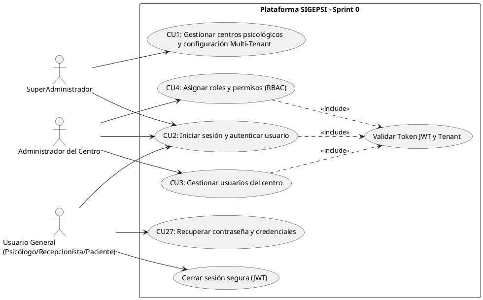

<br>

#### Diagrama de Clases del Sprint 0
Representa la estructura de entidades de dominio del Sprint 0, separando las clases globales alojadas en el esquema `public` de las clases aisladas por cada centro en su respectivo esquema `tenant`.

**Código PlantText / PlantUML (Diagrama de Clases):**
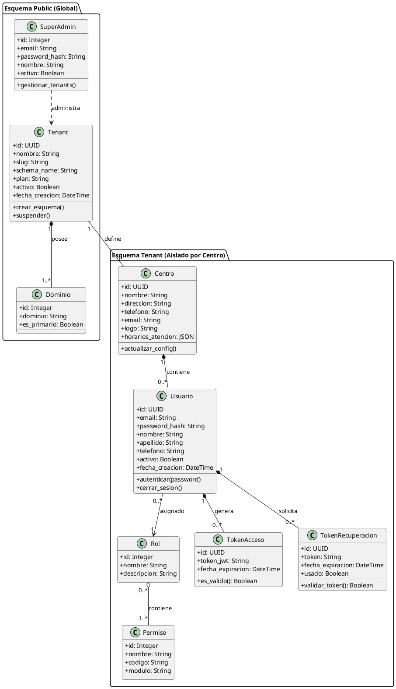

<br>

#### Diagrama de Actividad: Proceso de Autenticación JWT
El flujo de autenticación del Sprint 0 contempla la validación de credenciales, verificación de estado de cuenta, comprobación de tenant activo y emisión del token JWT.

**Código PlantText / PlantUML (Actividad: Autenticación):**
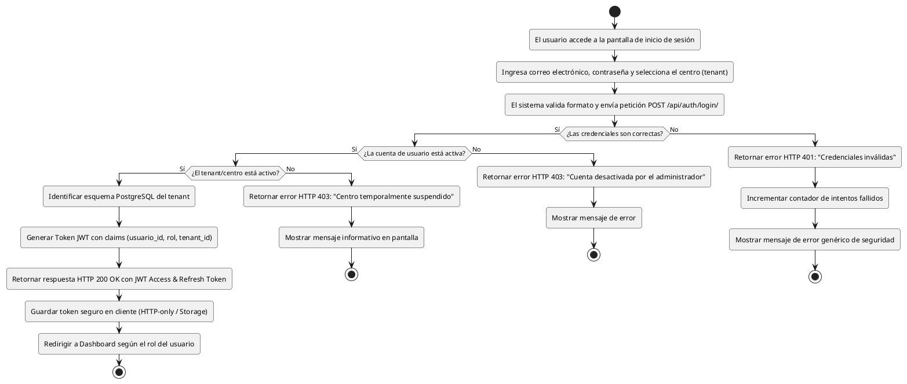

<br>

#### Diagrama de Actividad: Proceso de Aislamiento Multi-Tenant
Describe el ciclo de vida de una solicitud HTTP para garantizar que las consultas a la base de datos se ejecuten exclusivamente en el esquema PostgreSQL del centro correspondiente.

**Código PlantText / PlantUML (Actividad: Aislamiento Multi-Tenant):**
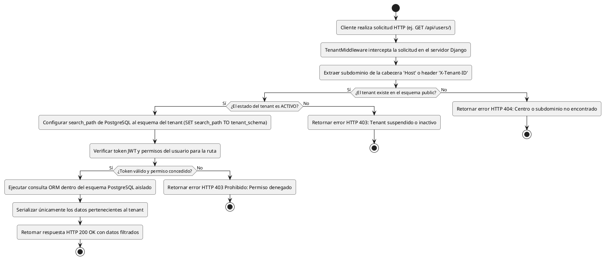

4.1.4 Sprint Backlog
El Sprint Backlog del Sprint 0 contiene las 18 tareas seleccionadas del Product Backlog, estructuradas según el formato oficial de gestión Scrum con su metadata, tipo de tarea, estimación en horas, responsable asignado y estado final.

| **Sprint Backlog** | |
| :--- | :--- |
| **Número de Sprint :** Sprint 0 | **Tiempo programado :** 1 semana (18 al 24 de agosto de 2026) |
| **Objetivo :** Configurar el entorno de desarrollo, implementar autenticación, gestión de usuarios/roles/permisos y arquitectura Multi-Tenant. | |
| **Fecha de inicio :** 18 de agosto de 2026 | **Fecha de finalización :** 24 de agosto de 2026 |

<br>

**Tabla de tareas:**

| Id | Tarea | Tipo | Estimación | Responsable | Estado |
| :--- | :--- | :--- | :---: | :--- | :---: |
| **SP0-1** | Entrevista con el Product Owner para identificar necesidades principales | Investigación | 4 hr | Equipo SCRUM | Terminado |
| **SP0-2** | Crear el perfil del proyecto | Documentación | 2 hr | Equipo SCRUM | Terminado |
| **SP0-3** | Explicar al Product Owner el funcionamiento de SCRUM | Capacitación | 2 hr | Equipo SCRUM | Terminado |
| **SP0-4** | Explicar al equipo la definición y formulación del problema | Análisis | 5 hr | Equipo SCRUM | Terminado |
| **SP0-5** | Realizar la asignación de roles del equipo SCRUM | Organización | 1 hr | Equipo SCRUM | Terminado |
| **SP0-6** | Capacitar a los integrantes en herramientas y tecnologías | Capacitación | 3 hr | Equipo SCRUM | Terminado |
| **SP0-7** | Preparar el entorno de desarrollo (backend, web, móvil, BD) | Infraestructura | 5 hr | Equipo SCRUM | Terminado |
| **SP0-8** | Presentar un prototipo inicial de la plataforma web y app móvil | Diseño | 6 hr | Equipo SCRUM | Terminado |
| **SP0-9** | Identificar los casos de uso funcionales de la plataforma | Análisis | 3 hr | Equipo SCRUM | Terminado |
| **SP0-10** | Realizar el modelado inicial de la base de datos PostgreSQL | Diseño | 8 hr | Mujica Vallejos Andy Mauricio | Terminado |
| **SP0-11** | Diseñar la interfaz de inicio de sesión | Diseño | 2 hr | Mujica Vallejos Andy Mauricio | Terminado |
| **SP0-12** | Implementar el registro, autenticación e inicio de sesión | Desarrollo | 5 hr | Mujica Vallejos Andy Mauricio | Terminado |
| **SP0-13** | Realizar pruebas del registro e inicio de sesión | Pruebas | 2 hr | Condori Diaz Marilyn Esther | Terminado |
| **SP0-14** | Diseñar la interfaz para gestión de usuarios, roles y permisos | Diseño | 4 hr | Larrazabal Rojas Julio Cesar | Terminado |
| **SP0-15** | Implementar la gestión de usuarios, roles y permisos | Desarrollo | 8 hr | Romero Saavedra Maria Ilse | Terminado |
| **SP0-16** | Diseñar la configuración de centros psicológicos Multi-Tenant | Diseño | 4 hr | Delgado Rojas Alberto Caleb | Terminado |
| **SP0-17** | Implementar el aislamiento de información Multi-Tenant | Desarrollo | 8 hr | Delgado Rojas Alberto Caleb | Terminado |
| **SP0-18** | Realizar pruebas de usuarios, roles, permisos y Multi-Tenant | Pruebas | 4 hr | Velasco Soliz Rolando | Terminado |
| **TOTAL** | **Esfuerzo total estimado del Sprint 0** | — | **76 hr** | **Equipo SCRUM (6 integrantes)** | **Terminado (100%)** |

4.1.5 Equipo SCRUM del Sprint 0

| Nombre del Integrante | Rol SCRUM | Tareas Asignadas (Sprint Backlog) |
| :--- | :--- | :--- |
| **Condori Diaz Marilyn Esther** | Product Owner | SP0-1 a SP0-9 (Equipo), SP0-13 |
| **Delgado Rojas Alberto Caleb** | Scrum Master | SP0-1 a SP0-9 (Equipo), SP0-16, SP0-17 |
| **Mujica Vallejos Andy Mauricio** | Development Team | SP0-1 a SP0-9 (Equipo), SP0-10, SP0-11, SP0-12 |
| **Larrazabal Rojas Julio Cesar** | Development Team | SP0-1 a SP0-9 (Equipo), SP0-14 |
| **Romero Saavedra Maria Ilse** | Development Team | SP0-1 a SP0-9 (Equipo), SP0-15 |
| **Velasco Soliz Rolando** | Development Team | SP0-1 a SP0-9 (Equipo), SP0-18 |

4.2 PROCESO/PATRÓN DE DESARROLLO POR HISTORIA DE USUARIO

4.2.1 Diseño

4.2.1.1 Diseño de la Arquitectura
La arquitectura del Sprint 0 se basa en un modelo de tres capas con separación estricta entre frontend, backend y base de datos, desplegado bajo un esquema Multi-Tenant. A continuación se presentan las especificaciones y el código para generar los diagramas en **PlantText / PlantUML**:

Capa de Presentación (Frontend):
•	Plataforma Web: Angular 17 con TypeScript, componentes modulares, routing y formularios reactivos.
•	Aplicación Móvil: Flutter 3.x con Dart, diseño Material Design.
•	Comunicación: Consumo de API REST mediante HTTP Client con interceptores para JWT.

Capa de Lógica de Negocio (Backend):
•	Framework: Django 5.x con Django REST Framework.
•	Autenticación: JSON Web Tokens (JWT) mediante djangorestframework-simplejwt.
•	Multi-Tenancy: Librería django-tenants para gestión de esquemas PostgreSQL.
•	Permisos: Sistema de permisos basado en roles (RBAC) con decoradores personalizados.
•	Apps Django del Sprint 0: core, accounts, tenants.

Capa de Datos:
•	Motor: PostgreSQL 16.
•	Estrategia Multi-Tenant: Aislamiento por esquema. Esquema public para datos compartidos (tenants, superadmin). Un esquema por cada centro psicológico para datos aislados (usuarios, roles, permisos, configuración).
•	ORM: Django ORM con migraciones automáticas por esquema.

**Código PlantText / PlantUML (Diagrama de Arquitectura de 3 Capas):**
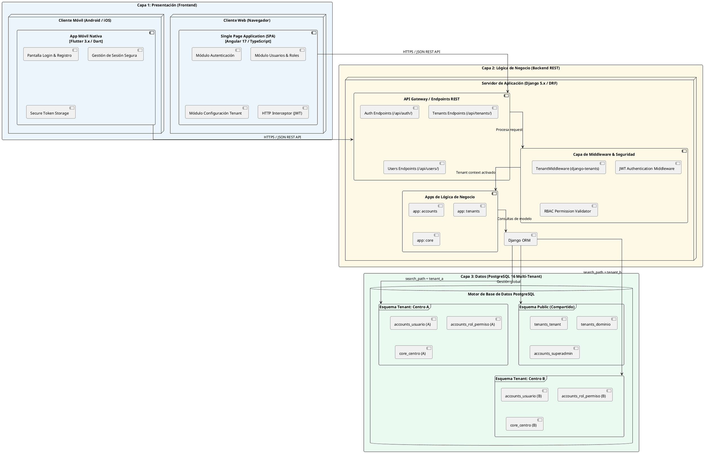

<br>

#### Diagrama de Despliegue
Describe los nodos físicos y de infraestructura donde se ejecutan los artefactos de software compilados, servidores web, middlewares y bases de datos.

**Código PlantText / PlantUML (Diagrama de Despliegue):**
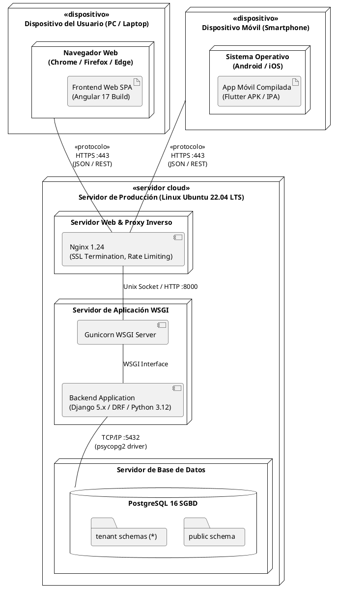

4.2.1.2 Diseño de Datos
El modelo de datos del Sprint 0 contempla las siguientes tablas principales organizadas en esquemas PostgreSQL:

Esquema public (compartido):
Tabla	Campos principales	Descripción
tenants_tenant	id, nombre, slug, schema_name, activo, fecha_creacion	Registro de centros psicológicos suscritos
tenants_dominio	id, dominio, tenant_id, es_primario	Dominios asociados a cada tenant
accounts_superadmin	id, email, password, nombre, apellido, activo	Cuenta del SuperAdministrador de la plataforma

Esquema por tenant (aislado por centro):
Tabla	Campos principales	Descripción
accounts_usuario	id, email, password, nombre, apellido, telefono, rol_id, activo, fecha_creacion	Usuarios registrados del centro
accounts_rol	id, nombre, descripcion	Roles disponibles (Admin, Recepcionista, Coordinador, Psicólogo, Paciente)
accounts_permiso	id, nombre, codigo, descripcion	Permisos individuales del sistema
accounts_rol_permiso	id, rol_id, permiso_id	Relación muchos a muchos entre roles y permisos
core_centro	id, nombre, direccion, telefono, email, logo, horario_atencion, configuracion	Datos institucionales del centro psicológico
accounts_token_recuperacion	id, usuario_id, token, fecha_expiracion, usado	Tokens para recuperación de contraseña

4.2.1.3 Diseño de la Lógica de Negocio
La lógica de negocio del Sprint 0 se documenta mediante los siguientes flujos de proceso:

Flujo 1: Registro e Inicio de Sesión (HU-01, HU-02)
1.	El usuario accede al formulario de registro o login.
2.	Para registro: El sistema valida el correo (unicidad) y la contraseña (requisitos de seguridad), crea el usuario en el esquema correspondiente y genera un token JWT.
3.	Para login: El sistema valida las credenciales, verifica que la cuenta esté activa, identifica el tenant, genera un token JWT con claims de usuario, rol y tenant, y redirige al panel correspondiente.
4.	Para logout (HU-09): El sistema invalida el token JWT del usuario y limpia la sesión del lado del cliente.
5.	Para recuperación (HU-10): El sistema genera un token temporal, envía un correo con enlace de restablecimiento y permite al usuario crear una nueva contraseña dentro del periodo de validez.

Flujo 2: Gestión de Usuarios, Roles y Permisos (HU-05, HU-06)
1.	El Administrador del Centro accede al módulo de gestión de usuarios.
2.	Puede crear, editar, activar o desactivar usuarios dentro de su tenant.
3.	Asigna un rol a cada usuario (Recepcionista, Coordinador Clínico, Psicólogo).
4.	Cada rol tiene un conjunto de permisos predefinidos que controlan el acceso a funcionalidades.
5.	El middleware de permisos verifica en cada solicitud que el usuario tenga el permiso necesario para la acción solicitada.

Flujo 3: Gestión Multi-Tenant (HU-03, HU-04, HU-07, HU-08)
1.	El SuperAdministrador da de alta un nuevo centro psicológico.
2.	El sistema crea un nuevo registro en la tabla de tenants y genera el esquema PostgreSQL correspondiente.
3.	Las migraciones de Django se ejecutan automáticamente en el nuevo esquema.
4.	Se crea un Administrador del Centro por defecto para el nuevo tenant.
5.	Cada solicitud HTTP es interceptada por el middleware de tenant que identifica el esquema correcto según el subdominio o header.
6.	Todas las consultas a la base de datos se ejecutan dentro del esquema del tenant identificado, garantizando el aislamiento de datos.

A continuación se presentan los **Diagramas de Comunicación** de los casos de uso del Sprint 0 bajo el estándar UML y el patrón de análisis **BCE (Boundary - Control - Entity / Interfaz - Control - Entidad)**, modelando la interacción horizontal de objetos con mensajería numerada bidireccional y 100% compatibles con el compilador de **PlantText / PlantUML**, basados estrictamente en el código fuente del prototipo:

#### Diagrama de Comunicación – CU2: Gestionar Inicio de Sesión y Autenticación (HU-01, HU-02)

**Código PlantText / PlantUML (Diagrama de Comunicación – CU2):**
```plantuml
@startuml
skinparam shadowing false
skinparam defaultFontName Arial
skinparam backgroundColor #FAFBFD
left to right direction

skinparam actor {
    BackgroundColor #FFF2CC
    BorderColor #2C3E50
}
skinparam boundary {
    BackgroundColor #D4F6F8
    BorderColor #2C3E50
}
skinparam control {
    BackgroundColor #D4F6F8
    BorderColor #2C3E50
}
skinparam entity {
    BackgroundColor #D4F6F8
    BorderColor #2C3E50
}
skinparam arrow {
    Color #2C3E50
    FontColor #1A252C
    FontSize 11
}

actor "Usuario\n(Todos los roles)" as act
boundary "IU_Login\n(Angular / Móvil)" as iu
control "CTR_AuthService\n(Django REST)" as ctr
entity "CE_Usuario_y_Tenant\n(PostgreSQL)" as ce

act -- iu : 1: Ingresar credenciales (email, password, tenant) >\n< 10: Redirigir a Dashboard según rol
iu -- ctr : 2: POST /api/auth/login/ >\n< 9: 200 OK (access_token, refresh_token, usuario, rol)
ctr -- ce : 3: Validar tenant y conmutar schema >\n< 4: Esquema PostgreSQL activo\n5: SELECT usuario WHERE email = ? AND activo = true >\n< 6: Retornar usuario y hash password\n7: Verificar password (PBKDF2) y generar JWT >\n< 8: Tokens JWT generados (con claims)
@enduml
```

<br>

#### Diagrama de Comunicación – CU2 (Logout): Cierre de Sesión Seguro (HU-09)

**Código PlantText / PlantUML (Diagrama de Comunicación – CU2 Logout):**
```plantuml
@startuml
skinparam shadowing false
skinparam defaultFontName Arial
skinparam backgroundColor #FAFBFD
left to right direction

skinparam actor {
    BackgroundColor #FFF2CC
    BorderColor #2C3E50
}
skinparam boundary {
    BackgroundColor #D4F6F8
    BorderColor #2C3E50
}
skinparam control {
    BackgroundColor #D4F6F8
    BorderColor #2C3E50
}
skinparam entity {
    BackgroundColor #D4F6F8
    BorderColor #2C3E50
}
skinparam arrow {
    Color #2C3E50
    FontColor #1A252C
    FontSize 11
}

actor "Usuario Autenticado\n(Todos los roles)" as act
boundary "IU_Navbar\n(Angular / Móvil)" as iu
control "CTR_AuthLogout\n(Django REST)" as ctr
entity "CE_TokenBlacklist\n(PostgreSQL)" as ce

act -- iu : 1: Click en 'Cerrar Sesión' >\n< 8: Redirigir a pantalla de Login
iu -- ctr : 2: POST /api/auth/logout/ {refresh} + Bearer JWT >\n< 7: 200 OK {"mensaje": "Sesión cerrada"}
ctr -- ce : 3: Validar token y autenticación de usuario >\n< 4: Refresh token válido\n5: INSERT INTO token_blacklist (token, fecha) >\n< 6: Token revocado en lista negra
@enduml
```

<br>

#### Diagrama de Comunicación – CU27: Recuperar Contraseña y Credenciales (HU-10)

**Código PlantText / PlantUML (Diagrama de Comunicación – CU27):**
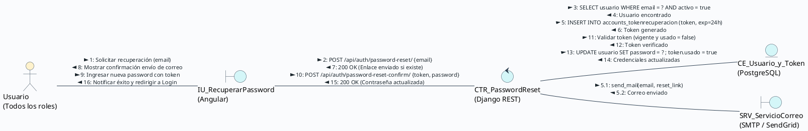

<br>

#### Diagrama de Comunicación – CU3: Gestionar Usuarios (HU-05)

**Código PlantText / PlantUML (Diagrama de Comunicación – CU3):**
```plantuml
@startuml
skinparam shadowing false
skinparam defaultFontName Arial
skinparam backgroundColor #FAFBFD
left to right direction

skinparam actor {
    BackgroundColor #FFF2CC
    BorderColor #2C3E50
}
skinparam boundary {
    BackgroundColor #D4F6F8
    BorderColor #2C3E50
}
skinparam control {
    BackgroundColor #D4F6F8
    BorderColor #2C3E50
}
skinparam entity {
    BackgroundColor #D4F6F8
    BorderColor #2C3E50
}
skinparam arrow {
    Color #2C3E50
    FontColor #1A252C
    FontSize 11
}

actor "Administrador\ndel Centro" as act
boundary "IU_GestionUsuarios\n(Angular)" as iu
control "CTR_UsuarioService\n(Django REST)" as ctr
entity "CE_Usuario_y_Rol\n(PostgreSQL)" as ce

act -- iu : 1: Ingresar datos de nuevo usuario (email, rol, password) >\n< 12: Mostrar confirmación 'Usuario creado'
iu -- ctr : 2: POST /api/users/ + JWT Header >\n< 11: 201 Created {usuario_creado}
ctr -- ce : 3: Validar JWT, TenantMiddleware y rol Admin Centro >\n< 4: Contexto tenant y permisos verificados\n5: Validar datos y unicidad de email >\n< 6: Email disponible\n7: SELECT rol WHERE id = ? >\n< 8: Rol encontrado\n9: INSERT INTO accounts_usuario (email, password_hash, rol_id) >\n< 10: Usuario guardado en esquema tenant
@enduml
```

<br>

#### Diagrama de Comunicación – CU4: Gestionar Roles y Permisos (HU-06)

**Código PlantText / PlantUML (Diagrama de Comunicación – CU4):**
```plantuml
@startuml
skinparam shadowing false
skinparam defaultFontName Arial
skinparam backgroundColor #FAFBFD
left to right direction

skinparam actor {
    BackgroundColor #FFF2CC
    BorderColor #2C3E50
}
skinparam boundary {
    BackgroundColor #D4F6F8
    BorderColor #2C3E50
}
skinparam control {
    BackgroundColor #D4F6F8
    BorderColor #2C3E50
}
skinparam entity {
    BackgroundColor #D4F6F8
    BorderColor #2C3E50
}
skinparam arrow {
    Color #2C3E50
    FontColor #1A252C
    FontSize 11
}

actor "Administrador\ndel Centro" as act
boundary "IU_GestionRoles\n(Angular)" as iu
control "CTR_RolService\n(Django REST)" as ctr
entity "CE_Rol_y_Permiso\n(PostgreSQL)" as ce

act -- iu : 1: Seleccionar permisos para el rol (rol_id, [permiso_ids]) >\n< 12: Mostrar confirmación 'Permisos actualizados'
iu -- ctr : 2: PUT /api/roles/{id}/ {permisos: [ids]} + JWT >\n< 11: 200 OK {rol_actualizado}
ctr -- ce : 3: Validar JWT, permisos RBAC y esquema tenant >\n< 4: Permisos administrativos verificados\n5: SELECT * FROM accounts_permiso WHERE id IN (?) >\n< 6: Permisos validados\n7: DELETE FROM accounts_rol_permiso WHERE rol_id = ? >\n< 8: Permisos anteriores desvinculados\n9: INSERT INTO accounts_rol_permiso (rol_id, permiso_id) >\n< 10: Nuevos permisos registrados en esquema
@enduml
```

<br>

#### Diagrama de Comunicación – CU1: Gestionar Centros Psicológicos y Configuración Multi-Tenant (HU-03, HU-04, HU-07, HU-08)

**Código PlantText / PlantUML (Diagrama de Comunicación – CU1):**
```plantuml
@startuml
skinparam shadowing false
skinparam defaultFontName Arial
skinparam backgroundColor #FAFBFD
left to right direction

skinparam actor {
    BackgroundColor #FFF2CC
    BorderColor #2C3E50
}
skinparam boundary {
    BackgroundColor #D4F6F8
    BorderColor #2C3E50
}
skinparam control {
    BackgroundColor #D4F6F8
    BorderColor #2C3E50
}
skinparam entity {
    BackgroundColor #D4F6F8
    BorderColor #2C3E50
}
skinparam arrow {
    Color #2C3E50
    FontColor #1A252C
    FontSize 11
}

actor "SuperAdministrador" as act
boundary "IU_FormularioCentro\n(Angular)" as iu
control "CTR_TenantService\n(Django)" as ctr
entity "CE_Tenant_y_Dominio\n(PostgreSQL)" as ce

act -- iu : 1: Ingresar datos de Centro >\n< 10: Mostrar confirmación
iu -- ctr : 2: POST /api/tenants/ >\n< 9: 201 Created
ctr -- ce : 3: Valida disponibilidad Dominio >\n< 4: Dominio disponible\n5: insert(Tenant, Dominio) >\n< 6: Registros creados\n7: CREATE SCHEMA y Migraciones >\n< 8: Esquema creado
@enduml
```


4.2.2 Implementación

4.2.2.1 Componentes y Artefactos Generados
Durante el Sprint 0 se generaron los siguientes componentes y artefactos de software:

Backend (Django/DRF):
Componente	Descripción	Archivos principales
App accounts	Gestión de usuarios, roles, permisos y autenticación JWT	models.py, serializers.py, views.py, urls.py, permissions.py
App tenants	Gestión de tenants, creación de esquemas y middleware Multi-Tenant	models.py, middleware.py, serializers.py, views.py, urls.py
App core	Modelo de centro psicológico y configuración institucional	models.py, serializers.py, views.py, urls.py
Middleware JWT	Interceptor para validación de tokens en cada solicitud	middleware/auth_middleware.py
Middleware Tenant	Interceptor para identificación y routing de tenant	middleware/tenant_middleware.py

Endpoints API REST generados:
Método	Endpoint	Descripción
POST	/api/auth/register/	Registro de usuario
POST	/api/auth/login/	Inicio de sesión (retorna JWT)
POST	/api/auth/logout/	Cierre de sesión (invalida JWT)
POST	/api/auth/password-reset/	Solicitud de recuperación de contraseña
POST	/api/auth/password-reset-confirm/	Confirmación de nueva contraseña
GET/POST	/api/users/	Listar y crear usuarios del centro
GET/PUT/DELETE	/api/users/{id}/	Consultar, actualizar y eliminar usuario
GET/POST	/api/roles/	Listar y crear roles
GET/PUT/DELETE	/api/roles/{id}/	Consultar, actualizar y eliminar rol
GET/POST	/api/tenants/	Listar y crear centros psicológicos (SuperAdmin)
GET/PUT/DELETE	/api/tenants/{id}/	Consultar, actualizar y desactivar centro
GET/PUT	/api/centro/config/	Consultar y actualizar configuración del centro

Frontend Web (Angular):
Componente	Descripción
LoginComponent	Formulario de inicio de sesión con validación reactiva
RegisterComponent	Formulario de registro de usuario con validación de contraseña
PasswordResetComponent	Formulario de solicitud de recuperación de contraseña
DashboardComponent	Panel principal con redirección por rol
UserListComponent	Listado de usuarios del centro con filtros y paginación
UserFormComponent	Formulario de creación y edición de usuarios
RoleListComponent	Listado de roles con permisos asignados
RoleFormComponent	Formulario de creación y edición de roles con asignación de permisos
TenantListComponent	Listado de centros psicológicos (vista SuperAdmin)
TenantFormComponent	Formulario de alta y edición de centros psicológicos
CentroConfigComponent	Formulario de configuración del centro
AuthService	Servicio de autenticación con manejo de JWT
AuthGuard	Guardián de rutas basado en autenticación y rol
AuthInterceptor	Interceptor HTTP para adjuntar token JWT a solicitudes

4.2.3 Pruebas

4.2.3.1 Plan de Pruebas (basado en Criterios de Aceptación)
El plan de pruebas del Sprint 0 se basa en los criterios de aceptación definidos para cada historia de usuario. Cada criterio de aceptación se traduce en uno o más casos de prueba.

ID Prueba	HU	Descripción de la prueba	Resultado esperado
TP-01	HU-01	Registrar SuperAdmin con datos válidos	Cuenta creada, redirección al panel
TP-02	HU-01	Registrar SuperAdmin con correo duplicado	Mensaje de error: correo en uso
TP-03	HU-01	Registrar con contraseña débil	Mensaje con requisitos faltantes
TP-04	HU-02	Login con credenciales correctas	Token JWT generado, redirección por rol
TP-05	HU-02	Login con credenciales incorrectas	Mensaje de error genérico
TP-06	HU-02	Login con cuenta suspendida	Mensaje: cuenta no disponible
TP-07	HU-03	Alta de centro con datos completos	Tenant creado con esquema aislado
TP-08	HU-03	Alta de centro con nombre duplicado	Mensaje de error: nombre en uso
TP-09	HU-04	Editar configuración del centro	Datos actualizados, mensaje de confirmación
TP-10	HU-05	Registrar usuario dentro del centro	Usuario creado en el tenant correcto
TP-11	HU-05	Registrar usuario con correo duplicado en el centro	Mensaje de error: correo ya registrado
TP-12	HU-06	Asignar rol de Psicólogo a un usuario	Usuario accede solo a funcionalidades clínicas
TP-13	HU-06	Cambiar rol de Recepcionista a Coordinador	Nuevo rol reflejado en siguiente sesión
TP-14	HU-06	Acceso a función no autorizada por rol	Acceso denegado, mensaje de autorización insuficiente
TP-15	HU-07	Consultar datos desde Centro A	Solo se muestran datos del Centro A
TP-16	HU-07	Acceso cruzado entre tenants	Acceso denegado
TP-17	HU-07	Verificar esquemas PostgreSQL separados	Cada centro tiene esquema independiente
TP-18	HU-08	Editar datos de un centro suscrito	Cambios reflejados inmediatamente
TP-19	HU-08	Suspender un centro	Usuarios del centro no pueden acceder
TP-20	HU-08	Dar de baja un centro	Centro eliminado de la lista activa
TP-21	HU-09	Cerrar sesión activa	Token invalidado, redirección al login
TP-22	HU-09	Acceso después de cerrar sesión	Redirección al formulario de login
TP-23	HU-10	Solicitar recuperación con correo válido	Correo enviado con enlace de restablecimiento
TP-24	HU-10	Restablecer contraseña con enlace válido	Contraseña actualizada exitosamente
TP-25	HU-10	Usar enlace de recuperación expirado	Mensaje: enlace no válido

4.2.3.2 Reporte de Pruebas
ID Prueba	HU	Resultado	Observaciones
TP-01	HU-01	Aprobado	Registro exitoso con validaciones correctas
TP-02	HU-01	Aprobado	Error mostrado correctamente para correo duplicado
TP-03	HU-01	Aprobado	Validación de seguridad de contraseña funcional
TP-04	HU-02	Aprobado	Token JWT generado y redirección por rol correcta
TP-05	HU-02	Aprobado	Mensaje genérico sin revelar existencia del correo
TP-06	HU-02	Aprobado	Cuenta suspendida muestra mensaje apropiado
TP-07	HU-03	Aprobado	Esquema PostgreSQL creado automáticamente
TP-08	HU-03	Aprobado	Validación de nombre duplicado funcional
TP-09	HU-04	Aprobado	Configuración guardada correctamente
TP-10	HU-05	Aprobado	Usuario creado dentro del tenant correcto
TP-11	HU-05	Aprobado	Validación de correo duplicado dentro del tenant
TP-12	HU-06	Aprobado	Permisos aplicados correctamente según rol
TP-13	HU-06	Aprobado	Cambio de rol reflejado en siguiente sesión
TP-14	HU-06	Aprobado	Acceso denegado con mensaje claro
TP-15	HU-07	Aprobado	Aislamiento de datos verificado entre tenants
TP-16	HU-07	Aprobado	Acceso cruzado bloqueado correctamente
TP-17	HU-07	Aprobado	Esquemas PostgreSQL completamente separados
TP-18	HU-08	Aprobado	Edición de centro funcional
TP-19	HU-08	Aprobado	Suspensión bloquea acceso de usuarios del centro
TP-20	HU-08	Aprobado	Baja de centro funcional
TP-21	HU-09	Aprobado	Token invalidado y sesión cerrada correctamente
TP-22	HU-09	Aprobado	Redirección al login después de cerrar sesión
TP-23	HU-10	Aprobado	Correo de recuperación enviado exitosamente
TP-24	HU-10	Aprobado	Restablecimiento de contraseña funcional
TP-25	HU-10	Aprobado	Enlace expirado detectado correctamente

Resumen de pruebas: 25 pruebas ejecutadas, 25 aprobadas, 0 fallidas.

4.3 DAILY SCRUM (O SCRUM DIARIO)
El Sprint 0 se desarrolló del 18/08/2026 al 24/08/2026, abarcando las tareas SP0-1 a SP0-18, enfocadas en la preparación del entorno de desarrollo, autenticación segura, gestión de usuarios, control de roles/permisos y arquitectura Multi-Tenant.

Durante la ejecución del Sprint, el equipo experimentó importantes desafíos y obstáculos reales que condicionaron el avance diario:
•	**Dificultades con el tiempo y plazos ajustados:** Sobrecarga horaria, cruce con compromisos académicos y estimaciones optimistas que generaron presión en la entrega de tareas clave.
•	**Conflictos y falta de acuerdo entre compañeros:** Desacuerdos iniciales en la distribución de cargas de trabajo, diferencias de criterio en el diseño de las interfaces y discusiones sobre la arquitectura que requirieron la intervención y mediación activa del Scrum Master.
•	**Curva de aprendizaje en tecnologías desconocidas:** Desconocimiento previo de **Angular 17** (TypeScript, componentes standalone, routing y formularios reactivos) por parte del equipo frontend, así como la complejidad técnica de herramientas como **django-tenants** (aislamiento de esquemas PostgreSQL), **Docker** y **Enterprise Architect**.

A continuación se documenta el seguimiento diario individual de los 6 integrantes del equipo SCRUM reflejando las tareas y obstáculos afrontados:

<br>

#### Delgado Rojas Alberto Caleb (Scrum Master)
| Fecha | ¿Qué hiciste ayer? | ¿Qué hiciste hoy? | Obstáculo |
| :---: | :--- | :--- | :--- |
| **18/08** | Planificación inicial del proyecto | Asignación de roles del equipo (SP0-5) y organización de tareas SP0-1 a SP0-18 | Desacuerdos iniciales en el reparto de tareas |
| **19/08** | Coordinación con el Product Owner | Apoyo en la formulación del problema (SP0-4) y mediación en el equipo | Conflictos entre integrantes por diferencias de criterio técnico |
| **20/08** | Capacitación de herramientas ágiles (SP0-6) | Coordinación en la preparación del entorno de desarrollo (SP0-7) | Falta de tiempo del equipo por cruce de horarios universitarios |
| **21/08** | Revisión de casos de uso (SP0-9) | Análisis del diseño de arquitectura Multi-Tenant y subdominios | Curva de aprendizaje empinada en django-tenants |
| **22/08** | Supervisión del avance en Figma y BD | Diseño de configuración de centros Multi-Tenant (SP0-16) | Presión de tiempo y retrasos en entregables previos |
| **23/08** | Diseño de centros Multi-Tenant | Implementación del aislamiento por esquemas PostgreSQL (SP0-17) | Complejidad en la configuración de migraciones por tenant |
| **24/08** | Pruebas de integración Multi-Tenant | Preparación del Sprint Review y sesión de retrospectiva | Ninguno |

<br>

#### Condori Diaz Marilyn Esther (Product Owner)
| Fecha | ¿Qué hiciste ayer? | ¿Qué hiciste hoy? | Obstáculo |
| :---: | :--- | :--- | :--- |
| **18/08** | Definición del alcance inicial | Entrevista inicial con el equipo para definir necesidades (SP0-1) | Dificultad para consensuar prioridades con los desarrolladores |
| **19/08** | Revisión de requerimientos del sistema | Elaboración del perfil del proyecto y formulación del problema (SP0-2) | Falta de tiempo para coordinar revisiones conjuntas |
| **20/08** | Documentación de perfil | Comprensión del flujo de ceremonias Scrum y criterios de aceptación (SP0-3) | Desacuerdos sobre el alcance del Sprint 0 |
| **21/08** | Validación de alcance funcional | Revisión de casos de uso identificados y priorización en el Backlog (SP0-9) | Retrasos en la entrega de definiciones por parte del equipo |
| **22/08** | Validación de criterios de aceptación | Revisión y feedback de prototipos de Login y Usuarios en Figma (SP0-8, SP0-11) | Cambios solicitados en diseño generaron tensiones internas |
| **23/08** | Verificación de requerimientos de seguridad | Pruebas funcionales del módulo de registro e inicio de sesión (SP0-13) | Presión de tiempo para validar antes del cierre de sprint |
| **24/08** | Validación de historias de usuario | Aprobación del incremento de software en el Sprint Review (DoD) | Ninguno |

<br>

#### Mujica Vallejos Andy Mauricio (Development Team - Fullstack / BD)
| Fecha | ¿Qué hiciste ayer? | ¿Qué hiciste hoy? | Obstáculo |
| :---: | :--- | :--- | :--- |
| **18/08** | Asignación de tareas técnicas | Instalación de PostgreSQL 16 y extensiones requeridas | Desconocimiento previo de la configuración de esquemas PostgreSQL |
| **19/08** | Análisis de entidades de usuarios y centros | Diseño conceptual y relacional de la base de datos | Discusiones con frontend sobre la estructura de respuestas JSON |
| **20/08** | Configuración de entorno backend Django | Modelado inicial de tablas en PostgreSQL con esquemas aislados (SP0-10) | Problemas de compatibilidad con librerías y falta de tiempo |
| **21/08** | Migraciones de base de datos | Diseño de la interfaz de inicio de sesión en Figma (SP0-11) | Limitada experiencia previa en diseño UI/UX con Figma |
| **22/08** | Prototipo de pantalla de login | Implementación de vistas y serializers de registro y JWT (SP0-12) | Errores en la validación de tokens y sobrecarga de horas |
| **23/08** | Generación de tokens JWT | Implementación del flujo de recuperación de contraseña con tokens | Tiempo muy ajustado para finalizar endpoints |
| **24/08** | Corrección de validaciones | Apoyo en la integración de pruebas y entrega del incremento funcional | Ninguno |

<br>

#### Larrazabal Rojas Julio Cesar (Development Team - Frontend / UI)
| Fecha | ¿Qué hiciste ayer? | ¿Qué hiciste hoy? | Obstáculo |
| :---: | :--- | :--- | :--- |
| **18/08** | Planificación de componentes de interfaz | Instalación de Node.js, Angular CLI y configuración del proyecto Angular 17 | Desconocimiento de Angular 17 y TypeScript; curva muy difícil |
| **19/08** | Exploración del sistema de diseño | Definición de paleta de colores, tipografía Inter y estilos base | Conflictos de opinión con compañeros sobre el diseño visual |
| **20/08** | Configuración de routing y módulos Angular | Diseño de prototipos iniciales de plataforma web y app móvil en Figma (SP0-8) | Dificultad para estructurar componentes standalone en Angular |
| **21/08** | Maquetación de componentes base | Diseño de interfaz para gestión de usuarios, roles y permisos en Figma (SP0-14) | Falta de tiempo por cruce con materias universitarias |
| **22/08** | Prototipo de matriz de permisos | Maquetación de vistas de administración de usuarios en Angular | Complejidad con formularios reactivos y validaciones frontend |
| **23/08** | Enlace de vistas con API REST | Implementación de interceptor HTTP para adjuntar token JWT en peticiones | Desconocimiento del manejo de interceptores y RxJS en Angular |
| **24/08** | Ajustes visuales de responsividad | Verificación de componentes UI y cierre del backlog de diseño frontend | Ninguno |

<br>

#### Romero Saavedra Maria Ilse (Development Team - Backend / Lógica)
| Fecha | ¿Qué hiciste ayer? | ¿Qué hiciste hoy? | Obstáculo |
| :---: | :--- | :--- | :--- |
| **18/08** | Configuración de repositorio Git | Instalación de entorno virtual Python 3.12 y Django REST Framework | Problemas con dependencias y conflictos de versiones |
| **19/08** | Creación de apps `accounts` y `core` | Definición de modelos de datos para Usuario, Rol y Permiso | Desacuerdos con el equipo sobre el modelo de permisos RBAC |
| **20/08** | Configuración de migraciones | Capacitación en control de accesos basado en roles (RBAC) | Falta de tiempo y cansancio acumulado |
| **21/08** | Creación de endpoints base | Implementación de lógica de negocio para registro y gestión de usuarios (SP0-15) | Dificultad para integrar endpoints con la estructura de Angular |
| **22/08** | Endpoints de usuarios del centro | Desarrollo de endpoints para asignación de roles y permisos con decoradores | Errores en permisos de usuario y retrasos por falta de tiempo |
| **23/08** | Control de permisos RBAC | Pruebas de serialización y validación de unicidad de correos por centro | Discusión interna sobre manejo de respuestas de error |
| **24/08** | Corrección de errores en endpoints | Documentación de rutas API y finalización de tareas de desarrollo | Ninguno |

<br>

#### Velasco Soliz Rolando (Development Team - QA / Base de Datos)
| Fecha | ¿Qué hiciste ayer? | ¿Qué hiciste hoy? | Obstáculo |
| :---: | :--- | :--- | :--- |
| **18/08** | Revisión de requisitos no funcionales | Preparación de contenedores Docker para base de datos PostgreSQL | Desconocimiento en la configuración avanzada de Docker |
| **19/08** | Pruebas de conexión a BD | Colaboración en el análisis de formulación del problema y alcance | Falta de comunicación inicial entre integrantes del equipo |
| **20/08** | Configuración de entorno de pruebas | Definición de matriz de casos de prueba para autenticación y usuarios | Falta de tiempo para redactar casos de prueba detallados |
| **21/08** | Identificación de casos de uso | Elaboración de planes de prueba de aislamiento de datos Multi-Tenant | Duda sobre cómo probar aislamiento entre esquemas en PostgreSQL |
| **22/08** | Preparación de datos de prueba | Ejecución de pruebas unitarias sobre creación de esquemas dinámicos | Complejidad técnica en el manejo de search_path |
| **23/08** | Pruebas de acceso cruzado entre tenants | Ejecución del plan de pruebas integral de usuarios, roles y Multi-Tenant (SP0-18) | Tiempo crítico: se tuvieron que hacer pruebas hasta altas horas |
| **24/08** | Consolidación de reporte de pruebas | Verificación de 25/25 pruebas aprobadas y elaboración de métricas | Ninguno |

<br>

4.4 SPRINT REVIEW (REVISIÓN DE SPRINT)

| **Revisión de Sprint :** Sprint 0 |
| :--- |
| **Objetivos del Sprint**<br>*(Objetivos establecidos durante la planificación del sprint y evaluación del progreso como equipo)*<br>• **Configuración integral del entorno:** Preparar el entorno de desarrollo para backend (Django 5.x REST Framework), frontend web (Angular 17), aplicación móvil (Flutter 3) y base de datos (PostgreSQL 16).<br>• **Autenticación segura JWT:** Implementar el flujo de registro, login multi-rol, cierre de sesión y recuperación de credenciales mediante tokens JWT.<br>• **Gestión de usuarios y RBAC:** Implementar la administración de usuarios del centro, roles del sistema y asignación granular de permisos.<br>• **Arquitectura Multi-Tenant:** Implementar el aislamiento de datos por esquema en PostgreSQL utilizando `django-tenants`.<br>• **Diseño y prototipado:** Diseñar los prototipos de alta fidelidad en Figma para todas las interfaces del Sprint 0.<br>• **Evaluación del equipo:** **100% de los objetivos cumplidos.** Todos los criterios de aceptación y la Definition of Done (DoD) fueron validados y aprobados por el Product Owner. |

<br>

| **Participantes** | |
| :--- | :--- |
| **Nombre** | **Rol** |
| **Condori Diaz Marilyn Esther** | Product Owner |
| **Delgado Rojas Alberto Caleb** | Scrum Master |
| **Mujica Vallejos Andy Mauricio** | Development Team (Fullstack / Base de Datos) |
| **Larrazabal Rojas Julio Cesar** | Development Team (Frontend / UI Designer) |
| **Romero Saavedra Maria Ilse** | Development Team (Backend / Lógica de Negocio) |
| **Velasco Soliz Rolando** | Development Team (QA / Aseguramiento de Calidad) |

<br>

| **Presentación del incremento** | |
| :--- | :--- |
| **Función presentada** *(Elemento de trabajo presentado)* | **Retroalimentación** *(Preguntas, observaciones y comentarios)* |
| **Módulo de Registro e Inicio de Sesión Multi-Rol con JWT** *(HU-01, HU-02, HU-09, HU-10)* | **Aprobado.** El flujo de autenticación genera los tokens JWT de acceso y refresh correctamente con los claims de tenant y rol. *Sugerencia:* Añadir un indicador visual de fuerza de contraseña en el formulario frontend en el Sprint 1. |
| **Modelado e Inicialización de Base de Datos PostgreSQL 16** *(SP0-10)* | **Aprobado.** Estructura relacional con esquemas `public` y esquemas dinámicos por tenant creados correctamente con llaves UUID e integridad referencial. |
| **Gestión de Usuarios, Roles y Permisos RBAC** *(HU-05, HU-06)* | **Aprobado.** Asignación de roles operativos (Psicólogo, Recepcionista, Coordinador) y validación de permisos en endpoints. *Sugerencia:* Predefinir una matriz de permisos recomendada por defecto para cada rol clínico. |
| **Arquitectura Multi-Tenant con Aislamiento por Esquema** *(HU-03, HU-04, HU-07, HU-08)* | **Aprobado con distinción.** Se verificó en vivo que las consultas de un centro no acceden ni exponen información de otros centros gracias a la conmutación de `search_path`. |
| **Prototipos de Alta Fidelidad en Figma** *(SP0-8, SP0-11, SP0-14)* | **Aprobado.** Las pantallas reflejan fielmente el flujo de usuario y el diseño moderno del sistema. |
| **Reporte de Calidad y Pruebas de Aceptación** *(SP0-13, SP0-18)* | **Aprobado.** 25 de 25 pruebas de aceptación pasaron sin errores, validando los criterios definidos en las Historias de Usuario. |

<br>

4.5 SPRINT RETROSPECTIVE (RETROSPECTIVA DE SPRINT)

| **Retrospectiva de Sprint :** Sprint 0 | |
| :--- | :--- |
| **Fecha :** 24 de agosto de 2026 | |
| **Facilitador :** Delgado Rojas Alberto Caleb (Scrum Master) | |
| **Objetivo :** | Analizar con total honestidad cómo nos fue como equipo en este primer Sprint 0, qué problemas tuvimos con el tiempo, qué herramientas nos costaron aprender y qué compromisos reales tomaremos para que el Sprint 1 sea más ordenado y menos pesado. |
| **Nombres de asistentes :** | • **Condori Diaz Marilyn Esther** (Product Owner)<br>• **Delgado Rojas Alberto Caleb** (Scrum Master)<br>• **Mujica Vallejos Andy Mauricio** (Development Team)<br>• **Larrazabal Rojas Julio Cesar** (Development Team)<br>• **Romero Saavedra Maria Ilse** (Development Team)<br>• **Velasco Soliz Rolando** (Development Team) |
| **Temas a tratar :** | • Falta de tiempo, sobrecarga entre materias de la universidad y trasnoches de última hora.<br>• Choque con tecnologías nuevas (**Angular 17**, **django-tenants**, **Docker** y diagramación en **Enterprise Architect**).<br>• Malentendidos y discusiones entre compañeros por la carga de trabajo y el diseño de pantallas.<br>• Cosas positivas que logramos rescatar y compromisos claros para no tropezar con lo mismo. |

<br>

| **Discusión** | | |
| :--- | :--- | :--- |
| **¿Qué salió bien?** | **¿Qué no salió bien?** | **¿Qué haremos de manera diferente?** |
| • **El backend y la BD respondieron bien:** A pesar de que al inicio le teníamos miedo al multi-tenant, logramos que cada centro tenga su esquema separado en PostgreSQL y los datos no se mezclan.<br>• **Login y autenticación sólidos:** El registro y login con tokens JWT funcionaron a la primera en las pruebas.<br>• **Se cumplieron las 18 tareas:** Llegamos a terminar todo lo pactado y pasamos las 25 pruebas sin errores graves. | • **Peleamos mucho con django-tenants y Docker:** Nadie del grupo había manejado antes aislamiento por esquemas y perdimos casi dos días enteros intentando entender cómo funcionaban las migraciones y por qué a unos les corría en su máquina y a otros les daba error de conexión.<br>• Nos faltó investigar antes de ponernos a codificar. | • **Ayudarnos con la configuración:** Armar una guía corta paso a paso con los comandos exactos para levantar el backend y la base de datos sin renegar.<br>• Si alguien tiene problemas instalando algo en su compu, ayudarle en llamada en vez de dejar que pierda medio día solo. |
| • **Los diseños en Figma salvaron tiempo:** Tener las pantallas dibujadas antes de programar nos ayudó a no estar adivinando qué botones poner o cómo ordenar los formularios.<br>• **Las pruebas nos dieron tranquilidad:** Probar caso por caso nos ayudó a pillar fallas pequeñas antes de la presentación final. | • **Angular 17 nos costó muchísimo:** Ninguno del equipo frontend dominaba Angular moderno ni TypeScript. Nos costó entender los componentes standalone, cómo funcionaban los formularios reactivos y cómo atrapar los tokens con los interceptores.<br>• Tuvimos que pasar horas viendo tutoriales en YouTube y rehaciendo código que no compilaba. | • **Programar en parejas (pair programming):** Para las partes difíciles del frontend, juntarnos de a dos para avanzar más rápido y que el que entienda mejor le explique al otro.<br>• No complicarnos inventando componentes desde cero; apoyarnos en plantillas y ejemplos funcionales. |
| • **Hubo compromiso al final:** Aunque estábamos cansados y con el tiempo justo, nadie abandonó su parte y todos nos pusimos la camiseta para entregar el proyecto completo. | • **Nos confiamos feo con el tiempo:** Pensamos que 1 semana era suficiente y no tomamos en cuenta los choques de horarios de la universidad, tareas de otras materias ni imprevistos personales.<br>• Dejamos cosas pesadas para el fin de semana y tuvimos que trasnochar hasta la madrugada para llegar al cierre. | • **Poner tiempos más realistas:** No estimar como si tuviéramos todo el día libre; calcular horas dejando un colchón de 2 o 3 días antes de la entrega para imprevistos.<br>• Partir las tareas grandes en pedazos más chicos (de 2 a 4 horas) para no sentirnos abrumados. |
| • **El Scrum Master ayudó a calmar los ánimos:** Cuando se armaban discusiones pesadas, Alberto intervino para que no nos estanquemos y pudiéramos avanzar. | • **Roces y discusiones entre compañeros:** Tuvimos momentos de tensión por no ponernos de acuerdo rápido en quién hacía qué y por diferencias de opinión en el diseño visual de las pantallas.<br>• Varios se guardaron sus dudas por pena o por orgullo en vez de avisar rápido que estaban bloqueados. | • **Decir las cosas de frente y rápido:** Si alguien se traba más de 1 hora con un error, escribir directo al grupo de WhatsApp o Discord sin pena.<br>• Respetar las opiniones de los demás, repartir el trabajo de forma más justa y no tomarse las críticas técnicas como algo personal. |

<br>

4.6 BURNDOWN Y BURNUP

#### 4.6.1 Gráfica Burndown (Horas Restantes: Ideal vs. Real)
El **Burndown Chart** muestra la velocidad con la que el equipo quema trabajo a lo largo del Sprint. Compara la **línea ideal** (la trayectoria teórica para terminar en 0 horas) contra la **línea real** (las horas que efectivamente quedaban al final de cada jornada).

**Datos diarios de seguimiento (Burndown):**

| Día | Fecha | Horas Restantes (Ideal) | Horas Restantes (Real) | Horas Completadas en el Día | Horas Acumuladas |
| :---: | :---: | :---: | :---: | :---: | :---: |
| **Día 0** | 18/08 (Inicio) | 76 hr | 76 hr | 0 hr | 0 hr |
| **Día 1** | Lun 18/08 | 65 hr | 71 hr | 5 hr | 5 hr |
| **Día 2** | Mar 19/08 | 54 hr | 63 hr | 8 hr | 13 hr |
| **Día 3** | Mié 20/08 | 43 hr | 52 hr | 11 hr | 24 hr |
| **Día 4** | Jue 21/08 | 33 hr | 38 hr | 14 hr | 38 hr |
| **Día 5** | Vie 22/08 | 22 hr | 26 hr | 12 hr | 50 hr |
| **Día 6** | Sáb 23/08 | 11 hr | 12 hr | 14 hr | 64 hr |
| **Día 7** | Dom 24/08 | 0 hr | 0 hr | 12 hr | 76 hr |

<br>

**Representación visual del Gráfica Burndown:**

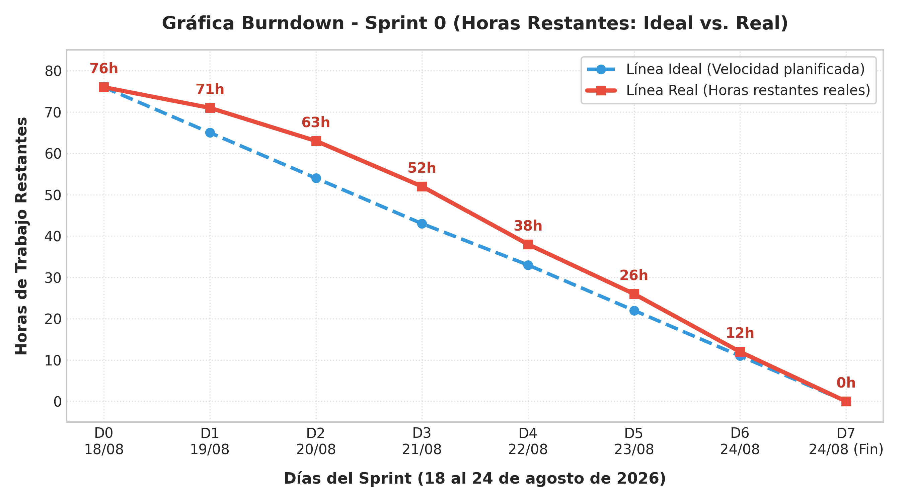

```text
Horas
 80 |  [●] (D0: 76h ideal / 76h real)
 70 |     \  [*] (D1: 71h real)  <-- Retraso por desacuerdos y arranque
 60 |      \    [*] (D2: 63h real)
 50 |       \      [*] (D3: 52h real) <-- Problemas con Docker y BD
 40 |        \        [*] (D4: 38h real)
 30 |         \          [*] (D5: 26h real) <-- Curva de aprendizaje Angular
 20 |          \            [*] (D6: 12h real) <-- Trasnoche del equipo
 10 |           \
  0 +------------\------------------[*] (D7: 0h) <-- Cierre con 100% de entrega
    D0   D1   D2   D3   D4   D5   D6   D7
    
    Leyenda:  (\) Línea Ideal (Celeste)    [*] Línea Real (Roja)
```

**Interpretación y análisis del Burndown:**
• **Eje X (Horizontal):** Representa los días del Sprint (Día 0 al Día 7).  
• **Eje Y (Vertical):** Representa las horas de trabajo que faltan por completar (de 0 a 80 horas).  
• **Línea Real por encima de la Ideal (Días 1 al 5):** Refleja fielmente los obstáculos reales vividos por el equipo: la falta de tiempo por choque de horarios universitarios, los desacuerdos iniciales en el reparto de tareas y la curva de aprendizaje empinada con `Angular 17` y `django-tenants`.  
• **Aceleración final (Días 6 y 7):** El equipo concentró esfuerzos en jornadas extendidas durante el fin de semana para depurar código, integrar el backend con el frontend y validar las 25 pruebas, logrando cerrar el Sprint en 0 horas pendientes.

---

<br>

#### 4.6.2 Gráfica Burnup (Tareas Completadas vs. Alcance Total)
El **Burnup Chart** muestra el avance acumulativo de las tareas terminadas (*Done*) respecto a la meta total fijada para el Sprint (18 tareas planificadas).

**Datos acumulados de progreso (Burnup):**

| Día | Fecha | Alcance Total (Tareas) | Tareas Completadas (Done) | % Avance Acumulado | Estado del Sprint |
| :---: | :---: | :---: | :---: | :---: | :--- |
| **Día 0** | 18/08 (Inicio) | 18 | 0 | 0% | Planificación inicial |
| **Día 1** | Lun 18/08 | 18 | 1 | 6% | Roles asignados (SP0-5) |
| **Día 2** | Mar 19/08 | 18 | 3 | 17% | Entrevista y metodología (SP0-1, SP0-3) |
| **Día 3** | Mié 20/08 | 18 | 6 | 33% | Perfil, formulación y capacitación (SP0-2, SP0-4, SP0-6) |
| **Día 4** | Jue 21/08 | 18 | 9 | 50% | Entorno, prototipo y casos de uso (SP0-7, SP0-8, SP0-9) |
| **Día 5** | Vie 22/08 | 18 | 12 | 67% | Modelado BD, diseño login y UI usuarios (SP0-10, SP0-11, SP0-14) |
| **Día 6** | Sáb 23/08 | 18 | 15 | 83% | Auth JWT, pruebas auth y diseño Multi-Tenant (SP0-12, SP0-13, SP0-16) |
| **Día 7** | Dom 24/08 | 18 | 18 | 100% | Usuarios/roles, aislamiento MT y pruebas QA (SP0-15, SP0-17, SP0-18) |

<br>

**Representación visual del Gráfica Burnup:**

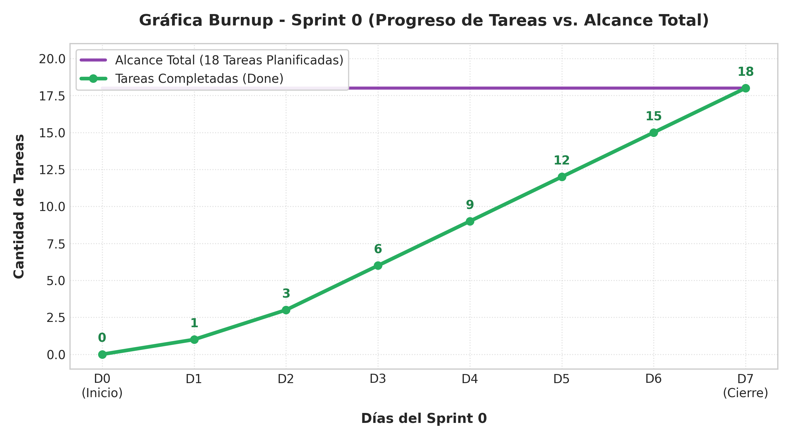

```text
Tareas
 18 |==================================[●] (Alcance Total Fijo: 18 tareas)
 15 |                               [*] (D6: 15 tareas)
 12 |                          [*] (D5: 12 tareas)
  9 |                     [*] (D4: 9 tareas - 50% del sprint)
  6 |                [*] (D3: 6 tareas)
  3 |           [*] (D2: 3 tareas)
  1 |      [*] (D1: 1 tarea)
  0 |-[*] (D0: 0 tareas)
    +------------------------------------
     D0    D1   D2   D3   D4   D5   D6   D7
     
     Leyenda:  (===) Alcance Total (Morado)    [*] Tareas Completadas (Verde)
```

**Interpretación y análisis del Burnup:**
• La línea superior fija en 18 demuestra que el **alcance no sufrió desviaciones ni se añadieron tareas fuera de plan**, manteniendo el foco en el objetivo del Sprint 0.  
• La línea ascendente muestra un ritmo de entrega constante de 3 tareas diarias promedio entre los días 2 y 7, alcanzando el 100% de cumplimiento.

---

<br>

4.7 GRÁFICA DE ESFUERZO Y DATOS DE ESFUERZO

#### 4.7.1 Datos de Esfuerzo por Tarea – Estimado vs. Real
La siguiente tabla compara las horas originalmente estimadas frente a las horas reales que tomó ejecutar cada tarea individualmente, señalando las desviaciones causadas por los desafíos técnicos y la curva de aprendizaje:

| NRO | ID | Tarea del Sprint Backlog | Horas Estimadas | Horas Reales | Desviación | Responsable | Causa de la Variación |
| :---: | :---: | :--- | :---: | :---: | :---: | :--- | :--- |
| 1 | **SP0-1** | Entrevista con el Product Owner | 4 hr | 4 hr | 0 hr | Equipo SCRUM | Dentro del tiempo previsto |
| 2 | **SP0-2** | Crear el perfil del proyecto | 2 hr | 3 hr | +1 hr | Equipo SCRUM | Ajuste en objetivos específicos |
| 3 | **SP0-3** | Explicar SCRUM al Product Owner | 2 hr | 1 hr | -1 hr | Equipo SCRUM | PO con conocimientos previos |
| 4 | **SP0-4** | Definición y formulación del problema | 5 hr | 5 hr | 0 hr | Equipo SCRUM | Consenso adecuado |
| 5 | **SP0-5** | Asignación de roles SCRUM | 1 hr | 1 hr | 0 hr | Equipo SCRUM | Roles definidos rápidamente |
| 6 | **SP0-6** | Capacitación en herramientas | 3 hr | 4 hr | +1 hr | Equipo SCRUM | Curva de aprendizaje en Angular/Docker |
| 7 | **SP0-7** | Preparar entorno de desarrollo | 5 hr | 6 hr | +1 hr | Equipo SCRUM | Configuración de PostgreSQL y dependencias |
| 8 | **SP0-8** | Prototipo inicial web y móvil | 6 hr | 7 hr | +1 hr | Equipo SCRUM | Discusiones sobre la paleta de colores UI |
| 9 | **SP0-9** | Identificar casos de uso funcionales | 3 hr | 3 hr | 0 hr | Equipo SCRUM | Matriz completada a tiempo |
| 10 | **SP0-10** | Modelado inicial BD PostgreSQL | 8 hr | 10 hr | +2 hr | Andy Mujica | Complejidad en llaves UUID y esquemas |
| 11 | **SP0-11** | Diseñar interfaz de inicio de sesión | 2 hr | 2 hr | 0 hr | Andy Mujica | Prototipo en Figma aprobado rápido |
| 12 | **SP0-12** | Implementar registro y login JWT | 5 hr | 6 hr | +1 hr | Andy Mujica | Ajustes en validaciones de serializers |
| 13 | **SP0-13** | Pruebas de registro e inicio de sesión | 2 hr | 2 hr | 0 hr | Esther Condori | Pruebas funcionales exitosas |
| 14 | **SP0-14** | Diseñar interfaz gestión usuarios/roles | 4 hr | 4 hr | 0 hr | Julio Cesar Larrazabal | Matriz de permisos estructurada en Figma |
| 15 | **SP0-15** | Implementar gestión de usuarios/roles | 8 hr | 9 hr | +1 hr | Maria Ilse Romero | Dificultad integrando endpoints con Angular |
| 16 | **SP0-16** | Diseñar configuración Multi-Tenant | 4 hr | 5 hr | +1 hr | Alberto Caleb Delgado | Análisis de resolución de subdominios |
| 17 | **SP0-17** | Implementar aislamiento Multi-Tenant | 8 hr | 10 hr | +2 hr | Alberto Caleb Delgado | Curva de aprendizaje con `django-tenants` |
| 18 | **SP0-18** | Pruebas usuarios, roles y Multi-Tenant | 4 hr | 5 hr | +1 hr | Rolando Velasco | Pruebas cruzadas hasta altas horas |
| **TOTAL** | — | **Esfuerzo Total del Sprint 0** | **76 hr** | **87 hr** | **+11 hr (+14.5%)** | **Equipo SCRUM** | **Sobreesfuerzo por imprevistos técnicos** |

<br>

#### 4.7.2 Gráfica Comparativa de Esfuerzo por Tarea

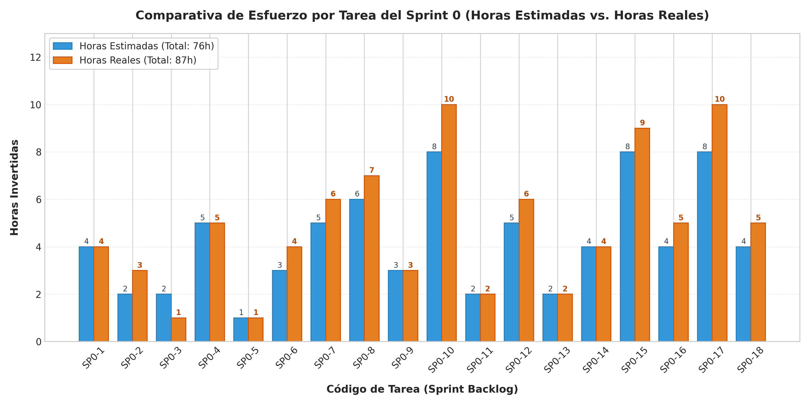

```text
Tarea   | Horas (E = Estimado [Celeste], R = Real [Naranja])
--------+-----------------------------------------------------------
SP0-1   | E: [████] 4h       | R: [████] 4h
SP0-2   | E: [██] 2h         | R: [███] 3h (+1)
SP0-3   | E: [██] 2h         | R: [█] 1h (-1)
SP0-4   | E: [█████] 5h      | R: [█████] 5h
SP0-5   | E: [█] 1h          | R: [█] 1h
SP0-6   | E: [███] 3h        | R: [████] 4h (+1)  <-- Curva Angular/Docker
SP0-7   | E: [█████] 5h      | R: [██████] 6h (+1) <-- Problemas PostgreSQL
SP0-8   | E: [██████] 6h     | R: [███████] 7h (+1) <-- Debate diseño Figma
SP0-9   | E: [███] 3h        | R: [███] 3h
SP0-10  | E: [████████] 8h   | R: [██████████] 10h (+2) <-- Modelado BD esquemas
SP0-11  | E: [██] 2h         | R: [██] 2h
SP0-12  | E: [█████] 5h      | R: [██████] 6h (+1) <-- Serializers JWT
SP0-13  | E: [██] 2h         | R: [██] 2h
SP0-14  | E: [████] 4h       | R: [████] 4h
SP0-15  | E: [████████] 8h   | R: [█████████] 9h (+1) <-- Backend usuarios/roles
SP0-16  | E: [████] 4h       | R: [█████] 5h (+1) <-- Subdominios tenant
SP0-17  | E: [████████] 8h   | R: [██████████] 10h (+2) <-- django-tenants
SP0-18  | E: [████] 4h       | R: [█████] 5h (+1) <-- Pruebas de cierre
--------+-----------------------------------------------------------
TOTAL   | Estimado: 76 horas | Real: 87 horas | Desviación: +11h (+14.5%)
```

**Conclusiones del análisis de esfuerzo:**
1. **Tareas técnicas individuales (SP0-10, SP0-15, SP0-17):** Concentraron 5 de las 11 horas de desfase debido al aprendizaje de la arquitectura Multi-Tenant en PostgreSQL y validaciones de seguridad en Django REST.
2. **Tareas de integración y diseño (SP0-6, SP0-7, SP0-8):** Requirieron 3 horas adicionales por la configuración heterogénea de PCs del equipo y la búsqueda de consensos estéticos.
3. **Lección aprendida para el Sprint 1:** Se incorporará un factor de holgura del 15% al 20% en las estimaciones del Sprint Backlog para absorber contingencias académicas y curvas de aprendizaje sin requerir sobreesfuerzo de última hora.

4.8 SCRUM TASKBOARD
El Scrum Taskboard refleja el flujo de trabajo de las 18 tareas del Sprint 0 a través de sus cuatro columnas de estado durante el ciclo de desarrollo:

#### Scrum Taskboard – Estado Final al Cierre del Sprint 0

| Product Backlog | Por hacer (To Do) | En progreso (Doing) | Terminado (Done) |
| :--- | :---: | :---: | :--- |
| **[SP0-1]** Entrevista con el Product Owner | *(vacío)* | *(vacío)* | ✓ **SP0-1:** Entrevista PO *(Equipo SCRUM)* |
| **[SP0-2]** Crear el perfil del proyecto | *(vacío)* | *(vacío)* | ✓ **SP0-2:** Perfil proyecto *(Equipo SCRUM)* |
| **[SP0-3]** Explicar SCRUM al Product Owner | *(vacío)* | *(vacío)* | ✓ **SP0-3:** Explicar SCRUM *(Equipo SCRUM)* |
| **[SP0-4]** Definición y formulación del problema | *(vacío)* | *(vacío)* | ✓ **SP0-4:** Formulación problema *(Equipo SCRUM)* |
| **[SP0-5]** Asignación de roles SCRUM | *(vacío)* | *(vacío)* | ✓ **SP0-5:** Asignación roles *(Equipo SCRUM)* |
| **[SP0-6]** Capacitación en herramientas | *(vacío)* | *(vacío)* | ✓ **SP0-6:** Capacitación *(Equipo SCRUM)* |
| **[SP0-7]** Preparar entorno de desarrollo | *(vacío)* | *(vacío)* | ✓ **SP0-7:** Entorno desarrollo *(Equipo SCRUM)* |
| **[SP0-8]** Prototipo inicial web y móvil | *(vacío)* | *(vacío)* | ✓ **SP0-8:** Prototipo inicial *(Equipo SCRUM)* |
| **[SP0-9]** Identificar casos de uso funcionales | *(vacío)* | *(vacío)* | ✓ **SP0-9:** Casos de uso *(Equipo SCRUM)* |
| **[SP0-10]** Modelado inicial BD PostgreSQL | *(vacío)* | *(vacío)* | ✓ **SP0-10:** Modelado BD *(Andy Mujica)* |
| **[SP0-11]** Diseñar interfaz de inicio de sesión | *(vacío)* | *(vacío)* | ✓ **SP0-11:** Diseño login *(Andy Mujica)* |
| **[SP0-12]** Implementar registro y login JWT | *(vacío)* | *(vacío)* | ✓ **SP0-12:** Implementar auth *(Andy Mujica)* |
| **[SP0-13]** Pruebas de registro e inicio de sesión | *(vacío)* | *(vacío)* | ✓ **SP0-13:** Pruebas auth *(Esther Condori)* |
| **[SP0-14]** Diseñar interfaz gestión usuarios/roles | *(vacío)* | *(vacío)* | ✓ **SP0-14:** Diseño usuarios/roles *(Julio Cesar Larrazabal)* |
| **[SP0-15]** Implementar gestión usuarios/roles | *(vacío)* | *(vacío)* | ✓ **SP0-15:** Implementar usuarios *(Maria Ilse Romero)* |
| **[SP0-16]** Diseñar configuración Multi-Tenant | *(vacío)* | *(vacío)* | ✓ **SP0-16:** Diseño Multi-Tenant *(Alberto Caleb Delgado)* |
| **[SP0-17]** Implementar aislamiento Multi-Tenant | *(vacío)* | *(vacío)* | ✓ **SP0-17:** Implementar Multi-Tenant *(Alberto Caleb Delgado)* |
| **[SP0-18]** Pruebas usuarios, roles y Multi-Tenant | *(vacío)* | *(vacío)* | ✓ **SP0-18:** Pruebas Multi-Tenant *(Rolando Velasco)* |

<br>

**Resumen del Taskboard al cierre del Sprint 0:**
• **Total de tareas planificadas:** 18 tareas (100%)  
• **Tareas en estado Por hacer (To Do):** 0 (0%)  
• **Tareas en estado En progreso (Doing):** 0 (0%)  
• **Tareas en estado Terminado (Done):** 18 (100%)  
• **Porcentaje de completitud:** 100% de cumplimiento del Sprint Backlog.  
• **Incremento de software:** Módulo de autenticación JWT, gestión de usuarios/roles/permisos y arquitectura Multi-Tenant con esquemas PostgreSQL completamente operativa y verificada.


BIBLIOGRAFÍA

a. Libros y Literatura
•	American Psychological Association. (2017). Ethical principles of psychologists and code of conduct. APA.
•	Beck, J. S. (2011). Cognitive behavior therapy: Basics and beyond (2.ª ed.). Guilford Press.
•	Colegio de Psicólogos de Bolivia. (2002). Código de ética del psicólogo boliviano. La Paz, Bolivia.
•	Fernández-Ballesteros, R. (2013). Evaluación psicológica: Conceptos, métodos y estudio de casos (2.ª ed.). Ediciones Pirámide.
•	Graham, S., Depp, C., Lee, E. E., Nebeker, C., Tu, X., Kim, H. C., & Jeste, D. V. (2019). Artificial intelligence for mental health and mental illnesses: An overview. Current Psychiatry Reports, 21(11), 1-15. https://doi.org/10.1007/s11920-019-1094-0
•	Laudon, K. C., & Laudon, J. P. (2020). Management information systems: Managing the digital firm (16.ª ed.). Pearson.
•	Organización Mundial de la Salud. (2022). Informe mundial sobre salud mental: Transformar la salud mental para todos. OMS. https://www.who.int/es/publications/i/item/9789240050860
•	Pressman, R. S., & Maxim, B. R. (2020). Ingeniería del software: Un enfoque práctico (9.ª ed.). McGraw-Hill.
•	Schwaber, K., & Sutherland, J. (2020). La Guía de Scrum: La guía definitiva de Scrum: Las reglas del juego. Scrum.org.
•	Sommerville, I. (2016). Software engineering (10.ª ed.). Pearson.

b. Sitios Web Especializados
•	Angular Team. (2024). Angular documentation. Google. https://angular.dev/
•	Django Software Foundation. (2024). Django documentation. https://www.djangoproject.com/
•	Flutter Team. (2024). Flutter documentation. Google. https://flutter.dev/
•	iClinic. (2024). Software de gestión clínica y prontuario electrónico. https://iclinic.com.br/
•	MentalGest. (2024). Software clínico para psicólogos y consultorios. https://mentalgest.com/
•	MentalGest. (2024). Transparencia e inteligencia artificial en MentalGest. https://mentalgest.com/transparencia-ia
•	Organización Mundial de la Salud. (2022). Salud mental: Fortalecimiento de nuestra respuesta. OMS. https://www.who.int/es/news-room/fact-sheets/detail/mental-health-strengthening-our-response
•	PostgreSQL Global Development Group. (2024). PostgreSQL: The world's most advanced open source relational database. https://www.postgresql.org/
•	Psicología.io. (2024). Plataforma de gestión para psicólogos y profesionales de la salud mental. https://psicologia.io/
•	SimplePractice. (2024). Practice management software for EHR & telehealth. https://www.simplepractice.com/
•	Spring Health. (2024). Precision mental healthcare platform. https://www.springhealth.com/
•	Spring Health. (2024). Our approach to mental healthcare. https://www.springhealth.com/our-approach
•	Spring Health. (2024). SpringCare: Comprehensive mental health support. https://www.springhealth.com/what-we-do/springcare
•	Talkspace. (2024). Online therapy and psychiatry services platform. https://www.talkspace.com/
•	TherapyNotes. (2024). Practice management software for mental health professionals. https://www.therapynotes.com/

c. Personas (Entrevistas y Casos de Estudio)
•	Lic. Marilyn Esther Condori Diaz (Product Owner del Proyecto): Entrevista realizada el 18 de agosto de 2026 para la definición del alcance funcional, requerimientos de la historia clínica psicológica y prioridades del Product Backlog.
•	Lic. Claudia Mendoza V. (Psicóloga Clínica - Consulta Privada): Entrevista semiestructurada sobre flujos de atención, notas de sesión, consentimientos informados y necesidades de telepsicología en el contexto boliviano.
•	Dr. Fernando Ramos G. (Coordinador de Centro Psicológico Universitario): Consulta sobre requerimientos de gestión multi-rol, asignación de pacientes a terapeutas en formación y necesidad de reportes administrativos y de supervisión clínica.


ANEXOS

Anexo A: Caso de Estudio 1 – MentalGest
MentalGest es una plataforma SaaS diseñada para la gestión clínica de profesionales y centros de psicología. Proporciona módulos de agenda médica, expediente clínico digital, notas de sesión, gestión de consentimientos informados, facturación y reportes de atención.
•	Registro de profesionales: https://app.mentalgest.com/auth/register
•	Dashboard principal: https://app.mentalgest.com/professional
•	Gestión de pacientes: https://app.mentalgest.com/professional/patients
•	Registro de nuevos pacientes: https://app.mentalgest.com/professional/patients/new
•	Gestión de reservas y citas: https://app.mentalgest.com/professional/leads
•	Reportes administrativos: https://app.mentalgest.com/professional/reports
•	Gestión de disponibilidad: https://app.mentalgest.com/professional/availability

Anexo B: Caso de Estudio 2 – Talkspace
Talkspace es una plataforma pionera en telepsicología y terapia en línea que conecta a usuarios con profesionales de salud mental licenciados a través de mensajería de texto, audio y videoconferencias sincrónicas y asincrónicas. Ofrece evaluación inicial mediante cuestionarios estructurados y asignación inteligente de terapeutas según el motivo de consulta.

Anexo C: Caso de Estudio 3 – Spring Health
Spring Health es una plataforma de salud mental integral para organizaciones y centros clínicos que aplica el enfoque de "Precision Mental Healthcare". Utiliza cuestionarios estructurados validados clínicamente y modelos de aprendizaje automático para predecir el tratamiento más efectivo y realizar triage temprano de síntomas y señales de riesgo.

Anexo D: Prototipos de Interfaces de Usuario en Figma (Sprint 0)
Durante el Sprint 0 se diseñaron y validaron los siguientes prototipos en Figma:
1.	Pantalla de Registro de SuperAdministrador (HU-01): Formulario con validación reactiva de seguridad de contraseña y confirmación de credenciales.
2.	Pantalla de Inicio de Sesión Multi-Rol (HU-02): Formulario de autenticación con selección de centro/tenant y redirección automática según rol.
3.	Pantalla de Alta y Gestión de Centros Psicológicos (HU-03, HU-08): Panel de SuperAdministrador para registro, configuración de subdominios, activación y suspensión de tenants.
4.	Pantalla de Configuración Institucional del Centro (HU-04): Formulario para el Administrador del Centro con horarios, datos de contacto y logo.
5.	Pantalla de Gestión de Usuarios y Roles (HU-05, HU-06): Tabla con listado de personal del centro, asignación de roles (Psicólogo, Recepcionista, Coordinador) y matriz de permisos.
6.	Pantalla de Recuperación de Contraseña (HU-10): Flujo de solicitud por correo y restablecimiento seguro mediante token temporal.

