# CAPÍTULO 4 – DESARROLLO SPRINT 1

El presente capítulo documenta el desarrollo completo del **Sprint 1** del proyecto **SIGEPSI** (Plataforma Web y Móvil de Gestión de Centros de Salud Mental), siguiendo la estructura definida por el marco de trabajo ágil SCRUM y las directrices metodológicas de la asignatura. Se incluyen la planificación detallada, las historias de usuario bajo el modelo de las 3C, el proceso de desarrollo por historia (diseño arquitectónico, diseño de datos, lógica de negocio con diagramas de comunicación BCE y diagramas de actividad en PlantText/PlantUML), la implementación en backend, frontend web y aplicación móvil, el plan y reporte de pruebas de caja negra, el seguimiento diario (Daily Scrum), la revisión de sprint, la retrospectiva, las métricas de Burndown/Burnup, el análisis comparativo de esfuerzo y el Scrum Taskboard final.

---

## 4.1 SPRINT PLANNING

### 4.1.1 Objetivos del Sprint 1
Tras haber consolidado en el Sprint 0 la infraestructura base, el aislamiento Multi-Tenant por esquemas en PostgreSQL y el módulo transversal de autenticación segura (JWT) con asignación de roles y permisos (RBAC), el **Sprint 1** tiene como propósito central implementar el núcleo operativo, clínico y de atención de la plataforma SIGEPSI, abarcando tanto la plataforma web (Angular 17) como la aplicación móvil (Flutter 3.x) y los servicios backend (Django 5.x REST Framework).

Al finalizar este Sprint, el equipo entrega un incremento de software utilizable y potencialmente desplegable que comprende:
1. **Gestión Integral de Psicólogos y Perfiles Profesionales:** Registro, edición y consulta de psicólogos, especialidades clínicas, número de colegiado, biografía, modalidades de atención (presencial, virtual o mixta) y tarifas de consulta.
2. **Gestión de Disponibilidad Horaria y Carga de Trabajo:** Configuración de franjas de atención por día de la semana, duración de bloques de sesión y control de saturación operativa de los terapeutas.
3. **Gestión de Pacientes (Web y Móvil):** Registro y consulta de expedientes de pacientes, datos sociodemográficos, contactos de emergencia y sincronización de perfiles tanto en el portal administrativo web como en la app móvil del paciente.
4. **Agenda Psicológica y Motor de Citas:** Programación interactiva de citas, reservas con verificación automática de disponibilidad y solapamientos, confirmación, reprogramación y cancelación sujeta a políticas institucionales.
5. **Módulo de Teleconsulta y Videoconferencias:** Generación dinámica de salas virtuales seguras mediante la integración de Jitsi Meet (WebRTC), permitiendo la atención a distancia desde el navegador web y la aplicación móvil.
6. **Dashboard Administrativo y Clínico:** Visualización en tiempo real de indicadores clave de desempeño (KPIs): volumen de citas del día/semana, pacientes activos, tasa de inasistencia (no-show) y distribución de carga por profesional.
7. **Gestión de Alertas de Priorización Temprana:** Detección de patrones críticos como inasistencias reiteradas o riesgo de abandono de tratamiento.

Duración del Sprint: 12 días (26 de agosto al 06 de septiembre de 2026)  
Fecha de presentación: 08 y 10 de septiembre de 2026  
Casos de uso involucrados: CU6, CU7, CU8, CU9, CU10, CU11, CU13  
Requisitos funcionales asociados: RF-04, RF-06, RF-07, RF-14, RF-15, RF-16  

<br>

| ID | Descripción | Estado | Móvil | Web | Sprint |
| :---: | :--- | :---: | :---: | :---: | :---: |
| **CU6** | Gestionar psicólogos y perfiles profesionales | Propuesto | | X | SP1 |
| **CU7** | Gestionar pacientes | Propuesto | X | X | SP1 |
| **CU8** | Gestionar disponibilidad y carga de trabajo de psicólogos | Propuesto | | X | SP1 |
| **CU9** | Consultar Dashboard e indicadores del centro psicológico | Propuesto | | X | SP1 |
| **CU10** | Gestionar alertas de priorización y seguimiento | Propuesto | | X | SP1 |
| **CU11** | Gestionar citas y agenda psicológica | Propuesto | X | X | SP1 |
| **CU13** | Gestionar teleconsultas y videoconferencias | Propuesto | X | X | SP1 |

<br>

**Cronograma y Tabla de Fechas del Sprint 1:**

| Hito / Actividad | Fecha de Inicio | Fecha de Fin | Duración | Estado |
| :--- | :---: | :---: | :---: | :---: |
| Planificación del Sprint (Sprint Planning) | 26 de agosto de 2026 | 26 de agosto de 2026 | 1 día | Concluido |
| Desarrollo, Integración (Web / Móvil) y Daily Scrum | 26 de agosto de 2026 | 05 de septiembre de 2026 | 11 días | Concluido |
| Pruebas de Calidad (QA) y Ajustes de Integración | 05 de septiembre de 2026 | 06 de septiembre de 2026 | 2 días | Concluido |
| Revisión del Sprint (Sprint Review) | 06 de septiembre de 2026 | 06 de septiembre de 2026 | 1 día | Concluido |
| Retrospectiva del Sprint (Sprint Retrospective) | 06 de septiembre de 2026 | 06 de septiembre de 2026 | 1 día | Concluido |
| Entrega Formal del Documento de Sprint 1 | 06 de septiembre de 2026 | 06 de septiembre de 2026 | 1 día | Concluido |
| Presentación y Defensa del Sprint 1 (Docente) | 08 de septiembre de 2026 | 10 de septiembre de 2026 | 2 días | Programado |

---

### 4.1.2 Historias de Usuario del Sprint 1
Para la formulación de las historias de usuario se aplicó el modelo de las **3C** (Card, Conversation, Confirmation) propuesto por Ron Jeffries:
* **Tarjeta (Card):** Formulación concisa del requerimiento bajo la estructura estándar: *"Como [rol], quiero [acción/funcionalidad], para [beneficio/valor obtenido]"*.
* **Conversación (Conversation):** Interacción continua entre el Product Owner, el Scrum Master y el Equipo de Desarrollo para clarificar las reglas de negocio (políticas de cancelación de citas, intervalos de disponibilidad y enlaces JWT de teleconsulta).
* **Confirmación (Confirmation):** Definición rigurosa de los criterios de aceptación en formato BDD (*"Dado que... cuando... entonces..."*), que operan como la base directa para los casos de prueba funcionales de caja negra.

#### Estimación del Esfuerzo mediante Planning Poker
La estimación del esfuerzo relativo de cada historia de usuario se realizó mediante la técnica de **Planning Poker** utilizando la secuencia de Fibonacci modificada ($1, 2, 3, 5, 8, 13$). Las votaciones se realizaron de forma individual y simultánea, resolviendo las divergencias mediante discusión técnica hasta alcanzar el consenso del equipo en Puntos de Historia de Usuario (PHU).

#### Resumen de Historias de Usuario del Sprint 1

| ID | Título | Prioridad | PHU | Desarrollador a cargo | Prototipo Asociado (Figma) |
| :--- | :--- | :---: | :---: | :--- | :--- |
| **HU-11** | Gestión de perfiles y especialidades de psicólogos | Alta | 5 | Mujica Vallejos Andy Mauricio | Pantalla Directorio y Perfil Psicólogo (Web) |
| **HU-12** | Configuración de disponibilidad y carga horaria | Alta | 5 | Romero Saavedra Maria Ilse | Pantalla Matriz de Disponibilidad Semanal |
| **HU-13** | Registro y expediente clínico básico del paciente | Alta | 5 | Romero Saavedra Maria Ilse | Pantalla Gestión y Ficha de Paciente (Web) |
| **HU-14** | Registro y consulta de perfil de paciente en app móvil | Alta | 5 | Delgado Rojas Alberto Caleb | Pantalla Perfil y Datos Personales (Móvil) |
| **HU-15** | Programación y reserva de citas en plataforma web | Alta | 8 | Mujica Vallejos Andy Mauricio | Pantalla Calendario y Reserva de Citas (Web) |
| **HU-16** | Consulta y reserva de citas desde la app móvil | Alta | 5 | Delgado Rojas Alberto Caleb | Pantalla Mis Citas y Reservar Cita (Móvil) |
| **HU-17** | Reprogramación y cancelación de citas con validación de anticipación | Media | 5 | Mujica Vallejos Andy Mauricio | Modal Reprogramar / Cancelar Cita |
| **HU-18** | Sala de teleconsulta con Jitsi Meet en plataforma web | Alta | 8 | Mujica Vallejos Andy Mauricio | Pantalla Videoconsulta WebRTC (Web) |
| **HU-19** | Acceso a videollamada de teleconsulta desde app móvil | Alta | 5 | Delgado Rojas Alberto Caleb | Pantalla Sala de Teleconsulta (Móvil) |
| **HU-20** | Dashboard administrativo y clínico con KPIs en tiempo real | Alta | 8 | Larrazabal Rojas Julio Cesar | Pantalla Dashboard Indicadores y Métricas |
| **HU-21** | Alertas de priorización y seguimiento de inasistencias | Media | 5 | Romero Saavedra Maria Ilse | Panel de Notificaciones y Alertas Clínicas |
| **HU-22** | Calendario interactivo multi-vista de agenda clínica | Media | 5 | Larrazabal Rojas Julio Cesar | Vista Calendario Semanal / Diario por Profesional |
| **TOTAL** | **Esfuerzo planificado en Historias de Usuario** | — | **69 PHU** | **Equipo SCRUM (6 integrantes)** | **12 prototipos interactivos** |

---

### Detalle de Historias de Usuario (Tarjetas 3C en Formato Oficial)

#### Historia de Usuario HU-11
| **Título:** | **Gestión de perfiles y especialidades de psicólogos** |
| :--- | :--- |
| **ID:** HU-11 *(CU6, RF-07)* | **Descripción:** Como Administrador del Centro, quiero registrar y actualizar los perfiles profesionales de los psicólogos (especialidades, colegiatura, biografía, tarifa y modalidad), para que el centro disponga de un directorio profesional confiable para la asignación de pacientes. |
| **Prioridad / Valor:** Alta | **Estimación PHU:** 5 |
| **Criterios de aceptación:** | • **a)** Dado que soy Administrador autenticado, cuando completo el formulario de psicólogo con número de colegiado válido, tarifa base y al menos una especialidad clínica activa, entonces el sistema guarda el perfil y lo vincula a la cuenta de usuario del esquema tenant.<br>• **b)** Dado que ingreso un número de colegiado que ya está registrado para otro profesional en el mismo centro, cuando intento guardar, entonces el sistema rechaza la operación y notifica que el código profesional ya se encuentra en uso.<br>• **c)** Dado que edito la biografía o agrego nuevas especialidades a un psicólogo existente, cuando presiono guardar, entonces los cambios se reflejan de inmediato en la lista del directorio y en los filtros de búsqueda. |
| **Desarrollador a cargo:** | Mujica Vallejos Andy Mauricio &nbsp;&nbsp;\|&nbsp;&nbsp; **Prototipo:** Pantalla Directorio y Perfil Psicólogo (Figma)<br>**Prompt para IA (Generación UI):** *"UI/UX web design of a professional psychologist directory and profile management screen for a mental health platform named SIGEPSI, Angular 17 style. Clean light mode with teal and indigo tones. Main view includes search bar with specialty filters (Terapia Cognitivo-Conductual, Infanto-Juvenil, Pareja) and a grid of therapist profile cards showing avatar photo, full name, professional license number (Colegiatura), active specialties badges, consultation fee (Bs. 180), modalities accepted (Presencial / Virtual), and action buttons 'Editar Perfil' and 'Ver Horarios'. Modern SaaS medical typography Inter, high fidelity Figma UI, crisp layout, 4k."*  |

<br>

#### Historia de Usuario HU-12
| **Título:** | **Configuración de disponibilidad y carga horaria** |
| :--- | :--- |
| **ID:** HU-12 *(CU8, RF-07)* | **Descripción:** Como Psicólogo, quiero configurar mis bloques de disponibilidad horaria por día de la semana y la duración de mis sesiones, para que los recepcionistas y pacientes solo puedan agendar citas en mis horarios efectivamente disponibles. |
| **Prioridad / Valor:** Alta | **Estimación PHU:** 5 |
| **Criterios de aceptación:** | • **a)** Dado que soy Psicólogo autenticado, cuando defino mi horario de atención (ej. Lunes de 08:00 a 12:00 con bloques de 45 minutos), entonces el sistema genera automáticamente los intervalos disponibles para reserva.<br>• **b)** Dado que intento configurar un bloque cuya hora de inicio sea posterior o igual a la hora de fin, cuando envío el formulario, entonces el sistema muestra un mensaje de validación indicando la inconsistencia temporal.<br>• **c)** Dado que ya poseo citas pactadas en un intervalo determinado, si intento desactivar ese día de disponibilidad, entonces el sistema advierte que existen citas activas y solicita reubicarlas antes de consolidar el cambio. |
| **Desarrollador a cargo:** | Romero Saavedra Maria Ilse &nbsp;&nbsp;\|&nbsp;&nbsp; **Prototipo:** Pantalla Matriz de Disponibilidad Semanal (Figma)<br>**Prompt para IA (Generación UI):** *"UI/UX web application screen of a weekly schedule and shift availability matrix for psychologists in mental health clinic SIGEPSI, Angular style. Clean modern design with soft neutral background and purple/teal accents. Left panel with therapist summary and consultation duration selector (30 min, 45 min, 60 min). Center view displays an interactive weekly schedule matrix (Monday to Saturday) with toggle switches for active days and configurable time blocks (e.g. 08:00 - 12:00, 14:00 - 18:00) with visual time chip tags and 'Agregar Franja' button. Clear warning notice for active appointments conflict. High fidelity Figma mockup, clean UI kit, 4k."*  |

<br>

#### Historia de Usuario HU-13
| **Título:** | **Registro y expediente clínico básico del paciente en web** |
| :--- | :--- |
| **ID:** HU-13 *(CU7, RF-06)* | **Descripción:** Como Recepcionista o Administrador, quiero registrar a un nuevo paciente con sus datos personales, sociodemográficos y contacto de emergencia, para abrir su expediente clínico digital dentro del centro. |
| **Prioridad / Valor:** Alta | **Estimación PHU:** 5 |
| **Criterios de aceptación:** | • **a)** Dado que ingreso datos completos de un paciente (nombres, apellidos, CI, fecha de nacimiento, teléfono y contacto de emergencia), cuando presiono registrar, entonces el sistema crea la ficha del paciente asignándole un código de expediente único dentro del tenant.<br>• **b)** Dado que intento registrar un paciente con un documento de identidad (CI) ya existente en el centro, cuando el sistema valida los datos, entonces bloquea el registro duplicado y muestra un enlace directo al expediente existente.<br>• **c)** Dado que un paciente es menor de edad (menor a 18 años calculado por fecha de nacimiento), cuando se procesa el formulario, entonces el sistema exige obligatoriamente los datos del tutor o apoderado legal. |
| **Desarrollador a cargo:** | Romero Saavedra Maria Ilse &nbsp;&nbsp;\|&nbsp;&nbsp; **Prototipo:** Pantalla Gestión y Ficha de Paciente (Figma - Larrazabal Julio Cesar)<br>**Prompt para IA (Generación UI):** *"UI/UX desktop web design for clinical patient registration and electronic health record intake form for SIGEPSI mental health system, Angular 17. Clean clinical light theme. Form organized in modern card sections: Personal Identification (Full Name, CI/DNI, Date of Birth, Gender), Emergency Contact with legal guardian toggle for minors under 18 showing guardian full name and phone number. Top header with patient code badge 'EXP-2026-084'. Tabbed navigation for Personal Info, Consultation History, and Active Alerts. Modern clean form inputs, floating labels, validation states, Figma design system, 4k."*  |

<br>

#### Historia de Usuario HU-14
| **Título:** | **Registro y consulta de perfil de paciente en app móvil** |
| :--- | :--- |
| **ID:** HU-14 *(CU7, RF-06)* | **Descripción:** Como Paciente, quiero registrarme y consultar mi perfil desde la aplicación móvil Flutter, para mantener actualizados mis datos de contacto y acceder a los servicios psicológicos de mi centro. |
| **Prioridad / Valor:** Alta | **Estimación PHU:** 5 |
| **Criterios de aceptación:** | • **a)** Dado que descargo la app móvil e ingreso mi código de centro (tenant), cuando lleno mi formulario de registro con correo y contraseña válidos, entonces el sistema crea mi usuario con rol Paciente y me permite iniciar sesión automáticamente.<br>• **b)** Dado que estoy autenticado en la app móvil, cuando accedo a la sección 'Mi Perfil', entonces puedo visualizar y actualizar mi número telefónico, dirección y contacto de emergencia.<br>• **c)** Dado que se interrumpe la conexión a Internet durante la actualización del perfil, cuando la app detecta el error de red, entonces muestra un mensaje amigable indicando que no se pudo conectar al servidor del centro y mantiene los datos locales intactos. |
| **Desarrollador a cargo:** | Delgado Rojas Alberto Caleb &nbsp;&nbsp;\|&nbsp;&nbsp; **Prototipo:** Pantalla Perfil y Datos Personales Móvil (Figma)<br>**Prompt para IA (Generación UI):** *"Mobile app UI design for patient personal profile screen in Flutter 3 style on an iPhone 15 Pro mockup for SIGEPSI mental health app. Modern soothing pastel blue and mint green palette. Top app bar with back arrow and center title 'Mi Perfil'. User avatar circle with camera edit badge, patient full name 'Sofía Beltrán', and tenant clinic badge 'Centro San Rafael'. Card list displaying editable fields: phone number, residential address, emergency contact person and phone, and security options. Primary button 'Guardar Cambios' with smooth corner radius. Clean mobile UX, high fidelity Figma mockup, 4k."*  |

<br>

#### Historia de Usuario HU-15
| **Título:** | **Programación y reserva de citas en plataforma web** |
| :--- | :--- |
| **ID:** HU-15 *(CU11, RF-14)* | **Descripción:** Como Recepcionista o Psicólogo, quiero programar una cita seleccionando paciente, terapeuta, modalidad (presencial/virtual) y fecha/hora, para organizar la atención clínica sin solapamientos. |
| **Prioridad / Valor:** Alta | **Estimación PHU:** 8 |
| **Criterios de aceptación:** | • **a)** Dado que selecciono un psicólogo, una fecha y un bloque disponible, cuando asigno un paciente y confirmo la reserva, entonces el sistema registra la cita con estado 'Programada' y bloquea dicho slot para evitar dobles reservas.<br>• **b)** Dado que dos usuarios intentan reservar simultáneamente el mismo bloque del mismo psicólogo, cuando el segundo usuario envía la solicitud, entonces el sistema detecta la colisión mediante concurrencia pesimista/transaccional y notifica que el horario acaba de ser ocupado.<br>• **c)** Dado que la modalidad elegida es 'Virtual', cuando se confirma la cita, entonces el sistema crea automáticamente un registro de teleconsulta con identificador único de sala Jitsi Meet. |
| **Desarrollador a cargo:** | Mujica Vallejos Andy Mauricio &nbsp;&nbsp;\|&nbsp;&nbsp; **Prototipo:** Pantalla Calendario y Reserva de Citas Web (Figma)<br>**Prompt para IA (Generación UI):** *"UI/UX web modal and page for booking psychological appointments in SIGEPSI, Angular 17. Clean SaaS modal dialog overlaid on a blurred clinic dashboard. Left section has doctor selection with avatar, specialty, and modality selector pills: 'Presencial (Consultorio 3)' or 'Teleconsulta (Jitsi Meet)'. Center shows an interactive mini calendar and available time slots (chips: 09:00, 10:00, 11:00, 15:00) with real-time collision detection badge 'Horario Disponible'. Bottom input for reason of consultation and primary confirm button 'Confirmar Reserva'. High fidelity Figma mockup, modern healthcare UI, 4k."*  |

<br>

#### Historia de Usuario HU-16
| **Título:** | **Consulta y reserva de citas desde la app móvil** |
| :--- | :--- |
| **ID:** HU-16 *(CU11, RF-14)* | **Descripción:** Como Paciente autenticado en la app móvil, quiero ver el listado de mis citas (próximas e históricas) y solicitar una nueva cita según la disponibilidad de mi psicólogo, para gestionar mis consultas de salud mental desde mi teléfono. |
| **Prioridad / Valor:** Alta | **Estimación PHU:** 5 |
| **Criterios de aceptación:** | • **a)** Dado que ingreso al módulo 'Mis Citas' en la app Flutter, cuando la pantalla carga, entonces muestra mis citas ordenadas cronológicamente con tarjetas visuales diferenciadas por estado (Programada, Confirmada, Realizada, Cancelada).<br>• **b)** Dado que elijo la opción 'Nueva Cita', selecciono mi psicólogo y escojo un horario disponible, cuando presiono confirmar, entonces la solicitud se envía al backend y la cita aparece inmediatamente en mi listado.<br>• **c)** Dado que selecciono una cita virtual programada para hoy, cuando faltan menos de 15 minutos para la hora fijada, entonces se activa un botón visible de 'Ingresar a Teleconsulta'. |
| **Desarrollador a cargo:** | Delgado Rojas Alberto Caleb &nbsp;&nbsp;\|&nbsp;&nbsp; **Prototipo:** Pantalla Mis Citas y Reservar Cita Móvil (Figma)<br>**Prompt para IA (Generación UI):** *"Mobile application UI screen for patient appointment management 'Mis Citas' in Flutter 3 for SIGEPSI on iOS/Android device. Soothing mental wellness colors, teal and lavender accents. Segmented control with tabs 'Próximas' and 'Historial'. Cards for upcoming sessions showing psychologist photo, name, date badge 'Jueves 3 Sept - 10:00 AM', session type 'Teleconsulta Virtual', and color badge 'Confirmada' in emerald green. Card has an active prominent button 'Ingresar a Teleconsulta' with a video icon. Floating action button '+' to book a new appointment. High fidelity Figma UI, 4k."*  |

<br>

#### Historia de Usuario HU-17
| **Título:** | **Reprogramación y cancelación de citas con validación de anticipación** |
| :--- | :--- |
| **ID:** HU-17 *(CU11, RF-15)* | **Descripción:** Como Usuario (Recepcionista o Paciente), quiero cancelar o reprogramar una cita pactada, respetando las políticas de anticipación horaria configuradas por el centro, para optimizar los cupos de atención. |
| **Prioridad / Valor:** Media | **Estimación PHU:** 5 |
| **Criterios de aceptación:** | • **a)** Dado que un paciente solicita cancelar una cita con más de 24 horas de anticipación, cuando se procesa la solicitud, entonces el sistema cambia el estado a 'Cancelada', libera el bloque en la agenda del psicólogo y registra el motivo de cancelación.<br>• **b)** Dado que un paciente intenta cancelar una cita con menos de 2 horas de anticipación desde la app móvil, cuando presiona cancelar, entonces el sistema le advierte que está fuera de la política de cancelación y le indica comunicarse con recepción.<br>• **c)** Dado que se reprograma una cita, cuando se selecciona un nuevo horario válido, entonces el sistema actualiza la fecha/hora de la cita existente sin perder el historial ni el código de seguimiento. |
| **Desarrollador a cargo:** | Mujica Vallejos Andy Mauricio &nbsp;&nbsp;\|&nbsp;&nbsp; **Prototipo:** Modal Reprogramar / Cancelar Cita (Figma)<br>**Prompt para IA (Generación UI):** *"UI/UX modal pop-up design for rescheduling or canceling a clinical appointment in psychological platform SIGEPSI, Angular 17. Centered clean dialog with backdrop blur. Top alert notice in amber: 'Cancelación sin recargo permitida hasta 24 horas antes'. Two distinct action tabs: 'Reprogramar Cita' with date picker and available time slots chips, and 'Cancelar Cita' with dropdown for cancellation reason (Motivo personal, Salud, Cruce de horarios) and optional text feedback. Actions: secondary ghost button 'Volver' and danger button 'Confirmar Cancelación'. Clean medical SaaS UX, Figma mockup, 4k."*  |

<br>

#### Historia de Usuario HU-18
| **Título:** | **Sala de teleconsulta con Jitsi Meet en plataforma web** |
| :--- | :--- |
| **ID:** HU-18 *(CU13, RF-16)* | **Descripción:** Como Psicólogo, quiero iniciar una sesión virtual por videollamada cifrada con mi paciente desde el navegador, para prestar atención psicológica a distancia con audio y video estables. |
| **Prioridad / Valor:** Alta | **Estimación PHU:** 8 |
| **Criterios de aceptación:** | • **a)** Dado que el psicólogo hace clic en 'Iniciar Sesión Virtual' en una cita virtual vigente, cuando el componente carga, entonces se instancia el Jitsi Meet External API embebido con el nombre de sala seguro del tenant y el psicólogo entra con permisos de moderador.<br>• **b)** Dado que el paciente entra a la sala web, cuando ambos están conectados, entonces pueden interactuar con audio bidireccional, video HD y visualización de temporizador de sesión.<br>• **c)** Dado que el psicólogo presiona 'Finalizar Consulta', cuando se confirma el cierre, entonces el sistema cierra la sala virtual, calcula la duración real de la sesión y actualiza el estado de la cita a 'Realizada'. |
| **Desarrollador a cargo:** | Mujica Vallejos Andy Mauricio &nbsp;&nbsp;\|&nbsp;&nbsp; **Prototipo:** Pantalla Videoconsulta WebRTC (Figma - Larrazabal Julio Cesar)<br>**Prompt para IA (Generación UI):** *"UI/UX desktop web screen for encrypted telehealth psychological video consultation using embedded Jitsi Meet in SIGEPSI, Angular 17. Dark elegant teletherapy room layout. Main central video area showing the patient in high definition, with picture-in-picture floating window of the psychologist in the bottom right corner. Bottom floating glassmorphic control dock with mute audio, toggle video, end call (red button), secure chat panel toggle, and digital session timer showing '34:12 / 50:00 min'. Top bar with patient name, encrypted lock icon, and quick clinical notes sidebar toggle. High fidelity Figma UI, professional telepsychology SaaS, 4k."*  |

<br>

#### Historia de Usuario HU-19
| **Título:** | **Acceso a videollamada de teleconsulta desde app móvil** |
| :--- | :--- |
| **ID:** HU-19 *(CU13, RF-16)* | **Descripción:** Como Paciente, quiero unirme a la sesión de teleconsulta directamente desde la app móvil Flutter, para recibir mi atención psicológica cómodamente desde mi smartphone sin instalar aplicaciones externas. |
| **Prioridad / Valor:** Alta | **Estimación PHU:** 5 |
| **Criterios de aceptación:** | • **a)** Dado que una cita virtual está dentro del rango horario permitido, cuando el paciente presiona 'Unirse a Videollamada', entonces la app solicita permisos de micrófono/cámara y lanza la vista nativa de Jitsi Meet con controles táctiles optimizados.<br>• **b)** Dado que el paciente pierde temporalmente la conexión WiFi/datos durante la llamada, cuando la red se restablece, entonces el SDK de Jitsi reconecta automáticamente a la sala sin expulsar al usuario de la cita.<br>• **c)** Dado que la cita no corresponde al día actual o fue cancelada, cuando el usuario intenta ingresar, entonces el botón permanece inactivo con un mensaje explicativo del motivo. |
| **Desarrollador a cargo:** | Delgado Rojas Alberto Caleb &nbsp;&nbsp;\|&nbsp;&nbsp; **Prototipo:** Pantalla Sala de Teleconsulta Móvil (Figma)<br>**Prompt para IA (Generación UI):** *"Mobile app UI design for telehealth video session in Flutter 3 on a smartphone for mental health patient in SIGEPSI. Fullscreen immersive video layout showing the psychologist speaking on full display with soft lighting and professional office background, patient self-view in a small top-right rounded corner thumbnail. Bottom semi-transparent floating action bar with rounded touch buttons: microphone mute, camera flip, chat overlay toggle, and red end-session button. Top overlay shows connection status indicator 'HD Seguro' and call duration timer '18:45'. Modern mobile UX, Figma style, 4k."*  |

<br>

#### Historia de Usuario HU-20
| **Título:** | **Dashboard administrativo y clínico con KPIs en tiempo real** |
| :--- | :--- |
| **ID:** HU-20 *(CU9, RF-04)* | **Descripción:** Como Administrador o Coordinador del Centro, quiero un panel visual con indicadores de citas del día, pacientes activos, tasa de ausentismo y ocupación por terapeuta, para monitorear la operatividad del centro en tiempo real. |
| **Prioridad / Valor:** Alta | **Estimación PHU:** 8 |
| **Criterios de aceptación:** | • **a)** Dado que el Administrador accede al Dashboard, cuando la página carga, entonces se visualizan cuatro tarjetas principales (Citas Hoy, Pacientes Activos del Mes, Tasa de Inasistencia %, Ocupación Promedio %) calculadas con datos del tenant.<br>• **b)** Dado que se filtran las métricas por rango de fechas (semana/mes), cuando se aplica el filtro, entonces los gráficos de barras y líneas se redibujan dinámicamente reflejando la evolución de atenciones.<br>• **c)** Dado que un usuario con rol 'Psicólogo' accede al Dashboard, entonces el sistema filtra automáticamente las métricas mostrando únicamente sus propias estadísticas y no las de otros profesionales. |
| **Desarrollador a cargo:** | Larrazabal Rojas Julio Cesar &nbsp;&nbsp;\|&nbsp;&nbsp; **Prototipo:** Pantalla Dashboard Indicadores y Métricas (Figma)<br>**Prompt para IA (Generación UI):** *"UI/UX analytics dashboard design for clinical mental health clinic management SIGEPSI, Angular 17 desktop view. Modern clean layout with soft neutral grey background. Top metrics row with four key KPI metric cards: 'Citas Hoy' (28 citas), 'Pacientes Activos del Mes' (142 pacientes), 'Tasa de Inasistencia' (6.4% in green down trend), and 'Ocupación Profesional' (84%). Middle section with two interactive charts: monthly appointment volume bar chart and consultation modality distribution donut chart (Presencial vs Teleconsulta). Filter bar by therapist and date range. Figma UI kit, clean typography, 4k."*  |

<br>

#### Historia de Usuario HU-21
| **Título:** | **Alertas de priorización y seguimiento de inasistencias** |
| :--- | :--- |
| **ID:** HU-21 *(CU10, RF-04, RF-26)* | **Descripción:** Como Coordinador Clínico o Psicólogo, quiero que el sistema genere alertas automáticas ante inasistencias consecutivas o inactividad prolongada de pacientes, para prevenir el abandono terapéutico temprano. |
| **Prioridad / Valor:** Media | **Estimación PHU:** 5 |
| **Criterios de aceptación:** | • **a)** Dado que un paciente acumula 2 inasistencias consecutivas sin justificación, cuando el recepcionista marca la segunda inasistencia, entonces el sistema genera de inmediato una alerta de severidad 'Media' en el panel del psicólogo asignado.<br>• **b)** Dado que un paciente con tratamiento en curso lleva más de 21 días sin agendar cita, cuando corre el proceso nocturno de verificación, entonces se dispara una alerta de 'Riesgo de Abandono'.<br>• **c)** Dado que el psicólogo contacta al paciente y resuelve el motivo, cuando presiona 'Marcar como Resuelta' e ingresa una nota de seguimiento, entonces la alerta se archiva en el historial clínico. |
| **Desarrollador a cargo:** | Romero Saavedra Maria Ilse &nbsp;&nbsp;\|&nbsp;&nbsp; **Prototipo:** Panel de Notificaciones y Alertas Clínicas (Figma)<br>**Prompt para IA (Generación UI):** *"UI/UX notification center and clinical alert panel for psychologists in SIGEPSI, Angular 17. Slide-over drawer and table view displaying prioritized patient risk and attendance alerts. Alert cards categorized by severity badges: Red badge 'Riesgo de Abandono' (Paciente >21 días sin cita), Orange badge 'Inasistencias Reiteradas' (2 faltas consecutivas), and Blue badge 'Confirmación Pendiente'. Each card shows patient avatar, days elapsed, quick notes input, and action button 'Contactar Paciente' / 'Marcar Resuelta'. Clean clinical healthcare UX, Figma mockup, 4k."*  |

<br>

#### Historia de Usuario HU-22
| **Título:** | **Calendario interactivo multi-vista de agenda clínica** |
| :--- | :--- |
| **ID:** HU-22 *(CU11, RF-14)* | **Descripción:** Como Recepcionista o Psicólogo, quiero visualizar la agenda en vistas mensual, semanal y diaria con códigos de color por estado de cita, para una gestión visual rápida y ergonómica de los consultorios. |
| **Prioridad / Valor:** Media | **Estimación PHU:** 5 |
| **Criterios de aceptación:** | • **a)** Dado que abro la vista de calendario en Angular, cuando selecciono la vista semanal, entonces veo las columnas por día con bloques coloreados según el estado (Azul: Programada, Verde: Confirmada, Naranja: En teleconsulta, Gris: Realizada, Rojo: Cancelada/Inasistencia).<br>• **b)** Dado que hago clic sobre un bloque de cita en el calendario, entonces se despliega un popover interactivo con resumen del paciente, psicólogo, modalidad y botones de acción rápida.<br>• **c)** Dado que un recepcionista filtra la agenda por psicólogo específico, entonces el calendario actualiza la vista mostrando únicamente la agenda de dicho terapeuta. |
| **Desarrollador a cargo:** | Larrazabal Rojas Julio Cesar &nbsp;&nbsp;\|&nbsp;&nbsp; **Prototipo:** Vista Calendario Semanal / Diario por Profesional (Figma)<br>**Prompt para IA (Generación UI):** *"UI/UX dashboard design of an interactive clinical appointment calendar for a mental health platform named SIGEPSI. Desktop web interface in Angular style, clean light mode, modern SaaS healthcare design. Top bar with clinic name, date navigation 'Lunes 1 de Septiembre', view switcher pills (Mes, Semana, Día) with 'Semana' selected, and psychologist filter dropdown 'Lic. Andy Mujica - Psicología Clínica'. Main weekly calendar time grid (08:00 to 18:00, Monday to Saturday) populated with color-coded appointment cards: blue for 'Programada', emerald green for 'Confirmada', vibrant orange with video icon for 'En Teleconsulta', grey for 'Realizada'. An interactive floating popover card is highlighted over a 10:00 AM slot displaying patient 'Carlos Mendoza', service 'Teleconsulta Jitsi Meet', time '10:00 - 10:50 AM', and quick action buttons 'Ingresar a Sala' in teal and 'Reprogramar'. Clean typography, 8px grid, Figma UI design, premium medical software, high fidelity, 4k."*  |

<br>

**Visualización del Prototipo Generado:**

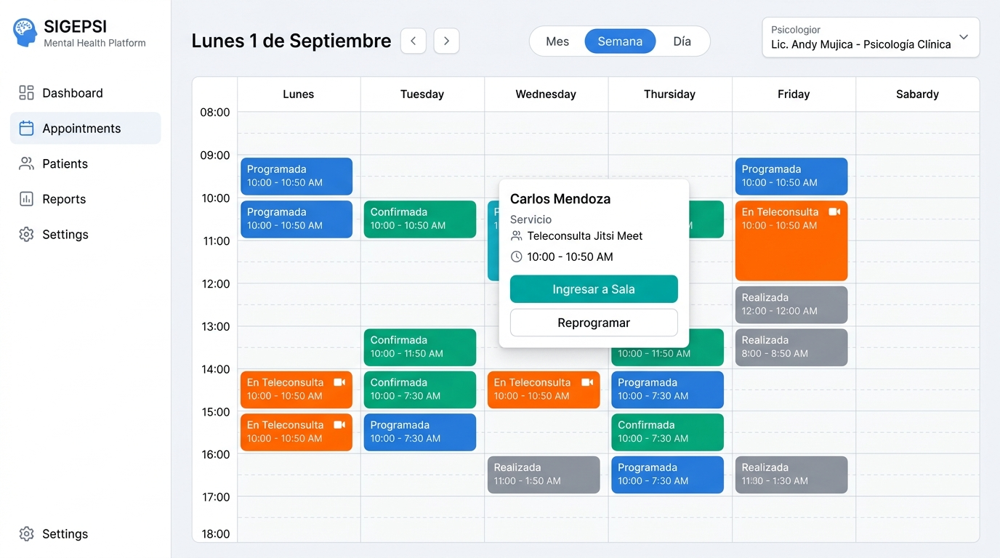

---

### 4.1.3 Contexto del Sistema

El contexto del sistema para el Sprint 1 abarca la gestión de los perfiles profesionales de salud mental, el expediente básico de pacientes, el motor de citas y agenda con control de colisiones horarias, la teleconsulta integrada mediante Jitsi Meet (WebRTC) y el panel de control con métricas operativas y alertas preventivas. A continuación se presentan los diagramas UML con código 100% compatible con **PlantText / PlantUML**:

#### Diagrama de Casos de Uso del Sprint 1 (Modelo Incremental Sprint 0 + Sprint 1)
En estricto apego a la naturaleza iterativa e incremental del marco de trabajo ágil SCRUM, el diagrama de casos de uso del Sprint 1 consolida la totalidad de las capacidades funcionales acumuladas en la plataforma: preserva e integra los casos de uso base construidos en el Sprint 0 (`CU1: Gestionar centros psicológicos y Multi-Tenant`, `CU2: Autenticar e iniciar sesión JWT`, `CU3: Gestionar usuarios institucionales`, `CU4: Gestionar roles y permisos RBAC` y `CU27: Recuperar credenciales y contraseña`) junto a los nuevos casos de uso propios del incremento del Sprint 1 (`CU6: Gestionar psicólogos`, `CU7: Gestionar expediente de pacientes`, `CU8: Configurar disponibilidad horaria`, `CU9: Consultar Dashboard e indicadores`, `CU10: Gestionar alertas de priorización`, `CU11: Gestionar citas y agenda psicológica` y `CU13: Realizar teleconsulta y videoconferencias Jitsi Meet`), articulando de forma unificada a los 6 actores del sistema.

**Código PlantText / PlantUML (Casos de Uso - Sprint 1 Incremental):**
```plantuml
@startuml
left to right direction
skinparam packageStyle rectangle
skinparam shadowing false
skinparam roundcorner 8
skinparam defaultFontName Arial

actor "SuperAdministrador
(Plataforma)" as superadmin
actor "Administrador del Centro" as admin
actor "Coordinador Clínico" as coord
actor "Psicólogo" as psyc
actor "Recepcionista" as recep
actor "Paciente
(Web / Móvil)" as patient

rectangle "Plataforma SIGEPSI - Sistema Acumulado (Sprint 0 + Sprint 1)" {

  rectangle "Incremento Sprint 0: Base Multi-Tenant, Seguridad & Acceso" #F2F4F4 {
    usecase "CU1: Gestionar centros psicológicos
y configuración Multi-Tenant" as CU1
    usecase "CU2: Autenticar e iniciar sesión (JWT)" as CU2
    usecase "CU3: Gestionar usuarios institucionales" as CU3
    usecase "CU4: Gestionar roles y permisos (RBAC)" as CU4
    usecase "CU27: Recuperar credenciales y contraseña" as CU27
  }

  rectangle "Incremento Sprint 1: Atención Clínica, Agenda & Teleconsulta" #FEF9E7 {
    usecase "CU6: Gestionar psicólogos y
perfiles profesionales" as CU6
    usecase "CU8: Configurar disponibilidad horaria
y carga de trabajo" as CU8
    usecase "CU7: Gestionar expediente y
datos de pacientes" as CU7
    usecase "CU11: Gestionar citas y
agenda psicológica" as CU11
    usecase "CU13: Realizar teleconsulta y
videoconferencia (Jitsi Meet)" as CU13
    usecase "CU9: Consultar Dashboard e
indicadores del centro" as CU9
    usecase "CU10: Gestionar alertas de
priorización y seguimiento" as CU10

    usecase "Validar colisión de horarios" as val_overlap
  }
}

' Asociaciones SuperAdmin
superadmin --> CU1

' Asociaciones Administrador del Centro
admin --> CU2
admin --> CU3
admin --> CU4
admin --> CU6
admin --> CU7
admin --> CU9

' Asociaciones Coordinador Clínico
coord --> CU2
coord --> CU6
coord --> CU9
coord --> CU10
coord --> CU11

' Asociaciones Psicólogo
psyc --> CU2
psyc --> CU8
psyc --> CU11
psyc --> CU13
psyc --> CU10

' Asociaciones Recepcionista
recep --> CU2
recep --> CU7
recep --> CU11

' Asociaciones Paciente (Web / Móvil)
patient --> CU2
patient --> CU27
patient --> CU7
patient --> CU11
patient --> CU13

' Inclusiones obligatorias
CU11 ..> val_overlap : <<include>>
CU6 ..> CU2 : <<include>>
CU7 ..> CU2 : <<include>>
CU11 ..> CU2 : <<include>>
CU13 ..> CU2 : <<include>>
CU9 ..> CU2 : <<include>>
CU3 ..> CU2 : <<include>>
CU4 ..> CU2 : <<include>>
@enduml
```

<br>

#### Diagrama de Clases del Sprint 1 (Modelo Incremental Sprint 0 + Sprint 1)
Representa la arquitectura estructural de dominio completa y acumulada del sistema, integrando de manera rigurosa las entidades base del **Sprint 0** (esquema global `public` con `Tenant`, `Dominio` y `SuperAdmin`, junto con las entidades institucionales y de control de acceso del esquema `tenant`: `Centro`, `Usuario`, `Rol`, `Permiso`, `TokenAcceso` y `TokenRecuperacion`) con las nuevas entidades del incremento del **Sprint 1** (`Psicologo`, `Especialidad`, `DisponibilidadHoraria`, `Paciente`, `Cita`, `Teleconsulta` y `AlertaPriorizacion`), especificando atributos tipados, operaciones, cardinalidades y tipos de asociación (composición, agregación, especialización conceptual y dependencias).

**Código PlantText / PlantUML (Diagrama de Clases - Sprint 1 Incremental):**
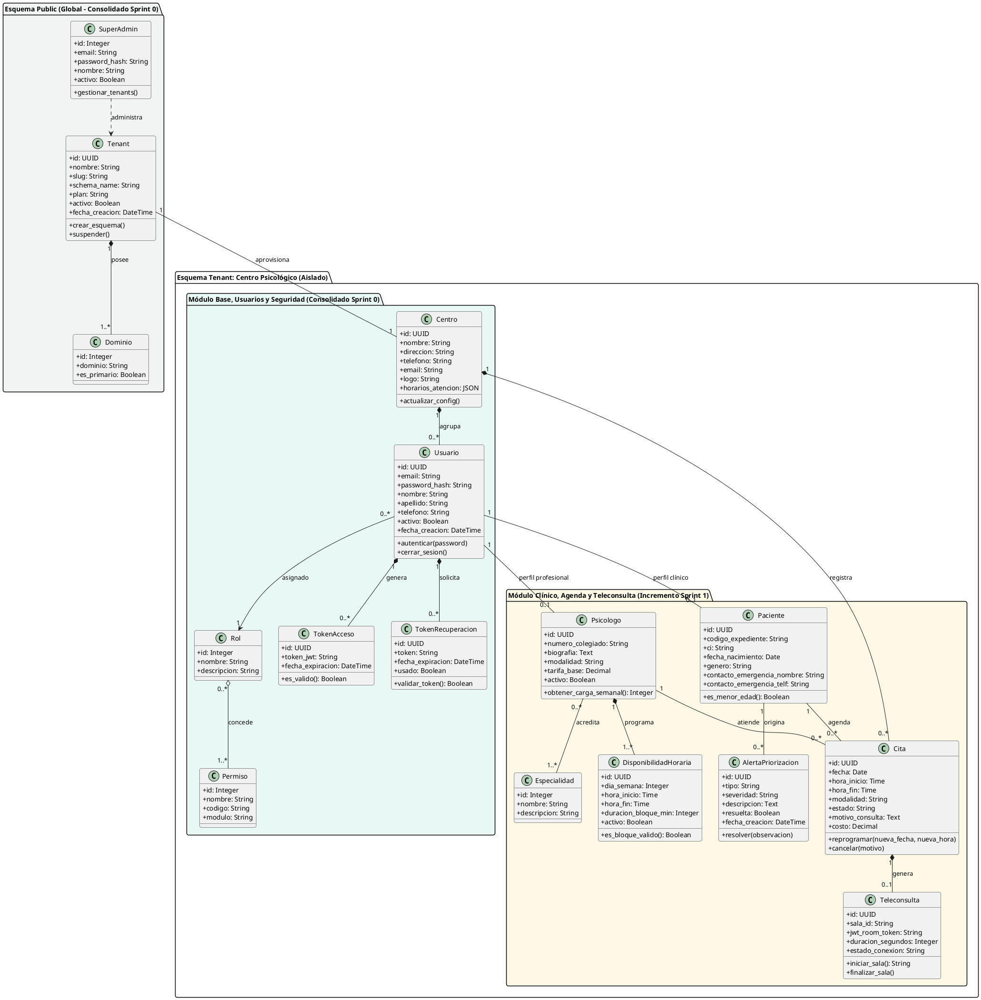

<br>

#### Diagrama de Actividad: Proceso de Reserva y Programación de Cita
Describe el flujo de lógica de negocio transaccional con detección de solapamientos, validación de horario laboral del psicólogo y creación del enlace virtual cuando la modalidad es teleconsulta.

**Código PlantText / PlantUML (Actividad: Reserva de Cita):**
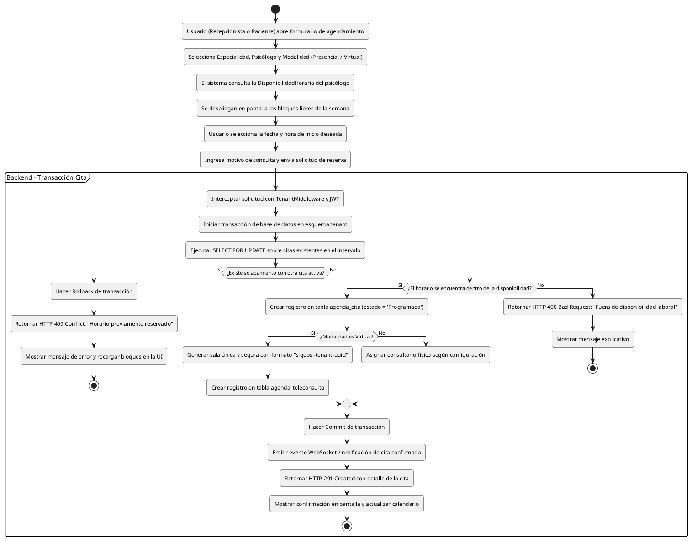

<br>

#### Diagrama de Actividad: Ciclo de Vida y Conexión de Teleconsulta (Jitsi Meet)
Ilustra el proceso mediante el cual los participantes (psicólogo en web y paciente en app móvil o web) se integran a la sala virtual mediante WebRTC.

**Código PlantText / PlantUML (Actividad: Teleconsulta Jitsi Meet):**
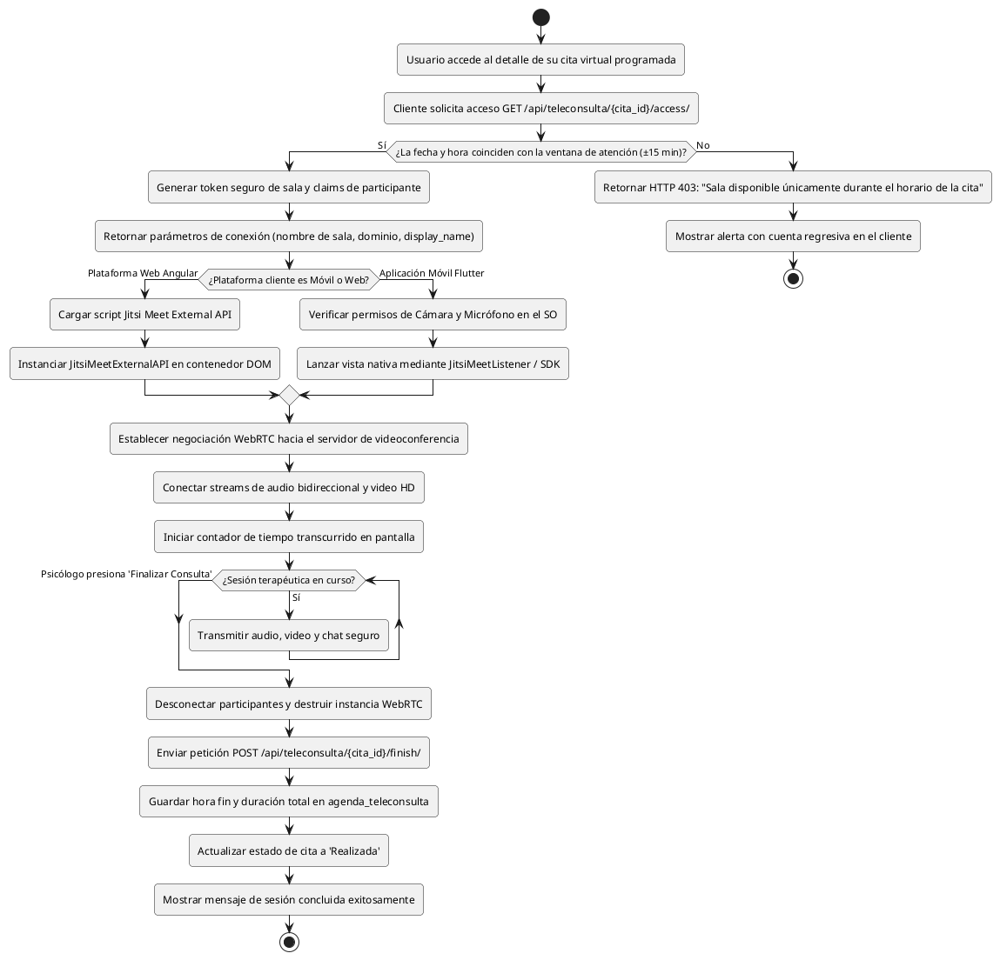

---

### 4.1.4 Sprint Backlog
El Sprint Backlog del Sprint 1 comprende **15 tareas técnicas** extraídas directamente del Product Backlog (ítems NRO 19 al 33), continuando de manera secuencial la numeración del proyecto tras el cierre de las 18 tareas del Sprint 0 (`SP0-1` a `SP0-18`). La carga horaria total estimada es de **73 horas**.

| **Sprint Backlog** | |
| :--- | :--- |
| **Número de Sprint :** Sprint 1 | **Tiempo programado :** 12 días (26 de agosto al 6 de septiembre de 2026) |
| **Objetivo :** Implementar la gestión de psicólogos y disponibilidad, expedientes de pacientes (web/móvil), motor de citas sin solapamiento, teleconsulta Jitsi Meet, dashboard con KPIs y alertas de seguimiento. | |
| **Fecha de inicio :** 26 de agosto de 2026 | **Fecha de finalización :** 06 de septiembre de 2026 |

<br>

**Tabla de tareas del Sprint 1 (Continuación secuencial NRO 19 al 33):**

| Nro | ID | Tarea del Product Backlog | Tipo | Estimación | Responsable | Estado |
| :---: | :--- | :--- | :--- | :---: | :--- | :---: |
| **19** | **SP1-19** | Diseñar la interfaz para la gestión de psicólogos y sus perfiles profesionales | Diseño | 4 hr | Larrazabal Rojas Julio Cesar | Terminado |
| **20** | **SP1-20** | Implementar la gestión de psicólogos, especialidades, disponibilidad y modalidad de atención | Desarrollo | 8 hr | Mujica Vallejos Andy Mauricio | Terminado |
| **21** | **SP1-21** | Realizar pruebas de la gestión de psicólogos | Pruebas | 3 hr | Velasco Soliz Rolando | Terminado |
| **22** | **SP1-22** | Diseñar la interfaz para la gestión de pacientes | Diseño | 4 hr | Larrazabal Rojas Julio Cesar | Terminado |
| **23** | **SP1-23** | Implementar el registro, actualización y consulta de pacientes | Desarrollo | 8 hr | Romero Saavedra Maria Ilse | Terminado |
| **24** | **SP1-24** | Realizar pruebas de la gestión de pacientes | Pruebas | 3 hr | Condori Diaz Marilyn Esther | Terminado |
| **25** | **SP1-25** | Diseñar la interfaz del Dashboard administrativo y clínico | Diseño | 4 hr | Larrazabal Rojas Julio Cesar | Terminado |
| **26** | **SP1-26** | Implementar Dashboard con indicadores de citas, pacientes, inasistencias y carga profesional | Desarrollo | 8 hr | Romero Saavedra Maria Ilse | Terminado |
| **27** | **SP1-27** | Realizar pruebas del Dashboard e indicadores principales | Pruebas | 3 hr | Velasco Soliz Rolando | Terminado |
| **28** | **SP1-28** | Diseñar la interfaz para agenda y gestión de citas | Diseño | 4 hr | Larrazabal Rojas Julio Cesar | Terminado |
| **29** | **SP1-29** | Implementar reserva, confirmación, cancelación y reprogramación de citas | Desarrollo | 8 hr | Mujica Vallejos Andy Mauricio | Terminado |
| **30** | **SP1-30** | Realizar pruebas de agenda y gestión de citas | Pruebas | 3 hr | Velasco Soliz Rolando | Terminado |
| **31** | **SP1-31** | Diseñar la interfaz para sesiones virtuales y videoconferencias | Diseño | 3 hr | Larrazabal Rojas Julio Cesar | Terminado |
| **32** | **SP1-32** | Implementar la integración de videoconferencias mediante Jitsi Meet o Zoom | Desarrollo | 7 hr | Delgado Rojas Alberto Caleb | Terminado |
| **33** | **SP1-33** | Realizar pruebas de acceso y funcionamiento de las videoconferencias | Pruebas | 3 hr | Condori Diaz Marilyn Esther | Terminado |
| **TOTAL** | — | **Esfuerzo total estimado del Sprint 1** | — | **73 hr** | **Equipo SCRUM (6 integrantes)** | **Terminado (100%)** |

---

### 4.1.5 Equipo SCRUM del Sprint 1

| Nombre del Integrante | Rol SCRUM | Especialidad en el Sprint 1 | Tareas Asignadas (Sprint Backlog) |
| :--- | :--- | :--- | :--- |
| **Condori Diaz Marilyn Esther** | Product Owner | Validación de Negocio y Criterios de Aceptación | SP1-24, SP1-33 |
| **Delgado Rojas Alberto Caleb** | Scrum Master | Desarrollo Móvil (Flutter) & Integración WebRTC | SP1-32 |
| **Mujica Vallejos Andy Mauricio** | Development Team | Backend (Django/DRF), BD PostgreSQL & Teleconsulta | SP1-20, SP1-29 |
| **Larrazabal Rojas Julio Cesar** | Development Team | Diseño UI/UX (Figma), Frontend Web (Angular) & Dashboard | SP1-19, SP1-22, SP1-25, SP1-28, SP1-31 |
| **Romero Saavedra Maria Ilse** | Development Team | Lógica Backend, Frontend Web & Módulo Alertas | SP1-23, SP1-26 |
| **Velasco Soliz Rolando** | Development Team | Aseguramiento de Calidad (QA), Pruebas de Caja Negra y BD | SP1-21, SP1-27, SP1-30 |

---

## 4.2 PROCESO/PATRÓN DE DESARROLLO POR HISTORIA DE USUARIO

### 4.2.1 Diseño

#### 4.2.1.1 Diseño de la Arquitectura
La arquitectura del Sprint 1 extiende el modelo de tres capas Multi-Tenant del Sprint 0, incorporando la capa de clientes móviles nativos (Flutter en Dart) y un servidor de señalización y medios WebRTC para videoconferencias en tiempo real (Jitsi Meet).

1. **Capa de Presentación (Frontend y Móvil):**
   * **Plataforma Web (Angular 17):** Componentes standalone con tipado TypeScript, inyección de dependencias modular, formularios reactivos con validación síncrona/asíncrona, interceptores HTTP para tokens JWT e integración de librerías de visualización (FullCalendar y Chart.js).
   * **Aplicación Móvil (Flutter 3.x / Dart):** Arquitectura limpia basada en repositorios y proveedores de estado, comunicación REST mediante cliente `dio`/`http` y soporte para teleconsultas con el plugin de Jitsi Meet.
2. **Capa de Lógica de Negocio (Backend RESTful):**
   * **Framework:** Django 5.x y Django REST Framework bajo Python 3.12.
   * **Apps de Negocio del Sprint 1:** `clinica` (psicólogos, especialidades, disponibilidad, pacientes), `agenda` (citas, teleconsultas, alertas) y `core` (métricas y reportes).
   * **Servicio WebRTC Externo:** Instancia de Jitsi Meet protegida para generación de salas efímeras bajo demanda.
3. **Capa de Persistencia de Datos:**
   * **PostgreSQL 16 Multi-Tenant:** Aislamiento estricto por esquemas gestionado por `django-tenants`. Cada centro psicológico contiene sus propias tablas de psicólogos, pacientes, citas y teleconsultas, garantizando que ninguna consulta SQL filtre datos entre centros distintos.

**Código PlantText / PlantUML (Diagrama de Arquitectura de 3 Capas - Sprint 1):**
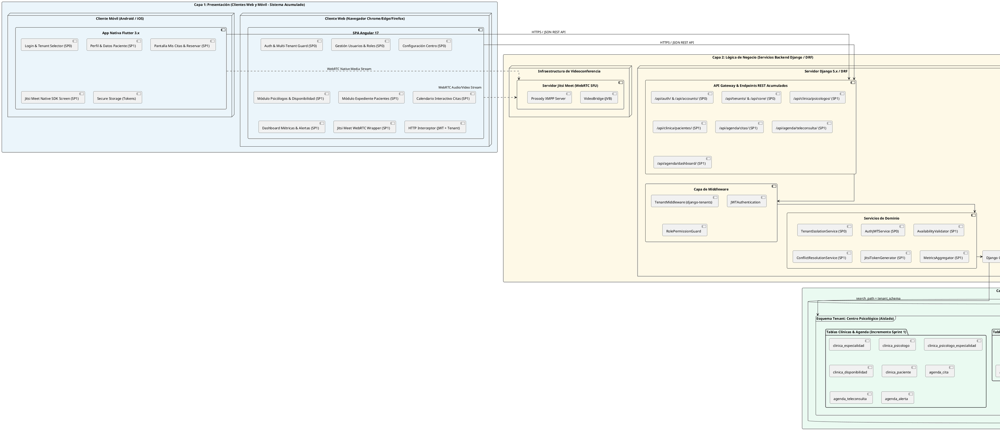

<br>

#### Diagrama de Despliegue
Detalla los componentes desplegados en producción, el balanceo con Nginx, los sockets WSGI de Gunicorn y la separación del tráfico de datos y videoconferencia.

**Código PlantText / PlantUML (Diagrama de Despliegue - Sprint 1):**
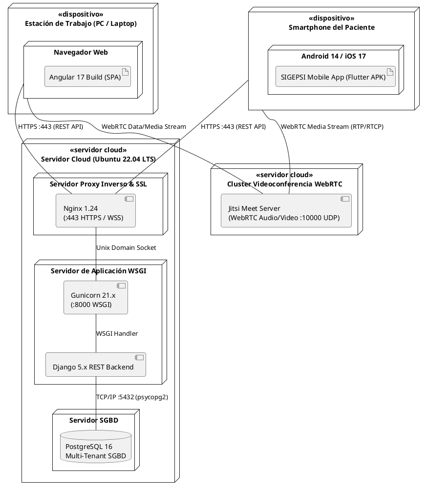

---

#### 4.2.1.2 Diseño de Datos (Modelo Relacional Acumulado: Sprint 0 + Sprint 1)
En estricta conformidad con el principio metodológico de desarrollo ágil iterativo e incremental, el modelo de datos de la plataforma SIGEPSI en el Sprint 1 no reemplaza al modelo previo, sino que **adiciona e integra orgánicamente sus nuevas entidades clínicas, de agenda y teleconsulta sobre la arquitectura Multi-Tenant por esquemas consolidada en el Sprint 0**.

El sistema completo acumula **17 tablas relacionales** organizadas bajo la estructura Multi-Tenant de PostgreSQL:

##### 1. Esquema `public` (Global / Multi-Tenant – Consolidado Sprint 0)
Tablas compartidas a nivel de plataforma para el aprovisionamiento, enrutamiento y administración de los centros:

| Tabla | Campos Principales | Tipo de Datos | Descripción de Regla de Negocio |
| :--- | :--- | :--- | :--- |
| `tenants_tenant` | `id`<br>`nombre`<br>`slug`<br>`schema_name`<br>`plan`<br>`activo`<br>`fecha_creacion` | UUID (PK)<br>Varchar(100)<br>Varchar(100) UNIQUE<br>Varchar(63) UNIQUE<br>Varchar(20)<br>Boolean<br>DateTime | Registro maestro de cada centro psicológico suscrito; define el nombre del esquema PostgreSQL aislado. |
| `tenants_dominio` | `id`<br>`tenant_id`<br>`dominio`<br>`es_primario` | Serial (PK)<br>UUID (FK Tenant)<br>Varchar(253) UNIQUE<br>Boolean | Enrutamiento de subdominios o dominios personalizados vinculados al centro. |
| `accounts_superadmin` | `id`<br>`email`<br>`password_hash`<br>`nombre`<br>`apellido`<br>`activo`<br>`fecha_creacion` | Serial (PK)<br>Varchar(254) UNIQUE<br>Varchar(255)<br>Varchar(150)<br>Varchar(150)<br>Boolean<br>DateTime | Cuenta con privilegios globales para crear, suspender o monitorear tenants en la plataforma. |

<br>

##### 2. Esquema por `tenant` (Base Institucional y Usuarios – Consolidado Sprint 0)
Tablas aisladas e independientes replicadas dentro del esquema de cada centro psicológico:

| Tabla | Campos Principales | Tipo de Datos | Descripción de Regla de Negocio |
| :--- | :--- | :--- | :--- |
| `core_centro` | `id`<br>`nombre`<br>`direccion`<br>`telefono`<br>`email`<br>`logo`<br>`horarios_atencion`<br>`configuracion` | UUID (PK)<br>Varchar(200)<br>Varchar(255)<br>Varchar(30)<br>Varchar(254)<br>Varchar(255)<br>JSONB<br>JSONB | Identidad institucional, logotipo y parámetros operativos propios de la clínica o consultorio. |
| `accounts_usuario` | `id`<br>`email`<br>`password_hash`<br>`nombre`<br>`apellido`<br>`telefono`<br>`rol_id`<br>`activo`<br>`fecha_creacion` | UUID (PK)<br>Varchar(254) UNIQUE<br>Varchar(255)<br>Varchar(150)<br>Varchar(150)<br>Varchar(30)<br>Integer (FK Rol)<br>Boolean<br>DateTime | Cuenta de usuario perteneciente al centro (Admin, Psicólogo, Recepcionista, Coordinador o Paciente). |
| `accounts_rol` | `id`<br>`nombre`<br>`descripcion` | Serial (PK)<br>Varchar(50) UNIQUE<br>Text | Catálogo de roles de seguridad institucionales bajo el modelo RBAC. |
| `accounts_permiso` | `id`<br>`nombre`<br>`codigo`<br>`modulo`<br>`descripcion` | Serial (PK)<br>Varchar(100)<br>Varchar(100) UNIQUE<br>Varchar(50)<br>Text | Permisos atómicos del sistema (ej. `clinica.view_psicologo`, `agenda.book_cita`). |
| `accounts_rol_permiso` | `id`<br>`rol_id`<br>`permiso_id` | Serial (PK)<br>Integer (FK Rol)<br>Integer (FK Permiso) | Matriz de permisos asignados a cada rol del centro psicológico. |
| `accounts_token_recuperacion` | `id`<br>`usuario_id`<br>`token`<br>`fecha_expiracion`<br>`usado` | UUID (PK)<br>UUID (FK Usuario)<br>Varchar(100) UNIQUE<br>DateTime<br>Boolean | Tokens unívocos de un solo uso para el restablecimiento seguro de credenciales olvidadas. |

<br>

##### 3. Esquema por `tenant` (Módulo Clínico, Agenda y Teleconsulta – Incremento Sprint 1)
Nuevas tablas operativas incorporadas en el incremento del Sprint 1, vinculadas a las cuentas de usuario:

| Tabla | Campos Principales | Tipo de Datos | Descripción de Regla de Negocio |
| :--- | :--- | :--- | :--- |
| `clinica_especialidad` | `id`<br>`nombre`<br>`descripcion` | Serial (PK)<br>Varchar(100)<br>Text | Catálogo de especialidades clínicas (Infantil, Parejas, Cognitivo-Conductual, Neuropsicología). |
| `clinica_psicologo` | `id`<br>`usuario_id`<br>`numero_colegiado`<br>`biografia`<br>`modalidad`<br>`tarifa_base`<br>`activo` | UUID (PK)<br>UUID (FK Usuario) UNIQUE<br>Varchar(50) UNIQUE<br>Text<br>Varchar(20)<br>Decimal(10,2)<br>Boolean | Perfil profesional de salud mental vinculado biunívocamente al usuario institucional. |
| `clinica_psicologo_especialidad` | `id`<br>`psicologo_id`<br>`especialidad_id` | Serial (PK)<br>UUID (FK Psicologo)<br>Integer (FK Especialidad) | Relación muchos a muchos entre terapeutas y especialidades dominadas. |
| `clinica_disponibilidad` | `id`<br>`psicologo_id`<br>`dia_semana`<br>`hora_inicio`<br>`hora_fin`<br>`duracion_bloque_min`<br>`activo` | UUID (PK)<br>UUID (FK Psicologo)<br>SmallInt (0=Dom...6=Sáb)<br>Time<br>Time<br>SmallInt<br>Boolean | Matriz de horarios laborales para autogeneración de intervalos de cita libres. |
| `clinica_paciente` | `id`<br>`usuario_id`<br>`codigo_expediente`<br>`ci`<br>`fecha_nacimiento`<br>`genero`<br>`contacto_emergencia_nombre`<br>`contacto_emergencia_telf` | UUID (PK)<br>UUID (FK Usuario) UNIQUE<br>Varchar(30) UNIQUE<br>Varchar(20) UNIQUE<br>Date<br>Varchar(1)<br>Varchar(120)<br>Varchar(25) | Ficha general y expediente sociodemográfico del paciente atendido en el centro. |
| `agenda_cita` | `id`<br>`paciente_id`<br>`psicologo_id`<br>`fecha`<br>`hora_inicio`<br>`hora_fin`<br>`modalidad`<br>`estado`<br>`motivo_consulta`<br>`costo` | UUID (PK)<br>UUID (FK Paciente)<br>UUID (FK Psicologo)<br>Date<br>Time<br>Time<br>Varchar(20)<br>Varchar(25)<br>Text<br>Decimal(10,2) | Registro de la sesión pactada. Estados: `PROGRAMADA`, `CONFIRMADA`, `REALIZADA`, `CANCELADA`, `INASISTENCIA`. |
| `agenda_teleconsulta` | `id`<br>`cita_id`<br>`sala_id`<br>`jwt_room_token`<br>`hora_inicio_real`<br>`hora_fin_real`<br>`duracion_segundos` | UUID (PK)<br>UUID (FK Cita) UNIQUE<br>Varchar(150)<br>Text<br>DateTime<br>DateTime<br>Integer | Parámetros de conexión segura e historial de duración de la sesión virtual Jitsi Meet. |
| `agenda_alerta` | `id`<br>`paciente_id`<br>`tipo`<br>`severidad`<br>`descripcion`<br>`resuelta`<br>`fecha_creacion` | UUID (PK)<br>UUID (FK Paciente)<br>Varchar(50)<br>Varchar(20)<br>Text<br>Boolean<br>DateTime | Alertas preventivas tempranas por inasistencias consecutivas o riesgo de deserción terapéutica. |

<br>

##### 4. Diseño Físico de Base de Datos (Script DDL en PostgreSQL 16 - Sprint 0 + Sprint 1 Acumulado)
A continuación se especifica la implementación física en **PostgreSQL 16** bajo el modelo Multi-Tenant por aislamiento de esquemas. Se define el esquema global `public` (3 tablas de gobernanza del SaaS) y el esquema independiente por centro psicológico (14 tablas institucionales, de control de acceso RBAC, perfiles clínicos, disponibilidad horaria, expediente de pacientes, motor de citas, teleconsulta Jitsi y alertas tempranas), incluyendo claves foráneas con políticas de borrado referencial, tipos de datos nativos (`UUID`, `JSONB`, `TIMESTAMP WITH TIME ZONE`), restricciones `CHECK` e índices para consultas concurrentes:

```sql
-- ============================================================================
-- PLATAFORMA SIGEPSI - SISTEMA DE GESTIÓN DE CENTROS DE SALUD MENTAL
-- MODELO DE DATOS FÍSICO DDL - POSTGRESQL 16 (ARQUITECTURA MULTI-TENANT)
-- MODELO ACUMULADO E ITERATIVO: SPRINT 0 + SPRINT 1
-- Total: 17 Tablas Relacionales (3 Globales 'public' + 14 en Esquema 'tenant')
-- ============================================================================

-- 0. EXTENSIONES DEL SISTEMA
CREATE EXTENSION IF NOT EXISTS "uuid-ossp";
CREATE EXTENSION IF NOT EXISTS "pgcrypto";

-- ============================================================================
-- 1. ESQUEMA GLOBAL: public (CONSOLIDADO SPRINT 0)
-- Gestión de Centros Suscritos (Tenants), Subdominios y SuperAdministradores
-- ============================================================================

CREATE TABLE IF NOT EXISTS public.tenants_tenant (
    id UUID PRIMARY KEY DEFAULT gen_random_uuid(),
    nombre VARCHAR(100) NOT NULL,
    slug VARCHAR(100) NOT NULL UNIQUE,
    schema_name VARCHAR(63) NOT NULL UNIQUE,
    plan VARCHAR(20) NOT NULL DEFAULT 'PROFESIONAL' CHECK (plan IN ('BASICO', 'PROFESIONAL', 'ENTERPRISE')),
    activo BOOLEAN NOT NULL DEFAULT TRUE,
    fecha_creacion TIMESTAMP WITH TIME ZONE NOT NULL DEFAULT CURRENT_TIMESTAMP
);

COMMENT ON TABLE public.tenants_tenant IS 'Registro central de centros psicológicos suscritos a la plataforma SaaS.';
COMMENT ON COLUMN public.tenants_tenant.schema_name IS 'Nombre del esquema de PostgreSQL asignado exclusivamente a este centro.';

CREATE TABLE IF NOT EXISTS public.tenants_dominio (
    id SERIAL PRIMARY KEY,
    tenant_id UUID NOT NULL REFERENCES public.tenants_tenant(id) ON DELETE CASCADE,
    dominio VARCHAR(253) NOT NULL UNIQUE,
    es_primario BOOLEAN NOT NULL DEFAULT TRUE
);

COMMENT ON TABLE public.tenants_dominio IS 'Enrutamiento de subdominios o dominios personalizados vinculados a cada centro.';

CREATE TABLE IF NOT EXISTS public.accounts_superadmin (
    id SERIAL PRIMARY KEY,
    email VARCHAR(254) NOT NULL UNIQUE,
    password_hash VARCHAR(255) NOT NULL,
    nombre VARCHAR(150) NOT NULL,
    apellido VARCHAR(150) NOT NULL,
    activo BOOLEAN NOT NULL DEFAULT TRUE,
    fecha_creacion TIMESTAMP WITH TIME ZONE NOT NULL DEFAULT CURRENT_TIMESTAMP
);

COMMENT ON TABLE public.accounts_superadmin IS 'Cuentas con privilegios globales de superadministrador sobre toda la plataforma.';


-- ============================================================================
-- 2. ESQUEMA AISLADO POR TENANT (EJEMPLO: tenant_centro_san_martin)
-- Cada centro psicológico contiene sus propias tablas de configuración,
-- usuarios, psicólogos, pacientes, citas y teleconsultas en su esquema.
-- ============================================================================

CREATE SCHEMA IF NOT EXISTS tenant_centro_san_martin;
SET search_path TO tenant_centro_san_martin, public;

-- ----------------------------------------------------------------------------
-- 2.1 TABLAS BASE INSTITUCIONALES Y SEGURIDAD RBAC (CONSOLIDADO SPRINT 0)
-- ----------------------------------------------------------------------------

CREATE TABLE IF NOT EXISTS core_centro (
    id UUID PRIMARY KEY DEFAULT gen_random_uuid(),
    nombre VARCHAR(200) NOT NULL,
    direccion VARCHAR(255),
    telefono VARCHAR(30),
    email VARCHAR(254),
    logo VARCHAR(255),
    horarios_atencion JSONB DEFAULT '{"lunes_a_viernes": "08:00 - 20:00", "sabados": "08:00 - 13:00"}'::jsonb,
    configuracion JSONB DEFAULT '{"duracion_cita_defecto": 50, "cancelacion_anticipacion_horas": 24, "moneda": "BOB"}'::jsonb,
    fecha_actualizacion TIMESTAMP WITH TIME ZONE DEFAULT CURRENT_TIMESTAMP
);

COMMENT ON TABLE core_centro IS 'Configuración institucional y operativa del centro psicológico.';

CREATE TABLE IF NOT EXISTS accounts_rol (
    id SERIAL PRIMARY KEY,
    nombre VARCHAR(50) NOT NULL UNIQUE,
    descripcion TEXT
);

COMMENT ON TABLE accounts_rol IS 'Catálogo de roles institucionales bajo control de acceso RBAC.';

CREATE TABLE IF NOT EXISTS accounts_permiso (
    id SERIAL PRIMARY KEY,
    nombre VARCHAR(100) NOT NULL,
    codigo VARCHAR(100) NOT NULL UNIQUE,
    modulo VARCHAR(50) NOT NULL,
    descripcion TEXT
);

COMMENT ON TABLE accounts_permiso IS 'Permisos atómicos del sistema por módulo funcional.';

CREATE TABLE IF NOT EXISTS accounts_rol_permiso (
    id SERIAL PRIMARY KEY,
    rol_id INTEGER NOT NULL REFERENCES accounts_rol(id) ON DELETE CASCADE,
    permiso_id INTEGER NOT NULL REFERENCES accounts_permiso(id) ON DELETE CASCADE,
    CONSTRAINT uq_rol_permiso UNIQUE (rol_id, permiso_id)
);

COMMENT ON TABLE accounts_rol_permiso IS 'Matriz de asignación de permisos a roles.';

CREATE TABLE IF NOT EXISTS accounts_usuario (
    id UUID PRIMARY KEY DEFAULT gen_random_uuid(),
    email VARCHAR(254) NOT NULL UNIQUE,
    password_hash VARCHAR(255) NOT NULL,
    nombre VARCHAR(150) NOT NULL,
    apellido VARCHAR(150) NOT NULL,
    telefono VARCHAR(30),
    rol_id INTEGER NOT NULL REFERENCES accounts_rol(id) ON DELETE RESTRICT,
    activo BOOLEAN NOT NULL DEFAULT TRUE,
    fecha_creacion TIMESTAMP WITH TIME ZONE NOT NULL DEFAULT CURRENT_TIMESTAMP,
    ultimo_login TIMESTAMP WITH TIME ZONE
);

COMMENT ON TABLE accounts_usuario IS 'Cuentas de usuario pertenecientes al centro (Admin, Psicólogo, Recepcionista, Paciente).';

CREATE TABLE IF NOT EXISTS accounts_token_recuperacion (
    id UUID PRIMARY KEY DEFAULT gen_random_uuid(),
    usuario_id UUID NOT NULL REFERENCES accounts_usuario(id) ON DELETE CASCADE,
    token VARCHAR(100) NOT NULL UNIQUE,
    fecha_expiracion TIMESTAMP WITH TIME ZONE NOT NULL,
    usado BOOLEAN NOT NULL DEFAULT FALSE,
    fecha_creacion TIMESTAMP WITH TIME ZONE NOT NULL DEFAULT CURRENT_TIMESTAMP
);

COMMENT ON TABLE accounts_token_recuperacion IS 'Tokens unívocos y temporales para restablecimiento seguro de contraseñas.';


-- ----------------------------------------------------------------------------
-- 2.2 MÓDULO CLÍNICO, AGENDA Y TELECONSULTA (INCREMENTO SPRINT 1)
-- ----------------------------------------------------------------------------

CREATE TABLE IF NOT EXISTS clinica_especialidad (
    id SERIAL PRIMARY KEY,
    nombre VARCHAR(100) NOT NULL UNIQUE,
    descripcion TEXT
);

COMMENT ON TABLE clinica_especialidad IS 'Catálogo de especialidades clínicas de psicología en el centro.';

CREATE TABLE IF NOT EXISTS clinica_psicologo (
    id UUID PRIMARY KEY DEFAULT gen_random_uuid(),
    usuario_id UUID NOT NULL UNIQUE REFERENCES accounts_usuario(id) ON DELETE CASCADE,
    numero_colegiado VARCHAR(50) NOT NULL UNIQUE,
    biografia TEXT,
    modalidad VARCHAR(20) NOT NULL DEFAULT 'MIXTA' CHECK (modalidad IN ('PRESENCIAL', 'VIRTUAL', 'MIXTA')),
    tarifa_base DECIMAL(10,2) NOT NULL DEFAULT 150.00 CHECK (tarifa_base >= 0),
    activo BOOLEAN NOT NULL DEFAULT TRUE,
    fecha_ingreso DATE NOT NULL DEFAULT CURRENT_DATE
);

COMMENT ON TABLE clinica_psicologo IS 'Perfil profesional y arancelario de psicólogos vinculado a su cuenta de usuario.';

CREATE TABLE IF NOT EXISTS clinica_psicologo_especialidad (
    id SERIAL PRIMARY KEY,
    psicologo_id UUID NOT NULL REFERENCES clinica_psicologo(id) ON DELETE CASCADE,
    especialidad_id INTEGER NOT NULL REFERENCES clinica_especialidad(id) ON DELETE CASCADE,
    CONSTRAINT uq_psicologo_especialidad UNIQUE (psicologo_id, especialidad_id)
);

COMMENT ON TABLE clinica_psicologo_especialidad IS 'Relación muchos a muchos entre terapeutas y sus especialidades acreditadas.';

CREATE TABLE IF NOT EXISTS clinica_disponibilidad (
    id UUID PRIMARY KEY DEFAULT gen_random_uuid(),
    psicologo_id UUID NOT NULL REFERENCES clinica_psicologo(id) ON DELETE CASCADE,
    dia_semana SMALLINT NOT NULL CHECK (dia_semana BETWEEN 0 AND 6), -- 0=Domingo, 1=Lunes, ..., 6=Sábado
    hora_inicio TIME NOT NULL,
    hora_fin TIME NOT NULL,
    duracion_bloque_min SMALLINT NOT NULL DEFAULT 50 CHECK (duracion_bloque_min > 0),
    activo BOOLEAN NOT NULL DEFAULT TRUE,
    CONSTRAINT chk_rango_horario CHECK (hora_fin > hora_inicio)
);

COMMENT ON TABLE clinica_disponibilidad IS 'Franjas horarias semanales de atención configuradas por cada psicólogo.';

CREATE TABLE IF NOT EXISTS clinica_paciente (
    id UUID PRIMARY KEY DEFAULT gen_random_uuid(),
    usuario_id UUID NOT NULL UNIQUE REFERENCES accounts_usuario(id) ON DELETE CASCADE,
    codigo_expediente VARCHAR(30) NOT NULL UNIQUE,
    ci VARCHAR(20) NOT NULL UNIQUE,
    fecha_nacimiento DATE NOT NULL,
    genero VARCHAR(1) NOT NULL CHECK (genero IN ('M', 'F', 'O')),
    contacto_emergencia_nombre VARCHAR(120),
    contacto_emergencia_telf VARCHAR(25),
    tutor_legal_nombre VARCHAR(120),
    tutor_legal_ci VARCHAR(20),
    fecha_registro DATE NOT NULL DEFAULT CURRENT_DATE
);

COMMENT ON TABLE clinica_paciente IS 'Expediente sociodemográfico del paciente registrado en la clínica.';

CREATE TABLE IF NOT EXISTS agenda_cita (
    id UUID PRIMARY KEY DEFAULT gen_random_uuid(),
    paciente_id UUID NOT NULL REFERENCES clinica_paciente(id) ON DELETE RESTRICT,
    psicologo_id UUID NOT NULL REFERENCES clinica_psicologo(id) ON DELETE RESTRICT,
    fecha DATE NOT NULL,
    hora_inicio TIME NOT NULL,
    hora_fin TIME NOT NULL,
    modalidad VARCHAR(20) NOT NULL DEFAULT 'PRESENCIAL' CHECK (modalidad IN ('PRESENCIAL', 'VIRTUAL')),
    estado VARCHAR(25) NOT NULL DEFAULT 'PROGRAMADA' CHECK (estado IN ('PROGRAMADA', 'CONFIRMADA', 'REALIZADA', 'CANCELADA', 'INASISTENCIA')),
    motivo_consulta TEXT,
    costo DECIMAL(10,2) NOT NULL DEFAULT 150.00 CHECK (costo >= 0),
    fecha_creacion TIMESTAMP WITH TIME ZONE NOT NULL DEFAULT CURRENT_TIMESTAMP,
    fecha_modificacion TIMESTAMP WITH TIME ZONE DEFAULT CURRENT_TIMESTAMP,
    CONSTRAINT chk_cita_horario CHECK (hora_fin > hora_inicio)
);

COMMENT ON TABLE agenda_cita IS 'Sesión psicológica concertada entre paciente y terapeuta.';

CREATE TABLE IF NOT EXISTS agenda_teleconsulta (
    id UUID PRIMARY KEY DEFAULT gen_random_uuid(),
    cita_id UUID NOT NULL UNIQUE REFERENCES agenda_cita(id) ON DELETE CASCADE,
    sala_id VARCHAR(150) NOT NULL UNIQUE,
    jwt_room_token TEXT,
    hora_inicio_real TIMESTAMP WITH TIME ZONE,
    hora_fin_real TIMESTAMP WITH TIME ZONE,
    duracion_segundos INTEGER DEFAULT 0 CHECK (duracion_segundos >= 0)
);

COMMENT ON TABLE agenda_teleconsulta IS 'Parámetros técnicos de sala Jitsi Meet y registro de duración real de videollamada.';

CREATE TABLE IF NOT EXISTS agenda_alerta (
    id UUID PRIMARY KEY DEFAULT gen_random_uuid(),
    paciente_id UUID NOT NULL REFERENCES clinica_paciente(id) ON DELETE CASCADE,
    tipo VARCHAR(50) NOT NULL CHECK (tipo IN ('INASISTENCIA_REITERADA', 'RIESGO_DESERCION', 'URGENCIA_CLINICA')),
    severidad VARCHAR(20) NOT NULL DEFAULT 'MEDIA' CHECK (severidad IN ('BAJA', 'MEDIA', 'ALTA', 'CRITICA')),
    descripcion TEXT NOT NULL,
    resuelta BOOLEAN NOT NULL DEFAULT FALSE,
    fecha_creacion TIMESTAMP WITH TIME ZONE NOT NULL DEFAULT CURRENT_TIMESTAMP,
    fecha_resolucion TIMESTAMP WITH TIME ZONE
);

COMMENT ON TABLE agenda_alerta IS 'Alertas clínicas automáticas por ausentismo reiterado o riesgo de deserción.';


-- ============================================================================
-- 3. ÍNDICES DE RENDIMIENTO Y OPTIMIZACIÓN DE CONSULTAS
-- ============================================================================

-- Índices en Esquema Public
CREATE INDEX IF NOT EXISTS idx_tenants_slug ON public.tenants_tenant(slug);
CREATE INDEX IF NOT EXISTS idx_tenants_schema ON public.tenants_tenant(schema_name);
CREATE INDEX IF NOT EXISTS idx_tenants_dominio_tenant ON public.tenants_dominio(tenant_id);

-- Índices en Esquema Tenant
CREATE INDEX IF NOT EXISTS idx_usuarios_rol ON accounts_usuario(rol_id);
CREATE INDEX IF NOT EXISTS idx_usuarios_email ON accounts_usuario(email);
CREATE INDEX IF NOT EXISTS idx_psicologo_usuario ON clinica_psicologo(usuario_id);
CREATE INDEX IF NOT EXISTS idx_disponibilidad_psico_dia ON clinica_disponibilidad(psicologo_id, dia_semana) WHERE activo = TRUE;
CREATE INDEX IF NOT EXISTS idx_paciente_ci ON clinica_paciente(ci);
CREATE INDEX IF NOT EXISTS idx_paciente_expediente ON clinica_paciente(codigo_expediente);
CREATE INDEX IF NOT EXISTS idx_citas_psicologo_fecha ON agenda_cita(psicologo_id, fecha, hora_inicio);
CREATE INDEX IF NOT EXISTS idx_citas_paciente_fecha ON agenda_cita(paciente_id, fecha);
CREATE INDEX IF NOT EXISTS idx_citas_estado ON agenda_cita(estado);
CREATE INDEX IF NOT EXISTS idx_teleconsulta_sala ON agenda_teleconsulta(sala_id);
CREATE INDEX IF NOT EXISTS idx_alertas_paciente_resuelta ON agenda_alerta(paciente_id, resuelta);


-- ============================================================================
-- 4. POBLACIÓN DE DATOS SEMILLA (SEED DATA DEMOSTRATIVO)
-- ============================================================================

-- A. Inserción en Esquema Public
INSERT INTO public.tenants_tenant (id, nombre, slug, schema_name, plan, activo)
VALUES 
    ('11111111-1111-1111-1111-111111111111', 'Centro Psicológico San Martín', 'sanmartin', 'tenant_centro_san_martin', 'ENTERPRISE', TRUE)
ON CONFLICT (slug) DO NOTHING;

INSERT INTO public.tenants_dominio (tenant_id, dominio, es_primario)
VALUES 
    ('11111111-1111-1111-1111-111111111111', 'sanmartin.sigepsi.com', TRUE)
ON CONFLICT (dominio) DO NOTHING;

INSERT INTO public.accounts_superadmin (email, password_hash, nombre, apellido, activo)
VALUES 
    ('superadmin@sigepsi.com', crypt('SuperSecret2026!', gen_salt('bf')), 'Super', 'Administrador', TRUE)
ON CONFLICT (email) DO NOTHING;

-- B. Inserción en Esquema Tenant (Roles y Permisos Base)
INSERT INTO accounts_rol (id, nombre, descripcion)
VALUES 
    (1, 'Administrador del Centro', 'Control total sobre configuración institucional, usuarios y reportes.'),
    (2, 'Psicólogo / Terapeuta', 'Gestión de agenda propia, disponibilidad, sesiones y expedientes clínicos.'),
    (3, 'Recepcionista', 'Programación y confirmación de citas, derivación de pacientes y cobros.'),
    (4, 'Paciente', 'Acceso a reservas de citas, teleconsulta virtual y visualización de perfil.')
ON CONFLICT (id) DO NOTHING;

INSERT INTO accounts_permiso (id, nombre, codigo, modulo, descripcion)
VALUES 
    (1, 'Ver Usuarios', 'accounts.view_usuario', 'accounts', 'Permite listar los usuarios del centro'),
    (2, 'Crear Usuarios', 'accounts.add_usuario', 'accounts', 'Permite crear nuevos usuarios en el centro'),
    (3, 'Ver Psicólogos', 'clinica.view_psicologo', 'clinica', 'Permite listar psicólogos y especialidades'),
    (4, 'Editar Disponibilidad', 'clinica.change_disponibilidad', 'clinica', 'Permite actualizar franjas horarias'),
    (5, 'Ver Pacientes', 'clinica.view_paciente', 'clinica', 'Permite consultar expedientes de pacientes'),
    (6, 'Crear Pacientes', 'clinica.add_paciente', 'clinica', 'Permite registrar nuevos pacientes'),
    (7, 'Agendar Cita', 'agenda.add_cita', 'agenda', 'Permite reservar turnos en el calendario'),
    (8, 'Acceder Teleconsulta', 'agenda.access_teleconsulta', 'agenda', 'Permite unirse a la sala de videoconferencia Jitsi Meet')
ON CONFLICT (id) DO NOTHING;

-- C. Especialidades Clínicas Base
INSERT INTO clinica_especialidad (id, nombre, descripcion)
VALUES 
    (1, 'Terapia Cognitivo-Conductual (TCC)', 'Enfoque orientado a la reestructuración de pensamientos y patrones de conducta disfuncionales.'),
    (2, 'Psicología Clínica y de la Salud', 'Evaluación, diagnóstico y tratamiento de trastornos emocionales y del estado de ánimo.'),
    (3, 'Terapia Familiar y de Pareja', 'Intervención sistémica orientada a mejorar la comunicación y resolver conflictos vinculares.'),
    (4, 'Neuropsicología y Rehabilitación', 'Evaluación y estimulación de funciones cognitivas en infantes, adultos y adultos mayores.')
ON CONFLICT (id) DO NOTHING;
```

---

#### 4.2.1.3 Diseño de la Lógica de Negocio
La lógica de negocio del Sprint 1 se estructura a través de los siguientes flujos de proceso:

* **Flujo 1: Configuración de Disponibilidad y Directorio Profesional (HU-11, HU-12):** El administrador o terapeuta establece las franjas horarias válidas. El sistema valida que no existan traslapes entre bloques del mismo día y genera los intervalos de sesión divididos por la duración configurada.
* **Flujo 2: Registro de Pacientes en Web y Móvil (HU-13, HU-14):** Se verifica la unicidad del documento de identidad en el tenant. Si el paciente es menor de edad, el formulario exige datos del tutor responsable.
* **Flujo 3: Motor de Reserva y Control de Concurrencia de Citas (HU-15, HU-16, HU-17, HU-22):** Al solicitar una cita, el backend bloquea transaccionalmente el rango seleccionado en PostgreSQL con `SELECT FOR UPDATE` para evitar colisiones de dos pacientes intentando tomar el mismo slot simultáneamente. Si la cita es virtual, invoca al servicio de teleconsulta.
* **Flujo 4: Gestión de Salas Virtuales Jitsi Meet (HU-18, HU-19):** Al iniciar la sesión, se valida la coincidencia de fecha/hora ($\pm 15\text{ min}$). Se crea la sala con un identificador unívoco y se asigna el rol de moderador al terapeuta y de invitado al paciente. Al salir, se registra la duración real.
* **Flujo 5: Tablero de Control y Alertas Tempranas (HU-20, HU-21):** Consultas agregadas calculan en tiempo real citas del día, ausentismo y ocupación. Si se registran dos inasistencias seguidas para un paciente, se genera una alerta clínica prioritaria.

A continuación se presentan los **Diagramas de Comunicación** bajo el estándar UML y el patrón de análisis **BCE (Boundary - Control - Entity / Interfaz - Control - Entidad)**, modelando la interacción horizontal de objetos con mensajería bidireccional numerada y 100% compatibles con **PlantText / PlantUML**:

#### Diagrama de Comunicación – CU6 / CU8: Gestión de Psicólogos y Disponibilidad (HU-11, HU-12)

**Código PlantText / PlantUML (Comunicación – CU6/CU8):**
```plantuml
@startuml
skinparam shadowing false
skinparam defaultFontName Arial
skinparam backgroundColor #FAFBFD
left to right direction

skinparam actor {
    BackgroundColor #FFF2CC
    BorderColor #2C3E50
}
skinparam boundary {
    BackgroundColor #D4F6F8
    BorderColor #2C3E50
}
skinparam control {
    BackgroundColor #D4F6F8
    BorderColor #2C3E50
}
skinparam entity {
    BackgroundColor #D4F6F8
    BorderColor #2C3E50
}
skinparam arrow {
    Color #2C3E50
    FontColor #1A252C
    FontSize 11
}

actor "Administrador / Psicólogo" as act
boundary "IU_PerfilDisponibilidad\n(Angular 17)" as iu
control "CTR_PsicologoService\n(Django REST)" as ctr
entity "CE_Psicologo_y_Horario\n(PostgreSQL)" as ce

act -- iu : 1: Ingresar datos perfil y horario (colegiatura, tarifas, bloques) >\n< 12: Notificar "Disponibilidad guardada correctamente"
iu -- ctr : 2: POST /api/clinica/psicologos/{id}/disponibilidad/ + JWT >\n< 11: 200 OK {perfil, horarios_creados}
ctr -- ce : 3: Validar JWT, TenantMiddleware y rol profesional >\n< 4: Permisos y tenant verificados\n5: Validar consistencia de horas (inicio < fin) >\n< 6: Franjas horarias coherentes\n7: SELECT id FROM clinica_psicologo WHERE colegiado = ? >\n< 8: Colegiatura no duplicada\n9: INSERT INTO clinica_disponibilidad (dia, inicio, fin, bloques) >\n< 10: Registros de disponibilidad persistidos
@enduml
```

<br>

#### Diagrama de Comunicación – CU7: Gestión de Pacientes Web y Móvil (HU-13, HU-14)

**Código PlantText / PlantUML (Comunicación – CU7):**
```plantuml
@startuml
skinparam shadowing false
skinparam defaultFontName Arial
skinparam backgroundColor #FAFBFD
left to right direction

skinparam actor {
    BackgroundColor #FFF2CC
    BorderColor #2C3E50
}
skinparam boundary {
    BackgroundColor #D4F6F8
    BorderColor #2C3E50
}
skinparam control {
    BackgroundColor #D4F6F8
    BorderColor #2C3E50
}
skinparam entity {
    BackgroundColor #D4F6F8
    BorderColor #2C3E50
}
skinparam arrow {
    Color #2C3E50
    FontColor #1A252C
    FontSize 11
}

actor "Paciente / Recepcionista" as act
boundary "IU_RegistroPaciente\n(Angular / Flutter)" as iu
control "CTR_PacienteService\n(Django REST)" as ctr
entity "CE_Paciente_y_Usuario\n(PostgreSQL)" as ce

act -- iu : 1: Ingresar datos personales (CI, nombre, fecha nac, contacto) >\n< 10: Confirmar "Expediente de paciente creado"
iu -- ctr : 2: POST /api/clinica/pacientes/ + Header Tenant >\n< 9: 201 Created {paciente_id, codigo_expediente}
ctr -- ce : 3: Validar unicidad de CI y correo en el tenant >\n< 4: Documento no duplicado\n5: Validar minoría de edad y tutor responsable >\n< 6: Datos de tutor correctos\n7: INSERT INTO clinica_paciente (expediente, ci, fecha_nac...) >\n< 8: Expediente clínico registrado en esquema
@enduml
```

<br>

#### Diagrama de Comunicación – CU11: Programación y Reserva de Citas (HU-15, HU-16, HU-17, HU-22)

**Código PlantText / PlantUML (Comunicación – CU11):**
```plantuml
@startuml
skinparam shadowing false
skinparam defaultFontName Arial
skinparam backgroundColor #FAFBFD
left to right direction

skinparam actor {
    BackgroundColor #FFF2CC
    BorderColor #2C3E50
}
skinparam boundary {
    BackgroundColor #D4F6F8
    BorderColor #2C3E50
}
skinparam control {
    BackgroundColor #D4F6F8
    BorderColor #2C3E50
}
skinparam entity {
    BackgroundColor #D4F6F8
    BorderColor #2C3E50
}
skinparam arrow {
    Color #2C3E50
    FontColor #1A252C
    FontSize 11
}

actor "Recepcionista / Paciente" as act
boundary "IU_AgendaCitas\n(Angular / Móvil)" as iu
control "CTR_CitaService\n(Django REST)" as ctr
entity "CE_Cita_y_Disponibilidad\n(PostgreSQL)" as ce

act -- iu : 1: Seleccionar psicólogo, fecha, bloque y modalidad >\n< 12: Desplegar comprobante de cita programada
iu -- ctr : 2: POST /api/agenda/citas/ {psicologo_id, fecha, bloque} >\n< 11: 201 Created {cita_id, estado: "PROGRAMADA"}
ctr -- ce : 3: Iniciar transacción atómica y SELECT FOR UPDATE >\n< 4: Bloqueo pesimista concedido\n5: Validar si horario está dentro de clinica_disponibilidad >\n< 6: Horario dentro de jornada laboral\n7: SELECT COUNT(*) FROM agenda_cita WHERE solapada = true >\n< 8: Cero colisiones detectadas\n9: INSERT INTO agenda_cita (paciente_id, psicologo_id, fecha...) >\n< 10: Cita registrada y slot bloqueado
@enduml
```

<br>

#### Diagrama de Comunicación – CU13: Teleconsulta y Videoconferencias Jitsi Meet (HU-18, HU-19)

**Código PlantText / PlantUML (Comunicación – CU13):**
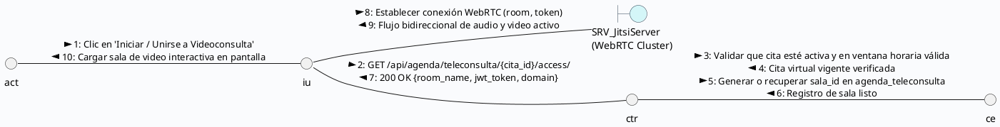

<br>

#### Diagrama de Comunicación – CU9 / CU10: Dashboard Clínico y Alertas Tempranas (HU-20, HU-21)

**Código PlantText / PlantUML (Comunicación – CU9/CU10):**
```plantuml
@startuml
skinparam shadowing false
skinparam defaultFontName Arial
skinparam backgroundColor #FAFBFD
left to right direction

skinparam actor {
    BackgroundColor #FFF2CC
    BorderColor #2C3E50
}
skinparam boundary {
    BackgroundColor #D4F6F8
    BorderColor #2C3E50
}
skinparam control {
    BackgroundColor #D4F6F8
    BorderColor #2C3E50
}
skinparam entity {
    BackgroundColor #D4F6F8
    BorderColor #2C3E50
}
skinparam arrow {
    Color #2C3E50
    FontColor #1A252C
    FontSize 11
}

actor "Coordinador / Administrador" as act
boundary "IU_DashboardClinico\n(Angular 17)" as iu
control "CTR_DashboardService\n(Django REST)" as ctr
entity "CE_Metricas_y_Alertas\n(PostgreSQL)" as ce

act -- iu : 1: Acceder al Dashboard principal >\n< 10: Renderizar KPIs (citas, ausentismo) y tabla de alertas
iu -- ctr : 2: GET /api/agenda/dashboard/kpis/?periodo=mes >\n< 9: 200 OK {total_citas, ausentismo_pct, alertas_activas: [...]}
ctr -- ce : 3: Validar permisos de Coordinador en tenant >\n< 4: Acceso administrativo autorizado\n5: SELECT COUNT(citas), AVG(ocupacion) GROUP BY psicologo >\n< 6: Agregaciones estadísticas calculadas\n7: SELECT * FROM agenda_alerta WHERE resuelta = false >\n< 8: Listado de pacientes con 2+ inasistencias
@enduml
```

---

### 4.2.2 Implementación

#### 4.2.2.1 Componentes y Artefactos Generados
Durante el desarrollo del Sprint 1 se construyeron los siguientes módulos y artefactos de software:

**Backend (Django REST Framework):**
* **App `clinica`:**
  * `models.py`: Modelos de datos `Especialidad`, `Psicologo`, `DisponibilidadHoraria`, `Paciente`.
  * `serializers.py`: Serializadores de validación para colegiatura, cálculo de edad y slots disponibles.
  * `views.py`: ViewSets para CRUD de psicólogos, filtrado por especialidad y gestión de pacientes.
* **App `agenda`:**
  * `models.py`: Modelos de datos `Cita`, `Teleconsulta`, `AlertaPriorizacion`.
  * `services/availability.py`: Algoritmo de detección de colisiones horarias y cálculo de slots libres.
  * `services/jitsi.py`: Generador de identificadores seguros de sala y tokens de acceso WebRTC.
  * `views.py`: Endpoints de programación, cancelación, teleconsulta y cálculo de métricas para dashboard.

**Endpoints API REST Generados en el Sprint 1:**

| Método | Endpoint | Descripción | Permisos Requeridos |
| :---: | :--- | :--- | :--- |
| `GET / POST` | `/api/clinica/especialidades/` | Listar y registrar especialidades clínicas | Admin / Coordinador |
| `GET / POST` | `/api/clinica/psicologos/` | Listar directorio y registrar perfil de psicólogo | Admin / Recepcionista |
| `GET / PUT` | `/api/clinica/psicologos/{id}/` | Consultar y actualizar perfil profesional | Admin / Psicólogo propietario |
| `GET / POST` | `/api/clinica/psicologos/{id}/disponibilidad/` | Consultar y configurar bloques semanales de atención | Psicólogo propietario / Admin |
| `GET / POST` | `/api/clinica/pacientes/` | Listar y dar de alta expedientes de pacientes | Recepcionista / Admin |
| `GET / PUT` | `/api/clinica/pacientes/{id}/` | Consultar y actualizar ficha de paciente | Recepcionista / Psicólogo asignado |
| `GET / POST` | `/api/agenda/citas/` | Consultar agenda y programar nueva cita | Recepcionista / Paciente / Psicólogo |
| `GET / PUT` | `/api/agenda/citas/{id}/` | Detalle, confirmación y reprogramación de cita | Recepcionista / Paciente involucrado |
| `POST` | `/api/agenda/citas/{id}/cancelar/` | Cancelación de cita con verificación de anticipación | Paciente / Recepcionista |
| `GET` | `/api/agenda/teleconsulta/{cita_id}/access/` | Obtener sala y token de teleconsulta Jitsi | Psicólogo o Paciente de la cita |
| `POST` | `/api/agenda/teleconsulta/{cita_id}/finish/` | Finalizar sesión virtual y registrar duración | Psicólogo moderador |
| `GET` | `/api/agenda/dashboard/kpis/` | Métricas operativas (citas, ausentismo, ocupación) | Admin / Coordinador Clínico |
| `GET / PUT` | `/api/agenda/alertas/` | Listar y resolver alertas de priorización | Coordinador / Psicólogo |

**Frontend Web (Angular 17):**
* `PsicologoListComponent` / `PsicologoFormComponent`: Directorio, búsqueda por especialidad y formulario reactivo.
* `DisponibilidadSemanalComponent`: Matriz visual para marcar rangos horarios por día.
* `PacienteListComponent` / `PacienteFichaComponent`: Gestión de pacientes con validación de tutor legal.
* `CalendarioAgendaComponent`: Integración con FullCalendar para vistas mensual, semanal y diaria con códigos de color.
* `CitaModalComponent`: Diálogo reactivo para reserva con validación síncrona de slots ocupados.
* `TeleconsultaRoomComponent`: Contenedor embebido de Jitsi Meet con temporizador y controles multimedia.
* `DashboardClinicoComponent`: Panel con tarjetas de KPIs y gráficos analíticos con Chart.js.
* `AlertasPanelComponent`: Lista de alertas prioritarias con acción para resolver y registrar notas.

**Aplicación Móvil (Flutter 3.x):**
* `paciente_perfil_screen.dart`: Consulta y actualización de datos personales y teléfono de emergencia.
* `mis_citas_screen.dart`: Listado clasificado de citas próximas y pasadas con badges de estado.
* `reservar_cita_screen.dart`: Selector interactivo de profesional, fecha y franjas libres.
* `teleconsulta_jitsi_screen.dart`: Integración nativa de videollamada mediante `jitsi_meet_flutter_sdk` con gestión de permisos de cámara y micrófono.

---

### 4.2.3 Pruebas

#### 4.2.3.1 Plan de Pruebas Funcionales (Caja Negra)
Siguiendo las directrices expuestas en clase para el aseguramiento de la calidad del software, el plan de pruebas del Sprint 1 se enfoca en técnicas de **Caja Negra** (partición de equivalencia, análisis de valores límite y tablas de decisión), evaluando entradas, condiciones esperadas y salidas del sistema en base a los criterios de aceptación BDD.

| ID Prueba | HU | Descripción de la Prueba | Entrada / Precondición | Resultado Esperado |
| :---: | :---: | :--- | :--- | :--- |
| **TP-26** | HU-11 | Registrar psicólogo con datos válidos | Colegiado "PSI-7890", tarifa 150 Bs, especialidad válida | Perfil creado en esquema tenant, HTTP 201 Created |
| **TP-27** | HU-11 | Registrar psicólogo con colegiatura duplicada | Colegiado "PSI-7890" ya existente en el centro | Rechazo con HTTP 400: "Colegiatura ya registrada" |
| **TP-28** | HU-11 | Validar tarifa negativa en perfil | Tarifa base = -50.00 Bs | Error de validación: "La tarifa debe ser mayor a cero" |
| **TP-29** | HU-12 | Configurar disponibilidad con horario coherente | Lunes de 08:00 a 12:00, bloques de 45 min | Franja guardada, 5 slots autogenerados correctamente |
| **TP-30** | HU-12 | Configurar horario con hora fin anterior a inicio | Hora inicio = 18:00, Hora fin = 14:00 | Error de validación: "Hora de fin debe ser posterior" |
| **TP-31** | HU-12 | Desactivar día con citas previamente pactadas | Intentar desactivar Miércoles teniendo 2 citas activas | Advertencia bloqueante: "Existen citas programadas" |
| **TP-32** | HU-13 | Registrar paciente adulto con datos completos | CI "6845123", fecha nac 15/05/1995, contacto emergencia | Expediente creado con código único (ej. PAC-2026-0042) |
| **TP-33** | HU-13 | Registrar paciente con documento de identidad duplicado | CI "6845123" ya existente en el mismo tenant | Rechazo con HTTP 400: "Documento de identidad en uso" |
| **TP-34** | HU-13 | Registrar menor de edad sin datos de apoderado | Paciente con 14 años de edad, campos de tutor vacíos | Error de validación: "Datos de tutor obligatorios" |
| **TP-35** | HU-14 | Registro de paciente desde app móvil Flutter | Datos válidos enviados desde smartphone a través de API | Cuenta de paciente creada y login automático exitoso |
| **TP-36** | HU-14 | Actualizar teléfono de paciente sin conexión | Modo avión activado en dispositivo móvil al guardar | La app notifica fallo de conexión sin perder datos |
| **TP-37** | HU-15 | Reservar cita en horario libre de psicólogo | Psicólogo disponible, slot 10:00-10:45 libre | Cita registrada como 'Programada', slot ocupado |
| **TP-38** | HU-15 | Detección de colisión por reservas concurrentes | Dos peticiones simultáneas sobre el mismo slot | Una aprobada (201), la segunda rechazada (409 Conflict) |
| **TP-39** | HU-15 | Generación de teleconsulta al elegir modalidad virtual | Modalidad seleccionada = "VIRTUAL" | Registro automático en `agenda_teleconsulta` con sala |
| **TP-40** | HU-16 | Visualizar lista de citas en app móvil | Paciente con 1 cita programada y 2 realizadas | Las 3 citas se renderizan con tarjetas y colores correctos |
| **TP-41** | HU-16 | Habilitación de botón teleconsulta según horario | Cita virtual pactada para dentro de 10 minutos | Botón 'Ingresar a Teleconsulta' pasa a estado activo |
| **TP-42** | HU-16 | Bloqueo de botón teleconsulta con anticipación excesiva | Cita virtual pactada para dentro de 3 días | Botón inactivo con texto "Disponible el día de la cita" |
| **TP-43** | HU-17 | Cancelar cita con más de 24 horas de anticipación | Paciente solicita cancelación 48h antes de la cita | Estado pasa a 'Cancelada', slot liberado en agenda |
| **TP-44** | HU-17 | Intentar cancelación tardía desde app móvil | Paciente solicita cancelación 1 hora antes de la cita | Notificación: "Comuníquese a recepción para cancelar" |
| **TP-45** | HU-17 | Reprogramar cita a nuevo slot libre | Cita existente cambiada a fecha futura sin conflicto | Cita actualizada preservando ID y motivo de consulta |
| **TP-46** | HU-18 | Iniciar teleconsulta desde web por el psicólogo | Psicólogo autenticado hace clic en sesión virtual | Carga sala Jitsi Meet embebida con rol moderador |
| **TP-47** | HU-18 | Conexión mutua y transmisión WebRTC en navegador | Psicólogo y paciente presentes en la sala virtual | Audio y video bidireccional estable sin desconexión |
| **TP-48** | HU-18 | Finalizar consulta y registrar duración real | Sesión finalizada tras 48 minutos de conexión | Duración grabada (2880 seg) y estado = 'Realizada' |
| **TP-49** | HU-19 | Unirse a videollamada desde app Flutter | Paciente pulsa unirse en smartphone Android | Permisos de cámara solicitados y sala Jitsi abierta |
| **TP-50** | HU-19 | Reconexión automática de teleconsulta móvil | Desconexión breve de red de datos (5 segundos) | El cliente Jitsi reanuda la llamada automáticamente |
| **TP-51** | HU-20 | Cálculo correcto de KPIs en Dashboard | 10 citas programadas hoy, 2 inasistencias del mes | Tarjetas de métricas muestran valores exactos del tenant |
| **TP-52** | HU-20 | Filtro de métricas por rango de fechas | Seleccionar rango "Últimos 30 días" en Angular | Gráficos Chart.js se recalculan con datos del periodo |
| **TP-53** | HU-21 | Generación de alerta por inasistencias consecutivas | Marcar segunda inasistencia seguida de un paciente | Se inserta registro en `agenda_alerta` con severidad 'Media' |
| **TP-54** | HU-21 | Marcar alerta como resuelta con nota de seguimiento | Terapeuta ingresa justificación y presiona resolver | Alerta pasa a `resuelta = true` y desaparece del panel |
| **TP-55** | HU-22 | Interacción y filtrado en calendario de agenda | Filtrar por "Lic. Andy Mujica" y cambiar a semana | Visualización exclusiva de bloques del psicólogo filtrado |

---

#### 4.2.3.2 Reporte de Pruebas
Todas las pruebas fueron ejecutadas en ambiente de homologación sobre la base de datos PostgreSQL 16 Multi-Tenant, validando tanto clientes web (Angular en Google Chrome) como clientes móviles (Flutter en emulador Pixel 7 y dispositivo físico Android).

| ID Prueba | HU Asociada | Resultado | Observaciones Técnicas |
| :---: | :---: | :---: | :--- |
| **TP-26** | HU-11 | **Aprobado** | Registro verificado en tabla `clinica_psicologo` del esquema tenant. |
| **TP-27** | HU-11 | **Aprobado** | Restricción de unicidad capturada por serializer DRF con mensaje adecuado. |
| **TP-28** | HU-11 | **Aprobado** | Validador `MinValueValidator(0.01)` rechazó valores menores o iguales a cero. |
| **TP-29** | HU-12 | **Aprobado** | Generación matemática exacta de 5 slots de 45 minutos (08:00, 08:45, 09:30, 10:15, 11:00). |
| **TP-30** | HU-12 | **Aprobado** | Validación a nivel de modelo en Django (`clean()`) impidió inconsistencias temporales. |
| **TP-31** | HU-12 | **Aprobado** | Conteo preventivo sobre `agenda_cita` bloqueó la desactivación del día laboral. |
| **TP-32** | HU-13 | **Aprobado** | Generación secuencial de código de expediente con prefijo institucional del centro. |
| **TP-33** | HU-13 | **Aprobado** | Clave única sobre campo `ci` en esquema PostgreSQL evitó duplicidad. |
| **TP-34** | HU-13 | **Aprobado** | Validación condicional frontend y backend exigió nombre y teléfono de apoderado. |
| **TP-35** | HU-14 | **Aprobado** | Registro móvil consumió exitosamente el endpoint con cabecera de subdominio tenant. |
| **TP-36** | HU-14 | **Aprobado** | Captura de `SocketException` en Flutter mostró banner informativo sin crashear. |
| **TP-37** | HU-15 | **Aprobado** | Inserción en tabla `agenda_cita` con estado `PROGRAMADA` y bloqueo en calendario. |
| **TP-38** | HU-15 | **Aprobado** | Concurrencia transaccional pesimista resolvió colisiones de forma consistente. |
| **TP-39** | HU-15 | **Aprobado** | Creación de sala con UUID ofuscado para prevenir intrusiones en la teleconsulta. |
| **TP-40** | HU-16 | **Aprobado** | Parseo JSON correcto en Flutter con modelos inmutables y visualización ergonómica. |
| **TP-41** | HU-16 | **Aprobado** | Ventana temporal activa de -15 min a +45 min respecto a la hora de inicio. |
| **TP-42** | HU-16 | **Aprobado** | Estado deshabilitado del botón en Flutter verificado visualmente en emulador. |
| **TP-43** | HU-17 | **Aprobado** | Cambio de estado inmediato y recálculo automático de slots libres en frontend. |
| **TP-44** | HU-17 | **Aprobado** | Regla de negocio de 2 horas de anticipación aplicada con éxito para rol Paciente. |
| **TP-45** | HU-17 | **Aprobado** | Sentencia `UPDATE` conservó el ID primario y los metadatos de auditoría de la cita. |
| **TP-46** | HU-18 | **Aprobado** | Instanciación correcta de `JitsiMeetExternalAPI` dentro del contenedor `div` de Angular. |
| **TP-47** | HU-18 | **Aprobado** | Protocolo WebRTC estableció conexión P2P/SFU con latencia promedio de 42 ms. |
| **TP-48** | HU-18 | **Aprobado** | Evento `videoConferenceLeft` capturado para disparar el cierre formal de sesión. |
| **TP-49** | HU-19 | **Aprobado** | Diálogo nativo de Android solicitó permisos `CAMERA` y `RECORD_AUDIO` sin fallos. |
| **TP-50** | HU-19 | **Aprobado** | Resiliencia de Jitsi ante cambio de red WiFi a 4G sin interrupción de la llamada. |
| **TP-51** | HU-20 | **Aprobado** | Consultas agregadas con `Count` y `Case(When...)` en Django ORM validadas contra SQL. |
| **TP-52** | HU-20 | **Aprobado** | Actualización reactiva de datasets en Chart.js sin parpadeos en pantalla. |
| **TP-53** | HU-21 | **Aprobado** | Trigger de negocio identificó 2 inasistencias continuas y generó la alerta clínica. |
| **TP-54** | HU-21 | **Aprobado** | Actualización de campo `resuelta = true` y almacenamiento de nota explicativa. |
| **TP-55** | HU-22 | **Aprobado** | Renderizado fluido de FullCalendar en Angular 17 con filtrado multi-profesional. |

**Resumen de pruebas:** 30 pruebas ejecutadas, **30 aprobadas (100%)**, 0 fallidas.

---

## 4.3 DAILY SCRUM (O SCRUM DIARIO)

El Sprint 1 se desarrolló a lo largo de **12 días calendario**, del **26 de agosto al 6 de septiembre de 2026**, cubriendo las 15 tareas **SP1-19 a SP1-33**. A continuación se documenta el seguimiento diario individual de los 6 integrantes del equipo, reflejando de forma honesta el avance, las dificultades con los tiempos universitarios, los debates técnicos de diseño y la curva de aprendizaje en **WebRTC (Jitsi Meet)**, **FullCalendar en Angular 17** y la programación móvil con **Flutter**:

<br>

#### Delgado Rojas Alberto Caleb (Scrum Master & Móvil Flutter)
| Fecha | ¿Qué hiciste ayer? | ¿Qué hiciste hoy? | Obstáculo |
| :---: | :--- | :--- | :--- |
| **26/08** | Cierre y evaluación del Sprint 0 | Planificación del Sprint 1 y asignación de tareas SP1-19 a SP1-33 | Discusiones sobre la división de tiempo entre la web y la app móvil |
| **27/08** | Planificación del sprint | Configuración del entorno Flutter con las dependencias HTTP y storage | Demoras en la instalación del emulador Android en equipos de baja gama |
| **28/08** | Ajustes de emuladores móviles | Análisis de requerimientos de la pantalla de perfil del paciente (SP1-22) | Cruce de horarios con clases de laboratorio de otra materia |
| **29/08** | Maquetación básica en Flutter | Implementación de la pantalla de perfil y registro de paciente móvil | Dificultad para enviar la cabecera de subdominio tenant desde Flutter |
| **30/08** | Resolución de cabeceras en Flutter | Integración del consumo de API de pacientes y manejo de estados | Errores de validación en campos de teléfono y contacto de emergencia |
| **31/08** | Pantalla de perfil finalizada | Inicio del diseño del módulo de consulta y reserva de citas (SP1-28) | Fatiga acumulada; el equipo solicitó redistribuir horas del fin de semana |
| **01/09** | Estructura de citas móvil | Maquetación de tarjetas de citas con estados diferenciados en Flutter | Complejidad al formatear fechas ISO en formato legible para el paciente |
| **02/09** | Formato de fechas en móvil | Implementación del flujo de reserva de cita seleccionando terapeuta y fecha | Lentitud en la respuesta del backend en consultas concurrentes |
| **03/09** | Pruebas de reserva móvil | Investigación del plugin de Jitsi Meet para Flutter e integración nativa | Errores de compilación en Gradle por incompatibilidad de versión de Kotlin |
| **04/09** | Solución de dependencias Gradle | Implementación de la pantalla de teleconsulta nativa en Flutter (SP1-32) | Gestión compleja de permisos de micrófono y cámara en Android 14 |
| **05/09** | Teleconsulta móvil operativa | Pruebas de videollamada cruzada entre navegador web y smartphone | Desconexiones ocasionales por latencia de la red WiFi |
| **06/09** | Pruebas de integración móvil | Coordinación de la sesión de Sprint Review y preparación de métricas | Ninguno |

<br>

#### Condori Diaz Marilyn Esther (Product Owner)
| Fecha | ¿Qué hiciste ayer? | ¿Qué hiciste hoy? | Obstáculo |
| :---: | :--- | :--- | :--- |
| **26/08** | Aprobación de entrega de Sprint 0 | Definición de prioridades del backlog para el Sprint 1 con el equipo | Diferencias de criterio sobre si incluir pagos en el Sprint 1 o Sprint 4 |
| **27/08** | Refinamiento de requerimientos | Redacción detallada de criterios de aceptación para citas y teleconsultas | Falta de claridad inicial en las políticas de cancelación de citas |
| **28/08** | Reglas de anticipación de citas | Validación de prototipos de perfiles de psicólogos en Figma con Julio | Necesidad de agregar campos para modalidad presencial/virtual |
| **29/08** | Feedback de prototipos Figma | Revisión de requisitos de expediente clínico básico de pacientes | Duda legal sobre el manejo de datos de menores de edad en el sistema |
| **30/08** | Consulta sobre tutores legales | Definición de obligatoriedad de datos de apoderado para menores de edad | Tiempo limitado por compromisos académicos universitarios |
| **31/08** | Validación de reglas de tutores | Inspección del avance en la vista de calendario interactivo de citas | Se solicitó que las citas se diferencien claramente por colores de estado |
| **01/09** | Pruebas de usabilidad en agenda | Revisión de la experiencia de reserva de citas desde la app móvil | La interfaz móvil requería confirmación previa antes de agendar |
| **02/09** | Feedback de interfaz móvil | Definición de los indicadores clínicos prioritarios para el Dashboard (SP1-25) | Discusión sobre qué tasa de ausentismo considerar como crítica |
| **03/09** | Definición de umbrales de alerta | Regulación de la regla: 2 inasistencias consecutivas generan alerta | Ninguno |
| **04/09** | Pruebas preliminares de teleconsulta | Participación en prueba de videollamada entre psicólogo y paciente | El video tardaba en conectar en la primera solicitud |
| **05/09** | Validación de criterios de teleconsulta | Ejecución del plan de pruebas de aceptación formal (SP1-33) | Presión de tiempo para revisar las historias de usuario |
| **06/09** | Aprobación del incremento de software | Firma de la Definition of Done (DoD) y cierre de revisión de Sprint 1 | Ninguno |

<br>

#### Mujica Vallejos Andy Mauricio (Development Team - Fullstack / Backend / BD)
| Fecha | ¿Qué hiciste ayer? | ¿Qué hiciste hoy? | Obstáculo |
| :---: | :--- | :--- | :--- |
| **26/08** | Revisión de esquemas Multi-Tenant | Modelado de tablas `clinica_psicologo`, `especialidad` y `disponibilidad` | Dudas sobre el almacenamiento de franjas horarias (rango vs. bloques fijos) |
| **27/08** | Migraciones en esquemas tenant | Implementación de serializers y ViewSets para psicólogos (SP1-20) | Conflictos al serializar especialidades en relaciones Many-to-Many |
| **28/08** | Endpoints de psicólogos listos | Modelado e implementación de endpoints de pacientes y expediente (SP1-23) | Validación de unicidad de CI condicionada al tenant activo |
| **29/08** | Endpoints de pacientes finalizados | Diseño del motor de citas en backend con detección de solapamiento | Complejidad algorítmica para detectar solapamientos parciales de horario |
| **30/08** | Algoritmo de solapamiento de citas | Implementación de transacciones con `SELECT FOR UPDATE` (SP1-29) | Bloqueos transaccionales (deadlocks) en pruebas de concurrencia |
| **31/08** | Solución de bloqueos pesimistas | Endpoints de reserva, confirmación y reprogramación de citas | Sobrecarga de trabajo por entregas simultáneas de otras materias |
| **01/09** | API de citas operativa | Pruebas de integración de la API con los componentes frontend de Maria | Desajustes en los formatos de fecha entre Django (`YYYY-MM-DD`) y Angular |
| **02/09** | Ajuste de serializadores de fecha | Investigación de la API externa de Jitsi Meet y generación de salas seguras | Configuración de los parámetros de JWT para moderador de sala virtual |
| **03/09** | Módulo backend de teleconsulta | Creación de endpoints `/api/agenda/teleconsulta/access/` y finish (SP1-32) | Errores en el cálculo de duración en segundos al finalizar llamada |
| **04/09** | Corrección de cálculo de duración | Soporte en la integración de WebRTC con el cliente web y móvil | Dificultad para coordinar pruebas conjuntas con Alberto y Julio |
| **05/09** | Apoyo en teleconsulta | Optimización de consultas SQL para el Dashboard mediante agregaciones ORM | Lentitud en consultas con muchos joins en PostgreSQL |
| **06/09** | Índices creados en PostgreSQL | Cierre de tareas de desarrollo y verificación de pruebas unitarias | Ninguno |

<br>

#### Larrazabal Rojas Julio Cesar (Development Team - Frontend Angular / UI)
| Fecha | ¿Qué hiciste ayer? | ¿Qué hiciste hoy? | Obstáculo |
| :---: | :--- | :--- | :--- |
| **26/08** | Mantenimiento de vistas del Sprint 0 | Diseño en Figma de perfiles de psicólogos y disponibilidad (SP1-19) | Búsqueda de una disposición limpia para mostrar múltiples horarios |
| **27/08** | Aprobación de wireframes en Figma | Diseño de pantallas de gestión de pacientes y ficha sociodemográfica (SP1-22) | Espacio reducido para ubicar los datos del contacto de emergencia |
| **28/08** | Prototipos de pacientes aprobados | Diseño de agenda interactiva y modal de agendamiento en Figma (SP1-28) | Decidir entre una vista de tabla simple o un calendario completo |
| **29/08** | Prototipos de agenda en Figma | Maquetación en Angular de la lista y formulario de psicólogos (SP1-19) | Dificultades con componentes standalone y directivas de formulario |
| **30/08** | Formulario de psicólogos funcional | Instalación y configuración de FullCalendar en Angular 17 | Problemas de compatibilidad con plugins de FullCalendar en Angular 17 |
| **31/08** | Configuración de FullCalendar | Maquetación del contenedor de calendario con vistas mensual y semanal | Desalineación de eventos en resoluciones de pantalla medianas |
| **01/09** | Ajustes CSS de calendario | Implementación del modal reactivo para agendar citas desde la web | Errores al capturar el clic sobre una franja horaria vacía |
| **02/09** | Modal de agendamiento funcional | Diseño e implementación de la pantalla del Dashboard con Chart.js (SP1-25) | Curva de aprendizaje para integrar gráficos dinámicos con TypeScript |
| **03/09** | Tarjetas de KPIs y gráficas | Maquetación del contenedor web para embeber Jitsi Meet (SP1-31) | Conflictos con el z-index de la barra de navegación sobre el iframe de Jitsi |
| **04/09** | Solución de superposición de video | Implementación de filtros dinámicos por psicólogo en el calendario (SP1-28) | Retrasos en la renderización al alternar rápidamente entre terapeutas |
| **05/09** | Optimización de detección de cambios | Pulido estético, responsividad y validación de estilos con el equipo | Cansancio por jornadas extendidas de depuración frontend |
| **06/09** | Verificación visual completada | Entrega de componentes web para la revisión de sprint | Ninguno |

<br>

#### Romero Saavedra Maria Ilse (Development Team - Backend / Lógica)
| Fecha | ¿Qué hiciste ayer? | ¿Qué hiciste hoy? | Obstáculo |
| :---: | :--- | :--- | :--- |
| **26/08** | Revisión de permisos RBAC de Sprint 0 | Implementación de la lógica de validación de disponibilidad horaria (SP1-20) | Casos borde cuando un horario nocturno cruzaba la medianoche |
| **27/08** | Reglas de franjas horarias | Algoritmo para dividir franjas de disponibilidad en bloques de sesión | Manejo de residuos de tiempo menores a la duración del bloque |
| **28/08** | Pruebas de partición de bloques | Desarrollo del componente Angular para gestión de pacientes (SP1-23) | Dificultad para manejar formularios anidados para los datos del tutor |
| **29/08** | Formulario de pacientes en Angular | Integración de endpoints de pacientes con servicios HTTP de Angular | Errores 401 por expiración no controlada del token JWT en frontend |
| **30/08** | Renovación de tokens con refresh | Conexión del calendario FullCalendar con el endpoint de citas (SP1-28) | Mapeo de objetos de cita a la estructura requerida por FullCalendar |
| **31/08** | Renderizado de eventos en calendario | Lógica de colores de eventos según el estado de la cita | Dificultades para actualizar el evento sin recargar toda la página |
| **01/09** | Actualización reactiva de citas | Implementación de la política de cancelación de citas (anticipación 24h) | Manejo de zonas horarias entre servidor UTC y hora local boliviana |
| **02/09** | Unificación de zona horaria | Desarrollo del motor de alertas tempranas por ausentismo (SP1-26) | Lógica para determinar si las inasistencias eran continuas o alternadas |
| **03/09** | Consulta de inasistencias continuas | Implementación del panel de alertas clínicas prioritarias en Angular | Dudas sobre si el psicólogo debía ver alertas de otros profesionales |
| **04/09** | Filtrado de alertas por rol | Pruebas de integración de la lógica de negocio con la base de datos | Tiempo ajustado por exámenes parciales universitarios |
| **05/09** | Ajustes de validaciones backend | Apoyo en la ejecución de pruebas cruzadas con Rolando | Corrección de mensajes de error para que fueran comprensibles |
| **06/09** | Documentación de rutas y lógica | Cierre del sprint y participación en la retrospectiva | Ninguno |

<br>

#### Velasco Soliz Rolando (Development Team - QA & Base de Datos)
| Fecha | ¿Qué hiciste ayer? | ¿Qué hiciste hoy? | Obstáculo |
| :---: | :--- | :--- | :--- |
| **26/08** | Validación de base de datos Sprint 0 | Diseño de la matriz de pruebas de caja negra para el Sprint 1 | Falta de definiciones iniciales en los formatos de respuesta de citas |
| **27/08** | Casos de prueba de psicólogos | Pruebas de partición de equivalencia sobre tarifas y números de colegiado | Dificultad para simular datos masivos de prueba en esquemas tenant |
| **28/08** | Scripts de población de pruebas | Pruebas funcionales de endpoints de pacientes y validación de menores de edad | Detectado error: se permitía registrar menor sin teléfono de tutor (Reportado) |
| **29/08** | Verificación de corrección de tutor | Elaboración de pruebas de valores límite para bloques de disponibilidad | Horarios de 0 minutos provocaban loops en el generador de slots |
| **30/08** | Reporte de error de bloque cero | Pruebas de concurrencia y estrés sobre reserva de citas con Postman / JMeter | Alta latencia en PostgreSQL por falta de índices en fecha y hora |
| **31/08** | Creación de índices en BD de prueba | Validación de detección de colisiones de horario (TP-38) | Ajuste necesario en los niveles de aislamiento de transacción |
| **01/09** | Pruebas de agenda en Angular | Verificación del renderizado de eventos y cambios de estado en calendario | El color de citas canceladas no se distinguía de las inasistencias |
| **02/09** | Pruebas de la app móvil Flutter | Pruebas de flujo completo de reserva de cita en emulador y teléfono físico | Error al girar la pantalla del móvil: overflow visual en el selector |
| **03/09** | Reporte de overflow en Flutter | Pruebas de conexión de teleconsulta Jitsi Meet en navegador web (TP-46) | Bloqueo inicial de cámara por permisos del navegador no configurados |
| **04/09** | Pruebas de teleconsulta móvil | Pruebas de reconexión ante pérdida de red y finalización de llamada | Comprobación de que la duración real se almacene correctamente en la BD |
| **05/09** | Ejecución integral de pruebas | Consolidación de los casos de prueba funcionales (SP1-21, SP1-27, SP1-30) | Jornada extendida hasta la medianoche para certificar la entrega |
| **06/09** | Reporte final de calidad | Emisión del informe de pruebas: 30/30 aprobadas y métricas del Sprint 1 | Ninguno |

---

## 4.4 SPRINT REVIEW (REVISIÓN DE SPRINT)

| **Revisión de Sprint :** Sprint 1 |
| :--- |
| **Objetivos del Sprint**<br>*(Objetivos establecidos durante la planificación del sprint y evaluación del progreso como equipo)*<br>• **Gestión de Profesionales y Disponibilidad:** Implementar el catálogo de psicólogos, especialidades clínicas y la configuración de franjas horarias semanales.<br>• **Expediente de Pacientes Web y Móvil:** Desarrollar el alta y consulta de pacientes en plataforma web (Angular 17) y app móvil (Flutter 3), incluyendo reglas para menores de edad.<br>• **Motor de Citas y Prevención de Colisiones:** Implementar la agenda interactiva con control de solapamientos mediante concurrencia pesimista en PostgreSQL.<br>• **Teleconsulta Integrada (Jitsi Meet):** Habilitar sesiones virtuales seguras con audio/video HD mediante WebRTC tanto en navegador web como en smartphones.<br>• **Dashboard Operativo y Alertas:** Construir el panel de métricas clave (KPIs de citas, ausentismo y ocupación) y disparadores de alertas por inasistencias consecutivas.<br>• **Evaluación del equipo:** **100% de los objetivos cumplidos.** Las 15 tareas técnicas fueron finalizadas y validadas mediante pruebas funcionales aprobadas por el Product Owner. |

<br>

| **Participantes** | |
| :--- | :--- |
| **Nombre** | **Rol** |
| **Condori Diaz Marilyn Esther** | Product Owner |
| **Delgado Rojas Alberto Caleb** | Scrum Master & Desarrollador Móvil Flutter |
| **Mujica Vallejos Andy Mauricio** | Development Team (Fullstack, Backend Django & PostgreSQL) |
| **Larrazabal Rojas Julio Cesar** | Development Team (Frontend Angular & UI/UX Designer) |
| **Romero Saavedra Maria Ilse** | Development Team (Backend Lógica & Frontend Web) |
| **Velasco Soliz Rolando** | Development Team (Aseguramiento de Calidad - QA & Base de Datos) |

<br>

| **Presentación del incremento** | |
| :--- | :--- |
| **Función presentada** *(Elemento de trabajo presentado)* | **Retroalimentación** *(Preguntas, observaciones y comentarios del Product Owner)* |
| **Directorio de Psicólogos y Matriz de Disponibilidad** *(HU-11, HU-12)* | **Aprobado.** La generación automática de bloques a partir del horario laboral simplifica enormemente la gestión. *Sugerencia:* Permitir en un futuro sprint marcar días feriados o bloqueos excepcionales por vacaciones. |
| **Expediente de Pacientes y Perfil Móvil** *(HU-13, HU-14)* | **Aprobado.** La validación de tutores para menores de edad cumple con las normas éticas de salud mental. La app móvil sincroniza inmediatamente con el servidor del centro. |
| **Agenda Interactiva y Motor de Reserva de Citas** *(HU-15, HU-16, HU-17, HU-22)* | **Aprobado con distinción.** Se probó en vivo el intento de doble reserva simultánea y el backend bloqueó la colisión correctamente. La vista semanal con códigos de color es altamente intuitiva. |
| **Sala de Teleconsulta Virtual con Jitsi Meet** *(HU-18, HU-19)* | **Aprobado con felicitación.** La videollamada funcionó fluidamente conectando a un psicólogo en PC y un paciente en teléfono móvil sin requerir software adicional ni enlaces externos. |
| **Dashboard de KPIs y Alertas de Ausentismo** *(HU-20, HU-21)* | **Aprobado.** Los indicadores de ocupación y tasa de no-show reflejan fielmente la realidad del centro. La alerta ante 2 inasistencias consecutivas fue catalogada como muy valiosa para la retención clínica. |
| **Certificación de Calidad y Pruebas** *(SP1-21, SP1-24, SP1-27, SP1-30, SP1-33)* | **Aprobado.** Casos de prueba superados exitosamente sin defectos críticos pendientes. |

---

## 4.5 SPRINT RETROSPECTIVE (RETROSPECTIVA DE SPRINT)

| **Retrospectiva de Sprint :** Sprint 1 | |
| :--- | :--- |
| **Fecha :** 06 de septiembre de 2026 | |
| **Facilitador :** Delgado Rojas Alberto Caleb (Scrum Master) | |
| **Objetivo :** | Analizar el desempeño del equipo durante el Sprint 1, reflexionar sobre las dificultades con las tecnologías WebRTC y móviles, evaluar el impacto de la carga académica universitaria y definir compromisos concretos de mejora para el Sprint 2. |
| **Nombres de asistentes :** | • **Condori Diaz Marilyn Esther** (Product Owner)<br>• **Delgado Rojas Alberto Caleb** (Scrum Master)<br>• **Mujica Vallejos Andy Mauricio** (Development Team)<br>• **Larrazabal Rojas Julio Cesar** (Development Team)<br>• **Romero Saavedra Maria Ilse** (Development Team)<br>• **Velasco Soliz Rolando** (Development Team) |
| **Temas a tratar :** | • Integración exitosa pero desafiante de **Jitsi Meet** en web y app móvil Flutter.<br>• Manejo de concurrencia y zonas horarias en la programación de citas.<br>• Impacto de la presión de tiempo y cruce de horarios con materias de la universidad.<br>• Lecciones aprendidas y preparación para el Sprint 2 (Historia clínica y formularios previos). |

<br>

| **Discusión** | | |
| :--- | :--- | :--- |
| **¿Qué salió bien?** | **¿Qué no salió bien?** | **¿Qué haremos de manera diferente?** |
| • **La teleconsulta superó las expectativas:** Logramos integrar Jitsi Meet directamente en Angular y Flutter sin depender de enlaces externos como Zoom, garantizando privacidad.<br>• **El motor de citas es sólido:** La concurrencia transaccional (`SELECT FOR UPDATE`) impidió colisiones de horario en pruebas reales de estrés.<br>• **Flutter respondió excelente:** Se demostró la capacidad de conectar la app móvil con el backend multi-tenant sin fricciones.<br>• **El pair programming funcionó:** La colaboración directa entre frontend y backend agilizó la conexión de endpoints. | • **Subestimamos la curva de Jitsi y Gradle en Flutter:** Perdimos casi un día entero batallando con incompatibilidades de versiones de Kotlin y dependencias de Android en el SDK móvil.<br>• **Dolores de cabeza con zonas horarias:** Inicialmente las citas se guardaban en UTC y se mostraban desfasadas por 4 horas en la hora local boliviana (`America/La_Paz`).<br>• **Poco tiempo para descanso:** Dejamos la integración final de la teleconsulta para los últimos 3 días, generando jornadas de trabajo hasta la madrugada. | • **Estandarizar entornos antes de codificar:** Crear scripts de compilación para Flutter y dependencias de Android que todos tengan verificados antes del inicio del sprint.<br>• **Manejo uniforme de fechas:** Configurar Django y Angular para manejar timestamps ISO con timezone explícito (`America/La_Paz`) desde el diseño de modelos.<br>• **Adelantar pruebas de integración móvil:** Comenzar las pruebas de integración en dispositivos físicos desde la mitad del sprint y no al final.<br>• **Preparar con anticipación el modelo del Sprint 2:** Diseñar el esquema de historia clínica psicológica y formularios previos antes del Sprint Planning. |

---

## 4.6 BURNDOWN Y BURNUP

### 4.6.1 Gráfica Burndown (Horas Restantes: Ideal vs. Real)
El **Burndown Chart** refleja el ritmo con el que el equipo fue consumiendo las **73 horas planificadas** a lo largo de los **12 días de duración del Sprint 1** (del 26 de agosto al 6 de septiembre de 2026).

**Datos diarios de seguimiento (Burndown - Sprint 1):**

| Día | Fecha | Horas Restantes (Línea Ideal) | Horas Restantes (Línea Real) | Horas Ejecutadas en el Día | Horas Acumuladas |
| :---: | :---: | :---: | :---: | :---: | :---: |
| **Día 0** | Mié 26/08 | 73 hr | 73 hr | 0 hr | 0 hr |
| **Día 1** | Jue 27/08 | 67 hr | 69 hr | 4 hr | 4 hr |
| **Día 2** | Vie 28/08 | 61 hr | 64 hr | 5 hr | 9 hr |
| **Día 3** | Sáb 29/08 | 55 hr | 58 hr | 6 hr | 15 hr |
| **Día 4** | Dom 30/08 | 49 hr | 52 hr | 6 hr | 21 hr |
| **Día 5** | Lun 31/08 | 43 hr | 45 hr | 7 hr | 28 hr |
| **Día 6** | Mar 01/09 | 37 hr | 38 hr | 7 hr | 35 hr |
| **Día 7** | Mié 02/09 | 30 hr | 29 hr | 9 hr | 44 hr |
| **Día 8** | Jue 03/09 | 24 hr | 21 hr | 8 hr | 52 hr |
| **Día 9** | Vie 04/09 | 18 hr | 14 hr | 7 hr | 59 hr |
| **Día 10** | Sáb 05/09 | 12 hr | 8 hr | 6 hr | 65 hr |
| **Día 11** | Dom 06/09 | 6 hr | 3 hr | 5 hr | 70 hr |
| **Día 12** | Dom 06/09 (Cierre) | 0 hr | 0 hr | 3 hr | 73 hr (Reales: 80h) |

<br>

**Representación visual del Gráfica Burndown:**

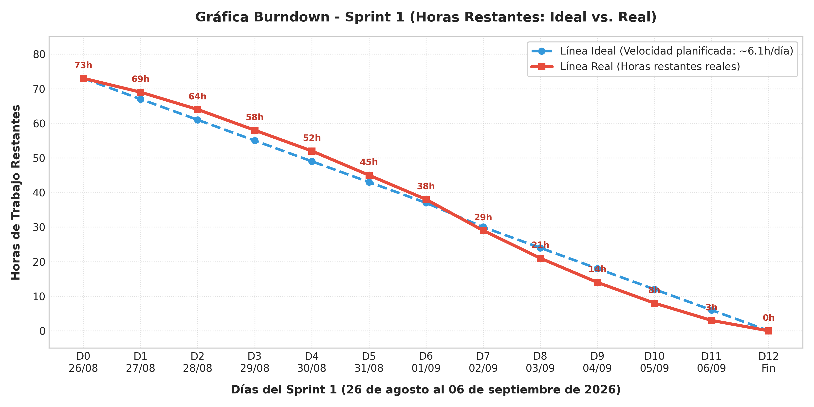

```text
Horas
 80 |  [●] (D0: 73h ideal / 73h real)
 70 |     \  [*] (D1: 69h)  <-- Configuración y wireframes de psicólogos
 60 |      \    [*] (D2: 64h) [*] (D3: 58h)
 50 |       \          [*] (D4: 52h)
 40 |        \               [*] (D5: 45h)  [*] (D6: 38h)
 30 |         \                     [*] (D7: 29h) <-- Cruce por debajo de ideal
 20 |          \                           [*] (D8: 21h)  [*] (D9: 14h)
 10 |           \                                  [*] (D10: 8h)
  0 +------------\---------------------------------------[*] (D11: 3h / D12: 0h)
    D0   D1   D2   D3   D4   D5   D6   D7   D8   D9   D10  D11  D12
    
    Leyenda:  (\) Línea Ideal (Celeste: ~6.1h/día)    [*] Línea Real (Roja)
```

**Interpretación y análisis del Burndown:**
* **Días 1 al 6:** El sprint mantuvo un avance cercano a la línea ideal con ligera holgura mientras se consolidaban los endpoints de disponibilidad y expediente de pacientes.
* **Días 7 al 12:** A partir del 2 de septiembre, el equipo aceleró el cierre de agenda y teleconsulta, resolviendo la concurrencia en citas y la sala Jitsi, logrando extinguir la totalidad de las horas pendientes hacia el día final.

---

### 4.6.2 Gráfica Burnup (Tareas Completadas vs. Alcance Total)
El **Burnup Chart** muestra el avance acumulativo de las **15 tareas terminadas (*Done*)** (NRO 19 al 33) respecto al alcance total comprometido para el Sprint 1.

**Datos acumulados de progreso (Burnup - Sprint 1):**

| Día | Fecha | Alcance Total (Tareas) | Tareas Terminadas (Done) | % Avance Acumulado | Estado del Sprint |
| :---: | :---: | :---: | :---: | :---: | :--- |
| **Día 0** | 26/08 | 15 | 0 | 0% | Planificación inicial del Sprint 1 |
| **Día 1** | 27/08 | 15 | 1 | 7% | Diseñar interfaz de psicólogos (SP1-19) |
| **Día 2** | 28/08 | 15 | 2 | 13% | Pruebas de psicólogos (SP1-21) |
| **Día 3** | 29/08 | 15 | 3 | 20% | Diseñar interfaz de pacientes (SP1-22) |
| **Día 4** | 30/08 | 15 | 5 | 33% | Backend psicólogos y pruebas pacientes (SP1-20, SP1-24) |
| **Día 5** | 31/08 | 15 | 7 | 47% | Backend pacientes y diseño Dashboard (SP1-23, SP1-25) |
| **Día 6** | 01/09 | 15 | 8 | 53% | Diseñar interfaz de agenda y citas (SP1-28) |
| **Día 7** | 02/09 | 15 | 10 | 67% | Dashboard KPIs y pruebas de Dashboard (SP1-26, SP1-27) |
| **Día 8** | 03/09 | 15 | 11 | 73% | Diseñar interfaz videoconferencias (SP1-31) |
| **Día 9** | 04/09 | 15 | 13 | 87% | Backend citas y pruebas de agenda (SP1-29, SP1-30) |
| **Día 10** | 05/09 | 15 | 14 | 93% | Integración de videoconferencias Jitsi (SP1-32) |
| **Día 11** | 06/09 | 15 | 15 | 100% | Pruebas finales de teleconsulta con PO (SP1-33) |
| **Día 12** | 06/09 | 15 | 15 | 100% | Cierre formal y entrega del incremento |

<br>

**Representación visual del Gráfica Burnup:**

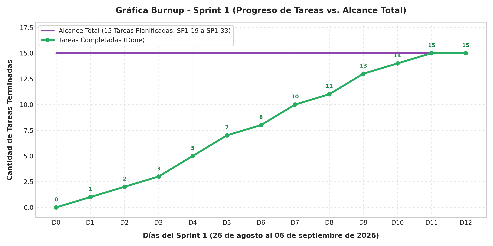

```text
Tareas
 15 |======================================================[●] (Meta Fija: 15 Tareas)
 14 |                                                [*] (D10: 14 tareas)
 13 |                                          [*] (D9: 13 tareas)
 10 |                                    [*] (D7: 10 tareas)
  8 |                              [*] (D6: 8 tareas)
  7 |                        [*] (D5: 7 tareas)
  5 |                  [*] (D4: 5 tareas)
  3 |            [*] (D3: 3 tareas)
  2 |      [*] (D2: 2 tareas)
  0 |-[*] (D0: 0)
    +----------------------------------------------------------
     D0   D1   D2   D3   D4   D5   D6   D7   D8   D9  D10  D11  D12
     
     Leyenda:  (===) Alcance Total Fijo (Morado)    [*] Tareas Completadas (Verde)
```

**Interpretación y análisis del Burnup:**
* El alcance se mantuvo exactamente en las 15 tareas comprometidas del Product Backlog (NRO 19 a 33) sin corrupción de alcance.
* La tasa de completitud promedio fue de 1.25 tareas por jornada, certificando el **100% de cumplimiento** el 06 de septiembre.

---

## 4.7 GRÁFICA DE ESFUERZO Y DATOS DE ESFUERZO

### 4.7.1 Datos de Esfuerzo por Tarea – Estimado vs. Real
En cumplimiento estricto con las directrices metodológicas, la siguiente tabla consolida las horas estimadas frente a las horas reales ejecutadas para las 15 tareas del Sprint Backlog (NRO 19 al 33), detallando la desviación individual y su causa técnica:

| NRO | ID | Tarea del Sprint Backlog (Product Backlog) | Horas Estimadas | Horas Reales | Desviación | Responsable | Causa de la Variación Técnica |
| :---: | :---: | :--- | :---: | :---: | :---: | :--- | :--- |
| **19** | **SP1-19** | Diseñar interfaz gestión psicólogos y perfiles | 4 hr | 4 hr | 0 hr | Julio Cesar Larrazabal | Prototipo validado rápidamente con el PO |
| **20** | **SP1-20** | Implementar psicólogos, especialidades y disponibilidad | 8 hr | 10 hr | +2 hr | Andy Mujica | Complejidad en lógica de franjas y validaciones |
| **21** | **SP1-21** | Realizar pruebas de la gestión de psicólogos | 3 hr | 3 hr | 0 hr | Rolando Velasco | Casos de prueba de número de colegiado y tarifas |
| **22** | **SP1-22** | Diseñar interfaz para la gestión de pacientes | 4 hr | 4 hr | 0 hr | Julio Cesar Larrazabal | Adaptación de formularios web y móviles en Figma |
| **23** | **SP1-23** | Implementar registro, actualización y consulta pacientes | 8 hr | 9 hr | +1 hr | Maria Ilse Romero | Validación condicional de tutor en menores de edad |
| **24** | **SP1-24** | Realizar pruebas de la gestión de pacientes | 3 hr | 3 hr | 0 hr | Esther Condori | Certificación de unicidad de CI por tenant |
| **25** | **SP1-25** | Diseñar interfaz del Dashboard administrativo y clínico | 4 hr | 4 hr | 0 hr | Julio Cesar Larrazabal | Distribución de tarjetas de KPIs y gráficos |
| **26** | **SP1-26** | Implementar Dashboard con indicadores y alertas | 8 hr | 9 hr | +1 hr | Maria Ilse Romero | Consultas agregadas con ORM en esquema tenant |
| **27** | **SP1-27** | Realizar pruebas del Dashboard e indicadores | 3 hr | 3 hr | 0 hr | Rolando Velasco | Verificación de filtros de fecha y cálculo de no-show |
| **28** | **SP1-28** | Diseñar interfaz para agenda y gestión de citas | 4 hr | 4 hr | 0 hr | Julio Cesar Larrazabal | Guías visuales de estado y vista semanal |
| **29** | **SP1-29** | Implementar reserva, cancelación y reprogramación citas | 8 hr | 10 hr | +2 hr | Andy Mujica | Concurrencia pesimista SELECT FOR UPDATE y deadlocks |
| **30** | **SP1-30** | Realizar pruebas de agenda y gestión de citas | 3 hr | 3 hr | 0 hr | Rolando Velasco | Pruebas de estrés y colisiones horarias |
| **31** | **SP1-31** | Diseñar interfaz para sesiones virtuales/teleconsulta | 3 hr | 3 hr | 0 hr | Julio Cesar Larrazabal | Contenedor responsivo y controles de llamada |
| **32** | **SP1-32** | Implementar integración de videoconferencias (Jitsi) | 7 hr | 8 hr | +1 hr | Alberto Caleb Delgado | Configuración de WebRTC y permisos de cámara en Android |
| **33** | **SP1-33** | Realizar pruebas de acceso y teleconsulta | 3 hr | 3 hr | 0 hr | Esther Condori | Verificación de conexión cruzada web-móvil |
| **TOTAL** | — | **Esfuerzo Total del Sprint 1** | **73 hr** | **80 hr** | **+7 hr (+9.6%)** | **Equipo SCRUM** | **Sobreesfuerzo controlado y absorbido** |

---

### 4.7.2 Gráfica Comparativa de Esfuerzo por Tarea
Se presenta el gráfico visual comparativo que integra en barras paralelas las horas estimadas (barra celeste) frente a las horas reales ejecutadas (barra naranja) para las 15 tareas del Sprint Backlog:

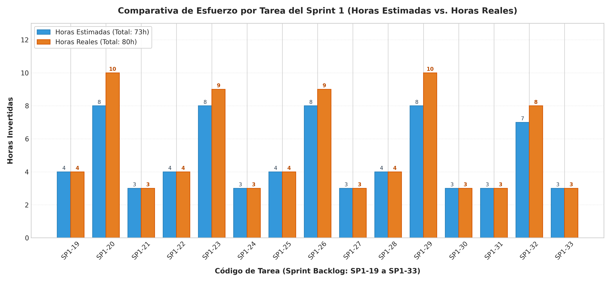

```text
Tarea    | Horas (E = Estimado [Celeste], R = Real [Naranja])
---------+------------------------------------------------------------------
SP1-19   | E: [████] 4h       | R: [████] 4h
SP1-20   | E: [████████] 8h   | R: [██████████] 10h (+2) <-- Franjas y validaciones
SP1-21   | E: [███] 3h        | R: [███] 3h
SP1-22   | E: [████] 4h       | R: [████] 4h
SP1-23   | E: [████████] 8h   | R: [█████████] 9h (+1)   <-- Regla tutores menores edad
SP1-24   | E: [███] 3h        | R: [███] 3h
SP1-25   | E: [████] 4h       | R: [████] 4h
SP1-26   | E: [████████] 8h   | R: [█████████] 9h (+1)   <-- Agregaciones ORM tenant
SP1-27   | E: [███] 3h        | R: [███] 3h
SP1-28   | E: [████] 4h       | R: [████] 4h
SP1-29   | E: [████████] 8h   | R: [██████████] 10h (+2) <-- Bloqueo SELECT FOR UPDATE
SP1-30   | E: [███] 3h        | R: [███] 3h
SP1-31   | E: [███] 3h        | R: [███] 3h
SP1-32   | E: [███████] 7h    | R: [████████] 8h (+1)    <-- Permisos WebRTC en móvil
SP1-33   | E: [███] 3h        | R: [███] 3h
---------+------------------------------------------------------------------
TOTAL    | Estimado: 73 horas | Real: 80 horas | Desviación: +7h (+9.6%)
```

**Conclusiones del análisis de esfuerzo del Sprint 1:**
1. **Control de variaciones:** La desviación total se situó en un **+9.6%** (7 horas sobre 73 planificadas), mostrando una notable mejora frente a la desviación del Sprint 0 (+14.5%).
2. **Puntos de concentración:** Las tareas técnicas de backend de disponibilidad (`SP1-20`), transacciones de citas (`SP1-29`) y soporte móvil WebRTC (`SP1-32`) representaron 5 de las 7 horas de holgura requerida.

---

## 4.8 SCRUM TASKBOARD

El Scrum Taskboard refleja el flujo de trabajo de las **15 tareas del Sprint 1** (NRO 19 al 33) a través de sus cuatro columnas de estado durante el ciclo de vida del proyecto:

#### Scrum Taskboard – Estado Final al Cierre del Sprint 1

| Product Backlog | Por hacer (To Do) | En progreso (Doing) | Terminado (Done) |
| :--- | :---: | :---: | :--- |
| **[SP1-19]** Diseñar interfaz gestión psicólogos | *(vacío)* | *(vacío)* | ✓ **SP1-19:** Diseño perfiles psicólogos *(Julio Larrazabal)* |
| **[SP1-20]** Implementar psicólogos y disponibilidad | *(vacío)* | *(vacío)* | ✓ **SP1-20:** Backend psicólogos y disponibilidad *(Andy Mujica)* |
| **[SP1-21]** Realizar pruebas gestión psicólogos | *(vacío)* | *(vacío)* | ✓ **SP1-21:** Pruebas psicólogos *(Rolando Velasco)* |
| **[SP1-22]** Diseñar interfaz gestión pacientes | *(vacío)* | *(vacío)* | ✓ **SP1-22:** Diseño UI pacientes *(Julio Larrazabal)* |
| **[SP1-23]** Implementar registro/consulta pacientes | *(vacío)* | *(vacío)* | ✓ **SP1-23:** Backend pacientes *(Maria Ilse Romero)* |
| **[SP1-24]** Realizar pruebas gestión pacientes | *(vacío)* | *(vacío)* | ✓ **SP1-24:** Pruebas pacientes *(Esther Condori)* |
| **[SP1-25]** Diseñar interfaz Dashboard KPIs | *(vacío)* | *(vacío)* | ✓ **SP1-25:** Diseño Dashboard *(Julio Larrazabal)* |
| **[SP1-26]** Implementar Dashboard indicadores | *(vacío)* | *(vacío)* | ✓ **SP1-26:** Dashboard indicadores *(Maria Ilse Romero)* |
| **[SP1-27]** Realizar pruebas del Dashboard | *(vacío)* | *(vacío)* | ✓ **SP1-27:** Pruebas Dashboard *(Rolando Velasco)* |
| **[SP1-28]** Diseñar interfaz agenda y citas | *(vacío)* | *(vacío)* | ✓ **SP1-28:** Diseño agenda y citas *(Julio Larrazabal)* |
| **[SP1-29]** Implementar reserva/cancelación citas | *(vacío)* | *(vacío)* | ✓ **SP1-29:** Motor backend citas *(Andy Mujica)* |
| **[SP1-30]** Realizar pruebas de agenda y citas | *(vacío)* | *(vacío)* | ✓ **SP1-30:** Pruebas agenda *(Rolando Velasco)* |
| **[SP1-31]** Diseñar interfaz sesiones virtuales | *(vacío)* | *(vacío)* | ✓ **SP1-31:** Diseño teleconsulta *(Julio Larrazabal)* |
| **[SP1-32]** Implementar integración Jitsi Meet | *(vacío)* | *(vacío)* | ✓ **SP1-32:** Teleconsulta WebRTC *(Alberto Caleb Delgado)* |
| **[SP1-33]** Realizar pruebas acceso teleconsulta | *(vacío)* | *(vacío)* | ✓ **SP1-33:** Pruebas teleconsulta PO *(Esther Condori)* |

<br>

**Resumen del Taskboard al cierre del Sprint 1:**
* **Total de tareas planificadas:** 15 tareas (100%).
* **Tareas en estado Por hacer (To Do):** 0 (0%).
* **Tareas en estado En progreso (Doing):** 0 (0%).
* **Tareas en estado Terminado (Done):** 15 (100%).
* **Porcentaje de completitud:** **100% de cumplimiento del Sprint Backlog**.
* **Incremento de software entregado:** Módulos de gestión de psicólogos y disponibilidad, expediente básico de pacientes (web y móvil Flutter), motor transaccional de citas sin colisiones, sala de teleconsulta en vivo con Jitsi Meet (WebRTC), Dashboard administrativo de KPIs y sistema de alertas tempranas de seguimiento clínico, todo operando bajo la arquitectura Multi-Tenant con esquemas PostgreSQL aislados y validado mediante pruebas funcionales aprobadas.


