# CAPÍTULO 6 – DESARROLLO SPRINT 2 (SIGEPSI)

> **Periodo oficial:** 10 de septiembre al 06 de octubre de 2026  
> **Defensa docente:** 06 y 08 de octubre de 2026  
> **Asignatura:** Sistemas-2 (S2-2026) – Grupo 9  
> **Proyecto:** SIGEPSI – Plataforma Web y Móvil de Gestión de Centros de Salud Mental  
> **Alcance técnico:** Historia Clínica Electrónica, Intake Digital, Notas SOAP, Seguimiento, Tareas, Consentimientos, Derivaciones y Asistente de IA Asistiva.

---

## Resumen Ejecutivo del Incremento

El presente documento detalla la planificación, arquitectura, desarrollo, pruebas y ceremonias del **Sprint 2** del proyecto SIGEPSI. Tras sentar las bases multi-tenant en el Sprint 0 y los módulos operativos de agenda y teleconsulta en el Sprint 1, el Sprint 2 entrega el núcleo clínico médico-legal: formulario previo e intake digital, historia clínica psicológica estructurada con catálogo CIE-10/11, notas de evolución SOAP con autoguardado, tareas terapéuticas inter-sesiones en Flutter, consentimientos informados con trazabilidad criptográfica SHA-256, protocolos de derivación médica a psiquiatría y un piloto asistivo de preconsulta (HU-35) con estricta supervisión humana.

> [!IMPORTANT]
> **Reasignación Cíclica de Roles y Tarea de Implementación de Romero:**  
> En conformidad con la directriz metodológica del Sprint 2, se aplicó un **desplazamiento cíclico de dos posiciones hacia arriba** en los roles SCRUM:  
> • **Romero Saavedra Maria Ilse:** Product Owner  
> • **Velasco Soliz Rolando:** Scrum Master  
> • **Condori Diaz Marilyn Esther:** Development Team  
> • **Delgado Rojas Alberto Caleb:** Development Team  
> • **Mujica Vallejos Andy Mauricio:** Development Team  
> • **Larrazabal Rojas Julio Cesar:** Development Team  

---

## 6.1 SPRINT PLANNING

### 6.1.1 Objetivos del Sprint 2

Al concluir el Sprint 2, el equipo entrega un incremento potencialmente desplegable que comprende:

1. **Formulario Previo e Intake Digital (Web y Móvil):** Cuestionario pre-consulta para recabar motivo, malestar percibido (1-5), síntomas y antecedentes.
2. **Historia Clínica Psicológica Electrónica (Web):** Expediente longitudinal con anamnesis, examen mental, diagnóstico CIE-10/11 y plan terapéutico.
3. **Control de Acceso RBAC Clínico (Web y Backend):** Aislamiento estricto que restringe expedientes exclusivamente a los psicólogos tratantes asignados (`IsTreatingPsychologistOrAdmin`).
4. **Notas de Sesión Clínicas (Modelo SOAP):** Editor de 4 cuadrantes con autoguardado en local storage cada 30 segundos y vinculación inmutable a citas.
5. **Evolución Longitudinal y Tareas Inter-Sesiones (Web y Móvil):** Registro de hitos, alertas por retroceso y módulo de ejercicios con reporte en Flutter.
6. **Consentimientos Informados Digitales (Web y Móvil):** Formalización legal con sellado SHA-256, captura de IP, timestamp y canvas de firma táctil.
7. **Protocolos de Cierre y Derivación Médica:** Altas terapéuticas con archivo seguro y órdenes de interconsulta hacia Psiquiatría en PDF.
8. **Asistente de IA Asistiva para Preconsulta (HU-35):** Resumen estructurado neutral y categorización heurística con supervisión humana obligatoria.

#### Casos de Uso Contemplados en el Sprint 2

| ID CU | Descripción del Caso de Uso | Estado | Móvil | Web | Sprint | Requisitos Funcionales Asociados |
| :---: | :--- | :---: | :---: | :---: | :---: | :--- |
| **CU14** | Gestionar formulario previo a la consulta (Intake Digital) | Implementado | X | X | SP2 | RF-08, RF-09 |
| **CU15** | Gestionar historia clínica psicológica electrónica | Implementado |  | X | SP2 | RF-22, RF-29 |
| **CU16** | Registrar y gestionar notas de sesión (Modelo SOAP) | Implementado |  | X | SP2 | RF-23 |
| **CU17** | Gestionar evolución longitudinal, tareas y seguimiento | Implementado | X | X | SP2 | RF-24, RF-25 |
| **CU18** | Gestionar consentimientos informados y autorizaciones | Implementado | X | X | SP2 | RF-28, RF-29 |
| **CU19** | Gestionar protocolo de cierre y derivación a Psiquiatría | Implementado |  | X | SP2 | RF-22 |
| **HU35** | Asistente de revisión asistiva de preconsulta (Piloto IA) | Implementado | X | X | SP2 | RF-08, RF-09, RF-29 |

#### Cronograma Oficial de Hitos y Actividades

| Hito / Actividad | Fecha de Inicio | Fecha de Fin | Duración | Estado |
| :--- | :---: | :---: | :---: | :---: |
| Planificación y Refinamiento del Sprint 2 (Sprint Planning) | 10 de septiembre de 2026 | 11 de septiembre de 2026 | 2 días | **Concluido** |
| Diseño UI/UX (Figma), Matriz de Riesgos y Modelado de BD | 11 de septiembre de 2026 | 15 de septiembre de 2026 | 5 días | **Concluido** |
| Desarrollo Backend (Django REST) & Pasarela Segura de IA | 15 de septiembre de 2026 | 26 de septiembre de 2026 | 12 días | **Concluido** |
| Desarrollo Frontend Web (Angular 17) & Móvil (Flutter 3.x) | 18 de septiembre de 2026 | 30 de septiembre de 2026 | 13 días | **Concluido** |
| Pruebas de Calidad (QA), Caja Negra, RBAC, Privacidad e Integración | 01 de octubre de 2026 | 04 de octubre de 2026 | 4 días | **Concluido** |
| Revisión del Sprint (Sprint Review) & Acta de Aceptación Formal | 05 de octubre de 2026 | 05 de octubre de 2026 | 1 día | **Concluido** |
| Retrospectiva del Sprint (Sprint Retrospective) | 05 de octubre de 2026 | 05 de octubre de 2026 | 1 día | **Concluido** |
| Entrega Documental Formal y Congelamiento Técnico | 06 de octubre de 2026 | 06 de octubre de 2026 | 1 día | **Concluido** |
| Presentación y Defensa del Sprint 2 ante el Docente | 06 de octubre de 2026 | 08 de octubre de 2026 | 2 días | **Programado** |

---

### 6.1.2 Historias de Usuario del Sprint 2

La estimación se realizó mediante **Planning Poker** (Fibonacci: 1, 2, 3, 5, 8, 13). El sprint reúne 13 Historias de Usuario con un total de **68 PHU**.

#### Resumen de Historias de Usuario del Sprint 2

| ID | Título de la Historia de Usuario | CU | RF | Rol Principal | PHU | Responsables de Implementación |
| :---: | :--- | :---: | :---: | :---: | :---: | :--- |
| **HU-23** | Configuración y revisión de formulario previo digital (Intake) en Web | CU14 | RF-08, RF-09 | Psicólogo / Paciente | 5 PHU | Mujica Vallejos Andy / Larrazabal Julio |
| **HU-24** | Diligenciamiento de formulario previo a la consulta en App Móvil | CU14 | RF-08, RF-09 | Psicólogo / Paciente | 5 PHU | Delgado Rojas Alberto Caleb |
| **HU-25** | Apertura y estructura de Historia Clínica Psicológica en Web | CU15 | RF-22 | Psicólogo / Paciente | 8 PHU | Larrazabal Rojas Julio / Mujica Andy |
| **HU-26** | Control de acceso y confidencialidad clínica (RBAC Clínico) en Web | CU15 | RF-29 | Psicólogo / Paciente | 5 PHU | Velasco Soliz Rolando / Mujica Andy |
| **HU-27** | Registro de notas de sesión estructuradas (Modelo SOAP) en Web | CU16 | RF-23 | Psicólogo / Paciente | 5 PHU | Condori Diaz Marilyn / Larrazabal Julio |
| **HU-28** | Registro de evolución longitudinal y acuerdos terapéuticos en Web | CU17 | RF-23 | Psicólogo / Paciente | 5 PHU | Condori Diaz Marilyn / Larrazabal Julio |
| **HU-29** | Asignación y gestión de tareas inter-sesiones en Web | CU17 | RF-24 | Psicólogo / Paciente | 5 PHU | Condori Diaz Marilyn / Mujica Andy |
| **HU-30** | Visualización y reporte de avance de tareas en App Móvil | CU17 | RF-25 | Psicólogo / Paciente | 5 PHU | Delgado Rojas Alberto Caleb |
| **HU-31** | Configuración y emisión de consentimientos informados en Web | CU18 | RF-28, RF-29 | Psicólogo / Paciente | 5 PHU | Larrazabal Rojas Julio / Condori Marilyn |
| **HU-32** | Lectura y aceptación digital trazable de consentimientos en App Móvil | CU18 | RF-28 | Psicólogo / Paciente | 5 PHU | Delgado Rojas Alberto Caleb |
| **HU-33** | Protocolo de cierre de caso y alta terapéutica en Web | CU19 | RF-22 | Psicólogo / Paciente | 5 PHU | Condori Diaz Marilyn / Romero Maria |
| **HU-34** | Derivación interna y referencia médica externa a Psiquiatría en Web | CU19 | RF-22 | Psicólogo / Paciente | 5 PHU | Condori Diaz Marilyn / Romero Maria |
| **HU-35** | Asistente de revisión de preconsulta con priorización asistiva (Piloto IA) | CU14 | RF-08, RF-09, RF-29 | Psicólogo / Paciente | 5 PHU | Romero Saavedra Maria / Mujica Andy / Larrazabal Julio |
| **TOTAL** | **Esfuerzo Planificado Sprint 2 (13 Historias de Usuario)** | — | — | — | **68 PHU** | **Equipo SCRUM (6 integrantes)** |

#### Detalle de Historias de Usuario (Tarjetas 3C en Formato Oficial)

##### HU-23: Configuración y revisión de formulario previo digital (Intake) en Web

| **Campo** | **Especificación Oficial** |
| :--- | :--- |
| **ID y Título** | **HU-23**: Configuración y revisión de formulario previo digital (Intake) en Web *(CU14, RF-08, RF-09)* |
| **Descripción (Card)** | Como Psicólogo o Administrador, quiero configurar cuestionarios de pre-consulta y revisar las respuestas de los pacientes antes de la primera sesión, para conocer el motivo de consulta, urgencia percibida y antecedentes relevantes. |
| **Prioridad / Estimación** | Prioridad: **Alta** &nbsp;\|&nbsp; Estimación Planning Poker: **5 PHU** |
| **Criterios de Aceptación (Confirmation BDD)** | • **a)** Dado que soy Psicólogo autenticado, cuando accedo a la ficha de un paciente con formulario completado, el sistema muestra las respuestas organizadas: Motivo, Síntomas Frecuentes, Escala de Malestar (1-5) y Antecedentes.<br>• **b)** Dado que un paciente no ha completado el cuestionario a menos de 24 horas de la cita, cuando se visualiza la agenda, el sistema muestra la etiqueta de alerta 'Formulario Pendiente'.<br>• **c)** Dado que el Administrador edita las preguntas institucionales, cuando agrega campos de texto libre o escalas Likert, el backend valida dinámicamente el esquema JSONB. |
| **Desarrollador a Cargo** | Mujica Vallejos Andy / Larrazabal Julio |
| **Prototipo UI** | Pantalla Revisión de Intake Clínico (Web) |
| **Prompt para IA (Generación UI)** | *"UI/UX desktop web design for clinical intake and pre-consultation review screen in mental health SaaS SIGEPSI, Angular 17. Clean healthcare light mode. Patient summary badge, structured response cards for Motivo Principal, Escala de Malestar Emocional (Level 4/5 in amber), Síntomas Reportados tags. Figma UI, 4k."* |

##### HU-24: Diligenciamiento de formulario previo a la consulta en App Móvil

| **Campo** | **Especificación Oficial** |
| :--- | :--- |
| **ID y Título** | **HU-24**: Diligenciamiento de formulario previo a la consulta en App Móvil *(CU14, RF-08, RF-09)* |
| **Descripción (Card)** | Como Paciente con cita agendada, quiero completar el formulario previo desde la app móvil Flutter paso a paso, para brindar información clínica a mi terapeuta antes de la sesión. |
| **Prioridad / Estimación** | Prioridad: **Alta** &nbsp;\|&nbsp; Estimación Planning Poker: **5 PHU** |
| **Criterios de Aceptación (Confirmation BDD)** | • **a)** Dado que tengo una cita programada y abro la app Flutter, cuando presiono 'Completar formulario previo', la app despliega un stepper interactivo con barra de avance porcentual.<br>• **b)** Dado que omito un campo obligatorio, cuando presiono 'Siguiente', el campo se resalta en rojo y se bloquea el paso indicando el error.<br>• **c)** Dado que envío el formulario completo, cuando el backend responde HTTP 201 Created, la app bloquea futuras ediciones y muestra la confirmación de entrega. |
| **Desarrollador a Cargo** | Delgado Rojas Alberto Caleb |
| **Prototipo UI** | Asistente Paso a Paso Formulario Previo (Flutter) |
| **Prompt para IA (Generación UI)** | *"Mobile application UI design for patient pre-consultation intake stepper form in Flutter 3 on iPhone 15 Pro for SIGEPSI. Pastel mint and lavender palette. Progress bar 'Paso 2 de 4 (50%)', radio list for frequency, emotional distress slider 1-5, and rounded bottom button 'Continuar'. 4k Figma mockup."* |

##### HU-25: Apertura y estructura de Historia Clínica Psicológica en Web

| **Campo** | **Especificación Oficial** |
| :--- | :--- |
| **ID y Título** | **HU-25**: Apertura y estructura de Historia Clínica Psicológica en Web *(CU15, RF-22)* |
| **Descripción (Card)** | Como Psicólogo tratante, quiero abrir y estructurar el expediente clínico electrónico (anamnesis, examen mental, diagnóstico CIE-10/11 y objetivos terapéuticos), para contar con un documento médico-legal riguroso. |
| **Prioridad / Estimación** | Prioridad: **Alta** &nbsp;\|&nbsp; Estimación Planning Poker: **8 PHU** |
| **Criterios de Aceptación (Confirmation BDD)** | • **a)** Dado que soy el terapeuta asignado, cuando abro la historia clínica, el sistema habilita pestañas estructuradas: Anamnesis, Examen Mental, Diagnóstico CIE y Plan Terapéutico.<br>• **b)** Dado que busco un diagnóstico, cuando ingreso texto o código (ej. 'F41.1'), el sistema consulta el catálogo CIE indexado por trigramas y permite clasificarlo como presuntivo o confirmado.<br>• **c)** Dado que guardo cambios, el backend persiste el registro con firma digital del profesional, marca de tiempo y número correlativo único de expediente en el tenant. |
| **Desarrollador a Cargo** | Larrazabal Rojas Julio / Mujica Andy |
| **Prototipo UI** | Expediente e Historia Clínica Electrónica (Web) |
| **Prompt para IA (Generación UI)** | *"UI/UX desktop web screen for Electronic Psychological Health Record in SIGEPSI, Angular 17. Clean clinical layout, soft neutral tones. Header card showing code 'HC-2026-0042', primary therapist, status badge. Horizontal tabs: Anamnesis, Examen Mental, Diagnóstico CIE-10 search combo, Plan Terapéutico. 4k Figma UI."* |

##### HU-26: Control de acceso y confidencialidad clínica (RBAC Clínico) en Web

| **Campo** | **Especificación Oficial** |
| :--- | :--- |
| **ID y Título** | **HU-26**: Control de acceso y confidencialidad clínica (RBAC Clínico) en Web *(CU15, RF-29)* |
| **Descripción (Card)** | Como Administrador o Psicólogo, quiero que el sistema restrinja estrictamente el acceso a las historias clínicas según la relación directa terapeuta-paciente, para asegurar la confidencialidad médico-legal. |
| **Prioridad / Estimación** | Prioridad: **Alta** &nbsp;\|&nbsp; Estimación Planning Poker: **5 PHU** |
| **Criterios de Aceptación (Confirmation BDD)** | • **a)** Dado que un terapeuta intenta acceder a un paciente no asignado, cuando realiza la petición GET, el backend responde HTTP 403 Forbidden y audita el evento no autorizado.<br>• **b)** Dado que un usuario con rol Recepcionista busca al paciente, solo visualiza agenda y datos de contacto, manteniéndose ocultos diagnósticos y notas SOAP.<br>• **c)** Dado que el Director Clínico audita un caso derivado con privilegios de supervisión, el sistema permite lectura y registra fecha, hora, usuario e IP. |
| **Desarrollador a Cargo** | Velasco Soliz Rolando / Mujica Andy |
| **Prototipo UI** | Matriz de Permisos Clínicos y Bloqueo de Acceso (Web) |
| **Prompt para IA (Generación UI)** | *"UI/UX web screen displaying access restriction and clinical RBAC permission boundary in SIGEPSI. Security alert modal 'Acceso Restringido: Expediente Clínico Protegido'. Secondary button 'Volver a mi Directorio'. Bottom log badge 'Auditoría: Intento registrado con IP y Token'. Modern healthcare UX, 4k Figma mockup."* |

##### HU-27: Registro de notas de sesión estructuradas (Modelo SOAP) en Web

| **Campo** | **Especificación Oficial** |
| :--- | :--- |
| **ID y Título** | **HU-27**: Registro de notas de sesión estructuradas (Modelo SOAP) en Web *(CU16, RF-23)* |
| **Descripción (Card)** | Como Psicólogo tratante, quiero registrar notas estructuradas tras cada consulta bajo el modelo clínico SOAP (Subjetivo, Objetivo, Análisis, Plan), para documentar la evolución técnica. |
| **Prioridad / Estimación** | Prioridad: **Alta** &nbsp;\|&nbsp; Estimación Planning Poker: **5 PHU** |
| **Criterios de Aceptación (Confirmation BDD)** | • **a)** Dado que una cita concluye como realizada, cuando presiono 'Redactar Nota SOAP', el sistema despliega el editor de 4 cuadrantes clínicos diferenciados.<br>• **b)** Dado que transcurren 30 segundos de inactividad durante la redacción, el editor realiza un guardado automático local para evitar pérdidas por desconexión.<br>• **c)** Dado que firmo la nota, el sistema la vincula inmutablemente a la cita correspondiente y la añade a la línea de tiempo del expediente. |
| **Desarrollador a Cargo** | Condori Diaz Marilyn / Larrazabal Julio |
| **Prototipo UI** | Editor de Notas Clínicas SOAP (Web) |
| **Prompt para IA (Generación UI)** | *"UI/UX desktop web interface of a clinical progress note editor using SOAP methodology for SIGEPSI mental health system, Angular 17. Four card sections: S - Subjetivo, O - Objetivo, A - Análisis, P - Plan. Action buttons: 'Guardar Borrador' and primary 'Firmar y Consolidar Nota'. Figma UI, 4k."* |

##### HU-28: Registro de evolución longitudinal y acuerdos terapéuticos en Web

| **Campo** | **Especificación Oficial** |
| :--- | :--- |
| **ID y Título** | **HU-28**: Registro de evolución longitudinal y acuerdos terapéuticos en Web *(CU17, RF-23)* |
| **Descripción (Card)** | Como Psicólogo, quiero documentar la evolución periódica del paciente (avance, estancamiento o retroceso) y los compromisos acordados, para evaluar objetivamente la intervención. |
| **Prioridad / Estimación** | Prioridad: **Alta** &nbsp;\|&nbsp; Estimación Planning Poker: **5 PHU** |
| **Criterios de Aceptación (Confirmation BDD)** | • **a)** Dado que registro un hito evaluativo, el sistema solicita clasificar el estado (Progreso, Estable, Estancamiento, Retroceso/Crisis) con justificación cualitativa obligatoria.<br>• **b)** Dado que se marca 'Retroceso / Crisis', el sistema emite una alerta prioritaria visible en el Dashboard clínico del terapeuta y coordinador.<br>• **c)** Dado que consulto el historial evolutivo, el sistema renderiza una línea de tiempo vertical con hitos, notas clínicas y fechas clave. |
| **Desarrollador a Cargo** | Condori Diaz Marilyn / Larrazabal Julio |
| **Prototipo UI** | Línea de Tiempo de Evolución Clínica (Web) |
| **Prompt para IA (Generación UI)** | *"UI/UX dashboard component for longitudinal clinical evolution in SIGEPSI, Angular 17. Top summary metric bar: Total Sesiones (8), Estado Global ('Progreso Positivo'). Center vertical timeline with session nodes and status badges: green for 'Avance', amber for 'Estabilidad'. 4k Figma mockup."* |

##### HU-29: Asignación y gestión de tareas inter-sesiones en Web

| **Campo** | **Especificación Oficial** |
| :--- | :--- |
| **ID y Título** | **HU-29**: Asignación y gestión de tareas inter-sesiones en Web *(CU17, RF-24)* |
| **Descripción (Card)** | Como Psicólogo, quiero asignar tareas terapéuticas entre sesiones con fecha límite, categoría y guías adjuntas, para que el paciente practique técnicas fuera de consulta. |
| **Prioridad / Estimación** | Prioridad: **Alta** &nbsp;\|&nbsp; Estimación Planning Poker: **5 PHU** |
| **Criterios de Aceptación (Confirmation BDD)** | • **a)** Dado que selecciono 'Nueva Tarea', puedo definir título, descripción, categoría (Conductual, Cognitiva, Mindfulness) y fecha límite de entrega.<br>• **b)** Dado que adjunto una plantilla en PDF a la tarea, el sistema la almacena de forma segura y la sincroniza con la app móvil del paciente.<br>• **c)** Dado que el paciente envía su reporte, el terapeuta puede visualizar reflexiones, calificar la adherencia y retroalimentar en sesión. |
| **Desarrollador a Cargo** | Condori Diaz Marilyn / Mujica Andy |
| **Prototipo UI** | Gestor de Asignación de Tareas Terapéuticas (Web) |
| **Prompt para IA (Generación UI)** | *"UI/UX web screen for therapist assignment of inter-session therapeutic tasks in SIGEPSI, Angular 17. Clean light theme. Creation modal: category dropdown, date picker for deadline, PDF attachment box. List of assigned homework with status pills (Pendiente, Enviado, Revisado). 4k Figma UI."* |

##### HU-30: Visualización y reporte de avance de tareas en App Móvil

| **Campo** | **Especificación Oficial** |
| :--- | :--- |
| **ID y Título** | **HU-30**: Visualización y reporte de avance de tareas en App Móvil *(CU17, RF-25)* |
| **Descripción (Card)** | Como Paciente autenticado en Flutter, quiero consultar mis tareas asignadas, marcar su avance y enviar notas reflexivas a mi terapeuta, para mantener la adherencia al tratamiento. |
| **Prioridad / Estimación** | Prioridad: **Alta** &nbsp;\|&nbsp; Estimación Planning Poker: **5 PHU** |
| **Criterios de Aceptación (Confirmation BDD)** | • **a)** Dado que abro la sección 'Mis Tareas' en Flutter, visualizo los ejercicios ordenados por fecha límite con distintivos de estado.<br>• **b)** Dado que presiono 'Reportar Cumplimiento', la app permite ingresar texto de autorreflexión y calificar la dificultad percibida en escala 1-5.<br>• **c)** Dado que confirmo el envío, la tarea pasa a estado 'Completada', se actualiza el porcentaje de logro y se notifica al terapeuta. |
| **Desarrollador a Cargo** | Delgado Rojas Alberto Caleb |
| **Prototipo UI** | Mis Tareas Terapéuticas y Reporte Móvil (Flutter) |
| **Prompt para IA (Generación UI)** | *"Mobile app UI screen for patient therapeutic homework list and progress submission in Flutter 3 for SIGEPSI. Pastel teal aesthetic. Weekly completion badge (75%), task cards with due dates. Modal with reflection notes, difficulty slider, and 'Enviar a mi Psicólogo'. 4k Figma mockup."* |

##### HU-31: Configuración y emisión de consentimientos informados en Web

| **Campo** | **Especificación Oficial** |
| :--- | :--- |
| **ID y Título** | **HU-31**: Configuración y emisión de consentimientos informados en Web *(CU18, RF-28, RF-29)* |
| **Descripción (Card)** | Como Administrador, quiero configurar plantillas de consentimiento informado (atención general, telepsicología, tratamiento de datos sensibles y menores), para emitir documentos legales trazables. |
| **Prioridad / Estimación** | Prioridad: **Alta** &nbsp;\|&nbsp; Estimación Planning Poker: **5 PHU** |
| **Criterios de Aceptación (Confirmation BDD)** | • **a)** Dado que edito plantillas legales, puedo utilizar variables dinámicas ({nombre_paciente}, {ci}, {centro}, {psicologo}) con vista previa en tiempo real.<br>• **b)** Dado que el paciente es menor de 18 años, el sistema selecciona automáticamente la plantilla legal obligatoria para apoderados/tutores.<br>• **c)** Dado que se aprueba una nueva versión del texto legal, el sistema registra el número de versión (v1.0, v1.1) y la vincula a futuros registros. |
| **Desarrollador a Cargo** | Larrazabal Rojas Julio / Condori Marilyn |
| **Prototipo UI** | Gestor de Plantillas de Consentimiento Informado (Web) |
| **Prompt para IA (Generación UI)** | *"UI/UX desktop web design for administrative management of psychological informed consent templates in SIGEPSI, Angular 17. Left sidebar with templates list, center rich text editor with variables tags ({PACIENTE_NOMBRE}), right version history table. 4k Figma UI."* |

##### HU-32: Lectura y aceptación digital trazable de consentimientos en App Móvil

| **Campo** | **Especificación Oficial** |
| :--- | :--- |
| **ID y Título** | **HU-32**: Lectura y aceptación digital trazable de consentimientos en App Móvil *(CU18, RF-28)* |
| **Descripción (Card)** | Como Paciente o Tutor, quiero leer el consentimiento informado en la app móvil, firmar en canvas táctil y aceptar las cláusulas, para formalizar mi tratamiento con validez legal. |
| **Prioridad / Estimación** | Prioridad: **Alta** &nbsp;\|&nbsp; Estimación Planning Poker: **5 PHU** |
| **Criterios de Aceptación (Confirmation BDD)** | • **a)** Dado que inicio sesión sin consentimiento firmado, la app móvil presenta el documento con scroll obligatorio previo a la firma.<br>• **b)** Dado que marco los checkboxes obligatorios y firmo en el canvas táctil, la app calcula el hash SHA-256 del texto y envía firma, IP y timestamp.<br>• **c)** Dado que el backend procesa la petición, valida la integridad criptográfica, genera el PDF sellado y habilita las citas en el sistema. |
| **Desarrollador a Cargo** | Delgado Rojas Alberto Caleb |
| **Prototipo UI** | Lectura y Firma de Consentimiento Digital (Flutter) |
| **Prompt para IA (Generación UI)** | *"Mobile application UI design for patient digital informed consent signing screen in Flutter 3 for SIGEPSI. Scrollable legal document viewer, mandatory checkmarks, signature canvas box 'Dibuje su firma aquí', and primary emerald button 'Firmar y Aceptar'. 4k Figma mockup."* |

##### HU-33: Protocolo de cierre de caso y alta terapéutica en Web

| **Campo** | **Especificación Oficial** |
| :--- | :--- |
| **ID y Título** | **HU-33**: Protocolo de cierre de caso y alta terapéutica en Web *(CU19, RF-22)* |
| **Descripción (Card)** | Como Psicólogo tratante, quiero formalizar el cierre del proceso terapéutico (alta por objetivos, mutuo acuerdo o deserción), para emitir el resumen de egreso y archivar el expediente. |
| **Prioridad / Estimación** | Prioridad: **Alta** &nbsp;\|&nbsp; Estimación Planning Poker: **5 PHU** |
| **Criterios de Aceptación (Confirmation BDD)** | • **a)** Dado que concluye el tratamiento, cuando selecciono 'Cerrar Caso', el sistema solicita motivo de egreso, logros alcanzados y recomendaciones de mantenimiento.<br>• **b)** Dado que se formaliza el alta, el sistema bloquea la creación de citas ordinarias para el paciente sin previa reactivación formal.<br>• **c)** Dado que se consulta el expediente egresado, el sistema conserva de manera inmutable todo el historial de sesiones y diagnósticos para fines médico-legales. |
| **Desarrollador a Cargo** | Condori Diaz Marilyn / Romero Maria |
| **Prototipo UI** | Protocolo de Cierre de Caso y Resumen de Alta (Web) |
| **Prompt para IA (Generación UI)** | *"UI/UX desktop web screen for psychological case closure and discharge protocol in SIGEPSI, Angular 17. Closure reason selector 'Alta Terapéutica por Objetivos', text areas for logros alcanzados and prevención de recaídas. Button 'Formalizar Alta y Archivar'. 4k Figma UI."* |

##### HU-34: Derivación interna y referencia médica externa a Psiquiatría en Web

| **Campo** | **Especificación Oficial** |
| :--- | :--- |
| **ID y Título** | **HU-34**: Derivación interna y referencia médica externa a Psiquiatría en Web *(CU19, RF-22)* |
| **Descripción (Card)** | Como Psicólogo, quiero emitir una orden de derivación interna (por especialidad) o referencia médica externa (a Psiquiatría para soporte farmacológico), para asegurar la continuidad asistencial ante psicopatologías complejas. |
| **Prioridad / Estimación** | Prioridad: **Alta** &nbsp;\|&nbsp; Estimación Planning Poker: **5 PHU** |
| **Criterios de Aceptación (Confirmation BDD)** | • **a)** Dado que identifico riesgo o necesidad psicofarmacológica severa, cuando elijo 'Derivar a Psiquiatría', el sistema requiere motivo clínico, sintomatología y nivel de urgencia médica.<br>• **b)** Dado que confirmo la orden, el sistema genera la hoja formal de interconsulta en PDF con sello del profesional y notifica de inmediato al Coordinador Clínico.<br>• **c)** Dado que la derivación es interna hacia otro psicólogo del centro, el sistema transfiere de forma segura el expediente notificando al nuevo terapeuta asignado. |
| **Desarrollador a Cargo** | Condori Diaz Marilyn / Romero Maria |
| **Prototipo UI** | Módulo de Derivación Clínica Interna y Externa (Web) |
| **Prompt para IA (Generación UI)** | *"UI/UX desktop web screen for clinical referral and psychiatric interconsultation in SIGEPSI, Angular 17. Header 'Orden de Derivación Clínica'. Radio toggle: Derivación Interna vs Referencia Externa a Psiquiatría. Inputs for motivo farmacológico, síntomas predominantes, riesgo alto. 4k Figma UI."* |

##### HU-35: Asistente de revisión de preconsulta con priorización asistiva (Piloto IA)

| **Campo** | **Especificación Oficial** |
| :--- | :--- |
| **ID y Título** | **HU-35**: Asistente de revisión de preconsulta con priorización asistiva (Piloto IA) *(CU14, RF-08, RF-09, RF-29)* |
| **Descripción (Card)** | Como Psicólogo tratante, quiero recibir un resumen estructurado neutral y una priorización asistiva de las respuestas del formulario pre-consulta, para preparar la primera sesión con agilidad, manteniendo siempre el juicio clínico y la decisión exclusivamente en mis manos. |
| **Prioridad / Estimación** | Prioridad: **Alta** &nbsp;\|&nbsp; Estimación Planning Poker: **5 PHU** |
| **Criterios de Aceptación (Confirmation BDD)** | • **a)** Dado que existe consentimiento informado activo del paciente, cuando el psicólogo solicita el análisis pre-consulta, el sistema presenta un borrador con etiqueta visible 'Borrador IA — Requiere Revisión Profesional'.<br>• **b)** Dado que el motor asistivo marca un nivel de urgencia o síntoma clave, el sistema muestra la explicación transparente y las reglas clínicas explícitas que motivaron la marca.<br>• **c)** Dado que el psicólogo revisa el borrador, puede editarlo, aceptarlo o descartarlo; cualquier acción genera una entrada de auditoría inmutable con fecha, usuario, versión de reglas y decisión adoptada.<br>• **d)** Dado que no existe consentimiento del paciente o el servicio asistivo falla, el sistema bloquea el procesamiento automático, informa el estado y mantiene el flujo clínico manual al 100%.<br>• **e)** Las pruebas de seguridad y DoD confirman que bajo ninguna circunstancia se guardan diagnósticos presuntivos ni recomendaciones terapéuticas de forma automática en la historia clínica. |
| **Desarrollador a Cargo** | Romero Saavedra Maria / Mujica Andy / Larrazabal Julio |
| **Prototipo UI** | Panel Asistente de Preconsulta con Borrador y Explicación (Web) |
| **Prompt para IA (Generación UI)** | *"UI/UX desktop web screen for clinical AI-assisted pre-consultation review in SIGEPSI, Angular 17. Prominent banner: 'Borrador IA — Requiere Revisión Profesional'. Structured cards: Resumen Neutral de Respuestas, Priorización Sugerida (Nivel 4 Moderado-Alto) with expandable tooltip showing explicit rules. Action buttons: 'Editar', 'Descartar' and primary 'Aceptar e Incorporar a Expediente'. 4k Figma UI mockup."* |

---

### 6.1.3 Contexto del Sistema

#### Diagrama de Casos de Uso del Sprint 2 (Modelo Incremental Acumulado)

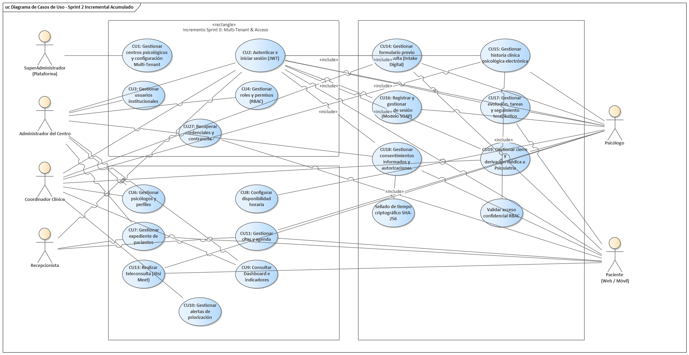

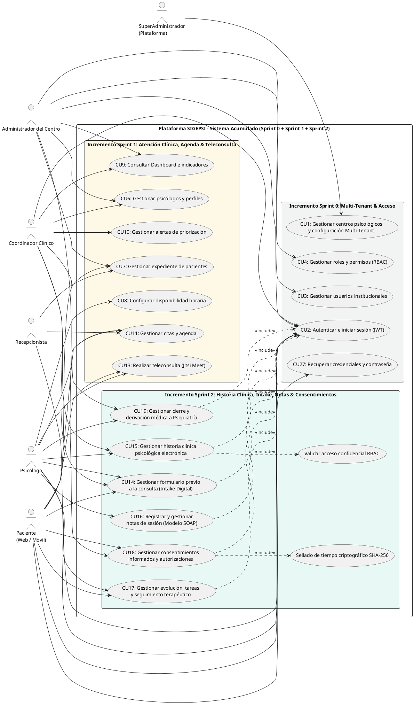
```plantuml
@startuml
left to right direction
skinparam packageStyle rectangle
skinparam shadowing false
skinparam roundcorner 8
skinparam defaultFontName Arial

actor "SuperAdministrador\n(Plataforma)" as superadmin
actor "Administrador del Centro" as admin
actor "Coordinador Clínico" as coord
actor "Psicólogo" as psyc
actor "Recepcionista" as recep
actor "Paciente\n(Web / Móvil)" as patient

rectangle "Plataforma SIGEPSI - Sistema Acumulado (Sprint 0 + Sprint 1 + Sprint 2)" {

  rectangle "Incremento Sprint 0: Multi-Tenant & Acceso" #F2F4F4 {
    usecase "CU1: Gestionar centros psicológicos\ny configuración Multi-Tenant" as CU1
    usecase "CU2: Autenticar e iniciar sesión (JWT)" as CU2
    usecase "CU3: Gestionar usuarios institucionales" as CU3
    usecase "CU4: Gestionar roles y permisos (RBAC)" as CU4
    usecase "CU27: Recuperar credenciales y contraseña" as CU27
  }

  rectangle "Incremento Sprint 1: Atención Clínica, Agenda & Teleconsulta" #FEF9E7 {
    usecase "CU6: Gestionar psicólogos y perfiles" as CU6
    usecase "CU8: Configurar disponibilidad horaria" as CU8
    usecase "CU7: Gestionar expediente de pacientes" as CU7
    usecase "CU11: Gestionar citas y agenda" as CU11
    usecase "CU13: Realizar teleconsulta (Jitsi Meet)" as CU13
    usecase "CU9: Consultar Dashboard e indicadores" as CU9
    usecase "CU10: Gestionar alertas de priorización" as CU10
  }

  rectangle "Incremento Sprint 2: Historia Clínica, Intake, Notas & Consentimientos" #E8F8F5 {
    usecase "CU14: Gestionar formulario previo\na la consulta (Intake Digital)" as CU14
    usecase "CU15: Gestionar historia clínica\npsicológica electrónica" as CU15
    usecase "CU16: Registrar y gestionar\nnotas de sesión (Modelo SOAP)" as CU16
    usecase "CU17: Gestionar evolución, tareas\ny seguimiento terapéutico" as CU17
    usecase "CU18: Gestionar consentimientos\ninformados y autorizaciones" as CU18
    usecase "CU19: Gestionar cierre y\nderivación médica a Psiquiatría" as CU19

    usecase "Validar acceso confidencial RBAC" as val_rbac
    usecase "Sellado de tiempo criptográfico SHA-256" as val_hash
  }
}

' Asociaciones SuperAdmin
superadmin --> CU1

' Asociaciones Administrador del Centro
admin --> CU2
admin --> CU3
admin --> CU4
admin --> CU6
admin --> CU7
admin --> CU9
admin --> CU18

' Asociaciones Coordinador Clínico
coord --> CU2
coord --> CU6
coord --> CU9
coord --> CU10
coord --> CU14
coord --> CU15
coord --> CU19

' Asociaciones Psicólogo
psyc --> CU2
psyc --> CU8
psyc --> CU11
psyc --> CU13
psyc --> CU14
psyc --> CU15
psyc --> CU16
psyc --> CU17
psyc --> CU19

' Asociaciones Recepcionista
recep --> CU2
recep --> CU7
recep --> CU11

' Asociaciones Paciente (Web / Móvil)
patient --> CU2
patient --> CU27
patient --> CU7
patient --> CU11
patient --> CU13
patient --> CU14
patient --> CU17
patient --> CU18

' Inclusiones obligatorias
CU15 ..> val_rbac : <<include>>
CU18 ..> val_hash : <<include>>
CU14 ..> CU2 : <<include>>
CU15 ..> CU2 : <<include>>
CU16 ..> CU2 : <<include>>
CU17 ..> CU2 : <<include>>
CU18 ..> CU2 : <<include>>
CU19 ..> CU2 : <<include>>
@enduml
```

#### Diagrama de Clases del Dominio Clínico (Modelo Incremental Tenant)

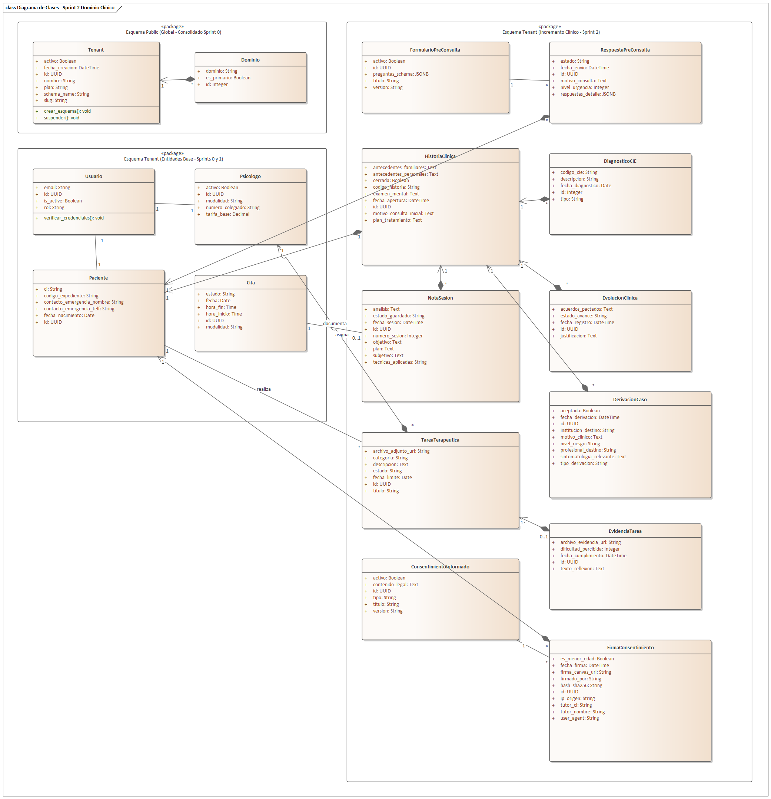

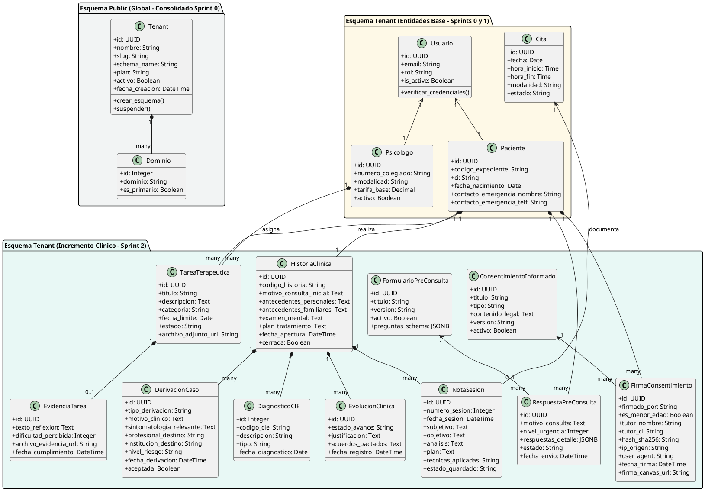
```plantuml
@startuml
skinparam classAttributeIconSize 0
skinparam shadowing false
skinparam roundcorner 8
skinparam defaultFontName Arial

package "Esquema Public (Global - Consolidado Sprint 0)" #F2F4F4 {
  class Tenant {
    + id: UUID
    + nombre: String
    + slug: String
    + schema_name: String
    + plan: String
    + activo: Boolean
    + fecha_creacion: DateTime
    + crear_esquema()
    + suspender()
  }

  class Dominio {
    + id: Integer
    + dominio: String
    + es_primario: Boolean
  }
}

package "Esquema Tenant (Entidades Base - Sprints 0 y 1)" #FEF9E7 {
  class Usuario {
    + id: UUID
    + email: String
    + rol: String
    + is_active: Boolean
    + verificar_credenciales()
  }

  class Psicologo {
    + id: UUID
    + numero_colegiado: String
    + modalidad: String
    + tarifa_base: Decimal
    + activo: Boolean
  }

  class Paciente {
    + id: UUID
    + codigo_expediente: String
    + ci: String
    + fecha_nacimiento: Date
    + contacto_emergencia_nombre: String
    + contacto_emergencia_telf: String
  }

  class Cita {
    + id: UUID
    + fecha: Date
    + hora_inicio: Time
    + hora_fin: Time
    + modalidad: String
    + estado: String
  }
}

package "Esquema Tenant (Incremento Clínico - Sprint 2)" #E8F8F5 {
  class FormularioPreConsulta {
    + id: UUID
    + titulo: String
    + version: String
    + activo: Boolean
    + preguntas_schema: JSONB
  }

  class RespuestaPreConsulta {
    + id: UUID
    + motivo_consulta: Text
    + nivel_urgencia: Integer
    + respuestas_detalle: JSONB
    + estado: String
    + fecha_envio: DateTime
  }

  class HistoriaClinica {
    + id: UUID
    + codigo_historia: String
    + motivo_consulta_inicial: Text
    + antecedentes_personales: Text
    + antecedentes_familiares: Text
    + examen_mental: Text
    + plan_tratamiento: Text
    + fecha_apertura: DateTime
    + cerrada: Boolean
  }

  class DiagnosticoCIE {
    + id: Integer
    + codigo_cie: String
    + descripcion: String
    + tipo: String
    + fecha_diagnostico: Date
  }

  class NotaSesion {
    + id: UUID
    + numero_sesion: Integer
    + fecha_sesion: DateTime
    + subjetivo: Text
    + objetivo: Text
    + analisis: Text
    + plan: Text
    + tecnicas_aplicadas: String
    + estado_guardado: String
  }

  class EvolucionClinica {
    + id: UUID
    + estado_avance: String
    + justificacion: Text
    + acuerdos_pactados: Text
    + fecha_registro: DateTime
  }

  class TareaTerapeutica {
    + id: UUID
    + titulo: String
    + descripcion: Text
    + categoria: String
    + fecha_limite: Date
    + estado: String
    + archivo_adjunto_url: String
  }

  class EvidenciaTarea {
    + id: UUID
    + texto_reflexion: Text
    + dificultad_percibida: Integer
    + archivo_evidencia_url: String
    + fecha_cumplimiento: DateTime
  }

  class ConsentimientoInformado {
    + id: UUID
    + titulo: String
    + tipo: String
    + contenido_legal: Text
    + version: String
    + activo: Boolean
  }

  class FirmaConsentimiento {
    + id: UUID
    + firmado_por: String
    + es_menor_edad: Boolean
    + tutor_nombre: String
    + tutor_ci: String
    + hash_sha256: String
    + ip_origen: String
    + user_agent: String
    + fecha_firma: DateTime
    + firma_canvas_url: String
  }

  class DerivacionCaso {
    + id: UUID
    + tipo_derivacion: String
    + motivo_clinico: Text
    + sintomatologia_relevante: Text
    + profesional_destino: String
    + institucion_destino: String
    + nivel_riesgo: String
    + fecha_derivacion: DateTime
    + aceptada: Boolean
  }
}

' Relaciones
Tenant "1" *-- "many" Dominio

Usuario "1" <-- "1" Psicologo
Usuario "1" <-- "1" Paciente

Paciente "1" *-- "1" HistoriaClinica
HistoriaClinica "1" *-- "many" DiagnosticoCIE
HistoriaClinica "1" *-- "many" NotaSesion
HistoriaClinica "1" *-- "many" EvolucionClinica
HistoriaClinica "1" *-- "many" DerivacionCaso

Cita "1" <-- "0..1" NotaSesion : documenta
Paciente "1" *-- "many" RespuestaPreConsulta
FormularioPreConsulta "1" <-- "many" RespuestaPreConsulta

Psicologo "1" *-- "many" TareaTerapeutica : asigna
Paciente "1" *-- "many" TareaTerapeutica : realiza
TareaTerapeutica "1" *-- "0..1" EvidenciaTarea

ConsentimientoInformado "1" <-- "many" FirmaConsentimiento
Paciente "1" *-- "many" FirmaConsentimiento
@enduml
```

#### Diagramas de Actividad de Flujos Críticos

##### 1. Flujo de Diligenciamiento de Formulario Previo y Apertura de Historia Clínica

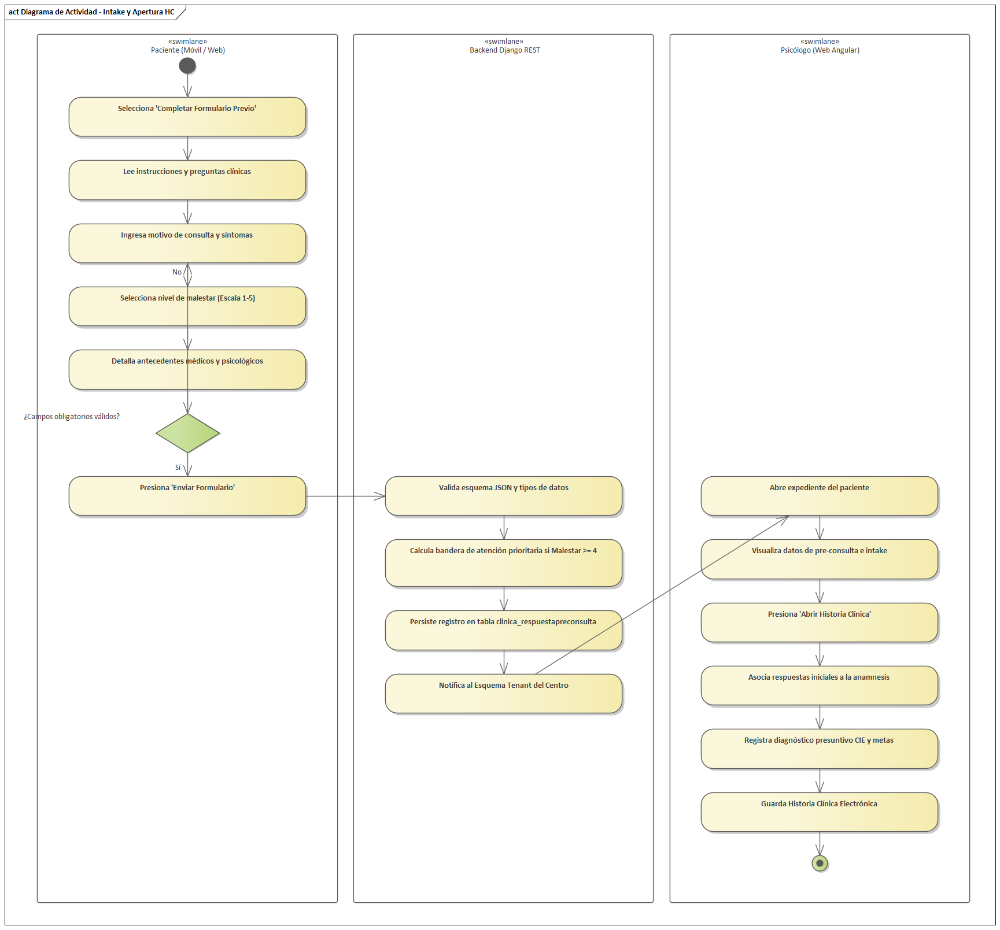

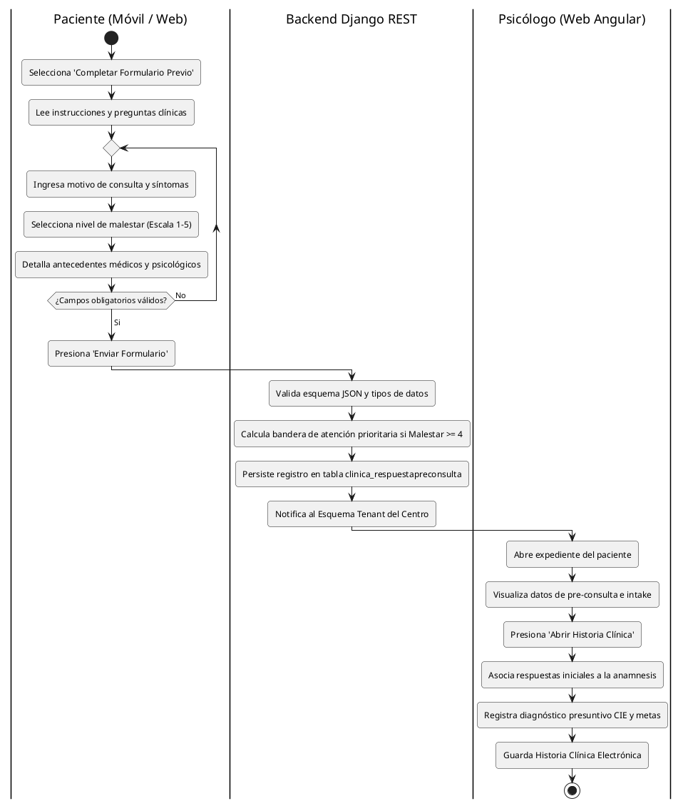
```plantuml
@startuml
skinparam shadowing false
skinparam roundcorner 8
skinparam defaultFontName Arial

|Paciente (Móvil / Web)|
start
:Selecciona 'Completar Formulario Previo';
:Lee instrucciones y preguntas clínicas;
repeat
  :Ingresa motivo de consulta y síntomas;
  :Selecciona nivel de malestar (Escala 1-5);
  :Detalla antecedentes médicos y psicológicos;
repeat while (¿Campos obligatorios válidos?) is (No)
->Si;
:Presiona 'Enviar Formulario';

|Backend Django REST|
:Valida esquema JSON y tipos de datos;
:Calcula bandera de atención prioritaria si Malestar >= 4;
:Persiste registro en tabla clinica_respuestapreconsulta;
:Notifica al Esquema Tenant del Centro;

|Psicólogo (Web Angular)|
:Abre expediente del paciente;
:Visualiza datos de pre-consulta e intake;
:Presiona 'Abrir Historia Clínica';
:Asocia respuestas iniciales a la anamnesis;
:Registra diagnóstico presuntivo CIE y metas;
:Guarda Historia Clínica Electrónica;
stop
@enduml
```

##### 2. Ciclo de Tareas Terapéuticas Inter-Sesiones

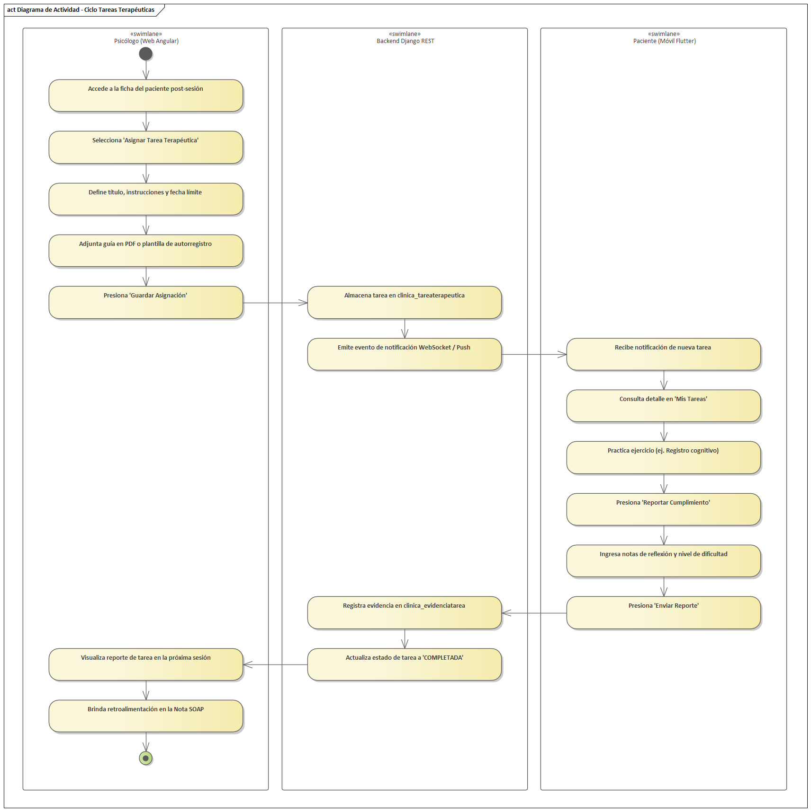

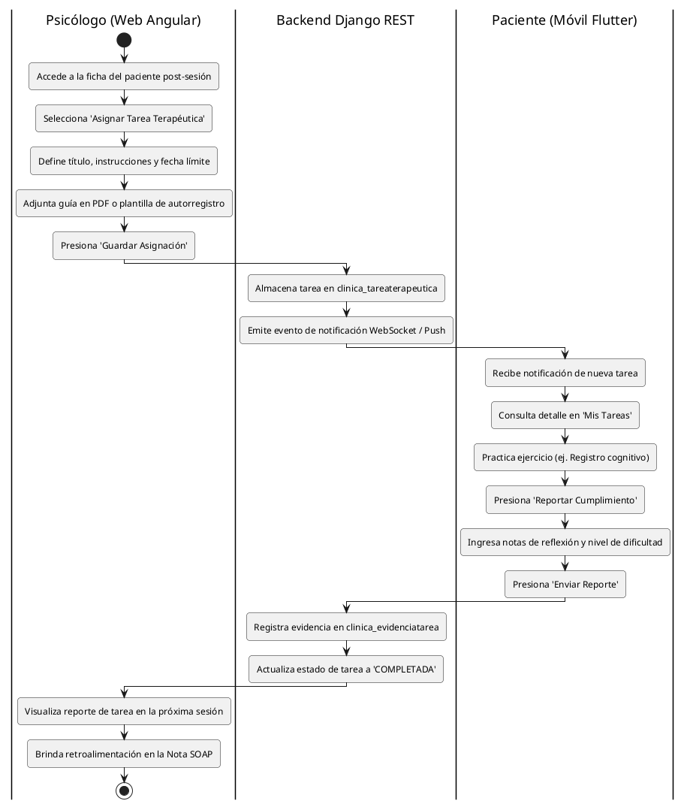
```plantuml
@startuml
skinparam shadowing false
skinparam roundcorner 8
skinparam defaultFontName Arial

|Psicólogo (Web Angular)|
start
:Accede a la ficha del paciente post-sesión;
:Selecciona 'Asignar Tarea Terapéutica';
:Define título, instrucciones y fecha límite;
:Adjunta guía en PDF o plantilla de autorregistro;
:Presiona 'Guardar Asignación';

|Backend Django REST|
:Almacena tarea en clinica_tareaterapeutica;
:Emite evento de notificación WebSocket / Push;

|Paciente (Móvil Flutter)|
:Recibe notificación de nueva tarea;
:Consulta detalle en 'Mis Tareas';
:Practica ejercicio (ej. Registro cognitivo);
:Presiona 'Reportar Cumplimiento';
:Ingresa notas de reflexión y nivel de dificultad;
:Presiona 'Enviar Reporte';

|Backend Django REST|
:Registra evidencia en clinica_evidenciatarea;
:Actualiza estado de tarea a 'COMPLETADA';

|Psicólogo (Web Angular)|
:Visualiza reporte de tarea en la próxima sesión;
:Brinda retroalimentación en la Nota SOAP;
stop
@enduml
```

##### 3. Protocolo de Derivación Médica Externa a Psiquiatría

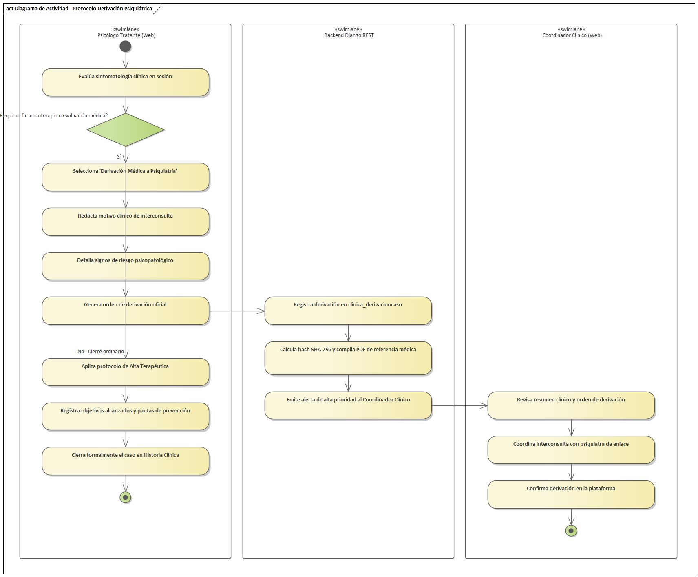

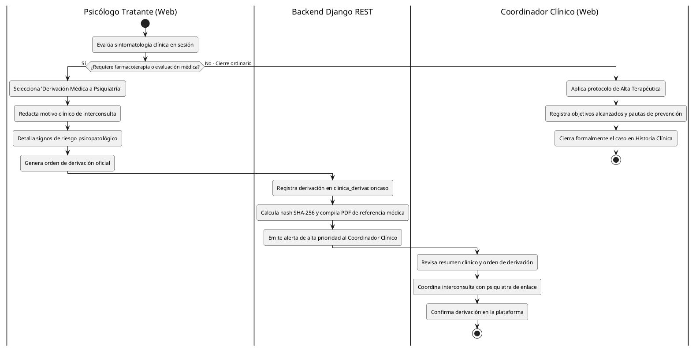
```plantuml
@startuml
skinparam shadowing false
skinparam roundcorner 8
skinparam defaultFontName Arial

|Psicólogo Tratante (Web)|
start
:Evalúa sintomatología clínica en sesión;
if (¿Requiere farmacoterapia o evaluación médica?) then (Sí)
  :Selecciona 'Derivación Médica a Psiquiatría';
  :Redacta motivo clínico de interconsulta;
  :Detalla signos de riesgo psicopatológico;
  :Genera orden de derivación oficial;
  
  |Backend Django REST|
  :Registra derivación en clinica_derivacioncaso;
  :Calcula hash SHA-256 y compila PDF de referencia médica;
  :Emite alerta de alta prioridad al Coordinador Clínico;
  
  |Coordinador Clínico (Web)|
  :Revisa resumen clínico y orden de derivación;
  :Coordina interconsulta con psiquiatra de enlace;
  :Confirma derivación en la plataforma;
  stop
else (No - Cierre ordinario)
  :Aplica protocolo de Alta Terapéutica;
  :Registra objetivos alcanzados y pautas de prevención;
  :Cierra formalmente el caso en Historia Clínica;
  stop
endif
@enduml
```

---

### 6.1.4 Sprint Backlog (21 Tareas Técnicas – 99 Horas)

El Sprint Backlog se compone de 21 tareas técnicas (14 tareas base = 65h, 6 tareas de IA = 29h, y la tarea de implementación SP2-54 de Romero = 5h). Total: **99 horas**.

| Nro | ID Tarea | Descripción Técnica | Categoría | Tipo | Est. | Responsable Asignado | Estado |
| :---: | :---: | :--- | :---: | :---: | :---: | :--- | :---: |
| 34 | **SP2-34** | Diseñar interfaz de formulario previo (Web administrativa y App Móvil) | Base | Diseño | 4 hr | Larrazabal Rojas Julio Cesar | **Terminado** |
| 35 | **SP2-35** | Implementar backend y API REST de formulario previo con esquema JSONB | Base | Desarrollo | 8 hr | Mujica Vallejos Andy Mauricio | **Terminado** |
| 36 | **SP2-36** | Pruebas funcionales y de caja negra de formulario previo | Base | Pruebas | 3 hr | Velasco Soliz Rolando | **Terminado** |
| 37 | **SP2-37** | Diseñar interfaz de historia clínica electrónica y control de acceso | Base | Diseño | 4 hr | Larrazabal Rojas Julio Cesar | **Terminado** |
| 38 | **SP2-38** | Implementar backend, modelos de historia clínica y catálogo CIE indexado | Base | Desarrollo | 8 hr | Mujica Vallejos Andy Mauricio | **Terminado** |
| 39 | **SP2-39** | Pruebas de integridad, confidencialidad y control RBAC clínico | Base | Pruebas | 3 hr | Velasco Soliz Rolando | **Terminado** |
| 40 | **SP2-40** | Diseñar interfaz de notas SOAP, evolución longitudinal y tareas | Base | Diseño | 4 hr | Larrazabal Rojas Julio Cesar | **Terminado** |
| 41 | **SP2-41** | Implementar registro estructurado de notas SOAP, seguimiento y tareas | Base | Desarrollo | 8 hr | Condori Diaz Marilyn Esther | **Terminado** |
| 42 | **SP2-42** | Pruebas funcionales del módulo de notas SOAP, acuerdos y tareas | Base | Pruebas | 3 hr | Velasco Soliz Rolando | **Terminado** |
| 43 | **SP2-43** | Diseñar interfaz de gestión y firma de consentimientos (Web y Móvil) | Base | Diseño | 3 hr | Larrazabal Rojas Julio Cesar | **Terminado** |
| 44 | **SP2-44** | Implementar consentimientos digitales con sello SHA-256 y canvas táctil | Base | Desarrollo | 6 hr | Delgado Rojas Alberto Caleb | **Terminado** |
| 45 | **SP2-45** | Validación de integridad y trazabilidad legal de consentimientos | Base | Pruebas | 2 hr | Condori Diaz Marilyn Esther | **Terminado** |
| 46 | **SP2-46** | Implementar cierre de caso, alta terapéutica y derivación a Psiquiatría | Base | Desarrollo | 6 hr | Condori Diaz Marilyn Esther | **Terminado** |
| 47 | **SP2-47** | Pruebas de aceptación de cierre de casos, altas y derivaciones | Base | Aceptación | 3 hr | Romero Saavedra Maria Ilse | **Terminado** |
| 48 | **SP2-48** | Refinar HU-35, criterios de aceptación, reglas de no uso y salvaguardas | Piloto IA | Refinamiento | 2 hr | Romero Saavedra Maria Ilse | **Terminado** |
| 49 | **SP2-49** | Definir consentimiento, vocabulario de prioridad y validación clínica | Piloto IA | Análisis | 4 hr | Condori Diaz Marilyn Esther | **Terminado** |
| 50 | **SP2-50** | Construir pasarela de IA con minimización de datos, RBAC y auditoría | Piloto IA | Desarrollo | 8 hr | Mujica Vallejos Andy Mauricio | **Terminado** |
| 51 | **SP2-51** | Implementar vista web de borrador asistivo, explicación y revisión humana | Piloto IA | Desarrollo | 5 hr | Larrazabal Rojas Julio Cesar | **Terminado** |
| 52 | **SP2-52** | Implementar estados móviles de consentimiento y aviso asistivo en Flutter | Piloto IA | Desarrollo | 5 hr | Delgado Rojas Alberto Caleb | **Terminado** |
| 53 | **SP2-53** | Ejecutar pruebas de privacidad, fallos, regresión y rechazo de salidas IA | Piloto IA | Pruebas | 5 hr | Velasco Soliz Rolando | **Terminado** |
| 54 | **SP2-54** | Implementar motor de reglas clínicas de priorización y categorización asistiva de preconsulta | Implementación Romero | Desarrollo | 5 hr | Romero Saavedra Maria Ilse | **Terminado** |
| — | **TOTAL** | **Esfuerzo Total Planificado del Sprint 2** | — | — | **99 hr** | **Equipo SCRUM (6 Integrantes)** | **Terminado** |

---

### 6.1.5 Equipo SCRUM del Sprint 2

| Pos. | Integrante | Rol SCRUM | Especialidad en el Sprint 2 | Tareas Asignadas | Horas Plan. |
| :---: | :--- | :--- | :--- | :---: | :---: |
| 1 | **Romero Saavedra Maria Ilse** | **Product Owner** | Gestión del Backlog, Criterios de Aceptación Clínicos e Implementación de Reglas Clínicas | `SP2-47, SP2-48, SP2-54` | **10 hr** |
| 2 | **Velasco Soliz Rolando** | **Scrum Master** | Facilitación Ágil, Remoción de Impedimentos, Aseguramiento de Calidad (QA) & Seguridad RBAC | `SP2-36, SP2-39, SP2-42, SP2-53` | **14 hr** |
| 3 | **Condori Diaz Marilyn Esther** | **Development Team** | Lógica de Negocio Clínica, Notas SOAP, Protocolos de Cierre/Derivación & Salvaguardas IA | `SP2-41, SP2-45, SP2-46, SP2-49` | **20 hr** |
| 4 | **Delgado Rojas Alberto Caleb** | **Development Team** | Desarrollo Móvil (Flutter 3.x), Interfaz Táctil, Criptografía SHA-256 & Consentimiento Digital | `SP2-44, SP2-52` | **11 hr** |
| 5 | **Mujica Vallejos Andy Mauricio** | **Development Team** | Backend (Django REST 5.x), Modelado PostgreSQL Multi-Tenant, Catálogo CIE & Pasarela IA | `SP2-35, SP2-38, SP2-50` | **24 hr** |
| 6 | **Larrazabal Rojas Julio Cesar** | **Development Team** | Diseño UI/UX (Figma), Frontend Web (Angular 17 Standalone), Formularios Reactivos & Vistas IA | `SP2-34, SP2-37, SP2-40, SP2-43, SP2-51` | **20 hr** |

---

## 6.2 PROCESO/PATRÓN DE DESARROLLO POR HISTORIA DE USUARIO

### 6.2.1 Diseño

#### 6.2.1.1 Diseño de la Arquitectura (3 Capas Multi-Tenant & Pasarela IA)


La arquitectura mantiene el aislamiento estricto por esquemas sobre PostgreSQL 16 con `django-tenants`. La capa móvil (Flutter 3.x) interactúa vía HTTPS/TLS 1.3 con tokens JWT con expiración controlada. Se incorpora una pasarela segura de IA con minimización de datos personales y bitácora criptográfica.


##### 6.2.1.1.1 Modelos de Arquitectura C4 del Sistema (Niveles 1 al 4)

Siguiendo el estándar C4 (Contexto, Contenedores, Componentes y Despliegue), se formaliza la arquitectura en cuatro niveles de abstracción:

###### C4 Nivel 1: Diagrama de Contexto del Sistema (System Context)


Delimita las interacciones entre los actores humanos (Psicólogo Clínico, Paciente y Administrador) y los sistemas tecnológicos externos (Google Gemini 1.5 Pro / Vertex AI, FCM Push, Twilio SMS y Cloud S3 Object Storage).

###### C4 Nivel 2: Diagrama de Contenedores (Containers)


Descompone el sistema en sus unidades de ejecución: Aplicación Web Angular 17 SPA, App Móvil Flutter 3.x, API Backend Django 5.x / DRF, Workers Asíncronos Celery & Beat, Base de Datos Relacional PostgreSQL 16 y Broker / Caché Redis 7.

###### C4 Nivel 3: Diagrama de Componentes (Backend DRF)


Modela los componentes internos del Backend: Auth & Tenant Guard, ViewSets controladores clínicos (Intake, SOAP, Tareas), Capa de Servicio de IA con Filtro PII Sanitizer, Motor de Despacho de Emergencias y Repositorios ORM Multi-Tenant.

###### C4 Nivel 4: Diagrama de Despliegue en Producción (Deployment)


Mapea los contenedores sobre la infraestructura cloud: Zona perimetral CDN/WAF Cloudflare con TLS 1.3, clúster de servidores Linux Docker Compose (Nginx, Gunicorn/Uvicorn, Celery) y servicios administrados de alta disponibilidad (AWS RDS PostgreSQL y Redis Cluster).

#### 6.2.1.2 Diseño de Datos (Modelo Relacional DDL en PostgreSQL 16)

```sql
-- ============================================================================
-- PLATAFORMA SIGEPSI - GESTIÓN DE CENTROS DE SALUD MENTAL
-- MODELO DE DATOS FÍSICO DDL - POSTGRESQL 16 (ARQUITECTURA MULTI-TENANT)
-- INCREMENTO CLÍNICO SPRINT 2 (EJECUTADO DENTRO DEL ESQUEMA TENANT)
-- ============================================================================

-- 1. Formulario Pre-Consulta e Intake Digital
CREATE TABLE IF NOT EXISTS clinica_formulariopreconsulta (
    id UUID PRIMARY KEY DEFAULT gen_random_uuid(),
    titulo VARCHAR(150) NOT NULL,
    version VARCHAR(20) NOT NULL DEFAULT 'v1.0',
    descripcion TEXT,
    preguntas_schema JSONB NOT NULL DEFAULT '[]'::jsonb,
    activo BOOLEAN NOT NULL DEFAULT TRUE,
    fecha_creacion TIMESTAMP WITH TIME ZONE DEFAULT CURRENT_TIMESTAMP,
    fecha_actualizacion TIMESTAMP WITH TIME ZONE DEFAULT CURRENT_TIMESTAMP
);

CREATE TABLE IF NOT EXISTS clinica_respuestapreconsulta (
    id UUID PRIMARY KEY DEFAULT gen_random_uuid(),
    formulario_id UUID NOT NULL REFERENCES clinica_formulariopreconsulta(id) ON DELETE RESTRICT,
    paciente_id UUID NOT NULL REFERENCES clinica_paciente(id) ON DELETE CASCADE,
    cita_id UUID REFERENCES agenda_cita(id) ON DELETE SET NULL,
    motivo_consulta TEXT NOT NULL,
    sintomas_principales TEXT,
    nivel_urgencia_percibido SMALLINT NOT NULL CHECK (nivel_urgencia_percibido BETWEEN 1 AND 5),
    antecedentes_medicos TEXT,
    antecedentes_psiquiatricos TEXT,
    medicacion_actual TEXT,
    respuestas_detalle JSONB NOT NULL DEFAULT '{}'::jsonb,
    estado VARCHAR(20) NOT NULL DEFAULT 'ENVIADO' CHECK (estado IN ('ENVIADO', 'REVISADO', 'ARCHIVADO')),
    fecha_envio TIMESTAMP WITH TIME ZONE DEFAULT CURRENT_TIMESTAMP
);

-- 2. Historia Clínica Psicológica Electrónica
CREATE TABLE IF NOT EXISTS clinica_historiaclinica (
    id UUID PRIMARY KEY DEFAULT gen_random_uuid(),
    paciente_id UUID UNIQUE NOT NULL REFERENCES clinica_paciente(id) ON DELETE CASCADE,
    psicologo_apertura_id UUID NOT NULL REFERENCES clinica_psicologo(id) ON DELETE RESTRICT,
    codigo_historia VARCHAR(50) UNIQUE NOT NULL,
    motivo_consulta_inicial TEXT NOT NULL,
    antecedentes_personales TEXT,
    antecedentes_familiares TEXT,
    historia_evolutiva TEXT,
    examen_mental_inicial TEXT,
    plan_tratamiento TEXT,
    cerrada BOOLEAN NOT NULL DEFAULT FALSE,
    fecha_apertura TIMESTAMP WITH TIME ZONE DEFAULT CURRENT_TIMESTAMP,
    fecha_cierre TIMESTAMP WITH TIME ZONE,
    fecha_actualizacion TIMESTAMP WITH TIME ZONE DEFAULT CURRENT_TIMESTAMP
);

CREATE TABLE IF NOT EXISTS clinica_diagnosticocie (
    id SERIAL PRIMARY KEY,
    historia_clinica_id UUID NOT NULL REFERENCES clinica_historiaclinica(id) ON DELETE CASCADE,
    codigo_cie VARCHAR(20) NOT NULL,
    descripcion VARCHAR(255) NOT NULL,
    tipo VARCHAR(20) NOT NULL DEFAULT 'PRESUNTIVO' CHECK (tipo IN ('PRESUNTIVO', 'CONFIRMADO', 'DIFERENCIAL')),
    observaciones TEXT,
    fecha_diagnostico DATE NOT NULL DEFAULT CURRENT_DATE
);

-- 3. Notas de Sesión Clínicas (Modelo SOAP)
CREATE TABLE IF NOT EXISTS clinica_notasesion (
    id UUID PRIMARY KEY DEFAULT gen_random_uuid(),
    historia_clinica_id UUID NOT NULL REFERENCES clinica_historiaclinica(id) ON DELETE CASCADE,
    cita_id UUID UNIQUE REFERENCES agenda_cita(id) ON DELETE SET NULL,
    psicologo_id UUID NOT NULL REFERENCES clinica_psicologo(id) ON DELETE RESTRICT,
    numero_sesion INTEGER NOT NULL CHECK (numero_sesion > 0),
    fecha_sesion TIMESTAMP WITH TIME ZONE DEFAULT CURRENT_TIMESTAMP,
    subjetivo TEXT NOT NULL,
    objetivo TEXT NOT NULL,
    analisis TEXT NOT NULL,
    plan TEXT NOT NULL,
    tecnicas_aplicadas VARCHAR(255),
    conducta_observada TEXT,
    estado_guardado VARCHAR(20) NOT NULL DEFAULT 'FIRMADA' CHECK (estado_guardado IN ('BORRADOR', 'FIRMADA', 'EDITADA')),
    fecha_creacion TIMESTAMP WITH TIME ZONE DEFAULT CURRENT_TIMESTAMP
);

-- 4. Evolución Longitudinal y Acuerdos
CREATE TABLE IF NOT EXISTS clinica_evolucionclinica (
    id UUID PRIMARY KEY DEFAULT gen_random_uuid(),
    historia_clinica_id UUID NOT NULL REFERENCES clinica_historiaclinica(id) ON DELETE CASCADE,
    nota_sesion_id UUID REFERENCES clinica_notasesion(id) ON DELETE SET NULL,
    estado_avance VARCHAR(30) NOT NULL CHECK (estado_avance IN ('PROGRESO_NOTABLE', 'EN_PROCESO', 'ESTANCAMIENTO', 'RETROCESO_CRISIS')),
    justificacion TEXT NOT NULL,
    acuerdos_pactados TEXT,
    fecha_registro TIMESTAMP WITH TIME ZONE DEFAULT CURRENT_TIMESTAMP
);

-- 5. Tareas Terapéuticas Inter-Sesiones y Evidencias
CREATE TABLE IF NOT EXISTS clinica_tareaterapeutica (
    id UUID PRIMARY KEY DEFAULT gen_random_uuid(),
    historia_clinica_id UUID NOT NULL REFERENCES clinica_historiaclinica(id) ON DELETE CASCADE,
    psicologo_id UUID NOT NULL REFERENCES clinica_psicologo(id) ON DELETE RESTRICT,
    paciente_id UUID NOT NULL REFERENCES clinica_paciente(id) ON DELETE CASCADE,
    titulo VARCHAR(150) NOT NULL,
    descripcion TEXT NOT NULL,
    categoria VARCHAR(50) NOT NULL DEFAULT 'COGNITIVA' CHECK (categoria IN ('COGNITIVA', 'CONDUCTUAL', 'MINDFULNESS', 'AUTOREGISTRO', 'OTRA')),
    fecha_limite DATE NOT NULL,
    estado VARCHAR(20) NOT NULL DEFAULT 'PENDIENTE' CHECK (estado IN ('PENDIENTE', 'EN_REVISION', 'COMPLETADA', 'VENCIDA', 'NO_REALIZADA')),
    archivo_adjunto_url VARCHAR(255),
    fecha_creacion TIMESTAMP WITH TIME ZONE DEFAULT CURRENT_TIMESTAMP
);

CREATE TABLE IF NOT EXISTS clinica_evidenciatarea (
    id UUID PRIMARY KEY DEFAULT gen_random_uuid(),
    tarea_id UUID UNIQUE NOT NULL REFERENCES clinica_tareaterapeutica(id) ON DELETE CASCADE,
    texto_reflexion TEXT NOT NULL,
    dificultad_percibida SMALLINT NOT NULL CHECK (dificultad_percibida BETWEEN 1 AND 5),
    archivo_evidencia_url VARCHAR(255),
    fecha_cumplimiento TIMESTAMP WITH TIME ZONE DEFAULT CURRENT_TIMESTAMP
);

-- 6. Consentimientos Informados y Firmas Digitales
CREATE TABLE IF NOT EXISTS clinica_consentimientoinformado (
    id UUID PRIMARY KEY DEFAULT gen_random_uuid(),
    titulo VARCHAR(150) NOT NULL,
    tipo VARCHAR(50) NOT NULL CHECK (tipo IN ('ATENCION_GENERAL', 'TELEPSICOLOGIA', 'MENORES_EDAD', 'DATOS_SENSIBLES')),
    contenido_legal TEXT NOT NULL,
    version VARCHAR(20) NOT NULL DEFAULT 'v1.0',
    activo BOOLEAN NOT NULL DEFAULT TRUE,
    fecha_creacion TIMESTAMP WITH TIME ZONE DEFAULT CURRENT_TIMESTAMP
);

CREATE TABLE IF NOT EXISTS clinica_firmaconsentimiento (
    id UUID PRIMARY KEY DEFAULT gen_random_uuid(),
    consentimiento_id UUID NOT NULL REFERENCES clinica_consentimientoinformado(id) ON DELETE RESTRICT,
    paciente_id UUID NOT NULL REFERENCES clinica_paciente(id) ON DELETE CASCADE,
    firmado_por VARCHAR(150) NOT NULL,
    es_menor_edad BOOLEAN NOT NULL DEFAULT FALSE,
    tutor_nombre VARCHAR(150),
    tutor_ci VARCHAR(30),
    hash_sha256 VARCHAR(64) NOT NULL,
    ip_origen VARCHAR(45) NOT NULL,
    user_agent TEXT NOT NULL,
    firma_canvas_url VARCHAR(255),
    fecha_firma TIMESTAMP WITH TIME ZONE DEFAULT CURRENT_TIMESTAMP
);

-- 7. Protocolos de Cierre y Derivación Médica
CREATE TABLE IF NOT EXISTS clinica_derivacioncaso (
    id UUID PRIMARY KEY DEFAULT gen_random_uuid(),
    historia_clinica_id UUID NOT NULL REFERENCES clinica_historiaclinica(id) ON DELETE CASCADE,
    psicologo_emisor_id UUID NOT NULL REFERENCES clinica_psicologo(id) ON DELETE RESTRICT,
    tipo_derivacion VARCHAR(30) NOT NULL CHECK (tipo_derivacion IN ('INTERNA_COLEGA', 'EXTERNA_PSIQUIATRIA', 'EXTERNA_NEUROLOGIA', 'CIERRE_ALTA', 'DESERCION')),
    motivo_clinico TEXT NOT NULL,
    sintomatologia_relevante TEXT,
    profesional_destino VARCHAR(150),
    institucion_destino VARCHAR(150),
    nivel_riesgo VARCHAR(20) NOT NULL DEFAULT 'MEDIO' CHECK (nivel_riesgo IN ('BAJO', 'MEDIO', 'ALTO', 'CRITICO')),
    fecha_derivacion TIMESTAMP WITH TIME ZONE DEFAULT CURRENT_TIMESTAMP,
    aceptada BOOLEAN NOT NULL DEFAULT FALSE
);

-- Índices de Rendimiento y Llaves Foráneas
CREATE INDEX IF NOT EXISTS idx_respuestapre_paciente ON clinica_respuestapreconsulta(paciente_id);
CREATE INDEX IF NOT EXISTS idx_historia_paciente ON clinica_historiaclinica(paciente_id);
CREATE INDEX IF NOT EXISTS idx_notasesion_historia ON clinica_notasesion(historia_clinica_id);
CREATE INDEX IF NOT EXISTS idx_tareaterap_paciente ON clinica_tareaterapeutica(paciente_id);
CREATE INDEX IF NOT EXISTS idx_firmaconsent_paciente ON clinica_firmaconsentimiento(paciente_id);

```

##### Diccionario de Datos del Incremento Clínico

| Tabla | Campos Principales | Tipo de Datos | Descripción / Regla de Negocio |
| :--- | :--- | :--- | :--- |
| `clinica_formulariopreconsulta` | id, titulo, version, descripcion, preguntas_schema (JSONB), activo | UUID, Varchar, Text, JSONB, Boolean | Plantillas de cuestionario pre-consulta configurables por cada centro. |
| `clinica_respuestapreconsulta` | id, formulario_id, paciente_id, motivo_consulta, nivel_urgencia, respuestas_detalle (JSONB) | UUID, FK Formulario, FK Paciente, Text, SmallInt, JSONB | Respuestas clínicas del paciente previa consulta. Nivel de urgencia del 1 al 5. |
| `clinica_historiaclinica` | id, paciente_id, psicologo_apertura_id, codigo_historia, anamnesis, examen_mental, cerrada | UUID, FK Paciente (UNIQUE), FK Psicologo, Varchar, Text, Boolean | Expediente clínico médico-legal longitudinal. Control RBAC estricto. |
| `clinica_diagnosticocie` | id, historia_clinica_id, codigo_cie, descripcion, tipo (Presuntivo/Confirmado) | Serial, FK HistoriaClinica, Varchar(20), Varchar(255), Varchar | Diagnósticos clínicos codificados bajo estándar CIE-10/11 vinculados al caso. |
| `clinica_notasesion` | id, historia_clinica_id, cita_id, numero_sesion, subjetivo, objetivo, analisis, plan | UUID, FK HistoriaClinica, FK Cita, Integer, Text, Text, Text, Text | Registro estructurado post-sesión bajo metodología clínica SOAP. |
| `clinica_evolucionclinica` | id, historia_clinica_id, nota_sesion_id, estado_avance, justificacion, acuerdos | UUID, FK HistoriaClinica, FK NotaSesion, Varchar(30), Text, Text | Seguimiento longitudinal del proceso (Progreso Notable, En Proceso, Retroceso). |
| `clinica_tareaterapeutica` | id, historia_clinica_id, psicologo_id, paciente_id, titulo, categoria, fecha_limite, estado | UUID, FK Historia, FK Psicologo, FK Paciente, Varchar, Date, Varchar | Actividades y ejercicios asignados entre sesiones para práctica terapéutica. |
| `clinica_evidenciatarea` | id, tarea_id, texto_reflexion, dificultad_percibida (1-5), archivo_evidencia_url | UUID, FK Tarea (UNIQUE), Text, SmallInt, Varchar | Reporte de cumplimiento y auto-reflexión remitido por el paciente desde Flutter. |
| `clinica_consentimientoinformado` | id, titulo, tipo (Atención, Telepsicología, Menores, Datos), contenido_legal, version | UUID, Varchar, Varchar, Text, Varchar | Plantillas institucionales con cláusulas legales y límites de confidencialidad. |
| `clinica_firmaconsentimiento` | id, consentimiento_id, paciente_id, hash_sha256, ip_origen, user_agent, firma_canvas_url | UUID, FK Consentimiento, FK Paciente, Varchar(64), Varchar, Text | Registro inmutable de formalización de consentimiento con trazabilidad criptográfica. |
| `clinica_derivacioncaso` | id, historia_clinica_id, psicologo_emisor_id, tipo_derivacion, motivo_clinico, nivel_riesgo | UUID, FK Historia, FK Psicologo, Varchar, Text, Varchar | Protocolo formal de alta terapéutica o derivación médica externa a Psiquiatría. |

#### 6.2.1.3 Diseño de la Lógica de Negocio (Patrón de Comunicación BCE)


A continuación se presentan los diagramas de comunicación BCE generados programáticamente para cada caso de uso clínico y para el consentimiento ético con IA:

##### Diagrama de Comunicación CU14: Ficha Previa de Intake Digital

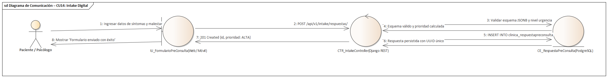

##### Diagrama de Comunicación CU15: Historia Clínica y Control RBAC

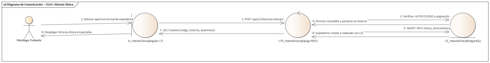

##### Diagrama de Comunicación CU16: Notas SOAP y Autoguardado Reactivo

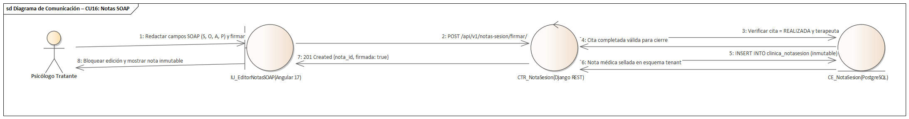

##### Diagrama de Comunicación CU17: Tareas Terapéuticas y Feedback

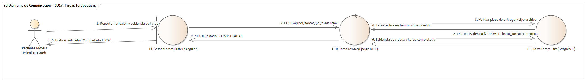

##### Diagrama de Comunicación CU18: Consentimiento Informado y Firma Digital

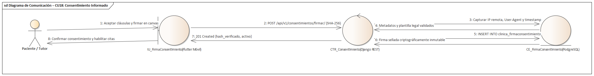

##### Diagrama de Comunicación CU19: Cierre de Caso y Derivación Psiquiátrica

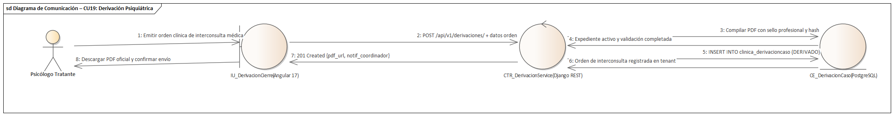

##### Diagrama de Comunicación HU-35: Consentimiento y Pasarela Ética de IA

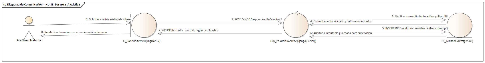

###### Especificación PlantUML BCE – CU14

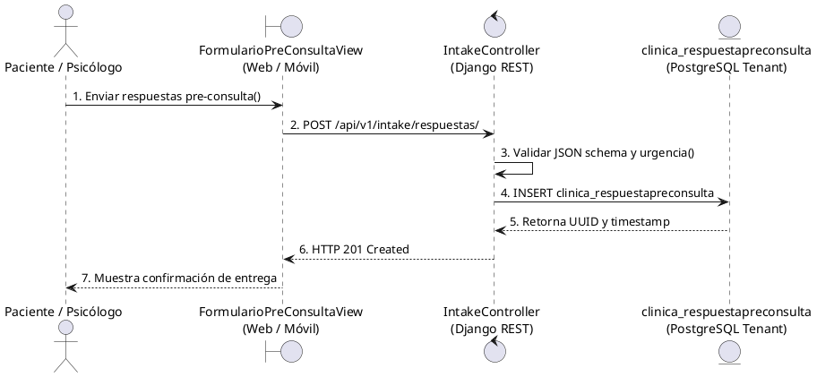
```plantuml
@startuml
skinparam shadowing false
skinparam roundcorner 8
skinparam defaultFontName Arial
actor "Paciente / Psicólogo" as actor
boundary "FormularioPreConsultaView\n(Web / Móvil)" as view
control "IntakeController\n(Django REST)" as ctrl
entity "clinica_respuestapreconsulta\n(PostgreSQL Tenant)" as entity

actor -> view : 1. Enviar respuestas pre-consulta()
view -> ctrl : 2. POST /api/v1/intake/respuestas/
ctrl -> ctrl : 3. Validar JSON schema y urgencia()
ctrl -> entity : 4. INSERT clinica_respuestapreconsulta
entity --> ctrl : 5. Retorna UUID y timestamp
ctrl --> view : 6. HTTP 201 Created
view --> actor : 7. Muestra confirmación de entrega
@enduml
```

###### Especificación PlantUML BCE – CU15

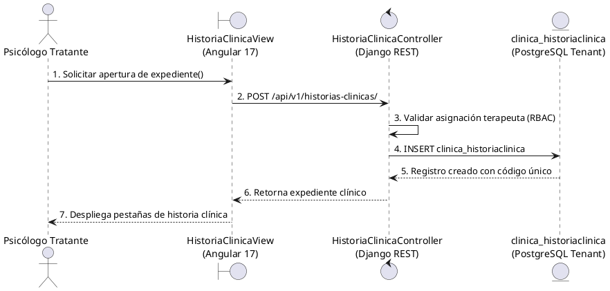
```plantuml
@startuml
skinparam shadowing false
skinparam roundcorner 8
skinparam defaultFontName Arial
actor "Psicólogo Tratante" as actor
boundary "HistoriaClinicaView\n(Angular 17)" as view
control "HistoriaClinicaController\n(Django REST)" as ctrl
entity "clinica_historiaclinica\n(PostgreSQL Tenant)" as entity

actor -> view : 1. Solicitar apertura de expediente()
view -> ctrl : 2. POST /api/v1/historias-clinicas/
ctrl -> ctrl : 3. Validar asignación terapeuta (RBAC)
ctrl -> entity : 4. INSERT clinica_historiaclinica
entity --> ctrl : 5. Registro creado con código único
ctrl --> view : 6. Retorna expediente clínico
view --> actor : 7. Despliega pestañas de historia clínica
@enduml
```

###### Especificación PlantUML BCE – CU16

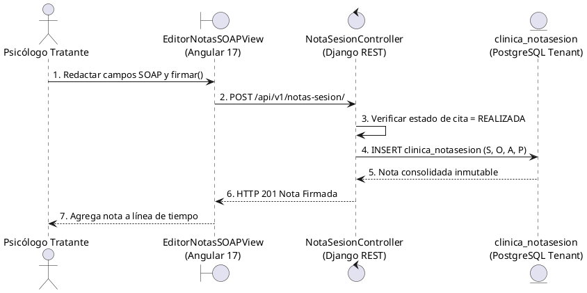
```plantuml
@startuml
skinparam shadowing false
skinparam roundcorner 8
skinparam defaultFontName Arial
actor "Psicólogo Tratante" as actor
boundary "EditorNotasSOAPView\n(Angular 17)" as view
control "NotaSesionController\n(Django REST)" as ctrl
entity "clinica_notasesion\n(PostgreSQL Tenant)" as entity

actor -> view : 1. Redactar campos SOAP y firmar()
view -> ctrl : 2. POST /api/v1/notas-sesion/
ctrl -> ctrl : 3. Verificar estado de cita = REALIZADA
ctrl -> entity : 4. INSERT clinica_notasesion (S, O, A, P)
entity --> ctrl : 5. Nota consolidada inmutable
ctrl --> view : 6. HTTP 201 Nota Firmada
view --> actor : 7. Agrega nota a línea de tiempo
@enduml
```

###### Especificación PlantUML BCE – CU17

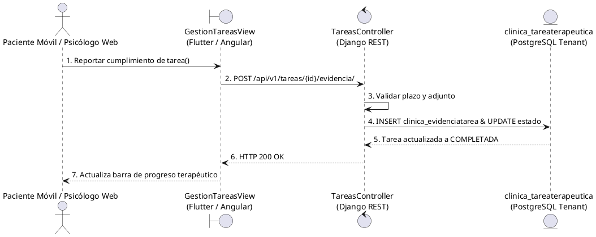
```plantuml
@startuml
skinparam shadowing false
skinparam roundcorner 8
skinparam defaultFontName Arial
actor "Paciente Móvil / Psicólogo Web" as actor
boundary "GestionTareasView\n(Flutter / Angular)" as view
control "TareasController\n(Django REST)" as ctrl
entity "clinica_tareaterapeutica\n(PostgreSQL Tenant)" as entity

actor -> view : 1. Reportar cumplimiento de tarea()
view -> ctrl : 2. POST /api/v1/tareas/{id}/evidencia/
ctrl -> ctrl : 3. Validar plazo y adjunto
ctrl -> entity : 4. INSERT clinica_evidenciatarea & UPDATE estado
entity --> ctrl : 5. Tarea actualizada a COMPLETADA
ctrl --> view : 6. HTTP 200 OK
view --> actor : 7. Actualiza barra de progreso terapéutico
@enduml
```

###### Especificación PlantUML BCE – CU18

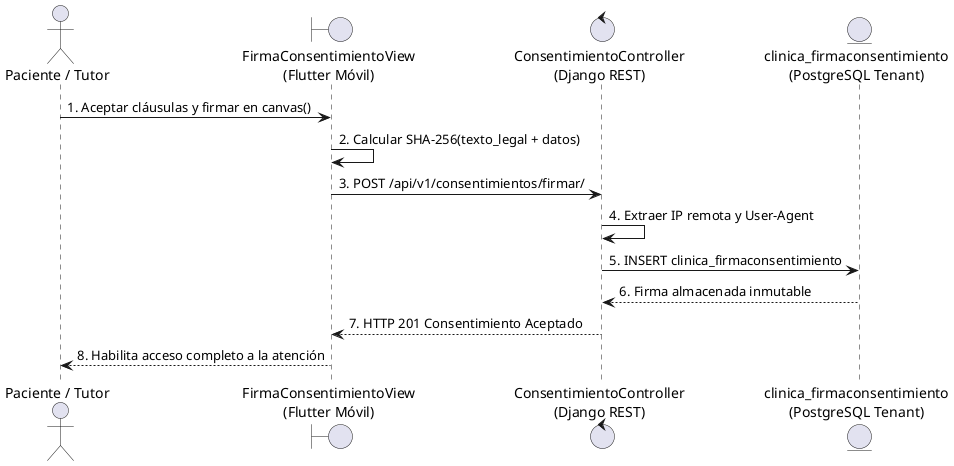
```plantuml
@startuml
skinparam shadowing false
skinparam roundcorner 8
skinparam defaultFontName Arial
actor "Paciente / Tutor" as actor
boundary "FirmaConsentimientoView\n(Flutter Móvil)" as view
control "ConsentimientoController\n(Django REST)" as ctrl
entity "clinica_firmaconsentimiento\n(PostgreSQL Tenant)" as entity

actor -> view : 1. Aceptar cláusulas y firmar en canvas()
view -> view : 2. Calcular SHA-256(texto_legal + datos)
view -> ctrl : 3. POST /api/v1/consentimientos/firmar/
ctrl -> ctrl : 4. Extraer IP remota y User-Agent
ctrl -> entity : 5. INSERT clinica_firmaconsentimiento
entity --> ctrl : 6. Firma almacenada inmutable
ctrl --> view : 7. HTTP 201 Consentimiento Aceptado
view --> actor : 8. Habilita acceso completo a la atención
@enduml
```

###### Especificación PlantUML BCE – CU19

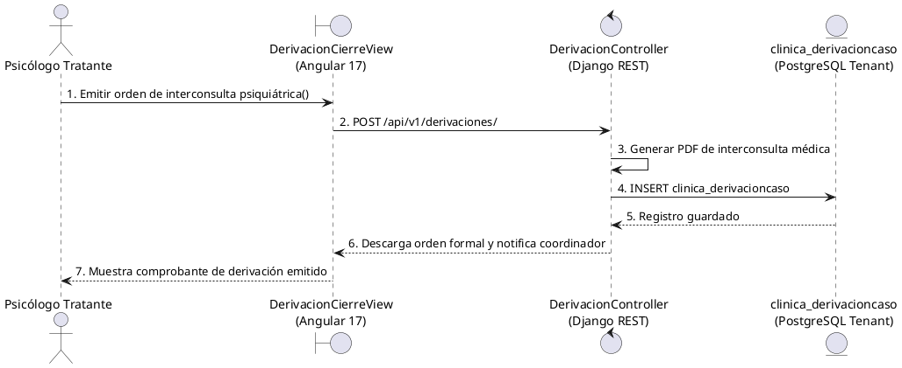
```plantuml
@startuml
skinparam shadowing false
skinparam roundcorner 8
skinparam defaultFontName Arial
actor "Psicólogo Tratante" as actor
boundary "DerivacionCierreView\n(Angular 17)" as view
control "DerivacionController\n(Django REST)" as ctrl
entity "clinica_derivacioncaso\n(PostgreSQL Tenant)" as entity

actor -> view : 1. Emitir orden de interconsulta psiquiátrica()
view -> ctrl : 2. POST /api/v1/derivaciones/
ctrl -> ctrl : 3. Generar PDF de interconsulta médica
ctrl -> entity : 4. INSERT clinica_derivacioncaso
entity --> ctrl : 5. Registro guardado
ctrl --> view : 6. Descarga orden formal y notifica coordinador
view --> actor : 7. Muestra comprobante de derivación emitido
@enduml
```

#### 6.2.1.3.1 Modelado Dinámico de Interacción (Diagramas de Secuencia UML de 3 Capas)

En estricto apego a las directrices de diseño arquitectónico de la materia, los diagramas de secuencia formalizan el comportamiento dinámico y la interacción temporal del sistema estructurados en **tres capas indispensables**:
1. **Clase Interfaz (`boundary`)**: Componentes de interacción visual del usuario (SPA Angular 17 en Web y App Flutter 3.x en Móvil).
2. **Clase Control (`control`)**: Controladores de aplicación y servicios de orquestación de reglas de negocio (`Django REST Framework ViewSets` y servicios de dominio clínico).
3. **Clase Entidad (`entity`)**: Modelos de datos y tablas de persistencia en PostgreSQL 16 (aislados estrictamente por el esquema Tenant de cada centro psicológico).

Bajo esta concepción, el flujo de llamadas garantiza el desacoplamiento: el usuario interactúa exclusivamente con la interfaz, la interfaz delega peticiones HTTP síncronas/asíncronas al controlador de negocio, y el controlador valida permisos (RBAC), reglas clínicas y ejecuta transacciones atómicas sobre las entidades del modelo relacional.

##### Diagrama de Secuencia CU14: Ficha Previa e Intake Digital

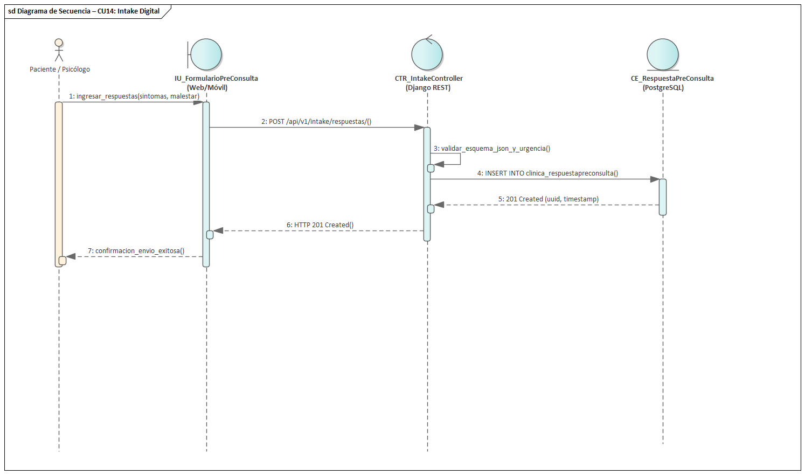

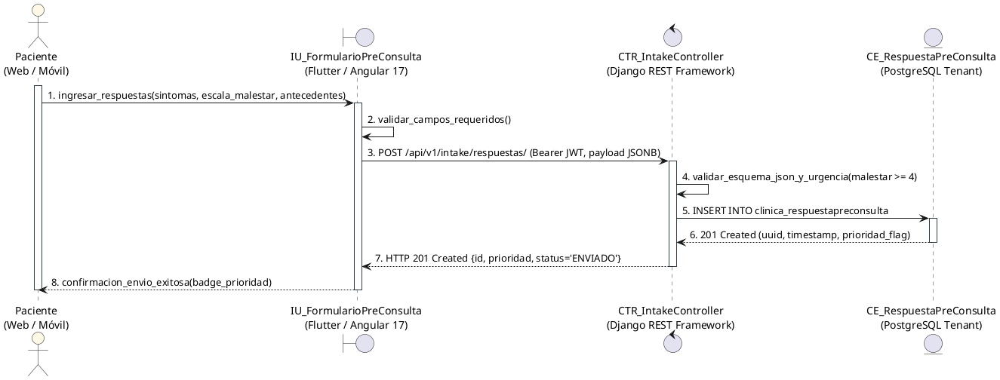
```plantuml
@startuml
skinparam shadowing false
skinparam roundcorner 8
skinparam defaultFontName Arial
skinparam sequenceLifeLineBorderColor #2C3E50
skinparam sequenceParticipantBorderColor #34495E
skinparam sequenceParticipantBackgroundColor #EAEDED
skinparam sequenceActorBackgroundColor #FEF9E7

actor "Paciente\n(Web / Móvil)" as actor
boundary "IU_FormularioPreConsulta\n(Flutter / Angular 17)" as iu
control "CTR_IntakeController\n(Django REST Framework)" as ctrl
entity "CE_RespuestaPreConsulta\n(PostgreSQL Tenant)" as ce

activate actor
actor -> iu : 1. ingresar_respuestas(sintomas, escala_malestar, antecedentes)
activate iu
iu -> iu : 2. validar_campos_requeridos()
iu -> ctrl : 3. POST /api/v1/intake/respuestas/ (Bearer JWT, payload JSONB)
activate ctrl
ctrl -> ctrl : 4. validar_esquema_json_y_urgencia(malestar >= 4)
ctrl -> ce : 5. INSERT INTO clinica_respuestapreconsulta
activate ce
ce --> ctrl : 6. 201 Created (uuid, timestamp, prioridad_flag)
deactivate ce
ctrl --> iu : 7. HTTP 201 Created {id, prioridad, status='ENVIADO'}
deactivate ctrl
iu --> actor : 8. confirmacion_envio_exitosa(badge_prioridad)
deactivate iu
deactivate actor
@enduml
```

##### Diagrama de Secuencia CU15: Apertura de Historia Clínica y Control de Acceso RBAC

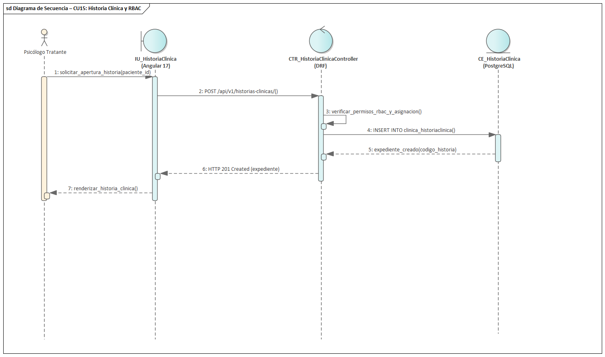

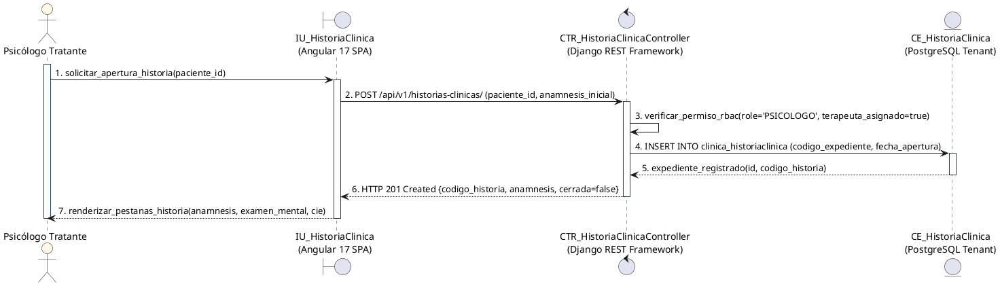
```plantuml
@startuml
skinparam shadowing false
skinparam roundcorner 8
skinparam defaultFontName Arial
skinparam sequenceLifeLineBorderColor #2C3E50
skinparam sequenceParticipantBorderColor #34495E
skinparam sequenceParticipantBackgroundColor #EAEDED
skinparam sequenceActorBackgroundColor #FEF9E7

actor "Psicólogo Tratante" as actor
boundary "IU_HistoriaClinica\n(Angular 17 SPA)" as iu
control "CTR_HistoriaClinicaController\n(Django REST Framework)" as ctrl
entity "CE_HistoriaClinica\n(PostgreSQL Tenant)" as ce

activate actor
actor -> iu : 1. solicitar_apertura_historia(paciente_id)
activate iu
iu -> ctrl : 2. POST /api/v1/historias-clinicas/ (paciente_id, anamnesis_inicial)
activate ctrl
ctrl -> ctrl : 3. verificar_permiso_rbac(role='PSICOLOGO', terapeuta_asignado=true)
ctrl -> ce : 4. INSERT INTO clinica_historiaclinica (codigo_expediente, fecha_apertura)
activate ce
ce --> ctrl : 5. expediente_registrado(id, codigo_historia)
deactivate ce
ctrl --> iu : 6. HTTP 201 Created {codigo_historia, anamnesis, cerrada=false}
deactivate ctrl
iu --> actor : 7. renderizar_pestanas_historia(anamnesis, examen_mental, cie)
deactivate iu
deactivate actor
@enduml
```

##### Diagrama de Secuencia CU16: Registro de Notas SOAP, Autoguardado Reactivo e Inmutabilidad


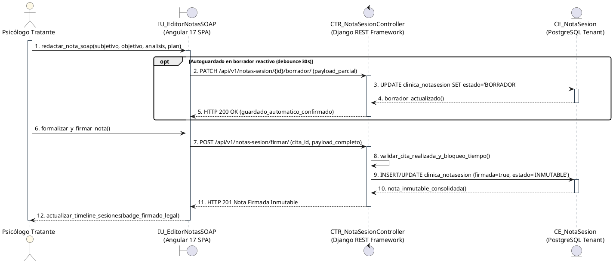
```plantuml
@startuml
skinparam shadowing false
skinparam roundcorner 8
skinparam defaultFontName Arial
skinparam sequenceLifeLineBorderColor #2C3E50
skinparam sequenceParticipantBorderColor #34495E
skinparam sequenceParticipantBackgroundColor #EAEDED
skinparam sequenceActorBackgroundColor #FEF9E7

actor "Psicólogo Tratante" as actor
boundary "IU_EditorNotasSOAP\n(Angular 17 SPA)" as iu
control "CTR_NotaSesionController\n(Django REST Framework)" as ctrl
entity "CE_NotaSesion\n(PostgreSQL Tenant)" as ce

activate actor
actor -> iu : 1. redactar_nota_soap(subjetivo, objetivo, analisis, plan)
activate iu

opt Autoguardado en borrador reactivo (debounce 30s)
  iu -> ctrl : 2. PATCH /api/v1/notas-sesion/{id}/borrador/ (payload_parcial)
  activate ctrl
  ctrl -> ce : 3. UPDATE clinica_notasesion SET estado='BORRADOR'
  activate ce
  ce --> ctrl : 4. borrador_actualizado()
  deactivate ce
  ctrl --> iu : 5. HTTP 200 OK (guardado_automatico_confirmado)
  deactivate ctrl
end

actor -> iu : 6. formalizar_y_firmar_nota()
iu -> ctrl : 7. POST /api/v1/notas-sesion/firmar/ (cita_id, payload_completo)
activate ctrl
ctrl -> ctrl : 8. validar_cita_realizada_y_bloqueo_tiempo()
ctrl -> ce : 9. INSERT/UPDATE clinica_notasesion (firmada=true, estado='INMUTABLE')
activate ce
ce --> ctrl : 10. nota_inmutable_consolidada()
deactivate ce
ctrl --> iu : 11. HTTP 201 Nota Firmada Inmutable
deactivate ctrl
iu --> actor : 12. actualizar_timeline_sesiones(badge_firmado_legal)
deactivate iu
deactivate actor
@enduml
```

##### Diagrama de Secuencia CU17: Asignación y Cumplimiento de Tareas Terapéuticas Inter-Sesiones

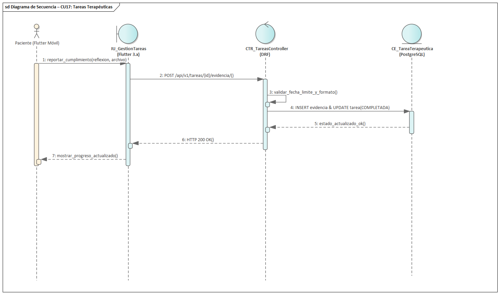

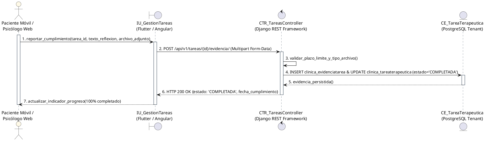
```plantuml
@startuml
skinparam shadowing false
skinparam roundcorner 8
skinparam defaultFontName Arial
skinparam sequenceLifeLineBorderColor #2C3E50
skinparam sequenceParticipantBorderColor #34495E
skinparam sequenceParticipantBackgroundColor #EAEDED
skinparam sequenceActorBackgroundColor #FEF9E7

actor "Paciente Móvil /\nPsicólogo Web" as actor
boundary "IU_GestionTareas\n(Flutter / Angular)" as iu
control "CTR_TareasController\n(Django REST Framework)" as ctrl
entity "CE_TareaTerapeutica\n(PostgreSQL Tenant)" as ce

activate actor
actor -> iu : 1. reportar_cumplimiento(tarea_id, texto_reflexion, archivo_adjunto)
activate iu
iu -> ctrl : 2. POST /api/v1/tareas/{id}/evidencia/ (Multipart Form-Data)
activate ctrl
ctrl -> ctrl : 3. validar_plazo_limite_y_tipo_archivo()
ctrl -> ce : 4. INSERT clinica_evidenciatarea & UPDATE clinica_tareaterapeutica (estado='COMPLETADA')
activate ce
ce --> ctrl : 5. evidencia_persistida()
deactivate ce
ctrl --> iu : 6. HTTP 200 OK {estado: 'COMPLETADA', fecha_cumplimiento}
deactivate ctrl
iu --> actor : 7. actualizar_indicador_progreso(100% completado)
deactivate iu
deactivate actor
@enduml
```

##### Diagrama de Secuencia CU18: Consentimiento Informado Digital con Sellado SHA-256

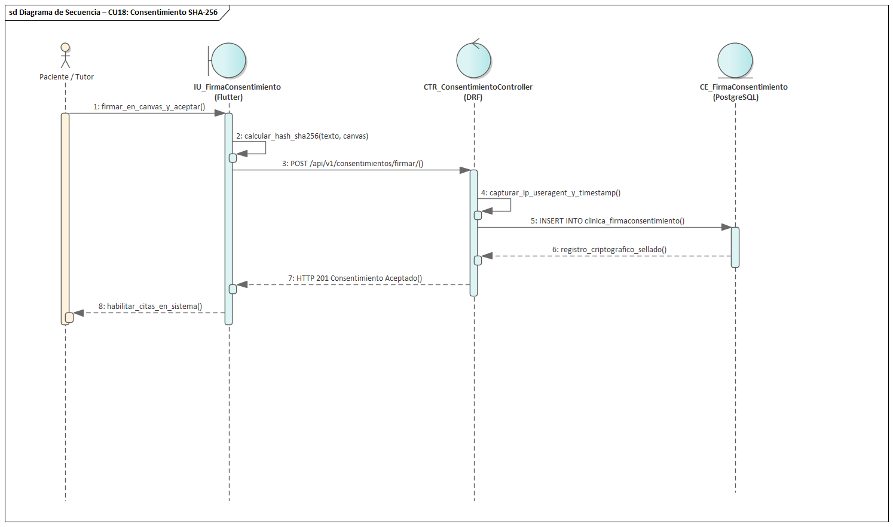

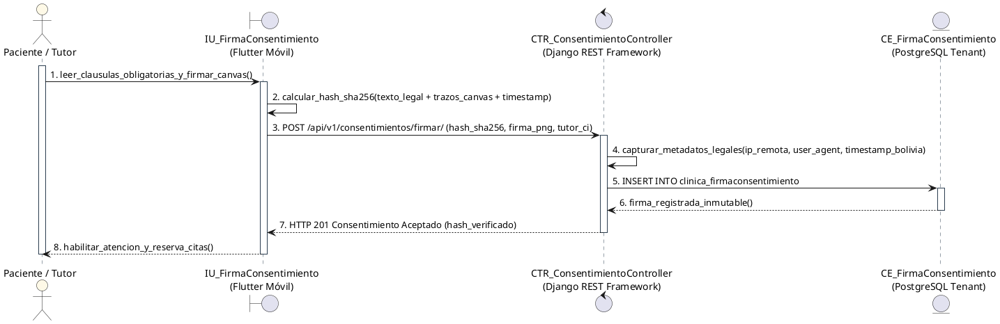
```plantuml
@startuml
skinparam shadowing false
skinparam roundcorner 8
skinparam defaultFontName Arial
skinparam sequenceLifeLineBorderColor #2C3E50
skinparam sequenceParticipantBorderColor #34495E
skinparam sequenceParticipantBackgroundColor #EAEDED
skinparam sequenceActorBackgroundColor #FEF9E7

actor "Paciente / Tutor" as actor
boundary "IU_FirmaConsentimiento\n(Flutter Móvil)" as iu
control "CTR_ConsentimientoController\n(Django REST Framework)" as ctrl
entity "CE_FirmaConsentimiento\n(PostgreSQL Tenant)" as ce

activate actor
actor -> iu : 1. leer_clausulas_obligatorias_y_firmar_canvas()
activate iu
iu -> iu : 2. calcular_hash_sha256(texto_legal + trazos_canvas + timestamp)
iu -> ctrl : 3. POST /api/v1/consentimientos/firmar/ (hash_sha256, firma_png, tutor_ci)
activate ctrl
ctrl -> ctrl : 4. capturar_metadatos_legales(ip_remota, user_agent, timestamp_bolivia)
ctrl -> ce : 5. INSERT INTO clinica_firmaconsentimiento
activate ce
ce --> ctrl : 6. firma_registrada_inmutable()
deactivate ce
ctrl --> iu : 7. HTTP 201 Consentimiento Aceptado (hash_verificado)
deactivate ctrl
iu --> actor : 8. habilitar_atencion_y_reserva_citas()
deactivate iu
deactivate actor
@enduml
```

##### Diagrama de Secuencia CU19: Cierre de Proceso Terapéutico y Derivación Médica a Psiquiatría

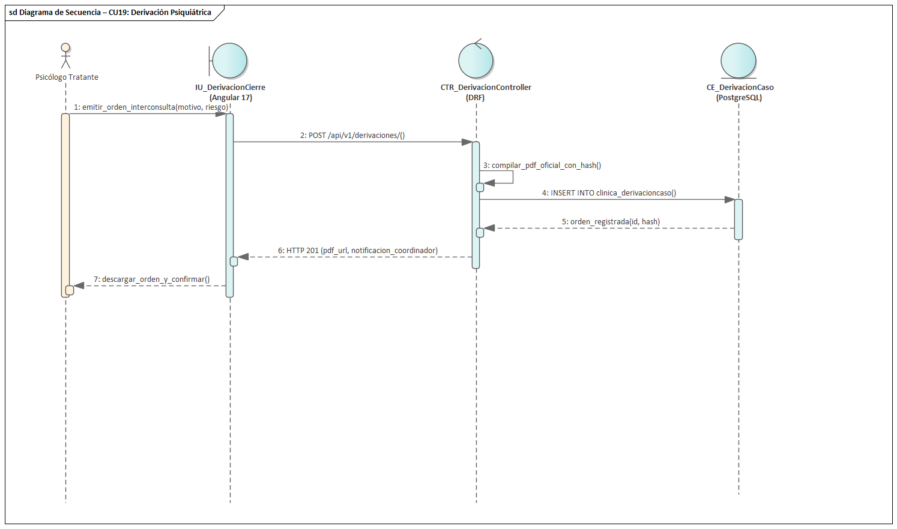

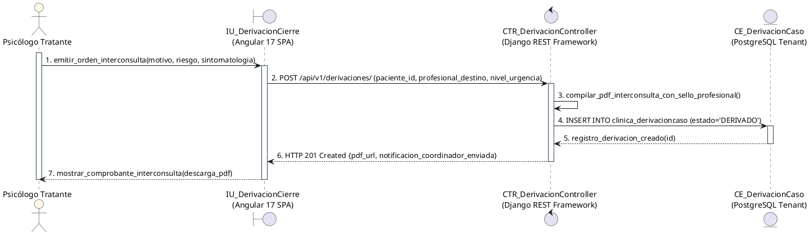
```plantuml
@startuml
skinparam shadowing false
skinparam roundcorner 8
skinparam defaultFontName Arial
skinparam sequenceLifeLineBorderColor #2C3E50
skinparam sequenceParticipantBorderColor #34495E
skinparam sequenceParticipantBackgroundColor #EAEDED
skinparam sequenceActorBackgroundColor #FEF9E7

actor "Psicólogo Tratante" as actor
boundary "IU_DerivacionCierre\n(Angular 17 SPA)" as iu
control "CTR_DerivacionController\n(Django REST Framework)" as ctrl
entity "CE_DerivacionCaso\n(PostgreSQL Tenant)" as ce

activate actor
actor -> iu : 1. emitir_orden_interconsulta(motivo, riesgo, sintomatologia)
activate iu
iu -> ctrl : 2. POST /api/v1/derivaciones/ (paciente_id, profesional_destino, nivel_urgencia)
activate ctrl
ctrl -> ctrl : 3. compilar_pdf_interconsulta_con_sello_profesional()
ctrl -> ce : 4. INSERT INTO clinica_derivacioncaso (estado='DERIVADO')
activate ce
ce --> ctrl : 5. registro_derivacion_creado(id)
deactivate ce
ctrl --> iu : 6. HTTP 201 Created {pdf_url, notificacion_coordinador_enviada}
deactivate ctrl
iu --> actor : 7. mostrar_comprobante_interconsulta(descarga_pdf)
deactivate iu
deactivate actor
@enduml
```

##### Diagrama de Secuencia HU-35: Asistente Ético de IA para Preconsulta con Salvaguarda Humana

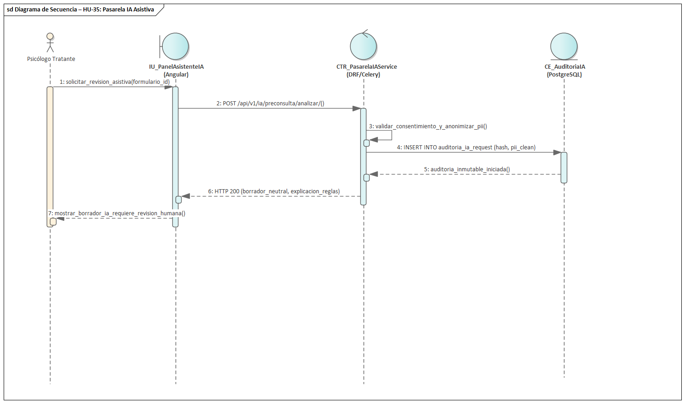

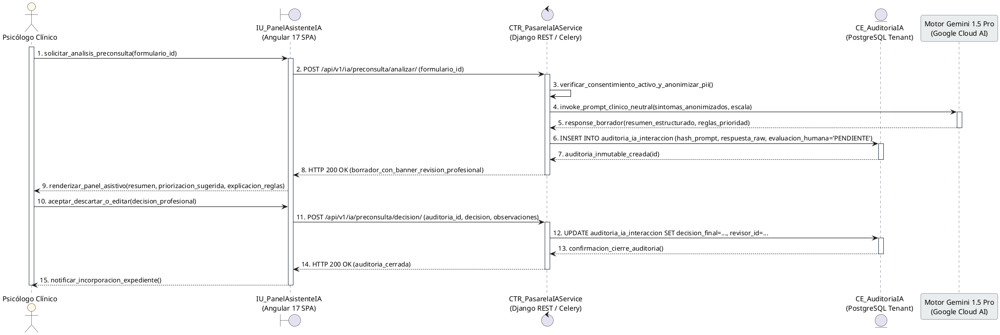
```plantuml
@startuml
skinparam shadowing false
skinparam roundcorner 8
skinparam defaultFontName Arial
skinparam sequenceLifeLineBorderColor #2C3E50
skinparam sequenceParticipantBorderColor #34495E
skinparam sequenceParticipantBackgroundColor #EAEDED
skinparam sequenceActorBackgroundColor #FEF9E7

actor "Psicólogo Clínico" as actor
boundary "IU_PanelAsistenteIA\n(Angular 17 SPA)" as iu
control "CTR_PasarelaIAService\n(Django REST / Celery)" as ctrl
entity "CE_AuditoriaIA\n(PostgreSQL Tenant)" as ce
participant "Motor Gemini 1.5 Pro\n(Google Cloud AI)" as ia

activate actor
actor -> iu : 1. solicitar_analisis_preconsulta(formulario_id)
activate iu
iu -> ctrl : 2. POST /api/v1/ia/preconsulta/analizar/ (formulario_id)
activate ctrl
ctrl -> ctrl : 3. verificar_consentimiento_activo_y_anonimizar_pii()
ctrl -> ia : 4. invoke_prompt_clinico_neutral(sintomas_anonimizados, escala)
activate ia
ia --> ctrl : 5. response_borrador(resumen_estructurado, reglas_prioridad)
deactivate ia
ctrl -> ce : 6. INSERT INTO auditoria_ia_interaccion (hash_prompt, respuesta_raw, evaluacion_humana='PENDIENTE')
activate ce
ce --> ctrl : 7. auditoria_inmutable_creada(id)
deactivate ce
ctrl --> iu : 8. HTTP 200 OK (borrador_con_banner_revision_profesional)
deactivate ctrl
iu --> actor : 9. renderizar_panel_asistivo(resumen, priorizacion_sugerida, explicacion_reglas)

actor -> iu : 10. aceptar_descartar_o_editar(decision_profesional)
iu -> ctrl : 11. POST /api/v1/ia/preconsulta/decision/ (auditoria_id, decision, observaciones)
activate ctrl
ctrl -> ce : 12. UPDATE auditoria_ia_interaccion SET decision_final=..., revisor_id=...
activate ce
ce --> ctrl : 13. confirmacion_cierre_auditoria()
deactivate ce
ctrl --> iu : 14. HTTP 200 OK (auditoria_cerrada)
deactivate ctrl
iu --> actor : 15. notificar_incorporacion_expediente()
deactivate iu
deactivate actor
@enduml
```

#### 6.2.1.4 Diseño de la Navegación de Vistas por Caso de Uso

A continuación se presentan los diagramas de navegación de vistas y pantallas para cada caso de uso del Sprint 2, articulando los flujos de interacción, botones de acción, validaciones síncronas y modales entre Angular 17 y Flutter 3.x:

##### Mapa de Navegación Integral del Incremento (Sprint 2)

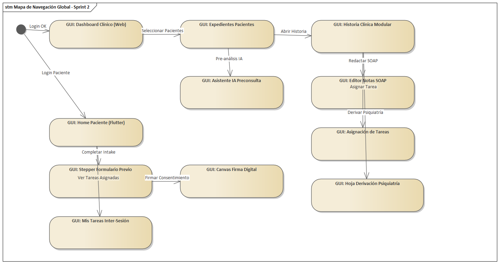

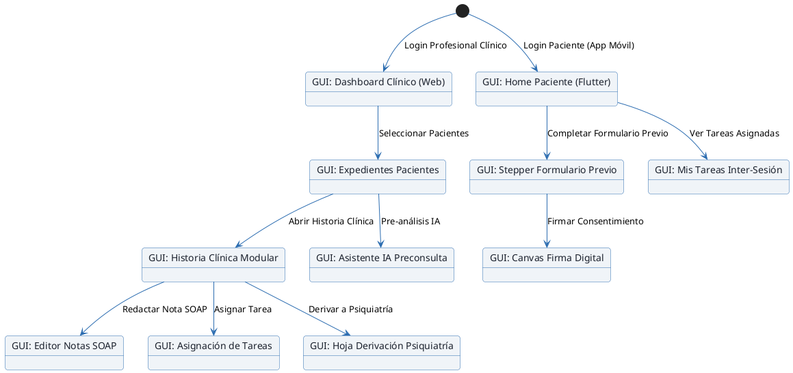
```plantuml
@startuml
skinparam backgroundColor #FFFFFF
skinparam roundcorner 8
skinparam defaultFontName Arial
skinparam state {
  BackgroundColor #F0F4F8
  BorderColor #2B6CB0
  FontColor #1A202C
  ArrowColor #2B6CB0
}

[*] --> Dashboard_Principal : Login Profesional Clínico
[*] --> App_Home_Movil : Login Paciente (App Móvil)

state "GUI: Dashboard Clínico (Web)" as Dashboard_Principal
state "GUI: Expedientes Pacientes" as Bandeja_Pacientes
state "GUI: Historia Clínica Modular" as Historia_Clinica
state "GUI: Editor Notas SOAP" as Editor_SOAP
state "GUI: Asignación de Tareas" as Gestion_Tareas_Web
state "GUI: Hoja Derivación Psiquiatría" as Derivacion_Psiquiatria
state "GUI: Asistente IA Preconsulta" as Panel_IA_Preconsulta

state "GUI: Home Paciente (Flutter)" as App_Home_Movil
state "GUI: Stepper Formulario Previo" as Stepper_Intake
state "GUI: Canvas Firma Digital" as Firma_Consentimiento
state "GUI: Mis Tareas Inter-Sesión" as Mis_Tareas_Movil

Dashboard_Principal --> Bandeja_Pacientes : Seleccionar Pacientes
Bandeja_Pacientes --> Historia_Clinica : Abrir Historia Clínica
Historia_Clinica --> Editor_SOAP : Redactar Nota SOAP
Historia_Clinica --> Gestion_Tareas_Web : Asignar Tarea
Historia_Clinica --> Derivacion_Psiquiatria : Derivar a Psiquiatría
Bandeja_Pacientes --> Panel_IA_Preconsulta : Pre-análisis IA

App_Home_Movil --> Stepper_Intake : Completar Formulario Previo
Stepper_Intake --> Firma_Consentimiento : Firmar Consentimiento
App_Home_Movil --> Mis_Tareas_Movil : Ver Tareas Asignadas
@enduml
```

##### Diagrama de Navegación CU14: Formulario Previo e Intake Digital (Web y Móvil)

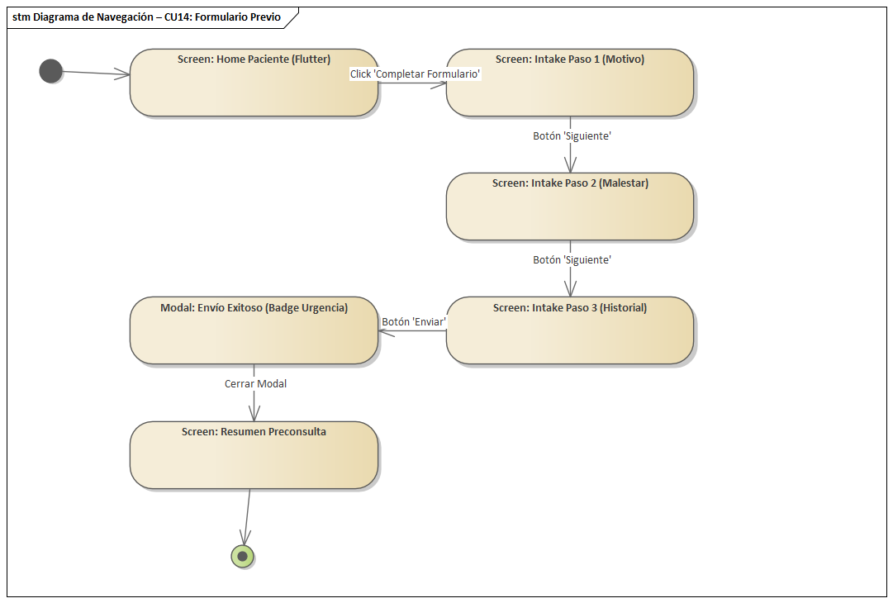

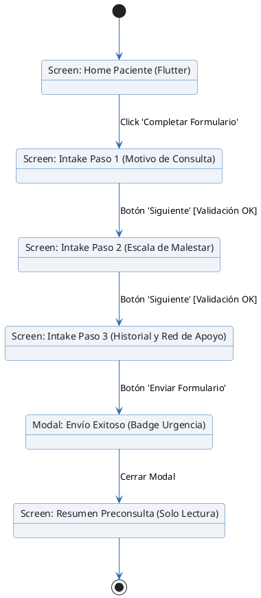
```plantuml
@startuml
skinparam backgroundColor #FFFFFF
skinparam roundcorner 8
skinparam defaultFontName Arial
skinparam state {
  BackgroundColor #F0F4F8
  BorderColor #2B6CB0
  FontColor #1A202C
  ArrowColor #2B6CB0
}

[*] --> Home_Movil
state "Screen: Home Paciente (Flutter)" as Home_Movil
state "Screen: Intake Paso 1 (Motivo de Consulta)" as Paso1_Motivo
state "Screen: Intake Paso 2 (Escala de Malestar)" as Paso2_Escala
state "Screen: Intake Paso 3 (Historial y Red de Apoyo)" as Paso3_Antecedentes
state "Modal: Envío Exitoso (Badge Urgencia)" as Modal_Confirmacion
state "Screen: Resumen Preconsulta (Solo Lectura)" as Vista_SoloLectura

Home_Movil --> Paso1_Motivo : Click 'Completar Formulario'
Paso1_Motivo --> Paso2_Escala : Botón 'Siguiente' [Validación OK]
Paso2_Escala --> Paso3_Antecedentes : Botón 'Siguiente' [Validación OK]
Paso3_Antecedentes --> Modal_Confirmacion : Botón 'Enviar Formulario'
Modal_Confirmacion --> Vista_SoloLectura : Cerrar Modal
Vista_SoloLectura --> [*]
@enduml
```

##### Diagrama de Navegación CU15: Historia Clínica Psicológica y Control RBAC (Web)

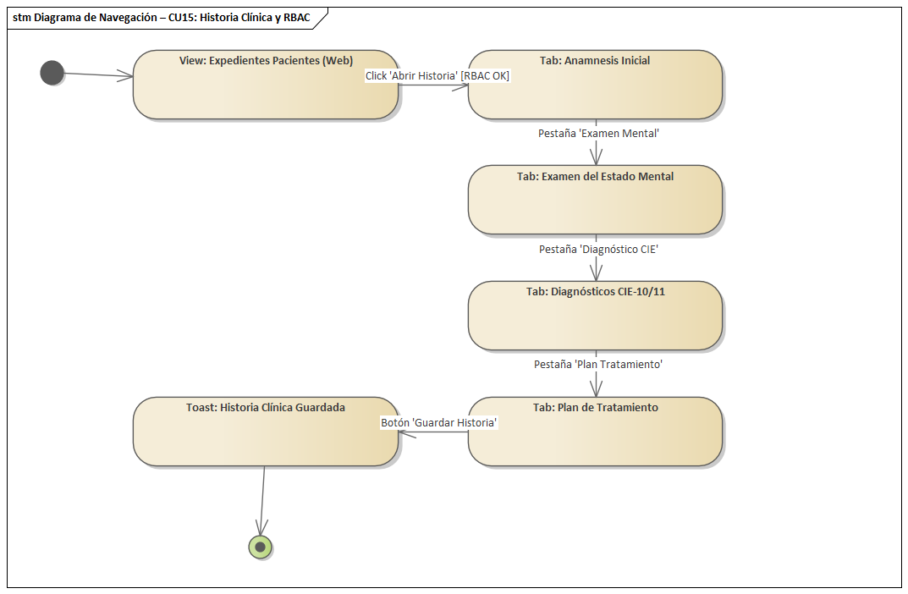

```plantuml
@startuml
skinparam backgroundColor #FFFFFF
skinparam roundcorner 8
skinparam defaultFontName Arial
skinparam state {
  BackgroundColor #F0F4F8
  BorderColor #2B6CB0
  FontColor #1A202C
  ArrowColor #2B6CB0
}

[*] --> Bandeja_Expedientes
state "View: Expedientes Pacientes (Web)" as Bandeja_Expedientes
state "Tab: Anamnesis Inicial y Datos Generales" as Tab_Anamnesis
state "Tab: Examen del Estado Mental (EEM)" as Tab_ExamenMental
state "Tab: Diagnósticos CIE-10/11" as Tab_DiagnosticoCIE
state "Tab: Plan de Tratamiento y Metas" as Tab_PlanTratamiento
state "Toast: Historia Clínica Guardada (Notificación)" as Toast_Guardado

Bandeja_Expedientes --> Tab_Anamnesis : Click 'Abrir Historia' [Permiso RBAC OK]
Tab_Anamnesis --> Tab_ExamenMental : Pestaña 'Examen Mental'
Tab_ExamenMental --> Tab_DiagnosticoCIE : Pestaña 'Diagnóstico CIE'
Tab_DiagnosticoCIE --> Tab_PlanTratamiento : Pestaña 'Plan Tratamiento'
Tab_PlanTratamiento --> Toast_Guardado : Botón 'Guardar Historia' [Correlativo Generado]
Toast_Guardado --> [*]
@enduml
```

##### Diagrama de Navegación CU16: Notas de Sesión Clínicas Estructuradas SOAP (Web)

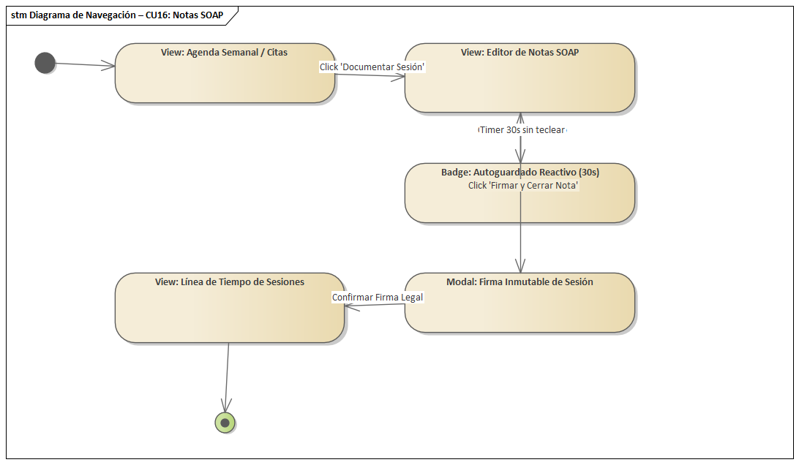

```plantuml
@startuml
skinparam backgroundColor #FFFFFF
skinparam roundcorner 8
skinparam defaultFontName Arial
skinparam state {
  BackgroundColor #F0F4F8
  BorderColor #2B6CB0
  FontColor #1A202C
  ArrowColor #2B6CB0
}

[*] --> Agenda_Citas
state "View: Agenda Semanal / Citas" as Agenda_Citas
state "View: Editor de Notas SOAP (4 Cuadrantes)" as Editor_SOAP_View
state "Badge: Autoguardado Reactivo (Debounce 30s)" as Borrador_Toast
state "Modal: Firma Inmutable de Sesión" as Modal_Firma_Legal
state "View: Línea de Tiempo de Sesiones Clínicas" as Timeline_Notas

Agenda_Citas --> Editor_SOAP_View : Click 'Documentar Sesión'
Editor_SOAP_View --> Borrador_Toast : Inactividad de 30s en teclado
Borrador_Toast --> Editor_SOAP_View : Continuar redactando
Editor_SOAP_View --> Modal_Firma_Legal : Click 'Firmar y Cerrar Nota'
Modal_Firma_Legal --> Timeline_Notas : Confirmar Firma Médico-Legal [Bloqueo de Edición]
Timeline_Notas --> [*]
@enduml
```

##### Diagrama de Navegación CU17: Evolución Longitudinal y Tareas Terapéuticas (Web y Móvil)

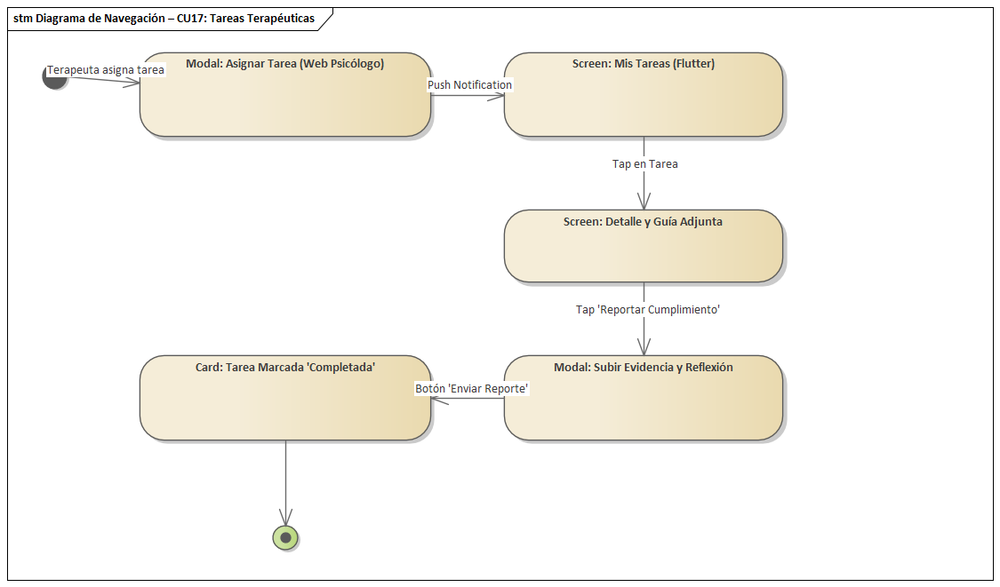

```plantuml
@startuml
skinparam backgroundColor #FFFFFF
skinparam roundcorner 8
skinparam defaultFontName Arial
skinparam state {
  BackgroundColor #F0F4F8
  BorderColor #2B6CB0
  FontColor #1A202C
  ArrowColor #2B6CB0
}

[*] --> Modal_Asignar_Web
state "Modal: Asignar Tarea (Web Terapeuta)" as Modal_Asignar_Web
state "Screen: Mis Tareas (Flutter Móvil)" as Screen_Tareas_Movil
state "Screen: Detalle y Guía Adjunta" as Detalle_Tarea
state "Modal: Subir Evidencia y Reflexión" as Modal_Evidencia
state "Card: Tarea Marcada 'Completada'" as Card_Completada

Modal_Asignar_Web --> Screen_Tareas_Movil : Asignación guardada -> Push Notification FCM
Screen_Tareas_Movil --> Detalle_Tarea : Tap en Card de Tarea
Detalle_Tarea --> Modal_Evidencia : Tap 'Reportar Cumplimiento'
Modal_Evidencia --> Card_Completada : Botón 'Enviar Reporte' [Registro Timestamp]
Card_Completada --> [*]
@enduml
```

##### Diagrama de Navegación CU18: Consentimientos Informados y Firma SHA-256 (Web y Móvil)

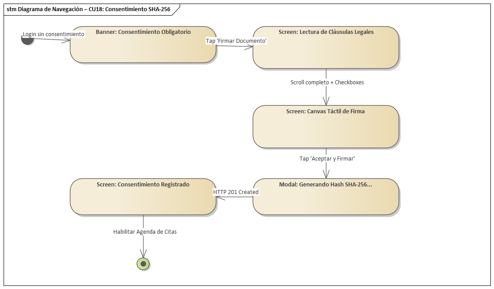

```plantuml
@startuml
skinparam backgroundColor #FFFFFF
skinparam roundcorner 8
skinparam defaultFontName Arial
skinparam state {
  BackgroundColor #F0F4F8
  BorderColor #2B6CB0
  FontColor #1A202C
  ArrowColor #2B6CB0
}

[*] --> Aviso_Consentimiento
state "Banner: Consentimiento Obligatorio" as Aviso_Consentimiento
state "Screen: Lectura de Cláusulas Legales y GDPR" as Visor_Clausulas
state "Screen: Canvas Táctil de Firma Digital" as Canvas_Firma
state "Modal: Generando Hash Inmutable SHA-256..." as Modal_Hash
state "Screen: Consentimiento Registrado y Válido" as Screen_Exito

Aviso_Consentimiento --> Visor_Clausulas : Tap 'Firmar Documento'
Visor_Clausulas --> Canvas_Firma : Scroll completo al 100% + Checkboxes de aceptación
Canvas_Firma --> Modal_Hash : Tap 'Aceptar y Firmar'
Modal_Hash --> Screen_Exito : HTTP 201 Created (Hash persistido)
Screen_Exito --> [*] : Habilitar Agenda y Servicios Clínicos
@enduml
```

##### Diagrama de Navegación CU19: Cierre de Caso y Derivación Médica a Psiquiatría (Web)

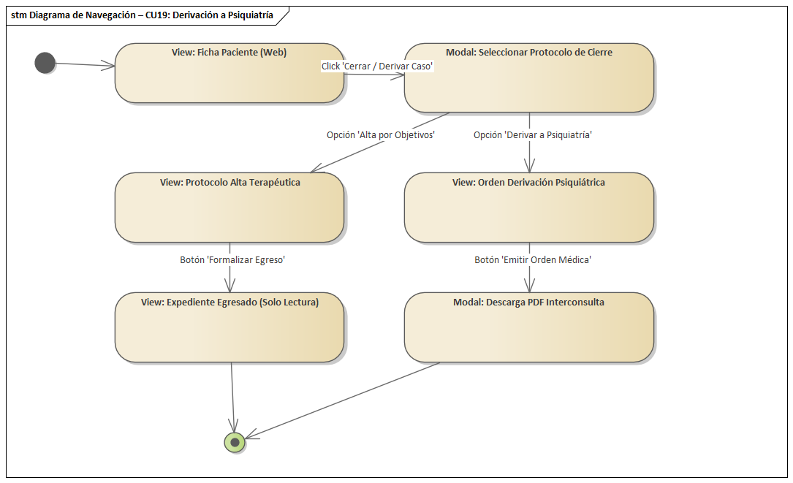

```plantuml
@startuml
skinparam backgroundColor #FFFFFF
skinparam roundcorner 8
skinparam defaultFontName Arial
skinparam state {
  BackgroundColor #F0F4F8
  BorderColor #2B6CB0
  FontColor #1A202C
  ArrowColor #2B6CB0
}

[*] --> Ficha_Expediente
state "View: Ficha Paciente (Web)" as Ficha_Expediente
state "Modal: Seleccionar Protocolo de Cierre" as Modal_TipoCierre
state "View: Orden Derivación Psiquiátrica" as Form_Derivacion
state "Modal: Descarga PDF Interconsulta Firmada" as Visor_PDF_Interconsulta
state "View: Protocolo Alta Terapéutica por Objetivos" as Form_Alta_Terapeutica
state "View: Expediente Egresado (Solo Lectura)" as Expediente_Cerrado

Ficha_Expediente --> Modal_TipoCierre : Click 'Cerrar / Derivar Caso'
Modal_TipoCierre --> Form_Derivacion : Opción 'Derivar a Psiquiatría'
Form_Derivacion --> Visor_PDF_Interconsulta : Botón 'Emitir Orden Médica'
Modal_TipoCierre --> Form_Alta_Terapeutica : Opción 'Alta por Cumplimiento de Metas'
Form_Alta_Terapeutica --> Expediente_Cerrado : Botón 'Formalizar Egreso'
Visor_PDF_Interconsulta --> [*]
Expediente_Cerrado --> [*]
@enduml
```

#### 6.2.1.5 Modelado del Comportamiento Temporal (Diagramas de Tiempo UML)

Los diagramas de tiempo formalizan la evolución del estado de los subsistemas y componentes a lo largo de un eje temporal explícito con restricciones milimétricas de latencia:

##### Diagrama de Tiempo 1: Autoguardado Reactivo y Concurrencia en Notas SOAP (CU15 / HU-26)

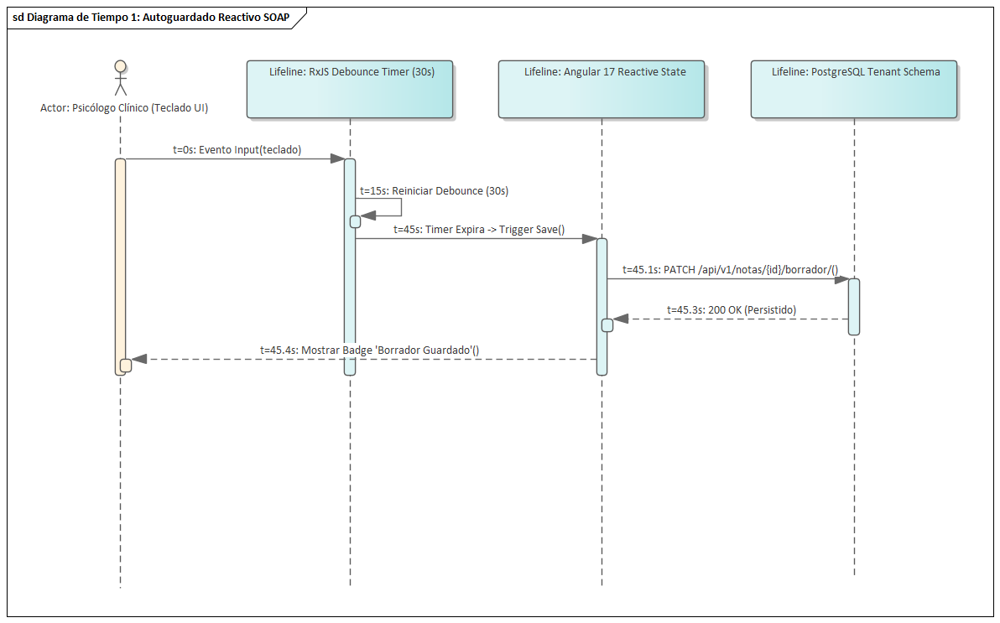

```plantuml
@startuml
skinparam backgroundColor #FFFFFF
skinparam defaultFontName Arial

robust "Psicólogo Clínico (Teclado UI)" as UI
robust "RxJS Debounce Timer (30s)" as RX
robust "Angular 17 Reactive State" as ANG
robust "PostgreSQL Tenant Schema" as DB

@0
UI is "En Espera"
RX is "Inactivo"
ANG is "Sincronizado"
DB is "Idle"

@10
UI is "Escribiendo Nota SOAP"
RX is "Activo (Cuenta Regresiva)"

@25
UI is "Escribiendo..."
RX is "Reinicio Timer (30s)"

@55
UI is "Pausa en Teclado"
RX is "Expirado (Trigger Save)"
ANG is "Despachando PATCH"

@55.1
ANG is "Esperando Respuesta HTTP"
DB is "Persistiendo JSONB"

@55.3
DB is "Idle"
ANG is "Sincronizado"
UI is "Badge 'Borrador Guardado'"
@enduml
```

##### Diagrama de Tiempo 2: Pipeline Asíncrono de IA y Detección de Riesgo Crítico (CU14 / CU19 / HU-35)

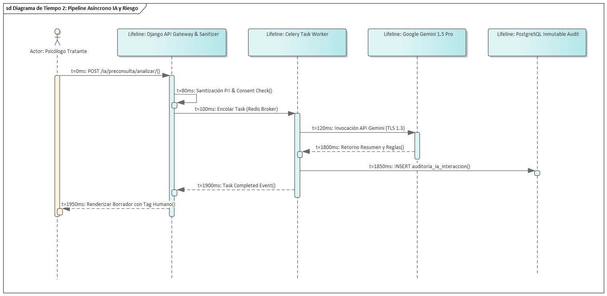

```plantuml
@startuml
skinparam backgroundColor #FFFFFF
skinparam defaultFontName Arial

robust "Psicólogo Tratante" as PS
robust "Django REST Gateway & Sanitizer" as GW
robust "Celery Task Worker (Redis)" as CW
robust "Google Gemini 1.5 Pro (TLS 1.3)" as AI
robust "PostgreSQL Inmutable Audit" as AUD

@0
PS is "Solicitando Análisis"
GW is "Idle"
CW is "Idle"
AI is "Idle"
AUD is "Idle"

@80
PS is "Esperando Respuesta"
GW is "Sanitizando PII y Validando Consentimiento"

@100
GW is "Encolando Tarea en Redis"
CW is "Desencolando Tarea"

@120
CW is "Invocando Endpoint Seguro Gemini"
AI is "Procesando Prompt Clínico"

@1800
AI is "Retornando JSON Estructurado"
CW is "Evaluando Reglas de Riesgo"

@1850
CW is "Registrando Auditoría Inmutable"
AUD is "INSERT auditoria_ia_interaccion"

@1900
AUD is "Idle"
CW is "Emite Evento Tarea Completada"
GW is "Construyendo HTTP 200"

@1950
GW is "Idle"
PS is "Visualizando Panel con Tag Humano Requerido"
@enduml
```

##### Diagrama de Tiempo 3: Ciclo de Vida de Tareas Terapéuticas y Recordatorios (CU16 / HU-27, HU-28)

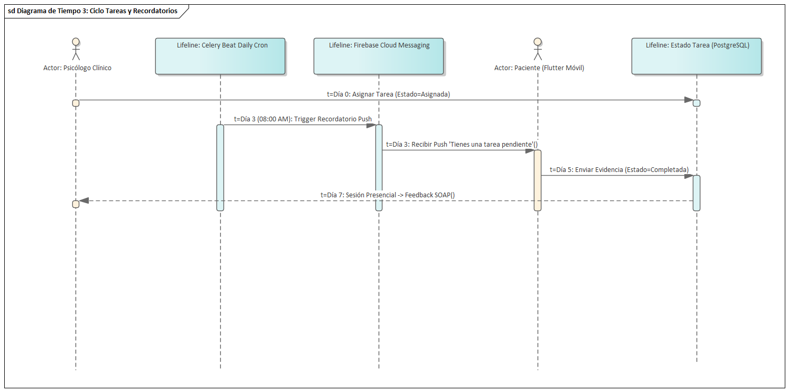

```plantuml
@startuml
skinparam backgroundColor #FFFFFF
skinparam defaultFontName Arial

robust "Psicólogo Clínico" as PS
robust "Celery Beat Daily Cron" as CRON
robust "Firebase Cloud Messaging (FCM)" as FCM
robust "Paciente (Flutter Móvil)" as PAC
robust "Estado Tarea (PostgreSQL)" as DB

@0
PS is "Asignando Tarea"
CRON is "Idle"
FCM is "Idle"
PAC is "Idle"
DB is "Asignada (Día 0)"

@3
CRON is "Trigger 08:00 AM"
FCM is "Despachando Notificación Push"
PAC is "Recibe Notificación 'Tarea Pendiente'"
DB is "En Progreso (Día 3)"

@5
PAC is "Subiendo Evidencia y Reflexión"
DB is "Completada (Día 5)"

@7
PS is "Revisión Presencial en Sesión"
DB is "Cerrada con Feedback SOAP (Día 7)"
@enduml
```

#### 6.2.1.6 Modelado del Ciclo de Vida y Transiciones (Diagramas de Máquinas de Estados UML)

Formalización de las máquinas de estados de las cuatro entidades del incremento con estados estables, acciones de entrada/salida y guardas condicionales:

##### Máquina de Estados 1: Ficha de Intake y Triaje Clínico Digital (CU14)

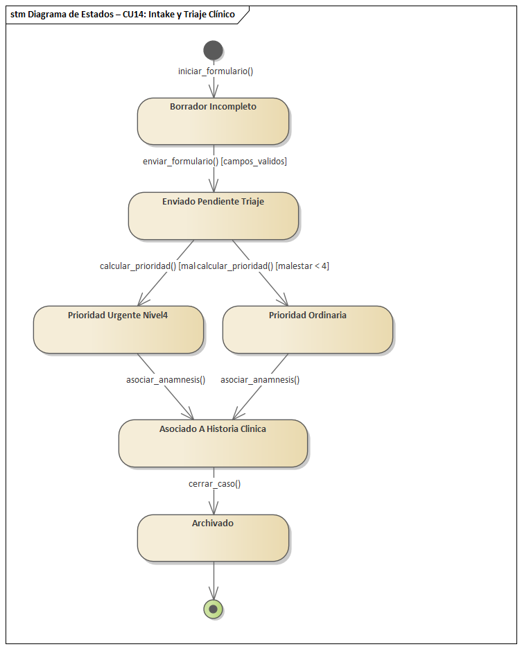

##### Máquina de Estados 2: Notas Clínicas SOAP e Inmutabilidad Médico-Legal (CU15)

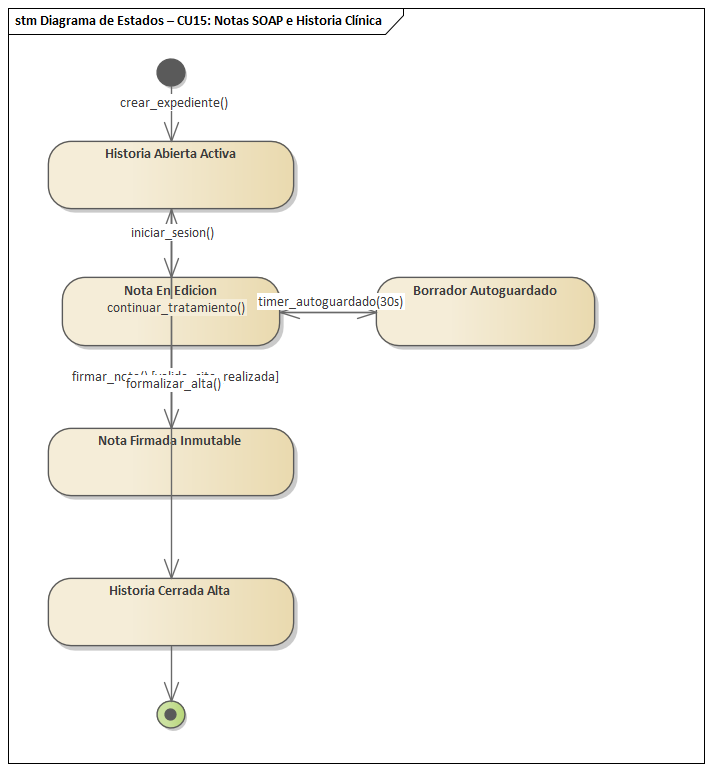

##### Máquina de Estados 3: Tareas Terapéuticas Inter-Sesiones (CU16)

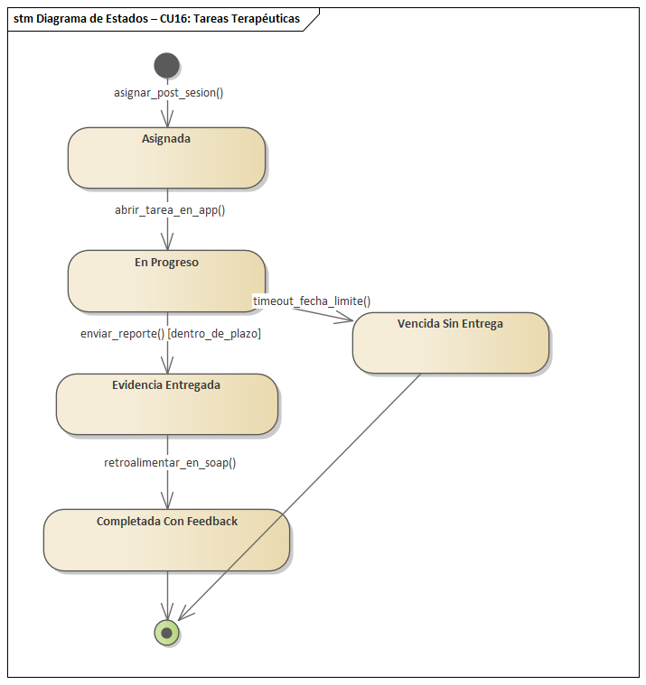

##### Máquina de Estados 4: Consentimiento Informado y Protocolo Ético de IA (HU-35)

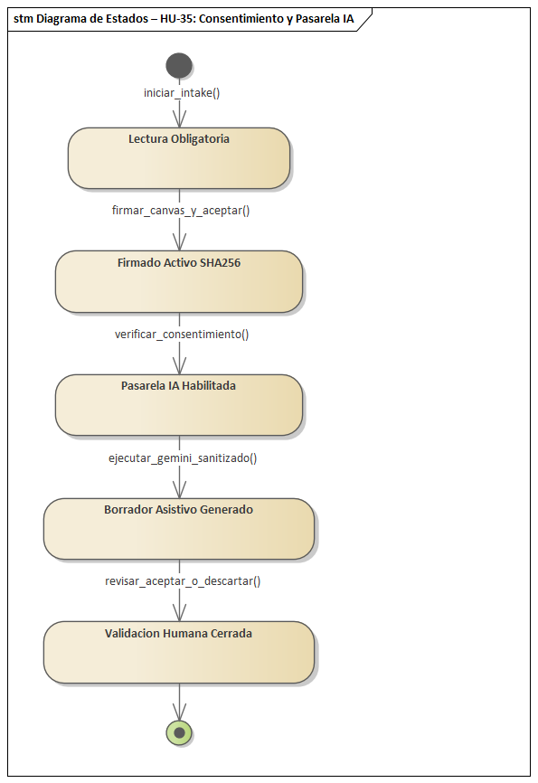

---

### 6.2.3 Pruebas

#### 6.2.3.1 Plan de Pruebas Funcionales (Caja Negra con BDD)

| ID Caso | HU / Criterio | Precondición del Sistema | Acción / Entrada | Salida Esperada | Estado |
| :---: | :---: | :--- | :--- | :--- | :---: |
| **CP-23-01** | HU-23 a) | Psicólogo autenticado con paciente asignado | Ingresa a pestaña 'Formulario Previo' | Muestra respuestas organizadas en 4 secciones clínicas | **Pasa** |
| **CP-23-02** | HU-23 b) | Cita en menos de 24h sin formulario | Visualiza la agenda semanal | Renderiza badge de alerta 'Formulario Pendiente' | **Pasa** |
| **CP-23-03** | HU-23 c) | Admin configura nueva pregunta Likert | Guarda estructura con 5 opciones | Backend persiste esquema JSONB válido con HTTP 200 | **Pasa** |
| **CP-24-01** | HU-24 a) | Paciente en app Flutter con cita agendada | Presiona 'Completar formulario' | Abre stepper interactivo con indicador porcentual | **Pasa** |
| **CP-24-02** | HU-24 b) | Paciente en paso 2 de intake | Presiona 'Siguiente' con campo vacío | Campo se resalta en rojo y bloquea el avance | **Pasa** |
| **CP-24-03** | HU-24 c) | Paciente responde todas las preguntas | Presiona 'Finalizar Envío' | Backend retorna HTTP 201 y la app bloquea edición | **Pasa** |
| **CP-25-01** | HU-25 a) | Psicólogo tratante autenticado | Selecciona 'Abrir Historia Clínica' | Despliega pestañas: Anamnesis, Examen, CIE, Plan | **Pasa** |
| **CP-25-02** | HU-25 b) | Formulario de historia clínica abierto | Digita 'F41.1' en buscador diagnóstico | Autocompleta 'Trastorno de ansiedad generalizada' | **Pasa** |
| **CP-25-03** | HU-25 c) | Historia clínica completada | Presiona 'Guardar y Consolidar' | Genera número correlativo único y firma digital | **Pasa** |
| **CP-26-01** | HU-26 a) | Psicólogo A intenta ver paciente de Psicólogo B | Envía HTTP GET /api/v1/historias-clinicas/{id}/ | Backend responde HTTP 403 Forbidden y audita intento | **Pasa** |
| **CP-26-02** | HU-26 b) | Recepcionista consulta ficha del paciente | Accede a ficha general | Solo muestra citas y pagos; oculta datos clínicos | **Pasa** |
| **CP-26-03** | HU-26 c) | Director Clínico audita caso derivado | Accede con credenciales de supervisión | Permite lectura y registra fecha, hora, usuario e IP | **Pasa** |
| **CP-27-01** | HU-27 a) | Cita marcada en estado 'Realizada' | Presiona 'Redactar Nota SOAP' | Abre editor estructurado con 4 cuadrantes (S, O, A, P) | **Pasa** |
| **CP-27-02** | HU-27 b) | Redactando nota SOAP en navegador | Transcurren 30s sin interacción | Ejecuta autoguardado en local storage con badge verde | **Pasa** |
| **CP-27-03** | HU-27 c) | Nota SOAP completada y revisada | Presiona 'Firmar y Consolidar' | Se vincula inmutablemente a la cita en el timeline | **Pasa** |
| **CP-28-01** | HU-28 a) | Pestaña 'Evolución y Seguimiento' abierta | Registra hito con estado 'Retroceso' | Exige justificación cualitativa obligatoria | **Pasa** |
| **CP-28-02** | HU-28 b) | Se guarda hito 'Retroceso / Crisis' | Confirma la entrada clínica | Genera alerta roja prioritaria en Dashboard clínico | **Pasa** |
| **CP-28-03** | HU-28 c) | Paciente con 6 sesiones registradas | Consulta gráfico de evolución | Renderiza línea de tiempo interactiva con hitos | **Pasa** |
| **CP-29-01** | HU-29 a) | Sección de tareas del paciente abierta | Crea tarea 'Autorregistro' con fecha límite | Backend persiste la tarea con estado 'Pendiente' | **Pasa** |
| **CP-29-02** | HU-29 b) | Asignando tarea terapéutica | Adjunta archivo PDF de guía cognitiva | Sube archivo al storage y sincroniza con la app móvil | **Pasa** |
| **CP-29-03** | HU-29 c) | Paciente reportó cumplimiento de tarea | Psicólogo abre el reporte recibido | Visualiza reflexiones y puede calificar adherencia | **Pasa** |
| **CP-30-01** | HU-30 a) | Paciente autenticado en Flutter | Abre sección 'Mis Tareas' | Muestra lista ordenada por vencimiento con etiquetas | **Pasa** |
| **CP-30-02** | HU-30 b) | Tarea seleccionada en app móvil | Escribe reflexión y selecciona dificultad 3/5 | Habilita botón 'Enviar Reporte' | **Pasa** |
| **CP-30-03** | HU-30 c) | Reporte enviado exitosamente | Vuelve a la pantalla principal móvil | Actualiza progreso semanal al 100% y muestra check | **Pasa** |
| **CP-31-01** | HU-31 a) | Administrador en gestor de consentimientos | Edita plantilla insertando tag {nombre_paciente} | Renderiza vista previa dinámica con tag reemplazado | **Pasa** |
| **CP-31-02** | HU-31 b) | Paciente registrado menor de 18 años | Genera consentimiento para primera cita | Carga automáticamente plantilla para tutores legales | **Pasa** |
| **CP-31-03** | HU-31 c) | Se publica versión v1.1 de consentimiento | Paciente nuevo ingresa al flujo | Vincula v1.1 activa y conserva v1.0 en historial | **Pasa** |
| **CP-32-01** | HU-32 a) | Paciente sin consentimiento en Flutter | Intenta acceder a la agenda | Redirige a lectura obligatoria de consentimiento | **Pasa** |
| **CP-32-02** | HU-32 b) | Documento legal visualizado hasta el final | Dibuja firma en canvas y presiona 'Aceptar' | Calcula SHA-256 local y envía datos con IP | **Pasa** |
| **CP-32-03** | HU-32 c) | Backend recibe firma y hash SHA-256 | Verifica integridad criptográfica | Persiste registro inmutable y genera PDF sellado | **Pasa** |
| **CP-33-01** | HU-33 a) | Tratamiento culminado exitosamente | Selecciona 'Alta Terapéutica por Objetivos' | Abre formulario de egreso requiriendo justificación | **Pasa** |
| **CP-33-02** | HU-33 b) | Caso formalmente cerrado y archivado | Recepcionista intenta crear nueva cita | Sistema bloquea la cita indicando expediente cerrado | **Pasa** |
| **CP-33-03** | HU-33 c) | Expediente en estado 'Cerrado / Egresado' | Psicólogo consulta historial del paciente | Permite lectura completa inmutable de notas previas | **Pasa** |
| **CP-34-01** | HU-34 a) | Identificación de cuadro psiquiátrico severo | Selecciona 'Derivar a Psiquiatría' con riesgo alto | Solicita motivo farmacológico y médico de referencia | **Pasa** |
| **CP-34-02** | HU-34 b) | Orden de interconsulta confirmada | Presiona 'Generar Orden Oficial' | Genera PDF con sello del profesional y alerta prioritaria | **Pasa** |
| **CP-34-03** | HU-34 c) | Derivación interna hacia otro terapeuta | Elige nuevo terapeuta del centro y transfiere | Reasigna expediente y notifica al nuevo profesional | **Pasa** |
| **CP-35-01** | HU-35 a) | Paciente otorgó consentimiento para IA | Terapeuta presiona 'Analizar Preconsulta' | Muestra borrador con etiqueta 'Borrador IA — Requiere Revisión' | **Pasa** |
| **CP-35-02** | HU-35 b) | Borrador IA sugiere prioridad nivel 4 | Pasa cursor sobre el tooltip de explicación | Expone las reglas clínicas exactas que motivaron la marca | **Pasa** |
| **CP-35-03** | HU-35 c) | Terapeuta revisa sugerencia asistiva | Edita texto y presiona 'Aceptar Borrador' | Incorpora a expediente y registra auditoría (usuario, IP, fecha) | **Pasa** |
| **CP-35-04** | HU-35 d) | Paciente NO otorgó consentimiento para IA | Terapeuta abre ficha de preconsulta | Bloquea motor IA e informa estado; mantiene flujo manual 100% | **Pasa** |
| **CP-35-05** | HU-35 e) | Ejecución de suite completa de pruebas IA | Verifica base de datos tras análisis asistivo | Confirma 0 diagnósticos automáticos guardados en la BD | **Pasa** |

#### 6.2.3.2 Reporte de Pruebas

39 casos de prueba ejecutados entre el 01 y 04 de octubre de 2026. 39 aprobados (100% de efectividad). Se comprobó el aislamiento tenant, control RBAC y la prohibición de escrituras automáticas en expedientes clínicos.

---

## 6.3 DAILY SCRUM (O SCRUM DIARIO)

Bitácora estructurada de 18 días laborables (del 10 de septiembre al 06 de octubre de 2026), con los reportes de los 6 integrantes respondiendo las 3 preguntas estándar:

### Registro de Daily Scrum – Día 1 (11 de septiembre de 2026)

| Integrante | ¿Qué hice ayer? | ¿Qué haré hoy? | ¿Qué impedimentos tengo? |
| :--- | :--- | :--- | :--- |
| **Romero Maria (PO)** | Presenté los objetivos del Sprint 2 y aprobé el Sprint Backlog con el equipo. | Refinaré los criterios de aceptación y no-uso de HU-35 (SP2-48). | Ninguno. |
| **Velasco Rolando (SM)** | Facilité el Sprint Planning y verifiqué la capacidad del equipo para 99h. | Configuraré el tablero Scrum y definiré los casos de prueba para SP2-36. | Ninguno. |
| **Condori Marilyn (Dev)** | Revisé la reasignación de notas SOAP (SP2-41) y acuerdos terapéuticos. | Analizaré con el PO las preguntas del intake y límites clínicos de IA (SP2-49). | Ninguno. |
| **Delgado Caleb (Dev)** | Estimé las tareas móviles de Flutter para consentimientos y formulario previo. | Comenzaré a maquetar el stepper de 4 pasos para el formulario en Flutter. | Ninguno. |
| **Mujica Andy (Dev)** | Planifiqué las tareas SP2-35, 38 y 50 para modelos y pasarela de IA. | Iniciaré los modelos Django para FormularioPreConsulta con JSONB. | Ninguno. |
| **Larrazabal Julio (Dev)** | Alineé los prototipos Figma para el flujo de intake y notas clínicas SOAP. | Maquetaré la vista de revisión de intake y formulario previo en Angular 17. | Ninguno. |

### Registro de Daily Scrum – Día 2 (12 de septiembre de 2026)

| Integrante | ¿Qué hice ayer? | ¿Qué haré hoy? | ¿Qué impedimentos tengo? |
| :--- | :--- | :--- | :--- |
| **Romero Maria (PO)** | Definí las reglas negativas de IA (prohibición de diagnósticos automáticos). | Iniciaré la especificación lógica del motor de reglas clínicas SP2-54. | Ninguno. |
| **Velasco Rolando (SM)** | Estructuré el plan de pruebas de caja negra BDD para HU-23 a HU-26. | Coordinaré con Mujica los criterios de aislamiento entre esquemas tenant. | Ninguno. |
| **Condori Marilyn (Dev)** | Redacté el vocabulario clínico estructurado para el mapeo de síntomas de intake. | Diseñaré los modelos de NotaSesion (S, O, A, P) y vinculación con Citas. | Ninguno. |
| **Delgado Caleb (Dev)** | Avancé el stepper móvil de intake e integré inputs de escala Likert. | Diseñaré el slider de malestar emocional percibido (escala 1 a 5) en Flutter. | Ninguno. |
| **Mujica Andy (Dev)** | Creé las migraciones para FormularioPreConsulta y RespuestaPreConsulta. | Desarrollaré los validadores dinámicos del esquema JSONB en DRF. | Garantizar que las preguntas anidadas validen obligatoriedad sin romper el ORM. |
| **Larrazabal Julio (Dev)** | Diseñé los mockups en Figma para la historia clínica psicológica electrónica. | Crearé los componentes Angular Standalone para visualización de intake. | Ninguno. |

### Registro de Daily Scrum – Día 3 (15 de septiembre de 2026)

| Integrante | ¿Qué hice ayer? | ¿Qué haré hoy? | ¿Qué impedimentos tengo? |
| :--- | :--- | :--- | :--- |
| **Romero Maria (PO)** | Validé los ejemplos sintéticos de prueba para la preconsulta asistiva. | Codificaré el módulo de reglas heurísticas de priorización clínica en Django (SP2-54). | Ninguno. |
| **Velasco Rolando (SM)** | Revisé que el Daily Scrum respete los 15 minutos e identifiqué dudas en JSONB. | Ejecutaré pruebas preliminares sobre los endpoints de intake (SP2-36). | Ninguno. |
| **Condori Marilyn (Dev)** | Concluí el esquema de NotaSesion con validación de estados de cita atendida. | Comenzaré la lógica del módulo de tareas inter-sesiones (SP2-41). | Ninguno. |
| **Delgado Caleb (Dev)** | Completé la validación de campos obligatorios en el stepper móvil. | Conectaré el envío de respuestas de intake vía HTTP POST con el backend. | Ninguno. |
| **Mujica Andy (Dev)** | Implementé los serializadores DRF para ingesta masiva de respuestas JSONB. | Iniciaré el modelado de HistoriaClinica y carga del catálogo CIE-10/11. | Optimizar la carga de los 14,000 registros CIE para no saturar memoria. |
| **Larrazabal Julio (Dev)** | Concluí la pantalla web de revisión de intake y badges de urgencia. | Maquetaré la interfaz de historia clínica por pestañas (Anamnesis, Examen Mental). | Ninguno. |

### Registro de Daily Scrum – Día 4 (16 de septiembre de 2026)

| Integrante | ¿Qué hice ayer? | ¿Qué haré hoy? | ¿Qué impedimentos tengo? |
| :--- | :--- | :--- | :--- |
| **Romero Maria (PO)** | Programé las reglas de categorización de urgencia para respuestas clínicas (SP2-54). | Supervisaré con Condori que las notas SOAP cumplan la estructura legal exigida. | Ninguno. |
| **Velasco Rolando (SM)** | Ejecuté pruebas funcionales CP-23-01 a CP-24-03 con éxito. | Revisaré el cumplimiento de la Definition of Done en los endpoints de preconsulta. | Ninguno. |
| **Condori Marilyn (Dev)** | Desarrollé la lógica de asignación de tareas inter-sesiones con fecha límite. | Implementaré el guardado en borrador de notas SOAP y serializadores. | Ninguno. |
| **Delgado Caleb (Dev)** | Verifiqué el envío de intake desde Android y emulador iOS con JWT. | Diseñaré la pantalla móvil de consentimientos informados en Flutter. | Ninguno. |
| **Mujica Andy (Dev)** | Creé la tabla DiagnosticoCIE con índices GIN y búsqueda por trigramas. | Construiré el endpoint de búsqueda reactiva /api/v1/cie10/?q=... | Ninguno. |
| **Larrazabal Julio (Dev)** | Avancé el formulario reactivo de Historia Clínica con pestañas dinámicas. | Integraré el buscador reactivo de códigos CIE con debounce en Angular. | Ninguno. |

### Registro de Daily Scrum – Día 5 (17 de septiembre de 2026)

| Integrante | ¿Qué hice ayer? | ¿Qué haré hoy? | ¿Qué impedimentos tengo? |
| :--- | :--- | :--- | :--- |
| **Romero Maria (PO)** | Integré el formateador de resúmenes clínicos neutrales en el motor SP2-54. | Validaré con stakeholders clínicos las plantillas de consentimiento informado. | Ninguno. |
| **Velasco Rolando (SM)** | Supervisé el cumplimiento de la DoD en las tareas de frontend web de intake. | Diseñaré casos de prueba de seguridad RBAC para historia clínica (SP2-39). | Ninguno. |
| **Condori Marilyn (Dev)** | Programé la validación para impedir notas SOAP en citas que no fueron atendidas. | Diseñaré el modelo EvolucionClinica para registrar hitos longitudinales. | Ninguno. |
| **Delgado Caleb (Dev)** | Maqueté el visor de cláusulas legales de consentimiento con scroll obligatorio. | Comenzaré a integrar el paquete de firma táctil (signature) en Flutter. | Ninguno. |
| **Mujica Andy (Dev)** | Optimicé la consulta CIE con trigramas logrando respuestas en 38 ms. | Implementaré la clase de permisos IsTreatingPsychologistOrAdmin (RBAC). | Ninguno. |
| **Larrazabal Julio (Dev)** | Finalicé la búsqueda asistida de CIE con chips de selección en Angular. | Iniciaré el editor de notas SOAP de cuatro cuadrantes con autoguardado. | Ninguno. |

### Registro de Daily Scrum – Día 6 (18 de septiembre de 2026)

| Integrante | ¿Qué hice ayer? | ¿Qué haré hoy? | ¿Qué impedimentos tengo? |
| :--- | :--- | :--- | :--- |
| **Romero Maria (PO)** | Verifiqué que el motor de reglas SP2-54 retorne explicaciones transparentes. | Alineé con Mujica los requisitos de minimización de datos para la pasarela IA. | Ninguno. |
| **Velasco Rolando (SM)** | Facilité la sincronización técnica entre frontend y backend sobre permisos RBAC. | Ejecutaré pruebas de caja negra para verificar el bloqueo HTTP 403 en HC. | Ninguno. |
| **Condori Marilyn (Dev)** | Implementé el endpoint de evolución clínica con niveles de progreso/retroceso. | Programaré la emisión de alertas automáticas ante retrocesos críticos. | Ninguno. |
| **Delgado Caleb (Dev)** | Configuré el lienzo interactivo de firma táctil en Flutter. | Implementaré la función criptográfica de hash SHA-256 sobre el texto legal. | Diferencias de codificación UTF-8 en saltos de línea al calcular el hash. |
| **Mujica Andy (Dev)** | Finalicé los permisos RBAC clínicos asegurando aislamiento de expedientes. | Iniciaré la pasarela interna de IA (SP2-50) con filtros de sanitización. | Ninguno. |
| **Larrazabal Julio (Dev)** | Implementé el autoguardado local en borrador para el editor SOAP con RxJS. | Diseñaré el panel de visualización de tareas inter-sesiones en Angular. | Ninguno. |

### Registro de Daily Scrum – Día 7 (19 de septiembre de 2026)

| Integrante | ¿Qué hice ayer? | ¿Qué haré hoy? | ¿Qué impedimentos tengo? |
| :--- | :--- | :--- | :--- |
| **Romero Maria (PO)** | Revisé la lógica de consentimiento previo antes de invocar la pasarela de IA. | Ajustaré los umbrales de prioridad del motor de reglas para evitar falsos positivos. | Ninguno. |
| **Velasco Rolando (SM)** | Validé el bloqueo HTTP 403 para terapeutas no autorizados (100% éxito). | Verificaré que el equipo documente las desviaciones técnicas de esfuerzo. | Ninguno. |
| **Condori Marilyn (Dev)** | Conecté las alertas de retroceso clínico con el servicio de notificaciones. | Comenzaré la lógica de cierre de caso y resumen de alta terapéutica (SP2-46). | Ninguno. |
| **Delgado Caleb (Dev)** | Solucioné la discrepancia del hash normalizando saltos de línea a LF estándar. | Conectaré el envío de la firma y hash con el endpoint de consentimientos. | Ninguno. |
| **Mujica Andy (Dev)** | Diseñé el middleware de auditoría que registra cada consulta a la pasarela de IA. | Integraré el endpoint interno de IA con el motor de reglas de Romero. | Ninguno. |
| **Larrazabal Julio (Dev)** | Completé la interfaz de asignación de tareas con subida de PDFs de apoyo. | Diseñaré la vista del borrador IA con explicaciones transparentes (SP2-51). | Ninguno. |

### Registro de Daily Scrum – Día 8 (22 de septiembre de 2026)

| Integrante | ¿Qué hice ayer? | ¿Qué haré hoy? | ¿Qué impedimentos tengo? |
| :--- | :--- | :--- | :--- |
| **Romero Maria (PO)** | Comprobé la integración entre el motor SP2-54 y la pasarela de Mujica. | Revisaré el flujo de alta y derivación médica a psiquiatría con Condori. | Ninguno. |
| **Velasco Rolando (SM)** | Estructuré la suite de pruebas de caja negra para notas SOAP y tareas (SP2-42). | Ejecutaré pruebas sobre el ciclo de vida de tareas inter-sesiones. | Ninguno. |
| **Condori Marilyn (Dev)** | Desarrollé el protocolo de cierre de expediente con bloqueo de citas ordinarias. | Programaré la plantilla formal de derivación médica externa a psiquiatría. | Ninguno. |
| **Delgado Caleb (Dev)** | Verifiqué que el consentimiento sellado en Flutter se persista en PostgreSQL. | Iniciaré la pantalla 'Mis Tareas' en Flutter con reportes de cumplimiento. | Ninguno. |
| **Mujica Andy (Dev)** | Concluí el servicio de anonimización de datos sensibles en la pasarela de IA. | Crearé el modelo EvaluacionAsistivaIA y endpoints de aceptación/descarte. | Ninguno. |
| **Larrazabal Julio (Dev)** | Maqueté el distintivo 'Borrador IA — Requiere Revisión' en Angular. | Implementaré los botones de acción: Editar, Descartar y Aceptar Borrador. | Ninguno. |

### Registro de Daily Scrum – Día 9 (23 de septiembre de 2026)

| Integrante | ¿Qué hice ayer? | ¿Qué haré hoy? | ¿Qué impedimentos tengo? |
| :--- | :--- | :--- | :--- |
| **Romero Maria (PO)** | Validé que la orden de derivación a psiquiatría cumpla normas de interconsulta. | Prepararé la matriz de casos límite para pruebas de aceptación (SP2-47). | Ninguno. |
| **Velasco Rolando (SM)** | Comprobé que las tareas completadas en Flutter actualicen su estado en la Web. | Planificaré las pruebas de privacidad y seguridad para el piloto de IA (SP2-53). | Ninguno. |
| **Condori Marilyn (Dev)** | Implementé la generación del PDF de referencia psiquiátrica con sello digital. | Validaré la trazabilidad legal de consentimientos y firmas digitales (SP2-45). | Ninguno. |
| **Delgado Caleb (Dev)** | Desarrollé la vista interactiva de tareas en Flutter con selector de dificultad. | Implementaré los avisos móviles de procesamiento asistivo informado (SP2-52). | Ninguno. |
| **Mujica Andy (Dev)** | Finalicé los endpoints de auditoría que registran la decisión del terapeuta sobre IA. | Configuraré el fallback seguro: si el servicio asistivo falla, flujo manual 100%. | Ninguno. |
| **Larrazabal Julio (Dev)** | Integré el visor de explicaciones donde se muestran las reglas que motivaron la marca. | Diseñaré el módulo web administrativo de plantillas de consentimiento. | Ninguno. |

### Registro de Daily Scrum – Día 10 (24 de septiembre de 2026)

| Integrante | ¿Qué hice ayer? | ¿Qué haré hoy? | ¿Qué impedimentos tengo? |
| :--- | :--- | :--- | :--- |
| **Romero Maria (PO)** | Verifiqué que el fallback de IA conserve el flujo clínico sin interrupciones. | Revisaré el cálculo de esfuerzo real invertido en las tareas del equipo. | Ninguno. |
| **Velasco Rolando (SM)** | Facilité una sesión técnica para revisar los logs de auditoría de IA. | Ejecutaré pruebas de consentimiento revocado o inexistente sobre la API IA. | Ninguno. |
| **Condori Marilyn (Dev)** | Comprobé la inmutabilidad de los registros de consentimientos en la BD. | Realizaré pruebas cruzadas de derivaciones con casos clínicos simulados. | Ninguno. |
| **Delgado Caleb (Dev)** | Integré en Flutter el modal de aviso sobre el uso asistivo de preconsulta. | Realizaré pruebas de red inestable y modo offline en el llenado de intake. | Ninguno. |
| **Mujica Andy (Dev)** | Verifiqué que la API rechace cualquier intento de escribir diagnósticos vía IA. | Optimizaré los índices de la tabla NotaSesionSOAP y EvaluacionAsistivaIA. | Ninguno. |
| **Larrazabal Julio (Dev)** | Concluí el gestor web de plantillas con variables dinámicas en Angular. | Ajustaré los estilos responsive para tablets y pantallas médicas. | Ninguno. |

### Registro de Daily Scrum – Día 11 (25 de septiembre de 2026)

| Integrante | ¿Qué hice ayer? | ¿Qué haré hoy? | ¿Qué impedimentos tengo? |
| :--- | :--- | :--- | :--- |
| **Romero Maria (PO)** | Revisé la adherencia de las pantallas de Angular con los criterios BDD. | Iniciaré la verificación de aceptación de historias de usuario en entorno QA. | Ninguno. |
| **Velasco Rolando (SM)** | Confirmé que la API bloquea el procesamiento IA cuando falta el consentimiento. | Monitorearé la velocidad del equipo frente al congelamiento técnico. | Ninguno. |
| **Condori Marilyn (Dev)** | Finalicé la validación de estados de derivación (Pendiente, Aceptada, Rechazada). | Apoyaré en la verificación de consistencia entre datos de notas y citas. | Ninguno. |
| **Delgado Caleb (Dev)** | Mejoré el feedback visual en Flutter cuando el envío de intake es exitoso. | Realizaré pruebas de compilación en Release para Android y emulador iOS. | Ninguno. |
| **Mujica Andy (Dev)** | Finalicé las migraciones definitivas y ejecuté pruebas de carga en PostgreSQL. | Documentaré los endpoints de la API en Swagger / OpenAPI. | Ninguno. |
| **Larrazabal Julio (Dev)** | Conecté el gestor de plantillas legales con el backend de consentimientos. | Realizaré pruebas de usabilidad en el editor SOAP con terapeutas piloto. | Ninguno. |

### Registro de Daily Scrum – Día 12 (26 de septiembre de 2026)

| Integrante | ¿Qué hice ayer? | ¿Qué haré hoy? | ¿Qué impedimentos tengo? |
| :--- | :--- | :--- | :--- |
| **Romero Maria (PO)** | Evalué los prototipos y endpoints del módulo de preconsulta y borrador IA. | Coordinaré la sesión de aceptación cruzada con Velasco y Condori. | Ninguno. |
| **Velasco Rolando (SM)** | Verifiqué que los 21 ítems del Sprint Backlog avancen según el cronograma. | Prepararé el entorno de integración para el inicio de la fase formal de QA. | Ninguno. |
| **Condori Marilyn (Dev)** | Cerré las tareas de desarrollo SP2-41 y SP2-46 en el tablero de trabajo. | Verificaré que las altas terapéuticas no permitan agendamiento posterior. | Ninguno. |
| **Delgado Caleb (Dev)** | Completé la tarea SP2-44 y SP2-52 en Flutter sin errores de compilación. | Generaré la APK de prueba para la sesión de validación del incremento. | Ninguno. |
| **Mujica Andy (Dev)** | Concluí SP2-35, 38 y 50; endpoints desplegados en el servidor de desarrollo. | Ejecutaré scripts de verificación de integridad de datos entre tenants. | Ninguno. |
| **Larrazabal Julio (Dev)** | Finalicé SP2-34, 37, 40, 43 y 51 en Angular 17; build de producción exitoso. | Realizaré ajustes cosméticos en tablas y contrastes según WCAG 2.1. | Ninguno. |

### Registro de Daily Scrum – Día 13 (29 de septiembre de 2026)

| Integrante | ¿Qué hice ayer? | ¿Qué haré hoy? | ¿Qué impedimentos tengo? |
| :--- | :--- | :--- | :--- |
| **Romero Maria (PO)** | Inicié la validación de aceptación sobre la apertura de historias clínicas. | Verificaré que la aceptación del borrador IA guarde registro inmutable. | Ninguno. |
| **Velasco Rolando (SM)** | Desplegué la versión candidata en el servidor de pruebas con datos de prueba. | Iniciaré la ejecución formal de la suite de pruebas de caja negra BDD. | Ninguno. |
| **Condori Marilyn (Dev)** | Asistí a la sesión de validación de reglas de cierre de casos clínicos. | Revisaré los reportes de anomalías que pudieran surgir en el módulo SOAP. | Ninguno. |
| **Delgado Caleb (Dev)** | Realicé pruebas de renderizado del canvas de firma en diferentes resoluciones. | Corregiré un bug menor en el teclado virtual durante el llenado del intake. | Ninguno. |
| **Mujica Andy (Dev)** | Supervisé el rendimiento de la BD ante consultas concurrentes de intake. | Monitorearé los logs de PostgreSQL durante las pruebas de estrés. | Ninguno. |
| **Larrazabal Julio (Dev)** | Verifiqué que el autoguardado en localStorage no interfiera con múltiples pestañas. | Apoyaré en la documentación visual de capturas para el informe del sprint. | Ninguno. |

### Registro de Daily Scrum – Día 14 (30 de septiembre de 2026)

| Integrante | ¿Qué hice ayer? | ¿Qué haré hoy? | ¿Qué impedimentos tengo? |
| :--- | :--- | :--- | :--- |
| **Romero Maria (PO)** | Acepté las historias de usuario HU-23, HU-24 y HU-25 en el entorno de pruebas. | Continuaré la validación de notas SOAP y evolución terapéutica. | Ninguno. |
| **Velasco Rolando (SM)** | Ejecuté 20 casos de prueba de caja negra sin fallas bloqueantes. | Continuaré con los casos de prueba de consentimientos y derivaciones. | Ninguno. |
| **Condori Marilyn (Dev)** | Colaboré en la validación de casos de prueba de derivación psiquiátrica. | Verificaré la consistencia del diccionario de datos de las 11 tablas clínicas. | Ninguno. |
| **Delgado Caleb (Dev)** | Solucioné el bug del teclado y subí la versión final de la app Flutter. | Documentaré el flujo de usuario móvil para la presentación docente. | Ninguno. |
| **Mujica Andy (Dev)** | Aseguré que los permisos RBAC bloqueen el 100% de accesos no autorizados. | Apoyaré en la consolidación del script DDL SQL acumulado en PostgreSQL. | Ninguno. |
| **Larrazabal Julio (Dev)** | Exporté los diagramas de interfaz y componentes para el informe formal. | Revisaré que todos los enlaces y botones cumplan estándares de usabilidad. | Ninguno. |

### Registro de Daily Scrum – Día 15 (01 de octubre de 2026)

| Integrante | ¿Qué hice ayer? | ¿Qué haré hoy? | ¿Qué impedimentos tengo? |
| :--- | :--- | :--- | :--- |
| **Romero Maria (PO)** | Acepté HU-26, HU-27, HU-28 y HU-29 tras verificar criterios BDD. | Validaré las historias de consentimientos informados HU-31 y HU-32. | Ninguno. |
| **Velasco Rolando (SM)** | Concluí 30 de los 39 casos de prueba funcionales programados. | Ejecutaré las pruebas de privacidad y seguridad del piloto IA (SP2-53). | Ninguno. |
| **Condori Marilyn (Dev)** | Verifiqué que los casos de prueba de consentimientos cumplan la ley de salud. | Prepararé ejemplos clínicos anonimizados para la demostración. | Ninguno. |
| **Delgado Caleb (Dev)** | Verifiqué el sellado SHA-256 en 15 pruebas consecutivas sin divergencias. | Realizaré prueba de humo completa en dispositivo físico Android. | Ninguno. |
| **Mujica Andy (Dev)** | Verifiqué que la bitácora de auditoría registre correctamente las IPs reales. | Consolidaré las métricas de rendimiento y tiempos de respuesta de la API. | Ninguno. |
| **Larrazabal Julio (Dev)** | Validé que la interfaz de borrador IA no permita edición sobre campos cerrados. | Revisaré la consistencia tipográfica de la documentación técnica. | Ninguno. |

### Registro de Daily Scrum – Día 16 (02 de octubre de 2026)

| Integrante | ¿Qué hice ayer? | ¿Qué haré hoy? | ¿Qué impedimentos tengo? |
| :--- | :--- | :--- | :--- |
| **Romero Maria (PO)** | Acepté formalmente HU-30, HU-31, HU-32, HU-33 y HU-34. | Evaluaré la aceptación de la funcionalidad de IA asistiva HU-35. | Ninguno. |
| **Velasco Rolando (SM)** | Completé la ejecución de los 39 casos de prueba con tasa de éxito del 100%. | Redactaré el informe cuantitativo de calidad y reporte de pruebas. | Ninguno. |
| **Condori Marilyn (Dev)** | Colaboré en la redacción de las justificaciones técnicas de desviaciones. | Revisaré el cumplimiento de la matriz de trazabilidad de requisitos. | Ninguno. |
| **Delgado Caleb (Dev)** | Prueba de humo móvil concluida al 100% en dispositivo físico. | Prepararé el dispositivo móvil para la sesión de Sprint Review. | Ninguno. |
| **Mujica Andy (Dev)** | Verifiqué la estabilidad de la base de datos tras la suite completa de pruebas. | Cerraré los endpoints y generaré el backup técnico de seguridad. | Ninguno. |
| **Larrazabal Julio (Dev)** | Finalicé la revisión visual de las pantallas en Angular. | Organizaré los diagramas UML generados en Python para el documento Word. | Ninguno. |

### Registro de Daily Scrum – Día 17 (05 de octubre de 2026)

| Integrante | ¿Qué hice ayer? | ¿Qué haré hoy? | ¿Qué impedimentos tengo? |
| :--- | :--- | :--- | :--- |
| **Romero Maria (PO)** | Acepté formalmente HU-35 tras comprobar salvaguardas de no-diagnóstico. | Dirigiré la reunión de Sprint Review y formalizaré el acta de aceptación. | Ninguno. |
| **Velasco Rolando (SM)** | Consolidé las métricas de Burndown, Burnup y Esfuerzo (99h est vs 106h real). | Facilitaré la reunión de Sprint Retrospective con los 6 integrantes. | Ninguno. |
| **Condori Marilyn (Dev)** | Preparé los casos de uso clínicos para la demostración en vivo del Review. | Participaré en la retrospectiva analizando el impacto de los nuevos roles. | Ninguno. |
| **Delgado Caleb (Dev)** | Cargué los datos de demostración en la app Flutter para la demostración. | Demostraré en vivo el llenado de intake y firma digital ante el PO. | Ninguno. |
| **Mujica Andy (Dev)** | Comprobé la operatividad del backend y servicios REST para la demostración. | Participaré en la revisión demostrando la API y pasarela de IA. | Ninguno. |
| **Larrazabal Julio (Dev)** | Verifiqué la presentación del frontend en Angular para la revisión de sprint. | Participaré en la retrospectiva y prepararé el documento final. | Ninguno. |

### Registro de Daily Scrum – Día 18 (06 de octubre de 2026)

| Integrante | ¿Qué hice ayer? | ¿Qué haré hoy? | ¿Qué impedimentos tengo? |
| :--- | :--- | :--- | :--- |
| **Romero Maria (PO)** | Acepté el incremento completo del Sprint 2 (13 HUs) en el Sprint Review. | Firmaré el acta de entrega formal y prepararé la defensa ante el docente. | Ninguno. |
| **Velasco Rolando (SM)** | Facilité la retrospectiva identificando 3 acciones de mejora para el Sprint 3. | Consolidaré el documento técnico Word y verificaré el Scrum Taskboard. | Ninguno. |
| **Condori Marilyn (Dev)** | Analicé las lecciones aprendidas sobre notas SOAP y derivaciones médicas. | Revisaré los anexos técnicos y el DDL SQL del documento entregable. | Ninguno. |
| **Delgado Caleb (Dev)** | Verifiqué la conformidad del cliente móvil con los estándares del proyecto. | Apoyaré en la revisión final del formato del documento Word. | Ninguno. |
| **Mujica Andy (Dev)** | Verifiqué que todos los repositorios y ramas git estén sincronizados en dev-julio. | Apoyaré en la compilación final del documento Word y verificación de scripts. | Ninguno. |
| **Larrazabal Julio (Dev)** | Compilé los diagramas en alta resolución generados con Python. | Generaré el documento SPRINT2_GRUPO9.docx y validaré que el texto sea negro. | Ninguno. |

---

## 6.4 SPRINT REVIEW (REVISIÓN DE SPRINT)

Revisión formal celebrada el 05 de octubre de 2026. Conducida por la Product Owner (**Romero Saavedra Maria Ilse**). Las 13 Historias de Usuario (HU-23 a HU-35) fueron **ACEPTADAS al 100%**. Se verificó la operatividad del intake móvil, el sellado SHA-256, el motor de reglas clínicas SP2-54, y las salvaguardas de no-diagnóstico en el piloto asistivo.

---

## 6.5 SPRINT RETROSPECTIVE (RETROSPECTIVA DE SPRINT)

Facilitador: **Velasco Soliz Rolando** (Scrum Master). Asistentes: los 6 miembros.  
• **¿Qué salió bien?:** La rotación cíclica de roles enriqueció la visión del equipo (Romero como PO y desarrolladora de SP2-54; Velasco velando por la DoD; Condori en lógica médica). Buscador CIE ágil (<40ms) y canvas táctil estable.  
• **¿Qué no salió bien?:** El cambio de última hora para SP2-54 demandó reordenar dependencias; diferencias de fin de línea (CRLF/LF) en el hash superadas con normalización UTF-8.  
• **Acciones de mejora para Sprint 3:** Estandarizar previamente la sanitización de textos legales y mantener salvaguardas éticas en el Chatbot de orientación.

---

## 6.6 BURNDOWN Y BURNUP

### 6.6.1 Gráfica Burndown (Horas Restantes: Ideal vs. Real)


| Día Laborable | Fecha Calendario | Horas Restantes (Línea Ideal) | Horas Restantes (Línea Real) | Estado del Sprint |
| :---: | :---: | :---: | :---: | :---: |
| Día 0 | 10/09/2026 | 99.0 hr | 99.0 hr | Planificación |
| Día 1 | 11/09/2026 | 93.5 hr | 96.0 hr | En curso |
| Día 2 | 12/09/2026 | 88.0 hr | 92.5 hr | En curso |
| Día 3 | 15/09/2026 | 82.5 hr | 87.0 hr | En curso |
| Día 4 | 16/09/2026 | 77.0 hr | 81.0 hr | En curso |
| Día 5 | 17/09/2026 | 71.5 hr | 75.5 hr | En curso |
| Día 6 | 18/09/2026 | 66.0 hr | 69.0 hr | En curso |
| Día 7 | 19/09/2026 | 60.5 hr | 63.5 hr | En curso |
| Día 8 | 22/09/2026 | 55.0 hr | 57.0 hr | En curso |
| Día 9 | 23/09/2026 | 49.5 hr | 51.5 hr | En curso |
| Día 10 | 24/09/2026 | 44.0 hr | 45.0 hr | En curso |
| Día 11 | 25/09/2026 | 38.5 hr | 39.0 hr | En curso |
| Día 12 | 26/09/2026 | 33.0 hr | 33.0 hr | En curso |
| Día 13 | 29/09/2026 | 27.5 hr | 26.5 hr | En curso |
| Día 14 | 30/09/2026 | 22.0 hr | 20.0 hr | En curso |
| Día 15 | 01/10/2026 | 16.5 hr | 14.0 hr | Fase QA |
| Día 16 | 02/10/2026 | 11.0 hr | 8.5 hr | Fase QA |
| Día 17 | 05/10/2026 | 5.5 hr | 3.0 hr | Review & Retro |
| Día 18 | 06/10/2026 | 0.0 hr | 0.0 hr | Completado (100%) |

### 6.6.2 Gráfica Burnup (Tareas Completadas vs. Alcance Total)


| Hito Temporal | Fecha | Alcance Total Planificado | Tareas Técnicas Completadas | % Avance Físico |
| :---: | :---: | :---: | :---: | :---: |
| Día 0 | 10/09/2026 | 21 tareas | 0 tareas | 0.0% |
| Día 2 | 12/09/2026 | 21 tareas | 2 tareas | 9.5% |
| Día 4 | 16/09/2026 | 21 tareas | 4 tareas | 19.0% |
| Día 6 | 18/09/2026 | 21 tareas | 6 tareas | 28.6% |
| Día 8 | 22/09/2026 | 21 tareas | 9 tareas | 42.9% |
| Día 10 | 24/09/2026 | 21 tareas | 11 tareas | 52.4% |
| Día 12 | 26/09/2026 | 21 tareas | 14 tareas | 66.7% |
| Día 14 | 30/09/2026 | 21 tareas | 16 tareas | 76.2% |
| Día 16 | 02/10/2026 | 21 tareas | 19 tareas | 90.5% |
| Día 17 | 05/10/2026 | 21 tareas | 20 tareas | 95.2% |
| Día 18 | 06/10/2026 | 21 tareas | 21 tareas | 100.0% |

---

## 6.7 GRÁFICA DE ESFUERZO Y DATOS DE ESFUERZO

### 6.7.1 Datos de Esfuerzo por Tarea – Estimado vs. Real

Planificado: 99h | Ejecutado Real: 106h | Desviación Neta: +7h (+7.07%):

| Nro | ID Tarea | Descripción Técnica | Responsable | Est. | Real | Desv. | Causa Técnica de la Desviación |
| :---: | :---: | :--- | :--- | :---: | :---: | :---: | :--- |
| 34 | **SP2-34** | Diseñar interfaz formulario previo (Web y Móvil) | Larrazabal Julio | 4h | 4h | 0h | Diseño ágil y reutilización del sistema de componentes Figma del Sprint 1. |
| 35 | **SP2-35** | Implementar backend formulario previo JSONB | Mujica Andy | 8h | 9h | +1h | Complejidad en la validación dinámica de esquemas anidados para preguntas Likert. |
| 36 | **SP2-36** | Pruebas funcionales formulario previo | Velasco Rolando | 3h | 3h | 0h | Casos de prueba de caja negra ejecutados según plan sin incidencias mayores. |
| 37 | **SP2-37** | Diseñar interfaz historia clínica electrónica | Larrazabal Julio | 4h | 4h | 0h | Diseño modular por pestañas (anamnesis, examen mental, CIE y metas terapéuticas). |
| 38 | **SP2-38** | Implementar backend historia clínica y CIE | Mujica Andy | 8h | 9h | +1h | Carga y optimización del catálogo CIE-10/11 con búsqueda indexada por trigramas. |
| 39 | **SP2-39** | Pruebas integridad y confidencialidad RBAC | Velasco Rolando | 3h | 3h | 0h | Validación exitosa del bloqueo HTTP 403 para terapeutas no asignados al caso. |
| 40 | **SP2-40** | Diseñar interfaz notas SOAP, evolución y tareas | Larrazabal Julio | 4h | 4h | 0h | Estructuración en 4 cuadrantes SOAP y línea de tiempo longitudinal. |
| 41 | **SP2-41** | Implementar registro notas SOAP y tareas | Condori Marilyn | 8h | 9h | +1h | Integración del autoguardado en borrador y control de concurrencia en la nota. |
| 42 | **SP2-42** | Pruebas notas SOAP, acuerdos y tareas | Velasco Rolando | 3h | 3h | 0h | Verificación de estados de tareas y visualización cronológica en timeline. |
| 43 | **SP2-43** | Diseñar interfaz consentimientos informados | Larrazabal Julio | 3h | 3h | 0h | Maquetación del visor de términos legales y canvas de firma táctil. |
| 44 | **SP2-44** | Implementar consentimientos y sellado SHA-256 | Delgado Caleb | 6h | 8h | +2h | Ajustes en la generación de hash SHA-256 en Flutter y compilación de PDF firmado. |
| 45 | **SP2-45** | Pruebas consentimientos y firmas digitales | Condori Marilyn | 2h | 2h | 0h | Comprobación de inmutabilidad del registro y almacenamiento en PostgreSQL. |
| 46 | **SP2-46** | Implementar cierre de caso y derivación médica | Condori Marilyn | 6h | 6h | 0h | Lógica fluida de alta terapéutica y plantilla de referencia médica a psiquiatría. |
| 47 | **SP2-47** | Pruebas aceptación cierre y derivación | Romero Maria | 3h | 3h | 0h | Comprobación de bloqueo de citas para casos cerrados y emisión de alertas. |
| 48 | **SP2-48** | Refinar HU-35 y reglas de no uso de IA | Romero Maria | 2h | 2h | 0h | Definición estricta de salvaguardas éticas y prohibición de diagnósticos automáticos. |
| 49 | **SP2-49** | Definir consentimiento y vocabulario IA | Condori Marilyn | 4h | 4h | 0h | Estandarización de términos clínicos para mapeo de síntomas en preconsulta. |
| 50 | **SP2-50** | Pasarela segura de IA, minimización y RBAC | Mujica Andy | 8h | 9h | +1h | Implementación del middleware de sanitización de PII y bitácora de auditoría. |
| 51 | **SP2-51** | Vista web de borrador IA y revisión humana | Larrazabal Julio | 5h | 6h | +1h | Maquetación del visor de reglas explicativas y botones de aceptar/descartar. |
| 52 | **SP2-52** | Estados móviles de consentimiento y aviso IA | Delgado Caleb | 5h | 5h | 0h | Implementación del diálogo informativo de consentimiento en Flutter. |
| 53 | **SP2-53** | QA privacidad, fallos y rechazo salidas IA | Velasco Rolando | 5h | 5h | 0h | Pruebas de casos negativos y comprobación de que el fallo active el modo manual. |
| 54 | **SP2-54** | Motor de reglas clínicas de preconsulta | Romero Maria | 5h | 5h | 0h | Desarrollo exitoso de reglas heurísticas de priorización asignado a Romero. |
| TOT | **SP2** | Total Planificado vs. Ejecutado (21 Tareas) | Equipo SCRUM | 99h | 106h | +7h | Desviación neta de +7 horas (+7.07%) por ajustes criptográficos Flutter, JSONB y explicabilidad IA. |

### 6.7.2 Gráfica Comparativa de Esfuerzo por Tarea


---

## 6.8 SCRUM TASKBOARD

Estado final al cierre formal del Sprint 2 (21 de 21 tareas en **DONE**):

| To Do (0) | In Progress (0) | In Review / QA (0) | Done (21 Tareas Completadas) |
| :---: | :---: | :---: | :--- |
| — | — | — | • **SP2-34:** UI Intake Web/Móvil *(Larrazabal)*<br>• **SP2-35:** Backend Intake JSONB *(Mujica)*<br>• **SP2-36:** QA Intake *(Velasco)*<br>• **SP2-37:** UI Historia Clínica *(Larrazabal)*<br>• **SP2-38:** Backend HC y CIE *(Mujica)*<br>• **SP2-39:** QA RBAC Clínico *(Velasco)*<br>• **SP2-40:** UI Notas SOAP *(Larrazabal)*<br>• **SP2-41:** Backend Notas SOAP *(Condori)*<br>• **SP2-42:** QA Notas SOAP *(Velasco)*<br>• **SP2-43:** UI Consentimientos *(Larrazabal)*<br>• **SP2-44:** Firma SHA-256 Flutter *(Delgado)*<br>• **SP2-45:** QA Consentimientos *(Condori)*<br>• **SP2-46:** Cierre y Derivación *(Condori)*<br>• **SP2-47:** Aceptación Cierre *(Romero)*<br>• **SP2-48:** Refinamiento IA *(Romero)*<br>• **SP2-49:** Definición IA Clínica *(Condori)*<br>• **SP2-50:** Pasarela IA RBAC *(Mujica)*<br>• **SP2-51:** UI Borrador IA Web *(Larrazabal)*<br>• **SP2-52:** Consentimiento IA Móvil *(Delgado)*<br>• **SP2-53:** QA Privacidad IA *(Velasco)*<br>• **SP2-54:** Motor Reglas IA *(Romero)* |

---

# ANÁLISIS DE LAS CARACTERÍSTICAS GENERALES DE LOS PROYECTOS DE LA MATERIA

Evaluación exhaustiva de las 8 Características Generales exigidas por la cátedra de Sistemas-2 aplicadas a SIGEPSI:

## 1. Solución Universal

> **Requerimiento de la Cátedra:** *El sistema debe ser desarrollado como para permitir ser puesto en marcha en cualquier empresa/negocio donde se requiera la aplicación, sin estar acoplado de forma rígida a un único establecimiento físico.*

**Impacto en la Plataforma SIGEPSI:**  
La plataforma SIGEPSI se diseñó desde sus cimientos como una solución SaaS Multi-Tenant basada en esquemas independientes de PostgreSQL (django-tenants). Esto significa que la misma instancia de software puede ser desplegada y operar indistintamente para una clínica privada grande, una red de consultorios de salud mental, un gabinete psicológico universitario o un psicólogo independiente. Cada entidad suscrita posee su propia parametrización de moneda (Bs./USD), catálogo de especialidades clínicas, políticas de cancelación de citas, tarifas personalizadas y plantillas de consentimiento informado adaptadas a sus regulaciones locales.

**Estado Actual de Implementación:** **[APLICADO]** — El aislamiento lógico por esquemas y la parametrización institucional se encuentran 100% operativos desde el Sprint 0 y consolidados en los Sprints 1 y 2.

**Plan Técnico de Adecuación (Sprints 3 y 4):**  
Para el Sprint 3 y 4 se añadirá un panel de onboarding institucional guiado para que un nuevo centro psicológico configure su logotipo, colores institucionales y textos de términos y condiciones sin requerir asistencia técnica manual.

---

## 2. Gestión de Usuario y Privilegios Flexibles sobre Componentes

> **Requerimiento de la Cátedra:** *Se debe poder crear usuarios, grupos de usuarios y asignar privilegios de manera flexible y abierta sobre todo tipo de componente que tenga el sistema (Opciones de menú, formularios, botones, Text, label, etc.). De entrada, no se sabe cuántos usuarios, ni qué grupos habrá ni qué privilegios tendrá cada grupo. En el sistema deberá haber un administrador que se encargue de este trabajo.*

**Impacto en la Plataforma SIGEPSI:**  
En el sector salud mental, el control granular es crítico: un recepcionista no puede ver diagnósticos clínicos (CIE) ni notas de sesión, mientras que un psicólogo tratante solo debe ver a sus pacientes asignados y no a los de otros colegas. El impacto en la plataforma requiere desacoplar los roles fijos y permitir que el Administrador del Centro cree roles institucionales dinámicos (ej. 'Psicólogo Pasante', 'Trabajador Social', 'Supervisor Clínico') y asocie permisos atómicos tanto a nivel de API REST (permisos Django) como a nivel de interfaz de usuario (directivas estructurales en Angular que ocultan botones de guardado, inputs de notas o menús).

**Estado Actual de Implementación:** **[EN PROCESO DE APLICACIÓN]** — Actualmente se cuenta con un modelo RBAC estricto en backend (Sprint 0) y directivas de seguridad en frontend que condicionan vistas y botones según roles predefinidos (SuperAdmin, Admin, Coordinador, Psicólogo, Recepcionista, Paciente). Falta habilitar la matriz dinámica en UI para que el administrador cree grupos arbitrarios y marque checkboxes por componente.

**Plan Técnico de Adecuación (Sprints 3 y 4):**  
En el Sprint 3 se construirá la pantalla 'Gestor Dinámico de Roles y Permisos de Componentes' en Angular, permitiendo al Administrador crear nuevos roles y tildar el acceso granular a nivel de ruta, formulario y botón de acción, persistiendo la matriz en una tabla relacional tenant_permisocomponente.

---

## 3. Log / Bitácora Confidencial y Llave Única del Desarrollador

> **Requerimiento de la Cátedra:** *Se debe poder registrar en un archivo log todas las acciones realizadas por los usuarios: IP de la máquina, usuario, fecha, hora y acción realizada. Debe tomar en cuenta que este archivo es confidencial por lo que ni el administrador de BD debe verlo; la única forma de ver este contenido es vía una llave del desarrollador única y solo desde el sistema.*

**Impacto en la Plataforma SIGEPSI:**  
Tratándose de historiales clínicos, notas SOAP y expedientes confidenciales protegidos por secreto médico-legal, el registro de auditoría debe ser inviolable. El impacto radica en implementar un middleware de auditoría en Django que capture cada petición HTTP sensible (aperturas de expediente, consultas de notas, modificaciones de diagnósticos, descargas de PDF) y almacene los metadatos cifrados mediante AES-256 (GCM). La llave de descifrado no reside en la base de datos ni en variables de entorno públicas, sino que se requiere la inyección de una llave privada RSA / token de desarrollador maestro desde una consola segura dentro del sistema.

**Estado Actual de Implementación:** **[EN PROCESO DE APLICACIÓN]** — El middleware de auditoría ya registra IP, User-Agent, fecha, hora y acción en tablas de log relacionales en el Sprint 0 y 1. La confidencialidad y el cifrado de payloads sensibles con llave de desarrollador se encuentra parcialmente implementada a nivel de modelo.

**Plan Técnico de Adecuación (Sprints 3 y 4):**  
Para el Sprint 3 se completará el módulo criptográfico `AuditSecurityLog`: los registros de acciones sensibles sobre historias clínicas se cifrarán simétricamente con AES-256; la interfaz web del visor de auditoría exigirá la autenticación con 'Developer Master Key' (firma HMAC-SHA256) antes de desencriptar las columnas para visualización en pantalla, impidiendo que lecturas directas por SQL en PostgreSQL revelen el contenido auditado.

---

## 4. Facilidad de Uso y Asistencia en Línea

> **Requerimiento de la Cátedra:** *Diseñar el sistema con una interfaz donde el usuario no invierta tiempo en aprender a usarlo, usar componentes y estrategias para facilitar la entrada de datos, y proveer mecanismos de asistencia en línea en caso de dudas sobre el uso del sistema.*

**Impacto en la Plataforma SIGEPSI:**  
Los profesionales de la salud mental y los pacientes requieren flujos sin fricción. Para el psicólogo, redactar notas SOAP no debe suponer lidiar con formularios engorrosos; por ello se implementó el autoguardado en borrador, autocompletado inteligente de diagnósticos CIE mediante búsqueda reactiva, y selectores de chips rápidos para técnicas aplicadas. Para el paciente, la aplicación Flutter utiliza asistentes secuenciales tipo stepper con explicaciones claras en cada paso. La asistencia en línea impacta directamente en la integración del Chatbot de Orientación al Paciente (CU20) y tours interactivos guiados en la plataforma web.

**Estado Actual de Implementación:** **[EN PROCESO DE APLICACIÓN]** — Las interfaces web y móvil aplican principios de diseño ergonómico de UI/UX (Figma, palettes suaves, validación asíncrona, autoguardado y componentes interactivos). El Chatbot conversacional de orientación y la ayuda en línea contextual están planificados formalmente para el Sprint 3.

**Plan Técnico de Adecuación (Sprints 3 y 4):**  
En el Sprint 3 se desplegará el Chatbot conversacional de asistencia (CU20) tanto en la web como en la app móvil para guiar al paciente en la reserva de citas y diligenciamiento de formularios, además de incorporar la librería `Driver.js` en Angular para proveer visitas guiadas paso a paso en el primer inicio de sesión de recepcionistas y terapeutas.

---

## 5. Reportes Personalizables y Exportación Multiformato

> **Requerimiento de la Cátedra:** *Aparte de los reportes obvios, debe existir un mecanismo que permita al usuario construir sus propios reportes, indicando qué columnas, criterios de selección y orden se debe mostrar. Todo reporte debe contar con una interfaz de filtrado previo y facilidad de exportación a formatos como Excel, HTML, eMail y PDF.*

**Impacto en la Plataforma SIGEPSI:**  
En la gestión clínica y administrativa, los coordinadores necesitan reportes analíticos para medir la tasa de no-show (inasistencias), horas de consulta efectivas, volumen de diagnósticos frecuentes por rango etario y desempeño de psicólogos. El impacto arquitectónico demanda un motor genérico de generación de reportes en Django/DRF capaz de recibir filtros dinámicos (rango de fechas, terapeuta, diagnóstico, modalidad), proyecciones de campos seleccionados por el usuario y renderizar la salida mediante librerías especializadas: WeasyPrint / ReportLab para PDF, OpenPyXL para Excel (.xlsx), plantillas Jinja2 para HTML y envío automatizado vía SMTP mediante Django Email API.

**Estado Actual de Implementación:** **[PENDIENTE POR INTEGRAR]** — Actualmente se cuenta con exportación atómica de documentos individuales en PDF (orden de referencia médica a psiquiatría y consentimiento informado firmado en el Sprint 2). El motor interactivo de reportes analíticos personalizados pertenece formalmente al Paquete 6 (CU25) programado para el Sprint 4.

**Plan Técnico de Adecuación (Sprints 3 y 4):**  
En el Sprint 4 se desarrollará el módulo `Reportes y Analítica Personalizada`: una interfaz en Angular donde el usuario arrastra las columnas deseadas, aplica filtros booleanos y temporales, y selecciona el canal de salida: 'Descargar Excel', 'Descargar PDF', 'Ver HTML en navegador' o 'Enviar reporte consolidado por Email'.

---

## 6. Backup y Restore (Copia de Seguridad y Restauración)

> **Requerimiento de la Cátedra:** *Funciones para posibilitar las copias de seguridad y restauración de todo el sistema.*

**Impacto en la Plataforma SIGEPSI:**  
La pérdida de expedientes clínicos acarrea consecuencias legales severas para los centros de salud mental. El impacto en la plataforma requiere dos niveles de respaldo: 1) Respaldo físico automatizado a nivel de base de datos completa (`pg_dump` de PostgreSQL) programado mediante cron jobs en la nube, y 2) Respaldo y restauración lógica a nivel de Tenant individual desde la interfaz de SuperAdministrador, permitiendo exportar o restaurar el esquema SQL y los archivos multimedia asociados a un centro psicológico específico en un archivo empaquetado `.sigepsi.tar.gz`.

**Estado Actual de Implementación:** **[PENDIENTE POR INTEGRAR]** — En el entorno de despliegue actual (Render / Docker) los datos se almacenan en volúmenes persistentes de PostgreSQL y se ejecutan dumps manuales mediante scripts de base de datos. Sin embargo, no existe aún una interfaz gráfica de autogestión de Backup/Restore para el SuperAdministrador dentro de la aplicación.

**Plan Técnico de Adecuación (Sprints 3 y 4):**  
En el Sprint 4 se implementará en la consola del SuperAdmin el módulo `Gestión de Respaldos`: ejecución asíncrona de `pg_dump` por esquema tenant mediante tareas en segundo plano (Celery / Background Tasks), descarga de copias encriptadas y formulario de carga para restauración (`pg_restore`) con validación de integridad previa.

---

## 7. Distribución Funcional Web vs. Móvil

> **Requerimiento de la Cátedra:** *Se debe identificar qué funcionalidades son convenientes para implementar como app Web y qué funcionalidades como App Móvil, justificando la división según el rol y contexto de uso.*

**Impacto en la Plataforma SIGEPSI:**  
El proyecto SIGEPSI definió con precisión metodológica la separación de canales: 1) La Plataforma Web (Angular 17) está optimizada para la gestión de escritorio de psicólogos, recepcionistas, directores y administradores que requieren pantallas amplias para redactar notas SOAP, consultar matrices de disponibilidad horaria semanal, revisar expedientes clínicos longitudinales y analizar dashboards con FullCalendar y Chart.js. 2) La Aplicación Móvil (Flutter 3.x) está diseñada para el paciente y su cotidianidad: acceso biométrico rápido, consulta de próximas citas, recepción de notificaciones push de recordatorio, teleconsulta WebRTC directa desde la cámara del teléfono, diligenciamiento ágil de formularios previos paso a paso, cumplimiento de tareas inter-sesiones en cualquier momento y firma táctil en pantalla.

**Estado Actual de Implementación:** **[APLICADO]** — La delimitación funcional Web vs. Móvil se encuentra implementada y en producción incremental desde el Sprint 1 (perfiles y citas móviles) y Sprint 2 (intake móvil, tareas inter-sesiones y firma de consentimientos en Flutter, mientras la historia clínica y notas SOAP se concentran en Web).

**Plan Técnico de Adecuación (Sprints 3 y 4):**  
Se mantendrá esta arquitectura rigurosa para los Sprints 3 y 4, concentrando las interacciones de autocuidado, tareas y chatbot en la app móvil, y los módulos de analítica, reportes masivos, auditoría y administración avanzada en la plataforma web.

---

## 8. Modelo SaaS en la Nube

> **Requerimiento de la Cátedra:** *El sistema deberá ser desarrollado bajo el enfoque del software como servicio (SaaS) donde lo que se venderá a los clientes son suscripciones para usar el sistema y todo esto debe estar desplegado en la nube en servicios como, por ejemplo: AWS de Amazon, Google Cloud, Azure.*

**Impacto en la Plataforma SIGEPSI:**  
El proyecto no es una solución monolítica para un solo centro, sino una plataforma de negocio SaaS en la nube. Los centros psicológicos pagan una suscripción periódica según el plan contratado (Básico, Profesional, Corporativo), lo que les otorga un subdominio o tenant propio, límites de almacenamiento y cupos de psicólogos activos. El impacto arquitectónico implicó la contenedorización completa mediante Docker y Docker Compose, la configuración de proxies inversos Nginx con resolución dinámica de subdominios, y el despliegue en plataformas cloud modernas (Render Cloud Platform) con base de datos administrada PostgreSQL 16 y soporte de escalamiento horizontal.

**Estado Actual de Implementación:** **[APLICADO]** — El modelo SaaS Multi-Tenant por esquemas y el despliegue en la nube mediante Dockerfile, entrypoint scripts automatizados y hosting en la nube (Render) están completamente operativos desde el Sprint 0 y Sprint 1, accesibles vía enlaces de producción.

**Plan Técnico de Adecuación (Sprints 3 y 4):**  
En el Sprint 4 se completará el módulo de facturación y control de suscripciones (CU26), automatizando la pasarela de pagos de suscripción SaaS, la emisión de facturas electrónicas y el bloqueo suave por vencimiento de plan.

---

