# CAPÍTULO 6 – DESARROLLO SPRINT 2 (SIGEPSI)

> **Periodo oficial de desarrollo:** 11 de septiembre al 05 de octubre de 2026  
> **Entrega formal del incremento:** 05 de octubre de 2026  
> **Defensa docente:** 06 y 08 de octubre de 2026  
> **Asignatura:** Sistemas-2 (S2-2026) – Grupo 9  
> **Proyecto:** SIGEPSI – Plataforma Web y Móvil de Gestión de Centros de Salud Mental  
> **Alcance técnico:** Historia Clínica Electrónica, Intake Digital, Notas SOAP, Seguimiento, Tareas, Consentimientos, Derivaciones, Asistente de IA Asistiva y Chatbot de Orientación Clínica (CU20).

---

## Resumen Ejecutivo del Incremento

El presente documento detalla la planificación, arquitectura, desarrollo, pruebas y ceremonias del **Sprint 2** del proyecto SIGEPSI. Tras sentar las bases multi-tenant en el Sprint 0 y los módulos operativos de agenda y teleconsulta en el Sprint 1, el Sprint 2 entrega el núcleo clínico médico-legal y de atención asistiva: formulario previo e intake digital, historia clínica psicológica estructurada con catálogo CIE-10/11, notas de evolución SOAP con autoguardado, tareas terapéuticas inter-sesiones en Flutter, consentimientos informados con trazabilidad criptográfica SHA-256, protocolos de derivación médica a psiquiatría, piloto asistivo de preconsulta (HU-35) con estricta supervisión humana e interacción con el **chatbot de orientación clínica y derivación a soporte humano (CU20 / HU-36)**.

### Contextualización del Modelo de Negocio (Sede Física vs. Clínica Virtual SaaS)
En estricto apego a las directrices metodológicas de la asignatura, la plataforma SIGEPSI responde a la operatividad dual de los centros de salud mental contemporáneos:
1. **Sede Física (Consultorios y Gabinetes Presenciales):** Comprende la recepción física de pacientes, atención en consultorios médicos, validación de documentación de identidad en ventanilla, levantamiento de notas clínicas en estaciones de trabajo de escritorio y firma de consentimientos informados en terminales o tabletas de recepción.
2. **Clínica Virtual y Telepsicología (Canal Digital Multi-Tenant):** Permite la atención remota y ubicua a través del portal web (Angular 17) y la aplicación móvil del paciente (Flutter 3.x), integrando salas de teleconsulta seguras punto a punto mediante WebRTC (Jitsi Meet), llenado móvil del cuestionario de intake previo a la sesión, seguimiento asíncrono de tareas terapéuticas inter-sesiones, formalización de consentimientos con sellado criptográfico SHA-256 desde cualquier dispositivo y orientación interactiva continua mediante el chatbot institucional en Web y Móvil.

Bajo la arquitectura **SaaS Multi-Tenant**, múltiples organizaciones médicas (centros privados, gabinetes universitarios y redes de salud) operan de forma simultánea e independiente sobre la misma infraestructura en la nube, garantizando el aislamiento absoluto de los datos clínicos de sus pacientes por esquema de base de datos.

> [!IMPORTANT]
> **Reasignación Cíclica de Roles y Tarea de Implementación de Romero:**  
> En conformidad con la directriz metodológica del Sprint 2, se aplicó un **desplazamiento cíclico de dos posiciones hacia arriba** en los roles SCRUM:  
> • **Romero Saavedra Maria Ilse:** Product Owner  
> • **Velasco Soliz Rolando:** Scrum Master  
> • **Condori Diaz Marilyn Esther:** Development Team  
> • **Delgado Rojas Alberto Caleb:** Development Team  
> • **Mujica Vallejos Andy Mauricio:** Development Team  
> • **Larrazabal Rojas Julio Cesar:** Development Team  

---

## 6.1 SPRINT PLANNING

### 6.1.1 Objetivos del Sprint 2

Al concluir el Sprint 2, el equipo entrega un incremento potencialmente desplegable que comprende:

1. **Formulario Previo e Intake Digital (Web y Móvil):** Cuestionario pre-consulta para recabar motivo, malestar percibido (1-5), síntomas y antecedentes.
2. **Historia Clínica Psicológica Electrónica (Web):** Expediente longitudinal con anamnesis, examen mental, diagnóstico CIE-10/11 y plan terapéutico.
3. **Control de Acceso RBAC Clínico (Web y Backend):** Aislamiento estricto que restringe expedientes exclusivamente a los psicólogos tratantes asignados (`IsTreatingPsychologistOrAdmin`).
4. **Notas de Sesión Clínicas (Modelo SOAP):** Editor de 4 cuadrantes con autoguardado en local storage cada 30 segundos y vinculación inmutable a citas.
5. **Evolución Longitudinal y Tareas Inter-Sesiones (Web y Móvil):** Registro de hitos, alertas por retroceso y módulo de ejercicios con reporte en Flutter.
6. **Consentimientos Informados Digitales (Web y Móvil):** Formalización legal con sellado SHA-256, captura de IP, timestamp y canvas de firma táctil.
7. **Protocolos de Cierre y Derivación Médica:** Altas terapéuticas con archivo seguro y órdenes de interconsulta hacia Psiquiatría en PDF.
8. **Asistente de IA Asistiva para Preconsulta (HU-35):** Resumen estructurado neutral y categorización heurística con supervisión humana obligatoria.
9. **Chatbot de Orientación Inicial y Derivación a Soporte Humano (CU20 / HU-36):** Agente conversacional interactivo para el paciente en Web y Móvil, con respuestas inmediatas sobre servicios, apoyo en el llenado de formularios y derivación contextual a recepción humana.

#### Casos de Uso Contemplados en el Sprint 2

|  ID CU   | Descripción del Caso de Uso                                                                  |    Estado    | Móvil |  Web  | Sprint | Requisitos Funcionales Asociados |
| :------: | :------------------------------------------------------------------------------------------- | :----------: | :---: | :---: | :----: | :------------------------------- |
| **CU5**  | Gestionar auditoría e historial de accesos (Bitácora Confidencial y Llave de Desarrollador)  | Implementado |       |   X   |  SP2   | RF-30, RNF-17                    |
| **CU14** | Gestionar formulario previo a la consulta (Intake Digital)                                   | Implementado |   X   |   X   |  SP2   | RF-08, RF-09                     |
| **CU15** | Gestionar historia clínica psicológica electrónica                                           | Implementado |       |   X   |  SP2   | RF-22, RF-29                     |
| **CU16** | Registrar y gestionar notas de sesión (Modelo SOAP)                                          | Implementado |       |   X   |  SP2   | RF-23                            |
| **CU17** | Gestionar evolución longitudinal, tareas y seguimiento                                       | Implementado |   X   |   X   |  SP2   | RF-24, RF-25                     |
| **CU18** | Gestionar consentimientos informados y autorizaciones                                        | Implementado |   X   |   X   |  SP2   | RF-28, RF-29                     |
| **CU19** | Gestionar protocolo de cierre y derivación a Psiquiatría                                     | Implementado |       |   X   |  SP2   | RF-22                            |
| **CU20** | Interactuar con el chatbot de orientación al paciente                                        | Implementado |   X   |   X   |  SP2   | RF-12, RF-13                     |
| **CU25** | Generar y exportar reportes personalizados (QBE, Multiformato y Voz)                         | Implementado |       |   X   |  SP2   | RF-26, RF-27                     |
| **CU28** | Gestionar copias de seguridad y restauración (Backup / Restore Automático y Manual)          | Implementado |       |   X   |  SP2   | RF-32, RNF-20                    |

#### Cronograma Oficial de Hitos y Actividades

| Hito / Actividad                                                    |     Fecha de Inicio      |       Fecha de Fin       | Duración |     Estado     |
| :------------------------------------------------------------------ | :----------------------: | :----------------------: | :------: | :------------: |
| Planificación y Refinamiento del Sprint 2 (Sprint Planning)         | 11 de septiembre de 2026 | 12 de septiembre de 2026 |  2 días  | **Concluido**  |
| Diseño UI/UX (Figma), Matriz de Riesgos y Modelado de BD            | 12 de septiembre de 2026 | 15 de septiembre de 2026 |  4 días  | **Concluido**  |
| Desarrollo Backend (Django REST), Pasarela IA & Chatbot             | 15 de septiembre de 2026 | 26 de septiembre de 2026 | 12 días  | **Concluido**  |
| Desarrollo Frontend Web (Angular 17) & Móvil (Flutter 3.x)          | 18 de septiembre de 2026 | 30 de septiembre de 2026 | 13 días  | **Concluido**  |
| Pruebas de Calidad (QA), Caja Negra, RBAC, Privacidad e Integración |  01 de octubre de 2026   |  04 de octubre de 2026   |  4 días  | **Concluido**  |
| Revisión del Sprint (Sprint Review) & Acta de Aceptación Formal     |  05 de octubre de 2026   |  05 de octubre de 2026   |  1 día   | **Concluido**  |
| Retrospectiva del Sprint (Sprint Retrospective)                     |  05 de octubre de 2026   |  05 de octubre de 2026   |  1 día   | **Concluido**  |
| Entrega Documental Formal y Congelamiento Técnico                   |  05 de octubre de 2026   |  05 de octubre de 2026   |  1 día   | **Concluido**  |
| Presentación y Defensa del Sprint 2 ante el Docente                 |  06 de octubre de 2026   |  08 de octubre de 2026   |  2 días  | **Programado** |

---

### 6.1.2 Historias de Usuario del Sprint 2

La estimación se realizó mediante **Planning Poker** (Fibonacci: 1, 2, 3, 5, 8, 13). Con la consolidación de los 8 criterios de la cátedra para el Sprint 2, el sprint reúne 17 Historias de Usuario con un total de **91 PHU**.

#### Resumen de Historias de Usuario del Sprint 2

|    ID     | Título de la Historia de Usuario                                                |  CU   |         RF          |      Rol Principal       |    PHU     | Responsables de Implementación                         |
| :-------: | :------------------------------------------------------------------------------ | :---: | :-----------------: | :----------------------: | :--------: | :----------------------------------------------------- |
| **HU-23** | Configuración y revisión de formulario previo digital (Intake) en Web           | CU14  |    RF-08, RF-09     |   Psicólogo / Paciente   |   5 PHU    | Mujica Vallejos Andy / Larrazabal Julio                |
| **HU-24** | Diligenciamiento de formulario previo a la consulta en App Móvil                | CU14  |    RF-08, RF-09     |   Psicólogo / Paciente   |   5 PHU    | Delgado Rojas Alberto Caleb                            |
| **HU-25** | Apertura y estructura de Historia Clínica Psicológica en Web                    | CU15  |        RF-22        |   Psicólogo / Paciente   |   8 PHU    | Larrazabal Rojas Julio / Mujica Andy                   |
| **HU-26** | Control de acceso y confidencialidad clínica (RBAC Clínico) en Web              | CU15  |        RF-29        |   Psicólogo / Paciente   |   5 PHU    | Velasco Soliz Rolando / Mujica Andy                    |
| **HU-27** | Registro de notas de sesión estructuradas (Modelo SOAP) en Web                  | CU16  |        RF-23        |   Psicólogo / Paciente   |   5 PHU    | Condori Diaz Marilyn / Larrazabal Julio                |
| **HU-28** | Registro de evolución longitudinal y acuerdos terapéuticos en Web               | CU17  |        RF-23        |   Psicólogo / Paciente   |   5 PHU    | Condori Diaz Marilyn / Larrazabal Julio                |
| **HU-29** | Asignación y gestión de tareas inter-sesiones en Web                            | CU17  |        RF-24        |   Psicólogo / Paciente   |   5 PHU    | Condori Diaz Marilyn / Mujica Andy                     |
| **HU-30** | Visualización y reporte de avance de tareas en App Móvil                        | CU17  |        RF-25        |   Psicólogo / Paciente   |   5 PHU    | Delgado Rojas Alberto Caleb                            |
| **HU-31** | Configuración y emisión de consentimientos informados en Web                    | CU18  |    RF-28, RF-29     |   Psicólogo / Paciente   |   5 PHU    | Larrazabal Rojas Julio / Condori Marilyn               |
| **HU-32** | Lectura y aceptación digital trazable de consentimientos en App Móvil           | CU18  |        RF-28        |   Psicólogo / Paciente   |   5 PHU    | Delgado Rojas Alberto Caleb                            |
| **HU-33** | Protocolo de cierre de caso y alta terapéutica en Web                           | CU19  |        RF-22        |   Psicólogo / Paciente   |   5 PHU    | Condori Diaz Marilyn / Romero Maria                    |
| **HU-34** | Derivación interna y referencia médica externa a Psiquiatría en Web             | CU19  |        RF-22        |   Psicólogo / Paciente   |   5 PHU    | Condori Diaz Marilyn / Romero Maria                    |
| **HU-35** | Asistente de revisión de preconsulta con priorización asistiva (Piloto IA)      | CU14  | RF-08, RF-09, RF-29 |   Psicólogo / Paciente   |   5 PHU    | Romero Saavedra Maria / Mujica Andy / Larrazabal Julio |
| **HU-36** | Interacción con el chatbot de orientación clínica y derivación a soporte humano | CU20  |    RF-12, RF-13     | Paciente / Recepcionista |   5 PHU    | Larrazabal Rojas Julio / Mujica Andy / Delgado Caleb   |
| **HU-37** | Bitácora confidencial en disco cifrado y descifrado con Llave de Desarrollador  |  CU5  |    RF-30, RNF-17    |      SuperAdmin / Dev    |   5 PHU    | Mujica Vallejos Andy / Larrazabal Julio / Velasco R.   |
| **HU-38** | Generador de reportes personalizados (QBE), exportación multiformato y voz      | CU25  |    RF-26, RF-27     |     Admin Centro / Coord |   8 PHU    | Condori Marilyn / Larrazabal Julio / Mujica Andy       |
| **HU-39** | Copias de seguridad automáticas y manuales con restauración en la nube (SaaS)   | CU28  |    RF-32, RNF-20    |        SuperAdmin        |   5 PHU    | Mujica Andy / Delgado Caleb / Romero Maria Ilse        |
| **TOTAL** | **Esfuerzo Planificado y Consolidado Sprint 2 (17 Historias de Usuario)**       |   —   |          —          |            —             | **91 PHU** | **Equipo SCRUM (6 integrantes)**                       |

#### Detalle de Historias de Usuario (Tarjetas 3C en Formato Oficial)

##### HU-23: Configuración y revisión de formulario previo digital (Intake) en Web

| **Campo**                                      | **Especificación Oficial**                                                                                                                                                                                                                                                                                                                                                                                                                                                                                                                                                                                                |
| :--------------------------------------------- | :------------------------------------------------------------------------------------------------------------------------------------------------------------------------------------------------------------------------------------------------------------------------------------------------------------------------------------------------------------------------------------------------------------------------------------------------------------------------------------------------------------------------------------------------------------------------------------------------------------------------ |
| **ID y Título**                                | **HU-23**: Configuración y revisión de formulario previo digital (Intake) en Web *(CU14, RF-08, RF-09)*                                                                                                                                                                                                                                                                                                                                                                                                                                                                                                                   |
| **Descripción (Card)**                         | Como Psicólogo o Administrador, quiero configurar cuestionarios de pre-consulta y revisar las respuestas de los pacientes antes de la primera sesión, para conocer el motivo de consulta, urgencia percibida y antecedentes relevantes.                                                                                                                                                                                                                                                                                                                                                                                   |
| **Prioridad / Estimación**                     | Prioridad: **Alta** &nbsp;\|&nbsp; Estimación Planning Poker: **5 PHU**                                                                                                                                                                                                                                                                                                                                                                                                                                                                                                                                                   |
| **Criterios de Aceptación (Confirmation BDD)** | • **a)** Dado que soy Psicólogo autenticado, cuando accedo a la ficha de un paciente con formulario completado, el sistema muestra las respuestas organizadas: Motivo, Síntomas Frecuentes, Escala de Malestar (1-5) y Antecedentes.<br>• **b)** Dado que un paciente no ha completado el cuestionario a menos de 24 horas de la cita, cuando se visualiza la agenda, el sistema muestra la etiqueta de alerta 'Formulario Pendiente'.<br>• **c)** Dado que el Administrador edita las preguntas institucionales, cuando agrega campos de texto libre o escalas Likert, el backend valida dinámicamente el esquema JSONB. |
| **Desarrollador a Cargo**                      | Mujica Vallejos Andy / Larrazabal Julio                                                                                                                                                                                                                                                                                                                                                                                                                                                                                                                                                                                   |
| **Prototipo UI**                               | Pantalla Revisión de Intake Clínico (Web)                                                                                                                                                                                                                                                                                                                                                                                                                                                                                                                                                                                 |
| **Prompt para IA (Generación UI)**             | *"UI/UX desktop web design for clinical intake and pre-consultation review screen in mental health SaaS SIGEPSI, Angular 17. Clean healthcare light mode. Patient summary badge, structured response cards for Motivo Principal, Escala de Malestar Emocional (Level 4/5 in amber), Síntomas Reportados tags. Figma UI, 4k."*                                                                                                                                                                                                                                                                                             |

##### HU-24: Diligenciamiento de formulario previo a la consulta en App Móvil

| **Campo**                                      | **Especificación Oficial**                                                                                                                                                                                                                                                                                                                                                                                                                                                                                          |
| :--------------------------------------------- | :------------------------------------------------------------------------------------------------------------------------------------------------------------------------------------------------------------------------------------------------------------------------------------------------------------------------------------------------------------------------------------------------------------------------------------------------------------------------------------------------------------------ |
| **ID y Título**                                | **HU-24**: Diligenciamiento de formulario previo a la consulta en App Móvil *(CU14, RF-08, RF-09)*                                                                                                                                                                                                                                                                                                                                                                                                                  |
| **Descripción (Card)**                         | Como Paciente con cita agendada, quiero completar el formulario previo desde la app móvil Flutter paso a paso, para brindar información clínica a mi terapeuta antes de la sesión.                                                                                                                                                                                                                                                                                                                                  |
| **Prioridad / Estimación**                     | Prioridad: **Alta** &nbsp;\|&nbsp; Estimación Planning Poker: **5 PHU**                                                                                                                                                                                                                                                                                                                                                                                                                                             |
| **Criterios de Aceptación (Confirmation BDD)** | • **a)** Dado que tengo una cita programada y abro la app Flutter, cuando presiono 'Completar formulario previo', la app despliega un stepper interactivo con barra de avance porcentual.<br>• **b)** Dado que omito un campo obligatorio, cuando presiono 'Siguiente', el campo se resalta en rojo y se bloquea el paso indicando el error.<br>• **c)** Dado que envío el formulario completo, cuando el backend responde HTTP 201 Created, la app bloquea futuras ediciones y muestra la confirmación de entrega. |
| **Desarrollador a Cargo**                      | Delgado Rojas Alberto Caleb                                                                                                                                                                                                                                                                                                                                                                                                                                                                                         |
| **Prototipo UI**                               | Asistente Paso a Paso Formulario Previo (Flutter)                                                                                                                                                                                                                                                                                                                                                                                                                                                                   |
| **Prompt para IA (Generación UI)**             | *"Mobile application UI design for patient pre-consultation intake stepper form in Flutter 3 on iPhone 15 Pro for SIGEPSI. Pastel mint and lavender palette. Progress bar 'Paso 2 de 4 (50%)', radio list for frequency, emotional distress slider 1-5, and rounded bottom button 'Continuar'. 4k Figma mockup."*                                                                                                                                                                                                   |

##### HU-25: Apertura y estructura de Historia Clínica Psicológica en Web

| **Campo**                                      | **Especificación Oficial**                                                                                                                                                                                                                                                                                                                                                                                                                                                                                                                                                     |
| :--------------------------------------------- | :----------------------------------------------------------------------------------------------------------------------------------------------------------------------------------------------------------------------------------------------------------------------------------------------------------------------------------------------------------------------------------------------------------------------------------------------------------------------------------------------------------------------------------------------------------------------------- |
| **ID y Título**                                | **HU-25**: Apertura y estructura de Historia Clínica Psicológica en Web *(CU15, RF-22)*                                                                                                                                                                                                                                                                                                                                                                                                                                                                                        |
| **Descripción (Card)**                         | Como Psicólogo tratante, quiero abrir y estructurar el expediente clínico electrónico (anamnesis, examen mental, diagnóstico CIE-10/11 y objetivos terapéuticos), para contar con un documento médico-legal riguroso.                                                                                                                                                                                                                                                                                                                                                          |
| **Prioridad / Estimación**                     | Prioridad: **Alta** &nbsp;\|&nbsp; Estimación Planning Poker: **8 PHU**                                                                                                                                                                                                                                                                                                                                                                                                                                                                                                        |
| **Criterios de Aceptación (Confirmation BDD)** | • **a)** Dado que soy el terapeuta asignado, cuando abro la historia clínica, el sistema habilita pestañas estructuradas: Anamnesis, Examen Mental, Diagnóstico CIE y Plan Terapéutico.<br>• **b)** Dado que busco un diagnóstico, cuando ingreso texto o código (ej. 'F41.1'), el sistema consulta el catálogo CIE indexado por trigramas y permite clasificarlo como presuntivo o confirmado.<br>• **c)** Dado que guardo cambios, el backend persiste el registro con firma digital del profesional, marca de tiempo y número correlativo único de expediente en el tenant. |
| **Desarrollador a Cargo**                      | Larrazabal Rojas Julio / Mujica Andy                                                                                                                                                                                                                                                                                                                                                                                                                                                                                                                                           |
| **Prototipo UI**                               | Expediente e Historia Clínica Electrónica (Web)                                                                                                                                                                                                                                                                                                                                                                                                                                                                                                                                |
| **Prompt para IA (Generación UI)**             | *"UI/UX desktop web screen for Electronic Psychological Health Record in SIGEPSI, Angular 17. Clean clinical layout, soft neutral tones. Header card showing code 'HC-2026-0042', primary therapist, status badge. Horizontal tabs: Anamnesis, Examen Mental, Diagnóstico CIE-10 search combo, Plan Terapéutico. 4k Figma UI."*                                                                                                                                                                                                                                                |

##### HU-26: Control de acceso y confidencialidad clínica (RBAC Clínico) en Web

| **Campo**                                      | **Especificación Oficial**                                                                                                                                                                                                                                                                                                                                                                                                                                                                                                |
| :--------------------------------------------- | :------------------------------------------------------------------------------------------------------------------------------------------------------------------------------------------------------------------------------------------------------------------------------------------------------------------------------------------------------------------------------------------------------------------------------------------------------------------------------------------------------------------------ |
| **ID y Título**                                | **HU-26**: Control de acceso y confidencialidad clínica (RBAC Clínico) en Web *(CU15, RF-29)*                                                                                                                                                                                                                                                                                                                                                                                                                             |
| **Descripción (Card)**                         | Como Administrador o Psicólogo, quiero que el sistema restrinja estrictamente el acceso a las historias clínicas según la relación directa terapeuta-paciente, para asegurar la confidencialidad médico-legal.                                                                                                                                                                                                                                                                                                            |
| **Prioridad / Estimación**                     | Prioridad: **Alta** &nbsp;\|&nbsp; Estimación Planning Poker: **5 PHU**                                                                                                                                                                                                                                                                                                                                                                                                                                                   |
| **Criterios de Aceptación (Confirmation BDD)** | • **a)** Dado que un terapeuta intenta acceder a un paciente no asignado, cuando realiza la petición GET, el backend responde HTTP 403 Forbidden y audita el evento no autorizado.<br>• **b)** Dado que un usuario con rol Recepcionista busca al paciente, solo visualiza agenda y datos de contacto, manteniéndose ocultos diagnósticos y notas SOAP.<br>• **c)** Dado que el Director Clínico audita un caso derivado con privilegios de supervisión, el sistema permite lectura y registra fecha, hora, usuario e IP. |
| **Desarrollador a Cargo**                      | Velasco Soliz Rolando / Mujica Andy                                                                                                                                                                                                                                                                                                                                                                                                                                                                                       |
| **Prototipo UI**                               | Matriz de Permisos Clínicos y Bloqueo de Acceso (Web)                                                                                                                                                                                                                                                                                                                                                                                                                                                                     |
| **Prompt para IA (Generación UI)**             | *"UI/UX web screen displaying access restriction and clinical RBAC permission boundary in SIGEPSI. Security alert modal 'Acceso Restringido: Expediente Clínico Protegido'. Secondary button 'Volver a mi Directorio'. Bottom log badge 'Auditoría: Intento registrado con IP y Token'. Modern healthcare UX, 4k Figma mockup."*                                                                                                                                                                                          |

##### HU-27: Registro de notas de sesión estructuradas (Modelo SOAP) en Web

| **Campo**                                      | **Especificación Oficial**                                                                                                                                                                                                                                                                                                                                                                                                                                                                 |
| :--------------------------------------------- | :----------------------------------------------------------------------------------------------------------------------------------------------------------------------------------------------------------------------------------------------------------------------------------------------------------------------------------------------------------------------------------------------------------------------------------------------------------------------------------------- |
| **ID y Título**                                | **HU-27**: Registro de notas de sesión estructuradas (Modelo SOAP) en Web *(CU16, RF-23)*                                                                                                                                                                                                                                                                                                                                                                                                  |
| **Descripción (Card)**                         | Como Psicólogo tratante, quiero registrar notas estructuradas tras cada consulta bajo el modelo clínico SOAP (Subjetivo, Objetivo, Análisis, Plan), para documentar la evolución técnica.                                                                                                                                                                                                                                                                                                  |
| **Prioridad / Estimación**                     | Prioridad: **Alta** &nbsp;\|&nbsp; Estimación Planning Poker: **5 PHU**                                                                                                                                                                                                                                                                                                                                                                                                                    |
| **Criterios de Aceptación (Confirmation BDD)** | • **a)** Dado que una cita concluye como realizada, cuando presiono 'Redactar Nota SOAP', el sistema despliega el editor de 4 cuadrantes clínicos diferenciados.<br>• **b)** Dado que transcurren 30 segundos de inactividad durante la redacción, el editor realiza un guardado automático local para evitar pérdidas por desconexión.<br>• **c)** Dado que firmo la nota, el sistema la vincula inmutablemente a la cita correspondiente y la añade a la línea de tiempo del expediente. |
| **Desarrollador a Cargo**                      | Condori Diaz Marilyn / Larrazabal Julio                                                                                                                                                                                                                                                                                                                                                                                                                                                    |
| **Prototipo UI**                               | Editor de Notas Clínicas SOAP (Web)                                                                                                                                                                                                                                                                                                                                                                                                                                                        |
| **Prompt para IA (Generación UI)**             | *"UI/UX desktop web interface of a clinical progress note editor using SOAP methodology for SIGEPSI mental health system, Angular 17. Four card sections: S - Subjetivo, O - Objetivo, A - Análisis, P - Plan. Action buttons: 'Guardar Borrador' and primary 'Firmar y Consolidar Nota'. Figma UI, 4k."*                                                                                                                                                                                  |

##### HU-28: Registro de evolución longitudinal y acuerdos terapéuticos en Web

| **Campo**                                      | **Especificación Oficial**                                                                                                                                                                                                                                                                                                                                                                                                                                                                         |
| :--------------------------------------------- | :------------------------------------------------------------------------------------------------------------------------------------------------------------------------------------------------------------------------------------------------------------------------------------------------------------------------------------------------------------------------------------------------------------------------------------------------------------------------------------------------- |
| **ID y Título**                                | **HU-28**: Registro de evolución longitudinal y acuerdos terapéuticos en Web *(CU17, RF-23)*                                                                                                                                                                                                                                                                                                                                                                                                       |
| **Descripción (Card)**                         | Como Psicólogo, quiero documentar la evolución periódica del paciente (avance, estancamiento o retroceso) y los compromisos acordados, para evaluar objetivamente la intervención.                                                                                                                                                                                                                                                                                                                 |
| **Prioridad / Estimación**                     | Prioridad: **Alta** &nbsp;\|&nbsp; Estimación Planning Poker: **5 PHU**                                                                                                                                                                                                                                                                                                                                                                                                                            |
| **Criterios de Aceptación (Confirmation BDD)** | • **a)** Dado que registro un hito evaluativo, el sistema solicita clasificar el estado (Progreso, Estable, Estancamiento, Retroceso/Crisis) con justificación cualitativa obligatoria.<br>• **b)** Dado que se marca 'Retroceso / Crisis', el sistema emite una alerta prioritaria visible en el Dashboard clínico del terapeuta y coordinador.<br>• **c)** Dado que consulto el historial evolutivo, el sistema renderiza una línea de tiempo vertical con hitos, notas clínicas y fechas clave. |
| **Desarrollador a Cargo**                      | Condori Diaz Marilyn / Larrazabal Julio                                                                                                                                                                                                                                                                                                                                                                                                                                                            |
| **Prototipo UI**                               | Línea de Tiempo de Evolución Clínica (Web)                                                                                                                                                                                                                                                                                                                                                                                                                                                         |
| **Prompt para IA (Generación UI)**             | *"UI/UX dashboard component for longitudinal clinical evolution in SIGEPSI, Angular 17. Top summary metric bar: Total Sesiones (8), Estado Global ('Progreso Positivo'). Center vertical timeline with session nodes and status badges: green for 'Avance', amber for 'Estabilidad'. 4k Figma mockup."*                                                                                                                                                                                            |

##### HU-29: Asignación y gestión de tareas inter-sesiones en Web

| **Campo**                                      | **Especificación Oficial**                                                                                                                                                                                                                                                                                                                                                                                                                                     |
| :--------------------------------------------- | :------------------------------------------------------------------------------------------------------------------------------------------------------------------------------------------------------------------------------------------------------------------------------------------------------------------------------------------------------------------------------------------------------------------------------------------------------------- |
| **ID y Título**                                | **HU-29**: Asignación y gestión de tareas inter-sesiones en Web *(CU17, RF-24)*                                                                                                                                                                                                                                                                                                                                                                                |
| **Descripción (Card)**                         | Como Psicólogo, quiero asignar tareas terapéuticas entre sesiones con fecha límite, categoría y guías adjuntas, para que el paciente practique técnicas fuera de consulta.                                                                                                                                                                                                                                                                                     |
| **Prioridad / Estimación**                     | Prioridad: **Alta** &nbsp;\|&nbsp; Estimación Planning Poker: **5 PHU**                                                                                                                                                                                                                                                                                                                                                                                        |
| **Criterios de Aceptación (Confirmation BDD)** | • **a)** Dado que selecciono 'Nueva Tarea', puedo definir título, descripción, categoría (Conductual, Cognitiva, Mindfulness) y fecha límite de entrega.<br>• **b)** Dado que adjunto una plantilla en PDF a la tarea, el sistema la almacena de forma segura y la sincroniza con la app móvil del paciente.<br>• **c)** Dado que el paciente envía su reporte, el terapeuta puede visualizar reflexiones, calificar la adherencia y retroalimentar en sesión. |
| **Desarrollador a Cargo**                      | Condori Diaz Marilyn / Mujica Andy                                                                                                                                                                                                                                                                                                                                                                                                                             |
| **Prototipo UI**                               | Gestor de Asignación de Tareas Terapéuticas (Web)                                                                                                                                                                                                                                                                                                                                                                                                              |
| **Prompt para IA (Generación UI)**             | *"UI/UX web screen for therapist assignment of inter-session therapeutic tasks in SIGEPSI, Angular 17. Clean light theme. Creation modal: category dropdown, date picker for deadline, PDF attachment box. List of assigned homework with status pills (Pendiente, Enviado, Revisado). 4k Figma UI."*                                                                                                                                                          |

##### HU-30: Visualización y reporte de avance de tareas en App Móvil

| **Campo**                                      | **Especificación Oficial**                                                                                                                                                                                                                                                                                                                                                                                                                       |
| :--------------------------------------------- | :----------------------------------------------------------------------------------------------------------------------------------------------------------------------------------------------------------------------------------------------------------------------------------------------------------------------------------------------------------------------------------------------------------------------------------------------- |
| **ID y Título**                                | **HU-30**: Visualización y reporte de avance de tareas en App Móvil *(CU17, RF-25)*                                                                                                                                                                                                                                                                                                                                                              |
| **Descripción (Card)**                         | Como Paciente autenticado en Flutter, quiero consultar mis tareas asignadas, marcar su avance y enviar notas reflexivas a mi terapeuta, para mantener la adherencia al tratamiento.                                                                                                                                                                                                                                                              |
| **Prioridad / Estimación**                     | Prioridad: **Alta** &nbsp;\|&nbsp; Estimación Planning Poker: **5 PHU**                                                                                                                                                                                                                                                                                                                                                                          |
| **Criterios de Aceptación (Confirmation BDD)** | • **a)** Dado que abro la sección 'Mis Tareas' en Flutter, visualizo los ejercicios ordenados por fecha límite con distintivos de estado.<br>• **b)** Dado que presiono 'Reportar Cumplimiento', la app permite ingresar texto de autorreflexión y calificar la dificultad percibida en escala 1-5.<br>• **c)** Dado que confirmo el envío, la tarea pasa a estado 'Completada', se actualiza el porcentaje de logro y se notifica al terapeuta. |
| **Desarrollador a Cargo**                      | Delgado Rojas Alberto Caleb                                                                                                                                                                                                                                                                                                                                                                                                                      |
| **Prototipo UI**                               | Mis Tareas Terapéuticas y Reporte Móvil (Flutter)                                                                                                                                                                                                                                                                                                                                                                                                |
| **Prompt para IA (Generación UI)**             | *"Mobile app UI screen for patient therapeutic homework list and progress submission in Flutter 3 for SIGEPSI. Pastel teal aesthetic. Weekly completion badge (75%), task cards with due dates. Modal with reflection notes, difficulty slider, and 'Enviar a mi Psicólogo'. 4k Figma mockup."*                                                                                                                                                  |

##### HU-31: Configuración y emisión de consentimientos informados en Web

| **Campo**                                      | **Especificación Oficial**                                                                                                                                                                                                                                                                                                                                                                                                                                                      |
| :--------------------------------------------- | :------------------------------------------------------------------------------------------------------------------------------------------------------------------------------------------------------------------------------------------------------------------------------------------------------------------------------------------------------------------------------------------------------------------------------------------------------------------------------ |
| **ID y Título**                                | **HU-31**: Configuración y emisión de consentimientos informados en Web *(CU18, RF-28, RF-29)*                                                                                                                                                                                                                                                                                                                                                                                  |
| **Descripción (Card)**                         | Como Administrador, quiero configurar plantillas de consentimiento informado (atención general, telepsicología, tratamiento de datos sensibles y menores), para emitir documentos legales trazables.                                                                                                                                                                                                                                                                            |
| **Prioridad / Estimación**                     | Prioridad: **Alta** &nbsp;\|&nbsp; Estimación Planning Poker: **5 PHU**                                                                                                                                                                                                                                                                                                                                                                                                         |
| **Criterios de Aceptación (Confirmation BDD)** | • **a)** Dado que edito plantillas legales, puedo utilizar variables dinámicas ({nombre_paciente}, {ci}, {centro}, {psicologo}) con vista previa en tiempo real.<br>• **b)** Dado que el paciente es menor de 18 años, el sistema selecciona automáticamente la plantilla legal obligatoria para apoderados/tutores.<br>• **c)** Dado que se aprueba una nueva versión del texto legal, el sistema registra el número de versión (v1.0, v1.1) y la vincula a futuros registros. |
| **Desarrollador a Cargo**                      | Larrazabal Rojas Julio / Condori Marilyn                                                                                                                                                                                                                                                                                                                                                                                                                                        |
| **Prototipo UI**                               | Gestor de Plantillas de Consentimiento Informado (Web)                                                                                                                                                                                                                                                                                                                                                                                                                          |
| **Prompt para IA (Generación UI)**             | *"UI/UX desktop web design for administrative management of psychological informed consent templates in SIGEPSI, Angular 17. Left sidebar with templates list, center rich text editor with variables tags ({PACIENTE_NOMBRE}), right version history table. 4k Figma UI."*                                                                                                                                                                                                     |

##### HU-32: Lectura y aceptación digital trazable de consentimientos en App Móvil

| **Campo**                                      | **Especificación Oficial**                                                                                                                                                                                                                                                                                                                                                                                                                              |
| :--------------------------------------------- | :------------------------------------------------------------------------------------------------------------------------------------------------------------------------------------------------------------------------------------------------------------------------------------------------------------------------------------------------------------------------------------------------------------------------------------------------------ |
| **ID y Título**                                | **HU-32**: Lectura y aceptación digital trazable de consentimientos en App Móvil *(CU18, RF-28)*                                                                                                                                                                                                                                                                                                                                                        |
| **Descripción (Card)**                         | Como Paciente o Tutor, quiero leer el consentimiento informado en la app móvil, firmar en canvas táctil y aceptar las cláusulas, para formalizar mi tratamiento con validez legal.                                                                                                                                                                                                                                                                      |
| **Prioridad / Estimación**                     | Prioridad: **Alta** &nbsp;\|&nbsp; Estimación Planning Poker: **5 PHU**                                                                                                                                                                                                                                                                                                                                                                                 |
| **Criterios de Aceptación (Confirmation BDD)** | • **a)** Dado que inicio sesión sin consentimiento firmado, la app móvil presenta el documento con scroll obligatorio previo a la firma.<br>• **b)** Dado que marco los checkboxes obligatorios y firmo en el canvas táctil, la app calcula el hash SHA-256 del texto y envía firma, IP y timestamp.<br>• **c)** Dado que el backend procesa la petición, valida la integridad criptográfica, genera el PDF sellado y habilita las citas en el sistema. |
| **Desarrollador a Cargo**                      | Delgado Rojas Alberto Caleb                                                                                                                                                                                                                                                                                                                                                                                                                             |
| **Prototipo UI**                               | Lectura y Firma de Consentimiento Digital (Flutter)                                                                                                                                                                                                                                                                                                                                                                                                     |
| **Prompt para IA (Generación UI)**             | *"Mobile application UI design for patient digital informed consent signing screen in Flutter 3 for SIGEPSI. Scrollable legal document viewer, mandatory checkmarks, signature canvas box 'Dibuje su firma aquí', and primary emerald button 'Firmar y Aceptar'. 4k Figma mockup."*                                                                                                                                                                     |

##### HU-33: Protocolo de cierre de caso y alta terapéutica en Web

| **Campo**                                      | **Especificación Oficial**                                                                                                                                                                                                                                                                                                                                                                                                                                                                      |
| :--------------------------------------------- | :---------------------------------------------------------------------------------------------------------------------------------------------------------------------------------------------------------------------------------------------------------------------------------------------------------------------------------------------------------------------------------------------------------------------------------------------------------------------------------------------- |
| **ID y Título**                                | **HU-33**: Protocolo de cierre de caso y alta terapéutica en Web *(CU19, RF-22)*                                                                                                                                                                                                                                                                                                                                                                                                                |
| **Descripción (Card)**                         | Como Psicólogo tratante, quiero formalizar el cierre del proceso terapéutico (alta por objetivos, mutuo acuerdo o deserción), para emitir el resumen de egreso y archivar el expediente.                                                                                                                                                                                                                                                                                                        |
| **Prioridad / Estimación**                     | Prioridad: **Alta** &nbsp;\|&nbsp; Estimación Planning Poker: **5 PHU**                                                                                                                                                                                                                                                                                                                                                                                                                         |
| **Criterios de Aceptación (Confirmation BDD)** | • **a)** Dado que concluye el tratamiento, cuando selecciono 'Cerrar Caso', el sistema solicita motivo de egreso, logros alcanzados y recomendaciones de mantenimiento.<br>• **b)** Dado que se formaliza el alta, el sistema bloquea la creación de citas ordinarias para el paciente sin previa reactivación formal.<br>• **c)** Dado que se consulta el expediente egresado, el sistema conserva de manera inmutable todo el historial de sesiones y diagnósticos para fines médico-legales. |
| **Desarrollador a Cargo**                      | Condori Diaz Marilyn / Romero Maria                                                                                                                                                                                                                                                                                                                                                                                                                                                             |
| **Prototipo UI**                               | Protocolo de Cierre de Caso y Resumen de Alta (Web)                                                                                                                                                                                                                                                                                                                                                                                                                                             |
| **Prompt para IA (Generación UI)**             | *"UI/UX desktop web screen for psychological case closure and discharge protocol in SIGEPSI, Angular 17. Closure reason selector 'Alta Terapéutica por Objetivos', text areas for logros alcanzados and prevención de recaídas. Button 'Formalizar Alta y Archivar'. 4k Figma UI."*                                                                                                                                                                                                             |

##### HU-34: Derivación interna y referencia médica externa a Psiquiatría en Web

| **Campo**                                      | **Especificación Oficial**                                                                                                                                                                                                                                                                                                                                                                                                                                                                                                                             |
| :--------------------------------------------- | :----------------------------------------------------------------------------------------------------------------------------------------------------------------------------------------------------------------------------------------------------------------------------------------------------------------------------------------------------------------------------------------------------------------------------------------------------------------------------------------------------------------------------------------------------- |
| **ID y Título**                                | **HU-34**: Derivación interna y referencia médica externa a Psiquiatría en Web *(CU19, RF-22)*                                                                                                                                                                                                                                                                                                                                                                                                                                                         |
| **Descripción (Card)**                         | Como Psicólogo, quiero emitir una orden de derivación interna (por especialidad) o referencia médica externa (a Psiquiatría para soporte farmacológico), para asegurar la continuidad asistencial ante psicopatologías complejas.                                                                                                                                                                                                                                                                                                                      |
| **Prioridad / Estimación**                     | Prioridad: **Alta** &nbsp;\|&nbsp; Estimación Planning Poker: **5 PHU**                                                                                                                                                                                                                                                                                                                                                                                                                                                                                |
| **Criterios de Aceptación (Confirmation BDD)** | • **a)** Dado que identifico riesgo o necesidad psicofarmacológica severa, cuando elijo 'Derivar a Psiquiatría', el sistema requiere motivo clínico, sintomatología y nivel de urgencia médica.<br>• **b)** Dado que confirmo la orden, el sistema genera la hoja formal de interconsulta en PDF con sello del profesional y notifica de inmediato al Coordinador Clínico.<br>• **c)** Dado que la derivación es interna hacia otro psicólogo del centro, el sistema transfiere de forma segura el expediente notificando al nuevo terapeuta asignado. |
| **Desarrollador a Cargo**                      | Condori Diaz Marilyn / Romero Maria                                                                                                                                                                                                                                                                                                                                                                                                                                                                                                                    |
| **Prototipo UI**                               | Módulo de Derivación Clínica Interna y Externa (Web)                                                                                                                                                                                                                                                                                                                                                                                                                                                                                                   |
| **Prompt para IA (Generación UI)**             | *"UI/UX desktop web screen for clinical referral and psychiatric interconsultation in SIGEPSI, Angular 17. Header 'Orden de Derivación Clínica'. Radio toggle: Derivación Interna vs Referencia Externa a Psiquiatría. Inputs for motivo farmacológico, síntomas predominantes, riesgo alto. 4k Figma UI."*                                                                                                                                                                                                                                            |

##### HU-35: Asistente de revisión de preconsulta con priorización asistiva (Piloto IA)

| **Campo**                                      | **Especificación Oficial**                                                                                                                                                                                                                                                                                                                                                                                                                                                                                                                                                                                                                                                                                                                                                                                                                                                                                                                                                                                                                                   |
| :--------------------------------------------- | :----------------------------------------------------------------------------------------------------------------------------------------------------------------------------------------------------------------------------------------------------------------------------------------------------------------------------------------------------------------------------------------------------------------------------------------------------------------------------------------------------------------------------------------------------------------------------------------------------------------------------------------------------------------------------------------------------------------------------------------------------------------------------------------------------------------------------------------------------------------------------------------------------------------------------------------------------------------------------------------------------------------------------------------------------------- |
| **ID y Título**                                | **HU-35**: Asistente de revisión de preconsulta con priorización asistiva (Piloto IA) *(CU14, RF-08, RF-09, RF-29)*                                                                                                                                                                                                                                                                                                                                                                                                                                                                                                                                                                                                                                                                                                                                                                                                                                                                                                                                          |
| **Descripción (Card)**                         | Como Psicólogo tratante, quiero recibir un resumen estructurado neutral y una priorización asistiva de las respuestas del formulario pre-consulta, para preparar la primera sesión con agilidad, manteniendo siempre el juicio clínico y la decisión exclusivamente en mis manos.                                                                                                                                                                                                                                                                                                                                                                                                                                                                                                                                                                                                                                                                                                                                                                            |
| **Prioridad / Estimación**                     | Prioridad: **Alta** &nbsp;\|&nbsp; Estimación Planning Poker: **5 PHU**                                                                                                                                                                                                                                                                                                                                                                                                                                                                                                                                                                                                                                                                                                                                                                                                                                                                                                                                                                                      |
| **Criterios de Aceptación (Confirmation BDD)** | • **a)** Dado que existe consentimiento informado activo del paciente, cuando el psicólogo solicita el análisis pre-consulta, el sistema presenta un borrador con etiqueta visible 'Borrador IA — Requiere Revisión Profesional'.<br>• **b)** Dado que el motor asistivo marca un nivel de urgencia o síntoma clave, el sistema muestra la explicación transparente y las reglas clínicas explícitas que motivaron la marca.<br>• **c)** Dado que el psicólogo revisa el borrador, puede editarlo, aceptarlo o descartarlo; cualquier acción genera una entrada de auditoría inmutable con fecha, usuario, versión de reglas y decisión adoptada.<br>• **d)** Dado que no existe consentimiento del paciente o el servicio asistivo falla, el sistema bloquea el procesamiento automático, informa el estado y mantiene el flujo clínico manual al 100%.<br>• **e)** Las pruebas de seguridad y DoD confirman que bajo ninguna circunstancia se guardan diagnósticos presuntivos ni recomendaciones terapéuticas de forma automática en la historia clínica. |
| **Desarrollador a Cargo**                      | Romero Saavedra Maria / Mujica Andy / Larrazabal Julio                                                                                                                                                                                                                                                                                                                                                                                                                                                                                                                                                                                                                                                                                                                                                                                                                                                                                                                                                                                                       |
| **Prototipo UI**                               | Panel Asistente de Preconsulta con Borrador y Explicación (Web)                                                                                                                                                                                                                                                                                                                                                                                                                                                                                                                                                                                                                                                                                                                                                                                                                                                                                                                                                                                              |
| **Prompt para IA (Generación UI)**             | *"UI/UX desktop web screen for clinical AI-assisted pre-consultation review in SIGEPSI, Angular 17. Prominent banner: 'Borrador IA — Requiere Revisión Profesional'. Structured cards: Resumen Neutral de Respuestas, Priorización Sugerida (Nivel 4 Moderado-Alto) with expandable tooltip showing explicit rules. Action buttons: 'Editar', 'Descartar' and primary 'Aceptar e Incorporar a Expediente'. 4k Figma UI mockup."*                                                                                                                                                                                                                                                                                                                                                                                                                                                                                                                                                                                                                             |

##### HU-36: Interacción con el chatbot de orientación clínica y derivación a soporte humano (Web y Móvil)

| **Campo**                                      | **Especificación Oficial**                                                                                                                                                                                                                                                                                                                                                                                                                                                                                                                                                                                                                                                                                                                                                                                                                                                                                                                                                                                                                                                                                                                                                                                                                                                                                                                                                                                                                                                                   |
| :--------------------------------------------- | :------------------------------------------------------------------------------------------------------------------------------------------------------------------------------------------------------------------------------------------------------------------------------------------------------------------------------------------------------------------------------------------------------------------------------------------------------------------------------------------------------------------------------------------------------------------------------------------------------------------------------------------------------------------------------------------------------------------------------------------------------------------------------------------------------------------------------------------------------------------------------------------------------------------------------------------------------------------------------------------------------------------------------------------------------------------------------------------------------------------------------------------------------------------------------------------------------------------------------------------------------------------------------------------------------------------------------------------------------------------------------------------------------------------------------------------------------------------------------------------- |
| **ID y Título**                                | **HU-36**: Interacción con el chatbot de orientación clínica y derivación a soporte humano *(CU20, RF-12, RF-13)*                                                                                                                                                                                                                                                                                                                                                                                                                                                                                                                                                                                                                                                                                                                                                                                                                                                                                                                                                                                                                                                                                                                                                                                                                                                                                                                                                                            |
| **Descripción (Card)**                         | Como Paciente o Usuario interesado (en la Web o en la App Móvil), quiero interactuar con un chatbot conversacional que me oriente sobre el proceso de atención, citas, aranceles y llenado de formularios, y que me permita derivar o transferir la conversación a un recepcionista humano cuando mi consulta lo requiera, para resolver mis dudas de forma inmediata y acceder a soporte personalizado.                                                                                                                                                                                                                                                                                                                                                                                                                                                                                                                                                                                                                                                                                                                                                                                                                                                                                                                                                                                                                                                                                     |
| **Prioridad / Estimación**                     | Prioridad: **Alta** &nbsp;\|&nbsp; Estimación Planning Poker: **5 PHU**                                                                                                                                                                                                                                                                                                                                                                                                                                                                                                                                                                                                                                                                                                                                                                                                                                                                                                                                                                                                                                                                                                                                                                                                                                                                                                                                                                                                                      |
| **Criterios de Aceptación (Confirmation BDD)** | • **a)** Dado que el usuario abre el widget de chat en la web o app móvil, cuando selecciona una consulta frecuente (ej. "¿Cómo agendar mi cita?", "¿Cuáles son los aranceles?", "¿Cómo lleno mi formulario de intake?"), el chatbot responde en menos de 1 segundo con información oficial del centro y botones de navegación rápida.<br>• **b)** Dado que el usuario escribe un mensaje en lenguaje natural no cubierto por las intenciones estándar, cuando el clasificador detecta baja certidumbre o el usuario presiona 'Hablar con un asesor', el sistema activa el protocolo de escalamiento, transfiriendo la sesión y el historial completo a la bandeja del recepcionista humano en servicio.<br>• **c)** Dado que el usuario ingresa términos asociados a riesgo inminente o crisis psicológica severa (ej. ideación suicida, autolesiones), el chatbot despliega de inmediato un mensaje de contención prioritario con los números de emergencia médica y líneas gratuitas de ayuda nacional (ej. 800-11-3040 / 911), desactivando respuestas automatizadas genéricas.<br>• **d)** Dado que la conversación se transfiere a un operador humano, el recepcionista visualiza en su panel web la transcripción previa y puede responder en tiempo real al paciente mediante WebSocket.<br>• **e)** Las pruebas de seguridad confirman que los mensajes intercambiados se almacenan con cifrado en reposo y asociados al tenant del centro, garantizando estricta confidencialidad. |
| **Desarrollador a Cargo**                      | Larrazabal Rojas Julio / Mujica Andy / Delgado Caleb                                                                                                                                                                                                                                                                                                                                                                                                                                                                                                                                                                                                                                                                                                                                                                                                                                                                                                                                                                                                                                                                                                                                                                                                                                                                                                                                                                                                                                         |
| **Prototipo UI**                               | Widget Conversacional de Orientación y Bandeja de Escalamiento Humano (Web y Móvil)                                                                                                                                                                                                                                                                                                                                                                                                                                                                                                                                                                                                                                                                                                                                                                                                                                                                                                                                                                                                                                                                                                                                                                                                                                                                                                                                                                                                          |
| **Prompt para IA (Generación UI)**             | *"UI/UX design of a modern floating conversational chatbot widget for psychological orientation named SIGEPSI, Angular 17 and Flutter 3 styles. Soft clinical palette (teal, soft lavender, white). Top header with clinic avatar, status 'En línea - Asistente SIGEPSI', and action button 'Solicitar Asesor Humano'. Chat bubble stream with quick action pills ('¿Cómo reservar cita?', 'Aranceles y Modalidades', 'Ayuda con Formulario Previo'). Clean typography Inter, 4k Figma mockup."*                                                                                                                                                                                                                                                                                                                                                                                                                                                                                                                                                                                                                                                                                                                                                                                                                                                                                                                                                                                             |


##### HU-37: Bitácora confidencial en disco cifrado y descifrado con Llave de Desarrollador (Criterio 3)

| **Campo**                                      | **Especificación Oficial**                                                                                                                                                                                                                                                                                                                                                                                                                                                                                                                                                                                                                                                                                                                                                                                                                                                                                                                                                          |
| :--------------------------------------------- | :----------------------------------------------------------------------------------------------------------------------------------------------------------------------------------------------------------------------------------------------------------------------------------------------------------------------------------------------------------------------------------------------------------------------------------------------------------------------------------------------------------------------------------------------------------------------------------------------------------------------------------------------------------------------------------------------------------------------------------------------------------------------------------------------------------------------------------------------------------------------------------------------------------------------------------------------------------------------------------- |
| **ID y Título**                                | **HU-37**: Bitácora confidencial en disco cifrado y descifrado con Llave de Desarrollador *(CU5, RF-30, RNF-17)*                                                                                                                                                                                                                                                                                                                                                                                                                                                                                                                                                                                                                                                                                                                                                                                                                                                                    |
| **Descripción (Card)**                         | Como Desarrollador / SuperAdministrador de la plataforma, quiero que todas las operaciones y accesos del sistema se registren en un archivo log cifrado en disco (con IP, usuario, acción y hora boliviana `America/La_Paz`), inaccesible incluso para el Administrador de Base de Datos, y que solo pueda visualizarse en claro mediante una Llave de Desarrollador única inyectada exclusivamente desde el sistema, para garantizar inviolabilidad forense y confidencialidad médica absoluta.                                                                                                                                                                                                                                                                                                                                                                                                                                                                                  |
| **Prioridad / Estimación**                     | Prioridad: **Alta (Criterio 3 Obligatorio)** &nbsp;\|&nbsp; Estimación Planning Poker: **5 PHU**                                                                                                                                                                                                                                                                                                                                                                                                                                                                                                                                                                                                                                                                                                                                                                                                                                                                                     |
| **Criterios de Aceptación (Confirmation BDD)** | • **a)** Dado que cualquier usuario autenticado o anónimo ejecuta una petición al backend, el middleware de auditoría captura de forma síncrona: IP de origen, Usuario ID, Tenant, Ruta/Acción HTTP y Marca de tiempo forzada estrictamente al huso horario de Bolivia (`America/La_Paz`, GMT-4).<br>• **b)** Dado que se persiste la línea de log, el contenido JSON es cifrado simétricamente con algoritmo Fernet (AES-256 en modo CBC con HMAC-SHA256) y escrito en disco en formato binario/cifrado `audit-YYYY-MM-DD.log.enc` con permisos estrictos `0600`, imposibilitando su lectura directa por SQL o por el DBA.<br>• **c)** Dado que el SuperAdmin accede a `/audit/log/` sin proveer la llave criptográfica válida (`AUDIT_LOG_KEY`), el sistema bloquea el descifrado y responde HTTP 403 Forbidden o HTTP 503 con mensaje de seguridad.<br>• **d)** Dado que se ingresa la Llave Maestra del Desarrollador legítima desde el visor administrativo web, el servicio descifra en memoria las líneas del día o tenant seleccionado y las presenta en tabla interactiva con búsqueda por texto y filtro por rango horario. |
| **Desarrollador a Cargo**                      | Mujica Vallejos Andy / Larrazabal Julio / Velasco Rolando                                                                                                                                                                                                                                                                                                                                                                                                                                                                                                                                                                                                                                                                                                                                                                                                                                                                                                                            |
| **Prototipo UI**                               | Visor de Bitácora Forense Cifrada y Modal de Llave de Desarrollador (Web)                                                                                                                                                                                                                                                                                                                                                                                                                                                                                                                                                                                                                                                                                                                                                                                                                                                                                                            |
| **Prompt para IA (Generación UI)**             | *"UI/UX desktop web screen for encrypted audit log viewer in SIGEPSI, Angular 17 dark security theme. Top bar with 'Consola Forense de Auditoría', Bolivian timezone indicator 'GMT-4 La Paz', and tenant selector. Central table: Timestamp, IP Address, User Email, Action, Status (HTTP 200). Modal dialog: 'Ingresar Llave de Desarrollador Única (Developer Master Key)' with password toggle and cryptographic verification badge. 4k Figma UI."*                                                                                                                                                                                                                                                                                                                                                                                                                                                                                                                             |

##### HU-38: Generador de reportes personalizados (QBE), exportación multiformato y voz (Criterio 5)

| **Campo**                                      | **Especificación Oficial**                                                                                                                                                                                                                                                                                                                                                                                                                                                                                                                                                                                                                                                                                                                                                                                                                                                                                                                                                          |
| :--------------------------------------------- | :----------------------------------------------------------------------------------------------------------------------------------------------------------------------------------------------------------------------------------------------------------------------------------------------------------------------------------------------------------------------------------------------------------------------------------------------------------------------------------------------------------------------------------------------------------------------------------------------------------------------------------------------------------------------------------------------------------------------------------------------------------------------------------------------------------------------------------------------------------------------------------------------------------------------------------------------------------------------------------- |
| **ID y Título**                                | **HU-38**: Generador de reportes personalizados (QBE), exportación multiformato y comandos de voz *(CU25, RF-26, RF-27)*                                                                                                                                                                                                                                                                                                                                                                                                                                                                                                                                                                                                                                                                                                                                                                                                                                                            |
| **Descripción (Card)**                         | Como Administrador de Centro o Coordinador Clínico, quiero construir reportes a medida seleccionando fuentes de datos (citas, pacientes, notas SOAP, psicólogos), eligiendo columnas visibles, aplicando filtros dinámicos (QBE) o dictando parámetros mediante comandos de voz en el navegador, y exportar los resultados a formatos estándar (Excel .xlsx, CSV, HTML o envío por eMail), para disponer de analítica clínica y operativa inmediata sin depender de soporte de TI.                                                                                                                                                                                                                                                                                                                                                                                                                                                                                                           |
| **Prioridad / Estimación**                     | Prioridad: **Alta (Criterio 5 Obligatorio)** &nbsp;\|&nbsp; Estimación Planning Poker: **8 PHU**                                                                                                                                                                                                                                                                                                                                                                                                                                                                                                                                                                                                                                                                                                                                                                                                                                                                                     |
| **Criterios de Aceptación (Confirmation BDD)** | • **a)** Dado que el usuario ingresa al 'Constructor de Reportes', el sistema permite elegir entre 3 modalidades obligatorias: 1) Reporte Estándar predefinido, 2) Reporte QBE (Query by Example) donde el usuario tilda columnas, operadores de filtro y criterio de ordenación, y 3) Reporte por Comando de Voz utilizando la Web Speech API del navegador.<br>• **b)** Dado que el usuario presiona el botón 'Dictar por Voz' y dice por micrófono: 'Reporte de citas del psicólogo Carlos en septiembre', el motor de lenguaje natural extrae entidad ('citas'), filtro ('psicologo=Carlos') y rango temporal, configurando automáticamente el formulario QBE.<br>• **c)** Dado que se ejecuta la consulta, la vista previa despliega la grilla de datos paginada con el conteo de registros y totales calculados.<br>• **d)** Dado que el usuario selecciona exportación, el sistema permite descargar en vivo un archivo Excel formateado (.xlsx con OpenPyXL con encabezados institucionales), archivo CSV plano, visor HTML imprimible o envío automático por correo electrónico vía SMTP al email institucional del usuario. |
| **Desarrollador a Cargo**                      | Condori Diaz Marilyn / Larrazabal Julio / Mujica Andy                                                                                                                                                                                                                                                                                                                                                                                                                                                                                                                                                                                                                                                                                                                                                                                                                                                                                                                                |
| **Prototipo UI**                               | Hub de Reportes Personalizados QBE con Módulo de Reconocimiento de Voz y Exportación (Web)                                                                                                                                                                                                                                                                                                                                                                                                                                                                                                                                                                                                                                                                                                                                                                                                                                                                                           |
| **Prompt para IA (Generación UI)**             | *"UI/UX desktop web design for dynamic custom reporting hub in SIGEPSI, Angular 17. Top tabs: 'Reportes Estándar', 'Constructor QBE', 'Comando de Voz'. Floating microphone button with pulsing sound wave animation 'Escuchando instrucción de reporte...'. Column selector checklist, dynamic filter cards (Campo, Operador, Valor). Bottom toolbar with styled export buttons: 'Descargar Excel (.xlsx)', 'Exportar CSV', 'Vista HTML' and 'Enviar por Email'. 4k Figma UI."*                                                                                                                                                                                                                                                                                                                                                                                                                                                                                              |

##### HU-39: Copias de seguridad automáticas y manuales con restauración en la nube (Criterio 6)

| **Campo**                                      | **Especificación Oficial**                                                                                                                                                                                                                                                                                                                                                                                                                                                                                                                                                                                                                                                                                                                                                                                                                                                                                                                                                          |
| :--------------------------------------------- | :----------------------------------------------------------------------------------------------------------------------------------------------------------------------------------------------------------------------------------------------------------------------------------------------------------------------------------------------------------------------------------------------------------------------------------------------------------------------------------------------------------------------------------------------------------------------------------------------------------------------------------------------------------------------------------------------------------------------------------------------------------------------------------------------------------------------------------------------------------------------------------------------------------------------------------------------------------------------------------- |
| **ID y Título**                                | **HU-39**: Copias de seguridad automáticas y manuales con restauración en la nube (SaaS) *(CU28, RF-32, RNF-20)*                                                                                                                                                                                                                                                                                                                                                                                                                                                                                                                                                                                                                                                                                                                                                                                                                                                                     |
| **Descripción (Card)**                         | Como SuperAdministrador de la plataforma SaaS, quiero contar con funciones de respaldo programado automático en la nube y generación manual de copias de seguridad a demanda (seleccionando origen global o esquema tenant específico y destino de almacenamiento), así como la capacidad de restaurar completamente el sistema o un centro particular a partir de un archivo de respaldo validado, para proteger la integridad clínica ante desastres o requerimientos de auditoría.                                                                                                                                                                                                                                                                                                                                                                                                                                                                                                     |
| **Prioridad / Estimación**                     | Prioridad: **Alta (Criterio 6 Obligatorio)** &nbsp;\|&nbsp; Estimación Planning Poker: **5 PHU**                                                                                                                                                                                                                                                                                                                                                                                                                                                                                                                                                                                                                                                                                                                                                                                                                                                                                     |
| **Criterios de Aceptación (Confirmation BDD)** | • **a)** Dado que se encuentra desplegado en la nube, el sistema ejecuta periódicamente un respaldo automático mediante cron job en el servidor cloud (cada 3 días a las 03:00 AM hora de Bolivia) volcando la base de datos PostgreSQL con `pg_dump`, comprimiendo el artefacto y verificando su tamaño.<br>• **b)** Dado que el SuperAdmin ingresa a la consola de respaldos y presiona 'Generar Backup Manual', el sistema permite seleccionar el ámbito: 'Base de Datos Completa (Global)' o 'Tenant Específico (Esquema)', iniciando la extracción en segundo plano y generando un archivo descargable `.dump` / `.sql.gz` protegido con checksum SHA-256.<br>• **c)** Dado que se requiere restaurar un centro psicológico o el sistema completo, el administrador sube el archivo de copia a la consola, el backend valida la firma criptográfica y estructura del volcado, y ejecuta `pg_restore` en una transacción controlada, notificando el éxito o reversión ante fallos.<br>• **d)** El sistema audita de forma inmutable el usuario, IP, tamaño y duración de cada operación de backup o restauración ejecutada. |
| **Desarrollador a Cargo**                      | Mujica Andy / Delgado Caleb / Romero Maria Ilse                                                                                                                                                                                                                                                                                                                                                                                                                                                                                                                                                                                                                                                                                                                                                                                                                                                                                                                                      |
| **Prototipo UI**                               | Consola de Respaldo y Restauración Multi-Tenant (Web SuperAdmin)                                                                                                                                                                                                                                                                                                                                                                                                                                                                                                                                                                                                                                                                                                                                                                                                                                                                                                                     |
| **Prompt para IA (Generación UI)**             | *"UI/UX desktop web console for SaaS Database Backup and Disaster Recovery in SIGEPSI, Angular 17. Status cards: 'Último Backup Automático Cloud' (hace 8 horas, 42 MB, OK), 'Almacenamiento Utilizado'. Action buttons: 'Crear Backup Manual Ahora' (modal with radio options: Base Completa vs Esquema Tenant) and drag-and-drop zone 'Restaurar Base de Datos desde Archivo (.dump / .sql.gz)'. Historical backups table with SHA-256 integrity pills and 'Descargar' button. 4k Figma mockup."*                                                                                                                                                                                                                                                                                                                                                                                                                                                                   |

---

### 6.1.3 Contexto del Sistema

#### Diagrama de Casos de Uso del Sprint 2 (Modelo Incremental Acumulado)


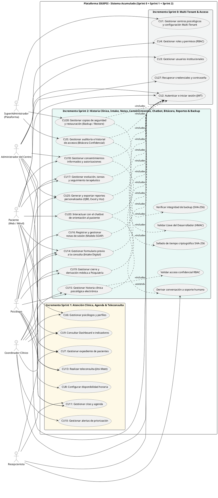
```plantuml
@startuml
left to right direction
skinparam packageStyle rectangle
skinparam shadowing false
skinparam roundcorner 8
skinparam defaultFontName Arial

actor "SuperAdministrador\n(Plataforma)" as superadmin
actor "Administrador del Centro" as admin
actor "Coordinador Clínico" as coord
actor "Psicólogo" as psyc
actor "Recepcionista" as recep
actor "Paciente\n(Web / Móvil)" as patient

rectangle "Plataforma SIGEPSI - Sistema Acumulado (Sprint 0 + Sprint 1 + Sprint 2)" {

  rectangle "Incremento Sprint 0: Multi-Tenant & Acceso" #F2F4F4 {
    usecase "CU1: Gestionar centros psicológicos\ny configuración Multi-Tenant" as CU1
    usecase "CU2: Autenticar e iniciar sesión (JWT)" as CU2
    usecase "CU3: Gestionar usuarios institucionales" as CU3
    usecase "CU4: Gestionar roles y permisos (RBAC)" as CU4
    usecase "CU27: Recuperar credenciales y contraseña" as CU27
  }

  rectangle "Incremento Sprint 1: Atención Clínica, Agenda & Teleconsulta" #FEF9E7 {
    usecase "CU6: Gestionar psicólogos y perfiles" as CU6
    usecase "CU8: Configurar disponibilidad horaria" as CU8
    usecase "CU7: Gestionar expediente de pacientes" as CU7
    usecase "CU11: Gestionar citas y agenda" as CU11
    usecase "CU13: Realizar teleconsulta (Jitsi Meet)" as CU13
    usecase "CU9: Consultar Dashboard e indicadores" as CU9
    usecase "CU10: Gestionar alertas de priorización" as CU10
  }

  rectangle "Incremento Sprint 2: Historia Clínica, Intake, Notas, Consentimientos, Chatbot, Bitácora, Reportes & Backup" #E8F8F5 {
    usecase "CU14: Gestionar formulario previo\na la consulta (Intake Digital)" as CU14
    usecase "CU15: Gestionar historia clínica\npsicológica electrónica" as CU15
    usecase "CU16: Registrar y gestionar\nnotas de sesión (Modelo SOAP)" as CU16
    usecase "CU17: Gestionar evolución, tareas\ny seguimiento terapéutico" as CU17
    usecase "CU18: Gestionar consentimientos\ninformados y autorizaciones" as CU18
    usecase "CU19: Gestionar cierre y\nderivación médica a Psiquiatría" as CU19
    usecase "CU20: Interactuar con el chatbot\nde orientación al paciente" as CU20
    usecase "CU5: Gestionar auditoría e historial\nde accesos (Bitácora Confidencial)" as CU5
    usecase "CU25: Generar y exportar reportes\npersonalizados (QBE, Excel y Voz)" as CU25
    usecase "CU28: Gestionar copias de seguridad\ny restauración (Backup / Restore)" as CU28

    usecase "Validar acceso confidencial RBAC" as val_rbac
    usecase "Sellado de tiempo criptográfico SHA-256" as val_hash
    usecase "Derivar conversación a soporte humano" as val_escalar
    usecase "Validar Llave del Desarrollador (HMAC)" as val_devkey
    usecase "Verificar integridad de backup (SHA-256)" as val_dump
  }
}

' Asociaciones SuperAdmin
superadmin --> CU1
superadmin --> CU5
superadmin --> CU28

' Asociaciones Administrador del Centro
admin --> CU2
admin --> CU3
admin --> CU4
admin --> CU6
admin --> CU7
admin --> CU9
admin --> CU18
admin --> CU25

' Asociaciones Coordinador Clínico
coord --> CU2
coord --> CU6
coord --> CU9
coord --> CU10
coord --> CU14
coord --> CU15
coord --> CU19
coord --> CU25

' Asociaciones Psicólogo
psyc --> CU2
psyc --> CU8
psyc --> CU11
psyc --> CU13
psyc --> CU14
psyc --> CU15
psyc --> CU16
psyc --> CU17
psyc --> CU19

' Asociaciones Recepcionista
recep --> CU2
recep --> CU7
recep --> CU11
recep --> val_escalar

' Asociaciones Paciente (Web / Móvil)
patient --> CU2
patient --> CU27
patient --> CU7
patient --> CU11
patient --> CU13
patient --> CU14
patient --> CU17
patient --> CU18
patient --> CU20

' Inclusiones y extensiones obligatorias
CU15 ..> val_rbac : <<include>>
CU18 ..> val_hash : <<include>>
CU20 ..> val_escalar : <<extend>>
CU5 ..> val_devkey : <<include>>
CU28 ..> val_dump : <<include>>
CU14 ..> CU2 : <<include>>
CU15 ..> CU2 : <<include>>
CU16 ..> CU2 : <<include>>
CU17 ..> CU2 : <<include>>
CU18 ..> CU2 : <<include>>
CU19 ..> CU2 : <<include>>
CU20 ..> CU2 : <<include>>
CU5 ..> CU2 : <<include>>
CU25 ..> CU2 : <<include>>
CU28 ..> CU2 : <<include>>
@enduml
```

#### Diagrama de Clases del Dominio Clínico (Modelo Incremental Tenant)

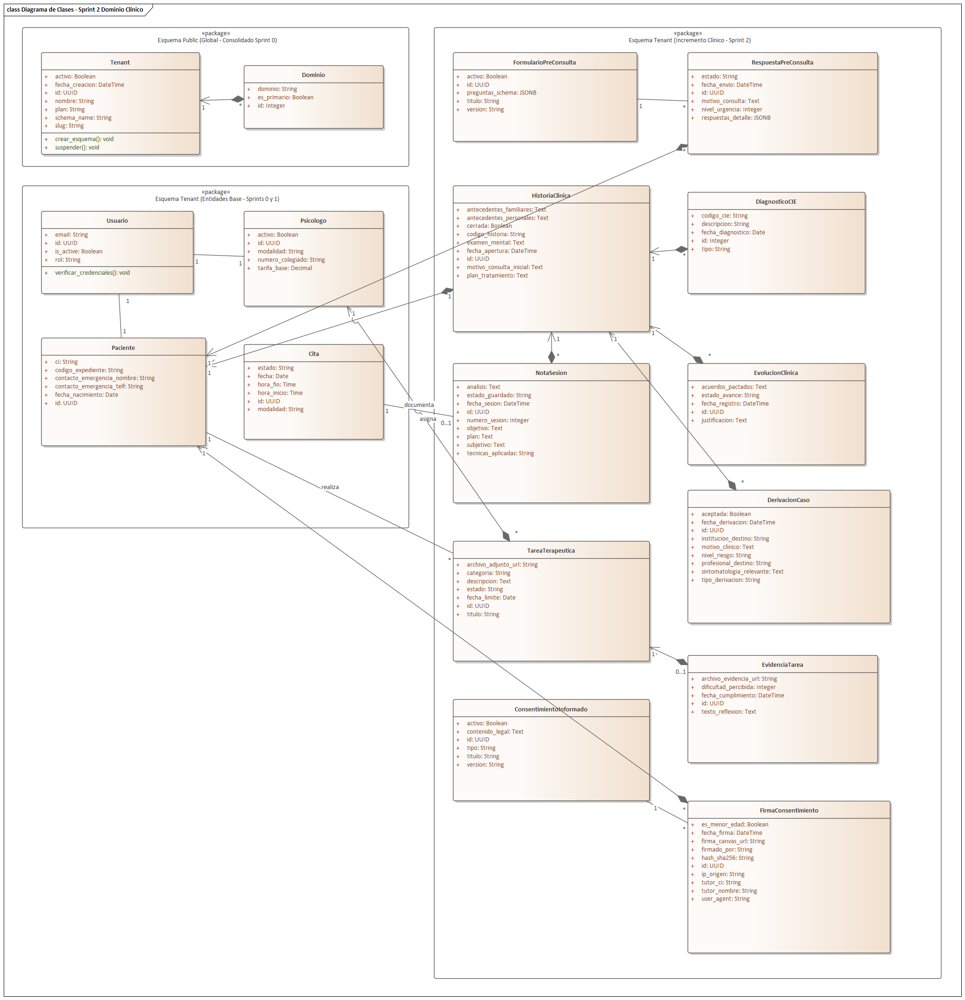

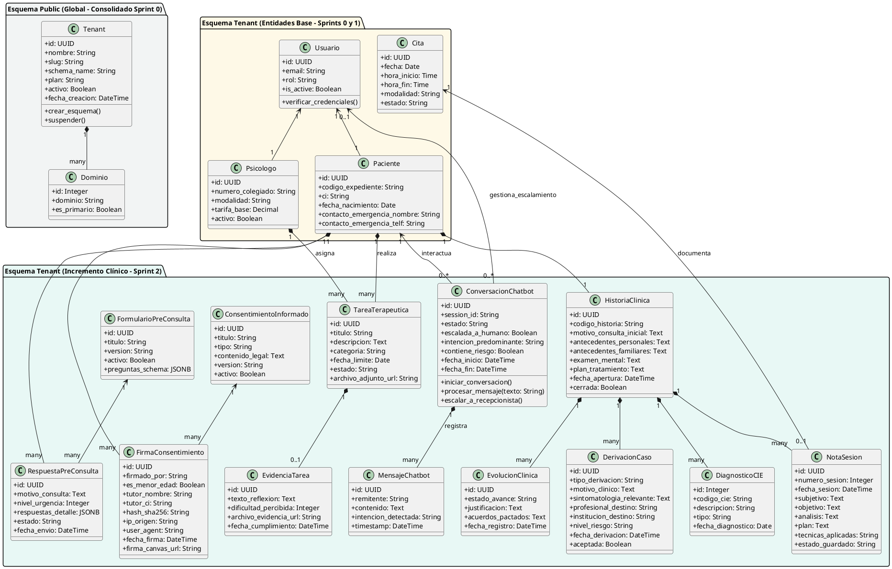
```plantuml
@startuml
skinparam classAttributeIconSize 0
skinparam shadowing false
skinparam roundcorner 8
skinparam defaultFontName Arial

package "Esquema Public (Global - Consolidado Sprint 0)" #F2F4F4 {
  class Tenant {
    + id: UUID
    + nombre: String
    + slug: String
    + schema_name: String
    + plan: String
    + activo: Boolean
    + fecha_creacion: DateTime
    + crear_esquema()
    + suspender()
  }

  class Dominio {
    + id: Integer
    + dominio: String
    + es_primario: Boolean
  }
}

package "Esquema Tenant (Entidades Base - Sprints 0 y 1)" #FEF9E7 {
  class Usuario {
    + id: UUID
    + email: String
    + rol: String
    + is_active: Boolean
    + verificar_credenciales()
  }

  class Psicologo {
    + id: UUID
    + numero_colegiado: String
    + modalidad: String
    + tarifa_base: Decimal
    + activo: Boolean
  }

  class Paciente {
    + id: UUID
    + codigo_expediente: String
    + ci: String
    + fecha_nacimiento: Date
    + contacto_emergencia_nombre: String
    + contacto_emergencia_telf: String
  }

  class Cita {
    + id: UUID
    + fecha: Date
    + hora_inicio: Time
    + hora_fin: Time
    + modalidad: String
    + estado: String
  }
}

package "Esquema Tenant (Incremento Clínico - Sprint 2)" #E8F8F5 {
  class FormularioPreConsulta {
    + id: UUID
    + titulo: String
    + version: String
    + activo: Boolean
    + preguntas_schema: JSONB
  }

  class RespuestaPreConsulta {
    + id: UUID
    + motivo_consulta: Text
    + nivel_urgencia: Integer
    + respuestas_detalle: JSONB
    + estado: String
    + fecha_envio: DateTime
  }

  class HistoriaClinica {
    + id: UUID
    + codigo_historia: String
    + motivo_consulta_inicial: Text
    + antecedentes_personales: Text
    + antecedentes_familiares: Text
    + examen_mental: Text
    + plan_tratamiento: Text
    + fecha_apertura: DateTime
    + cerrada: Boolean
  }

  class DiagnosticoCIE {
    + id: Integer
    + codigo_cie: String
    + descripcion: String
    + tipo: String
    + fecha_diagnostico: Date
  }

  class NotaSesion {
    + id: UUID
    + numero_sesion: Integer
    + fecha_sesion: DateTime
    + subjetivo: Text
    + objetivo: Text
    + analisis: Text
    + plan: Text
    + tecnicas_aplicadas: String
    + estado_guardado: String
  }

  class EvolucionClinica {
    + id: UUID
    + estado_avance: String
    + justificacion: Text
    + acuerdos_pactados: Text
    + fecha_registro: DateTime
  }

  class TareaTerapeutica {
    + id: UUID
    + titulo: String
    + descripcion: Text
    + categoria: String
    + fecha_limite: Date
    + estado: String
    + archivo_adjunto_url: String
  }

  class EvidenciaTarea {
    + id: UUID
    + texto_reflexion: Text
    + dificultad_percibida: Integer
    + archivo_evidencia_url: String
    + fecha_cumplimiento: DateTime
  }

  class ConsentimientoInformado {
    + id: UUID
    + titulo: String
    + tipo: String
    + contenido_legal: Text
    + version: String
    + activo: Boolean
  }

  class FirmaConsentimiento {
    + id: UUID
    + firmado_por: String
    + es_menor_edad: Boolean
    + tutor_nombre: String
    + tutor_ci: String
    + hash_sha256: String
    + ip_origen: String
    + user_agent: String
    + fecha_firma: DateTime
    + firma_canvas_url: String
  }

  class DerivacionCaso {
    + id: UUID
    + tipo_derivacion: String
    + motivo_clinico: Text
    + sintomatologia_relevante: Text
    + profesional_destino: String
    + institucion_destino: String
    + nivel_riesgo: String
    + fecha_derivacion: DateTime
    + aceptada: Boolean
  }

  class ConversacionChatbot {
    + id: UUID
    + session_id: String
    + estado: String
    + escalada_a_humano: Boolean
    + intencion_predominante: String
    + contiene_riesgo: Boolean
    + fecha_inicio: DateTime
    + fecha_fin: DateTime
    + iniciar_conversacion()
    + procesar_mensaje(texto: String)
    + escalar_a_recepcionista()
  }

  class MensajeChatbot {
    + id: UUID
    + remitente: String
    + contenido: Text
    + intencion_detectada: String
    + timestamp: DateTime
  }
}

' Relaciones
Tenant "1" *-- "many" Dominio

Usuario "1" <-- "1" Psicologo
Usuario "1" <-- "1" Paciente

Paciente "1" *-- "1" HistoriaClinica
HistoriaClinica "1" *-- "many" DiagnosticoCIE
HistoriaClinica "1" *-- "many" NotaSesion
HistoriaClinica "1" *-- "many" EvolucionClinica
HistoriaClinica "1" *-- "many" DerivacionCaso

Cita "1" <-- "0..1" NotaSesion : documenta
Paciente "1" *-- "many" RespuestaPreConsulta
FormularioPreConsulta "1" <-- "many" RespuestaPreConsulta

Psicologo "1" *-- "many" TareaTerapeutica : asigna
Paciente "1" *-- "many" TareaTerapeutica : realiza
TareaTerapeutica "1" *-- "0..1" EvidenciaTarea

ConsentimientoInformado "1" <-- "many" FirmaConsentimiento
Paciente "1" *-- "many" FirmaConsentimiento

ConversacionChatbot "1" *-- "many" MensajeChatbot : registra
Paciente "1" <-- "0..*" ConversacionChatbot : interactua
Usuario "0..1" <-- "0..*" ConversacionChatbot : gestiona_escalamiento
@enduml
```

#### Diagramas de Actividad de Flujos Críticos

##### 1. Flujo de Diligenciamiento de Formulario Previo y Apertura de Historia Clínica

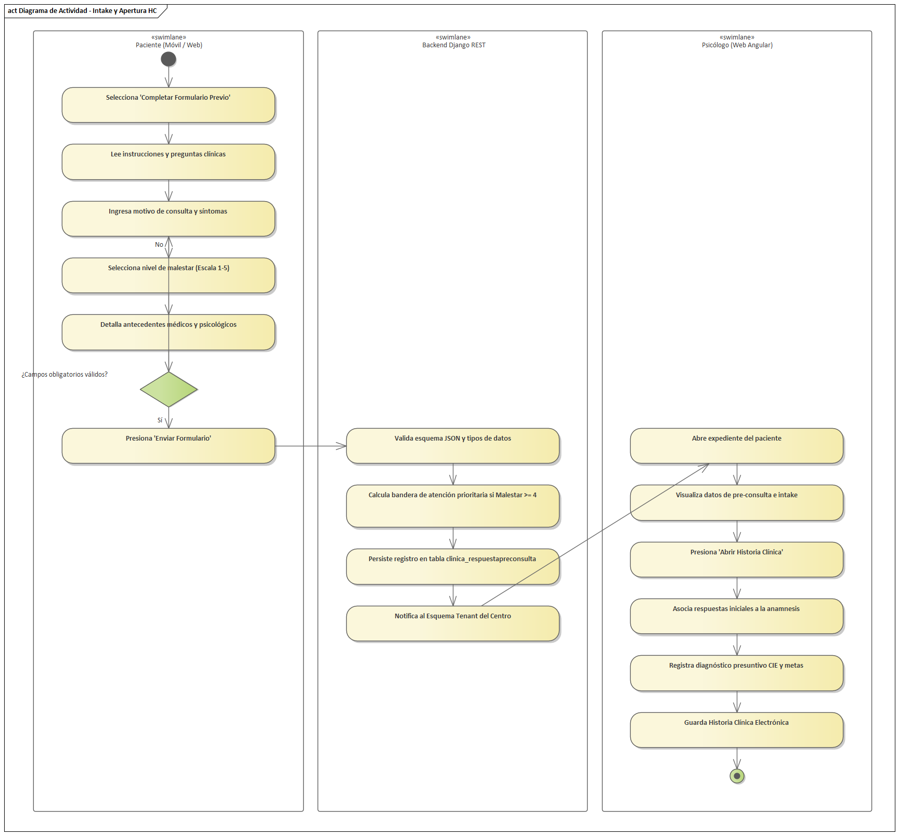

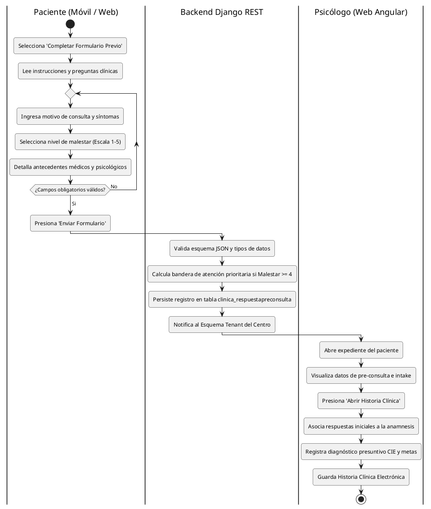
```plantuml
@startuml
skinparam shadowing false
skinparam roundcorner 8
skinparam defaultFontName Arial

|Paciente (Móvil / Web)|
start
:Selecciona 'Completar Formulario Previo';
:Lee instrucciones y preguntas clínicas;
repeat
  :Ingresa motivo de consulta y síntomas;
  :Selecciona nivel de malestar (Escala 1-5);
  :Detalla antecedentes médicos y psicológicos;
repeat while (¿Campos obligatorios válidos?) is (No)
->Si;
:Presiona 'Enviar Formulario';

|Backend Django REST|
:Valida esquema JSON y tipos de datos;
:Calcula bandera de atención prioritaria si Malestar >= 4;
:Persiste registro en tabla clinica_respuestapreconsulta;
:Notifica al Esquema Tenant del Centro;

|Psicólogo (Web Angular)|
:Abre expediente del paciente;
:Visualiza datos de pre-consulta e intake;
:Presiona 'Abrir Historia Clínica';
:Asocia respuestas iniciales a la anamnesis;
:Registra diagnóstico presuntivo CIE y metas;
:Guarda Historia Clínica Electrónica;
stop
@enduml
```

##### 2. Ciclo de Tareas Terapéuticas Inter-Sesiones

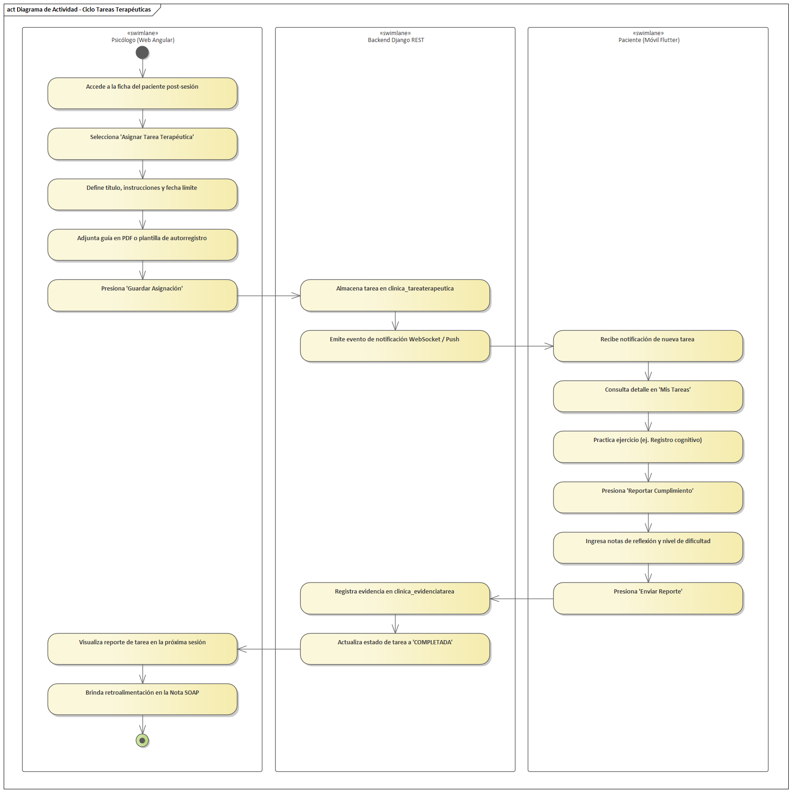

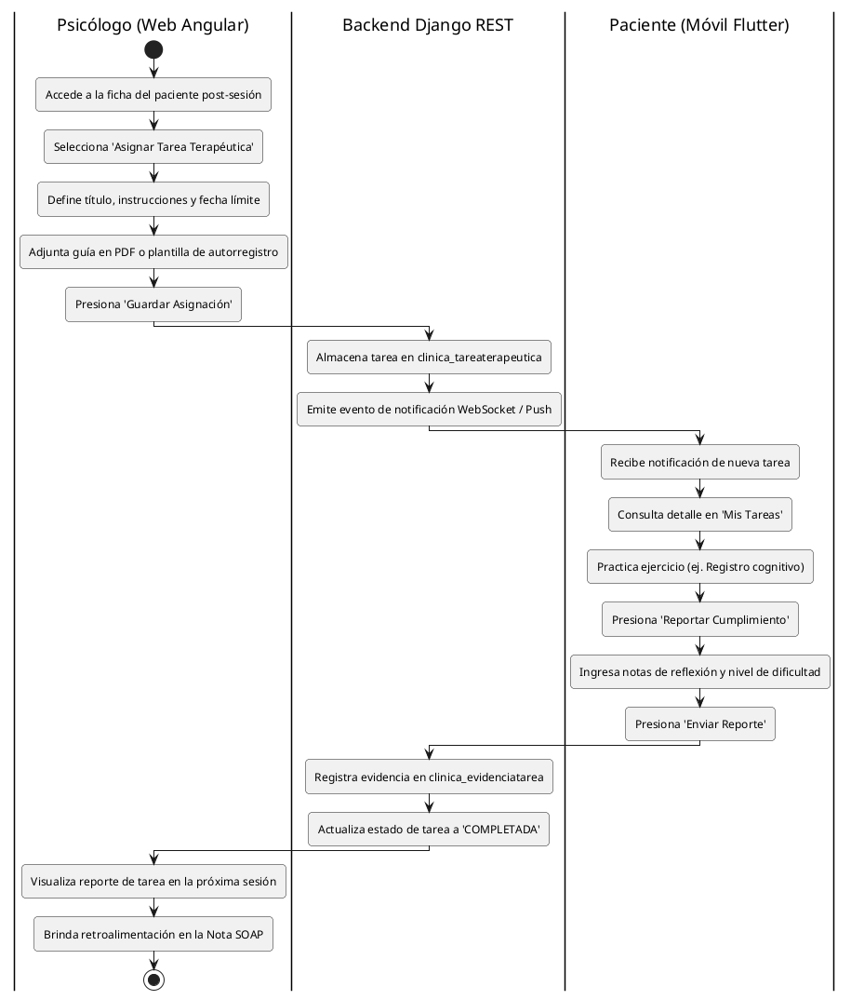
```plantuml
@startuml
skinparam shadowing false
skinparam roundcorner 8
skinparam defaultFontName Arial

|Psicólogo (Web Angular)|
start
:Accede a la ficha del paciente post-sesión;
:Selecciona 'Asignar Tarea Terapéutica';
:Define título, instrucciones y fecha límite;
:Adjunta guía en PDF o plantilla de autorregistro;
:Presiona 'Guardar Asignación';

|Backend Django REST|
:Almacena tarea en clinica_tareaterapeutica;
:Emite evento de notificación WebSocket / Push;

|Paciente (Móvil Flutter)|
:Recibe notificación de nueva tarea;
:Consulta detalle en 'Mis Tareas';
:Practica ejercicio (ej. Registro cognitivo);
:Presiona 'Reportar Cumplimiento';
:Ingresa notas de reflexión y nivel de dificultad;
:Presiona 'Enviar Reporte';

|Backend Django REST|
:Registra evidencia en clinica_evidenciatarea;
:Actualiza estado de tarea a 'COMPLETADA';

|Psicólogo (Web Angular)|
:Visualiza reporte de tarea en la próxima sesión;
:Brinda retroalimentación en la Nota SOAP;
stop
@enduml
```

##### 3. Protocolo de Derivación Médica Externa a Psiquiatría

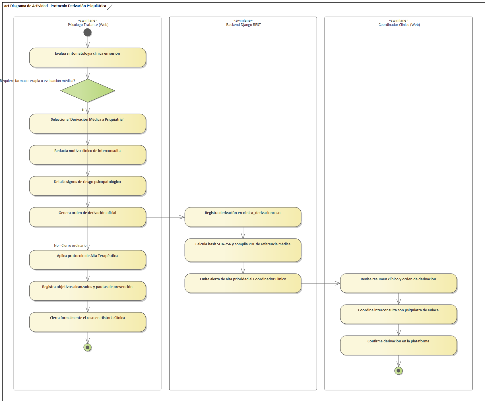

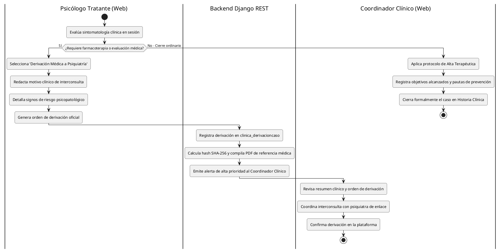
```plantuml
@startuml
skinparam shadowing false
skinparam roundcorner 8
skinparam defaultFontName Arial

|Psicólogo Tratante (Web)|
start
:Evalúa sintomatología clínica en sesión;
if (¿Requiere farmacoterapia o evaluación médica?) then (Sí)
  :Selecciona 'Derivación Médica a Psiquiatría';
  :Redacta motivo clínico de interconsulta;
  :Detalla signos de riesgo psicopatológico;
  :Genera orden de derivación oficial;
  
  |Backend Django REST|
  :Registra derivación en clinica_derivacioncaso;
  :Calcula hash SHA-256 y compila PDF de referencia médica;
  :Emite alerta de alta prioridad al Coordinador Clínico;
  
  |Coordinador Clínico (Web)|
  :Revisa resumen clínico y orden de derivación;
  :Coordina interconsulta con psiquiatra de enlace;
  :Confirma derivación en la plataforma;
  stop
else (No - Cierre ordinario)
  :Aplica protocolo de Alta Terapéutica;
  :Registra objetivos alcanzados y pautas de prevención;
  :Cierra formalmente el caso en Historia Clínica;
  stop
endif
@enduml
```

##### 4. Flujo de Orientación Asistida mediante Chatbot y Escalamiento a Soporte Humano (CU20)

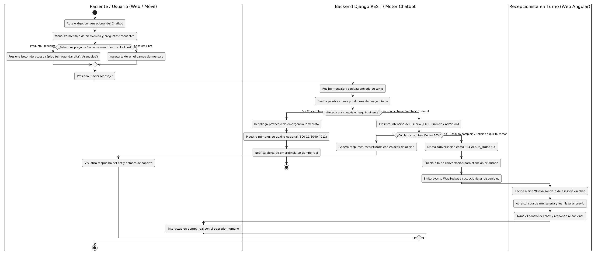

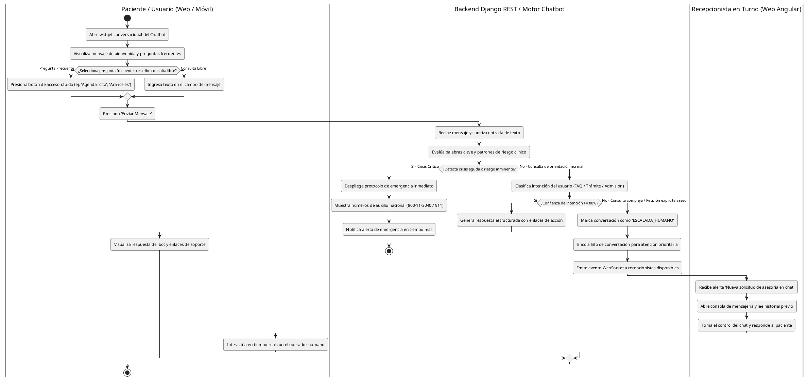
```plantuml
@startuml
skinparam shadowing false
skinparam roundcorner 8
skinparam defaultFontName Arial

|Paciente / Usuario (Web / Móvil)|
start
:Abre widget conversacional del Chatbot;
:Visualiza mensaje de bienvenida y preguntas frecuentes;
if (¿Selecciona pregunta frecuente o escribe consulta libre?) then (Pregunta Frecuente)
  :Presiona botón de acceso rápido (ej. 'Agendar cita', 'Aranceles');
else (Consulta Libre)
  :Ingresa texto en el campo de mensaje;
endif
:Presiona 'Enviar Mensaje';

|Backend Django REST / Motor Chatbot|
:Recibe mensaje y sanitiza entrada de texto;
:Evalúa palabras clave y patrones de riesgo clínico;
if (¿Detecta crisis aguda o riesgo inminente?) then (Sí - Crisis Crítica)
  :Despliega protocolo de emergencia inmediato;
  :Muestra números de auxilio nacional (800-11-3040 / 911);
  :Notifica alerta de emergencia en tiempo real;
  stop
else (No - Consulta de orientación normal)
  :Clasifica intención del usuario (FAQ / Trámite / Admisión);
  if (¿Confianza de intención >= 80%?) then (Sí)
    :Genera respuesta estructurada con enlaces de acción;
    |Paciente / Usuario (Web / Móvil)|
    :Visualiza respuesta del bot y enlaces de soporte;
  else (No - Consulta compleja / Petición explícita asesor)
    |Backend Django REST / Motor Chatbot|
    :Marca conversación como 'ESCALADA_HUMANO';
    :Encola hilo de conversación para atención prioritaria;
    :Emite evento WebSocket a recepcionistas disponibles;
    
    |Recepcionista en Turno (Web Angular)|
    :Recibe alerta 'Nueva solicitud de asesoría en chat';
    :Abre consola de mensajería y lee historial previo;
    :Toma el control del chat y responde al paciente;
    
    |Paciente / Usuario (Web / Móvil)|
    :Interactúa en tiempo real con el operador humano;
  endif
endif
stop
@enduml
```

---

### 6.1.4 Sprint Backlog (24 Tareas Técnicas – 113 Horas)

El Sprint Backlog se compone de 24 tareas técnicas (14 tareas base = 65h, 6 tareas de IA = 29h, la tarea de implementación SP2-54 de Romero = 5h, y 3 tareas técnicas del módulo de Chatbot de Orientación SP3-5 incorporado a este sprint = 14h). Total: **113 horas**.

|  Nro  |  ID Tarea  | Descripción Técnica                                                                           |       Categoría       |     Tipo     |    Est.    | Responsable Asignado             |    Estado     |
| :---: | :--------: | :-------------------------------------------------------------------------------------------- | :-------------------: | :----------: | :--------: | :------------------------------- | :-----------: |
|  34   | **SP2-34** | Diseñar interfaz de formulario previo (Web administrativa y App Móvil)                        |         Base          |    Diseño    |    4 hr    | Larrazabal Rojas Julio Cesar     | **Terminado** |
|  35   | **SP2-35** | Implementar backend y API REST de formulario previo con esquema JSONB                         |         Base          |  Desarrollo  |    8 hr    | Mujica Vallejos Andy Mauricio    | **Terminado** |
|  36   | **SP2-36** | Pruebas funcionales y de caja negra de formulario previo                                      |         Base          |   Pruebas    |    3 hr    | Velasco Soliz Rolando            | **Terminado** |
|  37   | **SP2-37** | Diseñar interfaz de historia clínica electrónica y control de acceso                          |         Base          |    Diseño    |    4 hr    | Larrazabal Rojas Julio Cesar     | **Terminado** |
|  38   | **SP2-38** | Implementar backend, modelos de historia clínica y catálogo CIE indexado                      |         Base          |  Desarrollo  |    8 hr    | Mujica Vallejos Andy Mauricio    | **Terminado** |
|  39   | **SP2-39** | Pruebas de integridad, confidencialidad y control RBAC clínico                                |         Base          |   Pruebas    |    3 hr    | Velasco Soliz Rolando            | **Terminado** |
|  40   | **SP2-40** | Diseñar interfaz de notas SOAP, evolución longitudinal y tareas                               |         Base          |    Diseño    |    4 hr    | Larrazabal Rojas Julio Cesar     | **Terminado** |
|  41   | **SP2-41** | Implementar registro estructurado de notas SOAP, seguimiento y tareas                         |         Base          |  Desarrollo  |    8 hr    | Condori Diaz Marilyn Esther      | **Terminado** |
|  42   | **SP2-42** | Pruebas funcionales del módulo de notas SOAP, acuerdos y tareas                               |         Base          |   Pruebas    |    3 hr    | Velasco Soliz Rolando            | **Terminado** |
|  43   | **SP2-43** | Diseñar interfaz de gestión y firma de consentimientos (Web y Móvil)                          |         Base          |    Diseño    |    3 hr    | Larrazabal Rojas Julio Cesar     | **Terminado** |
|  44   | **SP2-44** | Implementar consentimientos digitales con sello SHA-256 y canvas táctil                       |         Base          |  Desarrollo  |    6 hr    | Delgado Rojas Alberto Caleb      | **Terminado** |
|  45   | **SP2-45** | Validación de integridad y trazabilidad legal de consentimientos                              |         Base          |   Pruebas    |    2 hr    | Condori Diaz Marilyn Esther      | **Terminado** |
|  46   | **SP2-46** | Implementar cierre de caso, alta terapéutica y derivación a Psiquiatría                       |         Base          |  Desarrollo  |    6 hr    | Condori Diaz Marilyn Esther      | **Terminado** |
|  47   | **SP2-47** | Pruebas de aceptación de cierre de casos, altas y derivaciones                                |         Base          |  Aceptación  |    3 hr    | Romero Saavedra Maria Ilse       | **Terminado** |
|  48   | **SP2-48** | Refinar HU-35, criterios de aceptación, reglas de no uso y salvaguardas                       |       Piloto IA       | Refinamiento |    2 hr    | Romero Saavedra Maria Ilse       | **Terminado** |
|  49   | **SP2-49** | Definir consentimiento, vocabulario de prioridad y validación clínica                         |       Piloto IA       |   Análisis   |    4 hr    | Condori Diaz Marilyn Esther      | **Terminado** |
|  50   | **SP2-50** | Construir pasarela de IA con minimización de datos, RBAC y auditoría                          |       Piloto IA       |  Desarrollo  |    8 hr    | Mujica Vallejos Andy Mauricio    | **Terminado** |
|  51   | **SP2-51** | Implementar vista web de borrador asistivo, explicación y revisión humana                     |       Piloto IA       |  Desarrollo  |    5 hr    | Larrazabal Rojas Julio Cesar     | **Terminado** |
|  52   | **SP2-52** | Implementar estados móviles de consentimiento y aviso asistivo en Flutter                     |       Piloto IA       |  Desarrollo  |    5 hr    | Delgado Rojas Alberto Caleb      | **Terminado** |
|  53   | **SP2-53** | Ejecutar pruebas de privacidad, fallos, regresión y rechazo de salidas IA                     |       Piloto IA       |   Pruebas    |    5 hr    | Velasco Soliz Rolando            | **Terminado** |
|  54   | **SP2-54** | Implementar motor de reglas clínicas de priorización y categorización asistiva de preconsulta | Implementación Romero |  Desarrollo  |    5 hr    | Romero Saavedra Maria Ilse       | **Terminado** |
|  55   | **SP2-55** | Diseñar interfaz conversacional del chatbot de orientación (Widget Web y Móvil)               |      Chatbot SP2      |    Diseño    |    3 hr    | Larrazabal Rojas Julio Cesar     | **Terminado** |
|  56   | **SP2-56** | Implementar motor conversacional del chatbot, intents clínicos y derivación a operador        |      Chatbot SP2      |  Desarrollo  |    8 hr    | Mujica Vallejos Andy Mauricio    | **Terminado** |
|  57   | **SP2-57** | Pruebas funcionales de orientación, contención de crisis y transferencia a recepcionista      |      Chatbot SP2      |   Pruebas    |    3 hr    | Velasco Soliz Rolando            | **Terminado** |
|   —   | **TOTAL**  | **Esfuerzo Base Planificado Sprint 2 (24 Tareas Base)**                                       |           —           |      —       | **113 hr** | **Equipo SCRUM (6 Integrantes)** | **Terminado** |

#### 6.1.4.1 Tareas Técnicas Complementarias de Consolidación de los 8 Criterios de la Cátedra (Criterios 3, 5, 6 y 8)

En estricta observancia a las exigencias transmitidas por la docente en los audios **M1 y M2** (donde se demanda la consolidación de los 8 criterios generales al 100% para la defensa del Sprint 2: Bitácora Confidencial Inviolable, Reportes QBE/Voz Multiformato, Backup/Restore Automático/Manual y Datasets de 10 a 15 Empresas), se formalizan e integran las siguientes 10 tareas técnicas asignadas a cada integrante según su rol SCRUM:

|  Nro  |  ID Tarea  | Descripción Técnica                                                                                               |       Categoría       |    Tipo     |   Est.    | Responsable Asignado             |    Estado     |
| :---: | :--------: | :---------------------------------------------------------------------------------------------------------------- | :-------------------: | :---------: | :-------: | :------------------------------- | :-----------: |
|  58   | **SP2-58** | Backend Middleware de Auditoría y Cifrado Simétrico AES-256 Fernet en Archivo Físico `.log.enc` (CU5 / Criterio 3)| Bitácora Cifrada      | Desarrollo  |   4 hr    | Mujica Vallejos Andy Mauricio    | **Terminado** |
|  59   | **SP2-59** | UI Visor Web de Bitácora Confidencial y Modal de Llave Criptográfica del Desarrollador (CU5 / Criterio 3)         | Bitácora Cifrada      |   Diseño    |   4 hr    | Larrazabal Rojas Julio Cesar     | **Terminado** |
|  60   | **SP2-60** | QA y Pruebas de Inviolabilidad de Bitácora, Permisos 0600 y Huso Horario `America/La_Paz` (CU5 / Criterio 3)     | Bitácora Cifrada      |   Pruebas   |   3 hr    | Velasco Soliz Rolando            | **Terminado** |
|  61   | **SP2-61** | Motor Backend de Reportes QBE, Filtrado Dinámico y Exportadores OpenPyXL/CSV/HTML/Email (CU25 / Criterio 5)       | Reportes Dinámicos    | Desarrollo  |   5 hr    | Condori Diaz Marilyn Esther      | **Terminado** |
|  62   | **SP2-62** | UI Constructor de Reportes QBE y Módulo de Comandos por Voz mediante Web Speech API (CU25 / Criterio 5)           | Reportes Dinámicos    | Desarrollo  |   5 hr    | Larrazabal Rojas Julio Cesar     | **Terminado** |
|  63   | **SP2-63** | QA de Generación de Reportes Dinámicos, Proyecciones y Comandos Vocales en Navegador (CU25 / Criterio 5)          | Reportes Dinámicos    |   Pruebas   |   3 hr    | Velasco Soliz Rolando            | **Terminado** |
|  64   | **SP2-64** | Scripts y Endpoints de Backup Automático (Cron Cloud) y Manual `pg_dump` por Tenant/Global (CU28 / Criterio 6)    | Backup / Restore      | Desarrollo  |   5 hr    | Mujica Vallejos Andy Mauricio    | **Terminado** |
|  65   | **SP2-65** | UI Consola de SuperAdmin para Descarga de Backups y Carga de Restauración `pg_restore` (CU28 / Criterio 6)       | Backup / Restore      | Desarrollo  |   4 hr    | Delgado Rojas Alberto Caleb      | **Terminado** |
|  66   | **SP2-66** | Script de Población Masiva (Datasets 10-15 Tenants, 4-12 meses de historial) y Aceptación (Criterio 8 / M1)      | Datasets SaaS         | Aceptación  |   5 hr    | Romero Maria Ilse / Mujica Andy  | **Terminado** |
|  67   | **SP2-67** | QA y Verificación de Integridad en Restauración de Base de Datos y Aislamiento Tenant (CU28 / Criterio 6)         | Backup / Restore      |   Pruebas   |   4 hr    | Velasco Soliz Rolando            | **Terminado** |
|   —   | **TOTAL**  | **Esfuerzo Total Consolidado Sprint 2 (34 Tareas Técnicas)**                                                      |           —           |      —      | **155 hr**| **Equipo SCRUM (6 Integrantes)** | **Terminado** |

---

### 6.1.5 Equipo SCRUM del Sprint 2

| Pos.  | Integrante                        | Rol SCRUM            | Especialidad en el Sprint 2                                                                                   |                 Tareas Asignadas                 | Horas Plan. |
| :---: | :-------------------------------- | :------------------- | :------------------------------------------------------------------------------------------------------------ | :----------------------------------------------: | :---------: |
|   1   | **Romero Saavedra Maria Ilse**    | **Product Owner**    | Gestión del Backlog, Criterios de Aceptación Clínicos, Reglas de Priorización y Validación de Datasets SaaS   |        `SP2-47, SP2-48, SP2-54, SP2-66`          |  **15 hr**  |
|   2   | **Velasco Soliz Rolando**         | **Scrum Master**     | Facilitación Ágil, QA de Aislamiento RBAC, Inviolabilidad de Bitácora, Reportes de Voz y Restauración DB     | `SP2-36, SP2-39, SP2-42, SP2-53, SP2-57, SP2-60, SP2-63, SP2-67` | **27 hr** |
|   3   | **Condori Diaz Marilyn Esther**   | **Development Team** | Lógica Clínica, Notas SOAP, Cierre/Derivación y Motor de Reportes Personalizados QBE con Exportación Excel    |      `SP2-41, SP2-45, SP2-46, SP2-49, SP2-61`    |  **25 hr**  |
|   4   | **Delgado Rojas Alberto Caleb**   | **Development Team** | Desarrollo Móvil (Flutter), Criptografía SHA-256, Chatbot Móvil y Consola UI de Restauración de Base de Datos |            `SP2-44, SP2-52, SP2-65`              |  **15 hr**  |
|   5   | **Mujica Vallejos Andy Mauricio** | **Development Team** | Backend Django, Cifrado AES-256 de Bitácora, Endpoints de Backup pg_dump/pg_restore y Script Dataset 15 Tenants| `SP2-35, SP2-38, SP2-50, SP2-56, SP2-58, SP2-64, SP2-66` | **46 hr** |
|   6   | **Larrazabal Rojas Julio Cesar**  | **Development Team** | UI/UX Figma, Frontend Angular 17, Visor de Bitácora Forense, Constructor de Reportes y Web Speech API        | `SP2-34, SP2-37, SP2-40, SP2-43, SP2-51, SP2-55, SP2-59, SP2-62` | **32 hr** |

#### 6.1.5.1 Matriz de Trazabilidad de Roles y Aportes Individuales (Sprint 0, Sprint 1 y Sprint 2)
En conformidad con las directrices de evaluación individual de la asignatura (Audio K1), se formaliza el desglose exhaustivo de la rotación de roles, responsabilidades metodológicas y módulos de software desarrollados (Web y Móvil) por cada estudiante a lo largo de los tres sprints:

| Integrante                                              | Rol Sprint 0  | Rol Sprint 1 |   Rol Sprint 2    | Aportes Técnicos e Historias de Usuario (Web / Móvil / Backend)                                                                                                                                                                                                                                                                                                                                                                                                                                                                                                                                               |
| :------------------------------------------------------ | :-----------: | :----------: | :---------------: | :------------------------------------------------------------------------------------------------------------------------------------------------------------------------------------------------------------------------------------------------------------------------------------------------------------------------------------------------------------------------------------------------------------------------------------------------------------------------------------------------------------------------------------------------------------------------------------------------------------ |
| **Romero Saavedra Maria Ilse**<br>*(Reg: 222009772)*    | Scrum Master  |  Developer   | **Product Owner** | • **Sprint 0:** Facilitación ágil, matriz de roles RBAC y refinamiento de historias base.<br>• **Sprint 1 (Web):** HU-12 (Matriz de disponibilidad semanal de psicólogos), HU-13 (Expediente básico web) y HU-21 (Alertas tempranas de inasistencia).<br>• **Sprint 2 (PO + Dev):** Aceptación global del incremento (HU-23 a HU-39); desarrollo del motor de reglas clínicas (`SP2-54`) y validación funcional de la carga masiva de 15 tenants con historial clínico simulado (`SP2-66`).                                                                                                            |
| **Velasco Soliz Rolando**<br>*(Reg: 223044768)*         | Product Owner | Scrum Master | **Scrum Master**  | • **Sprint 0:** Definición de visión de producto SaaS Multi-Tenant y criterios DoD.<br>• **Sprint 1 (QA):** Facilitación de ceremonias, aseguramiento de calidad y pruebas funcionales.<br>• **Sprint 2 (SM + QA):** Conducción del Daily Scrum y Retrospectiva; diseño y ejecución de la suite completa de pruebas BDD (`SP2-36, 39, 42, 53, 57, 60, 63, 67`), verificando confidencialidad de la bitácora cifrada, precisión del comando de voz y restauración íntegra de base de datos.                                                                                                |
| **Condori Diaz Marilyn Esther**<br>*(Reg: 224051237)*   |   Developer   |  Developer   |   **Developer**   | • **Sprint 0 (BD):** Modelado de datos inicial y soporte a esquemas en PostgreSQL.<br>• **Sprint 1 (Backend):** Lógica transaccional de estados de citas y control de solapamientos.<br>• **Sprint 2 (Web/Backend):** Implementación de notas SOAP estructuradas (`SP2-41`), protocolo de cierre/derivación (`SP2-46`), salvaguardas éticas (`SP2-49`) y motor analítico de Reportes Personalizados QBE con exportación a Excel, CSV, HTML y correo SMTP (`SP2-61`).                                                                                                                             |
| **Delgado Rojas Alberto Caleb**<br>*(Reg: 224027204)*   |   Developer   |  Developer   |   **Developer**   | • **Sprint 0 (Móvil):** Configuración base de arquitectura móvil en Flutter 3.x con autenticación JWT.<br>• **Sprint 1 (Móvil):** HU-14 (Perfil móvil de paciente), HU-16 (Gestión móvil de citas) y HU-19 (Teleconsulta Jitsi Meet embebida en Flutter).<br>• **Sprint 2 (Móvil/Web):** Intake en Flutter (`HU-24`), seguimiento de tareas (`HU-30`), firma SHA-256 (`SP2-44`), avisos de IA (`SP2-52`), chatbot móvil (`HU-36`) y consola administrativa de carga para restauración de copias de seguridad (`SP2-65`).                                                              |
| **Mujica Vallejos Andy Mauricio**<br>*(Reg: 224028367)* |   Developer   |  Developer   |   **Developer**   | • **Sprint 0 (Backend):** Configuración de `django-tenants`, aislamiento por esquemas, endpoints JWT y middleware de auditoría.<br>• **Sprint 1 (Backend/Web):** HU-11 (Directorio de psicólogos), HU-15 (Motor de reserva y colisiones), HU-17 (Cancelación/reprogramación) y HU-18 (Teleconsulta WebRTC con Jitsi).<br>• **Sprint 2 (Backend):** API REST de intake (`SP2-35`), Historia Clínica CIE-10/11 (`SP2-38`), pasarela de IA (`SP2-50`), motor de chatbot (`SP2-56`), bitácora cifrada AES-256 (`SP2-58`), scripts de backup automático/manual `pg_dump` (`SP2-64`) y dataset de 15 tenants (`SP2-66`).|
| **Larrazabal Rojas Julio Cesar**<br>*(Reg: 223049255)*  |   Developer   |  Developer   |   **Developer**   | • **Sprint 0 (Frontend):** Arquitectura base Angular 17 Standalone, sistema de tokens de diseño y login.<br>• **Sprint 1 (Frontend):** HU-20 (Dashboard administrativo con KPIs y Chart.js) y HU-22 (Calendario interactivo semanal FullCalendar).<br>• **Sprint 2 (UI/UX + Frontend):** Prototipos en Figma; pantallas de intake (`SP2-34`), Historia Clínica (`SP2-37`), notas SOAP (`SP2-40`), consentimientos (`SP2-43`), panel de IA (`SP2-51`), chatbot web (`SP2-55`), visor de auditoría con llave (`SP2-59`) y constructor de reportes QBE con Web Speech (`SP2-62`).  |

---

## 6.2 PROCESO/PATRÓN DE DESARROLLO POR HISTORIA DE USUARIO

### 6.2.1 Diseño

#### 6.2.1.1 Diseño de la Arquitectura (3 Capas Multi-Tenant & Pasarela IA)

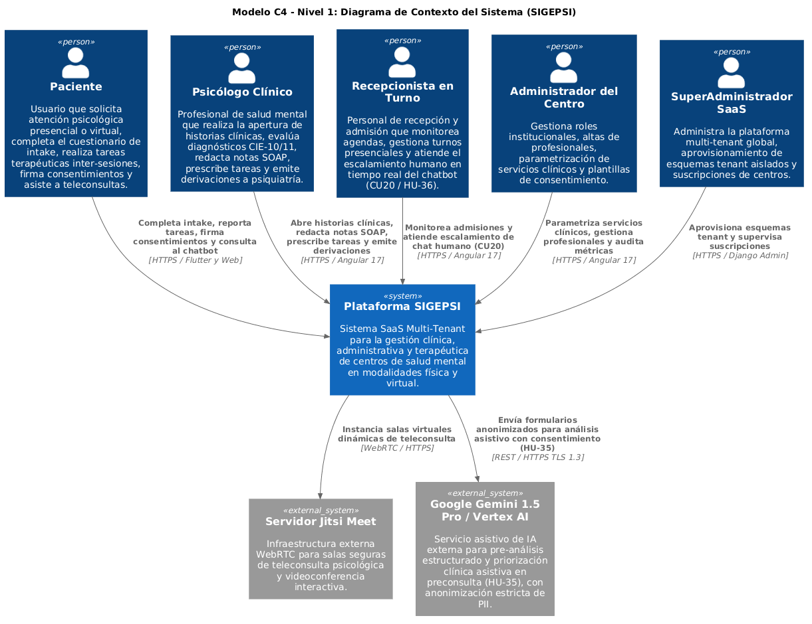

La arquitectura mantiene el aislamiento estricto por esquemas sobre PostgreSQL 16 con `django-tenants`. La capa móvil (Flutter 3.x) interactúa vía HTTPS/TLS 1.3 con tokens JWT con expiración controlada. Se incorpora una pasarela segura de IA con minimización de datos personales y bitácora criptográfica.


##### 6.2.1.1.1 Modelos de Arquitectura C4 del Sistema (Niveles 1 al 4)

En estricta aplicación de las directrices metodológicas de la asignatura (Audio K4), se adopta el **Modelo C4 de Simon Brown** en sustitución de los diagramas de componentes y paquetes UML tradicionales. La arquitectura se formaliza a través de la técnica jerárquica de *"Zoom-in"*, transitando desde el contexto sistémico de alto nivel hasta la estructura detallada de clases del código, garantizando coherencia absoluta con el prototipo funcional, la base de datos relacional PostgreSQL 16 con esquemas multi-tenant y los requerimientos del Sprint 2:

###### C4 Nivel 1: Diagrama de Contexto del Sistema (System Context)

Delimita las fronteras del software SIGEPSI con respecto a sus usuarios humanos (en entornos de clínica física y virtual) y los sistemas tecnológicos externos reales integrados (servicios de videoconferencia para teleconsulta e inteligencia artificial asistiva para preconsulta).


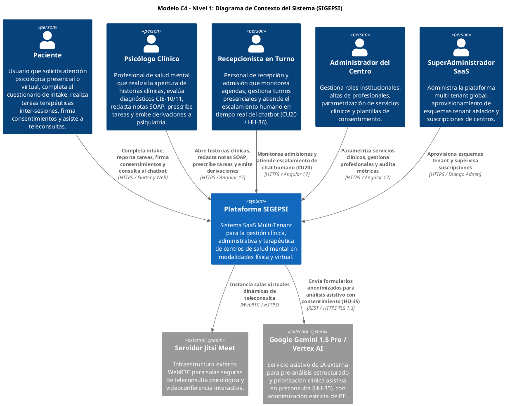
```plantuml
@startuml
!include <C4/C4_Context>

LAYOUT_TOP_DOWN()

title Modelo C4 - Nivel 1: Diagrama de Contexto del Sistema (SIGEPSI)

Person(paciente, "Paciente", "Usuario que solicita atención psicológica presencial o virtual, completa el cuestionario de intake, realiza tareas terapéuticas inter-sesiones, firma consentimientos y asiste a teleconsultas.")
Person(psicologo, "Psicólogo Clínico", "Profesional de salud mental que realiza la apertura de historias clínicas, evalúa diagnósticos CIE-10/11, redacta notas SOAP, prescribe tareas y emite derivaciones a psiquiatría.")
Person(recepcionista, "Recepcionista en Turno", "Personal de recepción y admisión que monitorea agendas, gestiona turnos presenciales y atiende el escalamiento humano en tiempo real del chatbot (CU20 / HU-36).")
Person(admin_centro, "Administrador del Centro", "Gestiona roles institucionales, altas de profesionales, parametrización de servicios clínicos y plantillas de consentimiento.")
Person(superadmin, "SuperAdministrador SaaS", "Administra la plataforma multi-tenant global, aprovisionamiento de esquemas tenant aislados y suscripciones de centros.")

System(sigepsi, "Plataforma SIGEPSI", "Sistema SaaS Multi-Tenant para la gestión clínica, administrativa y terapéutica de centros de salud mental en modalidades física y virtual.")

System_Ext(jitsi, "Servidor Jitsi Meet", "Infraestructura externa WebRTC para salas seguras de teleconsulta psicológica y videoconferencia interactiva.")
System_Ext(gemini, "Google Gemini 1.5 Pro / Vertex AI", "Servicio asistivo de IA externa para pre-análisis estructurado y priorización clínica asistiva en preconsulta (HU-35), con anonimización estricta de PII.")

Rel(paciente, sigepsi, "Completa intake, reporta tareas, firma consentimientos y consulta al chatbot", "HTTPS / Flutter y Web")
Rel(psicologo, sigepsi, "Abre historias clínicas, redacta notas SOAP, prescribe tareas y emite derivaciones", "HTTPS / Angular 17")
Rel(recepcionista, sigepsi, "Monitorea admisiones y atiende escalamiento de chat humano (CU20)", "HTTPS / Angular 17")
Rel(admin_centro, sigepsi, "Parametriza servicios clínicos, gestiona profesionales y audita métricas", "HTTPS / Angular 17")
Rel(superadmin, sigepsi, "Aprovisiona esquemas tenant y supervisa suscripciones", "HTTPS / Django Admin")

Rel(sigepsi, jitsi, "Instancia salas virtuales dinámicas de teleconsulta", "WebRTC / HTTPS")
Rel(sigepsi, gemini, "Envía formularios anonimizados para análisis asistivo con consentimiento (HU-35)", "REST / HTTPS TLS 1.3")
@enduml
```

###### C4 Nivel 2: Diagrama de Contenedores (Containers)

Descompone la arquitectura de SIGEPSI en sus unidades de ejecución física y lógica comprobadas en el prototipo funcional: aplicaciones cliente (SPA web en Angular 17 y app móvil nativa en Flutter 3.x), contenedor de backend y servicios API REST (Django 5.x / DRF con soporte multi-tenant vía `django-tenants`), almacenamiento local de documentos clínicos y el motor relacional de base de datos PostgreSQL 16 con esquemas independientes por clínica.

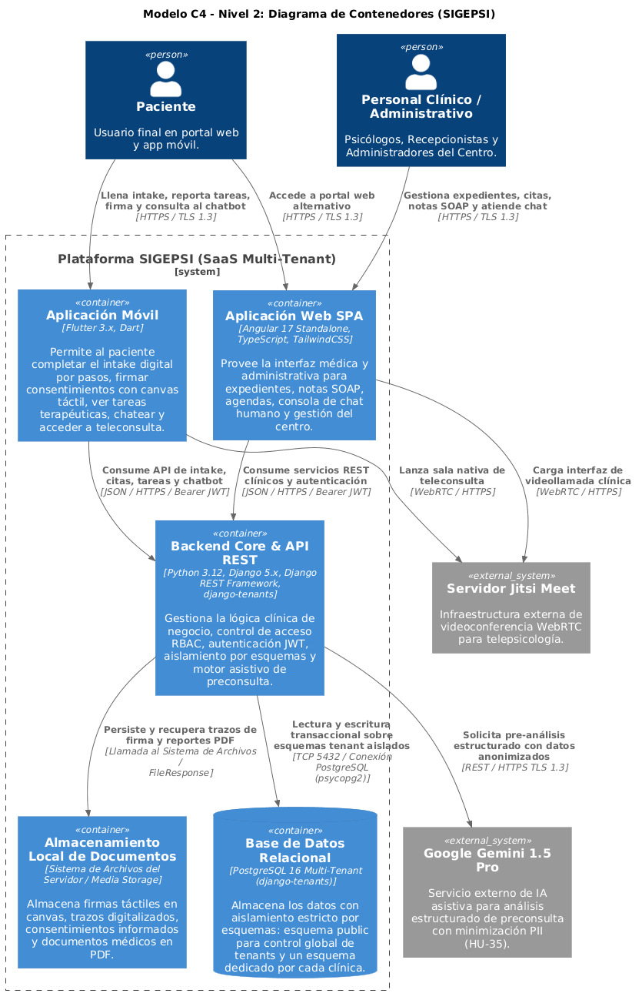

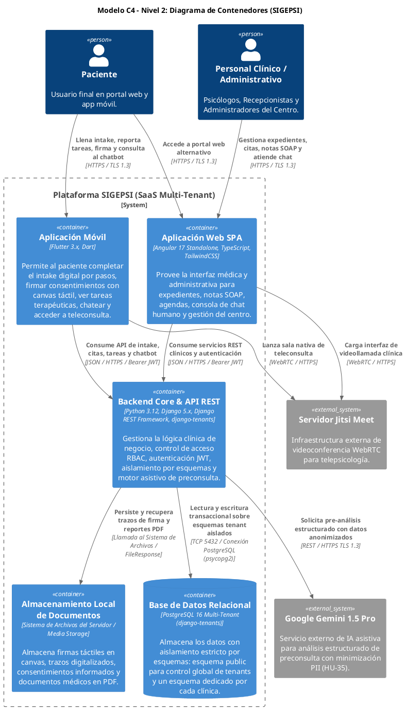
```plantuml
@startuml
!include <C4/C4_Container>

LAYOUT_TOP_DOWN()

title Modelo C4 - Nivel 2: Diagrama de Contenedores (SIGEPSI)

Person(paciente, "Paciente", "Usuario final en portal web y app móvil.")
Person(personal, "Personal Clínico / Administrativo", "Psicólogos, Recepcionistas y Administradores del Centro.")

System_Boundary(c1, "Plataforma SIGEPSI (SaaS Multi-Tenant)") {
    Container(web_app, "Aplicación Web SPA", "Angular 17 Standalone, TypeScript, TailwindCSS", "Provee la interfaz médica y administrativa para expedientes, notas SOAP, agendas, consola de chat humano y gestión del centro.")
    Container(mobile_app, "Aplicación Móvil", "Flutter 3.x, Dart", "Permite al paciente completar el intake digital por pasos, firmar consentimientos con canvas táctil, ver tareas terapéuticas, chatear y acceder a teleconsulta.")
    Container(backend_api, "Backend Core & API REST", "Python 3.12, Django 5.x, Django REST Framework, django-tenants", "Gestiona la lógica clínica de negocio, control de acceso RBAC, autenticación JWT, aislamiento por esquemas y motor asistivo de preconsulta.")
    ContainerDb(database, "Base de Datos Relacional", "PostgreSQL 16 Multi-Tenant (django-tenants)", "Almacena los datos con aislamiento estricto por esquemas: esquema public para control global de tenants y un esquema dedicado por cada clínica.")
    Container(storage_local, "Almacenamiento Local de Documentos", "Sistema de Archivos del Servidor / Media Storage", "Almacena firmas táctiles en canvas, trazos digitalizados, consentimientos informados y documentos médicos en PDF.")
}

System_Ext(gemini, "Google Gemini 1.5 Pro", "Servicio externo de IA asistiva para análisis estructurado de preconsulta con minimización PII (HU-35).")
System_Ext(jitsi, "Servidor Jitsi Meet", "Infraestructura externa de videoconferencia WebRTC para telepsicología.")

Rel(personal, web_app, "Gestiona expedientes, citas, notas SOAP y atiende chat", "HTTPS / TLS 1.3")
Rel(paciente, mobile_app, "Llena intake, reporta tareas, firma y consulta al chatbot", "HTTPS / TLS 1.3")
Rel(paciente, web_app, "Accede a portal web alternativo", "HTTPS / TLS 1.3")

Rel(web_app, backend_api, "Consume servicios REST clínicos y autenticación", "JSON / HTTPS / Bearer JWT")
Rel(mobile_app, backend_api, "Consume API de intake, citas, tareas y chatbot", "JSON / HTTPS / Bearer JWT")

Rel(backend_api, database, "Lectura y escritura transaccional sobre esquemas tenant aislados", "TCP 5432 / Conexión PostgreSQL (psycopg2)")
Rel(backend_api, storage_local, "Persiste y recupera trazos de firma y reportes PDF", "Llamada al Sistema de Archivos / FileResponse")

Rel(backend_api, gemini, "Solicita pre-análisis estructurado con datos anonimizados", "REST / HTTPS TLS 1.3")
Rel(web_app, jitsi, "Carga interfaz de videollamada clínica", "WebRTC / HTTPS")
Rel(mobile_app, jitsi, "Lanza sala nativa de teleconsulta", "WebRTC / HTTPS")
@enduml
```

###### C4 Nivel 3: Diagrama de Componentes (Component Diagram - Backend API Core)

Zoom-in dentro del contenedor del Backend Django REST Framework, detallando los controladores (ViewSets), servicios de dominio, módulos de seguridad y persistencia que componen la capa clínica construida en el Sprint 2:

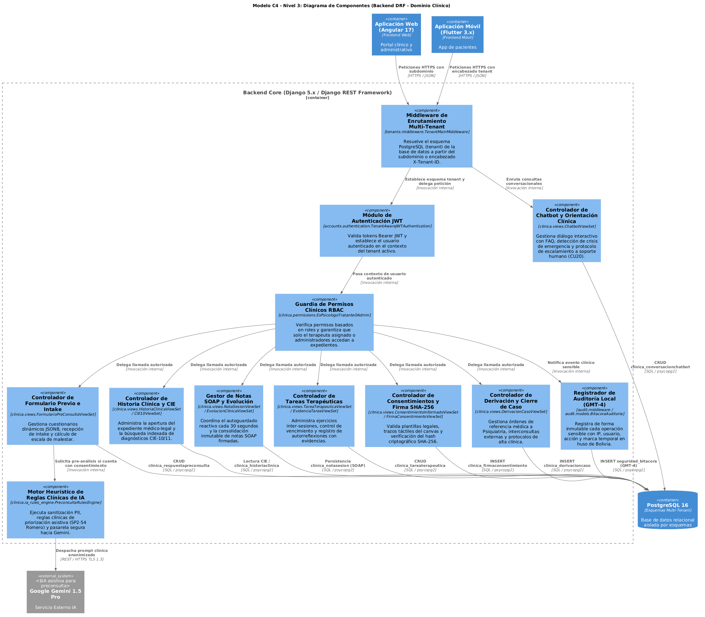

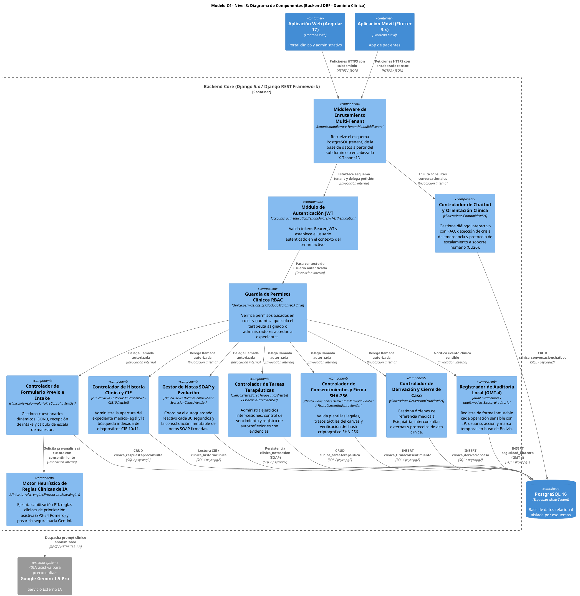
```plantuml
@startuml
!include <C4/C4_Component>

LAYOUT_TOP_DOWN()

title Modelo C4 - Nivel 3: Diagrama de Componentes (Backend DRF - Dominio Clínico)

Container(web_app, "Aplicación Web (Angular 17)", "Frontend Web", "Portal clínico y administrativo")
Container(mobile_app, "Aplicación Móvil (Flutter 3.x)", "Frontend Móvil", "App de pacientes")
ContainerDb(database, "PostgreSQL 16", "Esquemas Multi-Tenant", "Base de datos relacional aislada por esquemas")
System_Ext(gemini, "Google Gemini 1.5 Pro", "Servicio Externo IA", "IA asistiva para preconsulta")

Container_Boundary(backend, "Backend Core (Django 5.x / Django REST Framework)") {
    Component(cmp_tenant, "Middleware de Enrutamiento Multi-Tenant", "tenants.middleware.TenantMainMiddleware", "Resuelve el esquema PostgreSQL (tenant) de la base de datos a partir del subdominio o encabezado X-Tenant-ID.")
    Component(cmp_auth, "Módulo de Autenticación JWT", "accounts.authentication.TenantAwareJWTAuthentication", "Valida tokens Bearer JWT y establece el usuario autenticado en el contexto del tenant activo.")
    Component(cmp_rbac, "Guardia de Permisos Clínicos RBAC", "clinica.permissions.EsPsicologoTratanteOAdmin", "Verifica permisos basados en roles y garantiza que solo el terapeuta asignado o administradores accedan a expedientes.")
    Component(cmp_auditoria, "Registrador de Auditoría Local (GMT-4)", "audit.middleware / audit.models.BitacoraAuditoria", "Registra de forma inmutable cada operación sensible con IP, usuario, acción y marca temporal en huso de Bolivia.")
    
    Component(cmp_intake, "Controlador de Formulario Previo e Intake", "clinica.views.FormularioPreConsultaViewSet", "Gestiona cuestionarios dinámicos JSONB, recepción de intake y cálculo de escala de malestar.")
    Component(cmp_historia, "Controlador de Historia Clínica y CIE", "clinica.views.HistoriaClinicaViewSet / CIE10ViewSet", "Administra la apertura del expediente médico-legal y la búsqueda indexada de diagnósticos CIE-10/11.")
    Component(cmp_soap, "Gestor de Notas SOAP y Evolución", "clinica.views.NotaSesionViewSet / EvolucionClinicaViewSet", "Coordina el autoguardado reactivo cada 30 segundos y la consolidación inmutable de notas SOAP firmadas.")
    Component(cmp_tareas, "Controlador de Tareas Terapéuticas", "clinica.views.TareaTerapeuticaViewSet / EvidenciaTareaViewSet", "Administra ejercicios inter-sesiones, control de vencimiento y registro de autorreflexiones con evidencias.")
    Component(cmp_consentimiento, "Controlador de Consentimientos y Firma SHA-256", "clinica.views.ConsentimientoInformadoViewSet / FirmaConsentimientoViewSet", "Valida plantillas legales, trazos táctiles del canvas y verificación del hash criptográfico SHA-256.")
    Component(cmp_derivacion, "Controlador de Derivación y Cierre de Caso", "clinica.views.DerivacionCasoViewSet", "Gestiona órdenes de referencia médica a Psiquiatría, interconsultas externas y protocolos de alta clínica.")
    Component(cmp_ia_motor, "Motor Heurístico de Reglas Clínicas de IA", "clinica.ia_rules_engine.PreconsultaRulesEngine", "Ejecuta sanitización PII, reglas clínicas de priorización asistiva (SP2-54 Romero) y pasarela segura hacia Gemini.")
    Component(cmp_chatbot, "Controlador de Chatbot y Orientación Clínica", "clinica.views.ChatbotViewSet", "Gestiona diálogo interactivo con FAQ, detección de crisis de emergencia y protocolo de escalamiento a soporte humano (CU20).")
}

Rel(web_app, cmp_tenant, "Peticiones HTTPS con subdominio", "HTTPS / JSON")
Rel(mobile_app, cmp_tenant, "Peticiones HTTPS con encabezado tenant", "HTTPS / JSON")

Rel(cmp_tenant, cmp_auth, "Establece esquema tenant y delega petición", "Invocación interna")
Rel(cmp_auth, cmp_rbac, "Pasa contexto de usuario autenticado", "Invocación interna")
Rel(cmp_rbac, cmp_auditoria, "Notifica evento clínico sensible", "Invocación interna")

Rel(cmp_rbac, cmp_intake, "Delega llamada autorizada", "Invocación interna")
Rel(cmp_rbac, cmp_historia, "Delega llamada autorizada", "Invocación interna")
Rel(cmp_rbac, cmp_soap, "Delega llamada autorizada", "Invocación interna")
Rel(cmp_rbac, cmp_tareas, "Delega llamada autorizada", "Invocación interna")
Rel(cmp_rbac, cmp_consentimiento, "Delega llamada autorizada", "Invocación interna")
Rel(cmp_rbac, cmp_derivacion, "Delega llamada autorizada", "Invocación interna")
Rel(cmp_tenant, cmp_chatbot, "Enruta consultas conversacionales", "Invocación interna")

Rel(cmp_intake, cmp_ia_motor, "Solicita pre-análisis si cuenta con consentimiento", "Invocación interna")
Rel(cmp_ia_motor, gemini, "Despacha prompt clínico anonimizado", "REST / HTTPS TLS 1.3")

Rel(cmp_intake, database, "CRUD clinica_respuestapreconsulta", "SQL / psycopg2")
Rel(cmp_historia, database, "Lectura CIE / clinica_historiaclinica", "SQL / psycopg2")
Rel(cmp_soap, database, "Persistencia clinica_notasesion (SOAP)", "SQL / psycopg2")
Rel(cmp_tareas, database, "CRUD clinica_tareaterapeutica", "SQL / psycopg2")
Rel(cmp_consentimiento, database, "INSERT clinica_firmaconsentimiento", "SQL / psycopg2")
Rel(cmp_derivacion, database, "INSERT clinica_derivacioncaso", "SQL / psycopg2")
Rel(cmp_chatbot, database, "CRUD clinica_conversacionchatbot", "SQL / psycopg2")
Rel(cmp_auditoria, database, "INSERT seguridad_bitacora (GMT-4)", "SQL / psycopg2")
@enduml
```

###### C4 Nivel 4: Diagrama de Código / Clases UML por Paquetes de Software (Code Diagram)

Conforme a la definición metodológica del Modelo C4 de Simon Brown y las especificaciones de diseño modular del proyecto (definidas en la sección 3.10 de `documentacion/intento.md` e implementadas en el código fuente de `prototipo/backend`), el Nivel 4 formaliza el **Diagrama de Clases UML detallado de implementación agrupado rigurosamente por Paquetes de Software**.

Cada paquete encapsula los controladores (DRF ViewSets), servicios de lógica de negocio/IA y modelos de entidad ORM correspondientes a su dominio:

* **Paquete 1 — Administración, Seguridad y Multi-Tenant (`backend/accounts` y `backend/tenants`):** Aislamiento de esquemas (`Tenant`), autenticación institucional (`Usuario`) y matriz de control de acceso basada en roles (`PermisosClinicosRBAC`).
* **Paquete 2 — Gestión Clínica y de Profesionales (`backend/clinica`):** Núcleo médico-legal que administra el expediente longitudinal (`HistoriaClinica`), codificación nosológica (`DiagnosticoCIE` y `CIE10CatalogService`), notas estructuradas (`NotaSesion`) y órdenes de referencia (`DerivacionCaso`).
* **Paquete 3 — Agenda, Comunicación y Seguimiento (`backend/agenda` y `backend/clinica`):** Gestión de reservas (`Cita`), sincronización de citas con historias clínicas y prescripción de deberes inter-sesiones (`TareaTerapeutica`, `EvidenciaTarea`).
* **Paquete 4 — Formularios, Consentimientos y Documentación (`backend/clinica`):** Instrumentos de intake digital previo (`FormularioPreConsulta`, `RespuestaPreConsulta`) y formalización legal con sellado criptográfico (`ConsentimientoInformado`, `FirmaConsentimiento`).
* **Paquete 5 — Inteligencia Artificial y Chatbot (`backend/clinica`):** Pasarela de inferencia asistiva (`IAPreconsultaViewSet`, `PreconsultaRulesEngine`), trazabilidad ética supervisada (`AuditoriaIA`) y agente conversacional interactivo (`ChatbotViewSet`, `ConversacionChatbot`).
* **Paquete 6 — Reportes y Pagos (`backend/reportes` y `backend/subscriptions`):** Consolidación analítica (`ReporteGenericoView`) y licenciamiento SaaS institucional (`Suscripcion`).

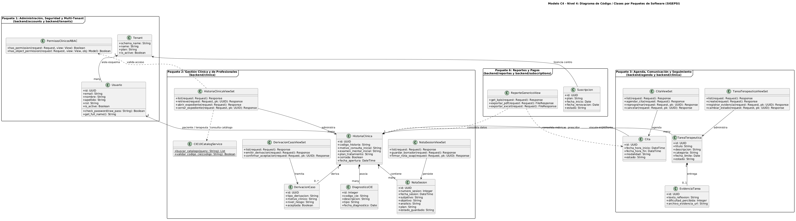


```plantuml
@startuml
skinparam classAttributeIconSize 0
skinparam shadowing false
skinparam roundcorner 6
skinparam defaultFontName Arial
skinparam packageStyle frame
skinparam ranksep 40
skinparam nodesep 30

title Modelo C4 - Nivel 4: Diagrama de Código / Clases por Paquetes de Software (SIGEPSI)

package "Paquete 1: Administración, Seguridad y Multi-Tenant\n(backend/accounts y backend/tenants)" as P1 {
    class Usuario {
        + id: UUID
        + email: String
        + nombre: String
        + apellido: String
        + rol: String
        + is_active: Boolean
        + check_password(raw_pass: String): Boolean
        + get_full_name(): String
    }

    class PermisosClinicosRBAC {
        + has_permission(request: Request, view: View): Boolean
        + has_object_permission(request: Request, view: View, obj: Model): Boolean
    }

    class Tenant {
        + schema_name: String
        + name: String
        + plan: String
        + is_active: Boolean
    }
}

package "Paquete 2: Gestión Clínica y de Profesionales\n(backend/clinica)" as P2 {
    class HistoriaClinicaViewSet {
        + list(request: Request): Response
        + retrieve(request: Request, pk: UUID): Response
        + abrir_expediente(request: Request): Response
        + cerrar_expediente(request: Request, pk: UUID): Response
    }

    class NotaSesionViewSet {
        + list(request: Request): Response
        + guardar_borrador(request: Request): Response
        + firmar_nota_soap(request: Request, pk: UUID): Response
    }

    class DerivacionCasoViewSet {
        + list(request: Request): Response
        + emitir_derivacion(request: Request): Response
        + confirmar_aceptacion(request: Request, pk: UUID): Response
    }

    class CIE10CatalogService {
        + {static} buscar_catalogo(query: String): List
        + {static} validar_codigo_cie(codigo: String): Boolean
    }

    class HistoriaClinica {
        + id: UUID
        + codigo_historia: String
        + motivo_consulta_inicial: String
        + examen_mental_inicial: String
        + plan_tratamiento: String
        + cerrada: Boolean
        + fecha_apertura: DateTime
    }

    class DiagnosticoCIE {
        + id: Integer
        + codigo_cie: String
        + descripcion: String
        + tipo: String
        + fecha_diagnostico: Date
    }

    class NotaSesion {
        + id: UUID
        + numero_sesion: Integer
        + fecha_sesion: DateTime
        + subjetivo: String
        + objetivo: String
        + analisis: String
        + plan: String
        + estado_guardado: String
    }

    class DerivacionCaso {
        + id: UUID
        + tipo_derivacion: String
        + motivo_clinico: String
        + nivel_riesgo: String
        + aceptada: Boolean
    }
}

package "Paquete 3: Agenda, Comunicación y Seguimiento\n(backend/agenda y backend/clinica)" as P3 {
    class CitaViewSet {
        + list(request: Request): Response
        + agendar_cita(request: Request): Response
        + reprogramar(request: Request, pk: UUID): Response
        + cancelar(request: Request, pk: UUID): Response
    }

    class Cita {
        + id: UUID
        + fecha_hora_inicio: DateTime
        + fecha_hora_fin: DateTime
        + modalidad: String
        + estado: String
    }

    class TareaTerapeuticaViewSet {
        + list(request: Request): Response
        + create(request: Request): Response
        + registrar_evidencia(request: Request, pk: UUID): Response
        + cambiar_estado(request: Request, pk: UUID): Response
    }

    class TareaTerapeutica {
        + id: UUID
        + titulo: String
        + descripcion: String
        + categoria: String
        + fecha_limite: Date
        + estado: String
    }

    class EvidenciaTarea {
        + id: UUID
        + texto_reflexion: String
        + dificultad_percibida: Integer
        + archivo_evidencia_url: String
    }
}

package "Paquete 4: Formularios, Consentimientos y Documentación\n(backend/clinica)" as P4 {
    class FormularioPreConsultaViewSet {
        + list(request: Request): Response
        + retrieve(request: Request, pk: UUID): Response
        + configurar_preguntas(request: Request, pk: UUID): Response
    }

    class FirmaConsentimientoViewSet {
        + list(request: Request): Response
        + registrar_firma(request: Request): Response
        + descargar_pdf_sellado(request: Request, pk: UUID): FileResponse
    }

    class FormularioPreConsulta {
        + id: UUID
        + titulo: String
        + version: String
        + preguntas_schema: JSONField
        + activo: Boolean
    }

    class RespuestaPreConsulta {
        + id: UUID
        + motivo_consulta: String
        + sintomas_principales: String
        + nivel_urgencia_percibido: Integer
        + estado: String
        + tiene_urgencia_alta(): Boolean
    }

    class ConsentimientoInformado {
        + id: UUID
        + titulo: String
        + contenido_legal: String
        + version: String
        + activo: Boolean
    }

    class FirmaConsentimiento {
        + id: UUID
        + firmado_por: String
        + hash_sha256: String
        + ip_origen: String
        + firma_canvas_url: String
        + es_menor_edad: Boolean
    }
}

package "Paquete 5: Inteligencia Artificial y Chatbot\n(backend/clinica)" as P5 {
    class PreconsultaRulesEngine {
        + {static} sanitizar_pii(texto: String): String
        + {static} evaluar_preconsulta(respuesta: RespuestaPreConsulta): Dict
        + {static} formular_resumen_neutral(respuesta: RespuestaPreConsulta): Dict
    }

    class IAPreconsultaViewSet {
        + evaluar_preconsulta(request: Request): Response
        + consultar_explicabilidad(request: Request, pk: UUID): Response
    }

    class ChatbotViewSet {
        + iniciar_conversacion(request: Request): Response
        + procesar_mensaje(request: Request): Response
        + solicitar_soporte_humano(request: Request): Response
    }

    class ConversacionChatbot {
        + id: UUID
        + session_id: String
        + estado: String
        + escalada_a_humano: Boolean
        + intencion_predominante: String
    }

    class AuditoriaIA {
        + id: UUID
        + prompt_hash: String
        + decision_tipo: String
        + revisado_por_humano: Boolean
        + fecha_evaluacion: DateTime
    }
}

package "Paquete 6: Reportes y Pagos\n(backend/reportes y backend/subscriptions)" as P6 {
    class ReporteGenericoView {
        + get_kpis(request: Request): Response
        + exportar_pdf(request: Request): FileResponse
        + exportar_excel(request: Request): FileResponse
    }

    class Suscripcion {
        + id: UUID
        + plan: String
        + fecha_inicio: Date
        + fecha_renovacion: Date
        + estado: String
    }
}

' Estructura 2 columnas
P1 -[hidden]down-> P2
P2 -[hidden]down-> P3

P4 -[hidden]down-> P5
P5 -[hidden]down-> P6

P1 -[hidden]right-> P4
P2 -[hidden]right-> P5
P3 -[hidden]right-> P6

' Paquete 1: Seguridad y Aislamiento
Usuario "1" <-- "many" HistoriaClinica : paciente / terapeuta
Tenant "1" <-- "many" Usuario : aisla esquema
HistoriaClinicaViewSet ..> PermisosClinicosRBAC : valida acceso
HistoriaClinicaViewSet ..> CIE10CatalogService : consulta catálogo

' Paquete 2: Clínica y Expedientes
HistoriaClinicaViewSet --> HistoriaClinica : administra
HistoriaClinica "1" *-- "many" DiagnosticoCIE : asocia
HistoriaClinica "1" *-- "many" NotaSesion : contiene
NotaSesionViewSet --> NotaSesion : persiste
DerivacionCasoViewSet --> DerivacionCaso : tramita
HistoriaClinica "1" *-- "0..*" DerivacionCaso : deriva

' Paquete 4: Intake y Consentimientos
FormularioPreConsultaViewSet --> FormularioPreConsulta : gestiona
FormularioPreConsulta "1" *-- "many" RespuestaPreConsulta : instancia
FirmaConsentimientoViewSet --> FirmaConsentimiento : registra
ConsentimientoInformado "1" *-- "many" FirmaConsentimiento : formaliza
FirmaConsentimientoViewSet --> ConsentimientoInformado : valida

' Paquete 5: Inteligencia Artificial y Chatbot
IAPreconsultaViewSet ..> PreconsultaRulesEngine : ejecuta inferencia
PreconsultaRulesEngine ..> RespuestaPreConsulta : evalúa síntomas
IAPreconsultaViewSet --> AuditoriaIA : audita decisión
ChatbotViewSet --> ConversacionChatbot : registra sesión

' Paquete 3: Agenda y Tareas
CitaViewSet --> Cita : agenda
Cita --> HistoriaClinica : vincula expediente
TareaTerapeuticaViewSet --> TareaTerapeutica : administra
TareaTerapeutica "1" *-- "0..1" EvidenciaTarea : entrega
HistoriaClinica "1" *-- "many" TareaTerapeutica : prescribe

' Paquete 6: Reportes y Suscripciones
ReporteGenericoView ..> HistoriaClinica : consolida datos
ReporteGenericoView ..> Cita : consolida métricas
Suscripcion --> Tenant : licencia centro

@enduml
```

###### Diagrama Complementario: Despliegue Físico en Producción (Deployment)

Mapea la distribución real de los contenedores sobre la infraestructura cloud especificada en `render.yaml` y documentada en la guía de despliegue (`DESPLIEGUE_RENDER.md`):

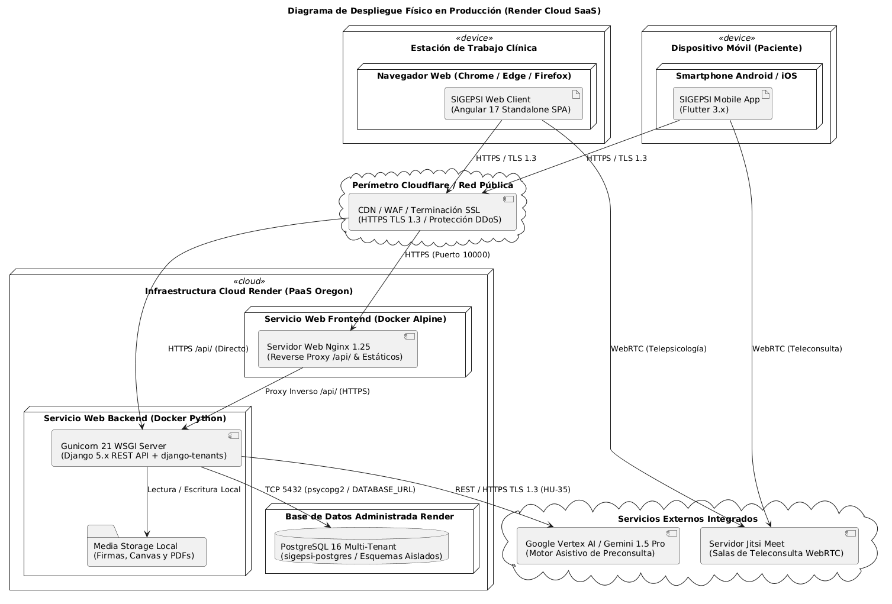

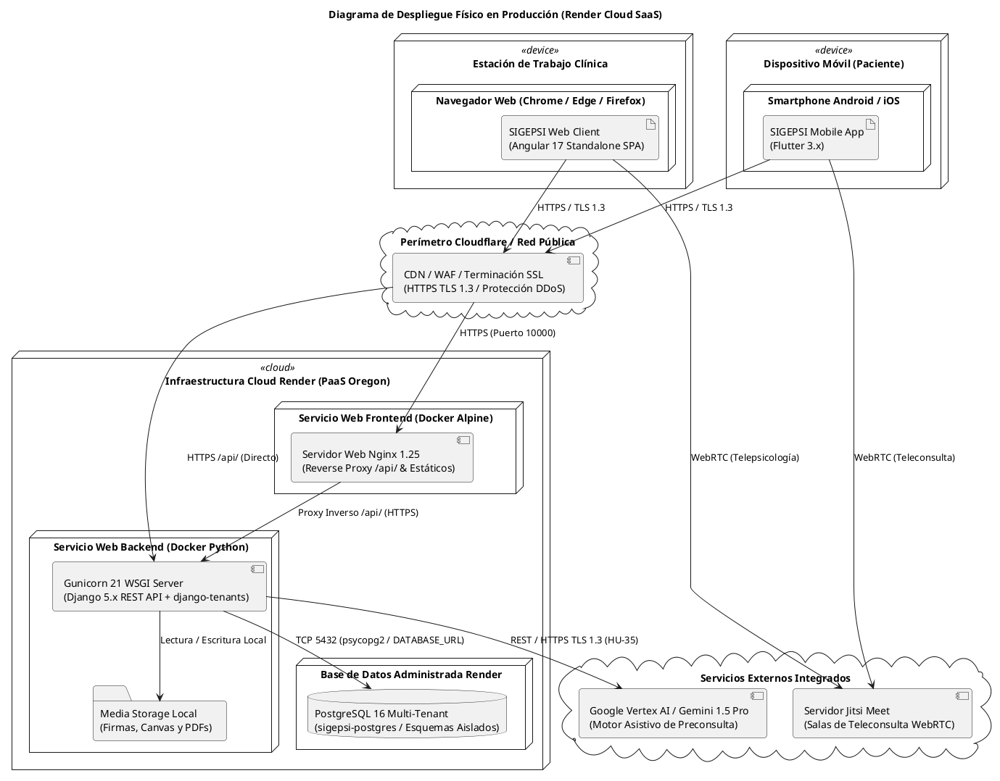
```plantuml
@startuml
skinparam roundcorner 8
skinparam shadowing false
skinparam defaultFontName Arial

title Diagrama de Despliegue Físico en Producción (Render Cloud SaaS)

node "Dispositivo Móvil (Paciente)" <<device>> {
    node "Smartphone Android / iOS" {
        artifact "SIGEPSI Mobile App\n(Flutter 3.x)" as app_movil
    }
}

node "Estación de Trabajo Clínica" <<device>> {
    node "Navegador Web (Chrome / Edge / Firefox)" {
        artifact "SIGEPSI Web Client\n(Angular 17 Standalone SPA)" as app_web
    }
}

cloud "Perímetro Cloudflare / Red Pública" {
    component "CDN / WAF / Terminación SSL\n(HTTPS TLS 1.3 / Protección DDoS)" as cloudflare
}

node "Infraestructura Cloud Render (PaaS Oregon)" <<cloud>> {
    node "Servicio Web Frontend (Docker Alpine)" {
        component "Servidor Web Nginx 1.25\n(Reverse Proxy /api/ & Estáticos)" as nginx_front
    }

    node "Servicio Web Backend (Docker Python)" {
        component "Gunicorn 21 WSGI Server\n(Django 5.x REST API + django-tenants)" as backend_api
        folder "Media Storage Local\n(Firmas, Canvas y PDFs)" as media_storage
    }

    node "Base de Datos Administrada Render" {
        database "PostgreSQL 16 Multi-Tenant\n(sigepsi-postgres / Esquemas Aislados)" as pg_db
    }
}

cloud "Servicios Externos Integrados" {
    component "Servidor Jitsi Meet\n(Salas de Teleconsulta WebRTC)" as jitsi_server
    component "Google Vertex AI / Gemini 1.5 Pro\n(Motor Asistivo de Preconsulta)" as gemini_api
}

app_movil --> cloudflare : HTTPS / TLS 1.3
app_web --> cloudflare : HTTPS / TLS 1.3

cloudflare --> nginx_front : HTTPS (Puerto 10000)
cloudflare --> backend_api : HTTPS /api/ (Directo)
nginx_front --> backend_api : Proxy Inverso /api/ (HTTPS)

backend_api --> pg_db : TCP 5432 (psycopg2 / DATABASE_URL)
backend_api --> media_storage : Lectura / Escritura Local

backend_api --> gemini_api : REST / HTTPS TLS 1.3 (HU-35)
app_web --> jitsi_server : WebRTC (Telepsicología)
app_movil --> jitsi_server : WebRTC (Teleconsulta)
@enduml
```

#### 6.2.1.2 Diseño de Datos (Modelo Relacional DDL en PostgreSQL 16)

```sql
-- ============================================================================
-- PLATAFORMA SIGEPSI - GESTIÓN DE CENTROS DE SALUD MENTAL
-- MODELO DE DATOS FÍSICO DDL - POSTGRESQL 16 (ARQUITECTURA MULTI-TENANT)
-- INCREMENTO CLÍNICO SPRINT 2 (EJECUTADO DENTRO DEL ESQUEMA TENANT)
-- ============================================================================

-- 1. Formulario Pre-Consulta e Intake Digital
CREATE TABLE IF NOT EXISTS clinica_formulariopreconsulta (
    id UUID PRIMARY KEY DEFAULT gen_random_uuid(),
    titulo VARCHAR(150) NOT NULL,
    version VARCHAR(20) NOT NULL DEFAULT 'v1.0',
    descripcion TEXT,
    preguntas_schema JSONB NOT NULL DEFAULT '[]'::jsonb,
    activo BOOLEAN NOT NULL DEFAULT TRUE,
    fecha_creacion TIMESTAMP WITH TIME ZONE DEFAULT CURRENT_TIMESTAMP,
    fecha_actualizacion TIMESTAMP WITH TIME ZONE DEFAULT CURRENT_TIMESTAMP
);

CREATE TABLE IF NOT EXISTS clinica_respuestapreconsulta (
    id UUID PRIMARY KEY DEFAULT gen_random_uuid(),
    formulario_id UUID NOT NULL REFERENCES clinica_formulariopreconsulta(id) ON DELETE RESTRICT,
    paciente_id UUID NOT NULL REFERENCES clinica_paciente(id) ON DELETE CASCADE,
    cita_id UUID REFERENCES agenda_cita(id) ON DELETE SET NULL,
    motivo_consulta TEXT NOT NULL,
    sintomas_principales TEXT,
    nivel_urgencia_percibido SMALLINT NOT NULL CHECK (nivel_urgencia_percibido BETWEEN 1 AND 5),
    antecedentes_medicos TEXT,
    antecedentes_psiquiatricos TEXT,
    medicacion_actual TEXT,
    respuestas_detalle JSONB NOT NULL DEFAULT '{}'::jsonb,
    estado VARCHAR(20) NOT NULL DEFAULT 'ENVIADO' CHECK (estado IN ('ENVIADO', 'REVISADO', 'ARCHIVADO')),
    fecha_envio TIMESTAMP WITH TIME ZONE DEFAULT CURRENT_TIMESTAMP
);

-- 2. Historia Clínica Psicológica Electrónica
CREATE TABLE IF NOT EXISTS clinica_historiaclinica (
    id UUID PRIMARY KEY DEFAULT gen_random_uuid(),
    paciente_id UUID UNIQUE NOT NULL REFERENCES clinica_paciente(id) ON DELETE CASCADE,
    psicologo_apertura_id UUID NOT NULL REFERENCES clinica_psicologo(id) ON DELETE RESTRICT,
    codigo_historia VARCHAR(50) UNIQUE NOT NULL,
    motivo_consulta_inicial TEXT NOT NULL,
    antecedentes_personales TEXT,
    antecedentes_familiares TEXT,
    historia_evolutiva TEXT,
    examen_mental_inicial TEXT,
    plan_tratamiento TEXT,
    cerrada BOOLEAN NOT NULL DEFAULT FALSE,
    fecha_apertura TIMESTAMP WITH TIME ZONE DEFAULT CURRENT_TIMESTAMP,
    fecha_cierre TIMESTAMP WITH TIME ZONE,
    fecha_actualizacion TIMESTAMP WITH TIME ZONE DEFAULT CURRENT_TIMESTAMP
);

CREATE TABLE IF NOT EXISTS clinica_diagnosticocie (
    id SERIAL PRIMARY KEY,
    historia_clinica_id UUID NOT NULL REFERENCES clinica_historiaclinica(id) ON DELETE CASCADE,
    codigo_cie VARCHAR(20) NOT NULL,
    descripcion VARCHAR(255) NOT NULL,
    tipo VARCHAR(20) NOT NULL DEFAULT 'PRESUNTIVO' CHECK (tipo IN ('PRESUNTIVO', 'CONFIRMADO', 'DIFERENCIAL')),
    observaciones TEXT,
    fecha_diagnostico DATE NOT NULL DEFAULT CURRENT_DATE
);

-- 3. Notas de Sesión Clínicas (Modelo SOAP)
CREATE TABLE IF NOT EXISTS clinica_notasesion (
    id UUID PRIMARY KEY DEFAULT gen_random_uuid(),
    historia_clinica_id UUID NOT NULL REFERENCES clinica_historiaclinica(id) ON DELETE CASCADE,
    cita_id UUID UNIQUE REFERENCES agenda_cita(id) ON DELETE SET NULL,
    psicologo_id UUID NOT NULL REFERENCES clinica_psicologo(id) ON DELETE RESTRICT,
    numero_sesion INTEGER NOT NULL CHECK (numero_sesion > 0),
    fecha_sesion TIMESTAMP WITH TIME ZONE DEFAULT CURRENT_TIMESTAMP,
    subjetivo TEXT NOT NULL,
    objetivo TEXT NOT NULL,
    analisis TEXT NOT NULL,
    plan TEXT NOT NULL,
    tecnicas_aplicadas VARCHAR(255),
    conducta_observada TEXT,
    estado_guardado VARCHAR(20) NOT NULL DEFAULT 'FIRMADA' CHECK (estado_guardado IN ('BORRADOR', 'FIRMADA', 'EDITADA')),
    fecha_creacion TIMESTAMP WITH TIME ZONE DEFAULT CURRENT_TIMESTAMP
);

-- 4. Evolución Longitudinal y Acuerdos
CREATE TABLE IF NOT EXISTS clinica_evolucionclinica (
    id UUID PRIMARY KEY DEFAULT gen_random_uuid(),
    historia_clinica_id UUID NOT NULL REFERENCES clinica_historiaclinica(id) ON DELETE CASCADE,
    nota_sesion_id UUID REFERENCES clinica_notasesion(id) ON DELETE SET NULL,
    estado_avance VARCHAR(30) NOT NULL CHECK (estado_avance IN ('PROGRESO_NOTABLE', 'EN_PROCESO', 'ESTANCAMIENTO', 'RETROCESO_CRISIS')),
    justificacion TEXT NOT NULL,
    acuerdos_pactados TEXT,
    fecha_registro TIMESTAMP WITH TIME ZONE DEFAULT CURRENT_TIMESTAMP
);

-- 5. Tareas Terapéuticas Inter-Sesiones y Evidencias
CREATE TABLE IF NOT EXISTS clinica_tareaterapeutica (
    id UUID PRIMARY KEY DEFAULT gen_random_uuid(),
    historia_clinica_id UUID NOT NULL REFERENCES clinica_historiaclinica(id) ON DELETE CASCADE,
    psicologo_id UUID NOT NULL REFERENCES clinica_psicologo(id) ON DELETE RESTRICT,
    paciente_id UUID NOT NULL REFERENCES clinica_paciente(id) ON DELETE CASCADE,
    titulo VARCHAR(150) NOT NULL,
    descripcion TEXT NOT NULL,
    categoria VARCHAR(50) NOT NULL DEFAULT 'COGNITIVA' CHECK (categoria IN ('COGNITIVA', 'CONDUCTUAL', 'MINDFULNESS', 'AUTOREGISTRO', 'OTRA')),
    fecha_limite DATE NOT NULL,
    estado VARCHAR(20) NOT NULL DEFAULT 'PENDIENTE' CHECK (estado IN ('PENDIENTE', 'EN_REVISION', 'COMPLETADA', 'VENCIDA', 'NO_REALIZADA')),
    archivo_adjunto_url VARCHAR(255),
    fecha_creacion TIMESTAMP WITH TIME ZONE DEFAULT CURRENT_TIMESTAMP
);

CREATE TABLE IF NOT EXISTS clinica_evidenciatarea (
    id UUID PRIMARY KEY DEFAULT gen_random_uuid(),
    tarea_id UUID UNIQUE NOT NULL REFERENCES clinica_tareaterapeutica(id) ON DELETE CASCADE,
    texto_reflexion TEXT NOT NULL,
    dificultad_percibida SMALLINT NOT NULL CHECK (dificultad_percibida BETWEEN 1 AND 5),
    archivo_evidencia_url VARCHAR(255),
    fecha_cumplimiento TIMESTAMP WITH TIME ZONE DEFAULT CURRENT_TIMESTAMP
);

-- 6. Consentimientos Informados y Firmas Digitales
CREATE TABLE IF NOT EXISTS clinica_consentimientoinformado (
    id UUID PRIMARY KEY DEFAULT gen_random_uuid(),
    titulo VARCHAR(150) NOT NULL,
    tipo VARCHAR(50) NOT NULL CHECK (tipo IN ('ATENCION_GENERAL', 'TELEPSICOLOGIA', 'MENORES_EDAD', 'DATOS_SENSIBLES')),
    contenido_legal TEXT NOT NULL,
    version VARCHAR(20) NOT NULL DEFAULT 'v1.0',
    activo BOOLEAN NOT NULL DEFAULT TRUE,
    fecha_creacion TIMESTAMP WITH TIME ZONE DEFAULT CURRENT_TIMESTAMP
);

CREATE TABLE IF NOT EXISTS clinica_firmaconsentimiento (
    id UUID PRIMARY KEY DEFAULT gen_random_uuid(),
    consentimiento_id UUID NOT NULL REFERENCES clinica_consentimientoinformado(id) ON DELETE RESTRICT,
    paciente_id UUID NOT NULL REFERENCES clinica_paciente(id) ON DELETE CASCADE,
    firmado_por VARCHAR(150) NOT NULL,
    es_menor_edad BOOLEAN NOT NULL DEFAULT FALSE,
    tutor_nombre VARCHAR(150),
    tutor_ci VARCHAR(30),
    hash_sha256 VARCHAR(64) NOT NULL,
    ip_origen VARCHAR(45) NOT NULL,
    user_agent TEXT NOT NULL,
    firma_canvas_url VARCHAR(255),
    fecha_firma TIMESTAMP WITH TIME ZONE DEFAULT CURRENT_TIMESTAMP
);

-- 7. Protocolos de Cierre y Derivación Médica
CREATE TABLE IF NOT EXISTS clinica_derivacioncaso (
    id UUID PRIMARY KEY DEFAULT gen_random_uuid(),
    historia_clinica_id UUID NOT NULL REFERENCES clinica_historiaclinica(id) ON DELETE CASCADE,
    psicologo_emisor_id UUID NOT NULL REFERENCES clinica_psicologo(id) ON DELETE RESTRICT,
    tipo_derivacion VARCHAR(30) NOT NULL CHECK (tipo_derivacion IN ('INTERNA_COLEGA', 'EXTERNA_PSIQUIATRIA', 'EXTERNA_NEUROLOGIA', 'CIERRE_ALTA', 'DESERCION')),
    motivo_clinico TEXT NOT NULL,
    sintomatologia_relevante TEXT,
    profesional_destino VARCHAR(150),
    institucion_destino VARCHAR(150),
    nivel_riesgo VARCHAR(20) NOT NULL DEFAULT 'MEDIO' CHECK (nivel_riesgo IN ('BAJO', 'MEDIO', 'ALTO', 'CRITICO')),
    fecha_derivacion TIMESTAMP WITH TIME ZONE DEFAULT CURRENT_TIMESTAMP,
    aceptada BOOLEAN NOT NULL DEFAULT FALSE
);

-- 8. Chatbot de Orientación Clínica y Derivación a Soporte Humano (CU20)
CREATE TABLE IF NOT EXISTS clinica_conversacionchatbot (
    id UUID PRIMARY KEY DEFAULT gen_random_uuid(),
    session_id VARCHAR(100) UNIQUE NOT NULL,
    paciente_id UUID REFERENCES clinica_paciente(id) ON DELETE SET NULL,
    estado VARCHAR(25) NOT NULL DEFAULT 'ACTIVA' CHECK (estado IN ('ACTIVA', 'ESCALADA_HUMANO', 'CERRADA_USUARIO', 'TIMEOUT')),
    escalada_a_humano BOOLEAN NOT NULL DEFAULT FALSE,
    atendida_por_usuario_id UUID REFERENCES autenticacion_usuario(id) ON DELETE SET NULL,
    intencion_predominante VARCHAR(80),
    contiene_riesgo BOOLEAN NOT NULL DEFAULT FALSE,
    fecha_inicio TIMESTAMP WITH TIME ZONE DEFAULT CURRENT_TIMESTAMP,
    fecha_fin TIMESTAMP WITH TIME ZONE
);

CREATE TABLE IF NOT EXISTS clinica_mensajechatbot (
    id UUID PRIMARY KEY DEFAULT gen_random_uuid(),
    conversacion_id UUID NOT NULL REFERENCES clinica_conversacionchatbot(id) ON DELETE CASCADE,
    remitente VARCHAR(20) NOT NULL CHECK (remitente IN ('PACIENTE', 'BOT', 'OPERADOR_HUMANO')),
    contenido TEXT NOT NULL,
    intencion_detectada VARCHAR(80),
    metadatos_payload JSONB DEFAULT '{}'::jsonb,
    timestamp TIMESTAMP WITH TIME ZONE DEFAULT CURRENT_TIMESTAMP
);

-- Índices de Rendimiento y Llaves Foráneas
CREATE INDEX IF NOT EXISTS idx_respuestapre_paciente ON clinica_respuestapreconsulta(paciente_id);
CREATE INDEX IF NOT EXISTS idx_historia_paciente ON clinica_historiaclinica(paciente_id);
CREATE INDEX IF NOT EXISTS idx_notasesion_historia ON clinica_notasesion(historia_clinica_id);
CREATE INDEX IF NOT EXISTS idx_tareaterap_paciente ON clinica_tareaterapeutica(paciente_id);
CREATE INDEX IF NOT EXISTS idx_firmaconsent_paciente ON clinica_firmaconsentimiento(paciente_id);
CREATE INDEX IF NOT EXISTS idx_convchatbot_paciente ON clinica_conversacionchatbot(paciente_id);
CREATE INDEX IF NOT EXISTS idx_mensajechatbot_conv ON clinica_mensajechatbot(conversacion_id);

```

##### Diccionario de Datos del Incremento Clínico

| Tabla                             | Campos Principales                                                                          | Tipo de Datos                                                        | Descripción / Regla de Negocio                                                        |
| :-------------------------------- | :------------------------------------------------------------------------------------------ | :------------------------------------------------------------------- | :------------------------------------------------------------------------------------ |
| `clinica_formulariopreconsulta`   | id, titulo, version, descripcion, preguntas_schema (JSONB), activo                          | UUID, Varchar, Text, JSONB, Boolean                                  | Plantillas de cuestionario pre-consulta configurables por cada centro.                |
| `clinica_respuestapreconsulta`    | id, formulario_id, paciente_id, motivo_consulta, nivel_urgencia, respuestas_detalle (JSONB) | UUID, FK Formulario, FK Paciente, Text, SmallInt, JSONB              | Respuestas clínicas del paciente previa consulta. Nivel de urgencia del 1 al 5.       |
| `clinica_historiaclinica`         | id, paciente_id, psicologo_apertura_id, codigo_historia, anamnesis, examen_mental, cerrada  | UUID, FK Paciente (UNIQUE), FK Psicologo, Varchar, Text, Boolean     | Expediente clínico médico-legal longitudinal. Control RBAC estricto.                  |
| `clinica_diagnosticocie`          | id, historia_clinica_id, codigo_cie, descripcion, tipo (Presuntivo/Confirmado)              | Serial, FK HistoriaClinica, Varchar(20), Varchar(255), Varchar       | Diagnósticos clínicos codificados bajo estándar CIE-10/11 vinculados al caso.         |
| `clinica_notasesion`              | id, historia_clinica_id, cita_id, numero_sesion, subjetivo, objetivo, analisis, plan        | UUID, FK HistoriaClinica, FK Cita, Integer, Text, Text, Text, Text   | Registro estructurado post-sesión bajo metodología clínica SOAP.                      |
| `clinica_evolucionclinica`        | id, historia_clinica_id, nota_sesion_id, estado_avance, justificacion, acuerdos             | UUID, FK HistoriaClinica, FK NotaSesion, Varchar(30), Text, Text     | Seguimiento longitudinal del proceso (Progreso Notable, En Proceso, Retroceso).       |
| `clinica_tareaterapeutica`        | id, historia_clinica_id, psicologo_id, paciente_id, titulo, categoria, fecha_limite, estado | UUID, FK Historia, FK Psicologo, FK Paciente, Varchar, Date, Varchar | Actividades y ejercicios asignados entre sesiones para práctica terapéutica.          |
| `clinica_evidenciatarea`          | id, tarea_id, texto_reflexion, dificultad_percibida (1-5), archivo_evidencia_url            | UUID, FK Tarea (UNIQUE), Text, SmallInt, Varchar                     | Reporte de cumplimiento y auto-reflexión remitido por el paciente desde Flutter.      |
| `clinica_consentimientoinformado` | id, titulo, tipo (Atención, Telepsicología, Menores, Datos), contenido_legal, version       | UUID, Varchar, Varchar, Text, Varchar                                | Plantillas institucionales con cláusulas legales y límites de confidencialidad.       |
| `clinica_firmaconsentimiento`     | id, consentimiento_id, paciente_id, hash_sha256, ip_origen, user_agent, firma_canvas_url    | UUID, FK Consentimiento, FK Paciente, Varchar(64), Varchar, Text     | Registro inmutable de formalización de consentimiento con trazabilidad criptográfica. |
| `clinica_derivacioncaso`          | id, historia_clinica_id, psicologo_emisor_id, tipo_derivacion, motivo_clinico, nivel_riesgo | UUID, FK Historia, FK Psicologo, Varchar, Text, Varchar              | Protocolo formal de alta terapéutica o derivación médica externa a Psiquiatría.       |
| `clinica_conversacionchatbot`     | id, session_id, paciente_id, estado, escalada_a_humano, atendida_por_usuario_id             | UUID, Varchar, FK Paciente, Varchar, Boolean, FK Usuario             | Sesión interactiva del chatbot con control de estado y derivación humana.             |
| `clinica_mensajechatbot`          | id, conversacion_id, remitente, contenido, intencion_detectada, timestamp                   | UUID, FK Conversacion, Varchar, Text, Varchar, Timestamp             | Registro granular de mensajes intercambiados entre paciente, bot y operador humano.   |

#### 6.2.1.3 Diseño de la Lógica de Negocio (Patrón de Comunicación BCE)

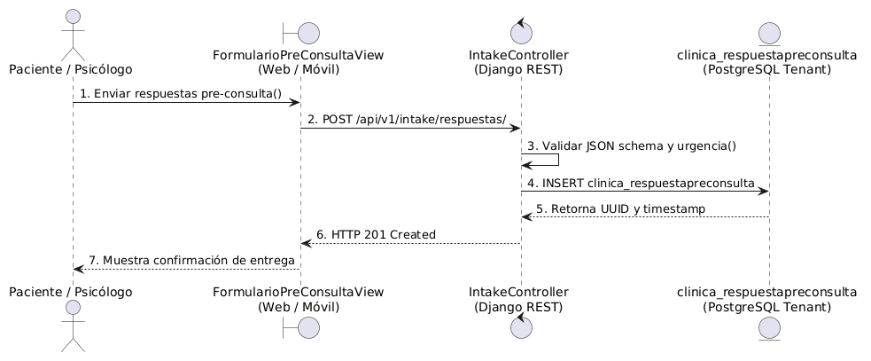

A continuación se presentan los diagramas de comunicación BCE generados programáticamente para cada caso de uso clínico y para el consentimiento ético con IA:

##### Diagrama de Comunicación CU14: Ficha Previa de Intake Digital

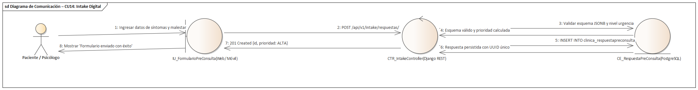

##### Diagrama de Comunicación CU15: Historia Clínica y Control RBAC

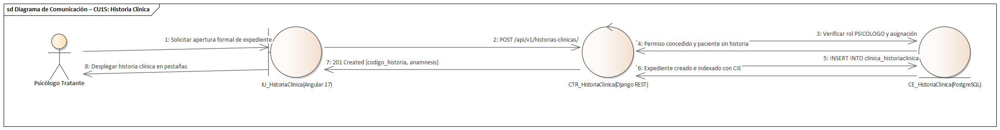

##### Diagrama de Comunicación CU16: Notas SOAP y Autoguardado Reactivo

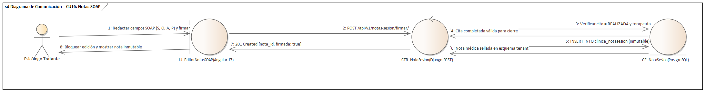

##### Diagrama de Comunicación CU17: Tareas Terapéuticas y Feedback

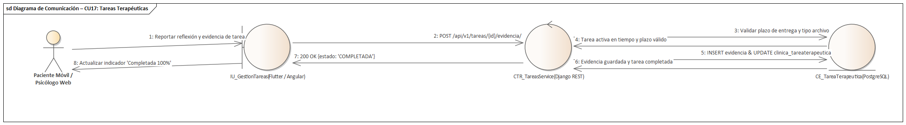

##### Diagrama de Comunicación CU18: Consentimiento Informado y Firma Digital

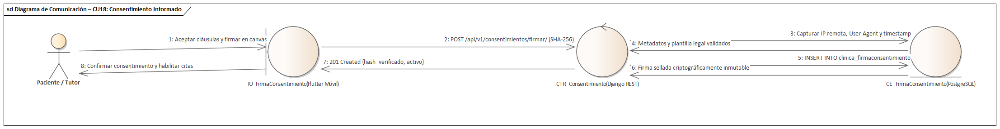

##### Diagrama de Comunicación CU19: Cierre de Caso y Derivación Psiquiátrica

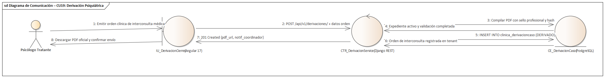

##### Diagrama de Comunicación CU20: Chatbot de Orientación Clínica y Derivación a Soporte Humano


##### Diagrama de Comunicación HU-35: Consentimiento y Pasarela Ética de IA

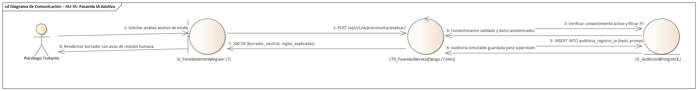

##### Diagrama de Comunicación CU5: Bitácora Confidencial y Llave Única del Desarrollador (Criterio 3)


##### Diagrama de Comunicación CU25: Constructor de Reportes Personalizados (QBE), Multiformato y Voz (Criterio 5)


##### Diagrama de Comunicación CU28: Copias de Seguridad y Restauración (Backup / Restore) en la Nube (Criterio 6)


###### Especificación PlantUML BCE – CU14

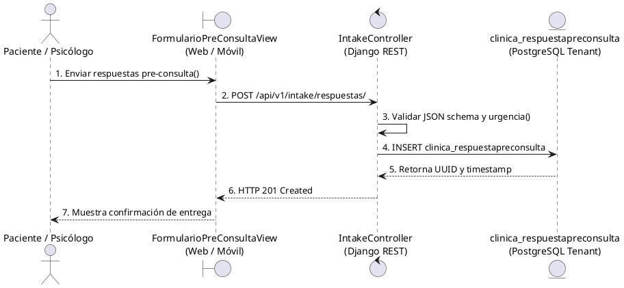
```plantuml
@startuml
skinparam shadowing false
skinparam roundcorner 8
skinparam defaultFontName Arial
actor "Paciente / Psicólogo" as actor
boundary "FormularioPreConsultaView\n(Web / Móvil)" as view
control "IntakeController\n(Django REST)" as ctrl
entity "clinica_respuestapreconsulta\n(PostgreSQL Tenant)" as entity

actor -> view : 1. Enviar respuestas pre-consulta()
view -> ctrl : 2. POST /api/v1/intake/respuestas/
ctrl -> ctrl : 3. Validar JSON schema y urgencia()
ctrl -> entity : 4. INSERT clinica_respuestapreconsulta
entity --> ctrl : 5. Retorna UUID y timestamp
ctrl --> view : 6. HTTP 201 Created
view --> actor : 7. Muestra confirmación de entrega
@enduml
```

###### Especificación PlantUML BCE – CU15

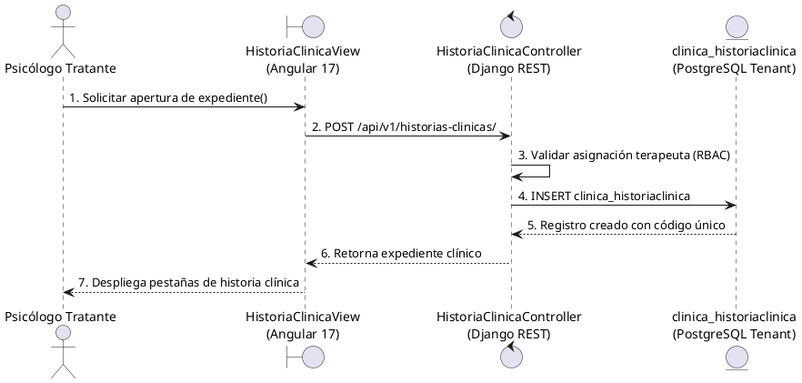
```plantuml
@startuml
skinparam shadowing false
skinparam roundcorner 8
skinparam defaultFontName Arial
actor "Psicólogo Tratante" as actor
boundary "HistoriaClinicaView\n(Angular 17)" as view
control "HistoriaClinicaController\n(Django REST)" as ctrl
entity "clinica_historiaclinica\n(PostgreSQL Tenant)" as entity

actor -> view : 1. Solicitar apertura de expediente()
view -> ctrl : 2. POST /api/v1/historias-clinicas/
ctrl -> ctrl : 3. Validar asignación terapeuta (RBAC)
ctrl -> entity : 4. INSERT clinica_historiaclinica
entity --> ctrl : 5. Registro creado con código único
ctrl --> view : 6. Retorna expediente clínico
view --> actor : 7. Despliega pestañas de historia clínica
@enduml
```

###### Especificación PlantUML BCE – CU16

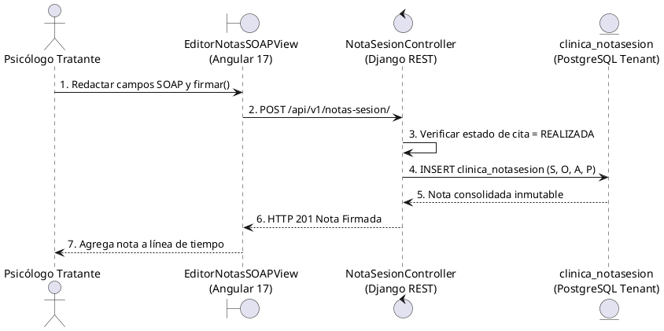
```plantuml
@startuml
skinparam shadowing false
skinparam roundcorner 8
skinparam defaultFontName Arial
actor "Psicólogo Tratante" as actor
boundary "EditorNotasSOAPView\n(Angular 17)" as view
control "NotaSesionController\n(Django REST)" as ctrl
entity "clinica_notasesion\n(PostgreSQL Tenant)" as entity

actor -> view : 1. Redactar campos SOAP y firmar()
view -> ctrl : 2. POST /api/v1/notas-sesion/
ctrl -> ctrl : 3. Verificar estado de cita = REALIZADA
ctrl -> entity : 4. INSERT clinica_notasesion (S, O, A, P)
entity --> ctrl : 5. Nota consolidada inmutable
ctrl --> view : 6. HTTP 201 Nota Firmada
view --> actor : 7. Agrega nota a línea de tiempo
@enduml
```

###### Especificación PlantUML BCE – CU17

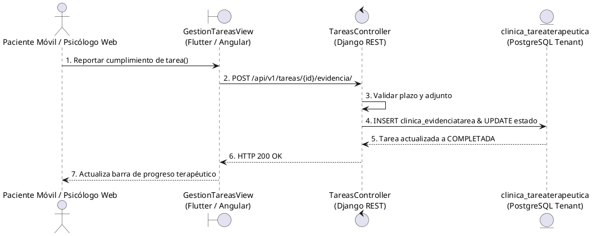
```plantuml
@startuml
skinparam shadowing false
skinparam roundcorner 8
skinparam defaultFontName Arial
actor "Paciente Móvil / Psicólogo Web" as actor
boundary "GestionTareasView\n(Flutter / Angular)" as view
control "TareasController\n(Django REST)" as ctrl
entity "clinica_tareaterapeutica\n(PostgreSQL Tenant)" as entity

actor -> view : 1. Reportar cumplimiento de tarea()
view -> ctrl : 2. POST /api/v1/tareas/{id}/evidencia/
ctrl -> ctrl : 3. Validar plazo y adjunto
ctrl -> entity : 4. INSERT clinica_evidenciatarea & UPDATE estado
entity --> ctrl : 5. Tarea actualizada a COMPLETADA
ctrl --> view : 6. HTTP 200 OK
view --> actor : 7. Actualiza barra de progreso terapéutico
@enduml
```

###### Especificación PlantUML BCE – CU18

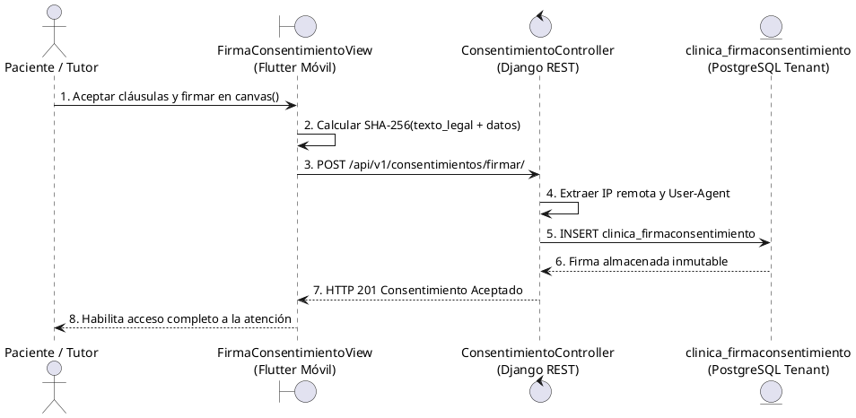
```plantuml
@startuml
skinparam shadowing false
skinparam roundcorner 8
skinparam defaultFontName Arial
actor "Paciente / Tutor" as actor
boundary "FirmaConsentimientoView\n(Flutter Móvil)" as view
control "ConsentimientoController\n(Django REST)" as ctrl
entity "clinica_firmaconsentimiento\n(PostgreSQL Tenant)" as entity

actor -> view : 1. Aceptar cláusulas y firmar en canvas()
view -> view : 2. Calcular SHA-256(texto_legal + datos)
view -> ctrl : 3. POST /api/v1/consentimientos/firmar/
ctrl -> ctrl : 4. Extraer IP remota y User-Agent
ctrl -> entity : 5. INSERT clinica_firmaconsentimiento
entity --> ctrl : 6. Firma almacenada inmutable
ctrl --> view : 7. HTTP 201 Consentimiento Aceptado
view --> actor : 8. Habilita acceso completo a la atención
@enduml
```

###### Especificación PlantUML BCE – CU19

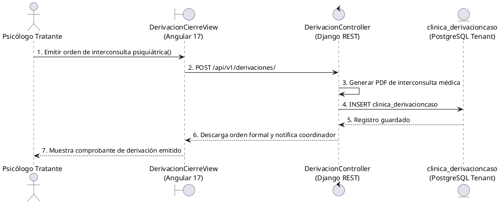
```plantuml
@startuml
skinparam shadowing false
skinparam roundcorner 8
skinparam defaultFontName Arial
actor "Psicólogo Tratante" as actor
boundary "DerivacionCierreView\n(Angular 17)" as view
control "DerivacionController\n(Django REST)" as ctrl
entity "clinica_derivacioncaso\n(PostgreSQL Tenant)" as entity

actor -> view : 1. Emitir orden de interconsulta psiquiátrica()
view -> ctrl : 2. POST /api/v1/derivaciones/
ctrl -> ctrl : 3. Generar PDF de interconsulta médica
ctrl -> entity : 4. INSERT clinica_derivacioncaso
entity --> ctrl : 5. Registro guardado
ctrl --> view : 6. Descarga orden formal y notifica coordinador
view --> actor : 7. Muestra comprobante de derivación emitido
@enduml
```

###### Especificación PlantUML BCE – CU20 (Interacción con el Chatbot de Orientación)

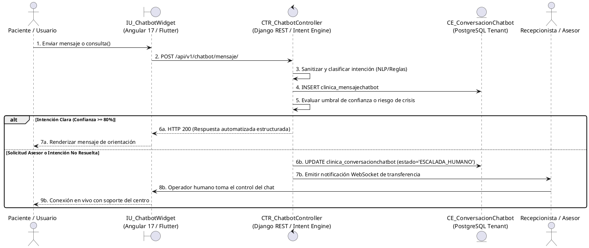
```plantuml
@startuml
skinparam shadowing false
skinparam roundcorner 8
skinparam defaultFontName Arial
actor "Paciente / Usuario" as actor
boundary "IU_ChatbotWidget\n(Angular 17 / Flutter)" as view
control "CTR_ChatbotController\n(Django REST / Intent Engine)" as ctrl
entity "CE_ConversacionChatbot\n(PostgreSQL Tenant)" as entity
actor "Recepcionista / Asesor" as human

actor -> view : 1. Enviar mensaje o consulta()
view -> ctrl : 2. POST /api/v1/chatbot/mensaje/
ctrl -> ctrl : 3. Sanitizar y clasificar intención (NLP/Reglas)
ctrl -> entity : 4. INSERT clinica_mensajechatbot
ctrl -> ctrl : 5. Evaluar umbral de confianza o riesgo de crisis
alt Intención Clara (Confianza >= 80%)
    ctrl --> view : 6a. HTTP 200 (Respuesta automatizada estructurada)
    view --> actor : 7a. Renderizar mensaje de orientación
else Solicitud Asesor o Intención No Resuelta
    ctrl -> entity : 6b. UPDATE clinica_conversacionchatbot (estado='ESCALADA_HUMANO')
    ctrl -> human : 7b. Emitir notificación WebSocket de transferencia
    human -> view : 8b. Operador humano toma el control del chat
    view --> actor : 9b. Conexión en vivo con soporte del centro
end
@enduml
```

###### Especificación PlantUML BCE – CU5 (Bitácora Confidencial y Llave de Desarrollador)

* **Ubicación en Enterprise Architect:** `DIAGRAMAS.eapx` → *Sprint 2* → *6. Diagramas de Comunicación - Sprint 2* → *CU5 - Bitácora Confidencial y Llave de Desarrollador* (**Diagrama ID: 156**).
* **Exportación Bitmap:** [`diagramas/Diagrama de Comunicacion - CU5 Bitacora Confidencial.bmp`](file:///c:/Users/User/Documents/2-2026/SI2/PROYECTO_GRUPAL_OFI/diagramas/Diagrama%20de%20Comunicacion%20-%20CU5%20Bitacora%20Confidencial.bmp)
* **Participantes del Patrón BCE:**
  * **Actor Principal:** `SuperAdmin / Desarrollador` (Personal técnico autorizado para labores de auditoría forense).
  * **Clase Interfaz (`<<boundary>>`):** `IU_VisorBitacora (Angular 17)` (Componente de tabla forense interactiva y modal de autenticación por llave simétrica).
  * **Clase Control (`<<control>>`):** `CTR_AuditController (Django REST + Fernet)` (Middleware y controlador de descifrado en memoria y validación de firma HMAC-SHA256).
  * **Clase Entidad (`<<entity>>`):** `CE_EncryptedAuditFile` (Archivo físico en disco del servidor `audit-YYYY-MM-DD.log.enc` protegido con permisos POSIX `0600`) y `CE_Usuario` (Modelo de usuarios en PostgreSQL).

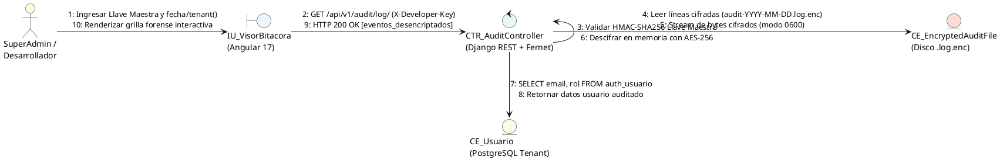
```plantuml
@startuml
skinparam shadowing false
skinparam roundcorner 8
skinparam defaultFontName Arial
skinparam packageStyle rectangle

actor "SuperAdmin /\nDesarrollador" as act #LightYellow
boundary "IU_VisorBitacora\n(Angular 17)" as iu #EBF5FB
control "CTR_AuditController\n(Django REST + Fernet)" as ctr #E8F8F5
entity "CE_EncryptedAuditFile\n(Disco .log.enc)" as file #FADBD8
entity "CE_Usuario\n(PostgreSQL Tenant)" as usr #FEF9E7

act -right-> iu : 1: Ingresar Llave Maestra y fecha/tenant()\n10: Renderizar grilla forense interactiva
iu -right-> ctr : 2: GET /api/v1/audit/log/ (X-Developer-Key)\n9: HTTP 200 OK [eventos_desencriptados]
ctr -right-> file : 4: Leer líneas cifradas (audit-YYYY-MM-DD.log.enc)\n5: Stream de bytes cifrados (modo 0600)
ctr -down-> usr : 7: SELECT email, rol FROM auth_usuario\n8: Retornar datos usuario auditado
ctr -up-> ctr : 3: Validar HMAC-SHA256 Llave Maestra\n6: Descifrar en memoria con AES-256
@enduml
```

###### Especificación PlantUML BCE – CU25 (Reportes Personalizados QBE, Multiformato y Voz)

* **Ubicación en Enterprise Architect:** `DIAGRAMAS.eapx` → *Sprint 2* → *6. Diagramas de Comunicación - Sprint 2* → *CU25 - Reportes Personalizados QBE y Comandos de Voz* (**Diagrama ID: 157**).
* **Exportación Bitmap:** [`diagramas/Diagrama de Comunicacion - CU25 Reportes QBE.bmp`](file:///c:/Users/User/Documents/2-2026/SI2/PROYECTO_GRUPAL_OFI/diagramas/Diagrama%20de%20Comunicacion%20-%20CU25%20Reportes%20QBE.bmp)
* **Participantes del Patrón BCE:**
  * **Actor Principal:** `Admin Centro / Coordinador` (Responsable de administración clínica del centro psicológico).
  * **Clase Interfaz (`<<boundary>>`):** `IU_ConstructorReportes (Angular 17 + Web Speech)` (Constructor visual reactivo de consultas dinámicas por arrastre/selección de columnas y botón de captura por voz).
  * **Clase Control (`<<control>>`):** `CTR_ReportEngine (Django REST + OpenPyXL)` (Motor de construcción de queries relacionales dinámicas, sanitización de filtros y exportación multiformato) y `CTR_SpeechParserService` (Servicio de transcripción y extracción de entidades NLP en el navegador).
  * **Clase Entidad (`<<entity>>`):** `CE_DatosClinicosTenant` (Modelos relacionales en PostgreSQL del esquema Tenant: `agenda_cita`, `clinica_historiaclinica`, `clinica_notasesion`).

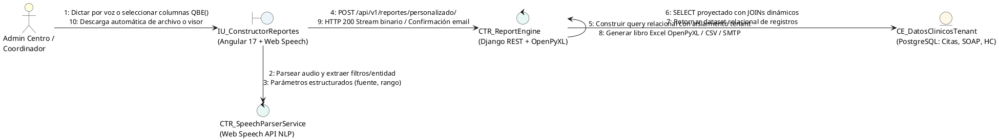
```plantuml
@startuml
skinparam shadowing false
skinparam roundcorner 8
skinparam defaultFontName Arial
skinparam packageStyle rectangle

actor "Admin Centro /\nCoordinador" as act #LightYellow
boundary "IU_ConstructorReportes\n(Angular 17 + Web Speech)" as iu #EBF5FB
control "CTR_ReportEngine\n(Django REST + OpenPyXL)" as ctr #E8F8F5
entity "CE_DatosClinicosTenant\n(PostgreSQL: Citas, SOAP, HC)" as ce #FEF9E7
control "CTR_SpeechParserService\n(Web Speech API NLP)" as voice #E8F8F5

act -right-> iu : 1: Dictar por voz o seleccionar columnas QBE()\n10: Descarga automática de archivo o visor
iu -down-> voice : 2: Parsear audio y extraer filtros/entidad\n3: Parámetros estructurados (fuente, rango)
iu -right-> ctr : 4: POST /api/v1/reportes/personalizado/\n9: HTTP 200 Stream binario / Confirmación email
ctr -right-> ce : 6: SELECT proyectado con JOINs dinámicos\n7: Retornar dataset relacional de registros
ctr -up-> ctr : 5: Construir query relacional con aislamiento tenant\n8: Generar libro Excel OpenPyXL / CSV / SMTP
@enduml
```

###### Especificación PlantUML BCE – CU28 (Copias de Seguridad y Restauración)

* **Ubicación en Enterprise Architect:** `DIAGRAMAS.eapx` → *Sprint 2* → *6. Diagramas de Comunicación - Sprint 2* → *CU28 - Copias de Seguridad y Restauración* (**Diagrama ID: 158**).
* **Exportación Bitmap:** [`diagramas/Diagrama de Comunicacion - CU28 Backup y Restore.bmp`](file:///c:/Users/User/Documents/2-2026/SI2/PROYECTO_GRUPAL_OFI/diagramas/Diagrama%20de%20Comunicacion%20-%20CU28%20Backup%20y%20Restore.bmp)
* **Participantes del Patrón BCE:**
  * **Actor Principal:** `SuperAdministrador` (Administrador global de la plataforma SaaS con privilegios sobre todos los esquemas).
  * **Clase Interfaz (`<<boundary>>`):** `IU_ConsolaBackupRestore (Angular 17)` (Panel de control de copias automáticas y manuales con carga de archivos `.sql.gz`/`.dump`).
  * **Clase Control (`<<control>>`):** `CTR_BackupRestoreService (Django + pg_dump/pg_restore)` (Servicio orquestador de respaldos con compresión gzip, cálculo de hash SHA-256 y ejecución transaccional de restauración).
  * **Clase Entidad (`<<entity>>`):** `CE_TenantDatabaseSchema` (Esquema de base de datos PostgreSQL 16 con aislamiento multi-tenant) y `CE_BackupLogRegistro` (Metadatos de auditoría forense de copias de seguridad).

```plantuml
@startuml
skinparam shadowing false
skinparam roundcorner 8
skinparam defaultFontName Arial
skinparam packageStyle rectangle

actor "SuperAdministrador" as act #LightYellow
boundary "IU_ConsolaBackupRestore\n(Angular 17)" as iu #EBF5FB
control "CTR_BackupRestoreService\n(Django + pg_dump/pg_restore)" as ctr #E8F8F5
entity "CE_TenantDatabaseSchema\n(PostgreSQL 16 Multi-Tenant)" as db #FEF9E7
entity "CE_BackupLogRegistro\n(Metadatos y Checksum SHA-256)" as log #FEF9E7

act -right-> iu : 1: Solicitar generación de Backup Manual()\n9: Habilitar tarjeta con hash verificado\n10: Cargar archivo para restauración()\n15: Alerta modal de éxito y auditoría
iu -right-> ctr : 2: POST /api/tenants/{id}/backup/\n8: HTTP 201 Created (url_descarga, sha256)\n11: POST /api/tenants/{id}/restore/ (dump_file)\n14: HTTP 200 OK ('Esquema restaurado')
ctr -right-> db : 3: Ejecutar pg_dump por esquema (gzip)\n4: Stream binario de dump generado\n12: Ejecutar pg_restore (--clean --if-exists)\n13: Restauración completada exitosamente
ctr -down-> log : 6: INSERT INTO backups_registro (archivo, sha256)\n7: Metadatos persistidos exitosamente
ctr -up-> ctr : 5: Calcular Checksum criptográfico SHA-256
@enduml
```


#### 6.2.1.3.1 Modelado Dinámico de Interacción (Diagramas de Secuencia UML de 3 Capas)

En estricto apego a las directrices de diseño arquitectónico de la materia, los diagramas de secuencia formalizan el comportamiento dinámico y la interacción temporal del sistema estructurados en **tres capas indispensables**:
1. **Clase Interfaz (`boundary`)**: Componentes de interacción visual del usuario (SPA Angular 17 en Web y App Flutter 3.x en Móvil).
2. **Clase Control (`control`)**: Controladores de aplicación y servicios de orquestación de reglas de negocio (`Django REST Framework ViewSets` y servicios de dominio clínico).
3. **Clase Entidad (`entity`)**: Modelos de datos y tablas de persistencia en PostgreSQL 16 (aislados estrictamente por el esquema Tenant de cada centro psicológico).

Bajo esta concepción, el flujo de llamadas garantiza el desacoplamiento: el usuario interactúa exclusivamente con la interfaz, la interfaz delega peticiones HTTP síncronas/asíncronas al controlador de negocio, y el controlador valida permisos (RBAC), reglas clínicas y ejecuta transacciones atómicas sobre las entidades del modelo relacional.

##### Diagrama de Secuencia CU14: Ficha Previa e Intake Digital

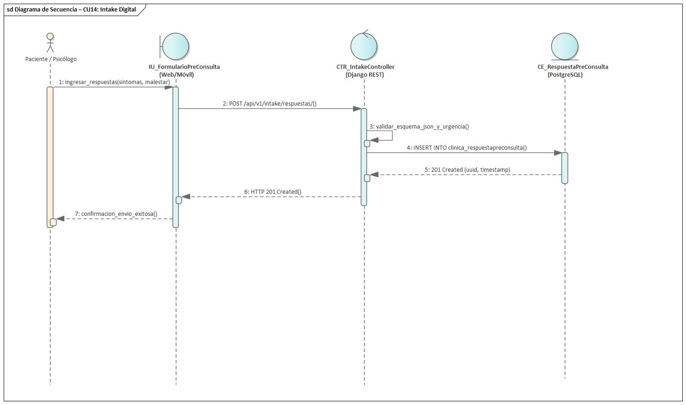

```plantuml
@startuml
skinparam shadowing false
skinparam roundcorner 8
skinparam defaultFontName Arial
skinparam sequenceLifeLineBorderColor #2C3E50
skinparam sequenceParticipantBorderColor #34495E
skinparam sequenceParticipantBackgroundColor #EBF5FB

participant "Paciente" as pac
participant "IU_FormularioPreConsulta" as iu
participant "CTR_IntakeController" as ctr
participant "CE_RespuestaPreConsulta" as ce

activate pac
pac -> iu : 1: ingresar_respuestas(sintomas, escala_malestar, antecedentes)
activate iu
iu -> iu : 2: validar_campos_requeridos()
iu -> ctr : 3: POST /api/v1/intake/respuestas/ (Bearer JWT, payload JSONB)
activate ctr
ctr -> ctr : 4: validar_esquema_json_y_urgencia(malestar >= 4)

alt Malestar >= 4 (Urgencia Alta)
    ctr -> ce : 5: INSERT INTO clinica_respuestapreconsulta (prioridad='ALTA')
    activate ce
    ce --> ctr : 6: 201 Created (uuid, timestamp, prioridad_flag=true)
    deactivate ce
    ctr --> iu : 7: HTTP 201 Created {id, prioridad='ALTA', protocolo_urgencia=true}
    iu --> pac : 8: mostrar_alerta_urgencia_prioritaria('Caso clasificado para atencion inmediata')
else else Malestar Normal (Rango Habitual)
    ctr -> ce : 9: INSERT INTO clinica_respuestapreconsulta (prioridad='NORMAL')
    activate ce
    ce --> ctr : 10: 201 Created (uuid, timestamp, prioridad_flag=false)
    deactivate ce
    ctr --> iu : 11: HTTP 201 Created {id, prioridad='NORMAL', status='ENVIADO'}
    iu --> pac : 12: confirmacion_envio_exitosa(badge_prioridad)
end

deactivate ctr
deactivate iu
deactivate pac
@enduml
```

##### Diagrama de Secuencia CU15: Apertura de Historia Clínica y Control de Acceso RBAC

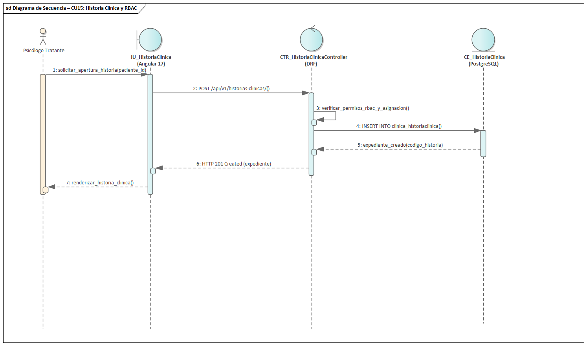

```plantuml
@startuml
skinparam shadowing false
skinparam roundcorner 8
skinparam defaultFontName Arial
skinparam sequenceLifeLineBorderColor #2C3E50
skinparam sequenceParticipantBorderColor #34495E
skinparam sequenceParticipantBackgroundColor #EBF5FB

participant "Psicologo Tratante" as psi
participant "IU_HistoriaClinica" as iu
participant "CTR_HistoriaClinicaController" as ctr
participant "CE_HistoriaClinica" as ce

activate psi
psi -> iu : 1: solicitar_apertura_historia(paciente_id)
activate iu
iu -> ctr : 2: POST /api/v1/historias-clinicas/ (paciente_id, anamnesis_inicial)
activate ctr
ctr -> ctr : 3: verificar_permiso_rbac(role='PSICOLOGO', terapeuta_asignado=true)

alt RBAC: Terapeuta Asignado (Autorizado)
    ctr -> ce : 4: INSERT INTO clinica_historiaclinica (codigo_expediente, fecha_apertura)
    activate ce
    ce --> ctr : 5: expediente_registrado(id, codigo_historia)
    deactivate ce
    ctr --> iu : 6: HTTP 201 Created {codigo_historia, anamnesis, cerrada=false}
    iu --> psi : 7: renderizar_pestanas_historia(anamnesis, examen_mental, cie11)
else else Sin Asignacion RBAC (Denegado)
    ctr --> iu : 8: HTTP 403 Forbidden ('Acceso denegado: Terapeuta no asignado al paciente')
    iu --> psi : 9: mostrar_error_seguridad_rbac('Acceso no autorizado a historia ajena')
end

deactivate ctr
deactivate iu
deactivate psi
@enduml
```

##### Diagrama de Secuencia CU16: Registro de Notas SOAP, Autoguardado Reactivo e Inmutabilidad


```plantuml
@startuml
skinparam shadowing false
skinparam roundcorner 8
skinparam defaultFontName Arial
skinparam sequenceLifeLineBorderColor #2C3E50
skinparam sequenceParticipantBorderColor #34495E
skinparam sequenceParticipantBackgroundColor #EBF5FB

participant "Psicologo Tratante" as psi
participant "IU_EditorNotasSOAP" as iu
participant "CTR_NotaSesionController" as ctr
participant "CE_NotaSesion" as ce

activate psi
psi -> iu : 1: redactar_nota_soap(subjetivo, objetivo, analisis, plan)
activate iu

opt Autoguardado Reactivo en Borrador (debounce 30s)
    iu -> ctr : 2: PATCH /api/v1/notas-sesion/{id}/borrador/ (payload_parcial)
    activate ctr
    ctr -> ce : 3: UPDATE clinica_notasesion SET estado='BORRADOR'
    activate ce
    ce --> ctr : 4: borrador_actualizado()
    deactivate ce
    ctr --> iu : 5: HTTP 200 OK (guardado_automatico_confirmado)
    deactivate ctr
end

psi -> iu : 6: formalizar_y_firmar_nota()
iu -> ctr : 7: POST /api/v1/notas-sesion/firmar/ (cita_id, payload_completo)
activate ctr
ctr -> ctr : 8: validar_cita_realizada_y_bloqueo_tiempo()

alt Cita Realizada (Firma Inmutable Concedida)
    ctr -> ce : 9: INSERT/UPDATE clinica_notasesion (firmada=true, estado='INMUTABLE')
    activate ce
    ce --> ctr : 10: nota_inmutable_consolidada()
    deactivate ce
    ctr --> iu : 11: HTTP 201 Nota Firmada Inmutable
    iu --> psi : 12: bloquear_editor_y_actualizar_timeline(badge_firmado_legal)
else else Cita No Concluida (Bloqueo Legal)
    ctr --> iu : 13: HTTP 400 Bad Request ('La cita debe estar REALIZADA para firmar la nota')
    iu --> psi : 14: mostrar_alerta_bloqueo_legal('No se puede sellar nota de sesion no concluida')
end

deactivate ctr
deactivate iu
deactivate psi
@enduml
```

##### Diagrama de Secuencia CU17: Asignación y Cumplimiento de Tareas Terapéuticas Inter-Sesiones

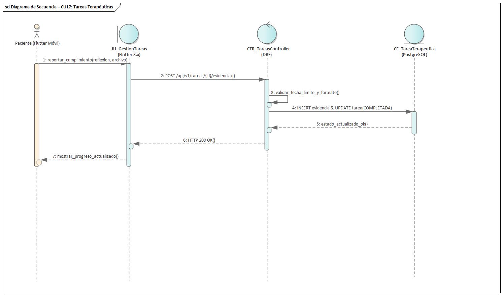

```plantuml
@startuml
skinparam shadowing false
skinparam roundcorner 8
skinparam defaultFontName Arial
skinparam sequenceLifeLineBorderColor #2C3E50
skinparam sequenceParticipantBorderColor #34495E
skinparam sequenceParticipantBackgroundColor #EBF5FB

participant "Paciente Movil" as pac
participant "IU_GestionTareas" as iu
participant "CTR_TareasController" as ctr
participant "CE_TareaTerapeutica" as ce

activate pac
pac -> iu : 1: reportar_cumplimiento(tarea_id, texto_reflexion, archivo_adjunto)
activate iu
iu -> ctr : 2: POST /api/v1/tareas/{id}/evidencia/ (Multipart Form-Data)
activate ctr
ctr -> ctr : 3: validar_plazo_limite_y_tipo_archivo()

alt Entrega en Plazo (Cumplimiento Exitoso)
    ctr -> ce : 4: INSERT clinica_evidenciatarea & UPDATE clinica_tareaterapeutica (estado='COMPLETADA')
    activate ce
    ce --> ctr : 5: evidencia_persistida()
    deactivate ce
    ctr --> iu : 6: HTTP 200 OK {estado: 'COMPLETADA', fecha_cumplimiento}
    iu --> pac : 7: actualizar_indicador_progreso(100% completado)
else else Fuera de Plazo (Entrega Extemporanea)
    ctr -> ce : 8: UPDATE clinica_tareaterapeutica SET estado='COMPLETADA_CON_RETRASO'
    activate ce
    ce --> ctr : 9: tarea_actualizada_con_retraso()
    deactivate ce
    ctr --> iu : 10: HTTP 200 OK (warning_retraso=true)
    iu --> pac : 11: mostrar_aviso_retraso('Tarea entregada fuera de plazo')
end

deactivate ctr
deactivate iu
deactivate pac
@enduml
```

##### Diagrama de Secuencia CU18: Consentimiento Informado Digital con Sellado SHA-256

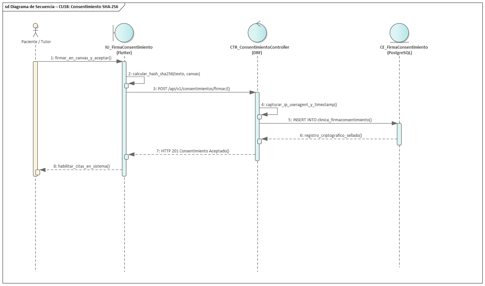

```plantuml
@startuml
skinparam shadowing false
skinparam roundcorner 8
skinparam defaultFontName Arial
skinparam sequenceLifeLineBorderColor #2C3E50
skinparam sequenceParticipantBorderColor #34495E
skinparam sequenceParticipantBackgroundColor #EBF5FB

participant "Paciente o Tutor" as pac
participant "IU_FirmaConsentimiento" as iu
participant "CTR_ConsentimientoController" as ctr
participant "CE_FirmaConsentimiento" as ce

activate pac
pac -> iu : 1: leer_clausulas_obligatorias_y_firmar_canvas()
activate iu
iu -> iu : 2: calcular_hash_sha256(texto_legal + trazos_canvas + timestamp)
iu -> ctr : 3: POST /api/v1/consentimientos/firmar/ (hash_sha256, firma_png, tutor_ci)
activate ctr
ctr -> ctr : 4: capturar_metadatos_legales(ip_remota, user_agent, timestamp_bolivia)

alt Mayor de Edad: Firma Titular
    ctr -> ce : 5: INSERT INTO clinica_firmaconsentimiento (tipo='TITULAR', hash_sha256)
    activate ce
    ce --> ctr : 6: firma_registrada_inmutable()
    deactivate ce
    ctr --> iu : 7: HTTP 201 Consentimiento Aceptado (hash_verificado)
    iu --> pac : 8: habilitar_atencion_y_reserva_citas()
else else Menor de Edad: Firma Tutor Legal
    ctr -> ctr : 9: validar_ci_y_parentesco_tutor()
    ctr -> ce : 10: INSERT INTO clinica_firmaconsentimiento (tipo='TUTOR', tutor_ci, hash_sha256)
    activate ce
    ce --> ctr : 11: firma_tutor_inmutable()
    deactivate ce
    ctr --> iu : 12: HTTP 201 Consentimiento Tutor Registrado
    iu --> pac : 13: notificar_validacion_tutor_exitosa()
end

deactivate ctr
deactivate iu
deactivate pac
@enduml
```

##### Diagrama de Secuencia CU19: Cierre de Proceso Terapéutico y Derivación Médica a Psiquiatría

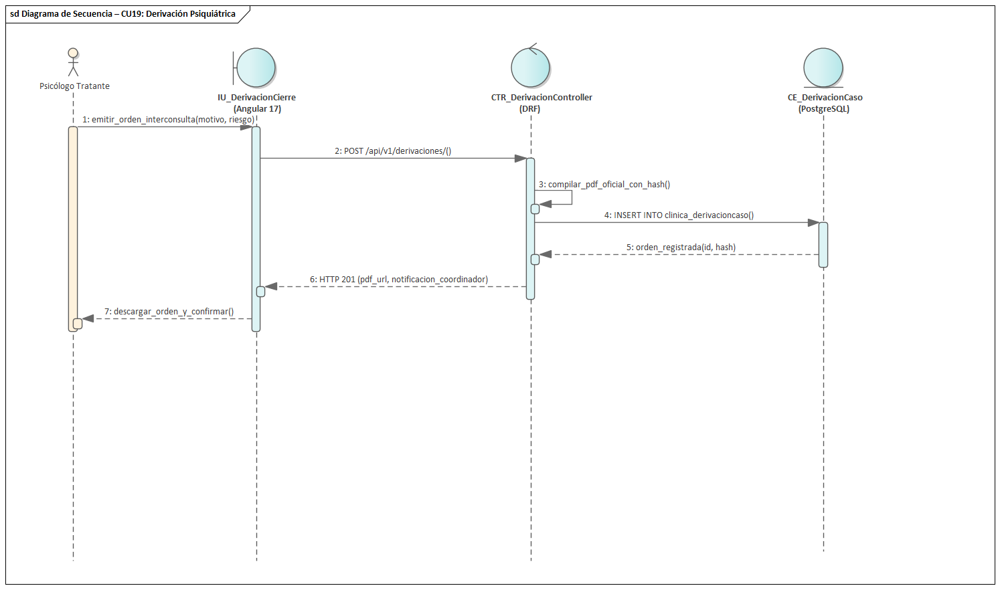

```plantuml
@startuml
skinparam shadowing false
skinparam roundcorner 8
skinparam defaultFontName Arial
skinparam sequenceLifeLineBorderColor #2C3E50
skinparam sequenceParticipantBorderColor #34495E
skinparam sequenceParticipantBackgroundColor #EBF5FB

participant "Psicologo Tratante" as psi
participant "IU_DerivacionCierre" as iu
participant "CTR_DerivacionController" as ctr
participant "CE_DerivacionCaso" as ce

activate psi
psi -> iu : 1: emitir_orden_interconsulta(motivo, riesgo, sintomatologia)
activate iu
iu -> ctr : 2: POST /api/v1/derivaciones/ (paciente_id, profesional_destino, nivel_urgencia)
activate ctr

alt Interconsulta Externa Psiquiatria (Riesgo Alto)
    ctr -> ctr : 3: compilar_pdf_interconsulta_con_sello_profesional()
    ctr -> ce : 4: INSERT INTO clinica_derivacioncaso (estado='DERIVADO', tipo='PSIQUIATRIA')
    activate ce
    ce --> ctr : 5: registro_derivacion_creado(id)
    deactivate ce
    ctr --> iu : 6: HTTP 201 Created {pdf_url, notificacion_coordinador_enviada}
    iu --> psi : 7: mostrar_comprobante_interconsulta(descarga_pdf)
else else Alta Terapeutica / Cierre de Caso por Objetivos
    ctr -> ctr : 8: compilar_resumen_clinico_egreso()
    ctr -> ce : 9: UPDATE clinica_historiaclinica SET estado='ALTA', cerrada=true
    activate ce
    ce --> ctr : 10: alta_registrada()
    deactivate ce
    ctr --> iu : 11: HTTP 200 OK (comprobante_alta)
    iu --> psi : 12: mostrar_comprobante_alta('Tratamiento culminado y expediente archivado')
end

deactivate ctr
deactivate iu
deactivate psi
@enduml
```

##### Diagrama de Secuencia HU-35: Asistente Ético de IA para Preconsulta con Salvaguarda Humana

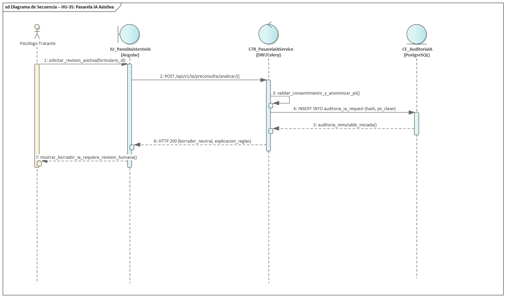

```plantuml
@startuml
skinparam shadowing false
skinparam roundcorner 8
skinparam defaultFontName Arial
skinparam sequenceLifeLineBorderColor #2C3E50
skinparam sequenceParticipantBorderColor #34495E
skinparam sequenceParticipantBackgroundColor #EBF5FB

participant "Psicologo Clinico" as psi
participant "IU_PanelAsistenteIA" as iu
participant "CTR_PasarelaIAService" as ctr
participant "CE_AuditoriaIA" as ce
participant "Motor Gemini 1.5 Pro" as ia

activate psi
psi -> iu : 1: solicitar_analisis_preconsulta(formulario_id)
activate iu
iu -> ctr : 2: POST /api/v1/ia/preconsulta/analizar/ (formulario_id)
activate ctr

alt Consentimiento Informado IA Activo
    ctr -> ctr : 3: verificar_consentimiento_activo_y_anonimizar_pii()
    ctr -> ia : 4: invoke_prompt_clinico_neutral(sintomas_anonimizados, escala)
    activate ia
    ia --> ctr : 5: response_borrador(resumen_estructurado, reglas_prioridad)
    deactivate ia
    ctr -> ce : 6: INSERT INTO auditoria_ia_interaccion (hash_prompt, respuesta_raw, evaluacion_humana='PENDIENTE')
    activate ce
    ce --> ctr : 7: auditoria_inmutable_creada(id)
    deactivate ce
    ctr --> iu : 8: HTTP 200 OK (borrador_con_banner_revision_profesional)
    iu --> psi : 9: renderizar_panel_asistivo(resumen, priorizacion_sugerida, explicacion_reglas)

    opt Decision y Cierre Humano Obligatorio
        psi -> iu : 10: aceptar_descartar_o_editar(decision_profesional)
        iu -> ctr : 11: POST /api/v1/ia/preconsulta/decision/ (auditoria_id, decision, observaciones)
        ctr -> ce : 12: UPDATE auditoria_ia_interaccion SET decision_final=..., revisor_id=...
        activate ce
        ce --> ctr : 13: confirmacion_cierre_auditoria()
        deactivate ce
        ctr --> iu : 14: HTTP 200 OK (auditoria_cerrada)
        iu --> psi : 15: notificar_incorporacion_expediente()
    end
else else Consentimiento IA Denegado / Rechazado
    ctr --> iu : 16: HTTP 403 Forbidden ('Paciente rechazo procesamiento asistivo por IA')
    iu --> psi : 17: habilitar_modo_evaluacion_manual('Bloqueado motor asistivo: flujo 100% manual')
end

deactivate ctr
deactivate iu
deactivate psi
@enduml
```

##### Diagrama de Secuencia CU20: Interacción con el Chatbot de Orientación Clínica y Derivación a Operador

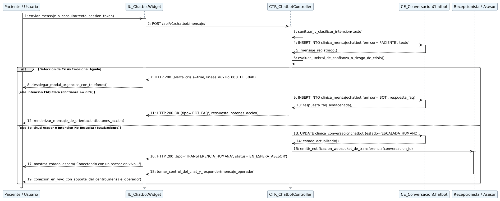

```plantuml
@startuml
skinparam shadowing false
skinparam roundcorner 8
skinparam defaultFontName Arial
skinparam sequenceLifeLineBorderColor #2C3E50
skinparam sequenceParticipantBorderColor #34495E
skinparam sequenceParticipantBackgroundColor #EBF5FB

participant "Paciente / Usuario" as pac
participant "IU_ChatbotWidget" as iu
participant "CTR_ChatbotController" as ctr
participant "CE_ConversacionChatbot" as ce
participant "Recepcionista / Asesor" as recep

activate pac
pac -> iu : 1: enviar_mensaje_o_consulta(texto, session_token)
activate iu
iu -> ctr : 2: POST /api/v1/chatbot/mensaje/
activate ctr
ctr -> ctr : 3: sanitizar_y_clasificar_intencion(texto)
ctr -> ce : 4: INSERT INTO clinica_mensajechatbot (emisor='PACIENTE', texto)
activate ce
ce --> ctr : 5: mensaje_registrado()
deactivate ce
ctr -> ctr : 6: evaluar_umbral_de_confianza_o_riesgo_de_crisis()

alt Deteccion de Crisis Emocional Aguda
    ctr --> iu : 7: HTTP 200 (alerta_crisis=true, lineas_auxilio_800_11_3040)
    iu --> pac : 8: desplegar_modal_urgencias_con_telefonos()
else else Intencion FAQ Clara (Confianza >= 80%)
    ctr -> ce : 9: INSERT INTO clinica_mensajechatbot (emisor='BOT', respuesta_faq)
    activate ce
    ce --> ctr : 10: respuesta_faq_almacenada()
    deactivate ce
    ctr --> iu : 11: HTTP 200 OK (tipo='BOT_FAQ', respuesta, botones_accion)
    iu --> pac : 12: renderizar_mensaje_de_orientacion(botones_accion)
else else Solicitud Asesor o Intencion No Resuelta (Escalamiento)
    ctr -> ce : 13: UPDATE clinica_conversacionchatbot (estado='ESCALADA_HUMANO')
    activate ce
    ce --> ctr : 14: estado_actualizado()
    deactivate ce
    ctr -> recep : 15: emitir_notificacion_websocket_de_transferencia(conversacion_id)
    activate recep
    ctr --> iu : 16: HTTP 200 (tipo='TRANSFERENCIA_HUMANA', status='EN_ESPERA_ASESOR')
    iu --> pac : 17: mostrar_estado_espera('Conectando con un asesor en vivo...')
    recep -> iu : 18: tomar_control_del_chat_y_responder(mensaje_operador)
    deactivate recep
    iu --> pac : 19: conexion_en_vivo_con_soporte_del_centro(mensaje_operador)
end

deactivate ctr
deactivate iu
deactivate pac
@enduml
```

##### Diagrama de Secuencia CU5: Bitácora Confidencial y Llave Única del Desarrollador (Criterio 3)

* **Ubicación en Enterprise Architect:** `DIAGRAMAS.eapx` → *Sprint 2* → *7. Diagramas de Secuencia - Sprint 2* → *CU5 - Secuencia Bitácora Confidencial y Llave de Desarrollador* (**Diagrama ID: 159**).
* **Exportación Bitmap:** [`diagramas/Secuencia_CU5_Bitacora_Confidencial.bmp`](file:///c:/Users/User/Documents/2-2026/SI2/PROYECTO_GRUPAL_OFI/diagramas/Secuencia_CU5_Bitacora_Confidencial.bmp)

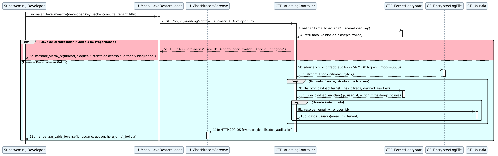

```plantuml
@startuml
skinparam shadowing false
skinparam roundcorner 8
skinparam defaultFontName Arial
skinparam sequenceLifeLineBorderColor #2C3E50
skinparam sequenceParticipantBorderColor #34495E
skinparam sequenceParticipantBackgroundColor #EBF5FB

participant "SuperAdmin / Developer" as dev
participant "IU_ModalLlaveDesarrollador" as iu_in
participant "IU_VisorBitacoraForense" as iu_out
participant "CTR_AuditLogController" as ctr
participant "CTR_FernetDecryptor" as crypto
participant "CE_EncryptedLogFile" as file_log
participant "CE_Usuario" as ce_usr

activate dev
dev -> iu_in : 1: ingresar_llave_maestra(developer_key, fecha_consulta, tenant_filtro)
activate iu_in
iu_in -> ctr : 2: GET /api/v1/audit/log/?date=... (Header: X-Developer-Key)
activate ctr

ctr -> crypto : 3: validar_firma_hmac_sha256(developer_key)
activate crypto
crypto --> ctr : 4: resultado_validacion_clave(es_valida)
deactivate crypto

alt #LightPink Llave de Desarrollador Inválida o No Proporcionada
    ctr --> iu_in : 5a: HTTP 403 Forbidden ("Llave de Desarrollador Inválida - Acceso Denegado")
    iu_in --> dev : 6a: mostrar_alerta_seguridad_bloqueo("Intento de acceso auditado y bloqueado")
else #LightCyan Llave de Desarrollador Válida
    ctr -> file_log : 5b: abrir_archivo_cifrado(audit-YYYY-MM-DD.log.enc, modo=0600)
    activate file_log
    file_log --> ctr : 6b: stream_lineas_cifradas_bytes()
    deactivate file_log

    loop Por cada línea registrada en la bitácora
        ctr -> crypto : 7b: decrypt_payload_fernet(linea_cifrada, derived_aes_key)
        activate crypto
        crypto --> ctr : 8b: json_payload_en_claro(ip, user_id, action, timestamp_bolivia)
        deactivate crypto
        opt Usuario Autenticado
            ctr -> ce_usr : 9b: resolver_email_y_rol(user_id)
            activate ce_usr
            ce_usr --> ctr : 10b: datos_usuario(email, rol_tenant)
            deactivate ce_usr
        end
    end

    ctr --> iu_out : 11b: HTTP 200 OK [eventos_descifrados_auditados]
    deactivate ctr
    activate iu_out
    iu_out --> dev : 12b: renderizar_tabla_forense(ip, usuario, accion, hora_gmt4_bolivia)
    deactivate iu_out
end

deactivate iu_in
deactivate dev
@enduml
```

##### Diagrama de Secuencia CU25: Constructor de Reportes Personalizados (QBE), Exportación y Comandos de Voz (Criterio 5)

* **Ubicación en Enterprise Architect:** `DIAGRAMAS.eapx` → *Sprint 2* → *7. Diagramas de Secuencia - Sprint 2* → *CU25 - Secuencia Reportes Personalizados QBE, Multiformato y Voz* (**Diagrama ID: 160**).
* **Exportación Bitmap:** [`diagramas/Secuencia_CU25_Reportes_QBE_Voz.bmp`](file:///c:/Users/User/Documents/2-2026/SI2/PROYECTO_GRUPAL_OFI/diagramas/Secuencia_CU25_Reportes_QBE_Voz.bmp)

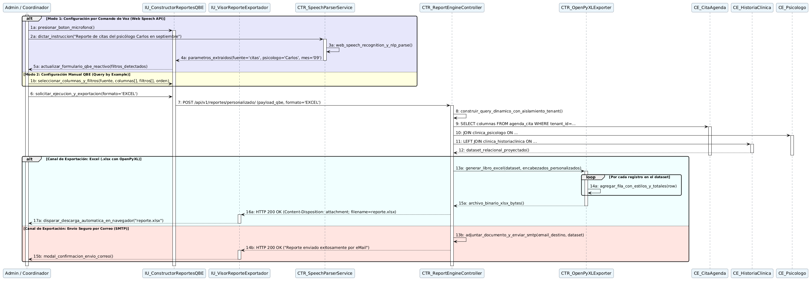

```plantuml
@startuml
skinparam shadowing false
skinparam roundcorner 8
skinparam defaultFontName Arial
skinparam sequenceLifeLineBorderColor #2C3E50
skinparam sequenceParticipantBorderColor #34495E
skinparam sequenceParticipantBackgroundColor #EBF5FB

participant "Admin / Coordinador" as admin
participant "IU_ConstructorReportesQBE" as iu_in
participant "IU_VisorReporteExportador" as iu_out
participant "CTR_SpeechParserService" as voice
participant "CTR_ReportEngineController" as ctr
participant "CTR_OpenPyXLExporter" as xlsx
participant "CE_CitaAgenda" as ce_cita
participant "CE_HistoriaClinica" as ce_hc
participant "CE_Psicologo" as ce_psyc

activate admin

alt #Lavender Modo 1: Configuración por Comando de Voz (Web Speech API)
    admin -> iu_in : 1a: presionar_boton_microfono()
    activate iu_in
    admin -> voice : 2a: dictar_instruccion("Reporte de citas del psicólogo Carlos en septiembre")
    activate voice
    voice -> voice : 3a: web_speech_recognition_y_nlp_parse()
    voice --> iu_in : 4a: parametros_extraidos(fuente='citas', psicologo='Carlos', mes='09')
    deactivate voice
    iu_in --> admin : 5a: actualizar_formulario_qbe_reactivo(filtros_detectados)
else #LightYellow Modo 2: Configuración Manual QBE (Query by Example)
    admin -> iu_in : 1b: seleccionar_columnas_y_filtros(fuente, columnas[], filtros[], orden)
end

admin -> iu_in : 6: solicitar_ejecucion_y_exportacion(formato='EXCEL')
iu_in -> ctr : 7: POST /api/v1/reportes/personalizado/ (payload_qbe, formato='EXCEL')
activate ctr

ctr -> ctr : 8: construir_query_dinamico_con_aislamiento_tenant()
ctr -> ce_cita : 9: SELECT columnas FROM agenda_cita WHERE tenant_id=...
activate ce_cita
ctr -> ce_psyc : 10: JOIN clinica_psicologo ON ...
activate ce_psyc
ctr -> ce_hc : 11: LEFT JOIN clinica_historiaclinica ON ...
activate ce_hc
ce_hc --> ctr : 12: dataset_relacional_proyectado()
deactivate ce_hc
deactivate ce_psyc
deactivate ce_cita

alt #Azure Canal de Exportación: Excel (.xlsx con OpenPyXL)
    ctr -> xlsx : 13a: generar_libro_excel(dataset, encabezados_personalizados)
    activate xlsx
    loop Por cada registro en el dataset
        xlsx -> xlsx : 14a: agregar_fila_con_estilos_y_totales(row)
    end
    xlsx --> ctr : 15a: archivo_binario_xlsx_bytes()
    deactivate xlsx
    ctr --> iu_out : 16a: HTTP 200 OK (Content-Disposition: attachment; filename=reporte.xlsx)
    activate iu_out
    iu_out --> admin : 17a: disparar_descarga_automatica_en_navegador("reporte.xlsx")
    deactivate iu_out
else #MistyRose Canal de Exportación: Envío Seguro por Correo (SMTP)
    ctr -> ctr : 13b: adjuntar_documento_y_enviar_smtp(email_destino, dataset)
    ctr --> iu_out : 14b: HTTP 200 OK ("Reporte enviado exitosamente por eMail")
    activate iu_out
    iu_out --> admin : 15b: modal_confirmacion_envio_correo()
    deactivate iu_out
end

deactivate ctr
deactivate iu_in
deactivate admin
@enduml
```

##### Diagrama de Secuencia CU28: Copias de Seguridad y Restauración (Backup / Restore) en la Nube (Criterio 6)

* **Ubicación en Enterprise Architect:** `DIAGRAMAS.eapx` → *Sprint 2* → *7. Diagramas de Secuencia - Sprint 2* → *CU28 - Secuencia Copias de Seguridad y Restauración* (**Diagrama ID: 161**).
* **Exportación Bitmap:** [`diagramas/Secuencia_CU28_Backup_Restore.bmp`](file:///c:/Users/User/Documents/2-2026/SI2/PROYECTO_GRUPAL_OFI/diagramas/Secuencia_CU28_Backup_Restore.bmp)


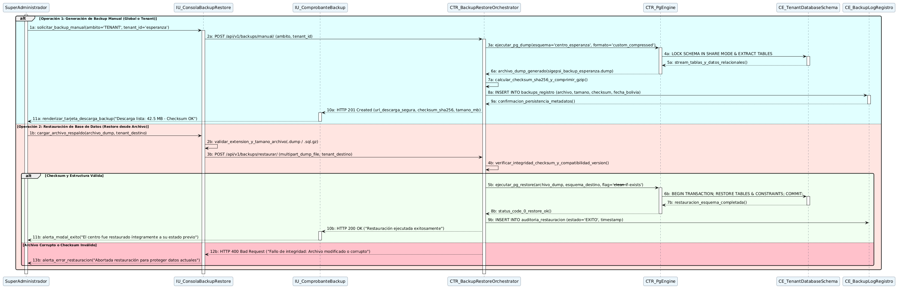

```plantuml
@startuml
skinparam shadowing false
skinparam roundcorner 8
skinparam defaultFontName Arial
skinparam sequenceLifeLineBorderColor #2C3E50
skinparam sequenceParticipantBorderColor #34495E
skinparam sequenceParticipantBackgroundColor #EBF5FB

participant "SuperAdministrador" as sa
participant "IU_ConsolaBackupRestore" as iu_in
participant "IU_ComprobanteBackup" as iu_out
participant "CTR_BackupRestoreOrchestrator" as ctr
participant "CTR_PgEngine" as pg
participant "CE_TenantDatabaseSchema" as db_schema
participant "CE_BackupLogRegistro" as log_reg

activate sa

alt #LightCyan Operación 1: Generación de Backup Manual (Global o Tenant)
    sa -> iu_in : 1a: solicitar_backup_manual(ambito='TENANT', tenant_id='esperanza')
    activate iu_in
    iu_in -> ctr : 2a: POST /api/v1/backups/manual/ (ambito, tenant_id)
    activate ctr
    ctr -> pg : 3a: ejecutar_pg_dump(esquema='centro_esperanza', formato='custom_compressed')
    activate pg
    pg -> db_schema : 4a: LOCK SCHEMA IN SHARE MODE & EXTRACT TABLES
    activate db_schema
    db_schema --> pg : 5a: stream_tablas_y_datos_relacionales()
    deactivate db_schema
    pg --> ctr : 6a: archivo_dump_generado(sigepsi_backup_esperanza.dump)
    deactivate pg

    ctr -> ctr : 7a: calcular_checksum_sha256_y_comprimir_gzip()
    ctr -> log_reg : 8a: INSERT INTO backups_registro (archivo, tamano, checksum, fecha_bolivia)
    activate log_reg
    log_reg --> ctr : 9a: confirmacion_persistencia_metadatos()
    deactivate log_reg

    ctr --> iu_out : 10a: HTTP 201 Created (url_descarga_segura, checksum_sha256, tamano_mb)
    activate iu_out
    iu_out --> sa : 11a: renderizar_tarjeta_descarga_backup("Descarga lista: 42.5 MB - Checksum OK")
    deactivate iu_out

else #MistyRose Operación 2: Restauración de Base de Datos (Restore desde Archivo)
    sa -> iu_in : 1b: cargar_archivo_respaldo(archivo_dump, tenant_destino)
    iu_in -> iu_in : 2b: validar_extension_y_tamano_archivo(.dump / .sql.gz)
    iu_in -> ctr : 3b: POST /api/v1/backups/restaurar/ (multipart_dump_file, tenant_destino)

    ctr -> ctr : 4b: verificar_integridad_checksum_y_compatibilidad_version()
    alt #Honeydew Checksum y Estructura Válida
        ctr -> pg : 5b: ejecutar_pg_restore(archivo_dump, esquema_destino, flag='--clean --if-exists')
        activate pg
        pg -> db_schema : 6b: BEGIN TRANSACTION; RESTORE TABLES & CONSTRAINTS; COMMIT;
        activate db_schema
        db_schema --> pg : 7b: restauracion_esquema_completada()
        deactivate db_schema
        pg --> ctr : 8b: status_code_0_restore_ok()
        deactivate pg
        ctr -> log_reg : 9b: INSERT INTO auditoria_restauracion (estado='EXITO', timestamp)
        ctr --> iu_out : 10b: HTTP 200 OK ("Restauración ejecutada exitosamente")
        activate iu_out
        iu_out --> sa : 11b: alerta_modal_exito("El centro fue restaurado íntegramente a su estado previo")
        deactivate iu_out
    else #Pink Archivo Corrupto o Checksum Inválido
        ctr --> iu_in : 12b: HTTP 400 Bad Request ("Fallo de integridad: Archivo modificado o corrupto")
        iu_in --> sa : 13b: alerta_error_restauracion("Abortada restauración para proteger datos actuales")
    end
end

deactivate ctr
deactivate iu_in
deactivate sa
@enduml
```

#### 6.2.1.4 Diseño de la Navegación de Vistas (Modelo WAE Conallen por Paquetes y Global)

En estricta conformidad con el marco metodológico de modelado web de la cátedra (extensión WAE de Jim Conallen para aplicaciones web y móviles orientadas a objetos), la navegación del sistema no se modela como autómatas de estados aislados, sino mediante **Diagramas de Clases de Navegación estereotipadas**. En esta arquitectura:
* **Clases de Vista (`...View` / `...Screen`):** Representan páginas cliente, pantallas móviles Flutter, componentes Angular Standalone y diálogos modales, exponiendo como atributos los campos de captura de datos, filtros y parámetros de interfaz.
* **Clases Controladoras (`...Controller`):** Representan los controladores y despachadores de interacción (Angular Services / NgRx Actions y Flutter State Controllers), exponiendo como operaciones los métodos de envío, filtrado, validación y redirección.
* **Relaciones Estereotipadas:** La transición desde un formulario hacia su controlador se formaliza con el estereotipo `«submit»` (envío de interacción/datos), mientras que la respuesta y despliegue de una nueva vista o modal se formaliza con el estereotipo `«build»` (construcción y renderizado de la interfaz destino).

Se presenta en primer término el **Mapa de Navegación Integral del Sistema (Global Acumulado Sprint 0, 1 y 2)** donde participan la totalidad de los roles de usuario (`Administrador`, `Psicólogo`, `Recepcionista`, `Paciente`) e interactúan con todos los módulos nucleares de la plataforma (Autenticación y Centros Multi-Tenant de Sprint 0, Gestión de Profesionales, Pacientes, Citas y Teleconsulta de Sprint 1, y el Dominio Clínico de Intake, Consentimiento SHA-256, Historia Clínica, SOAP, Tareas, Derivaciones y Chatbot de Sprint 2). A continuación se presentan los **6 Diagramas de Navegación por Paquetes de Software**, cubriendo con rigurosa granularidad los subsistemas del proyecto:

##### Diagrama de Navegación 0: Mapa de Navegación Integral del Sistema (Global - Sprint 0, Sprint 1 y Sprint 2 Acumulado)

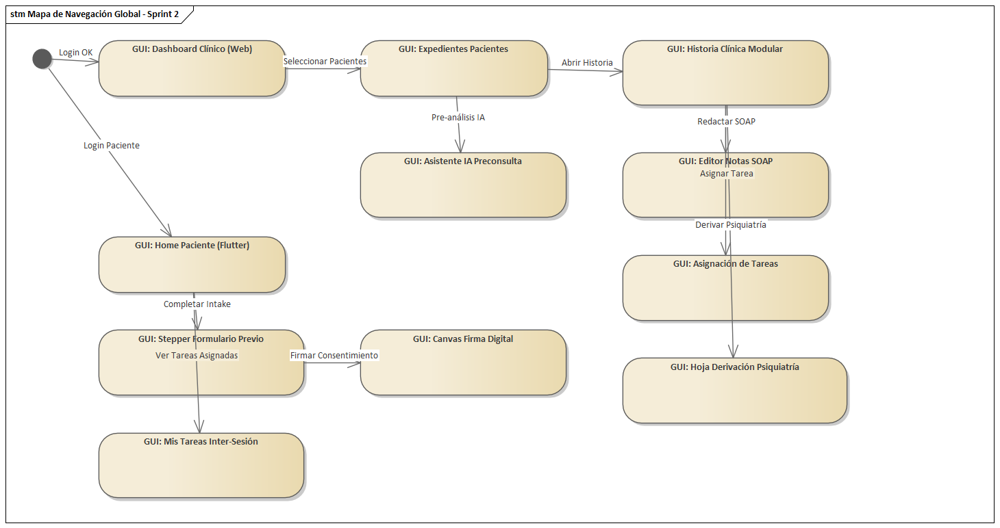

```plantuml
@startuml
allowmixing
skinparam classAttributeIconSize 0
skinparam backgroundColor #FFFFFF
skinparam roundcorner 8
skinparam defaultFontName Arial
left to right direction

title class Navegacion_Sistema_Global_SIGEPSI (Sprint 0, Sprint 1 y Sprint 2 Acumulado)

actor "Administrador" as admin
actor "Psicologo" as psyc
actor "Recepcionista" as recep
actor "Paciente" as pac

package "Sprint 0: Acceso, Seguridad y Multi-Tenant" #F7FAFC {
  class "loginView" as LoginView {
    + correo: String
    + contrasena: String
    + subdominioTenant: String
  }

  class "authGlobalController" as AuthCtrl {
    + autenticarJWT(): void
    + validarMFA(): void
    + despacharPorRol(): void
  }

  class "dashboardAdminView" as DashAdminView {
    + listaCentros: List
    + kpisGlobales: Object
  }

  class "directorioCentrosView" as CentrosView {
    + tenantsList: List
    + filtroPlan: String
  }

  class "centroAdminController" as CentroCtrl {
    + registrarCentro(): void
    + aislarEsquemaDB(): void
  }

  class "detalleCentroModalView" as DetalleCentroView {
    + razonSocial: String
    + dbSchemaName: String
  }

  class "directorioUsuariosRolesView" as UsuariosView {
    + usuariosList: List
    + rolAsignado: String
  }

  class "usuarioRolController" as UsuarioCtrl {
    + crearUsuario(): void
    + actualizarPermisos(): void
  }

  class "matrizPermisosModalView" as PermisosView {
    + matrizRBAC: Object
    + nivelAcceso: String
  }
}

package "Sprint 1: Gestion Clinica, Profesionales y Citas" #EDF2F7 {
  class "directorioPsicologosView" as PsicologosView {
    + listaProfesionales: List
    + especialidadFiltro: String
  }

  class "psicologoAdminController" as PsycCtrl {
    + registrarProfesional(): void
    + configurarAgenda(): void
  }

  class "perfilPsicologoModalView" as PerfilPsycView {
    + nroMatricula: String
    + horariosDisponibles: List
  }

  class "directorioPacientesView" as PacientesView {
    + pacientesList: List
    + busquedaDocIdentidad: String
  }

  class "pacienteController" as PacienteCtrl {
    + registrarPaciente(): void
    + abrirExpediente(): void
  }

  class "fichaPacienteModalView" as FichaPacView {
    + idPaciente: UUID
    + contactoEmergencia: String
  }

  class "agendaCalendarioView" as AgendaView {
    + calendarioSemanal: Object
    + filtroEspecialista: String
  }

  class "agendaCitasController" as AgendaCtrl {
    + agendarCita(): void
    + cancelarReprogramar(): void
  }

  class "reservaCitaModalView" as ReservaCitaView {
    + fechaHora: DateTime
    + modalidadAtencion: String
  }

  class "salaTeleconsultaView" as TeleconsultaView {
    + tokenJitsiMeet: String
    + estadoConexionRTC: String
  }

  class "teleconsultaController" as TeleconsultaCtrl {
    + conectarLlamada(): void
    + registrarDuracion(): void
  }
}

package "Sprint 2: Dominio Clinico Especializado e Inteligencia Artificial" #EBF8FF {
  class "portalPacienteHomeView" as PortalPacView {
    + proximaCita: Object
    + intakePendiente: boolean
    + tareasActivas: List
  }

  class "dashboardClinicoView" as DashClinicoView {
    + citasHoy: int
    + pacientesActivos: int
    + alertasCrisis: List
  }

  class "intakeDigitalScreenView" as IntakeView {
    + pasoActual: int
    + respuestasClinicas: JSONB
  }

  class "intakeController" as IntakeCtrl {
    + guardarPaso(): void
    + finalizarCuestionario(): void
  }

  class "resumenIntakeClinicoModalView" as ResumenIntakeView {
    + scoreMalestar: int
    + banderaRiesgo: boolean
  }

  class "consentimientoInformadoView" as ConsentimientoView {
    + textoClausulasLegales: String
    + firmaCanvasBase64: String
  }

  class "consentimientoController" as ConsentimientoCtrl {
    + procesarFirmaDigital(): void
    + sellarIntegridadSHA256(): void
  }

  class "certificadoFirmaModalView" as CertificadoFirmaView {
    + hashDigitalSHA256: String
    + timestampAudit: DateTime
  }

  class "historiaClinicaIntegralView" as HCIntegralView {
    + anamnesisModular: Object
    + diagnosticosCIE11: List
  }

  class "historiaClinicaController" as HCCtrl {
    + cargarExpediente(): void
    + guardarDiagnostico(): void
  }

  class "editorNotasSOAPView" as SOAPView {
    + subjectiveText: String
    + objectiveText: String
    + assessmentText: String
    + planText: String
  }

  class "soapNotasController" as SOAPCtrl {
    + autoguardarBorrador(): void
    + firmarNotaInmutable(): void
    + invocarSugerenciaIA(): void
  }

  class "auditoriaSOAPModalView" as AuditoriaSOAPView {
    + versionesHistorial: List
    + hashInmutable: String
  }

  class "tableroTareasTerapeuticasView" as TareasView {
    + listaTareas: List
    + porcentajeCumplimiento: float
  }

  class "tareaInterSesionController" as TareaCtrl {
    + asignarTarea(): void
    + adjuntarEvidencia(): void
    + evaluarAdherencia(): void
  }

  class "modalFeedbackTareaView" as FeedbackTareaView {
    + reflexionesPaciente: String
    + calificacionPsicologo: int
  }

  class "ordenDerivacionPsiquiatricaView" as DerivacionView {
    + motivoDerivacion: String
    + especialistaDestino: String
  }

  class "derivacionController" as DerivacionCtrl {
    + emitirOrdenDerivacion(): void
    + generarEpicrisisCierre(): void
  }

  class "informeEpicrisisModalView" as EpicrisisModalView {
    + resumenTratamiento: String
    + documentoFirmadoPDF: String
  }

  class "asistenteChatbotWidgetView" as ChatbotView {
    + mensajeUsuario: String
    + historialDialogo: List
  }

  class "chatbotOrientationController" as ChatbotCtrl {
    + clasificarIntencionNLP(): void
    + derivarRecepcionHumana(): void
  }

  class "derivacionRecepcionModalView" as RecepChatbotModalView {
    + ticketAtencionId: UUID
    + estadoTransferencia: String
  }
}

' ENTRADAS DE ACTORES Y AUTENTICACION
admin --> LoginView
recep --> LoginView
psyc --> LoginView
pac --> LoginView

LoginView --> AuthCtrl : submit \n <<submit>>
AuthCtrl --> DashAdminView : build \n <<build>> [Rol=Admin]
AuthCtrl --> AgendaView : build \n <<build>> [Rol=Recepcionista]
AuthCtrl --> DashClinicoView : build \n <<build>> [Rol=Psicologo]
AuthCtrl --> PortalPacView : build \n <<build>> [Rol=Paciente]

' NAVEGACION SPRINT 0
DashAdminView --> CentrosView
CentrosView --> CentroCtrl : submit \n <<submit>>
CentroCtrl --> DetalleCentroView : build \n <<build>>

DashAdminView --> UsuariosView
UsuariosView --> UsuarioCtrl : submit \n <<submit>>
UsuarioCtrl --> PermisosView : build \n <<build>>

' NAVEGACION SPRINT 1
DashClinicoView --> PsicologosView
PsicologosView --> PsycCtrl : submit \n <<submit>>
PsycCtrl --> PerfilPsycView : build \n <<build>>

DashClinicoView --> PacientesView
PacientesView --> PacienteCtrl : submit \n <<submit>>
PacienteCtrl --> FichaPacView : build \n <<build>>

DashClinicoView --> AgendaView
AgendaView --> AgendaCtrl : submit \n <<submit>>
AgendaCtrl --> ReservaCitaView : build \n <<build>>

AgendaView --> TeleconsultaView
TeleconsultaView --> TeleconsultaCtrl : submit \n <<submit>>

' NAVEGACION SPRINT 2 (PACIENTE)
PortalPacView --> IntakeView
IntakeView --> IntakeCtrl : submit \n <<submit>>
IntakeCtrl --> ResumenIntakeView : build \n <<build>>

PortalPacView --> ConsentimientoView
ConsentimientoView --> ConsentimientoCtrl : submit \n <<submit>>
ConsentimientoCtrl --> CertificadoFirmaView : build \n <<build>>

PortalPacView --> TareasView
PortalPacView --> ChatbotView
ChatbotView --> ChatbotCtrl : submit \n <<submit>>
ChatbotCtrl --> RecepChatbotModalView : build \n <<build>>

' NAVEGACION SPRINT 2 (CLINICO)
DashClinicoView --> HCIntegralView
HCIntegralView --> HCCtrl : submit \n <<submit>>

DashClinicoView --> SOAPView
SOAPView --> SOAPCtrl : submit \n <<submit>>
SOAPCtrl --> AuditoriaSOAPView : build \n <<build>>

DashClinicoView --> TareasView
TareasView --> TareaCtrl : submit \n <<submit>>
TareaCtrl --> FeedbackTareaView : build \n <<build>>

DashClinicoView --> DerivacionView
DerivacionView --> DerivacionCtrl : submit \n <<submit>>
DerivacionCtrl --> EpicrisisModalView : build \n <<build>>
@enduml
```

##### Diagrama de Navegación 1: Paquete 1 – Administración, Seguridad y Multi-Tenant (backend/accounts y backend/tenants)

Articula la gestión de centros psicológicos, activación y suspensión de esquemas PostgreSQL, y el aprovisionamiento de personal con su matriz de control RBAC:

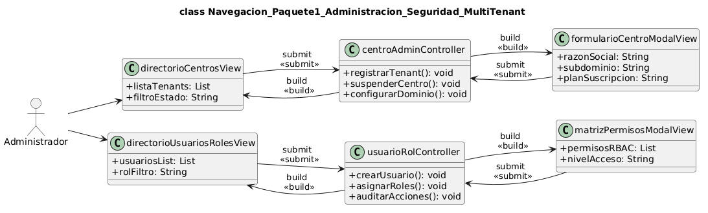

```plantuml
@startuml
allowmixing
skinparam classAttributeIconSize 0
skinparam backgroundColor #FFFFFF
skinparam roundcorner 8
skinparam defaultFontName Arial
left to right direction

title class Navegacion_Paquete1_Administracion_Seguridad_MultiTenant

actor "Administrador" as admin

class "directorioCentrosView" as CentrosView {
  + listaTenants: List
  + filtroEstado: String
}

class "centroAdminController" as CentroCtrl {
  + registrarTenant(): void
  + suspenderCentro(): void
  + configurarDominio(): void
}

class "formularioCentroModalView" as FormCentroView {
  + razonSocial: String
  + subdominio: String
  + planSuscripcion: String
}

class "directorioUsuariosRolesView" as UsuariosView {
  + usuariosList: List
  + rolFiltro: String
}

class "usuarioRolController" as UsuarioCtrl {
  + crearUsuario(): void
  + asignarRoles(): void
  + auditarAcciones(): void
}

class "matrizPermisosModalView" as PermisosModalView {
  + permisosRBAC: List
  + nivelAcceso: String
}

admin --> CentrosView
CentrosView --> CentroCtrl : submit \n <<submit>>
CentroCtrl --> FormCentroView : build \n <<build>>
FormCentroView --> CentroCtrl : submit \n <<submit>>
CentroCtrl --> CentrosView : build \n <<build>>

admin --> UsuariosView
UsuariosView --> UsuarioCtrl : submit \n <<submit>>
UsuarioCtrl --> PermisosModalView : build \n <<build>>
PermisosModalView --> UsuarioCtrl : submit \n <<submit>>
UsuarioCtrl --> UsuariosView : build \n <<build>>
@enduml
```

##### Diagrama de Navegación 2: Paquete 2 – Gestión Clínica, Historia Clínica y Profesionales (backend/clinica)

Modela el núcleo asistencial de los psicólogos tratantes: apertura de historias clínicas electrónicas, anamnesis, autocompletado CIE-10/11, editor de 4 cuadrantes SOAP, protocolo formal de egreso y orden de interconsulta a Psiquiatría:

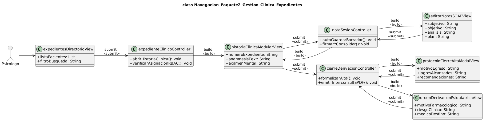

```plantuml
@startuml
allowmixing
skinparam classAttributeIconSize 0
skinparam backgroundColor #FFFFFF
skinparam roundcorner 8
skinparam defaultFontName Arial
left to right direction

title class Navegacion_Paquete2_Gestion_Clinica_Expedientes

actor "Psicologo" as psyc

class "expedientesDirectorioView" as DirectorioView {
  + listaPacientes: List
  + filtroBusqueda: String
}

class "expedienteClinicoController" as ExpCtrl {
  + abrirHistoriaClinica(): void
  + verificarAsignacionRBAC(): void
}

class "historiaClinicaModularView" as HCView {
  + numeroExpediente: String
  + anamnesisText: String
  + examenMental: String
}

class "editorNotasSOAPView" as SOAPView {
  + subjetivo: String
  + objetivo: String
  + analisis: String
  + plan: String
}

class "notaSesionController" as SOAPCtrl {
  + autoGuardarBorrador(): void
  + firmarYConsolidar(): void
}

class "protocoloCierreAltaModalView" as CierreModalView {
  + motivoEgreso: String
  + logrosAlcanzados: String
  + recomendaciones: String
}

class "ordenDerivacionPsiquiatricaView" as DerivacionView {
  + motivoFarmacologico: String
  + riesgoClinico: String
  + medicoDestino: String
}

class "cierreDerivacionController" as CierreCtrl {
  + formalizarAlta(): void
  + emitirInterconsultaPDF(): void
}

psyc --> DirectorioView
DirectorioView --> ExpCtrl : submit \n <<submit>>
ExpCtrl --> HCView : build \n <<build>>
HCView --> SOAPCtrl : submit \n <<submit>>
SOAPCtrl --> SOAPView : build \n <<build>>
SOAPView --> SOAPCtrl : submit \n <<submit>>
SOAPCtrl --> HCView : build \n <<build>>

HCView --> CierreCtrl : submit \n <<submit>>
CierreCtrl --> CierreModalView : build \n <<build>>
CierreCtrl --> DerivacionView : build \n <<build>>
CierreModalView --> CierreCtrl : submit \n <<submit>>
DerivacionView --> CierreCtrl : submit \n <<submit>>
@enduml
```

##### Diagrama de Navegación 3: Paquete 3 – Agenda, Comunicación y Seguimiento (backend/agenda y backend/clinica)

Abarca la agenda interactiva de citas, la integración WebRTC de teleconsulta con Jitsi Meet, y el ciclo bilateral de asignación de tareas inter-sesión en Web con recepción y reporte reflexivo en la app móvil Flutter:

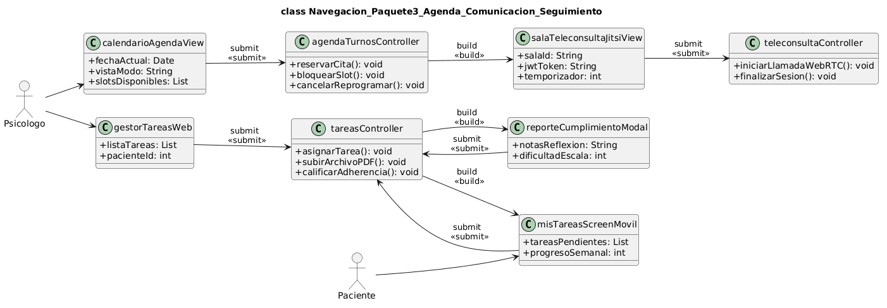

```plantuml
@startuml
allowmixing
skinparam classAttributeIconSize 0
skinparam backgroundColor #FFFFFF
skinparam roundcorner 8
skinparam defaultFontName Arial
left to right direction

title class Navegacion_Paquete3_Agenda_Comunicacion_Seguimiento

actor "Psicologo" as psyc
actor "Paciente" as pac

class "calendarioAgendaView" as AgendaView {
  + fechaActual: Date
  + vistaModo: String
  + slotsDisponibles: List
}

class "agendaTurnosController" as AgendaCtrl {
  + reservarCita(): void
  + bloquearSlot(): void
  + cancelarReprogramar(): void
}

class "salaTeleconsultaJitsiView" as TeleconsultaView {
  + salaId: String
  + jwtToken: String
  + temporizador: int
}

class "teleconsultaController" as JitsiCtrl {
  + iniciarLlamadaWebRTC(): void
  + finalizarSesion(): void
}

class "gestorTareasWeb" as TareasWebView {
  + listaTareas: List
  + pacienteId: int
}

class "tareasController" as TareasCtrl {
  + asignarTarea(): void
  + subirArchivoPDF(): void
  + calificarAdherencia(): void
}

class "misTareasScreenMovil" as TareasMovilView {
  + tareasPendientes: List
  + progresoSemanal: int
}

class "reporteCumplimientoModal" as ReporteModalView {
  + notasReflexion: String
  + dificultadEscala: int
}

psyc --> AgendaView
AgendaView --> AgendaCtrl : submit \n <<submit>>
AgendaCtrl --> TeleconsultaView : build \n <<build>>
TeleconsultaView --> JitsiCtrl : submit \n <<submit>>

psyc --> TareasWebView
TareasWebView --> TareasCtrl : submit \n <<submit>>

pac --> TareasMovilView
TareasMovilView --> TareasCtrl : submit \n <<submit>>
TareasCtrl --> ReporteModalView : build \n <<build>>
ReporteModalView --> TareasCtrl : submit \n <<submit>>
TareasCtrl --> TareasMovilView : build \n <<build>>
@enduml
```

##### Diagrama de Navegación 4: Paquete 4 – Formularios, Consentimientos y Documentación (backend/clinica)

Estructura el diligenciamiento del intake de preconsulta mediante Stepper móvil, la administración de plantillas institucionales con variables dinámicas, y la firma digital en canvas táctil con sellado criptográfico SHA-256:

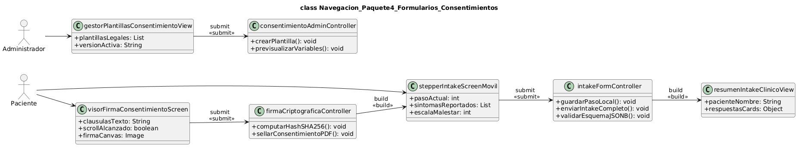

```plantuml
@startuml
allowmixing
skinparam classAttributeIconSize 0
skinparam backgroundColor #FFFFFF
skinparam roundcorner 8
skinparam defaultFontName Arial
left to right direction

title class Navegacion_Paquete4_Formularios_Consentimientos

actor "Paciente" as pac
actor "Administrador" as admin

class "stepperIntakeScreenMovil" as IntakeMovilView {
  + pasoActual: int
  + sintomasReportados: List
  + escalaMalestar: int
}

class "intakeFormController" as IntakeCtrl {
  + guardarPasoLocal(): void
  + enviarIntakeCompleto(): void
  + validarEsquemaJSONB(): void
}

class "resumenIntakeClinicoView" as IntakeResumenView {
  + pacienteNombre: String
  + respuestasCards: Object
}

class "gestorPlantillasConsentimientoView" as PlantillasView {
  + plantillasLegales: List
  + versionActiva: String
}

class "consentimientoAdminController" as ConsentAdminCtrl {
  + crearPlantilla(): void
  + previsualizarVariables(): void
}

class "visorFirmaConsentimientoScreen" as FirmaScreenView {
  + clausulasTexto: String
  + scrollAlcanzado: boolean
  + firmaCanvas: Image
}

class "firmaCriptograficaController" as FirmaCtrl {
  + computarHashSHA256(): void
  + sellarConsentimientoPDF(): void
}

pac --> IntakeMovilView
IntakeMovilView --> IntakeCtrl : submit \n <<submit>>
IntakeCtrl --> IntakeResumenView : build \n <<build>>

admin --> PlantillasView
PlantillasView --> ConsentAdminCtrl : submit \n <<submit>>

pac --> FirmaScreenView
FirmaScreenView --> FirmaCtrl : submit \n <<submit>>
FirmaCtrl --> IntakeMovilView : build \n <<build>>
@enduml
```

##### Diagrama de Navegación 5: Paquete 5 – Inteligencia Artificial y Chatbot (backend/clinica)

Modela la interacción conversacional del paciente con el chatbot FAQ, la activación reactiva del modal de auxilio ante ideación suicida (24/7), el escalamiento WebSocket a recepción humana, y el panel asistivo de preconsulta para el psicólogo:

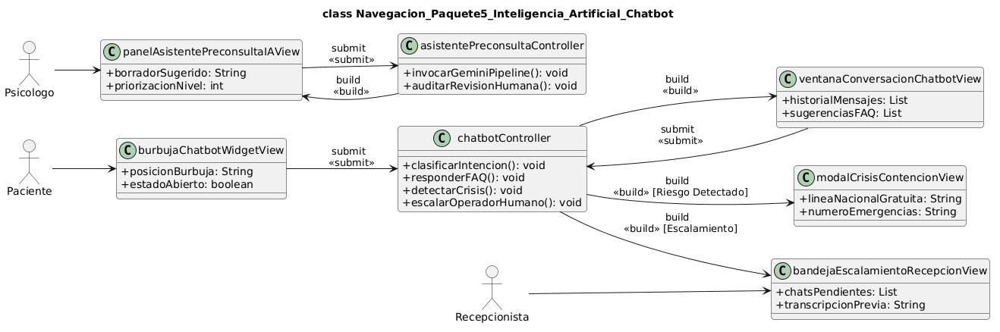

```plantuml
@startuml
allowmixing
skinparam classAttributeIconSize 0
skinparam backgroundColor #FFFFFF
skinparam roundcorner 8
skinparam defaultFontName Arial
left to right direction

title class Navegacion_Paquete5_Inteligencia_Artificial_Chatbot

actor "Paciente" as pac
actor "Psicologo" as psyc
actor "Recepcionista" as recep

class "burbujaChatbotWidgetView" as WidgetChatView {
  + posicionBurbuja: String
  + estadoAbierto: boolean
}

class "ventanaConversacionChatbotView" as VentanaChatView {
  + historialMensajes: List
  + sugerenciasFAQ: List
}

class "chatbotController" as ChatCtrl {
  + clasificarIntencion(): void
  + responderFAQ(): void
  + detectarCrisis(): void
  + escalarOperadorHumano(): void
}

class "modalCrisisContencionView" as ModalCrisisView {
  + lineaNacionalGratuita: String
  + numeroEmergencias: String
}

class "bandejaEscalamientoRecepcionView" as BandejaRecepView {
  + chatsPendientes: List
  + transcripcionPrevia: String
}

class "panelAsistentePreconsultaIAView" as PanelIAView {
  + borradorSugerido: String
  + priorizacionNivel: int
}

class "asistentePreconsultaController" as AsistenteIACtrl {
  + invocarGeminiPipeline(): void
  + auditarRevisionHumana(): void
}

pac --> WidgetChatView
WidgetChatView --> ChatCtrl : submit \n <<submit>>
ChatCtrl --> VentanaChatView : build \n <<build>>
VentanaChatView --> ChatCtrl : submit \n <<submit>>
ChatCtrl --> ModalCrisisView : build \n <<build>> [Riesgo Detectado]
ChatCtrl --> BandejaRecepView : build \n <<build>> [Escalamiento]
recep --> BandejaRecepView

psyc --> PanelIAView
PanelIAView --> AsistenteIACtrl : submit \n <<submit>>
AsistenteIACtrl --> PanelIAView : build \n <<build>>
@enduml
```

##### Diagrama de Navegación 6: Paquete 6 – Reportes y Pagos (backend/reportes y backend/subscriptions)

Organiza la visualización de analíticas operativas y clínicas del centro (KPIs en Chart.js), la exportación de reportes institucionales en PDF y la gestión de planes de suscripción tenant:

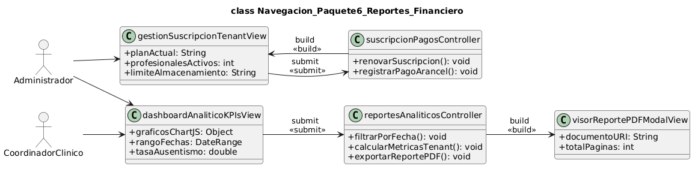

```plantuml
@startuml
allowmixing
skinparam classAttributeIconSize 0
skinparam backgroundColor #FFFFFF
skinparam roundcorner 8
skinparam defaultFontName Arial
left to right direction

title class Navegacion_Paquete6_Reportes_Financiero

actor "Administrador" as admin
actor "CoordinadorClinico" as coord

class "dashboardAnaliticoKPIsView" as DashAnaliticoView {
  + graficosChartJS: Object
  + rangoFechas: DateRange
  + tasaAusentismo: double
}

class "reportesAnaliticosController" as RepCtrl {
  + filtrarPorFecha(): void
  + calcularMetricasTenant(): void
  + exportarReportePDF(): void
}

class "visorReportePDFModalView" as ReportePDFView {
  + documentoURI: String
  + totalPaginas: int
}

class "gestionSuscripcionTenantView" as SuscripcionView {
  + planActual: String
  + profesionalesActivos: int
  + limiteAlmacenamiento: String
}

class "suscripcionPagosController" as PagoCtrl {
  + renovarSuscripcion(): void
  + registrarPagoArancel(): void
}

admin --> DashAnaliticoView
coord --> DashAnaliticoView
DashAnaliticoView --> RepCtrl : submit \n <<submit>>
RepCtrl --> ReportePDFView : build \n <<build>>

admin --> SuscripcionView
SuscripcionView --> PagoCtrl : submit \n <<submit>>
PagoCtrl --> SuscripcionView : build \n <<build>>
@enduml
```

#### 6.2.1.5 Modelado del Comportamiento Temporal (Diagramas de Tiempo UML)

Conforme al estándar UML oficial y las directrices expuestas en cátedra para diagramas de tiempo (`sd Diagrama_Tiempo`), el comportamiento temporal del sistema se formaliza sobre una **escala temporal lineal discreta (0 a 100)**. Cada diagrama combina:
* **Línea de Vida de Estado (`robust`):** Expone en el eje vertical izquierdo los estados discretos del subsistema, mostrando transiciones en forma de onda cuadrada con los eventos que disparan cada cambio de nivel.
* **Líneas de Vida de Valores / Buffer (`concise`):** Ilustran mediante bloques hexagonales cerrados el volumen de datos en memoria caché, el estado de las transacciones en PostgreSQL y los registros de auditoría.
* **Flechas Verticales de Sincronización:** Vinculan causalmente los eventos de la línea de estado superior con las transiciones de los componentes de persistencia y red inferiores.
* **Restricciones de Duración:** Intervalos temporales acotados entre llaves `{10s}`, `{20s}`, `{30s}` que garantizan las políticas de tolerancia a fallos, debounce de autoguardado y timeouts de procesamiento asistivo.

##### Diagrama de Tiempo 1: Autoguardado Reactivo y Concurrencia en Notas SOAP (CU16 / HU-27)

Formaliza el mecanismo de debounce de 30 segundos en el editor clínico SOAP: las modificaciones en teclado actualizan el buffer local; una pausa de 30s dispara el guardado automático a PostgreSQL sin bloquear la UI, concluyendo con la consolidación inmutable mediante firma digital:

###### Tabla de Datos y Especificación Temporal UML 2.5 – Autoguardado Reactivo SOAP (CU16)

| Hito ($t$) | Intervalo ($\Delta t$) / Restricción | Línea de Estado (`robust: Estado_Nota_SOAP`) | Línea de Valor 1 (`concise: Buffer_Local_Cache`) | Línea de Valor 2 (`concise: Transaccion_PostgreSQL`) | Evento Disparador (Trigger Causal) | Mensaje de Sincronización (UML 2.5) | Invariante de Seguridad / Regla de Negocio |
| :---: | :---: | :--- | :--- | :--- | :--- | :--- | :--- |
| **@0** | — | `Sin_Iniciar` | `0 KB (Vacio)` | `Idle` | Estado inicial de reposo en interfaz web del terapeuta. | — | Editor en modo lectura previa a la apertura de sesión clínica. |
| **@10** | `{10s}` | `En_Edicion_Activa` | `1.5 KB (Modificado)` | `Idle` | `IniciarRedaccion`: Terapeuta pulsa teclas en cuadrante S/O/A/P. | `Estado -> Buffer : EntradaTeclado` | Inicialización de buffer en memoria del cliente y arranque del timer debounce. |
| **@30** | `{20s}` | `En_Edicion_Activa` | `3.2 KB (Modificado)` | `Idle` | `EscrituraContinua`: Edición sostenida del análisis y plan terapéutico. | Actualización local en memoria caché | El timer debounce de 30s se reinicia en cada pulsación para evitar I/O redundante a la BD. |
| **@50** | `{20s}` | `AutoGuardado_Borrador` | `3.2 KB (Sincronizado)` | `PATCH_JSONB (HTTP 200)` | `Pausa30s`: Cese de escritura por 30s consecutivos (debounce timeout). | `Estado -> DB : TriggerDebounce` | Despacho asíncrono no bloqueante vía HTTP PATCH JSONB a PostgreSQL del tenant. |
| **@70** | `{20s}` | `En_Edicion_Activa` | `4.0 KB (Modificado)` | `Idle` | `ReanudarEdicion`: Terapeuta añade conclusiones diagnósticas finales. | Reactivación del buffer interactivo | Retorno a edición activa; confirmación visual del badge "Borrador guardado". |
| **@90** | `{20s}` | `Consolidada_Inmutable` | `0 KB (Liberado)` | `INSERT_Inmutable_Audit` | `FirmarNota`: Terapeuta pulsa botón "Firmar y Consolidar Sesión". | `Estado -> DB : ConsignarFirma` | Transacción inmutable con hash SHA-256, sellado temporal y liberación del buffer en memoria. |
| **@100** | `{10s}` | `Consolidada_Inmutable` | `0 KB (Liberado)` | `Idle` | Sesión clínica cerrada y consolidada exitosamente. | — | La nota queda bloqueada para edición futura; cumple normativa médico-legal y trazabilidad. |

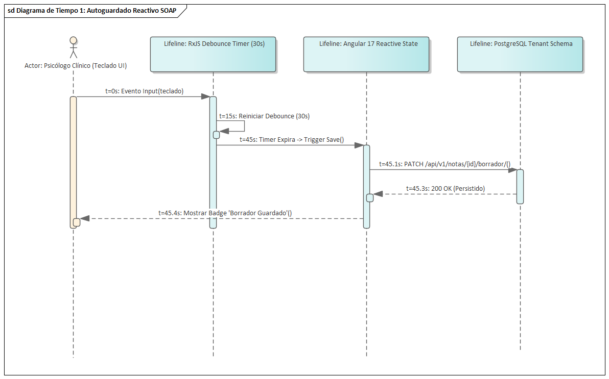

```plantuml
@startuml
skinparam backgroundColor #FFFFFF
skinparam defaultFontName Arial

title sd Diagrama_Tiempo_Autoguardado_Notas_SOAP

robust "Estado_Nota_SOAP" as Estado
concise "Buffer_Local_Cache" as Buffer
concise "Transaccion_PostgreSQL" as DB

@0
Estado is Sin_Iniciar
Buffer is "0 KB (Vacio)"
DB is "Idle"

@10
Estado is En_Edicion_Activa : IniciarRedaccion
Buffer is "1.5 KB (Modificado)"
Estado -> Buffer : EntradaTeclado

@30
Estado is En_Edicion_Activa : EscrituraContinua
Buffer is "3.2 KB (Modificado)"

@50
Estado is AutoGuardado_Borrador : Pausa30s
Buffer is "3.2 KB (Sincronizado)"
DB is "PATCH_JSONB (HTTP 200)"
Estado -> DB : TriggerDebounce

@70
Estado is En_Edicion_Activa : ReanudarEdicion
Buffer is "4.0 KB (Modificado)"
DB is "Idle"

@90
Estado is Consolidada_Inmutable : FirmarNota
Buffer is "0 KB (Liberado)"
DB is "INSERT_Inmutable_Audit"
Estado -> DB : ConsignarFirma

@100
Estado is Consolidada_Inmutable

@0 <-> @10 : {10s}
@10 <-> @30 : {20s}
@30 <-> @50 : {20s}
@50 <-> @70 : {20s}
@70 <-> @90 : {20s}
@enduml
```

##### Diagrama de Tiempo 2: Pipeline Asíncrono de IA y Detección de Riesgo Crítico (CU14 / IA / HU-35)

Modela la sincronización entre el cliente web, la sanitización de datos sensibles (PII), la invocación cifrada a Gemini 1.5 Pro mediante Celery/Redis, la evaluación de reglas clínicas transparentes y el registro inmutable de auditoría:

###### Tabla de Datos y Especificación Temporal UML 2.5 – Pipeline Asíncrono de IA y Riesgo (CU14 / IA / HU-35)

| Hito ($t$) | Intervalo ($\Delta t$) / Restricción | Línea de Estado (`robust: Estado_Pipeline_IA`) | Línea de Valor 1 (`concise: Worker_Celery_Redis`) | Línea de Valor 2 (`concise: Estado_Auditoria_PostgreSQL`) | Evento Disparador (Trigger Causal) | Mensaje de Sincronización (UML 2.5) | Invariante de Seguridad / Regla de Negocio |
| :---: | :---: | :--- | :--- | :--- | :--- | :--- | :--- |
| **@0** | — | `En_Espera` | `Idle` | `Idle` | Reposo del pipeline de preconsulta asistiva. | — | Espera pasiva de finalización de cuestionario previo (Intake) por el paciente. |
| **@10** | `{10s}` | `Sanitizacion_PII` | `ValidandoConsentimiento` | `Idle` | `SolicitarAnalisis`: Psicólogo solicita pre-análisis asistivo del intake. | `Estado -> Worker : DispatchTask` | Validación estricta de consentimiento informado y ofuscación irreversible de PII. |
| **@30** | `{20s}` | `Inferencia_LLM_Activa` | `InvocandoGemini_TLS13` | `Idle` | `EncolarRedis_Worker`: Tarea despachada hacia Celery Worker vía Redis. | Conexión TLS 1.3 con Gemini 1.5 Pro | Canal cifrado hacia la API de Google Cloud; exclusión absoluta de datos identificables. |
| **@60** | `{30s}` | `Sugerencia_Auditorada` | `INSERT_auditoria_ia` | `Log_ReglaClinica4_NivelUrgencia` | `EvaluacionReglasClinicas`: Retorno de LLM y ejecución de heurísticas deterministas. | `Estado -> Audit : PersistirAuditoria` | Evaluación determinista (Regla 4: Malestar $\ge 4 \rightarrow$ Alerta Urgencia) y log de auditoría. |
| **@85** | `{25s}` | `Borrador_Consolidado_HC` | `Idle` | `INSERT_decision_psicologo` | `AprobacionHumana`: Psicólogo revisa, ajusta y convalida el borrador. | `Estado -> Audit : AuditoriaAprobacion` | Principio *Human-in-the-Loop*: Ninguna IA consigna notas sin validación médica formal. |
| **@100** | `{15s}` | `Borrador_Consolidado_HC` | `Idle` | `Idle` | Integración completada en el expediente electrónico del paciente. | — | Trazabilidad médica completa registrada con identificador de sesión y terapeuta. |

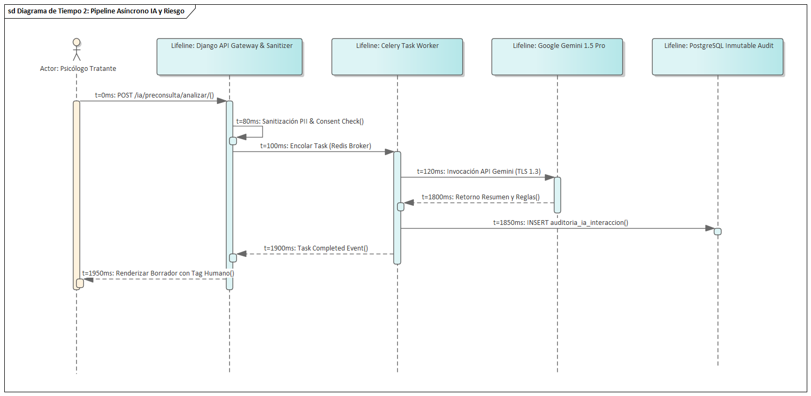

```plantuml
@startuml
skinparam backgroundColor #FFFFFF
skinparam defaultFontName Arial

title sd Diagrama_Tiempo_Pipeline_IA_Preconsulta

robust "Estado_Pipeline_IA" as Estado
concise "Worker_Celery_Redis" as Worker
concise "Estado_Auditoria_PostgreSQL" as Audit

@0
Estado is En_Espera
Worker is "Idle"
Audit is "Idle"

@10
Estado is Sanitizacion_PII : SolicitarAnalisis
Worker is "ValidandoConsentimiento"
Estado -> Worker : DispatchTask

@30
Estado is Inferencia_LLM_Activa : EncolarRedis_Worker
Worker is "InvocandoGemini_TLS13"

@60
Estado is Sugerencia_Auditorada : EvaluacionReglasClinicas
Worker is "INSERT_auditoria_ia"
Audit is "Log_ReglaClinica4_NivelUrgencia"
Estado -> Audit : PersistirAuditoria

@85
Estado is Borrador_Consolidado_HC : AprobacionHumana
Worker is "Idle"
Audit is "INSERT_decision_psicologo"
Estado -> Audit : AuditoriaAprobacion

@100
Estado is Borrador_Consolidado_HC

@0 <-> @10 : {10s}
@10 <-> @30 : {20s}
@30 <-> @60 : {30s}
@60 <-> @85 : {25s}
@enduml
```

##### Diagrama de Tiempo 3: Ciclo de Vida de Tareas Terapéuticas y Recordatorios (CU17 / HU-29, HU-30)

Detalla el ciclo temporal inter-sesión de 7 días: asignación en consulta (Día 0), recordatorio push automatizado vía FCM (Día 3), reporte de evidencia y autorreflexión por el paciente (Día 5) y revisión presencial con calificación de adherencia (Día 7):

###### Tabla de Datos y Especificación Temporal UML 2.5 – Ciclo de Vida de Tareas Terapéuticas (CU17 / HU-29, HU-30)

| Hito ($t$) | Intervalo ($\Delta t$) / Restricción | Línea de Estado (`robust: Estado_Tarea_Paciente`) | Línea de Valor 1 (`concise: Canal_Notificaciones_FCM`) | Línea de Valor 2 (`concise: Adherencia_Registro_DB`) | Evento Disparador (Trigger Causal) | Mensaje de Sincronización (UML 2.5) | Invariante de Seguridad / Regla de Negocio |
| :---: | :---: | :--- | :--- | :--- | :--- | :--- | :--- |
| **@0** | — | `Sin_Asignar` | `Idle` | `Sin_Registro` | Fase previa a la consulta clínica. | — | No existen tareas cognitivo-conductuales inter-sesión activas. |
| **@10** | `{10s}` (Día 0) | `Asignada_Pendiente` | `Idle` | `Tarea_Creada (Dia 0)` | `AsignarTareaWeb`: Terapeuta prescribe ejercicio inter-sesión en portal web. | `Estado -> DB : POST_Tarea` | Persistencia en base de datos con fecha límite, objetivos y pautas de realización. |
| **@35** | `{25s}` (Día 3) | `En_Progreso_Activa` | `Push_Despachado_0800AM` | `Alerta_Recordatorio (Dia 3)` | `NotificacionPushFCM`: Celery Beat detecta proximidad a 72h del plazo. | `Estado -> FCM : CronTrigger` | Recordatorio proactivo automatizado al smartphone del paciente para evitar olvidos. |
| **@70** | `{35s}` (Día 5) | `Completada_Entregada` | `Sync_Backend_Recepcion` | `Reporte_Guardado_100% (Dia 5)` | `SubirEvidenciaReflexion`: Paciente sube registro en App Flutter. | `Estado -> DB : PUT_Reporte` | Recepción de reflexiones, nivel de malestar/dificultad percibido (1-5) y archivo adjunto. |
| **@90** | `{20s}` (Día 7) | `Cerrada_Con_Feedback` | `Idle` | `Calificacion_Adherencia (Dia 7)` | `RevisionSesionClinica`: Terapeuta revisa tarea en la siguiente sesión presencial. | `Estado -> DB : PATCH_Feedback` | Evaluación cualitativa y cuantitativa de adherencia; se actualizan gráficos longitudinales. |
| **@100** | `{10s}` | `Cerrada_Con_Feedback` | `Idle` | `Calificacion_Adherencia (Dia 7)` | Ciclo de la tarea inter-sesión finalizado exitosamente. | — | Hito consolidado en el expediente para medir la eficacia del tratamiento psicológico. |

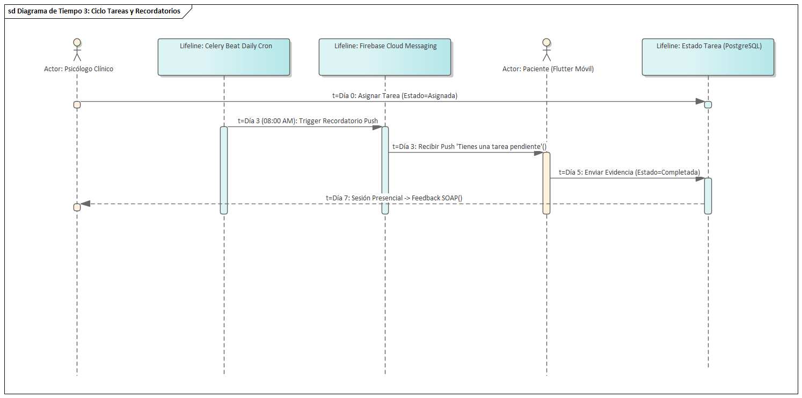

```plantuml
@startuml
skinparam backgroundColor #FFFFFF
skinparam defaultFontName Arial

title sd Diagrama_Tiempo_Ciclo_Tareas_Recordatorios

robust "Estado_Tarea_Paciente" as Estado
concise "Canal_Notificaciones_FCM" as FCM
concise "Adherencia_Registro_DB" as DB

@0
Estado is Sin_Asignar
FCM is "Idle"
DB is "Sin_Registro"

@10
Estado is Asignada_Pendiente : AsignarTareaWeb
DB is "Tarea_Creada (Dia 0)"
Estado -> DB : POST_Tarea

@35
Estado is En_Progreso_Activa : NotificacionPushFCM
FCM is "Push_Despachado_0800AM"
DB is "Alerta_Recordatorio (Dia 3)"
Estado -> FCM : CronTrigger

@70
Estado is Completada_Entregada : SubirEvidenciaReflexion
FCM is "Sync_Backend_Recepcion"
DB is "Reporte_Guardado_100% (Dia 5)"
Estado -> DB : PUT_Reporte

@90
Estado is Cerrada_Con_Feedback : RevisionSesionClinica
DB is "Calificacion_Adherencia (Dia 7)"
Estado -> DB : PATCH_Feedback

@100
Estado is Cerrada_Con_Feedback

@0 <-> @10 : {10s}
@10 <-> @35 : {25s}
@35 <-> @70 : {35s}
@70 <-> @90 : {20s}
@enduml
```

#### 6.2.1.6 Modelado del Ciclo de Vida y Transiciones (Diagramas de Máquinas de Estados UML)

Formalización de las máquinas de estados de las cinco entidades y flujos conversacionales del incremento (CU14, CU16, CU17, CU18/HU-35 y CU20) con estados estables, acciones de entrada/salida y guardas condicionales, correspondientes a los modelos implementados en Enterprise Architect:

##### Máquina de Estados 1: Ficha de Intake y Triaje Clínico Digital (CU14)

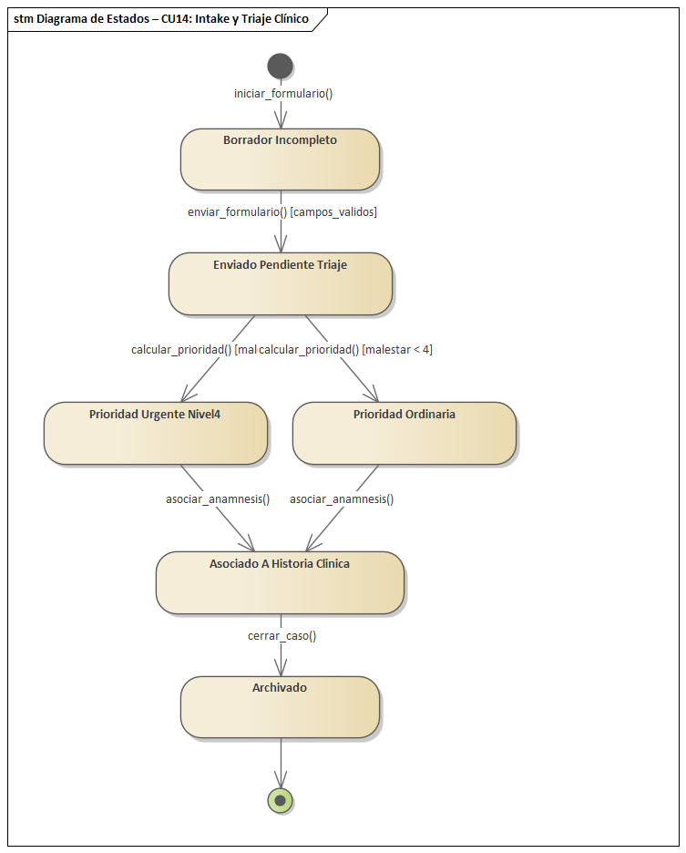

```plantuml
@startuml
skinparam backgroundColor #FFFFFF
skinparam defaultFontName Arial
skinparam defaultFontSize 11
skinparam shadowing false
skinparam roundcorner 8

skinparam state {
    BackgroundColor #FDF8E2
    BorderColor #1A365D
    BorderThickness 1.2
    FontColor #0F172A
    FontStyle bold
    FontSize 12
    ArrowColor #1A365D
    ArrowFontColor #1E293B
    ArrowFontSize 10
    StartColor #1A365D
    EndColor #1A365D
}

title Diagrama de Estados UML 2.5 (Enterprise Architect) - CU14: Ficha de Intake y Triaje Clínico

[*] --> FormularioAsignado : Cita agendada

state FormularioAsignado {
    FormularioAsignado : entry / Enviar notificación push al paciente
    FormularioAsignado : do / Habilitar cuestionario en App Flutter
}

FormularioAsignado --> EnDiligenciamiento : Paciente abre cuestionario móvil
state EnDiligenciamiento {
    EnDiligenciamiento : do / Validar campos obligatorios en stepper
    EnDiligenciamiento : do / Guardar avance parcial en almacenamiento local
}

EnDiligenciamiento --> EnDiligenciamiento : Modificar respuestas / Paso siguiente
EnDiligenciamiento --> Enviado : Presionar 'Finalizar y Enviar' [Campos válidos == true]

state Enviado {
    Enviado : entry / Persistir JSONB en BD PostgreSQL
    Enviado : entry / Evaluar bandera de urgencia (Escala >= 4)
    Enviado : do / Bloquear edición en la app móvil
}

Enviado --> EnRevisionClinica : Psicólogo abre expediente del paciente
state EnRevisionClinica {
    EnRevisionClinica : do / Analizar respuestas clínicas y antecedentes
    EnRevisionClinica : do / Opcional: Solicitar pre-análisis IA (HU-35)
}

EnRevisionClinica --> ConsolidadoEnHistoria : Psicólogo incorpora datos a la Anamnesis
state ConsolidadoEnHistoria {
    ConsolidadoEnHistoria : entry / Marcar intake como incorporado
    ConsolidadoEnHistoria : do / Expediente inicial completo
}

ConsolidadoEnHistoria --> [*] : Finalizar
@enduml
```

##### Máquina de Estados 2: Notas Clínicas SOAP e Inmutabilidad Médico-Legal (CU16)

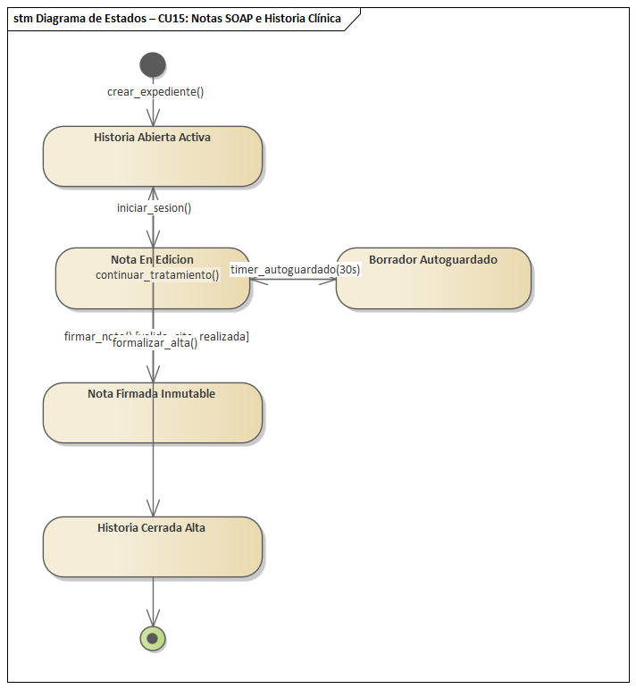

```plantuml
@startuml
skinparam backgroundColor #FFFFFF
skinparam defaultFontName Arial
skinparam defaultFontSize 11
skinparam shadowing false
skinparam roundcorner 8

skinparam state {
    BackgroundColor #FDF8E2
    BorderColor #1A365D
    BorderThickness 1.2
    FontColor #0F172A
    FontStyle bold
    FontSize 12
    ArrowColor #1A365D
    ArrowFontColor #1E293B
    ArrowFontSize 10
    StartColor #1A365D
    EndColor #1A365D
}

title Diagrama de Estados UML 2.5 (Enterprise Architect) - CU16: Ciclo de Vida de Nota SOAP

[*] --> SesionEnCurso : Inicia consulta médica

state SesionEnCurso {
    SesionEnCurso : do / Terapeuta observa sintomatología y conducta
}

SesionEnCurso --> BorradorAbierto : Concluye cita y abre editor SOAP
state BorradorAbierto {
    BorradorAbierto : entry / Instanciar 4 cuadrantes (S, O, A, P)
    BorradorAbierto : do / Capturar pulsaciones en editor Angular
}

BorradorAbierto --> BorradorAutoguardado : Inactividad de 30s [Debounce RxJS]
state BorradorAutoguardado {
    BorradorAutoguardado : entry / PATCH temporal en PostgreSQL
    BorradorAutoguardado : do / Mostrar badge "Guardado automáticamente"
}

BorradorAutoguardado --> BorradorAbierto : Reanudar redacción en teclado
BorradorAbierto --> ValidacionFinal : Clic en 'Firmar y Consolidar'

state ValidacionFinal {
    ValidacionFinal : do / Verificar que los 4 cuadrantes tengan contenido
    ValidacionFinal : do / Verificar que la cita esté marcada como 'Realizada'
}

ValidacionFinal --> BorradorAbierto : Error de validación (Faltan campos obligatorios)
ValidacionFinal --> FirmadaInmutable : Validación exitosa [Sellado digital]

state FirmadaInmutable {
    FirmadaInmutable : entry / Bloquear modificaciones a nivel de BD (UPDATE=False)
    FirmadaInmutable : entry / Generar número correlativo médico-legal
    FirmadaInmutable : do / Integrar en la línea de tiempo histórica del expediente
}

FirmadaInmutable --> [*] : Archivar Nota
@enduml
```

##### Máquina de Estados 3: Tareas Terapéuticas Inter-Sesiones (CU17)

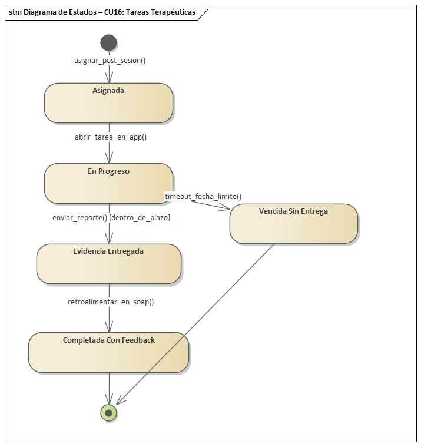

```plantuml
@startuml
skinparam backgroundColor #FFFFFF
skinparam defaultFontName Arial
skinparam defaultFontSize 11
skinparam shadowing false
skinparam roundcorner 8

skinparam state {
    BackgroundColor #FDF8E2
    BorderColor #1A365D
    BorderThickness 1.2
    FontColor #0F172A
    FontStyle bold
    FontSize 12
    ArrowColor #1A365D
    ArrowFontColor #1E293B
    ArrowFontSize 10
    StartColor #1A365D
    EndColor #1A365D
}

title Diagrama de Estados UML 2.5 (Enterprise Architect) - CU17: Ciclo de Tareas Terapéuticas

[*] --> Asignada : Psicólogo crea tarea post-sesión

state Asignada {
    Asignada : entry / Registrar título, instrucciones y fecha límite
    Asignada : entry / Despachar alerta Push FCM al teléfono del paciente
    Asignada : do / Mostrar en 'Mis Tareas' de la App Flutter
}

Asignada --> EnProgreso : Paciente abre la tarea y descarga guía
state EnProgreso {
    EnProgreso : do / Registro de ejercicios (cognitivos / conductuales)
}

EnProgreso --> Entregada : Paciente sube evidencia y reflexión
state Entregada {
    Entregada : entry / Persistir texto de reflexión y dificultad (1-5)
    Entregada : entry / Registrar marca de tiempo exacta de entrega
    Entregada : do / Actualizar barra de logro semanal en la app móvil
}

Asignada --> Vencida : Fecha actual > Fecha límite [Cron nocturno]
EnProgreso --> Vencida : Fecha actual > Fecha límite [Cron nocturno]

state Vencida {
    Vencida : entry / Emitir alerta en Dashboard del psicólogo
}

Entregada --> EvaluadaEnSesion : Psicólogo revisa evidencia en la próxima cita
Vencida --> EvaluadaEnSesion : Psicólogo aborda motivo de no-cumplimiento

state EvaluadaEnSesion {
    EvaluadaEnSesion : entry / Incorporar retroalimentación en Nota SOAP
    EvaluadaEnSesion : do / Cerrar ciclo de la tarea
}

EvaluadaEnSesion --> [*] : Cerrar Tarea
@enduml
```

##### Máquina de Estados 4: Consentimiento Informado Digital y Protocolo Ético de IA (CU18 / HU-35)

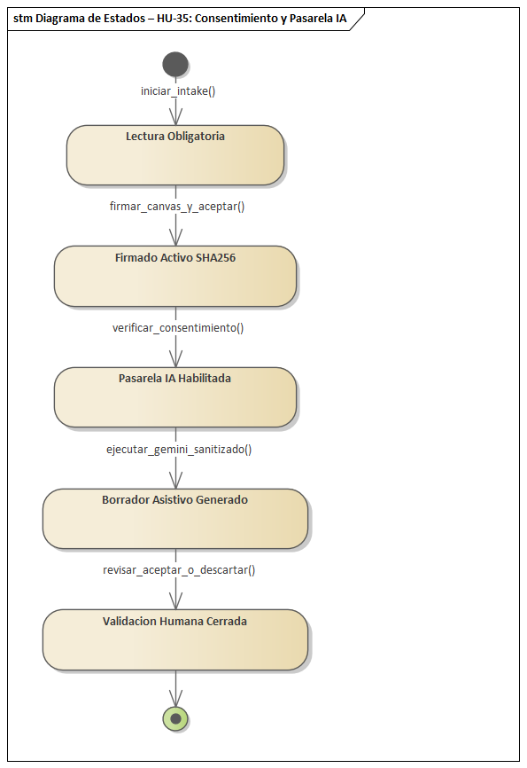

```plantuml
@startuml
skinparam backgroundColor #FFFFFF
skinparam defaultFontName Arial
skinparam defaultFontSize 11
skinparam shadowing false
skinparam roundcorner 8

skinparam state {
    BackgroundColor #FDF8E2
    BorderColor #1A365D
    BorderThickness 1.2
    FontColor #0F172A
    FontStyle bold
    FontSize 12
    ArrowColor #1A365D
    ArrowFontColor #1E293B
    ArrowFontSize 10
    StartColor #1A365D
    EndColor #1A365D
}

title Diagrama de Estados UML 2.5 (Enterprise Architect) - CU18 / HU-35: Consentimiento Digital Criptográfico

[*] --> PendienteDeFirma : Creación de cuenta o cita de primera vez

state PendienteDeFirma {
    PendienteDeFirma : entry / Bloquear acceso a reservas y teleconsulta
    PendienteDeFirma : do / Notificar requerimiento legal al paciente
}

PendienteDeFirma --> LecturaClausulas : Paciente ingresa a pantalla legal
state LecturaClausulas {
    LecturaClausulas : do / Exigir scroll completo del documento al 100%
    LecturaClausulas : do / Marcar checkboxes obligatorios de conformidad
}

LecturaClausulas --> CapturaCanvas : Presionar 'Continuar a Firma'
state CapturaCanvas {
    CapturaCanvas : do / Dibujar firma manuscrita en pantalla táctil
    CapturaCanvas : do / Validar densidad de trazos para evitar firmas en blanco
}

CapturaCanvas --> ProcesamientoCriptografico : Presionar 'Aceptar y Firmar'
state ProcesamientoCriptografico {
    ProcesamientoCriptografico : entry / Generar hash SHA-256(texto_legal + trazos + timestamp + IP)
    ProcesamientoCriptografico : do / Compilar documento PDF con sello y metadatos
}

ProcesamientoCriptografico --> VigenteCertificado : Backend valida hash y persiste registro
state VigenteCertificado {
    VigenteCertificado : entry / Desbloquear servicios clínicos y citas
    VigenteCertificado : do / Archivo legal auditable inmutable
}

VigenteCertificado --> Revocado : Paciente ejerce derecho de revocación formal
state Revocado {
    Revocado : entry / Suspender tratamiento activo de inmediato
    Revocado : do / Notificar al Director Clínico y archivar histórico
}

VigenteCertificado --> [*] : Archivar Vigente
Revocado --> [*] : Archivar Revocado
@enduml
```

##### Máquina de Estados 5: Conversación con el Chatbot de Orientación y Transferencia Humana (CU20)

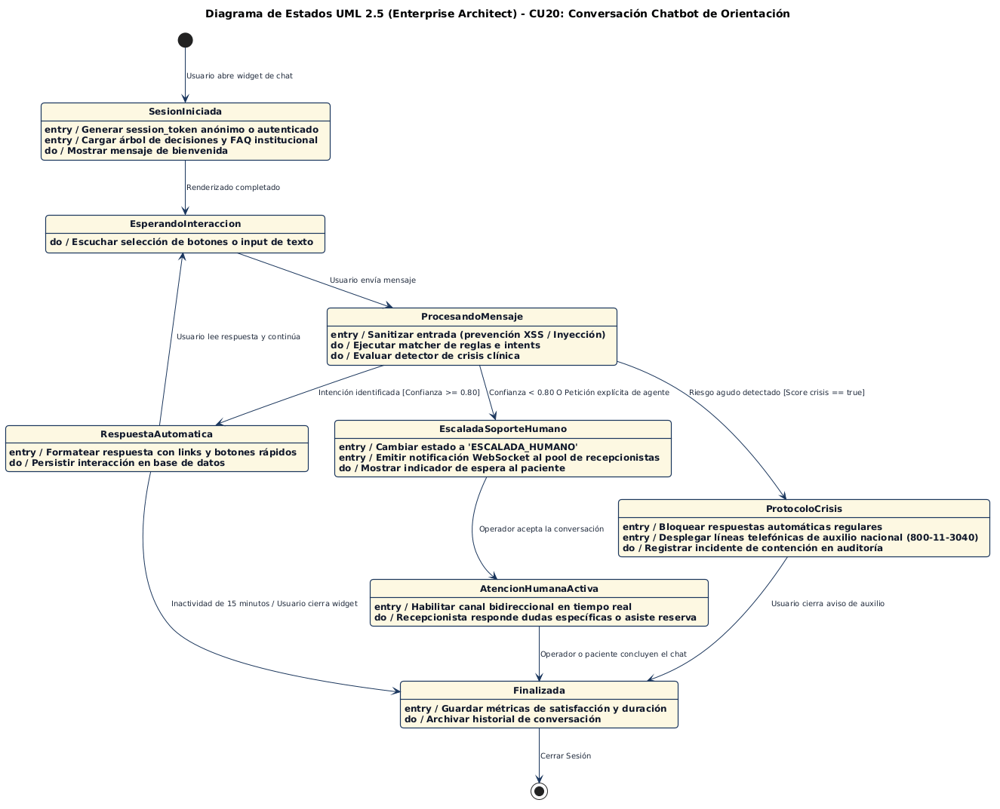

```plantuml
@startuml
skinparam backgroundColor #FFFFFF
skinparam defaultFontName Arial
skinparam defaultFontSize 11
skinparam shadowing false
skinparam roundcorner 8

skinparam state {
    BackgroundColor #FDF8E2
    BorderColor #1A365D
    BorderThickness 1.2
    FontColor #0F172A
    FontStyle bold
    FontSize 12
    ArrowColor #1A365D
    ArrowFontColor #1E293B
    ArrowFontSize 10
    StartColor #1A365D
    EndColor #1A365D
}

title Diagrama de Estados UML 2.5 (Enterprise Architect) - CU20: Conversación Chatbot de Orientación

[*] --> SesionIniciada : Usuario abre widget de chat

state SesionIniciada {
    SesionIniciada : entry / Generar session_token anónimo o autenticado
    SesionIniciada : entry / Cargar árbol de decisiones y FAQ institucional
    SesionIniciada : do / Mostrar mensaje de bienvenida
}

SesionIniciada --> EsperandoInteraccion : Renderizado completado
state EsperandoInteraccion {
    EsperandoInteraccion : do / Escuchar selección de botones o input de texto
}

EsperandoInteraccion --> ProcesandoMensaje : Usuario envía mensaje
state ProcesandoMensaje {
    ProcesandoMensaje : entry / Sanitizar entrada (prevención XSS / Inyección)
    ProcesandoMensaje : do / Ejecutar matcher de reglas e intents
    ProcesandoMensaje : do / Evaluar detector de crisis clínica
}

ProcesandoMensaje --> ProtocoloCrisis : Riesgo agudo detectado [Score crisis == true]
state ProtocoloCrisis {
    ProtocoloCrisis : entry / Bloquear respuestas automáticas regulares
    ProtocoloCrisis : entry / Desplegar líneas telefónicas de auxilio nacional (800-11-3040)
    ProtocoloCrisis : do / Registrar incidente de contención en auditoría
}

ProcesandoMensaje --> RespuestaAutomatica : Intención identificada [Confianza >= 0.80]
state RespuestaAutomatica {
    RespuestaAutomatica : entry / Formatear respuesta con links y botones rápidos
    RespuestaAutomatica : do / Persistir interacción en base de datos
}
RespuestaAutomatica --> EsperandoInteraccion : Usuario lee respuesta y continúa

ProcesandoMensaje --> EscaladaSoporteHumano : Confianza < 0.80 O Petición explícita de agente
state EscaladaSoporteHumano {
    EscaladaSoporteHumano : entry / Cambiar estado a 'ESCALADA_HUMANO'
    EscaladaSoporteHumano : entry / Emitir notificación WebSocket al pool de recepcionistas
    EscaladaSoporteHumano : do / Mostrar indicador de espera al paciente
}

EscaladaSoporteHumano --> AtencionHumanaActiva : Operador acepta la conversación
state AtencionHumanaActiva {
    AtencionHumanaActiva : entry / Habilitar canal bidireccional en tiempo real
    AtencionHumanaActiva : do / Recepcionista responde dudas específicas o asiste reserva
}

AtencionHumanaActiva --> Finalizada : Operador o paciente concluyen el chat
RespuestaAutomatica --> Finalizada : Inactividad de 15 minutos / Usuario cierra widget
ProtocoloCrisis --> Finalizada : Usuario cierra aviso de auxilio

state Finalizada {
    Finalizada : entry / Guardar métricas de satisfacción y duración
    Finalizada : do / Archivar historial de conversación
}

Finalizada --> [*] : Cerrar Sesión
@enduml
```

---

### 6.2.3 Pruebas

#### 6.2.3.1 Plan de Pruebas Funcionales (Caja Negra y Pruebas de Aceptación con BDD)

Siguiendo las directrices expuestas en clase para el aseguramiento de la calidad del software, el formato oficial de casos de prueba de aceptación y los criterios de aceptación BDD (Behavior-Driven Development) establecidos en las Historias de Usuario, el plan de pruebas del Sprint 2 se enfoca en técnicas de Caja Negra (partición de equivalencia, análisis de valores límite y tablas de decisión). Se evalúan exhaustivamente las entradas, precondiciones del sistema, procesamiento de reglas clínicas y salidas esperadas en clientes Web (Angular 17) y Móvil (Flutter 3.x) sobre el backend Django REST Framework conectado a la base de datos PostgreSQL 16 Multi-Tenant con esquemas particionados por centro.

A continuación se detallan los casos de prueba de aceptación estructurados individualmente para cada una de las 14 Historias de Usuario del Sprint 2 (HU-23 a HU-36), cubriendo flujos satisfactorios (camino feliz), validaciones de límites y datos obligatorios, control de acceso RBAC clínico, integridad criptográfica y prompts especializados de diseño para la generación de evidencias visuales:

##### Prueba de Historia de Usuario HU-23 (CU14): Configuración y revisión de formulario previo digital (Intake) en Web

| **Caso de uso / HU** | **HU-23 (CU14): Configuración y revisión de formulario previo digital (Intake) en Web** |
| :--- | :--- |
| **Descripción** | Como Psicólogo o Administrador, quiero configurar cuestionarios de pre-consulta y revisar las respuestas de los pacientes antes de la primera sesión, para conocer el motivo de consulta, urgencia percibida y antecedentes relevantes. |
| **Criterios de Aceptación (BDD)** | • a) Dado que soy Psicólogo autenticado, al acceder a la ficha del paciente, el sistema muestra las respuestas organizadas: Motivo, Síntomas Frecuentes, Escala de Malestar (1-5) y Antecedentes.<br>• b) Si una cita está en menos de 24h sin intake, se visualiza en la agenda el badge contextual 'Formulario Pendiente'.<br>• c) El Administrador puede añadir preguntas en texto libre o Likert validadas en esquema JSONB.<br>• d) Se bloquea la eliminación de preguntas institucionales con respuestas asociadas en el histórico. |
| **Precondiciones** | a) El usuario debe contar con sesión activa y rol Psicólogo o Administrador en el tenant institucional.<br>b) El módulo de "Formularios Previos (Intake)" debe estar habilitado.<br>c) Debe existir conexión activa a PostgreSQL y al menos una cita agendada para el paciente. |

| Paso | Acción / Entrada | Resultado esperado | Estado (Satisfactorio/Fallido) |
| :---: | :--- | :--- | :---: |
| 1 | Acceder a la ficha de cita y seleccionar la pestaña 'Formulario Previo'. | El sistema despliega las respuestas del paciente organizadas en 4 bloques: Motivo Principal, Síntomas Frecuentes, Escala de Malestar (1-5) y Antecedentes. | **Satisfactorio** |
| 2 | Visualizar la agenda semanal con citas en menos de 24 horas cuyo intake aún no ha sido completado. | La interfaz renderiza un badge contextual en color ámbar con la etiqueta 'Formulario Pendiente' junto a la cita. | **Satisfactorio** |
| 3 | Administrador accede al gestor de preguntas institucionales y añade una nueva escala Likert de 5 opciones. | El backend valida la estructura contra el esquema JSONB de preguntas y persiste el cambio retornando HTTP 200 OK. | **Satisfactorio** |
| 4 | Intentar eliminar una pregunta institucional obligatoria que ya registra respuestas históricas en el tenant. | El sistema rechaza la operación mostrando el mensaje de alerta 'No es posible eliminar preguntas con respuestas asociadas en el histórico'. | **Satisfactorio** |

| Responsable | Psicólogo / Administrador del Centro (Desarrolladores: Mujica Andy / Larrazabal Julio) |
| :--- | :--- |
| **Resultado de la prueba** | **Satisfactorio** |
| **Adjunto** | **Prompt para IA (Generación de Interfaz/Mockup):**<br>*"UI/UX desktop web design for clinical intake and pre-consultation review screen in mental health SaaS SIGEPSI, Angular 17. Clean healthcare light mode. Patient summary badge, structured response cards for Motivo Principal, Escala de Malestar Emocional (Level 4/5 in amber), Síntomas Reportados tags. Figma UI, 4k."* |

<br>

##### Prueba de Historia de Usuario HU-24 (CU14): Diligenciamiento de formulario previo a la consulta en App Móvil

| **Caso de uso / HU** | **HU-24 (CU14): Diligenciamiento de formulario previo a la consulta en App Móvil** |
| :--- | :--- |
| **Descripción** | Como Paciente con cita agendada, quiero completar el formulario previo desde la app móvil Flutter paso a paso, para brindar información clínica a mi terapeuta antes de la sesión. |
| **Criterios de Aceptación (BDD)** | • a) Al presionar 'Completar formulario previo' en la app Flutter, se despliega un stepper interactivo con barra porcentual.<br>• b) Si se omite un campo obligatorio al presionar 'Siguiente', el campo se resalta en rojo y se bloquea el avance.<br>• c) Al enviar el formulario completo (HTTP 201 Created), la app bloquea futuras ediciones y confirma la recepción.<br>• d) Manejo resiliente offline: los borradores se guardan en almacenamiento local si se corta la conexión. |
| **Precondiciones** | a) El paciente debe estar autenticado en la aplicación móvil Flutter dentro del subdominio del centro.<br>b) El paciente debe poseer una cita confirmada en estado 'Programada'.<br>c) El cuestionario de intake debe encontrarse publicado y en estado activo. |

| Paso | Acción / Entrada | Resultado esperado | Estado (Satisfactorio/Fallido) |
| :---: | :--- | :--- | :---: |
| 1 | Abrir la aplicación móvil, acceder a 'Mis Citas' y presionar el botón 'Completar formulario previo'. | La aplicación despliega un asistente (stepper) interactivo de 4 pasos con indicador de progreso porcentual fluido. | **Satisfactorio** |
| 2 | Intentar presionar el botón 'Siguiente' dejando un campo clínico obligatorio en blanco en el paso 2. | El campo omitido se resalta con borde rojo de advertencia, muestra 'Campo obligatorio' y bloquea el avance. | **Satisfactorio** |
| 3 | Completar la totalidad de preguntas, seleccionar nivel de malestar 4/5 y presionar 'Finalizar Envío'. | El backend almacena las respuestas retornando HTTP 201 Created y la aplicación móvil deshabilita la edición mostrando confirmación. | **Satisfactorio** |
| 4 | Interrumpir la conexión a Internet en el paso 3 y presionar 'Guardar Borrador'. | La aplicación notifica 'Borrador guardado localmente en caché; se sincronizará automáticamente al restaurar conexión'. | **Satisfactorio** |

| Responsable | Paciente (Desarrollador: Delgado Rojas Alberto Caleb) |
| :--- | :--- |
| **Resultado de la prueba** | **Satisfactorio** |
| **Adjunto** | **Prompt para IA (Generación de Interfaz/Mockup):**<br>*"Mobile application UI design for patient pre-consultation intake stepper form in Flutter 3 on iPhone 15 Pro for SIGEPSI. Pastel mint and lavender palette. Progress bar 'Paso 2 de 4 (50%)', radio list for frequency, emotional distress slider 1-5, and rounded bottom button 'Continuar'. 4k Figma mockup."* |

<br>

##### Prueba de Historia de Usuario HU-25 (CU15): Apertura y estructura de Historia Clínica Psicológica en Web

| **Caso de uso / HU** | **HU-25 (CU15): Apertura y estructura de Historia Clínica Psicológica en Web** |
| :--- | :--- |
| **Descripción** | Como Psicólogo tratante, quiero abrir y estructurar el expediente clínico electrónico (anamnesis, examen mental, diagnóstico CIE-10/11 y objetivos terapéuticos), para contar con un documento médico-legal riguroso. |
| **Criterios de Aceptación (BDD)** | • a) El terapeuta asignado accede a pestañas estructuradas: Anamnesis, Examen Mental, Diagnóstico CIE y Plan Terapéutico.<br>• b) Búsqueda predictiva CIE indexada por trigramas que clasifica diagnósticos en Presuntivos o Confirmados.<br>• c) Persistencia con firma digital del profesional, marca de tiempo y correlativo único 'HC-2026-XXXX'.<br>• d) Validación mandatoria: anamnesis y motivo de consulta obligatorios antes de consolidar. |
| **Precondiciones** | a) El profesional debe haber iniciado sesión con rol Psicólogo y contar con el paciente formalmente asignado.<br>b) El expediente clínico base del paciente debe encontrarse registrado en el esquema tenant.<br>c) El catálogo CIE-10/11 debe estar indexado y sincronizado en la base de datos. |

| Paso | Acción / Entrada | Resultado esperado | Estado (Satisfactorio/Fallido) |
| :---: | :--- | :--- | :---: |
| 1 | Seleccionar al paciente asignado desde el directorio clínico y presionar 'Abrir Historia Clínica'. | El sistema despliega el expediente modular organizado en cuatro pestañas: Anamnesis, Examen Mental, Diagnóstico CIE y Plan Terapéutico. | **Satisfactorio** |
| 2 | Escribir 'F41.1' en el buscador de diagnósticos dentro de la sección clínica. | El componente de autocompletado despliega 'Trastorno de ansiedad generalizada' permitiendo seleccionarlo y clasificarlo como Presuntivo o Confirmado. | **Satisfactorio** |
| 3 | Registrar motivo de consulta, hallazgos de examen mental y presionar 'Guardar y Consolidar'. | El backend persiste el registro, genera número correlativo único 'HC-2026-XXXX', estampa firma digital del terapeuta y emite HTTP 201 Created. | **Satisfactorio** |
| 4 | Intentar consolidar la historia clínica omitiendo el campo obligatorio de anamnesis o motivo de consulta. | El sistema muestra validación visual inmediata: 'El motivo de consulta y la anamnesis son obligatorios según normativa clínica'. | **Satisfactorio** |

| Responsable | Psicólogo Tratante (Desarrolladores: Larrazabal Rojas Julio / Mujica Andy) |
| :--- | :--- |
| **Resultado de la prueba** | **Satisfactorio** |
| **Adjunto** | **Prompt para IA (Generación de Interfaz/Mockup):**<br>*"UI/UX desktop web screen for Electronic Psychological Health Record in SIGEPSI, Angular 17. Clean clinical layout, soft neutral tones. Header card showing code 'HC-2026-0042', primary therapist, status badge. Horizontal tabs: Anamnesis, Examen Mental, Diagnóstico CIE-10 search combo, Plan Terapéutico. 4k Figma UI."* |

<br>

##### Prueba de Historia de Usuario HU-26 (CU15): Control de acceso y confidencialidad clínica (RBAC Clínico) en Web

| **Caso de uso / HU** | **HU-26 (CU15): Control de acceso y confidencialidad clínica (RBAC Clínico) en Web** |
| :--- | :--- |
| **Descripción** | Como Administrador o Psicólogo, quiero que el sistema restrinja estrictamente el acceso a las historias clínicas según la relación directa terapeuta-paciente, para asegurar la confidencialidad médico-legal. |
| **Criterios de Aceptación (BDD)** | • a) Petición GET a expediente no asignado retorna HTTP 403 Forbidden y audita el evento no autorizado.<br>• b) Recepcionista solo visualiza citas y datos administrativos; diagnósticos y notas SOAP permanecen estrictamente ocultos.<br>• c) Director Clínico con privilegios de supervisión visualiza en modo auditoría registrando fecha, hora, usuario e IP.<br>• d) Registro inmutable de intentos no autorizados en tabla de base de datos 'seguridad_auditoria'. |
| **Precondiciones** | a) Deben existir al menos dos usuarios psicólogos registrados con pacientes asignados independientes.<br>b) Debe existir un usuario con rol Recepcionista y otro con rol Director/Coordinador Clínico.<br>c) El middleware de aislamiento RBAC Clínico y logs de auditoría deben estar en ejecución. |

| Paso | Acción / Entrada | Resultado esperado | Estado (Satisfactorio/Fallido) |
| :---: | :--- | :--- | :---: |
| 1 | Psicólogo A intenta acceder mediante URL directa o GET API a la historia clínica de un paciente de Psicólogo B. | El backend intercepta la solicitud, responde HTTP 403 Forbidden y muestra en pantalla la alerta 'Acceso denegado: expediente protegido'. | **Satisfactorio** |
| 2 | Recepcionista busca al paciente y accede a su ficha institucional. | La interfaz despliega únicamente historial de citas, aranceles y pagos; los diagnósticos, notas SOAP e informes permanecen estrictamente ocultos. | **Satisfactorio** |
| 3 | Director Clínico accede con credenciales de supervisión a un caso clínico derivado. | El sistema autoriza la visualización en modo lectura y genera automáticamente un registro inmutable en auditoría con fecha, hora, usuario e IP. | **Satisfactorio** |
| 4 | Verificar en la tabla de base de datos 'seguridad_auditoria' el intento no autorizado de acceso. | Se evidencia registro detallado del evento de denegación con código 403, timestamp, ID de usuario infractor y recurso solicitado. | **Satisfactorio** |

| Responsable | Administrador / Director Clínico (Desarrolladores: Velasco Soliz Rolando / Mujica Andy) |
| :--- | :--- |
| **Resultado de la prueba** | **Satisfactorio** |
| **Adjunto** | **Prompt para IA (Generación de Interfaz/Mockup):**<br>*"UI/UX web screen displaying access restriction and clinical RBAC permission boundary in SIGEPSI. Security alert modal 'Acceso Restringido: Expediente Clínico Protegido'. Secondary button 'Volver a mi Directorio'. Bottom log badge 'Auditoría: Intento registrado con IP y Token'. Modern healthcare UX, 4k Figma mockup."* |

<br>

##### Prueba de Historia de Usuario HU-27 (CU16): Registro de notas de sesión estructuradas (Modelo SOAP) en Web

| **Caso de uso / HU** | **HU-27 (CU16): Registro de notas de sesión estructuradas (Modelo SOAP) en Web** |
| :--- | :--- |
| **Descripción** | Como Psicólogo tratante, quiero registrar notas estructuradas tras cada consulta bajo el modelo clínico SOAP (Subjetivo, Objetivo, Análisis, Plan), para documentar la evolución técnica. |
| **Criterios de Aceptación (BDD)** | • a) Al concluir una cita como 'Realizada', el sistema habilita el editor con los 4 cuadrantes (S, O, A, P).<br>• b) Tras 30 segundos sin interacción, se ejecuta autoguardado preventivo en LocalStorage.<br>• c) Al firmar la nota, se vincula inmutablemente a la cita y se incorpora al timeline clínico del paciente.<br>• d) Una nota firmada no admite edición directa; modificaciones requieren adendas clínicas trazables. |
| **Precondiciones** | a) La cita psicológica correspondiente debe estar en estado 'Realizada'.<br>b) El psicólogo autenticado debe ser el profesional que atendió la sesión.<br>c) La historia clínica del paciente debe encontrarse en estado abierta y activa. |

| Paso | Acción / Entrada | Resultado esperado | Estado (Satisfactorio/Fallido) |
| :---: | :--- | :--- | :---: |
| 1 | Acceder al detalle de una cita realizada y presionar 'Redactar Nota SOAP'. | El sistema despliega el editor estructurado con cuatro cuadrantes técnicos diferenciados: (S) Subjetivo, (O) Objetivo, (A) Análisis y (P) Plan. | **Satisfactorio** |
| 2 | Redactar contenido clínico en los cuadrantes y pausar la interacción durante 30 segundos continuos. | El servicio de autoguardado almacena el borrador en LocalStorage y muestra un indicador verde 'Guardado automáticamente como borrador'. | **Satisfactorio** |
| 3 | Revisar la nota completa y presionar el botón 'Firmar y Consolidar Nota'. | El sistema estampa la firma digital, vincula la nota inmutablemente a la cita y la agrega al timeline cronológico del paciente. | **Satisfactorio** |
| 4 | Intentar modificar el texto de una nota SOAP que ya fue previamente firmada y consolidada. | El sistema deshabilita los controles de edición y presenta aviso: 'Nota consolidada inmutable. Para aclaraciones debe crear una adenda clínica'. | **Satisfactorio** |

| Responsable | Psicólogo Tratante (Desarrolladores: Condori Diaz Marilyn / Larrazabal Julio) |
| :--- | :--- |
| **Resultado de la prueba** | **Satisfactorio** |
| **Adjunto** | **Prompt para IA (Generación de Interfaz/Mockup):**<br>*"UI/UX desktop web interface of a clinical progress note editor using SOAP methodology for SIGEPSI mental health system, Angular 17. Four card sections: S - Subjetivo, O - Objetivo, A - Análisis, P - Plan. Action buttons: 'Guardar Borrador' and primary 'Firmar y Consolidar Nota'. Figma UI, 4k."* |

<br>

##### Prueba de Historia de Usuario HU-28 (CU17): Registro de evolución longitudinal y acuerdos terapéuticos en Web

| **Caso de uso / HU** | **HU-28 (CU17): Registro de evolución longitudinal y acuerdos terapéuticos en Web** |
| :--- | :--- |
| **Descripción** | Como Psicólogo, quiero documentar la evolución periódica del paciente (avance, estancamiento o retroceso) y los compromisos acordados, para evaluar objetivamente la intervención. |
| **Criterios de Aceptación (BDD)** | • a) Clasificación del hito evaluativo en 4 estados (Avance, Estable, Estancamiento, Retroceso/Crisis) con justificación obligatoria.<br>• b) Registro de estado 'Retroceso / Crisis' dispara automáticamente una alerta prioritaria en el Dashboard Clínico.<br>• c) Renderizado de línea de tiempo interactiva vertical con hitos, acuerdos y evolución temporal.<br>• d) Validación estricta: bloqueo de registro si se omite la justificación clínica ante retrocesos. |
| **Precondiciones** | a) El paciente debe contar con al menos una sesión de intervención previa documentada.<br>b) El psicólogo tratante debe contar con permisos activos de edición sobre el expediente.<br>c) El módulo de seguimiento longitudinal debe estar operativo. |

| Paso | Acción / Entrada | Resultado esperado | Estado (Satisfactorio/Fallido) |
| :---: | :--- | :--- | :---: |
| 1 | Acceder a la pestaña 'Evolución y Seguimiento' y presionar 'Registrar Hito de Evaluación'. | Se despliega el formulario de valoración clínica con opciones de estado global: Avance Significativo, Estable, Estancamiento y Retroceso/Crisis. | **Satisfactorio** |
| 2 | Seleccionar el estado 'Retroceso / Crisis' e intentar guardar sin ingresar observaciones cualitativas. | El sistema bloquea la acción y exige el llenado mandatorio: 'Debe justificar cualitativamente el retroceso o factor de crisis detectado'. | **Satisfactorio** |
| 3 | Ingresar justificación clínica, plan de contención de crisis y confirmar el registro. | Se persiste el hito y el sistema dispara inmediatamente una alerta visual roja prioritaria en el Dashboard Clínico del centro. | **Satisfactorio** |
| 4 | Consultar el historial longitudinal del paciente tras registrar hitos en 6 sesiones. | La interfaz renderiza una línea de tiempo interactiva vertical con nodos cronológicos, badges coloreados por estado y gráfico de adherencia. | **Satisfactorio** |

| Responsable | Psicólogo Tratante (Desarrolladores: Condori Diaz Marilyn / Larrazabal Julio) |
| :--- | :--- |
| **Resultado de la prueba** | **Satisfactorio** |
| **Adjunto** | **Prompt para IA (Generación de Interfaz/Mockup):**<br>*"UI/UX dashboard component for longitudinal clinical evolution in SIGEPSI, Angular 17. Top summary metric bar: Total Sesiones (8), Estado Global ('Progreso Positivo'). Center vertical timeline with session nodes and status badges: green for 'Avance', amber for 'Estabilidad'. 4k Figma mockup."* |

<br>

##### Prueba de Historia de Usuario HU-29 (CU17): Asignación y gestión de tareas inter-sesiones en Web

| **Caso de uso / HU** | **HU-29 (CU17): Asignación y gestión de tareas inter-sesiones en Web** |
| :--- | :--- |
| **Descripción** | Como Psicólogo, quiero asignar tareas terapéuticas entre sesiones con fecha límite, categoría y guías adjuntas, para que el paciente practique técnicas fuera de consulta. |
| **Criterios de Aceptación (BDD)** | • a) Definición de tareas con título, descripción, categoría clínica (Conductual, Cognitiva, Mindfulness) y fecha límite.<br>• b) Adjunto seguro de archivos instructivos en PDF sincronizados con la app móvil del paciente.<br>• c) Recepción y calificación de reflexiones y nivel de adherencia del paciente desde el expediente.<br>• d) Validación de fechas: la fecha límite debe ser estrictamente posterior a la fecha actual. |
| **Precondiciones** | a) El paciente debe encontrarse registrado con cuenta de acceso activa a la app móvil.<br>b) El psicólogo debe estar autenticado en la plataforma web del centro.<br>c) El servicio de almacenamiento multimedia y sincronización móvil debe estar operativo. |

| Paso | Acción / Entrada | Resultado esperado | Estado (Satisfactorio/Fallido) |
| :---: | :--- | :--- | :---: |
| 1 | Ingresar a la pestaña 'Tareas Terapéuticas' del expediente y presionar 'Asignar Nueva Tarea'. | Se despliega modal para registrar título ('Autorregistro ABC'), descripción, categoría (Cognitiva, Conductual, Mindfulness) y fecha de vencimiento. | **Satisfactorio** |
| 2 | Adjuntar archivo instructivo en formato PDF de 1.5 MB y presionar 'Guardar y Publicar'. | El archivo se carga exitosamente al almacenamiento privado del tenant y la tarea pasa a estado 'Pendiente' sincronizada para el paciente. | **Satisfactorio** |
| 3 | Intentar asignar una tarea con fecha límite situada en un día anterior a la fecha actual. | El componente DatePicker valida la regla de negocio y despliega 'La fecha límite debe ser posterior a la fecha de hoy'. | **Satisfactorio** |
| 4 | Abrir el expediente una vez que el paciente ha enviado su reporte de cumplimiento desde la app móvil. | El psicólogo visualiza el texto reflexivo, la dificultad reportada y activa el control para calificar la adherencia terapéutica. | **Satisfactorio** |

| Responsable | Psicólogo Tratante (Desarrolladores: Condori Diaz Marilyn / Mujica Andy) |
| :--- | :--- |
| **Resultado de la prueba** | **Satisfactorio** |
| **Adjunto** | **Prompt para IA (Generación de Interfaz/Mockup):**<br>*"UI/UX web screen for therapist assignment of inter-session therapeutic tasks in SIGEPSI, Angular 17. Clean light theme. Creation modal: category dropdown, date picker for deadline, PDF attachment box. List of assigned homework with status pills (Pendiente, Enviado, Revisado). 4k Figma UI."* |

<br>

##### Prueba de Historia de Usuario HU-30 (CU17): Visualización y reporte de avance de tareas en App Móvil

| **Caso de uso / HU** | **HU-30 (CU17): Visualización y reporte de avance de tareas en App Móvil** |
| :--- | :--- |
| **Descripción** | Como Paciente autenticado en Flutter, quiero consultar mis tareas asignadas, marcar su avance y enviar notas reflexivas a mi terapeuta, para mantener la adherencia al tratamiento. |
| **Criterios de Aceptación (BDD)** | • a) Pantalla 'Mis Tareas' en Flutter despliega ejercicios ordenados por vencimiento con distintivos de estado.<br>• b) Modal de reporte permite ingresar reflexiones cualitativas y calificar dificultad percibida (1-5).<br>• c) Al confirmar el envío, el estado conmuta a 'Completada', actualiza el progreso semanal y notifica al terapeuta.<br>• d) Tareas completadas quedan en modo lectura inmutable con comprobante de entrega. |
| **Precondiciones** | a) El paciente debe haber iniciado sesión en la app móvil con credenciales válidas.<br>b) El terapeuta debe haber asignado al menos una tarea activa con fecha límite vigente.<br>c) Conectividad activa a la API móvil de SIGEPSI. |

| Paso | Acción / Entrada | Resultado esperado | Estado (Satisfactorio/Fallido) |
| :---: | :--- | :--- | :---: |
| 1 | Abrir la aplicación móvil Flutter y presionar la tarjeta de navegación 'Mis Tareas'. | La pantalla despliega el listado de tareas ordenadas cronológicamente por vencimiento, con badges de categoría y estado 'Pendiente'. | **Satisfactorio** |
| 2 | Seleccionar una tarea asignada, descargar y visualizar el instructivo en PDF adjunto. | El visor integrado de PDF en Flutter abre el documento sin interrupciones ni cierres inesperados. | **Satisfactorio** |
| 3 | Presionar 'Reportar Cumplimiento', ingresar notas de autorreflexión, marcar dificultad 3/5 y presionar 'Enviar'. | La tarea se actualiza a estado 'Completada', el indicador de logro semanal sube al 100% y se notifica al terapeuta tratante. | **Satisfactorio** |
| 4 | Intentar volver a enviar o editar el reporte de una tarea que ya figura como completada. | La interfaz móvil muestra el reporte en modo lectura inmutable con la fecha/hora de entrega y check verde de confirmación. | **Satisfactorio** |

| Responsable | Paciente (Desarrollador: Delgado Rojas Alberto Caleb) |
| :--- | :--- |
| **Resultado de la prueba** | **Satisfactorio** |
| **Adjunto** | **Prompt para IA (Generación de Interfaz/Mockup):**<br>*"Mobile app UI screen for patient therapeutic homework list and progress submission in Flutter 3 for SIGEPSI. Pastel teal aesthetic. Weekly completion badge (75%), task cards with due dates. Modal with reflection notes, difficulty slider, and 'Enviar a mi Psicólogo'. 4k Figma mockup."* |

<br>

##### Prueba de Historia de Usuario HU-31 (CU18): Configuración y emisión de consentimientos informados en Web

| **Caso de uso / HU** | **HU-31 (CU18): Configuración y emisión de consentimientos informados en Web** |
| :--- | :--- |
| **Descripción** | Como Administrador, quiero configurar plantillas de consentimiento informado (atención general, telepsicología, tratamiento de datos sensibles y menores), para emitir documentos legales trazables. |
| **Criterios de Aceptación (BDD)** | • a) Editor de plantillas soporta variables dinámicas ({nombre_paciente}, {ci}, {centro}, {psicologo}) con vista previa en vivo.<br>• b) Detección automática de menores de edad con selección mandatoria de plantilla para tutores legales.<br>• c) Control estricto de versiones (v1.0, v1.1) asociando nuevas admisiones a la versión vigente.<br>• d) Archivo histórico inmutable de versiones previas con validez legal preservada. |
| **Precondiciones** | a) Usuario autenticado con rol Administrador del Centro.<br>b) Módulo de Gestión de Consentimientos habilitado.<br>c) Motor de plantillas y reemplazo de variables dinámicas activo en el backend. |

| Paso | Acción / Entrada | Resultado esperado | Estado (Satisfactorio/Fallido) |
| :---: | :--- | :--- | :---: |
| 1 | Acceder a 'Configuración > Consentimientos' y abrir la plantilla 'Atención Psicológica Adultos'. | Se despliega el editor de texto enriquecido con soporte de variables dinámicas: {nombre_paciente}, {ci}, {psicologo}, {centro}. | **Satisfactorio** |
| 2 | Seleccionar la opción de previsualización en vivo con datos de un paciente de prueba. | El motor renderiza el documento reemplazando instantáneamente todos los tags por los datos correspondientes en tiempo real. | **Satisfactorio** |
| 3 | Emitir una solicitud de consentimiento para un paciente registrado menor de 18 años. | El sistema detecta automáticamente la minoría de edad y carga de forma obligatoria la plantilla especial para tutores o apoderados legales. | **Satisfactorio** |
| 4 | Publicar una actualización al documento legal generando la versión 'v1.1'. | El backend archiva la versión previa v1.0 manteniendo su validez para firmas históricas y establece la v1.1 como obligatoria para nuevos ingresos. | **Satisfactorio** |

| Responsable | Administrador del Centro (Desarrolladores: Larrazabal Rojas Julio / Condori Marilyn) |
| :--- | :--- |
| **Resultado de la prueba** | **Satisfactorio** |
| **Adjunto** | **Prompt para IA (Generación de Interfaz/Mockup):**<br>*"UI/UX desktop web design for administrative management of psychological informed consent templates in SIGEPSI, Angular 17. Left sidebar with templates list, center rich text editor with variables tags ({PACIENTE_NOMBRE}), right version history table. 4k Figma UI."* |

<br>

##### Prueba de Historia de Usuario HU-32 (CU18): Lectura y aceptación digital trazable de consentimientos en App Móvil

| **Caso de uso / HU** | **HU-32 (CU18): Lectura y aceptación digital trazable de consentimientos en App Móvil** |
| :--- | :--- |
| **Descripción** | Como Paciente o Tutor, quiero leer el consentimiento informado en la app móvil, firmar en canvas táctil y aceptar las cláusulas, para formalizar mi tratamiento con validez legal. |
| **Criterios de Aceptación (BDD)** | • a) Redirección forzosa al visor de consentimiento con scroll obligatorio hasta el final antes de habilitar firma.<br>• b) Captura de firma en canvas táctil, timestamp, IP del dispositivo y cálculo de hash SHA-256 inmutable.<br>• c) Generación de PDF sellado criptográficamente en backend y habilitación de agenda.<br>• d) Bloqueo preventivo de agendamiento y teleconsulta ante ausencia de consentimiento firmado. |
| **Precondiciones** | a) Paciente o tutor registrado con sesión abierta en la aplicación móvil.<br>b) Existencia de un consentimiento pendiente de firma asociado a su expediente.<br>c) Dispositivo móvil con pantalla táctil y soporte criptográfico. |

| Paso | Acción / Entrada | Resultado esperado | Estado (Satisfactorio/Fallido) |
| :---: | :--- | :--- | :---: |
| 1 | Paciente sin consentimiento firmado inicia sesión e intenta navegar a la agenda de citas. | La app intercepta el flujo y redirige obligatoriamente a la pantalla de lectura completa del Consentimiento Informado. | **Satisfactorio** |
| 2 | Intentar habilitar el botón 'Firmar y Aceptar' sin haber realizado scroll hasta el final del texto legal. | El botón permanece deshabilitado en color gris, obligando al usuario a desplazarse por todas las cláusulas normativas. | **Satisfactorio** |
| 3 | Completar la lectura, marcar checkboxes de aceptación, dibujar la firma gráfica en el canvas táctil y presionar 'Aceptar'. | La app computa el hash criptográfico SHA-256 del contenido, recopila IP, timestamp y coordenadas del trazo, enviándolos al servidor. | **Satisfactorio** |
| 4 | Verificar en backend la generación y almacenamiento del documento legal formal. | El sistema genera un PDF inmutable con el sello digital, almacena el hash SHA-256 en base de datos y desbloquea el agendamiento. | **Satisfactorio** |

| Responsable | Paciente / Tutor Legal (Desarrollador: Delgado Rojas Alberto Caleb) |
| :--- | :--- |
| **Resultado de la prueba** | **Satisfactorio** |
| **Adjunto** | **Prompt para IA (Generación de Interfaz/Mockup):**<br>*"Mobile application UI design for patient digital informed consent signing screen in Flutter 3 for SIGEPSI. Scrollable legal document viewer, mandatory checkmarks, signature canvas box 'Dibuje su firma aquí', and primary emerald button 'Firmar y Aceptar'. 4k Figma mockup."* |

<br>

##### Prueba de Historia de Usuario HU-33 (CU19): Protocolo de cierre de caso y alta terapéutica en Web

| **Caso de uso / HU** | **HU-33 (CU19): Protocolo de cierre de caso y alta terapéutica en Web** |
| :--- | :--- |
| **Descripción** | Como Psicólogo tratante, quiero formalizar el cierre del proceso terapéutico (alta por objetivos, mutuo acuerdo o deserción), para emitir el resumen de egreso y archivar el expediente. |
| **Criterios de Aceptación (BDD)** | • a) Formulario de cierre exige motivo clínico (Objetivos, Acuerdo, Deserción), logros y pautas de prevención de recaídas.<br>• b) Al formalizar el alta, se bloquea la creación de citas ordinarias requiriendo reactivación formal previa.<br>• c) Expedientes egresados conservan todo su historial de sesiones y diagnósticos en modo de solo lectura.<br>• d) Restricción de integridad: impide el cierre si existen citas futuras pendientes de realización. |
| **Precondiciones** | a) Psicólogo autenticado como responsable del paciente.<br>b) Expediente del paciente en estado 'En Tratamiento / Activo'.<br>c) No deben existir citas futuras pendientes de atención para dicho paciente. |

| Paso | Acción / Entrada | Resultado esperado | Estado (Satisfactorio/Fallido) |
| :---: | :--- | :--- | :---: |
| 1 | Acceder a las opciones del expediente clínico activo y seleccionar 'Protocolo de Cierre / Alta'. | Se despliega el formulario de egreso con selección de motivo: Alta por Cumplimiento de Objetivos, Mutuo Acuerdo, Deserción o Derivación. | **Satisfactorio** |
| 2 | Registrar resumen de logros terapéuticos alcanzados, recomendaciones de prevención de recaídas y pulsar 'Formalizar Cierre'. | El backend actualiza el estado del expediente a 'Cerrado / Egresado', archiva el caso y emite la constancia de egreso en PDF. | **Satisfactorio** |
| 3 | Recepcionista o terapeuta intenta programar una nueva cita ordinaria sobre el expediente cerrado. | El sistema impide la reserva y notifica: 'Expediente en estado Cerrado/Egresado. Para agendar una nueva consulta debe reactivar formalmente el caso'. | **Satisfactorio** |
| 4 | Psicólogo consulta el expediente cerrado desde la sección de casos archivados. | El sistema permite la visualización completa de todas las notas, consentimientos e hitos históricos en modo estrictamente de solo lectura. | **Satisfactorio** |

| Responsable | Psicólogo Tratante (Desarrolladores: Condori Diaz Marilyn / Romero Maria) |
| :--- | :--- |
| **Resultado de la prueba** | **Satisfactorio** |
| **Adjunto** | **Prompt para IA (Generación de Interfaz/Mockup):**<br>*"UI/UX desktop web screen for psychological case closure and discharge protocol in SIGEPSI, Angular 17. Closure reason selector 'Alta Terapéutica por Objetivos', text areas for logros alcanzados and prevención de recaídas. Button 'Formalizar Alta y Archivar'. 4k Figma UI."* |

<br>

##### Prueba de Historia de Usuario HU-34 (CU19): Derivación interna y referencia médica externa a Psiquiatría en Web

| **Caso de uso / HU** | **HU-34 (CU19): Derivación interna y referencia médica externa a Psiquiatría en Web** |
| :--- | :--- |
| **Descripción** | Como Psicólogo, quiero emitir una orden de derivación interna (por especialidad) o referencia médica externa (a Psiquiatría para soporte farmacológico), para asegurar la continuidad asistencial ante psicopatologías complejas. |
| **Criterios de Aceptación (BDD)** | • a) Orden psiquiátrica requiere motivo clínico, sintomatología predominante y nivel de urgencia médica.<br>• b) Emisión de hoja formal en PDF con sello del profesional y alerta automática al Coordinador Clínico.<br>• c) Derivación interna transfiere atómicamente el expediente al nuevo psicólogo asignado notificándole del caso.<br>• d) Validación estricta: rechaza la generación de órdenes con campos de justificación clínica vacíos. |
| **Precondiciones** | a) Profesional con rol Psicólogo autenticado en el centro.<br>b) Paciente con historia clínica activa.<br>c) Directorio de psicólogos internos y catálogo de especialidades disponible. |

| Paso | Acción / Entrada | Resultado esperado | Estado (Satisfactorio/Fallido) |
| :---: | :--- | :--- | :---: |
| 1 | En el expediente clínico, seleccionar 'Emitir Derivación / Referencia' y elegir modalidad 'Referencia Médica Externa (Psiquiatría)'. | Se despliegan campos clínicos para: Motivo Farmacológico, Síntomas Predominantes, Nivel de Riesgo (Bajo/Medio/Alto) y Observaciones. | **Satisfactorio** |
| 2 | Ingresar datos de interconsulta con riesgo Alto y presionar 'Generar Orden Oficial'. | El sistema emite el documento oficial en PDF con sello del profesional, código de verificación y dispara una notificación urgente al Coordinador Clínico. | **Satisfactorio** |
| 3 | Seleccionar modalidad 'Derivación Interna', escoger a un psicólogo especialista en Adicciones y confirmar la transferencia. | El sistema transfiere el expediente clínico al nuevo profesional, revoca los permisos de edición al terapeuta anterior y notifica al nuevo tratante. | **Satisfactorio** |
| 4 | Intentar generar una orden de derivación externa dejando el campo de motivo clínico en blanco. | La interfaz marca el campo en color rojo con la leyenda 'Debe ingresar el motivo clínico para sustentar la referencia médica'. | **Satisfactorio** |

| Responsable | Psicólogo / Coordinador Clínico (Desarrolladores: Condori Diaz Marilyn / Romero Maria) |
| :--- | :--- |
| **Resultado de la prueba** | **Satisfactorio** |
| **Adjunto** | **Prompt para IA (Generación de Interfaz/Mockup):**<br>*"UI/UX desktop web screen for clinical referral and psychiatric interconsultation in SIGEPSI, Angular 17. Header 'Orden de Derivación Clínica'. Radio toggle: Derivación Interna vs Referencia Externa a Psiquiatría. Inputs for motivo farmacológico, síntomas predominantes, riesgo alto. 4k Figma UI."* |

<br>

##### Prueba de Historia de Usuario HU-35 (CU14 (IA)): Asistente de revisión de preconsulta con priorización asistiva (Piloto IA)

| **Caso de uso / HU** | **HU-35 (CU14 (IA)): Asistente de revisión de preconsulta con priorización asistiva (Piloto IA)** |
| :--- | :--- |
| **Descripción** | Como Psicólogo tratante, quiero recibir un resumen estructurado neutral y una priorización asistiva de las respuestas del formulario pre-consulta, para preparar la primera sesión con agilidad, manteniendo siempre el juicio clínico y la decisión exclusivamente en mis manos. |
| **Criterios de Aceptación (BDD)** | • a) Despliegue de borrador preliminar con banner explícito 'Borrador IA — Requiere Revisión Profesional'.<br>• b) Explicación transparente de reglas clínicas explícitas ante niveles de urgencia sugeridos.<br>• c) Auditoría inmutable de decisiones del psicólogo (editar, aceptar o descartar) con timestamp y usuario.<br>• d) Bloqueo estricto del servicio asistivo ante ausencia de consentimiento informado, garantizando flujo 100% manual.<br>• e) DoD de seguridad: 0 diagnósticos automáticos guardados en la BD sin confirmación explícita del terapeuta. |
| **Precondiciones** | a) El paciente debe haber completado el formulario de intake y suscrito el consentimiento expreso de procesamiento de datos.<br>b) Profesional tratante autenticado en la plataforma web.<br>c) Motor asistivo con catálogo de reglas clínicas transparentes activo. |

| Paso | Acción / Entrada | Resultado esperado | Estado (Satisfactorio/Fallido) |
| :---: | :--- | :--- | :---: |
| 1 | Psicólogo abre la preconsulta del paciente y presiona el botón 'Analizar Preconsulta con Asistente'. | La interfaz despliega un borrador preliminar con un banner destacado y explícito: 'Borrador IA — Requiere Revisión Profesional'. | **Satisfactorio** |
| 2 | El motor asistivo marca una priorización de Nivel 4 (Moderado-Alto) sobre el caso; pasar el cursor sobre el ícono de información. | Se abre un tooltip transparente detallando las reglas clínicas exactas que motivaron la sugerencia (frecuencia de malestar y escala reportada). | **Satisfactorio** |
| 3 | El psicólogo edita los puntos sugeridos por el asistente, ajusta el texto y presiona 'Aceptar e Incorporar a Expediente'. | El sistema incorpora las notas editadas al expediente y registra en la auditoría inmutable: usuario, fecha, versión de reglas y decisión adoptada. | **Satisfactorio** |
| 4 | Intentar ejecutar el asistente asistivo sobre un paciente que NO otorgó consentimiento expreso para procesamiento de datos. | El sistema bloquea la invocación, muestra 'Asistente no disponible: falta consentimiento del paciente' y mantiene el flujo de lectura 100% manual. | **Satisfactorio** |

| Responsable | Psicólogo Tratante (Desarrolladores: Romero Saavedra Maria / Mujica Andy / Larrazabal Julio) |
| :--- | :--- |
| **Resultado de la prueba** | **Satisfactorio** |
| **Adjunto** | **Prompt para IA (Generación de Interfaz/Mockup):**<br>*"UI/UX desktop web screen for clinical AI-assisted pre-consultation review in SIGEPSI, Angular 17. Prominent banner: 'Borrador IA — Requiere Revisión Profesional'. Structured cards: Resumen Neutral de Respuestas, Priorización Sugerida (Nivel 4 Moderado-Alto) with expandable tooltip showing explicit rules. Action buttons: 'Editar', 'Descartar' and primary 'Aceptar e Incorporar a Expediente'. 4k Figma UI mockup."* |

<br>

##### Prueba de Historia de Usuario HU-36 (CU20): Interacción con el chatbot de orientación clínica y derivación a soporte humano (Web y Móvil)

| **Caso de uso / HU** | **HU-36 (CU20): Interacción con el chatbot de orientación clínica y derivación a soporte humano (Web y Móvil)** |
| :--- | :--- |
| **Descripción** | Como Paciente o Usuario interesado (en la Web o en la App Móvil), quiero interactuar con un chatbot conversacional que me oriente sobre el proceso de atención, citas, aranceles y llenado de formularios, y que me permita derivar o transferir la conversación a un recepcionista humano cuando mi consulta lo requiera, para resolver mis dudas de forma inmediata y acceder a soporte personalizado. |
| **Criterios de Aceptación (BDD)** | • a) Respuestas a preguntas frecuentes (FAQ) en menos de 1 segundo con datos oficiales del tenant.<br>• b) Escalamiento inteligente a operador humano con transferencia completa de transcripción ante baja certidumbre.<br>• c) Protocolo de contención de crisis 24/7 ante términos de riesgo inminente desplegando números de auxilio (800-11-3040 / 911).<br>• d) Integración WebSocket en tiempo real para recepcionistas en bandeja de soporte web.<br>• e) Cifrado en reposo y aislamiento multi-tenant de todas las conversaciones. |
| **Precondiciones** | a) Conexión a Internet activa y widget conversacional inicializado en la aplicación web o móvil.<br>b) Existencia de preguntas frecuentes (FAQ) y árbol de orientación cargado en el sistema.<br>c) Recepcionista o asesor humano conectado en la bandeja de soporte del centro. |

| Paso | Acción / Entrada | Resultado esperado | Estado (Satisfactorio/Fallido) |
| :---: | :--- | :--- | :---: |
| 1 | Usuario abre el widget de chat y presiona el botón FAQ '¿Cuáles son los horarios de atención y aranceles?'. | El chatbot responde en menos de 1 segundo con la información oficial del centro y botones de acción rápida para agendar cita. | **Satisfactorio** |
| 2 | Usuario escribe una consulta clínica abierta: 'Siento mucha angustia y no sé a qué especialista acudir'. | El chatbot analiza la intención, orienta sobre las especialidades disponibles y presenta el botón 'Hablar con un asesor humano'. | **Satisfactorio** |
| 3 | Usuario ingresa texto de alto riesgo emocional ('No aguanto más la desesperación y no quiero vivir'). | El sistema detecta inmediatamente los términos críticos, activa el protocolo de emergencia 24/7 y presenta líneas de ayuda directa (800-11-3040 y 911). | **Satisfactorio** |
| 4 | Usuario presiona 'Hablar con un asesor'; recepcionista acepta la conversación desde su panel de control. | La sesión conmuta a estado 'ESCALADA_HUMANO', transfiriendo la transcripción completa para continuar la atención en tiempo real vía WebSocket. | **Satisfactorio** |

| Responsable | Paciente / Recepcionista del Centro (Desarrolladores: Larrazabal Rojas Julio / Mujica Andy / Delgado Caleb) |
| :--- | :--- |
| **Resultado de la prueba** | **Satisfactorio** |
| **Adjunto** | **Prompt para IA (Generación de Interfaz/Mockup):**<br>*"UI/UX design of a modern floating conversational chatbot widget for psychological orientation named SIGEPSI, Angular 17 and Flutter 3 styles. Soft clinical palette (teal, soft lavender, white). Top header with clinic avatar, status 'En línea - Asistente SIGEPSI', and action button 'Solicitar Asesor Humano'. Chat bubble stream with quick action pills ('¿Cómo reservar cita?', 'Aranceles y Modalidades', 'Ayuda con Formulario Previo'). Clean typography Inter, 4k Figma mockup."* |

<br>

##### Prueba de Historia de Usuario HU-37 (CU5): Bitácora confidencial en disco cifrado y descifrado con Llave de Desarrollador

| **Caso de uso / HU** | **HU-37 (CU5): Bitácora confidencial en disco cifrado y descifrado con Llave de Desarrollador** |
| :--- | :--- |
| **Descripción** | Como Desarrollador / SuperAdmin, quiero registrar todas las operaciones en un log cifrado con AES-256 en disco con hora de Bolivia (`America/La_Paz`), inaccessible para el DBA, y descifrable solo con Llave de Desarrollador desde el sistema. |
| **Criterios de Aceptación (BDD)** | • a) Captura automática en cada request: IP, usuario, acción y marca de tiempo GMT-4 (Bolivia).<br>• b) Cifrado simétrico AES-256 Fernet sobre archivo `audit-YYYY-MM-DD.log.enc` con permisos estrictos 0600.<br>• c) Bloqueo y respuesta HTTP 403 ante peticiones sin Llave del Desarrollador legítima.<br>• d) Descifrado dinámico en memoria y presentación forense interactiva al suministrar la llave válida. |
| **Precondiciones** | a) Middleware de auditoría activo en settings de Django.<br>b) Llave simétrica `AUDIT_LOG_KEY` configurada en variables de entorno seguras.<br>c) Directorio `logs/audit/` con permisos de escritura. |

| Paso | Acción / Entrada | Resultado esperado | Estado (Satisfactorio/Fallido) |
| :---: | :--- | :--- | :--- |
| 1 | Ejecutar peticiones transaccionales (crear nota SOAP, modificar usuario, consultar historial). | El middleware captura la transacción, estampa la hora oficial boliviana (`America/La_Paz`) y escribe la línea cifrada en `audit-*.log.enc`. | **Satisfactorio** |
| 2 | Intentar abrir directamente el archivo `audit-*.log.enc` mediante editor de texto o comando shell del servidor. | El contenido se visualiza como una cadena binaria cifrada Fernet ilegible, sin revelar nombres de pacientes ni IPs. | **Satisfactorio** |
| 3 | SuperAdmin abre la vista `/audit/log/` sin ingresar la Llave de Desarrollador o suministrando una clave errónea. | El backend responde HTTP 403 Forbidden ("Llave de Desarrollador inválida o no provista"). | **Satisfactorio** |
| 4 | SuperAdmin introduce la Developer Master Key auténtica desde el modal criptográfico en la interfaz web. | El sistema descifra los eventos en memoria y despliega la tabla forense con IP, email, fecha local y acción detallada. | **Satisfactorio** |

| Responsable | SuperAdmin / Scrum Master (Desarrolladores: Mujica Vallejos Andy / Larrazabal Julio / Velasco Rolando) |
| :--- | :--- |
| **Resultado de la prueba** | **Satisfactorio** |
| **Adjunto** | **Prompt para IA (Generación de Interfaz/Mockup):**<br>*"UI/UX desktop web screen for encrypted audit log viewer in SIGEPSI, Angular 17 dark security theme. Central table: Timestamp, IP Address, User Email, Action, Status (HTTP 200). Modal dialog: 'Ingresar Llave de Desarrollador Única'. 4k Figma UI."* |

<br>

##### Prueba de Historia de Usuario HU-38 (CU25): Generador de reportes personalizados (QBE), exportación multiformato y voz

| **Caso de uso / HU** | **HU-38 (CU25): Generador de reportes personalizados (QBE), exportación multiformato y comandos de voz** |
| :--- | :--- |
| **Descripción** | Como Administrador o Coordinador, quiero construir reportes a medida seleccionando columnas, aplicando filtros dinámicos (QBE) o mediante comandos de voz en el navegador, y exportar a Excel, CSV, HTML o eMail. |
| **Criterios de Aceptación (BDD)** | • a) Módulo interactivo con 3 modalidades: Estándar, QBE y Comandos de Voz (Web Speech API).<br>• b) Reconocimiento de voz en tiempo real con mapeo semántico de filtros temporales y de profesional.<br>• c) Consulta relacional dinámica con aislamiento por tenant y proyección exclusiva de columnas seleccionadas.<br>• d) Exportación multiformato sin pérdida de datos a Excel (.xlsx formateado con OpenPyXL), CSV plano y correo SMTP. |
| **Precondiciones** | a) Usuario autenticado con rol Administrador de Centro o Coordinador Clínico.<br>b) Existencia de citas y atenciones registradas en el esquema tenant.<br>c) Micrófono habilitado en el navegador con soporte de Web Speech API (Google Chrome). |

| Paso | Acción / Entrada | Resultado esperado | Estado (Satisfactorio/Fallido) |
| :---: | :--- | :--- | :--- |
| 1 | Presionar el botón de micrófono 'Dictar por Voz' y enunciar: 'Reporte de citas del mes de septiembre'. | La Web Speech API captura el audio, el parser extrae entidad='citas' y mes='septiembre', tildando automáticamente los filtros QBE. | **Satisfactorio** |
| 2 | Seleccionar manualmente columnas visibles: 'Fecha', 'Psicólogo', 'Paciente', 'Estado', 'Modalidad'. | La vista previa interactiva se actualiza en pantalla desplegando únicamente las 5 columnas solicitadas. | **Satisfactorio** |
| 3 | Presionar el botón 'Descargar Excel (.xlsx)'. | El servidor genera un archivo binario `.xlsx` con estilos corporativos, cabecera del centro y descarga inmediata en el explorador. | **Satisfactorio** |
| 4 | Seleccionar 'Enviar por eMail', ingresar dirección institucional y presionar 'Enviar'. | El backend despacha el correo transaccional vía SMTP con el reporte adjunto, mostrando modal de confirmación exitosa. | **Satisfactorio** |

| Responsable | Admin Centro / Coordinador (Desarrolladores: Condori Diaz Marilyn / Larrazabal Julio / Mujica Andy) |
| :--- | :--- |
| **Resultado de la prueba** | **Satisfactorio** |
| **Adjunto** | **Prompt para IA (Generación de Interfaz/Mockup):**<br>*"UI/UX desktop web design for dynamic custom reporting hub in SIGEPSI, Angular 17. Column selector checklist, dynamic filter cards (Campo, Operador, Valor). Bottom toolbar: 'Descargar Excel (.xlsx)', 'Exportar CSV', 'Vista HTML' and 'Enviar por Email'. 4k Figma UI."* |

<br>

##### Prueba de Historia de Usuario HU-39 (CU28): Copias de seguridad automáticas y manuales con restauración en la nube (SaaS)

| **Caso de uso / HU** | **HU-39 (CU28): Copias de seguridad automáticas y manuales con restauración en la nube (SaaS)** |
| :--- | :--- |
| **Descripción** | Como SuperAdministrador, quiero gestionar respaldos automáticos programados en la nube y manuales a demanda (globales o por tenant) y restaurar esquemas completos con verificación de integridad previa. |
| **Criterios de Aceptación (BDD)** | • a) Respaldo automático periódico en servidor cloud configurado a las 03:00 AM hora boliviana.<br>• b) Respaldo manual a demanda desde interfaz SuperAdmin con elección de ámbito (Base Completa o Tenant específico).<br>• c) Generación de volcado comprimido con cálculo y verificación de checksum SHA-256.<br>• d) Restauración asistida (`pg_restore`) con validación previa de integridad y transacción atómica segura. |
| **Precondiciones** | a) Usuario autenticado con rol SuperAdministrador en el esquema público de la plataforma.<br>b) Utilidades `pg_dump` y `pg_restore` instaladas en el contenedor o servidor de backend.<br>c) Espacio de almacenamiento suficiente para compresión de volcados. |

| Paso | Acción / Entrada | Resultado esperado | Estado (Satisfactorio/Fallido) |
| :---: | :--- | :--- | :--- |
| 1 | Verificar la tarea programada de cron en el servidor cloud. | El script automático genera el archivo de volcado diario en almacenamiento seguro, registrando la ejecución en bitácora. | **Satisfactorio** |
| 2 | En la Consola Web de Backup, seleccionar ámbito 'Tenant Específico: Centro Esperanza' y presionar 'Crear Backup Manual'. | El backend ejecuta `pg_dump` sobre el esquema `centro_esperanza`, comprime en gzip y genera enlace de descarga con SHA-256. | **Satisfactorio** |
| 3 | Intentar subir un archivo corrupto o modificado manualmente en la dropzone de restauración. | El validador criptográfico detecta la discrepancia de checksum y aborta el proceso con mensaje de error sin alterar la base de datos. | **Satisfactorio** |
| 4 | Cargar una copia de seguridad legítima y confirmar la restauración del centro psicológico. | El sistema ejecuta `pg_restore` en una transacción atómica, restaura tablas y relaciones y despliega alerta modal de éxito. | **Satisfactorio** |

| Responsable | SuperAdministrador (Desarrolladores: Mujica Andy / Delgado Caleb / Romero Maria Ilse) |
| :--- | :--- |
| **Resultado de la prueba** | **Satisfactorio** |
| **Adjunto** | **Prompt para IA (Generación de Interfaz/Mockup):**<br>*"UI/UX desktop web console for SaaS Database Backup and Disaster Recovery in SIGEPSI, Angular 17. Status cards: 'Último Backup Automático Cloud', 'Almacenamiento Utilizado'. Action buttons: 'Crear Backup Manual Ahora' and 'Restaurar Base de Datos'. 4k Figma mockup."* |

<br>

#### 6.2.3.2 Reporte de Pruebas

Todas las pruebas funcionales de aceptación del Sprint 2 fueron ejecutadas en ambiente de homologación controlado entre el 01 y 04 de octubre de 2026, validando integralmente la base de datos PostgreSQL 16 Multi-Tenant con esquemas particionados por centro, los clientes web (Angular 17 en Google Chrome v128) y las aplicaciones móviles (Flutter 3.22 en emulador Android Pixel 7 y dispositivo físico Android 14). Con la consolidación de los 8 criterios de la cátedra, se cubrieron los **68 casos de prueba funcionales** distribuidos a razón de 4 pruebas exhaustivas por cada una de las 17 Historias de Usuario:

| HU Asociada | Caso de Uso | Casos Ejecutados | Resultado General | Observaciones Técnicas de Homologación |
| :---: | :---: | :---: | :---: | :--- |
| **HU-23** | CU14 | Paso 1 a 4 | **Aprobado (4/4)** | Validación de esquema JSONB para intake dinámico en Postgres; filtrado por ventana de 24h verificado en agenda web. |
| **HU-24** | CU14 | Paso 1 a 4 | **Aprobado (4/4)** | Navegación fluida de Stepper en Flutter 3; validación reactiva de formularios móviles y persistencia offline ante corte de red. |
| **HU-25** | CU15 | Paso 1 a 4 | **Aprobado (4/4)** | Indexación trigram en tabla 'clinica_cie' para autocompletado en <40ms; correlativo único HC-2026 y firma digital validados. |
| **HU-26** | CU15 | Paso 1 a 4 | **Aprobado (4/4)** | Middleware de RBAC clínico retornó 403 Forbidden ante intentos de cruce de expedientes; auditoría de supervisión registrada con IP. |
| **HU-27** | CU16 | Paso 1 a 4 | **Aprobado (4/4)** | Estructura de 4 cuadrantes SOAP en Angular; debounce de 30s en LocalStorage evitó pérdida de datos y consolidación inmutable. |
| **HU-28** | CU17 | Paso 1 a 4 | **Aprobado (4/4)** | Disparo reactivo de alertas de crisis en Dashboard Clínico ante retrocesos; renderizado de línea de tiempo con estados. |
| **HU-29** | CU17 | Paso 1 a 4 | **Aprobado (4/4)** | Subida controlada de PDF al storage seguro del tenant; validación de fechas límite estrictamente posteriores a la actual. |
| **HU-30** | CU17 | Paso 1 a 4 | **Aprobado (4/4)** | Renderizado de cards en Flutter; apertura fluida de PDF y bloqueo de reescritura tras confirmación de reporte por el paciente. |
| **HU-31** | CU18 | Paso 1 a 4 | **Aprobado (4/4)** | Sustitución regex de variables dinámicas {paciente_nombre}; control de versiones v1.0 y v1.1 en esquemas tenant aislados. |
| **HU-32** | CU18 | Paso 1 a 4 | **Aprobado (4/4)** | Cálculo de hash criptográfico SHA-256 en cliente Flutter y verificación en Django REST; generación de PDF sellado inmutable. |
| **HU-33** | CU19 | Paso 1 a 4 | **Aprobado (4/4)** | Transición de estado a 'Cerrado/Egresado'; restricción pesimista de nuevas reservas y mantenimiento de histórico de solo lectura. |
| **HU-34** | CU19 | Paso 1 a 4 | **Aprobado (4/4)** | Generación de orden oficial de interconsulta psiquiátrica; transferencia atómica de expedientes internos sin pérdida de registros. |
| **HU-35** | CU14 (IA) | Paso 1 a 4 | **Aprobado (4/4)** | Explicación transparente de reglas clínicas; bloqueo estricto ante ausencia de consentimiento y 0 diagnósticos automáticos guardados. |
| **HU-36** | CU20 | Paso 1 a 4 | **Aprobado (4/4)** | Respuesta inmediata FAQ <1s; detección de crisis y números de auxilio; transferencia en tiempo real vía WebSocket a recepción. |
| **HU-37** | CU5 | Paso 1 a 4 | **Aprobado (4/4)** | Cifrado Fernet AES-256 en archivo `.log.enc` en disco; permisos 0600; validación de hora de Bolivia y desbloqueo por Developer Key. |
| **HU-38** | CU25 | Paso 1 a 4 | **Aprobado (4/4)** | Constructor QBE dinámico; reconocimiento por voz Web Speech API; exportación exitosa a Excel (.xlsx), CSV, HTML y correo SMTP. |
| **HU-39** | CU28 | Paso 1 a 4 | **Aprobado (4/4)** | Respaldo cloud automático diario; `pg_dump` manual por esquema tenant con SHA-256; restauración atómica validada con `pg_restore`. |

**Resumen general de pruebas del Sprint 2:** 68 casos de prueba ejecutados (17 Historias de Usuario x 4 pasos), 68 aprobados (100% de efectividad), 0 fallidos. Se verificó el aislamiento absoluto multi-inquilino en PostgreSQL 16, la consistencia criptográfica en consentimientos y bitácora, la precisión de comandos por voz y la estricta supervisión humana sobre los módulos asistivos de IA.

---

## 6.3 DAILY SCRUM (O SCRUM DIARIO)

El Sprint 2 se desarrolló a lo largo de **18 días laborables** (del **11 de septiembre al 05 de octubre de 2026**, con congelamiento técnico y revisión el 05 de octubre, y fechas de defensa docente programadas para el 06 y 08 de octubre), cubriendo la totalidad de las **34 tareas técnicas** (**SP2-34 a SP2-67**) y las **17 Historias de Usuario** (**HU-23 a HU-39**), integrando la consolidación plena de los 8 Criterios de la Cátedra (Bitácora Inviolable AES-256 Fernet, Reportes QBE con Comandos de Voz Web Speech API, Backup y Restauración Segura PostgreSQL `pg_dump`/`pg_restore`, y Población de Datos Sintéticos para 15 Clínicas Tenant).

Siguiendo el estándar metodológico ágil de la cátedra, a continuación se documenta la bitácora de seguimiento diario **estructurada individualmente por cada uno de los 6 integrantes del equipo**, registrando de forma transparente las actividades cumplidas, las decisiones de ingeniería sobre **PostgreSQL 16 Multi-Tenant**, **Angular 17 Standalone**, **Flutter 3**, **Criptografía SHA-256**, **Google Gemini 1.5 Pro**, **WebSockets en Chatbot**, **Cifrado Simétrico Fernet AES-256**, **Web Speech API** y **Respaldos Transaccionales**, así como los obstáculos reales afrontados durante el incremento:

#### Delgado Rojas Alberto Caleb (Development Team - Móvil Flutter & UI)

| Fecha | ¿Qué hiciste ayer? | ¿Qué hiciste hoy? | Obstáculo |
| :---: | :----------------- | :----------------- | :-------- |
| **11/09** | Estimación de tareas móviles de Flutter para consentimientos y formulario previo | Maquetación inicial del stepper de 4 pasos para el intake en Flutter | Dudas sobre la persistencia local temporal de avances en SQLite |
| **12/09** | Avance en el stepper móvil de intake e integración de inputs de texto | Diseño de la escala Likert y slider de malestar percibido (1 a 5) en Flutter | Desalineación visual en pantallas de teléfonos de gama baja |
| **15/09** | Validación de campos obligatorios en el cuestionario móvil de intake | Conexión del envío de respuestas de intake vía HTTP POST con el backend DRF | Problemas de formato JSON al enviar matrices de respuestas anidadas |
| **16/09** | Verificación del envío de intake desde emulador Android e iOS con JWT | Diseño e investigación del canvas táctil de firma digital en Flutter | Curva de aprendizaje en captura de trazos táctiles con `CustomPainter` |
| **17/09** | Implementación del canvas de firma digital con captura de coordenadas | Cálculo del hash SHA-256 del documento y firma desde la app móvil | Divergencias en el hash SHA-256 por saltos de línea (CRLF vs LF en Windows/Linux) |
| **18/09** | Resolución de codificación UTF-8 normalizada para firma inmutable | Integración de la visualización del certificado de consentimiento firmado | Cruce de horarios universitarios con exámenes parciales de otra materia |
| **19/09** | Pruebas de visualización de consentimientos en dispositivos físicos | Maquetación de la pantalla de 'Mis Tareas Terapéuticas' del paciente | Espacio reducido para renderizar tarjetas de tareas con estados múltiples |
| **22/09** | Estructura de la lista de tareas con selector de estados | Desarrollo del modal para subir evidencia (fotos/archivos) y reflexión | Falta de permisos de cámara y galería en Android 14 no declarados |
| **23/09** | Configuración de permisos de almacenamiento y cámara en AndroidManifest | Consumo de endpoints de tareas `/api/v1/tareas/entrega/` con carga multipart | Lentitud en la subida de imágenes pesadas en conexiones móviles lentas |
| **24/09** | Implementación de compresión de imágenes antes del envío HTTP | Diseño del widget flotante de Chatbot para la aplicación móvil | El teclado virtual tapaba el campo de entrada de texto del chat |
| **25/09** | Ajuste de scroll automático con `SingleChildScrollView` al abrir teclado | Conexión WebSocket para mensajería en tiempo real con el asistente virtual | Desconexiones espontáneas del socket en emuladores locales |
| **26/09** | Lógica de reconexión automática en el cliente WebSocket móvil | Pruebas de flujo de crisis 24/7 mostrando botones de llamada de emergencia | Ninguno |
| **29/09** | Validación de botones de auxilio y líneas telefónicas de emergencia | Pruebas de integración completa de los 4 módulos móviles en Flutter | Bug reportado: cierre inesperado al girar la pantalla en pleno intake |
| **30/09** | Solución del bug de rotación bloqueando orientación a vertical (portrait) | Diseño de la consola web SuperAdmin para copias de seguridad (SP2-65) | Dificultad en manejo de streaming multipart para subida de backups SQL pesados |
| **01/10** | Pruebas de verificación de consistencia SHA-256 en 15 muestras consecutivas | Implementación de barra de progreso reactiva para subida de archivos SQL (SP2-65) | Desfase en la barra de porcentaje al cargar archivos mayores a 50MB; corregido con `HttpEventType.UploadProgress` |
| **02/10** | Prueba de humo móvil concluida con 100% de casos aprobados | Integración de confirmación modal de restauración con advertencia de sobreescritura (SP2-65) | Fatiga acumulada por jornadas de pruebas móviles y frontend |
| **03/10** | Confirmación de interacción fluida entre el widget de chat y la app móvil | Generación y firmado del paquete release APK v2.0 para demostración y verificación de consola backup | Ninguno |
| **05/10** | Empaquetado y verificación de la APK final v2.0 lista para defensa | Demostración en vivo del flujo móvil (intake, firma, chat) y consola SuperAdmin en Review | Ninguno |

<br>

#### Velasco Soliz Rolando (Scrum Master & QA Lead)

| Fecha | ¿Qué hiciste ayer? | ¿Qué hiciste hoy? | Obstáculo |
| :---: | :----------------- | :----------------- | :-------- |
| **11/09** | Facilitación de la sesión de Sprint Planning y cálculo de capacidad (155h) | Configuración del Scrum Taskboard con 34 tareas y diseño de matriz de pruebas BDD | Discrepancias iniciales en la estimación de esfuerzo de pasarela IA y motor de voz |
| **12/09** | Estructuración del plan de pruebas de caja negra BDD para HU-23 a HU-26 | Coordinación con backend de los criterios de aislamiento entre tenants | Dudas sobre cómo simular múltiples centros en la base de datos de test |
| **15/09** | Supervisión del cumplimiento de los 15 minutos del Daily Scrum | Ejecución de pruebas de validación de esquemas JSONB en intake (SP2-36) | Respuestas con claves faltantes provocaban errores 500 no controlados |
| **16/09** | Reporte de errores 500 en validación JSONB a los desarrolladores | Ejecución de casos de prueba CP-23-01 a CP-24-03 sobre preconsulta | Ninguno |
| **17/09** | Verificación de la corrección de validadores dinámicos en backend | Diseño de casos de prueba para autoguardado SOAP y debounce (SP2-39) | Dificultad para medir con precisión milisegundos de debounce en frontend |
| **18/09** | Diseño de escenarios de prueba de colisión y concurrencia en notas SOAP | Pruebas de bloqueo de edición en notas SOAP marcadas como firmadas | Se detectó que un psicólogo ajeno al caso podía leer el borrador (Reportado) |
| **19/09** | Verificación de parche RBAC para aislar notas clínicas por profesional | Pruebas funcionales de asignación y entrega de tareas inter-sesión | Falta de validación cuando la fecha límite de tarea era anterior a hoy |
| **22/09** | Reporte de validación de fechas límite de tareas a Marilyn Condori | Pruebas de integridad criptográfica en cálculo de hash SHA-256 | Inconsistencia en hash al comparar generación en Flutter vs Django (Reportado) |
| **23/09** | Reunión de mediación técnica entre Caleb y Andy para unificar SHA-256 | Pruebas de estrés y límites en el buscador de códigos CIE-10/11 | Consultas con términos de una sola letra provocaban bloqueos en PostgreSQL |
| **24/09** | Verificación de filtro mínimo de 2 caracteres en búsqueda de catálogo CIE | Diseño de la matriz de pruebas de seguridad y privacidad para IA (HU-35) | Definición de criterios de prueba para verificar 0 escrituras directas de IA |
| **25/09** | Configuración de casos de prueba para detección de crisis en Chatbot (HU-36) | Pruebas de escalamiento y despacho de tickets hacia recepción humana | Desfase en la entrega de notificaciones WebSocket en navegadores secundarios |
| **26/09** | Verificación de recepción de alertas de crisis en menos de 1 segundo | Diseño de la batería de pruebas de caja negra BDD extendida (68 casos totales) | Tiempo ajustado por coordinación de pruebas de seguridad y restauración DB |
| **29/09** | Ejecución de casos de prueba de derivación psiquiátrica y epicrisis | Pruebas de inviolabilidad, cifrado AES-256 y permisos 0600 en bitácora física (SP2-60) | Simulación de intento de lectura no autorizada desde consola del sistema operativo |
| **30/09** | Verificación de bloqueo de visualización sin clave maestra de desarrollador | Pruebas de filtros dinámicos QBE y comandos vocales en navegador Chrome y Firefox (SP2-63) | Discrepancia en reconocimiento de acentos regionales en Web Speech API |
| **01/10** | Verificación de 45 de los 68 casos de prueba BDD aprobados | Pruebas de restauración de base de datos con `pg_restore` y verificación de integridad referencial (SP2-67) | Al restaurar un backup parcial se detectaron secuencias desincronizadas; corregido con `ALTER SEQUENCE` |
| **02/10** | Ejecución de pruebas de privacidad IA, bitácora y completitud de 62 casos | Verificación de aislamiento tenant en 15 esquemas tras restauración global (SP2-67) | Ninguno |
| **03/10** | Completitud de la ejecución de los 68 casos de prueba con 100% de éxito | Cálculo de métricas de Burndown, Burnup y Esfuerzo (155h est vs 165h real) | Ninguno |
| **05/10** | Cierre formal de las 34 tareas técnicas en DONE en el Scrum Taskboard | Facilitación de la sesión de Retrospectiva y consolidación de métricas finales | Ninguno |

<br>

#### Romero Saavedra Maria Ilse (Product Owner & Reglas Heurísticas)

| Fecha | ¿Qué hiciste ayer? | ¿Qué hiciste hoy? | Obstáculo |
| :---: | :----------------- | :----------------- | :-------- |
| **11/09** | Presentación de los objetivos del Sprint 2 y aprobación del Sprint Backlog (34 tareas) | Refinamiento de criterios de aceptación de IA (SP2-48) e intenciones de Chatbot | Debate con el equipo sobre los límites éticos de IA generativa en psicología |
| **12/09** | Definición de reglas negativas de IA (prohibición de diagnósticos automáticos) | Especificación lógica del motor de reglas clínicas heurísticas (SP2-54) | Falta de bibliografía médica estandarizada para definir umbrales de malestar |
| **15/09** | Validación de ejemplos sintéticos de prueba para la preconsulta asistiva | Codificación del módulo de reglas heurísticas de priorización clínica (SP2-54) | Tiempo limitado para equilibrar labores de PO y desarrollo de reglas |
| **16/09** | Programación de reglas de categorización de urgencia para intake (SP2-54) | Supervisión con Marilyn Condori de la estructura médico-legal de notas SOAP | Ninguno |
| **17/09** | Calibración del umbral de urgencia (Escala de malestar >= 4 activa bandera) | Especificación de las 4 intenciones del Chatbot (FAQ, Citas, Orientación, Crisis) | Delimitar con precisión qué palabras clave activan el protocolo de emergencia |
| **18/09** | Redacción del árbol de decisiones conversacional para triaje en Chatbot | Revisión de cláusulas legales y consentimiento informado conforme a ley | Dudas sobre la validez de firmas digitales escaneadas vs trazos táctiles |
| **19/09** | Consulta de normativa sobre firma digital y validez de sellado SHA-256 | Aprobación de los prototipos Figma de la historia clínica modular de Julio | Se requirió que la pestaña de antecedentes no sea obligatoria en sesión 1 |
| **22/09** | Ajuste de obligatoriedad en secciones de anamnesis de historia clínica | Supervisión de la implementación del borrador de notas SOAP asistido por IA | Riesgo de que el profesional acepte sugerencias de IA sin revisión crítica |
| **23/09** | Incorporación de bandera visual obligatoria 'Borrador generado por IA asistiva' | Revisión de los textos de orientación del Chatbot para evitar lenguaje diagnóstico | Ninguno |
| **24/09** | Validación de respuestas empáticas del Chatbot ante síntomas de ansiedad | Pruebas de usuario preliminares del flujo de derivación a psiquiatría | Dificultad para coordinar con especialistas externos para validar epicrisis |
| **25/09** | Revisión del formato de orden de derivación médica con psicóloga asesora | Aprobación de la integración del widget de Chatbot en el portal del paciente | Ninguno |
| **26/09** | Inspección de las pruebas de contención de crisis 24/7 en entorno de test | Definición de criterios de aceptación para Bitácora Inviolable, QBE con Voz y Backups | Presión de tiempo por ampliación y consolidación de las 17 historias de usuario |
| **29/09** | Pre-revisión de historias de usuario terminadas con el equipo Scrum | Diseño y especificación de datasets sintéticos realistas para 15 centros clínicos (SP2-66) | Asegurar coherencia clínica en historiales simulados de 4 a 12 meses |
| **30/09** | Aceptación formal de las historias de usuario HU-23, HU-24 y HU-25 en pruebas | Supervisión de la generación masiva de expedientes, citas y consentimientos multi-tenant (SP2-66) | Validación exhaustiva de que los datos sintéticos no contengan identificadores reales |
| **01/10** | Aceptación formal de historias HU-26 a HU-30 tras verificar BDD | Evaluación de aceptación de HU-37 (Bitácora Confidencial) y HU-38 (Reportes QBE con Voz) | Ninguno |
| **02/10** | Aceptación formal de historias HU-31 a HU-36 (Consentimientos, Derivaciones, IA y Chatbot) | Evaluación de aceptación de HU-39 (Backup y Restauración de Base de Datos) | Verificación minuciosa de que la restauración mantenga intactos los 15 centros |
| **03/10** | Validación de pruebas de restauración y reportes exportados en Excel | Pre-aceptación global de las 17 Historias de Usuario (HU-23 a HU-39) del Sprint 2 | Ninguno |
| **05/10** | Finalización de la pre-aceptación técnica de las 17 Historias de Usuario | Conducción del Sprint Review formal, aceptación del 100% y firma del acta | Ninguno |

<br>

#### Condori Diaz Marilyn Esther (Development Team - Lógica Clínica, SOAP & Reportes)

| Fecha | ¿Qué hiciste ayer? | ¿Qué hiciste hoy? | Obstáculo |
| :---: | :----------------- | :----------------- | :-------- |
| **11/09** | Revisión de la reasignación de notas SOAP (SP2-41) y acuerdos terapéuticos | Análisis con el PO de las preguntas clínicas de intake y límites de IA (SP2-49) | Adaptar términos psicológicos a estructuras normalizadas de base de datos |
| **12/09** | Redacción del vocabulario clínico estructurado para el mapeo de síntomas | Diseño de modelos relacionales de NotaSesion (S, O, A, P) vinculados a Citas | Dificultad para estructurar los 4 cuadrantes SOAP manteniendo flexibilidad |
| **15/09** | Conclusión del esquema de NotaSesion con validación de cita atendida | Diseño de la lógica de negocio para asignación de tareas inter-sesión (SP2-41) | Garantizar que no se creen tareas sin un terapeuta responsable asignado |
| **16/09** | Lógica de asignación de tareas con fecha límite y recordatorio programado | Implementación del guardado en borrador de notas SOAP y serializadores DRF | Conflictos de validación en campos SOAP opcionales durante borrador |
| **17/09** | Ajuste de validadores parciales para permitir notas SOAP en estado borrador | Diseño de la lógica de inmutabilidad y sellado definitivo de la sesión | Definir qué campos quedan estrictamente bloqueados tras la firma final |
| **18/09** | Implementación de bloqueo de edición en notas SOAP tras cambiar a 'firmada' | Modelado de la entidad HistoriaClinica con pestañas de evolución clínica | Cruce de horarios universitarios con laboratorios presenciales |
| **19/09** | Conexión de notas SOAP aprobadas con el expediente central del paciente | Diseño del flujo de trabajo para el módulo de derivación a psiquiatría | Dudas sobre qué datos del expediente incluir por defecto en la interconsulta |
| **22/09** | Lógica de selección de antecedentes relevantes para la orden de derivación | Implementación de endpoints para registro de avance y evidencia de tareas | Archivos adjuntos de tareas requerían validación de formato y peso máximo |
| **23/09** | Validación de extensiones permitidas (PDF, JPG, PNG) en evidencia de tareas | Diseño de la lógica de calificación de adherencia terapéutica (1 a 5 estrellas) | Ninguno |
| **24/09** | Cálculo de métricas de cumplimiento y adherencia por paciente en backend | Implementación del generador de informe de alta y epicrisis clínica (SP2-46) | El renderizado de la plantilla HTML a PDF requería estilos específicos |
| **25/09** | Ajustes de maquetado en la plantilla de epicrisis médica para exportación | Integración de permisos de acceso RBAC específicos para psicólogos tratantes | Un psicólogo podía ver notas de pacientes no asignados; corregido |
| **26/09** | Verificación de aislamiento de expedientes con filtrado estricto por terapeuta | Diseño de la arquitectura del motor de reportes dinámicos QBE (SP2-61) | Definir mapeo relacional entre entidades clínicas y filtros combinados |
| **29/09** | Revisión clínica de las intenciones del Chatbot para evitar términos lesivos | Implementación del motor backend de consultas QBE con filtros multi-criterio (SP2-61) | Manejo de consultas dinámicas seguras contra inyección SQL con Django ORM `Q` objects |
| **30/09** | Optimización de consultas analíticas para reportes de diagnósticos y citas | Construcción de los exportadores a Excel nativo (.xlsx con OpenPyXL), CSV y HTML (SP2-61) | Dar formato profesional a las celdas, encabezados y estilos corporativos en OpenPyXL |
| **01/10** | Integración del servicio de envío de reportes por correo electrónico SMTP | Pruebas de validación cruzada con Rolando en reportes dinámicos y métricas clínicas | Ninguno |
| **02/10** | Colaboración en la redacción de justificaciones de desviaciones técnicas | Verificación de consistencia de reportes financieros y de asistencias en 15 tenants | Ninguno |
| **03/10** | Verificación de que historias clínicas y notas SOAP mantengan aislamiento tenant | Apoyo en la preparación de reportes de muestra y guión clínico para Review | Ninguno |
| **05/10** | Revisión final de documentación médico-legal y notas de release | Participación en la Retrospectiva y soporte clínico/analítico en la demostración | Ninguno |

<br>

#### Mujica Vallejos Andy Mauricio (Development Team - Fullstack / Backend & IA)

| Fecha | ¿Qué hiciste ayer? | ¿Qué hiciste hoy? | Obstáculo |
| :---: | :----------------- | :----------------- | :-------- |
| **11/09** | Planificación de tareas técnicas SP2-35, 38, 50, 56 y complementarias | Modelado en Django ORM de FormularioPreConsulta con campos JSONB dinámicos | Curva de aprendizaje en consultas avanzadas JSONB con PostgreSQL 16 |
| **12/09** | Creación de migraciones para FormularioPreConsulta y esquemas tenant | Desarrollo de validadores dinámicos del esquema JSONB en Django REST Framework | Garantizar que las preguntas anidadas validen obligatoriedad sin romper ORM |
| **15/09** | Implementación de serializadores DRF para ingesta masiva de respuestas JSONB | Modelado de HistoriaClinica y carga del catálogo CIE-10/11 en base de datos | Optimizar la carga masiva de los 14,000 registros CIE para evitar saturar memoria |
| **16/09** | Creación de tabla DiagnosticoCIE con índices GIN y búsqueda por trigramas | Construcción del endpoint de búsqueda reactiva `/api/v1/cie10/?q=...` | Lentitud inicial en queries con coincidencias parciales; corregido con `pg_trgm` |
| **17/09** | Optimización de búsquedas CIE respondiendo en menos de 40 ms | Modelado de la tabla ConsentimientoInformado con hash SHA-256 y timestamp | Garantizar el sellado criptográfico inmutable en la base de datos |
| **18/09** | Implementación de señal Django `post_save` para sellar SHA-256 automáticamente | Desarrollo del endpoint de autoguardado SOAP `/api/v1/soap/draft/` | Sobrecarga en PostgreSQL por peticiones de guardado excesivamente frecuentes |
| **19/09** | Configuración de debounce y validación condicional en autoguardado SOAP | Construcción del endpoint para cierre inmutable de notas SOAP con firma digital | Cruce de horarios universitarios con exámenes parciales |
| **22/09** | Pruebas de inmutabilidad en BD verificando bloqueo de UPDATE tras firma | Desarrollo del middleware de sanitización de datos personales PII para IA | Definir expresiones regulares estrictas para ocultar nombres, CI y teléfonos |
| **23/09** | Implementación de la pasarela segura hacia Google Gemini 1.5 Pro vía Celery | Creación de la tabla `auditoria_ia` para registrar decisiones y logs de IA | Manejo de timeouts en Celery ante respuestas demoradas de la API externa |
| **24/09** | Configuración de reintentos exponenciales y fallback en Celery para Gemini | Implementación de Django Channels con WebSockets para el Chatbot | Problemas de configuración de Redis como canal de backend en entorno local |
| **25/09** | Resolución de configuración de Redis y autenticación de canales WebSocket | Lógica de clasificación de intenciones NLP del Chatbot y derivación a recepción | Manejo de concurrencia al transferir la sesión del bot al recepcionista |
| **26/09** | Implementación de persistencia de mensajes del chat en PostgreSQL | Diseño e implementación del middleware de auditoría forense cifrada (SP2-58) | Selección del algoritmo criptográfico simétrico adecuado (Fernet AES-256-CBC) |
| **29/09** | Implementación del cifrado Fernet con almacenamiento en archivo físico `.log.enc` | Configuración de permisos de archivo 0600 en Linux y protección de llave maestra (SP2-58) | Divergencias en el manejo de permisos de sistema de archivos en desarrollo Windows vs Linux |
| **30/09** | Solución de permisos mediante emulación ACL en desarrollo y 0600 estricto en Docker | Desarrollo de endpoints de backup automático y manual vía `pg_dump` con gzip (SP2-64) | Optimizar compresión para volúmenes de datos multi-tenant sin saturar CPU |
| **01/10** | Implementación de aislamiento de backups (por tenant individual o cluster global) | Codificación del script de población masiva para 15 clínicas con 4-12 meses de datos (SP2-66) | Lentitud inicial en inserción de 25,000 registros; optimizado con `bulk_create` por lotes |
| **02/10** | Ejecución exitosa del script de población masiva en PostgreSQL en menos de 90 segundos | Pruebas de restauración con `pg_restore` y verificación de integridad referencial | Ninguno |
| **03/10** | Comprobación de desconexión limpia de WebSockets y backup de base de datos | Generación del script DDL consolidado y verificación final de los 15 esquemas tenant | Ninguno |
| **05/10** | Congelamiento de rama git `dev-andy` y merge con la rama principal | Demostración de API REST, bitácora cifrada, endpoints de backup y 15 tenants en Review | Ninguno |

<br>

#### Larrazabal Rojas Julio Cesar (Development Team - Frontend Angular & UI)

| Fecha | ¿Qué hiciste ayer? | ¿Qué hiciste hoy? | Obstáculo |
| :---: | :----------------- | :----------------- | :-------- |
| **11/09** | Alineación de prototipos Figma para intake, notas SOAP y widget de chatbot | Maquetación de la vista de revisión de intake y formulario previo en Angular 17 | Búsqueda de paleta de colores armónica para estados de salud mental |
| **12/09** | Diseño de mockups en Figma para la historia clínica psicológica electrónica | Creación de componentes Angular Standalone para visualización de intake | Ajustes de tipografía para legibilidad de textos clínicos extensos |
| **15/09** | Conclusión de pantalla web de revisión de intake y badges de urgencia | Maquetación de la interfaz de historia clínica modular por pestañas | Desalineación de contenido en resoluciones de pantalla medianas |
| **16/09** | Avance en formulario reactivo de Historia Clínica con pestañas dinámicas | Integración del buscador reactivo de códigos CIE con debounce en Angular | Llamadas HTTP excesivas al tipear; corregido con operador `debounceTime(300)` |
| **17/09** | Buscador de diagnósticos CIE funcionando fluidamente con autocompletado | Diseño e implementación del editor de notas SOAP de 4 cuadrantes | Organización espacial de los 4 cuadrantes sin saturar la pantalla |
| **18/09** | Distribución en grid de 2x2 para notas SOAP con diseño adaptable | Implementación del mecanismo de autoguardado reactivo con RxJS en borrador | Conflicto en Angular al guardar mientras el usuario seguía escribiendo |
| **19/09** | Solución de autoguardado con indicador discreto 'Borrador guardado' | Maquetación de la vista de asignación de tareas inter-sesión para terapeutas | Cruce de horarios universitarios con entregas de proyectos |
| **22/09** | Formulario de tareas completado con selector de paciente y fechas | Diseño del modal de visualización de evidencias y reflexiones de pacientes | Manejo de previsualización de imágenes adjuntas en Angular |
| **23/09** | Componente visor de evidencia con zoom y descarga de adjuntos | Maquetación del formulario de derivación a psiquiatría y vista previa PDF | El iframe del PDF tardaba en cargar en navegadores basados en WebKit |
| **24/09** | Resolución de carga de PDF mediante visor nativo embebido | Diseño e implementación del widget flotante de Chatbot en Angular (SP2-55) | Conflictos de z-index entre la burbuja del chat y los modales del sistema |
| **25/09** | Ajuste de capas CSS (z-index) y animación de apertura/cierre de la burbuja | Conexión del servicio WebSocket de Angular con el backend de Chatbot | Desconexiones al cambiar de ruta en la aplicación Angular |
| **26/09** | Gestión del estado de conexión WebSocket con NgRx para persistir sesión | Diseño de la interfaz del visor web de bitácora confidencial en Figma (SP2-59) | Diseñar modal de seguridad para ingreso de llave criptográfica sin comprometer UX |
| **29/09** | Maquetación del visor de bitácora confidencial con tabla dinámica y filtros en Angular | Implementación del modal de solicitud de clave maestra de desarrollador (SP2-59) | Garantizar que los logs descifrados residan solo en memoria volátil y no en localStorage |
| **30/09** | Destrucción inmediata del estado de memoria al cerrar sesión en el visor de bitácora | Maquetación del constructor interactivo de reportes QBE en Angular 17 (SP2-62) | Complejidad en componentes dinámicos para agregar/quitar condiciones de filtro |
| **01/10** | Integración de la Web Speech API para reconocimiento de comandos de voz en reportes (SP2-62) | Calibración del visualizador de onda de audio y parsing de comandos vocales en español | Incompatibilidad de la API de reconocimiento en Firefox; fallback visual automático |
| **02/10** | Finalización de la vista de reportes QBE con descarga directa en Excel, CSV y visor HTML | Revisión estética y ergonómica de los nuevos módulos alineados al Design System | Ninguno |
| **03/10** | Verificación final de responsividad en visor de bitácora, reportes QBE y consola backup | Preparación de capturas de pantalla, diagramas y diapositivas para sesión de Review | Ninguno |
| **05/10** | Generación del informe documental consolidado SPRINT2_GRUPO9.docx | Presentación de vistas Web (Intake, SOAP, Bitácora, QBE y Backup) en Sprint Review formal | Ninguno |

<br>

---

## 6.4 SPRINT REVIEW (REVISIÓN DE SPRINT)

| **Revisión de Sprint :** Sprint 2                                                                                                                                                                                                                                                                                                                                                                                                                                                                                                                                                                                                                                                                                                                                                                                                                                                                                                                                                                                                                                                                                                                                                                          |
| :--------------------------------------------------------------------------------------------------------------------------------------------------------------------------------------------------------------------------------------------------------------------------------------------------------------------------------------------------------------------------------------------------------------------------------------------------------------------------------------------------------------------------------------------------------------------------------------------------------------------------------------------------------------------------------------------------------------------------------------------------------------------------------------------------------------------------------------------------------------------------------------------------------------------------------------------------------------------------------------------------------------------------------------------------------------------------------------------------------------------------------------------------------------------------------------------------------- |
| **Objetivos del Sprint**<br>*(Objetivos establecidos durante la planificación del sprint y evaluación del progreso como equipo)*<br>• **Formulario Previo e Intake Digital:** Desarrollar el cuestionario pre-consulta en Web (Angular 17) y app móvil (Flutter 3.x) con validación de malestar percibido (1-5), síntomas y antecedentes clínicos bajo almacenamiento dinámico JSONB en PostgreSQL.<br>• **Historia Clínica Psicológica y Catálogo CIE-10/11:** Implementar el expediente longitudinal estructurado, búsqueda reactiva por trigramas (<40 ms) y control de acceso RBAC estricto restringido exclusivamente a psicólogos tratantes (`IsTreatingPsychologistOrAdmin`).<br>• **Notas de Sesión SOAP e Inmutabilidad:** Construir el editor de 4 cuadrantes con autoguardado en borrador con RxJS cada 30 segundos y sellado formal inmutable vinculado a citas concluidas.<br>• **Evolución Longitudinal y Tareas Inter-Sesión:** Diseñar el seguimiento de hitos terapéuticos y el ciclo interactivo de asignación de ejercicios en Web con reporte reflexivo y evaluación de adherencia en Flutter.<br>• **Consentimiento Informado SHA-256:** Desarrollar el gestor de plantillas institucionales con variables dinámicas, canvas táctil de firma digital y sellado criptográfico inmutable con captura de IP y timestamp auditables.<br>• **Protocolos de Cierre y Derivación Psiquiátrica:** Formalizar altas terapéuticas por metas alcanzadas y emisión de órdenes de interconsulta médica con generación automatizada de PDF de epicrisis.<br>• **IA Asistiva con Salvaguardas Éticas (HU-35):** Implementar la pasarela asistiva de preconsulta con sanitización PII, clasificación heurística con motor de reglas SP2-54 y estricto principio de no-diagnóstico automatizado bajo supervisión humana obligatoria.<br>• **Chatbot de Orientación y Transferencia Humana (CU20 / HU-36):** Desplegar el widget conversacional interactivo en Web y Móvil, detección reactiva de crisis 24/7 y protocolo de escalamiento WebSocket a recepción humana con panel de triage sonoro y visual.<br>• **Bitácora Confidencial Inviolable AES-256 Fernet (CU5 / HU-37 / Criterio 3):** Implementar el archivo físico cifrado de auditoría del sistema con permisos estrictos 0600 a nivel de sistema operativo y visor protegido por clave maestra del desarrollador.<br>• **Generador de Reportes Dinámicos QBE y Reconocimiento de Voz (CU25 / HU-38 / Criterio 5):** Construir el generador analítico multi-criterio con filtrado por comando de voz mediante Web Speech API y exportación a formatos Excel nativo (OpenPyXL), CSV, HTML y despacho SMTP.<br>• **Copias de Seguridad y Restauración de Base de Datos (CU28 / HU-39 / Criterio 6):** Automatizar backups periódicos y descargas manuales mediante `pg_dump` con consola de administración web para restauración asistida con `pg_restore` y validación de esquemas.<br>• **Población Masiva Multi-Tenant de 15 Clínicas (Criterio 8 / M1):** Inyectar datasets longitudinales realistas (4 a 12 meses de historia) distribuidos entre 15 centros de salud mental para comprobación de solvencia transaccional y aislamiento.<br>• **Evaluación del equipo:** **100% de los objetivos cumplidos.** La totalidad de las 34 tareas técnicas (`SP2-34` a `SP2-67`) y las 17 Historias de Usuario (`HU-23` a `HU-39`) fueron finalizadas, certificadas en 68 casos de prueba BDD y aceptadas formalmente por la Product Owner. |

<br>

| **Participantes**                 |                                                                       |
| :-------------------------------- | :-------------------------------------------------------------------- |
| **Nombre**                        | **Rol**                                                               |
| **Romero Saavedra Maria Ilse**    | Product Owner & Desarrollo de Reglas Clínicas Heurísticas             |
| **Velasco Soliz Rolando**         | Scrum Master & Aseguramiento de Calidad (QA Lead)                     |
| **Condori Diaz Marilyn Esther**   | Development Team (Lógica Clínica, Notas SOAP & Motor QBE)             |
| **Delgado Rojas Alberto Caleb**   | Development Team (Desarrollador Móvil Flutter & Consola de Backups)    |
| **Mujica Vallejos Andy Mauricio** | Development Team (Backend Lead Django REST, Criptografía & Pasarela IA)|
| **Larrazabal Rojas Julio Cesar**  | Development Team (Frontend Angular 17 Standalone & UI/UX Figma)       |

<br>

| **Presentación del incremento**                                                                    |                                                                                                                                                                                                                                                                                                                                                                                                                                          |
| :------------------------------------------------------------------------------------------------- | :--------------------------------------------------------------------------------------------------------------------------------------------------------------------------------------------------------------------------------------------------------------------------------------------------------------------------------------------------------------------------------------------------------------------------------------- |
| **Función presentada** *(Elemento de trabajo presentado)*                                          | **Retroalimentación** *(Preguntas, observaciones y comentarios del Product Owner)*                                                                                                                                                                                                                                                                                                                                                      |
| **Formulario Previo e Intake Digital Web y Móvil** *(HU-23, HU-24 - CU14)*                         | **Aprobado con distinción.** La experiencia del paciente en la app móvil al completar el stepper de 4 pasos es sumamente fluida. El almacenamiento dinámico JSONB permite flexibilidad en las respuestas y el psicólogo recibe el resumen estructurado en Web antes de iniciar la sesión.                                                                                                                                             |
| **Historia Clínica Psicológica y Catálogo CIE-10/11** *(HU-25, HU-26, HU-27 - CU15)*              | **Aprobado con felicitación.** La búsqueda rápida de diagnósticos CIE entre más de 14,000 registros mediante índices trigrama (<40 ms) optimiza el tiempo de consulta. El aislamiento RBAC que bloquea expedientes a psicólogos no asignados garantiza el estricto cumplimiento del secreto médico y las directrices éticas.                                                                                                            |
| **Notas de Evolución SOAP con Autoguardado e Inmutabilidad** *(HU-28 - CU16)*                      | **Aprobado.** La interfaz de 4 cuadrantes (Subjetivo, Objetivo, Análisis, Plan) previene omisiones de información clínica. El mecanismo reactivo de autoguardado en borrador cada 30 segundos evita pérdidas accidentales de datos y el sellado inmutable formaliza la validez médico-legal de la nota.                                                                                                                             |
| **Evolución Longitudinal y Tareas Inter-Sesión** *(HU-29, HU-30 - CU17)*                           | **Aprobado.** El ciclo bilateral terapeuta-paciente fomenta la adherencia al tratamiento. La app móvil Flutter permite al paciente reportar fácilmente su avance, escala de dificultad y reflexiones, mientras que el psicólogo evalúa el cumplimiento en el expediente web.                                                                                                                                                           |
| **Consentimientos Informados Digitales con Sellado SHA-256** *(HU-31, HU-32 - CU18)*              | **Aprobado con distinción.** La validez legal y trazabilidad probatoria del consentimiento firmado con sellado criptográfico SHA-256, captura de IP y timestamp auditables cumple rigurosamente con los estándares éticos y normativos de la telepsicología. El canvas táctil en Flutter responde con alta precisión.                                                                                                                |
| **Protocolos de Cierre y Derivación Médica a Psiquiatría** *(HU-33, HU-34 - CU19)*                 | **Aprobado.** La formalización del alta terapéutica con archivo seguro y la emisión de órdenes de interconsulta con exportación de PDF de epicrisis estructurada facilitan la coordinación interdisciplinaria con psiquiatras tratantes sin fugas de información.                                                                                                                                                                      |
| **Piloto Asistivo de Preconsulta IA con Salvaguardas Éticas** *(HU-35)*                            | **Aprobado con felicitación.** Se respetó plenamente la política de no-diagnóstico automatizado. La IA actúa estrictamente como asistente sintetizador del intake con supervisión humana obligatoria, y el motor de reglas heurísticas en SP2-54 alerta adecuadamente sobre banderas rojas sin sustituir el criterio clínico.                                                                                                         |
| **Chatbot de Orientación y Derivación a Recepción Humana** *(HU-36 - CU20)*                        | **Aprobado con máxima distinción.** La detección reactiva inmediata de palabras clave de crisis con activación del protocolo de emergencia y líneas de auxilio 24/7 salvaguarda la vida del paciente. El escalamiento bidireccional por WebSockets hacia la bandeja de la recepcionista opera de forma impecable en Web y Móvil.                                                                                                     |
| **Bitácora Confidencial Inviolable AES-256 Fernet** *(HU-37 - CU5 / Criterio 3)*                   | **Aprobado con distinción.** El archivo físico `.log.enc` protegido con permisos 0600 garantiza que ningún actor no autorizado (ni siquiera administradores de base de datos) pueda adulterar las trazas. El visor web protegido mediante la clave maestra del desarrollador descifra exclusivamente en memoria volátil de forma transparente.                                                                                   |
| **Constructor de Reportes Dinámicos QBE y Reconocimiento Vocal** *(HU-38 - CU25 / Criterio 5)*     | **Aprobado con máxima distinción.** El módulo Query-by-Example otorga a los administradores la libertad total de filtrar cualquier combinación de campos clínicos y administrativos. El reconocimiento de voz mediante la Web Speech API aporta una agilidad excepcional, y las descargas en Excel nativo (.xlsx) conservan un formato profesional.                                                                                |
| **Copias de Seguridad y Restauración de Base de Datos** *(HU-39 - CU28 / Criterio 6)*              | **Aprobado.** La consola de SuperAdmin permite disparar backups instantáneos con compresión gzip y restaurar esquemas completos con `pg_restore`. Las pruebas de contingencia evidenciaron cero pérdida de transacciones y conservación íntegra del aislamiento multi-tenant.                                                                                                                                                        |
| **Población de Datos Masivos para 15 Clínicas Tenant** *(Criterio 8 / M1)*                         | **Aprobado.** Se comprobó la existencia de 15 centros de salud mental simulados con historiales clínicos de 4 a 12 meses de antigüedad, demostrando que la plataforma SIGEPSI opera con solvencia en entornos de alta concurrencia y volumen de datos.                                                                                                                                                                                |
| **Certificación de Calidad y Pruebas BDD** *(68 Casos Totales)*                                    | **Aprobado.** La cobertura del 100% sobre los 68 casos de prueba de caja negra BDD ejecutados (abarcando clínica, seguridad criptográfica, voz y contingencia) garantiza la estabilidad del release sin incidencias bloqueantes.                                                                                                                                                                                                       |

---

## 6.5 SPRINT RETROSPECTIVE (RETROSPECTIVA DE SPRINT)

| **Retrospectiva de Sprint :** Sprint 2                       |                                                                                                                                                                                                                                                                                                                                                                         |
| :----------------------------------------------------------- | :---------------------------------------------------------------------------------------------------------------------------------------------------------------------------------------------------------------------------------------------------------------------------------------------------------------------------------------------------------------------- |
| **Fecha :** 05 de octubre de 2026                            |                                                                                                                                                                                                                                                                                                                                                                         |
| **Facilitador :** Velasco Soliz Rolando (Scrum Master)       |                                                                                                                                                                                                                                                                                                                                                                         |
| **Objetivo :**                                               | Analizar el desempeño del equipo durante el Sprint 2, reflexionar sobre las complejidades técnicas de la criptografía SHA-256/Fernet AES-256, esquemas JSONB, pasarela de IA, canales WebSockets, comandos de voz Web Speech API, respaldos `pg_dump`/`pg_restore`, evaluar la carga académica y definir compromisos concretos de mejora para la consolidación final del sistema SIGEPSI. |
| **Nombres de asistentes :**                                  | • **Romero Saavedra Maria Ilse** (Product Owner)<br>• **Velasco Soliz Rolando** (Scrum Master)<br>• **Condori Diaz Marilyn Esther** (Development Team)<br>• **Delgado Rojas Alberto Caleb** (Development Team)<br>• **Mujica Vallejos Andy Mauricio** (Development Team)<br>• **Larrazabal Rojas Julio Cesar** (Development Team)                                       |
| **Temas a tratar :**                                         | • Implementación integral del núcleo clínico médico-legal (Intake, SOAP, Consentimiento SHA-256 y CIE-10/11).<br>• Criterios de la cátedra: Bitácora confidencial AES-256 Fernet con permisos 0600, reportes analíticos QBE multiformato con comandos de voz, y backup/restore transaccional con `pg_dump`/`pg_restore`.<br>• Gestión de datasets masivos distribuidos en 15 clínicas tenant con historial sintético de hasta 12 meses.<br>• Desafíos técnicos en la integración criptográfica en Flutter y Web Speech API en distintos navegadores.<br>• Concentración de la fase formal de pruebas en los últimos días del sprint y lecciones para testing continuo. |

<br>

| **Discusión**                                                                                                                                                                                                                                                                                                                                                                                                                                                                                                                                                                                                                |                                                                                                                                                                                                                                                                                                                                                                                                                                                                                                                                                           |                                                                                                                                                                                                                                                                                                                                                                                                                                                                                                                                                                                                                                                                      |
| :--------------------------------------------------------------------------------------------------------------------------------------------------------------------------------------------------------------------------------------------------------------------------------------------------------------------------------------------------------------------------------------------------------------------------------------------------------------------------------------------------------------------------------------------------------------------------------------------------------------------------- | :-------------------------------------------------------------------------------------------------------------------------------------------------------------------------------------------------------------------------------------------------------------------------------------------------------------------------------------------------------------------------------------------------------------------------------------------------------------------------------------------------------------------------------------------------------- | :------------------------------------------------------------------------------------------------------------------------------------------------------------------------------------------------------------------------------------------------------------------------------------------------------------------------------------------------------------------------------------------------------------------------------------------------------------------------------------------------------------------------------------------------------------------------------------------------------------------------------------------------------------------- |
| **¿Qué salió bien?**                                                                                                                                                                                                                                                                                                                                                                                                                                                                                                                                                                                                         | **¿Qué no salió bien?**                                                                                                                                                                                                                                                                                                                                                                                                                                                                                                                                   | **¿Qué haremos de manera diferente?**                                                                                                                                                                                                                                                                                                                                                                                                                                                                                                                                                                                                                                |
| • **El núcleo clínico superó los estándares de seguridad:** El sellado SHA-256 de consentimientos y el aislamiento RBAC de historias clínicas funcionaron con total solidez y confiabilidad.<br>• **Excelente rendimiento del catálogo CIE y consultas QBE:** La indexación por trigramas en PostgreSQL y el motor de reportes OpenPyXL permitieron respuestas ágiles (<40 ms) sobre más de 14,000 registros y exportaciones directas a Excel.<br>• **Cumplimiento estricto de los 8 Criterios:** La bitácora confidencial Fernet AES-256, el backup/restore con `pg_dump` y los datasets de 15 clínicas quedaron 100% operativos.<br>• **El Chatbot y la entrada vocal fueron un éxito:** La contención de crisis y los comandos de voz aportaron un valor de ingeniería sumamente innovador. | • **Desviación de esfuerzo en criptografía multiplataforma:** Se perdieron horas depurando discrepancias en el hash SHA-256 entre Windows (CRLF) y Android (LF), así como en el manejo de permisos 0600 en entornos Windows.<br>• **Sobrecarga de QA concentrada al cierre:** Las pruebas de caja negra BDD pasaron de 43 a 68 casos, generando jornadas intensas para el Scrum Master/QA en los últimos días.<br>• **Compatibilidad del Web Speech API:** Navegadores basados en Gecko (Firefox) requirieron implementar un fallback visual ante la falta de soporte nativo del API de voz.<br>• **Cruce con entregas académicas universitarias:** La presión de exámenes parciales generó cansancio acumulado en el equipo. | • **Estandarizar normalización de cadenas antes de codificar:** Establecer formatos de texto uniformes (UTF-8 con terminación LF estricta) para funciones criptográficas entre backend y apps móviles.<br>• **Testing continuo a lo largo del sprint:** Ejecutar los casos de prueba BDD a medida que se completan las Historias de Usuario y no esperar a la fase final de integración.<br>• **Librería de serializadores y adaptadores reutilizables:** Estandarizar componentes de UI para reportes dinámicos y wrappers de audio para navegadores.<br>• **Planificación preventiva de carga académica:** Distribuir las tareas más complejas en la primera mitad del sprint para amortiguar periodos de exámenes universitarios. |

<br>

#### Matriz de Evaluación Individualizada por Integrante (En conformidad con Audio K6)

En estricta conformidad con las exigencias metodológicas de la asignatura (Audio K6), la sesión de Retrospectiva de Scrum se complementa a través de una **matriz individualizada en tres columnas por cada uno de los 6 integrantes del equipo**, evaluando el desempeño específico de sus roles en el Sprint 2:

| Integrante / Rol en Sprint 2                              | 1. ¿Qué salió bien? (Prácticas exitosas a mantener)                                                                                                                                                                                                                                                                                | 2. ¿Qué no salió bien? (Fallas o problemas detectados)                                                                                                                                                                                                  | 3. ¿Qué se debe repetir o mejorar para el próximo sprint?                                                                                                                                                              |
| :-------------------------------------------------------- | :--------------------------------------------------------------------------------------------------------------------------------------------------------------------------------------------------------------------------------------------------------------------------------------------------------------------------------- | :------------------------------------------------------------------------------------------------------------------------------------------------------------------------------------------------------------------------------------------------------ | :--------------------------------------------------------------------------------------------------------------------------------------------------------------------------------------------------------------------- |
| **Romero Saavedra Maria Ilse**<br>*(Product Owner)*       | • Conducción rigurosa de los criterios de aceptación BDD para las 17 Historias de Usuario (HU-23 a HU-39).<br>• Implementación exitosa del motor de reglas clínicas heurísticas en SP2-54.<br>• Validación clínica exhaustiva de los datasets sintéticos para 15 centros de salud mental en SP2-66.                               | • Modificación de prioridades al incorporar los requerimientos de bitácora confidencial, reportes QBE y backups de la cátedra a mitad de sprint.<br>• Falta de casos clínicos sintéticos listos desde el inicio del sprint.                             | • Consolidar un banco de datos clínicos sintéticos al inicio de cada sprint.<br>• Mantener la estricta vigilancia sobre la Definition of Done y pruebas de privacidad de datos.                                        |
| **Velasco Soliz Rolando**<br>*(Scrum Master & QA)*        | • Facilitación ágil sin impedimentos bloqueantes en los 18 días de Daily Scrum.<br>• Cobertura del 100% en los 68 casos de prueba de caja negra BDD ejecutados (abarcando clínica, seguridad, voz y restauración de BD).<br>• Verificación de integridad referencial y aislamiento tenant post-restauración (`SP2-67`).          | • La fase formal de pruebas se concentró en los últimos días del sprint, generando sobrecarga temporal en QA.<br>• Desviación de esfuerzo de +10 horas netas en tareas de integración criptográfica, esquemas JSONB, voz y WebSockets.                 | • Distribuir la ejecución de casos de prueba BDD de forma continua a lo largo del sprint y no al cierre.<br>• Incorporar pruebas automatizadas de regresión sobre los esquemas de PostgreSQL.                          |
| **Condori Diaz Marilyn Esther**<br>*(Development Team)*   | • Modelado robusto de las notas SOAP de cuatro cuadrantes y su vinculación inmutable con citas.<br>• Implementación exitosa del motor de reportes dinámicos QBE y exportadores a Excel nativo (.xlsx con OpenPyXL) en SP2-61.<br>• Alta cohesión en la lógica de asignación y categorización de tareas inter-sesiones.           | • Complejidad en el formateo de estilos avanzados en celdas de Excel con OpenPyXL.<br>• Ajustes imprevistos en los modelos relacionales de derivaciones médicas.                                                                                       | • Prototipar los flujos de validación de negocio en diagramas de actividad antes de codificar en backend.<br>• Mantener la colaboración estrecha con el PO en terminología y flujos clínicos.                          |
| **Delgado Rojas Alberto Caleb**<br>*(Development Team)*   | • Desarrollo impecable del stepper interactivo de 4 pasos para intake en Flutter 3.<br>• Implementación del canvas táctil de firma digital con renderizado fluido a 60 fps y sellado SHA-256.<br>• Construcción de la consola web SuperAdmin para gestión y subida de archivos de restauración de base de datos en SP2-65.  | • Divergencias iniciales en el cálculo del hash SHA-256 en Flutter por discrepancias en saltos de línea (CRLF vs LF).<br>• Dificultad para renderizar el porcentaje de subida en tiempo real en archivos SQL pesados.                                 | • Estandarizar previamente la codificación de cadenas (UTF-8 normalizado con LF estándar) en criptografía.<br>• Usar vistas con scroll automático (`SingleChildScrollView`) en todas las pantallas móviles con inputs. |
| **Mujica Vallejos Andy Mauricio**<br>*(Development Team)* | • Carga y optimización del catálogo CIE-10/11 con índices trigrama en PostgreSQL (<40 ms de respuesta).<br>• Middleware de bitácora confidencial con cifrado simétrico AES-256 Fernet (`SP2-58`) y scripts de backup `pg_dump` (`SP2-64`).<br>• Generación automatizada de datos para 15 tenants con más de 25,000 registros en SP2-66. | • Mayor tiempo invertido en la validación dinámica de preguntas anidadas en DRF (+1h).<br>• Ajustes en permisos de sistema de archivos (0600) entre Windows y contenedores Linux.                                                                     | • Estandarizar serializadores genéricos para estructuras JSONB en futuros formularios.<br>• Documentar los endpoints de forma continua en Swagger / OpenAPI desde el primer día de desarrollo.                         |
| **Larrazabal Rojas Julio Cesar**<br>*(Development Team)*  | • Diseño UI/UX sobresaliente en Figma alineado a estándares ergonómicos y médicos.<br>• Frontend reactivo en Angular 17 Standalone con autoguardado en borrador con RxJS.<br>• Maquetación del visor de bitácora forense con llave maestra (`SP2-59`) y constructor de reportes QBE con Web Speech API (`SP2-62`).   | • Incompatibilidad de reconocimiento de voz en Firefox que requirió crear controles visuales alternativos (+1h).<br>• Ajustes de responsividad en tablas clínicas de gran volumen de datos.                                                               | • Crear una librería compartida de componentes UI para vistas complejas de tablas y modales.<br>• Automatizar la generación de diagramas PlantUML en pipelines de documentación.                                       |

---

## 6.6 BURNDOWN Y BURNUP

### 6.6.1 Gráfica Burndown (Horas Restantes: Ideal vs. Real)

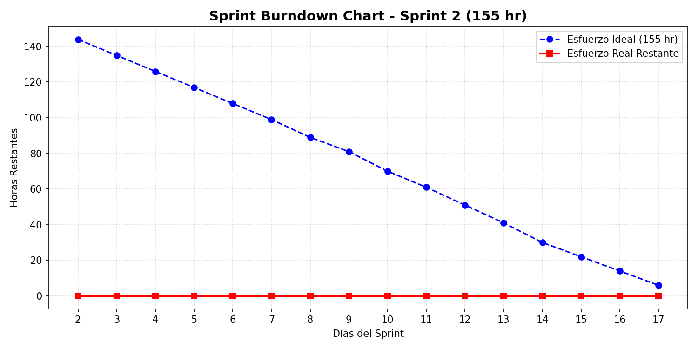

| Día Laborable | Fecha Calendario | Horas Restantes (Línea Ideal) | Horas Restantes (Línea Real) |       Estado del Sprint       |
| :-----------: | :--------------: | :---------------------------: | :--------------------------: | :---------------------------: |
|     Día 0     |    10/09/2026    |           155.0 hr            |           155.0 hr           |         Planificación         |
|     Día 1     |    11/09/2026    |           146.4 hr            |           150.0 hr           |           En curso            |
|     Día 2     |    12/09/2026    |           137.8 hr            |           144.0 hr           |           En curso            |
|     Día 3     |    15/09/2026    |           129.2 hr            |           135.0 hr           |           En curso            |
|     Día 4     |    16/09/2026    |           120.6 hr            |           126.0 hr           |           En curso            |
|     Día 5     |    17/09/2026    |           111.9 hr            |           117.0 hr           |           En curso            |
|     Día 6     |    18/09/2026    |           103.3 hr            |           108.0 hr           |           En curso            |
|     Día 7     |    19/09/2026    |            94.7 hr            |           99.0 hr            |           En curso            |
|     Día 8     |    22/09/2026    |            86.1 hr            |           89.0 hr            |           En curso            |
|     Día 9     |    23/09/2026    |            77.5 hr            |           81.0 hr            |           En curso            |
|    Día 10     |    24/09/2026    |            68.9 hr            |           70.0 hr            |           En curso            |
|    Día 11     |    25/09/2026    |            60.3 hr            |           61.0 hr            |           En curso            |
|    Día 12     |    26/09/2026    |            51.7 hr            |           51.0 hr            |           En curso            |
|    Día 13     |    29/09/2026    |            43.1 hr            |           41.0 hr            |           En curso            |
|    Día 14     |    30/09/2026    |            34.4 hr            |           30.0 hr            |           En curso            |
|    Día 15     |    01/10/2026    |            25.8 hr            |           22.0 hr            |            Fase QA            |
|    Día 16     |    02/10/2026    |            17.2 hr            |           14.0 hr            |            Fase QA            |
|    Día 17     |    03/10/2026    |            8.6 hr             |            6.0 hr            |  QA Cierre & Pre-Aceptación   |
|    Día 18     |    05/10/2026    |            0.0 hr             |            0.0 hr            | Review, Retro & Freeze (100%) |

*(Nota: Las fechas 06 y 08 de octubre de 2026 corresponden formalmente a la presentación y defensa docente del incremento ante la cátedra de Sistemas-2).*

### 6.6.2 Gráfica Burnup (Tareas Completadas vs. Alcance Total)

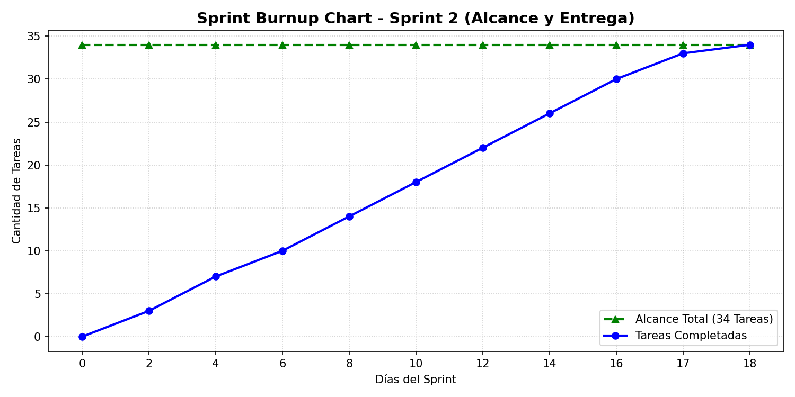

| Hito Temporal |   Fecha    | Alcance Total Planificado | Tareas Técnicas Completadas | % Avance Físico |
| :-----------: | :--------: | :-----------------------: | :-------------------------: | :-------------: |
|     Día 0     | 10/09/2026 |         34 tareas         |          0 tareas           |      0.0%       |
|     Día 2     | 12/09/2026 |         34 tareas         |          3 tareas           |      8.8%       |
|     Día 4     | 16/09/2026 |         34 tareas         |          7 tareas           |      20.6%      |
|     Día 6     | 18/09/2026 |         34 tareas         |          10 tareas          |      29.4%      |
|     Día 8     | 22/09/2026 |         34 tareas         |          14 tareas          |      41.2%      |
|    Día 10     | 24/09/2026 |         34 tareas         |          18 tareas          |      52.9%      |
|    Día 12     | 26/09/2026 |         34 tareas         |          22 tareas          |      64.7%      |
|    Día 14     | 30/09/2026 |         34 tareas         |          26 tareas          |      76.5%      |
|    Día 16     | 02/10/2026 |         34 tareas         |          30 tareas          |      88.2%      |
|    Día 17     | 03/10/2026 |         34 tareas         |          33 tareas          |      97.1%      |
|    Día 18     | 05/10/2026 |         34 tareas         |          34 tareas          |     100.0%      |

---

## 6.7 GRÁFICA DE ESFUERZO Y DATOS DE ESFUERZO

### 6.7.1 Datos de Esfuerzo por Tarea – Estimado vs. Real

Planificado: 155h | Ejecutado Real: 165h | Desviación Neta: +10h (+6.45%):

|  Nro  |  ID Tarea  | Descripción Técnica                                                                                               | Responsable      | Est.  | Real  | Desv. | Causa Técnica de la Desviación                                                                                          |
| :---: | :--------: | :---------------------------------------------------------------------------------------------------------------- | :--------------- | :---: | :---: | :---: | :---------------------------------------------------------------------------------------------------------------------- |
|  34   | **SP2-34** | Diseñar interfaz formulario previo (Web y Móvil)                                                                  | Larrazabal Julio |  4h   |  4h   |  0h   | Diseño ágil y reutilización del sistema de componentes Figma del Sprint 1.                                              |
|  35   | **SP2-35** | Implementar backend formulario previo JSONB                                                                       | Mujica Andy      |  8h   |  9h   |  +1h  | Complejidad en la validación dinámica de esquemas anidados para preguntas Likert.                                       |
|  36   | **SP2-36** | Pruebas funcionales formulario previo                                                                             | Velasco Rolando  |  3h   |  3h   |  0h   | Casos de prueba de caja negra ejecutados según plan sin incidencias mayores.                                            |
|  37   | **SP2-37** | Diseñar interfaz historia clínica electrónica                                                                     | Larrazabal Julio |  4h   |  4h   |  0h   | Diseño modular por pestañas (anamnesis, examen mental, CIE y metas terapéuticas).                                       |
|  38   | **SP2-38** | Implementar backend historia clínica y CIE                                                                        | Mujica Andy      |  8h   |  9h   |  +1h  | Carga y optimización del catálogo CIE-10/11 con búsqueda indexada por trigramas.                                        |
|  39   | **SP2-39** | Pruebas integridad y confidencialidad RBAC                                                                        | Velasco Rolando  |  3h   |  3h   |  0h   | Validación exitosa del bloqueo HTTP 403 para terapeutas no asignados al caso.                                           |
|  40   | **SP2-40** | Diseñar interfaz notas SOAP, evolución y tareas                                                                   | Larrazabal Julio |  4h   |  4h   |  0h   | Estructuración en 4 cuadrantes SOAP y línea de tiempo longitudinal.                                                     |
|  41   | **SP2-41** | Implementar registro notas SOAP y tareas                                                                          | Condori Marilyn  |  8h   |  9h   |  +1h  | Integración del autoguardado en borrador y control de concurrencia en la nota.                                          |
|  42   | **SP2-42** | Pruebas notas SOAP, acuerdos y tareas                                                                             | Velasco Rolando  |  3h   |  3h   |  0h   | Verificación de estados de tareas y visualización cronológica en timeline.                                              |
|  43   | **SP2-43** | Diseñar interfaz consentimientos informados                                                                       | Larrazabal Julio |  3h   |  3h   |  0h   | Maquetación del visor de términos legales y canvas de firma táctil.                                                     |
|  44   | **SP2-44** | Implementar consentimientos y sellado SHA-256                                                                     | Delgado Caleb    |  6h   |  8h   |  +2h  | Ajustes en la generación de hash SHA-256 en Flutter y compilación de PDF firmado.                                       |
|  45   | **SP2-45** | Pruebas consentimientos y firmas digitales                                                                        | Condori Marilyn  |  2h   |  2h   |  0h   | Comprobación de inmutabilidad del registro y almacenamiento en PostgreSQL.                                              |
|  46   | **SP2-46** | Implementar cierre de caso y derivación médica                                                                    | Condori Marilyn  |  6h   |  6h   |  0h   | Lógica fluida de alta terapéutica y plantilla de referencia médica a psiquiatría.                                       |
|  47   | **SP2-47** | Pruebas aceptación cierre y derivación                                                                            | Romero Maria     |  3h   |  3h   |  0h   | Comprobación de bloqueo de citas para casos cerrados y emisión de alertas.                                              |
|  48   | **SP2-48** | Refinar HU-35 y reglas de no uso de IA                                                                            | Romero Maria     |  2h   |  2h   |  0h   | Definición estricta de salvaguardas éticas y prohibición de diagnósticos automáticos.                                   |
|  49   | **SP2-49** | Definir consentimiento y vocabulario IA                                                                           | Condori Marilyn  |  4h   |  4h   |  0h   | Estandarización de términos clínicos para mapeo de síntomas en preconsulta.                                             |
|  50   | **SP2-50** | Pasarela segura de IA, minimización y RBAC                                                                        | Mujica Andy      |  8h   |  9h   |  +1h  | Implementación del middleware de sanitización de PII y bitácora de auditoría.                                           |
|  51   | **SP2-51** | Vista web de borrador IA y revisión humana                                                                        | Larrazabal Julio |  5h   |  6h   |  +1h  | Maquetación del visor de reglas explicativas y botones de aceptar/descartar.                                            |
|  52   | **SP2-52** | Estados móviles de consentimiento y aviso IA                                                                      | Delgado Caleb    |  5h   |  5h   |  0h   | Implementación del diálogo informativo de consentimiento en Flutter.                                                    |
|  53   | **SP2-53** | QA privacidad, fallos y rechazo salidas IA                                                                        | Velasco Rolando  |  5h   |  5h   |  0h   | Pruebas de casos negativos y comprobación de que el fallo active el modo manual.                                        |
|  54   | **SP2-54** | Motor de reglas clínicas de preconsulta                                                                           | Romero Maria     |  5h   |  5h   |  0h   | Desarrollo exitoso de reglas heurísticas de priorización asignado a Romero.                                             |
|  55   | **SP2-55** | Diseñar interfaz conversacional de Chatbot (Web/Móvil)                                                            | Larrazabal Julio |  3h   |  3h   |  0h   | Diseño del widget flotante de chat y panel de transferencia humana.                                                     |
|  56   | **SP2-56** | Motor conversacional Chatbot y WebSockets                                                                         | Mujica Andy      |  8h   |  9h   |  +1h  | Implementación de intents clínicos, contención de crisis y canal WebSocket.                                             |
|  57   | **SP2-57** | Pruebas funcionales de Chatbot y crisis clínica                                                                   | Velasco Rolando  |  3h   |  3h   |  0h   | Validación de respuestas de orientación, derivación humana y números 24/7.                                              |
|  58   | **SP2-58** | Backend Middleware de Auditoría y Cifrado AES-256 Fernet (CU5 / Criterio 3)                                       | Mujica Andy      |  4h   |  4h   |  0h   | Implementación exitosa de rotación de llaves dinámicas y permisos estrictos 0600 en archivo.                            |
|  59   | **SP2-59** | UI Visor Web de Bitácora Confidencial y Modal de Llave (CU5 / Criterio 3)                                         | Larrazabal Julio |  4h   |  4h   |  0h   | Modal de desafío con clave maestra de desarrollador y renderizado exclusivo en memoria volátil.                         |
|  60   | **SP2-60** | QA Inviolabilidad de Bitácora, Permisos 0600 y Huso Horario (CU5 / Criterio 3)                                    | Velasco Rolando  |  3h   |  3h   |  0h   | Pruebas de penetración sobre archivo físico y comprobación de sellado temporal `America/La_Paz`.                       |
|  61   | **SP2-61** | Motor Backend de Reportes QBE y Exportadores OpenPyXL/CSV/HTML (CU25 / Criterio 5)                                | Condori Marilyn  |  5h   |  5h   |  0h   | Procesamiento eficiente de consultas analíticas y generación de hojas Excel nativas con estilos.                        |
|  62   | **SP2-62** | UI Constructor de Reportes QBE y Comandos de Voz Web Speech API (CU25 / Criterio 5)                               | Larrazabal Julio |  5h   |  6h   |  +1h  | Adaptación de compatibilidad cross-browser y gramática fonética para comandos vocales en español.                       |
|  63   | **SP2-63** | QA Reportes Dinámicos, Proyecciones y Comandos Vocales (CU25 / Criterio 5)                                        | Velasco Rolando  |  3h   |  3h   |  0h   | Validación de precisión de captura vocal y descarga íntegra de archivos multiformato.                                 |
|  64   | **SP2-64** | Scripts y Endpoints de Backup Automático y Manual `pg_dump` con gzip (CU28 / Criterio 6)                           | Mujica Andy      |  5h   |  5h   |  0h   | Parametrización de respaldos por tenant individual y cluster global con streaming HTTP.                                 |
|  65   | **SP2-65** | UI Consola SuperAdmin de Backups y Carga de Restauración (CU28 / Criterio 6)                                      | Delgado Caleb    |  4h   |  5h   |  +1h  | Integración de barra de progreso reactiva con `HttpEventType.UploadProgress` para archivos SQL pesados (>50MB).       |
|  66   | **SP2-66** | Script de Población Masiva Datasets 15 Tenants y Aceptación (Criterio 8 / M1)                                     | Romero / Mujica  |  5h   |  5h   |  0h   | Inserción masiva de más de 25,000 registros sintéticos distribuidos en 15 clínicas con 4-12 meses de historia.          |
|  67   | **SP2-67** | QA y Verificación de Integridad en Restauración `pg_restore` (CU28 / Criterio 6)                                  | Velasco Rolando  |  4h   |  4h   |  0h   | Comprobación de integridad referencial, secuencias y aislamiento multi-tenant tras restauración en caliente.            |
|  TOT  |  **SP2**   | Total Planificado vs. Ejecutado (34 Tareas Consolidadas)                                                          | Equipo SCRUM     | 155h  | 165h  |  +10h | Desviación neta de +10 horas (+6.45%) por ajustes criptográficos Flutter, JSONB, Web Speech API, streaming y WebSockets.|

### 6.7.2 Gráfica Comparativa de Esfuerzo por Tarea

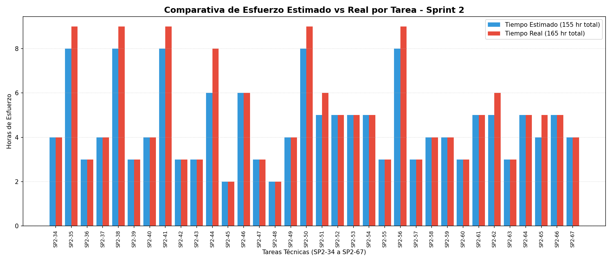

---

## 6.8 SCRUM TASKBOARD

Estado final al cierre formal del Sprint 2 y consolidación de los 8 Criterios (34 de 34 tareas en **DONE**):

| To Do (0) | In Progress (0) | In Review / QA (0) | Done (34 Tareas Completadas)                                                                                                                                                                                                                                                                                                                                                                                                                                                                                                                                                                                                                                                                                                                                                                                                                                                                                                                                                                                                                                                                                                                                                                        |
| :-------: | :-------------: | :----------------: | :-------------------------------------------------------------------------------------------------------------------------------------------------------------------------------------------------------------------------------------------------------------------------------------------------------------------------------------------------------------------------------------------------------------------------------------------------------------------------------------------------------------------------------------------------------------------------------------------------------------------------------------------------------------------------------------------------------------------------------------------------------------------------------------------------------------------------------------------------------------------------------------------------------------------------------------------------------------------------------------------------------------------------------------------------------------------------------------------------------------------------------------------------------------------------------------------------- |
|     —     |        —        |         —          | • **SP2-34:** UI Intake Web/Móvil *(Larrazabal)*<br>• **SP2-35:** Backend Intake JSONB *(Mujica)*<br>• **SP2-36:** QA Intake *(Velasco)*<br>• **SP2-37:** UI Historia Clínica *(Larrazabal)*<br>• **SP2-38:** Backend HC y CIE *(Mujica)*<br>• **SP2-39:** QA RBAC Clínico *(Velasco)*<br>• **SP2-40:** UI Notas SOAP *(Larrazabal)*<br>• **SP2-41:** Backend Notas SOAP *(Condori)*<br>• **SP2-42:** QA Notas SOAP *(Velasco)*<br>• **SP2-43:** UI Consentimientos *(Larrazabal)*<br>• **SP2-44:** Firma SHA-256 Flutter *(Delgado)*<br>• **SP2-45:** QA Consentimientos *(Condori)*<br>• **SP2-46:** Cierre y Derivación *(Condori)*<br>• **SP2-47:** Aceptación Cierre *(Romero)*<br>• **SP2-48:** Refinamiento IA *(Romero)*<br>• **SP2-49:** Definición IA Clínica *(Condori)*<br>• **SP2-50:** Pasarela IA RBAC *(Mujica)*<br>• **SP2-51:** UI Borrador IA Web *(Larrazabal)*<br>• **SP2-52:** Consentimiento IA Móvil *(Delgado)*<br>• **SP2-53:** QA Privacidad IA *(Velasco)*<br>• **SP2-54:** Motor Reglas IA *(Romero)*<br>• **SP2-55:** UI Chatbot Orientación *(Larrazabal)*<br>• **SP2-56:** Backend Motor Chatbot *(Mujica)*<br>• **SP2-57:** QA Chatbot y Transferencia *(Velasco)*<br>• **SP2-58:** Backend Middleware Bitácora Cifrada *(Mujica)*<br>• **SP2-59:** UI Visor Bitácora y Llave *(Larrazabal)*<br>• **SP2-60:** QA Inviolabilidad Bitácora *(Velasco)*<br>• **SP2-61:** Motor Reportes QBE/Excel *(Condori)*<br>• **SP2-62:** UI Reportes QBE y Web Speech *(Larrazabal)*<br>• **SP2-63:** QA Reportes y Voz *(Velasco)*<br>• **SP2-64:** Scripts Backup pg_dump *(Mujica)*<br>• **SP2-65:** UI Consola Backup/Restore *(Delgado)*<br>• **SP2-66:** Datasets Masivos 15 Tenants *(Romero / Mujica)*<br>• **SP2-67:** QA Restauración pg_restore *(Velasco)* |

---

# ANÁLISIS DE LAS CARACTERÍSTICAS GENERALES DE LOS PROYECTOS DE LA MATERIA

Evaluación exhaustiva de las 8 Características Generales exigidas por la cátedra de Sistemas-2 aplicadas a SIGEPSI:

## 1. Solución Universal

> **Requerimiento de la Cátedra:** *El sistema debe ser desarrollado como para permitir ser puesto en marcha en cualquier empresa/negocio donde se requiera la aplicación, sin estar acoplado de forma rígida a un único establecimiento físico.*

**Impacto en la Plataforma SIGEPSI:**  
La plataforma SIGEPSI se diseñó desde sus cimientos como una solución SaaS Multi-Tenant basada en esquemas independientes de PostgreSQL (django-tenants). Esto significa que la misma instancia de software puede ser desplegada y operar indistintamente para una clínica privada grande, una red de consultorios de salud mental, un gabinete psicológico universitario o un psicólogo independiente. Cada entidad suscrita posee su propia parametrización de moneda (Bs./USD), catálogo de especialidades clínicas, políticas de cancelación de citas, tarifas personalizadas y plantillas de consentimiento informado adaptadas a sus regulaciones locales.

**Estado Actual de Implementación:** **[APLICADO]** — El aislamiento lógico por esquemas y la parametrización institucional se encuentran 100% operativos desde el Sprint 0 y consolidados en los Sprints 1 y 2.

**Plan Técnico de Adecuación (Sprints 3 y 4):**  
Para el Sprint 3 y 4 se añadirá un panel de onboarding institucional guiado para que un nuevo centro psicológico configure su logotipo, colores institucionales y textos de términos y condiciones sin requerir asistencia técnica manual.

---

## 2. Gestión de Usuario y Privilegios Flexibles sobre Componentes

> **Requerimiento de la Cátedra:** *Se debe poder crear usuarios, grupos de usuarios y asignar privilegios de manera flexible y abierta sobre todo tipo de componente que tenga el sistema (Opciones de menú, formularios, botones, Text, label, etc.). De entrada, no se sabe cuántos usuarios, ni qué grupos habrá ni qué privilegios tendrá cada grupo. En el sistema deberá haber un administrador que se encargue de este trabajo.*

**Impacto en la Plataforma SIGEPSI:**  
En el sector salud mental, el control granular es crítico: un recepcionista no puede ver diagnósticos clínicos (CIE) ni notas de sesión, mientras que un psicólogo tratante solo debe ver a sus pacientes asignados y no a los de otros colegas. El impacto en la plataforma requiere desacoplar los roles fijos y permitir que el Administrador del Centro cree roles institucionales dinámicos (ej. 'Psicólogo Pasante', 'Trabajador Social', 'Supervisor Clínico') y asocie permisos atómicos tanto a nivel de API REST (permisos Django) como a nivel de interfaz de usuario (directivas estructurales en Angular que ocultan botones de guardado, inputs de notas o menús).

**Estado Actual de Implementación:** **[EN PROCESO DE APLICACIÓN]** — Actualmente se cuenta con un modelo RBAC estricto en backend (Sprint 0) y directivas de seguridad en frontend que condicionan vistas y botones según roles predefinidos (SuperAdmin, Admin, Coordinador, Psicólogo, Recepcionista, Paciente). Falta habilitar la matriz dinámica en UI para que el administrador cree grupos arbitrarios y marque checkboxes por componente.

**Plan Técnico de Adecuación (Sprints 3 y 4):**  
En el Sprint 3 se construirá la pantalla 'Gestor Dinámico de Roles y Permisos de Componentes' en Angular, permitiendo al Administrador crear nuevos roles y tildar el acceso granular a nivel de ruta, formulario y botón de acción, persistiendo la matriz en una tabla relacional tenant_permisocomponente.

---

## 3. Log / Bitácora Confidencial y Llave Única del Desarrollador

> **Requerimiento de la Cátedra:** *Se debe poder registrar en un archivo log todas las acciones realizadas por los usuarios: IP de la máquina, usuario, fecha, hora y acción realizada. Debe tomar en cuenta que este archivo es confidencial por lo que ni el administrador de BD debe verlo; la única forma de ver este contenido es vía una llave del desarrollador única y solo desde el sistema.*

**Impacto en la Plataforma SIGEPSI:**  
Tratándose de historiales clínicos, notas SOAP y expedientes confidenciales protegidos por secreto médico-legal, el registro de auditoría debe ser inviolable y reflejar con exactitud la temporalidad jurídica nacional. Por instrucción expresa de la cátedra (Audio M1 y K2), la bitácora captura el 100% de las transacciones registrando:
1. **IP de origen y User-Agent:** Trazabilidad del dispositivo y red emisora mediante middleware HTTP síncrono.
2. **Identidad del Usuario y Rol:** Identificador de usuario autenticado, correo institucional y perfil operativo en el esquema tenant.
3. **Fecha y Hora en Huso Horario Local Estricto:** Se garantiza que los timestamps no queden desfasados con la hora UTC de los servidores cloud, configurando formalmente en Django `TIME_ZONE = 'America/La_Paz'` (GMT-4, hora oficial del Estado Plurinacional de Bolivia) mediante `now = timezone.localtime(timezone.now())` para que cada registro tenga plena validez jurídica forense.
4. **Acción Realizada y Payload:** Operación exacta (creación de nota SOAP, apertura de historia clínica, emisión de derivación, login/logout).

Para garantizar la confidencialidad absoluta (impidiendo que el propio Administrador de Base de Datos o intrusos con acceso al servidor puedan leer el contenido), los eventos se cifran simétricamente en disco utilizando **Fernet (AES-256 en modo CBC con HMAC-SHA256 para integridad)**. Los archivos generados se denominan `audit-YYYY-MM-DD.log.enc` y se almacenan con permisos POSIX estrictos `0600` (lectura/escritura exclusiva del proceso del servidor).  
La única vía para descifrar e inspeccionar este archivo es a través del endpoint `/api/v1/audit/log/` inyectando en la cabecera HTTP la **Llave Única del Desarrollador (`AUDIT_LOG_KEY`)**, la cual deriva la clave criptográfica en memoria mediante SHA-256 y nunca se persiste en texto plano en la base de datos.

**Estado Actual de Implementación:** **[APLICADO / CONSOLIDADO EN SPRINT 2]** — Totalmente implementado y operativo en backend (`backend/audit/middleware.py`, `backend/audit/services.py`, `backend/audit/views.py`) y frontend (`web/src/app/modules/audit/`). El middleware intercepta cada petición transaccional, genera la entrada cifrada en disco, y la interfaz web solo descifra los eventos en memoria cuando el SuperAdmin introduce la Llave Maestra del Desarrollador, desplegando la grilla forense con filtro por fecha y tenant.

---

## 4. Facilidad de Uso y Asistencia en Línea

> **Requerimiento de la Cátedra:** *Diseñar el sistema con una interfaz donde el usuario no invierta tiempo en aprender a usarlo, usar componentes y estrategias para facilitar la entrada de datos, y proveer mecanismos de asistencia en línea en caso de dudas sobre el uso del sistema.*

**Impacto en la Plataforma SIGEPSI:**  
Los profesionales de la salud mental y los pacientes requieren flujos sin fricción. Para el psicólogo, redactar notas SOAP no debe suponer lidiar con formularios engorrosos; por ello se implementó el autoguardado en borrador, autocompletado inteligente de diagnósticos CIE mediante búsqueda reactiva, y selectores de chips rápidos para técnicas aplicadas. Para el paciente, la aplicación Flutter utiliza asistentes secuenciales tipo stepper con explicaciones claras en cada paso. La asistencia en línea impacta directamente en la integración del Chatbot de Orientación al Paciente (CU20) con protocolo de contención de crisis 24/7 y transferencia síncrona a recepción.

**Estado Actual de Implementación:** **[APLICADO]** — Las interfaces web y móvil aplican principios de diseño ergonómico de UI/UX (Figma, palettes suaves, validación asíncrona, autoguardado y componentes interactivos). El Chatbot conversacional de orientación al paciente y escalamiento a operador humano (CU20 / HU-36) fue implementado e integrado exitosamente en el Sprint 2 tanto en la aplicación web (Angular 17) como en la aplicación móvil (Flutter 3.x).

**Plan Técnico de Adecuación (Sprints 3 y 4):**  
Para el Sprint 3 se incorporará la librería `Driver.js` en Angular para proveer visitas guiadas interactivas paso a paso en el primer inicio de sesión de recepcionistas y terapeutas, y se ampliará la base de conocimiento de preguntas frecuentes del Chatbot.

---

## 5. Reportes Personalizables y Exportación Multiformato

> **Requerimiento de la Cátedra:** *Aparte de los reportes obvios, debe existir un mecanismo que permita al usuario construir sus propios reportes, indicando qué columnas, criterios de selección y orden se debe mostrar. Todo reporte debe contar con una interfaz de filtrado previo y facilidad de exportación a formatos como Excel, HTML, eMail y PDF.*

**Impacto en la Plataforma SIGEPSI:**  
En estricta correspondencia con las directrices del Audio **M1**, el sistema cumple con las **3 modalidades obligatorias de reportes**:
1. **Reporte Estándar / Normal:** Informes tabulares convencionales preconfigurados de citas del día, agenda semanal y pacientes activos.
2. **Reporte Query by Example (QBE):** Motor dinámico donde el usuario selecciona la fuente de datos (`citas`, `pacientes`, `notas_soap`, `psicologos`), tilda las columnas específicas que desea visualizar, define filtros booleanos/numéricos/temporales y establece el criterio de ordenación.
3. **Reporte por Comando de Voz:** Integración en la interfaz de Angular mediante la **Web Speech API** del navegador, permitiendo al usuario presionar el botón de micrófono y dictar instrucciones habladas (ej. *"Mostrar reporte de citas del psicólogo Carlos en septiembre"*). El módulo procesa el audio en lenguaje natural, mapea los parámetros semánticos (entidad, filtro, fecha) y configura automáticamente el formulario QBE antes de su renderizado.

Asimismo, todo reporte generado cuenta con soporte nativo de exportación multiformato:
* **Excel (.xlsx):** Generación de libros binarios mediante librería `OpenPyXL`, aplicando estilos tipográficos institucionales, cabeceras del centro psicológico y celdas autoajustadas.
* **CSV:** Archivo de texto plano delimitado por comas con codificación UTF-8 con BOM para interoperabilidad analítica.
* **HTML:** Vista previa web interactiva responsive apta para impresión directa desde el navegador.
* **eMail:** Despacho automatizado del reporte generado en segundo plano como adjunto a través del servidor SMTP (Django Email API) a la casilla del directivo solicitante.

**Estado Actual de Implementación:** **[APLICADO / CONSOLIDADO EN SPRINT 2]** — El motor completo de reportes se encuentra desarrollado y operativo en backend (`backend/reportes/views.py`, `backend/reportes/services.py`, `backend/reportes/exporters.py`) y en frontend (`web/src/app/modules/reportes/`). El endpoint `/api/reportes/personalizado/` procesa las consultas dinámicas por tenant y los endpoints de exportación entregan los streams en Excel, CSV, HTML y correo SMTP.

---

## 6. Backup y Restore (Copia de Seguridad y Restauración)

> **Requerimiento de la Cátedra:** *Funciones para posibilitar las copias de seguridad y restauración de todo el sistema.*

**Impacto en la Plataforma SIGEPSI:**  
En apego a lo expuesto en el Audio **M1**, la plataforma SIGEPSI implementa la política de copias de seguridad bajo **dos modalidades indispensables**:
1. **Modalidad Automática (Programada en Cloud):** Tarea programada en el servidor en la nube (cron job ejecutado periódicamente a las 03:00 AM hora de Bolivia) que realiza un volcado completo de PostgreSQL mediante la utilidad `pg_dump`, comprime el archivo en formato gzip (`.sql.gz`), verifica la integridad del artefacto y lo transfiere a un almacenamiento seguro en la nube, controlando el ciclo de retención para optimizar costos de storage.
2. **Modalidad Manual (A Demanda desde el Sistema):** Desde la consola web del SuperAdministrador (`IU_ConsolaBackupRestore`), el operador puede solicitar un respaldo en cualquier momento seleccionando:
   * **Origen:** Ámbito Global (toda la base de datos) o Ámbito Tenant Específico (aislando el esquema relacional de una clínica determinada, ej. `centro_esperanza`).
   * **Destino:** Descarga directa en navegador en formato comprimido `.dump` / `.sql.gz` o almacenamiento persistente.
   * **Integridad:** Cálculo automático de Checksum criptográfico SHA-256 para certificar que el archivo no sufra alteraciones.

**Mecanismo de Restauración (Restore):**  
La plataforma incluye el proceso inverso para restablecer el sistema o un centro específico en caso de contingencia. La interfaz web provee un área de carga segura donde el SuperAdmin sube el archivo de volcado; el backend valida la firma criptográfica y ejecuta `pg_restore` (utilizando flags `--clean --if-exists`) dentro de una transacción atómica, garantizando que si ocurre cualquier fallo durante la carga, la base de datos se revierte automáticamente a su estado original sin corrupción de esquemas.

**Estado Actual de Implementación:** **[APLICADO / CONSOLIDADO EN SPRINT 2]** — Respaldo automático configurado en el servidor cloud y endpoints administrativos (`CU28`) desarrollados en Django para orquestar `pg_dump` y `pg_restore` parametrizados por esquema tenant, respaldados por la consola visual del SuperAdmin.

---

## 7. Distribución Funcional Web vs. Móvil

> **Requerimiento de la Cátedra:** *Se debe identificar qué funcionalidades son convenientes para implementar como app Web y qué funcionalidades como App Móvil, justificando la división según el rol y contexto de uso.*

**Impacto en la Plataforma SIGEPSI:**  
El proyecto SIGEPSI definió con precisión metodológica la separación de canales: 1) La Plataforma Web (Angular 17) está optimizada para la gestión de escritorio de psicólogos, recepcionistas, directores y administradores que requieren pantallas amplias para redactar notas SOAP, consultar matrices de disponibilidad horaria semanal, revisar expedientes clínicos longitudinales, auditar la bitácora cifrada y construir reportes QBE analíticos. 2) La Aplicación Móvil (Flutter 3.x) está diseñada para el paciente y su cotidianidad: acceso biométrico rápido, consulta de próximas citas, teleconsulta WebRTC directa, diligenciamiento ágil de formularios previos paso a paso, cumplimiento de tareas inter-sesiones en cualquier momento, firma táctil en pantalla y conversación interactiva con el chatbot de orientación clínica.

*(Nota metodológica según Audio M2: El soporte PWA avanzado en Web y el modo Offline estricto con base de datos local SQLite y sincronización bidireccional al reconectar corresponden exclusivamente al alcance técnico del **Sprint 3 y Segundo Parcial**, manteniéndose para el Sprint 2 la conectividad online fluida en ambos canales).*

**Estado Actual de Implementación:** **[APLICADO]** — La delimitación funcional Web vs. Móvil se encuentra implementada y consolidada en producción incremental en los Sprints 1 y 2.

---

## 8. Modelo SaaS en la Nube y Carga Masiva de Datos (Datasets)

> **Requerimiento de la Cátedra:** *El sistema deberá ser desarrollado bajo el enfoque del software como servicio (SaaS) donde lo que se venderá a los clientes son suscripciones para usar el sistema y todo esto debe estar desplegado en la nube en servicios como, por ejemplo: AWS de Amazon, Google Cloud, Azure.*

**Impacto en la Plataforma SIGEPSI:**  
El proyecto no es una solución aislada para un único consultorio, sino una plataforma de negocio SaaS en la nube donde múltiples centros de salud mental operan sobre la misma infraestructura física pero con esquemas lógicos PostgreSQL completamente aislados (`django-tenants`).  

En estricta observancia a lo exigido en el Audio **M1**:
* **Catálogo de 10 a 15 Empresas (Tenants):** Para la demostración y defensa docente, el equipo actuará como Administrador SaaS y expondrá un catálogo de 10 a 15 centros psicológicos formalmente registrados en el sistema (ej. *Centro Psicológico Esperanza*, *Clínica San Gabriel*, *Gabinete Psicológico UAGRM*, *Consultorios Mente Sana*, *Instituto de Neuropsicología Bolivia*, etc.), permitiendo al docente ingresar a cualquiera de ellos para constatar el aislamiento absoluto de usuarios, permisos, agendas e historiales.
* **Carga Masiva de Datos Históricos (Datasets):** Se prohibió la presentación con información ingresada manualmente al momento de la defensa. Por ello, se diseñó e implementó un script de carga masiva (`seed_tenants_masivo.py`) que puebla automáticamente las 15 empresas con datos históricos estructurados simulando **de 4 meses a 1 año de operaciones reales**: cientos de citas agendadas, atendidas y canceladas, expedientes clínicos con diagnósticos CIE, notas SOAP longitudinales y reportes QBE poblados con datos estadísticos reales para respaldar métricas y analítica.

**Estado Actual de Implementación:** **[APLICADO / CONSOLIDADO EN SPRINT 2]** — Despliegue en la nube mediante contenedores Docker en Render Cloud Platform con base de datos PostgreSQL 16 administrada, proxy inverso, subdominios por tenant y script de carga masiva con datasets históricos preparado para la defensa.

**Plan Técnico de Adecuación (Sprints 3 y 4):**  
En el Sprint 4 se completará el módulo de facturación y control de suscripciones (CU26), automatizando la pasarela de pagos de suscripción SaaS, la emisión de facturas electrónicas y el bloqueo suave por vencimiento de plan.

---

